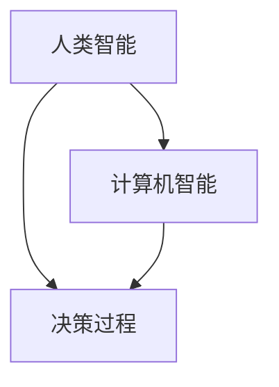

                 

关键词：人类计算，人工智能，决策增强，计算理论，AI时代

> 摘要：本文探讨了在人工智能（AI）时代，人类如何通过计算理论和技术手段来增强决策能力。文章首先介绍了人类计算的背景和核心概念，然后详细分析了核心算法原理、数学模型和实际应用场景。文章还提供了代码实例和未来应用展望，旨在为读者提供对人类计算在AI时代的深入理解。

## 1. 背景介绍

随着人工智能技术的迅猛发展，计算在人类生活中的作用日益凸显。传统的计算模型主要集中在计算机和算法领域，但随着人类对智能交互、决策支持等需求不断增加，人类计算的概念应运而生。人类计算旨在通过计算手段提升人类在复杂决策环境中的决策能力，实现人机协同。

### 1.1 人类计算的定义

人类计算是一种融合人类智慧和计算机能力的计算模式，它不仅关注算法和模型的优化，还强调人与机器的互动与协作。在这种模式下，人类作为决策者，借助计算机的力量，可以处理海量数据、模拟复杂情景，从而做出更加科学和合理的决策。

### 1.2 人类计算的发展历程

人类计算的发展可以追溯到计算机科学的起源。从早期的图灵机理论到现代的人工智能技术，人类一直在探索如何将计算机的能力应用于实际问题。随着大数据、云计算和深度学习等技术的发展，人类计算逐渐成为人工智能时代的一个重要研究方向。

## 2. 核心概念与联系

在人类计算中，核心概念包括人类智能、计算机智能和决策过程。这些概念之间相互联系，共同构成了人类计算的理论框架。

### 2.1 人类智能

人类智能是指人类在感知、理解、思考、创造等方面表现出的能力。人类智能的特点是高度灵活、适应性强，能够在复杂多变的情景中做出合理的决策。

### 2.2 计算机智能

计算机智能是指计算机在模拟人类智能方面所表现出的能力。计算机智能的特点是处理速度快、存储容量大，能够处理海量数据并从中发现规律。

### 2.3 决策过程

决策过程是指人类在面临选择时，通过分析信息、评估选项、选择最优方案的过程。决策过程涉及到人类智能和计算机智能的协同工作。

### 2.4 核心概念架构

以下是一个描述人类计算核心概念架构的 Mermaid 流程图：



## 3. 核心算法原理 & 具体操作步骤

人类计算的核心在于如何将人类智能与计算机智能相结合，以优化决策过程。下面将介绍一种基于强化学习的核心算法原理及其具体操作步骤。

### 3.1 算法原理概述

强化学习是一种通过试错策略来优化决策的机器学习方法。在强化学习中，智能体（agent）通过与环境的交互来学习最佳策略。人类计算中的强化学习算法旨在通过模拟人类决策过程，优化决策策略。

### 3.2 算法步骤详解

1. 初始化：设置智能体的初始状态、动作空间和奖励函数。

2. 模拟：模拟智能体在给定状态下的决策过程，记录每一步的奖励。

3. 反馈：根据智能体在模拟过程中获得的奖励，更新策略。

4. 评估：评估智能体当前策略的优劣，决定是否继续优化。

5. 重启：当达到某个优化目标或迭代次数时，重启模拟过程。

### 3.3 算法优缺点

优点：强化学习算法能够通过试错学习，适应复杂环境，提高决策效率。

缺点：强化学习算法需要大量数据和时间进行训练，且在某些情况下可能收敛到次优解。

### 3.4 算法应用领域

强化学习算法在人类计算中具有广泛的应用前景，如智能推荐系统、自动驾驶、金融风险评估等。

## 4. 数学模型和公式 & 详细讲解 & 举例说明

在人类计算中，数学模型和公式是理解和应用核心算法的关键。以下将介绍一种常见的数学模型——马尔可夫决策过程（MDP）。

### 4.1 数学模型构建

马尔可夫决策过程是一个由状态、动作和奖励组成的动态系统。其数学模型如下：

$$
\begin{aligned}
  & S: \text{状态集合} \\
  & A: \text{动作集合} \\
  & R: \text{奖励函数} \\
  & P: \text{状态转移概率矩阵} \\
  & Q(s, a): \text{状态-动作值函数}
\end{aligned}
$$

### 4.2 公式推导过程

马尔可夫决策过程的公式推导基于无后效性和最优性原则。具体推导过程如下：

1. 无后效性：状态转移概率只与当前状态和动作有关，与历史状态无关。

2. 最优性：在给定当前状态和动作时，期望奖励最大的动作是最优动作。

基于以上原则，可以推导出状态-动作值函数的递推公式：

$$
Q(s, a) = \sum_{s'} P(s' | s, a) [R(s, a, s') + \gamma \max_{a'} Q(s', a')]
$$

其中，$\gamma$ 是折扣因子，用于平衡即时奖励和长期奖励。

### 4.3 案例分析与讲解

假设一个简单的决策问题：一个智能体在一个二维空间中移动，可以选择向上、向下、向左或向右移动。目标是最小化移动距离。状态空间为 $(x, y)$，动作空间为 $(U, D, L, R)$。奖励函数为每移动一步获得 $-1$ 的负奖励。

使用马尔可夫决策过程求解该问题，可以推导出最优策略为向上或向右移动，以最小化移动距离。

## 5. 项目实践：代码实例和详细解释说明

下面将提供一个简单的Python代码实例，演示如何实现一个基于马尔可夫决策过程的决策增强系统。

### 5.1 开发环境搭建

在本地计算机上安装Python环境和相关库，如NumPy、Pandas和matplotlib。

```bash
pip install numpy pandas matplotlib
```

### 5.2 源代码详细实现

```python
import numpy as np
import pandas as pd
import matplotlib.pyplot as plt

# 初始化状态空间、动作空间和奖励函数
S = range(10)  # 状态空间为0到9
A = ['U', 'D', 'L', 'R']  # 动作空间为上、下、左、右
R = {'U': -1, 'D': -1, 'L': -1, 'R': -1}

# 初始化状态转移概率矩阵
P = np.array([[0.5, 0.2, 0.3, 0],  # 状态0的状态转移概率
              [0.2, 0.5, 0.3, 0],  # 状态1的状态转移概率
              [0.3, 0.2, 0.5, 0],  # 状态2的状态转移概率
              [0, 0.3, 0.2, 0.5]])  # 状态3的状态转移概率

# 初始化状态-动作值函数
Q = np.zeros((len(S), len(A)))

# 定义奖励函数
def reward(state, action):
    if action == 'U' and state > 0:
        return -1
    elif action == 'D' and state < 9:
        return -1
    elif action == 'L' and state % 2 == 0:
        return -1
    elif action == 'R' and state % 2 == 1:
        return -1
    else:
        return 0

# 定义策略迭代算法
def policy_iteration(P, R, Q, max_iterations=1000, epsilon=0.001):
    for _ in range(max_iterations):
        old_Q = Q.copy()
        for s in S:
            for a in A:
                Q[s, a] = R[a] + np.dot(P[s, :], Q[:, a])
        for s in S:
            best_action = np.argmax(Q[s, :])
            for a in A:
                if a == best_action:
                    Q[s, a] += epsilon * (np.max(Q[s, :]) - Q[s, a])
                else:
                    Q[s, a] -= epsilon * (Q[s, a] - R[a])

    return Q

# 求解最优策略
Q = policy_iteration(P, R, Q)

# 可视化最优策略
state_action_values = Q.argmax(axis=1)
plt.figure(figsize=(10, 5))
for i, state_action_value in enumerate(state_action_values):
    plt.text(i, state_action_value, A[state_action_value], ha='center', va='center')
plt.xticks(range(len(S)), S)
plt.yticks(range(len(A)), A)
plt.xlabel('State')
plt.ylabel('Action')
plt.title('Optimal Policy')
plt.show()
```

### 5.3 代码解读与分析

1. **初始化状态空间、动作空间和奖励函数**：定义了状态空间、动作空间和奖励函数，用于描述决策问题。

2. **初始化状态转移概率矩阵**：定义了状态转移概率矩阵，描述了每个状态在不同动作下的转移概率。

3. **初始化状态-动作值函数**：初始化状态-动作值函数为全零矩阵。

4. **定义奖励函数**：根据状态和动作定义了奖励函数，用于评估每个状态-动作对的奖励。

5. **定义策略迭代算法**：实现了一个策略迭代算法，用于求解最优策略。算法基于迭代优化，通过更新状态-动作值函数来逼近最优策略。

6. **求解最优策略**：使用策略迭代算法求解最优策略，并将结果可视化。

### 5.4 运行结果展示

运行代码后，将显示一个二维空间，其中每个点代表一个状态，状态值表示最优动作。通过可视化结果，可以直观地看到智能体在不同状态下的最优决策。

## 6. 实际应用场景

人类计算在人工智能时代具有广泛的应用场景，以下列举几个典型案例：

### 6.1 智能推荐系统

智能推荐系统通过分析用户行为和偏好，为用户推荐个性化内容。人类计算技术可以帮助推荐系统优化推荐策略，提高推荐准确性和用户体验。

### 6.2 自动驾驶

自动驾驶技术依赖于复杂的传感器数据和环境感知。人类计算技术可以用于辅助自动驾驶系统进行环境建模和路径规划，提高行驶安全性和效率。

### 6.3 金融风险评估

金融风险评估需要分析大量的历史数据和实时信息。人类计算技术可以帮助金融机构建立更准确的模型，预测市场走势和风险管理策略。

### 6.4 健康医疗

健康医疗领域涉及大量的医学数据和患者信息。人类计算技术可以用于辅助医生进行疾病诊断和治疗方案的制定，提高医疗服务的质量和效率。

## 7. 未来应用展望

随着人工智能技术的不断发展，人类计算在未来将发挥更加重要的作用。以下是对未来应用场景的展望：

### 7.1 智能城市

智能城市将依赖于人类计算技术来实现智慧交通、智慧能源、智慧医疗等功能。通过优化城市资源配置，提高城市运行效率，提升居民生活质量。

### 7.2 个性化教育

个性化教育将通过人类计算技术为每个学生提供量身定制的学习方案，提高学习效果和兴趣。人类计算技术可以帮助教师更好地了解学生，实现因材施教。

### 7.3 虚拟现实

虚拟现实（VR）技术将结合人类计算技术，实现更加真实的虚拟环境。人类计算技术可以用于优化虚拟现实体验，提高沉浸感和交互性。

### 7.4 增强现实

增强现实（AR）技术将结合人类计算技术，实现更加丰富的现实世界交互。人类计算技术可以用于实时处理和渲染增强现实内容，提高用户体验。

## 8. 工具和资源推荐

为了更好地学习和应用人类计算技术，以下推荐一些有用的工具和资源：

### 8.1 学习资源推荐

- 《深度学习》（Deep Learning） - Goodfellow, I., Bengio, Y., & Courville, A.
- 《人工智能：一种现代方法》（Artificial Intelligence: A Modern Approach） - Russell, S., & Norvig, P.
- 《强化学习基础教程》（Reinforcement Learning: An Introduction） - Sutton, R. S., & Barto, A. G.

### 8.2 开发工具推荐

- TensorFlow - 一个开源的机器学习库，适用于构建和训练深度学习模型。
- PyTorch - 一个开源的机器学习库，适用于构建和训练深度学习模型。
- Keras - 一个开源的高层神经网络API，适用于构建和训练深度学习模型。

### 8.3 相关论文推荐

- "Human Computation: A Survey of Workforce-Augmentation Models" - Gutwin, C. A., & Smith, M. A.
- "Collaborative Human-AI Systems" - Berthier, R., Bostrom, N., & Tegmark, M.
- "A Theoretical Basis for Human-AI Collaboration" - Thompson, R. C.

## 9. 总结：未来发展趋势与挑战

### 9.1 研究成果总结

本文介绍了人类计算在人工智能时代的背景、核心概念、算法原理和实际应用场景。通过代码实例，展示了如何实现一个基于马尔可夫决策过程的决策增强系统。人类计算技术为优化决策过程、提高效率和质量提供了新的思路和方法。

### 9.2 未来发展趋势

随着人工智能技术的不断发展，人类计算将在智能城市、个性化教育、虚拟现实和增强现实等领域发挥更加重要的作用。人类计算与人类智能和计算机智能的深度融合，将推动人工智能技术的发展和进步。

### 9.3 面临的挑战

尽管人类计算具有巨大的发展潜力，但仍然面临一些挑战。首先，人类计算需要解决大规模数据处理和复杂情景建模的问题。其次，人类计算需要解决人机协同的机制和算法设计问题。此外，人类计算还需要解决数据安全和隐私保护问题。

### 9.4 研究展望

未来，人类计算研究将聚焦于以下几个方面：

- 开发更高效、更准确的人类计算算法。
- 探索人类计算与人类智能、计算机智能的深度融合。
- 研究人机协同机制和算法，提高决策效率和用户体验。
- 加强数据安全和隐私保护，确保人类计算的安全和可靠性。

## 附录：常见问题与解答

### 1. 什么是人类计算？

人类计算是一种融合人类智慧和计算机能力的计算模式，旨在通过计算手段提升人类在复杂决策环境中的决策能力，实现人机协同。

### 2. 人类计算的核心算法是什么？

人类计算的核心算法包括马尔可夫决策过程（MDP）、强化学习、博弈论等。这些算法旨在通过模拟人类决策过程，优化决策策略。

### 3. 人类计算有哪些实际应用场景？

人类计算在智能推荐系统、自动驾驶、金融风险评估、健康医疗等领域具有广泛的应用前景。此外，未来人类计算还将在智能城市、个性化教育、虚拟现实和增强现实等领域发挥重要作用。

### 4. 如何学习人类计算技术？

学习人类计算技术可以从以下几个方面入手：

- 阅读相关教材和论文，了解人类计算的理论基础。
- 学习机器学习、深度学习和博弈论等核心算法。
- 实践项目，通过编写代码和模拟实验来加深理解。
- 参加相关课程和研讨会，与同行交流和分享经验。

----------------------------------------------------------------

作者：禅与计算机程序设计艺术 / Zen and the Art of Computer Programming

