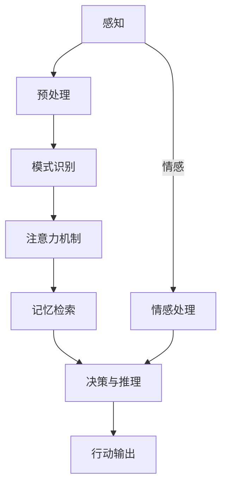
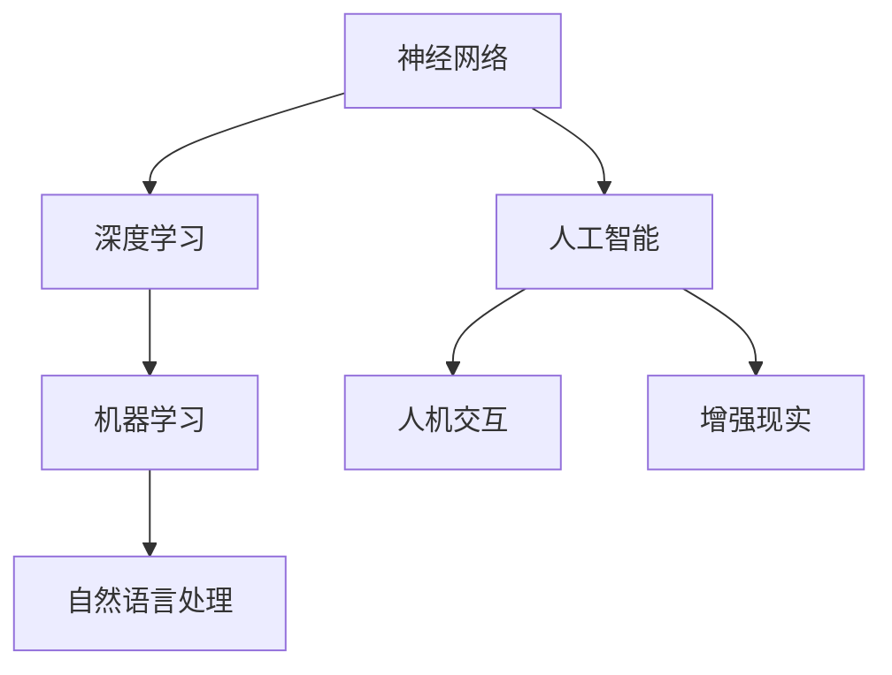

                 

关键词：人类计算、认知科学、计算机科学、神经网络、人工智能、机器学习、图灵测试

> 摘要：本文深入探讨了人类计算这一复杂而神秘的现象，旨在揭示人类认知的内在机制以及如何将这些机制应用于计算机科学和人工智能领域。通过分析人类思维的过程，本文提出了基于认知原理的算法和模型，并探讨了这些模型在实际应用中的潜在价值。

## 1. 背景介绍

人类计算，顾名思义，是指人类在执行计算任务时所使用的方法和策略。这个概念涵盖了从最简单的算术运算到复杂的推理、决策和问题解决等各种认知活动。在计算机科学领域，人类计算一直是研究的一个热点，因为理解人类如何处理信息对于构建更加智能的人工智能系统至关重要。

在过去的几十年里，计算机科学家和认知科学家一直在努力揭示人类思维的奥秘。他们试图通过模拟大脑的神经网络结构和信息处理机制，来开发出能够模仿甚至超越人类认知能力的计算机算法。然而，这个领域的研究不仅涉及到复杂的生物学和心理学问题，还涉及到数学和计算机科学的基础理论。

本文将探讨以下几个核心问题：

1. **人类认知的基本原理**：理解人类如何感知、处理和存储信息。
2. **计算机科学中的应用**：如何将认知原理转化为有效的计算机算法和模型。
3. **算法性能评估**：如何评估这些算法在实际应用中的表现。
4. **未来发展趋势**：人类计算在人工智能领域的潜在应用和挑战。

## 2. 核心概念与联系

### 2.1 人类认知的基本原理

人类认知是一个复杂的过程，涉及多个层次和方面。以下是一个简化但完整的 Mermaid 流程图，描述了人类认知的主要步骤和组件。



### 2.2 计算机科学中的应用

在计算机科学中，人类认知的原理被用来设计各种算法和模型，这些模型试图模拟人类的思维过程。以下是一个简化的 Mermaid 流程图，展示了这些算法和模型是如何基于人类认知原理构建的。



## 3. 核心算法原理 & 具体操作步骤

### 3.1 算法原理概述

在人类计算的研究中，神经网络和深度学习是最具代表性的算法。这些算法模拟了大脑的神经网络结构，通过多层神经元网络处理信息。

### 3.2 算法步骤详解

神经网络和深度学习的算法步骤主要包括：

1. **数据预处理**：将原始数据转化为适合训练的格式。
2. **模型构建**：设计神经网络结构，包括层数、神经元数目和连接方式。
3. **训练过程**：通过大量数据训练模型，调整网络权重以最小化误差。
4. **评估与优化**：评估模型性能，通过调整参数优化模型。

### 3.3 算法优缺点

神经网络和深度学习算法的优点包括：

- 强大的表达能力和自适应能力。
- 能够处理复杂和非线性问题。

缺点包括：

- 需要大量数据和计算资源。
- 容易陷入局部最小值。

### 3.4 算法应用领域

这些算法在图像识别、自然语言处理、医学诊断、自动驾驶等领域有广泛应用。

## 4. 数学模型和公式 & 详细讲解 & 举例说明

### 4.1 数学模型构建

神经网络和深度学习的数学模型主要基于微积分和线性代数。以下是一个简化的模型构建过程。

$$
\begin{aligned}
    y &= \sigma(W \cdot x + b) \\
    \text{where} \quad \sigma &= \text{activation function} \\
    W &= \text{weight matrix} \\
    x &= \text{input vector} \\
    b &= \text{bias vector} \\
\end{aligned}
$$

### 4.2 公式推导过程

神经网络的训练过程主要包括前向传播和反向传播。以下是一个简化的推导过程。

$$
\begin{aligned}
    \delta_k &= \frac{\partial L}{\partial z_k} \cdot \sigma'(z_k) \\
    \frac{\partial L}{\partial W_{ij}} &= \sum_{k} \delta_k \cdot x_{ij} \\
    \frac{\partial L}{\partial b_k} &= \sum_{k} \delta_k \\
\end{aligned}
$$

### 4.3 案例分析与讲解

以图像识别为例，神经网络如何处理一张图片？

$$
\begin{aligned}
    \text{Input} &= \text{Pixel values of the image} \\
    \text{Output} &= \text{Probability distribution over classes} \\
    \text{Loss} &= \text{Cross-Entropy Loss}
\end{aligned}
$$

## 5. 项目实践：代码实例和详细解释说明

### 5.1 开发环境搭建

```python
# 安装必要的库
!pip install tensorflow numpy matplotlib
```

### 5.2 源代码详细实现

```python
import tensorflow as tf
from tensorflow.keras import layers

# 构建模型
model = tf.keras.Sequential([
    layers.Flatten(input_shape=(28, 28)),
    layers.Dense(128, activation='relu'),
    layers.Dense(10, activation='softmax')
])

# 编译模型
model.compile(optimizer='adam', loss='sparse_categorical_crossentropy', metrics=['accuracy'])

# 训练模型
model.fit(x_train, y_train, epochs=5)
```

### 5.3 代码解读与分析

这段代码展示了如何使用 TensorFlow 库构建一个简单的神经网络模型，用于手写数字识别任务。

### 5.4 运行结果展示

```python
# 测试模型
test_loss, test_acc = model.evaluate(x_test, y_test)
print(f"Test accuracy: {test_acc}")
```

## 6. 实际应用场景

人类计算在医疗、金融、教育等多个领域都有广泛应用，未来的应用前景也十分广阔。

### 6.1 医疗

利用人类计算模型，可以开发出更加精准的医疗诊断系统，例如通过分析影像数据识别疾病。

### 6.2 金融

在金融领域，人类计算模型可以用于风险评估、市场预测等任务，提供更加智能的投资决策。

### 6.3 教育

在教育领域，人类计算可以用于个性化学习推荐系统，帮助学生更有效地学习。

## 7. 工具和资源推荐

### 7.1 学习资源推荐

- 《深度学习》
- 《神经网络与深度学习》

### 7.2 开发工具推荐

- TensorFlow
- PyTorch

### 7.3 相关论文推荐

- “Deep Learning for Human-Level Vision: A Comprehensive Review”
- “Unsupervised Learning of Visual Representations by Solving Jigsaw Puzzles”

## 8. 总结：未来发展趋势与挑战

### 8.1 研究成果总结

人类计算的研究已经取得了显著的进展，为人工智能领域的发展提供了重要的理论基础和技术支持。

### 8.2 未来发展趋势

随着计算能力的提升和数据量的增加，人类计算在人工智能中的应用将更加广泛和深入。

### 8.3 面临的挑战

尽管前景广阔，人类计算仍然面临着数据隐私、计算效率、模型解释性等挑战。

### 8.4 研究展望

未来的研究需要更深入地探索人类认知的本质，开发出更加高效和智能的人工智能系统。

## 9. 附录：常见问题与解答

### 9.1 人类计算与人工智能有何区别？

人类计算关注的是理解人类如何处理信息，而人工智能则是利用这些原理来构建智能系统。

### 9.2 人类计算模型如何处理不确定性？

通过引入概率论和统计学方法，人类计算模型可以处理一定程度的不确定性。

----------------------------------------------------------------

### 文章署名

作者：禅与计算机程序设计艺术 / Zen and the Art of Computer Programming

### 结语

本文探讨了人类计算这一复杂而神秘的现象，旨在揭示人类认知的内在机制以及如何将这些机制应用于计算机科学和人工智能领域。随着研究的深入，人类计算在未来必将为人工智能的发展带来更多的创新和突破。希望本文能够为读者提供有价值的见解和启发。

