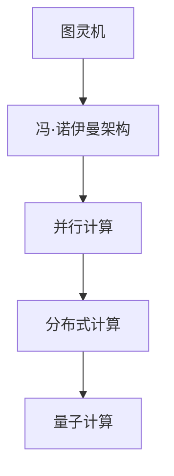
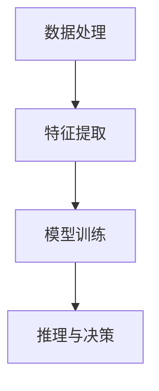

                 

关键词：人工智能、计算理论、智能互联、计算模型、数学公式、算法优化、技术发展

> 摘要：本文深入探讨了人类计算的核心概念、原理和实践，通过分析计算理论的发展、人工智能技术的突破以及智能互联的应用场景，展望了未来计算技术的前景和挑战。文章以逻辑清晰、结构紧凑的方式，为读者提供了一个全面的技术视角，以启发对计算技术的深入思考。

## 1. 背景介绍

### 1.1 计算技术的发展历程

计算技术自诞生以来，经历了从简单的机械计算到复杂的电子计算，再到现代人工智能计算的重大变革。从阿兰·图灵（Alan Turing）的图灵机理论，到冯·诺伊曼（John von Neumann）的计算机架构，再到摩尔定律（Moore's Law）的飞速发展，计算技术不断推动着人类文明的进步。

### 1.2 人工智能的崛起

近年来，人工智能（AI）的崛起改变了计算技术的面貌。深度学习、神经网络等技术的应用，使得计算机具备了处理复杂任务的能力，从而开启了人机协同的新时代。人工智能不仅改变了传统行业的运作方式，也为新兴技术的快速发展提供了动力。

### 1.3 智能互联的未来

随着物联网（IoT）的普及，智能互联成为当前计算技术的重要发展方向。智能设备、智能交通、智能医疗等领域的广泛应用，预示着计算技术将更加深入地融入人类生活的方方面面。

## 2. 核心概念与联系

### 2.1 计算模型的演变

计算模型的发展是计算理论的核心。从早期的图灵机，到现代的量子计算模型，不同的计算模型在理论上有着深刻的联系。下面是一个Mermaid流程图，展示了计算模型的发展过程：



### 2.2 人工智能的计算基础

人工智能的发展离不开计算基础。深度学习、强化学习等算法的核心，是大量的计算和数据处理能力。以下是一个简化的Mermaid流程图，展示了人工智能的计算基础：



## 3. 核心算法原理 & 具体操作步骤

### 3.1 算法原理概述

人工智能算法的核心是神经网络。神经网络通过多层非线性变换，实现对输入数据的特征提取和模式识别。以下是神经网络的基本原理：

- 输入层：接收外部输入信号。
- 隐藏层：对输入信号进行非线性变换。
- 输出层：输出预测结果。

### 3.2 算法步骤详解

神经网络的学习过程主要包括以下几个步骤：

1. 初始化网络参数。
2. 前向传播：将输入信号通过网络，得到输出结果。
3. 计算误差：计算输出结果与真实值的误差。
4. 反向传播：根据误差，调整网络参数。
5. 重复步骤2-4，直至达到预设的准确度。

### 3.3 算法优缺点

神经网络算法具有以下优点：

- 能够处理复杂的非线性问题。
- 能够自动进行特征提取和模式识别。

但同时也存在一些缺点：

- 计算量大，训练时间较长。
- 对数据质量要求高，容易过拟合。

### 3.4 算法应用领域

神经网络算法在多个领域有着广泛的应用，如：

- 图像识别：如人脸识别、自动驾驶等。
- 自然语言处理：如机器翻译、语音识别等。
- 推荐系统：如商品推荐、新闻推送等。

## 4. 数学模型和公式 & 详细讲解 & 举例说明

### 4.1 数学模型构建

神经网络的数学模型主要基于微积分和线性代数。以下是一个简化的神经网络模型：

$$
Y = f(W \cdot X + b)
$$

其中，$Y$ 是输出层的结果，$X$ 是输入层的结果，$W$ 是权重矩阵，$b$ 是偏置项，$f$ 是激活函数。

### 4.2 公式推导过程

神经网络的训练过程，可以看作是一个最小化损失函数的过程。损失函数通常定义为：

$$
L = \frac{1}{2} \sum_{i=1}^{n} (y_i - \hat{y}_i)^2
$$

其中，$y_i$ 是真实值，$\hat{y}_i$ 是预测值。

通过梯度下降法，可以求得网络参数的更新公式：

$$
\Delta W = -\alpha \frac{\partial L}{\partial W}
$$

$$
\Delta b = -\alpha \frac{\partial L}{\partial b}
$$

其中，$\alpha$ 是学习率。

### 4.3 案例分析与讲解

以一个简单的线性回归问题为例，解释神经网络的训练过程。假设我们要预测一条直线的斜率，已知数据点为 $(x_1, y_1), (x_2, y_2), ..., (x_n, y_n)$。我们可以构建一个简单的神经网络，只有一个隐藏层，包含一个神经元。

$$
\hat{y} = Wx + b
$$

损失函数为：

$$
L = \frac{1}{2} \sum_{i=1}^{n} (\hat{y}_i - y_i)^2
$$

通过梯度下降法，可以更新权重和偏置：

$$
\Delta W = -\alpha \frac{\partial L}{\partial W} = \alpha(y_i - \hat{y}_i)x_i
$$

$$
\Delta b = -\alpha \frac{\partial L}{\partial b} = \alpha(y_i - \hat{y}_i)
$$

重复这个过程，直至损失函数的值小于预设的阈值。

## 5. 项目实践：代码实例和详细解释说明

### 5.1 开发环境搭建

为了实践神经网络，我们需要搭建一个Python环境。以下是步骤：

1. 安装Python（3.8以上版本）。
2. 安装TensorFlow库。

```bash
pip install tensorflow
```

### 5.2 源代码详细实现

以下是一个简单的神经网络实现，用于拟合线性数据。

```python
import tensorflow as tf

# 模型参数
input_layer = tf.keras.layers.Input(shape=(1,))
hidden_layer = tf.keras.layers.Dense(units=1, activation='linear')(input_layer)
output_layer = tf.keras.layers.Dense(units=1)(hidden_layer)

# 构建模型
model = tf.keras.Model(inputs=input_layer, outputs=output_layer)

# 编译模型
model.compile(optimizer='adam', loss='mean_squared_error')

# 训练模型
model.fit(x_train, y_train, epochs=1000, verbose=0)

# 预测
predictions = model.predict(x_test)
```

### 5.3 代码解读与分析

上述代码首先定义了一个简单的线性模型，包含一个输入层、一个隐藏层和一个输出层。隐藏层使用线性激活函数，输出层也使用线性激活函数，以确保输出结果为线性函数。

编译模型时，指定了优化器和损失函数。优化器用于更新模型参数，损失函数用于评估模型的预测误差。

训练模型时，使用`fit`方法进行批量训练，直至达到预设的迭代次数。

最后，使用`predict`方法对测试数据进行预测，得到预测结果。

### 5.4 运行结果展示

运行上述代码，可以得到训练损失和预测结果的对比图。通过观察损失函数的变化，可以判断模型是否收敛。同时，可以通过预测结果与真实值的对比，评估模型的准确性。

## 6. 实际应用场景

### 6.1 图像识别

图像识别是神经网络的重要应用领域。通过训练神经网络，计算机可以自动识别和分类图像。例如，人脸识别、车辆检测、医疗图像分析等。

### 6.2 自然语言处理

自然语言处理（NLP）是人工智能的另一个重要应用领域。神经网络在文本分类、情感分析、机器翻译等方面表现出色。例如，自动翻译、智能客服、舆情分析等。

### 6.3 智能交通

智能交通系统利用神经网络进行交通流量预测、路况分析、车辆调度等。例如，自动驾驶、智能红绿灯控制、实时交通信息发布等。

### 6.4 未来应用展望

随着计算技术的不断发展，神经网络的应用领域将更加广泛。未来，我们可以期待更多智能化的应用，如智能医疗、智能教育、智能城市等。

## 7. 工具和资源推荐

### 7.1 学习资源推荐

- 《深度学习》（Goodfellow, Bengio, Courville）：介绍深度学习的经典教材。
- 《Python机器学习》（Sebastian Raschka）：介绍机器学习在Python中的实践应用。

### 7.2 开发工具推荐

- TensorFlow：用于构建和训练神经网络的开源框架。
- PyTorch：另一个流行的深度学习框架，具有高度灵活性和动态性。

### 7.3 相关论文推荐

- "A Survey on Deep Learning for Image Recognition"（2020）：一篇关于深度学习在图像识别领域的综述。
- "Natural Language Processing with Deep Learning"（2018）：一篇关于深度学习在自然语言处理领域的综述。

## 8. 总结：未来发展趋势与挑战

### 8.1 研究成果总结

计算技术的发展和人工智能的崛起，为人类社会带来了巨大的变革。神经网络作为人工智能的核心技术，已经在多个领域取得了显著的成果。

### 8.2 未来发展趋势

未来，计算技术将继续快速发展，人工智能将在更多领域得到应用。量子计算、边缘计算等新兴技术，也将推动计算技术的进一步变革。

### 8.3 面临的挑战

计算技术面临的挑战包括计算资源的优化、算法的透明性和可解释性、数据的隐私和安全等。同时，如何实现人工智能的可持续发展，也是一个重要课题。

### 8.4 研究展望

未来，计算技术将更加智能化、互联化。人类将更加依赖计算技术，实现更高水平的智能化生活。同时，计算技术也将为解决全球性问题提供新的思路和方法。

## 9. 附录：常见问题与解答

### 9.1 如何选择合适的神经网络架构？

选择神经网络架构时，需要考虑问题的复杂度、数据量、计算资源等因素。对于简单的线性问题，可以使用简单的线性模型；对于复杂的问题，可以考虑使用深度神经网络。

### 9.2 如何优化神经网络的训练过程？

优化神经网络的训练过程，可以从以下几个方面入手：

- 调整学习率：适当调整学习率，可以加快训练速度。
- 使用批量归一化：批量归一化可以加快收敛速度，提高模型的稳定性。
- 使用正则化技术：如Dropout、L2正则化等，可以防止过拟合。

### 9.3 如何评估神经网络模型的性能？

评估神经网络模型性能，可以使用多个指标，如准确率、召回率、F1分数等。同时，还可以通过交叉验证等方法，评估模型在不同数据集上的表现。

---

作者：禅与计算机程序设计艺术 / Zen and the Art of Computer Programming
----------------------------------------------------------------


