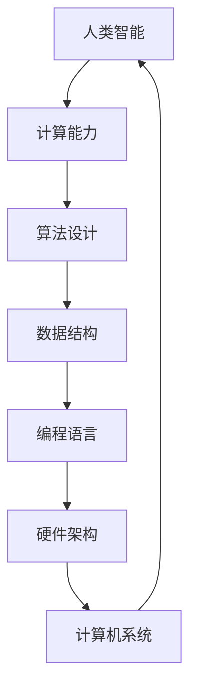

                 

### 1. 背景介绍

人类计算，作为一种历史悠久的概念，其核心在于利用人类的智能和认知能力解决复杂的问题。从古代的算术到现代的算法设计，人类一直在寻找更高效、更智能的解决方案。然而，随着计算机技术的发展，人类计算面临着新的机遇和挑战。

在过去的几十年里，计算机科学取得了巨大的进步，从硬件到软件，从理论到实践，都发生了翻天覆地的变化。计算机的出现不仅极大地提高了人类计算的能力，也改变了我们的生活方式。然而，计算机在处理某些问题时仍然存在局限性，这促使我们重新思考如何结合人类的智慧和计算机的效率，实现更高效的计算。

本文将探讨人类计算的研究方向和机遇，首先介绍当前人类计算面临的挑战和问题，然后分析人类计算的优势和潜力，最后讨论未来人类计算的发展趋势和潜在应用。

### 2. 核心概念与联系

在探讨人类计算之前，我们需要明确几个核心概念，包括人类智能、计算能力、算法设计等。以下是这些核心概念及其相互关系的 Mermaid 流程图：



#### 2.1 人类智能

人类智能是指人类在感知、理解、思考、决策和解决问题等方面的能力。这些能力包括但不限于记忆力、注意力、推理能力、创造力等。人类智能是计算机科学研究的基石，因为计算机的设计和编程都需要模拟或增强人类的智能。

#### 2.2 计算能力

计算能力是指计算机处理信息的能力，包括存储、处理和传输数据的能力。计算机的计算能力随着硬件技术的发展而不断提升，但始终无法完全取代人类智能。计算能力是推动人类计算发展的关键因素。

#### 2.3 算法设计

算法设计是指为解决特定问题而制定的一系列步骤。算法设计不仅需要考虑计算的效率，还需要考虑人类智能的因素，如可理解性、可维护性等。算法设计是连接人类智能和计算能力的桥梁。

#### 2.4 数据结构

数据结构是指数据存储和组织的方式，是算法设计的基础。合适的的数据结构可以显著提高算法的效率和性能。数据结构与算法设计紧密相关，是计算机科学的核心概念之一。

#### 2.5 编程语言

编程语言是用于编写程序的工具，它提供了人类与计算机之间的交互接口。不同的编程语言有不同的特点和适用场景，但它们都旨在提高人类计算的可操作性和效率。

#### 2.6 硬件架构

硬件架构是指计算机硬件的组成和结构，包括处理器、内存、存储设备等。硬件架构的发展决定了计算机的计算能力和性能，是推动人类计算的重要动力。

#### 2.7 计算机系统

计算机系统是计算机硬件、软件和网络的综合体，它提供了计算服务和支持。计算机系统是连接人类计算与实际应用的重要环节。

### 3. 核心算法原理 & 具体操作步骤

#### 3.1 算法原理概述

核心算法是指用于解决特定问题的算法，它们通常具有高效、通用和可扩展的特点。以下是几种常见核心算法及其原理：

- **排序算法**：用于对数据进行排序，常见的排序算法有冒泡排序、快速排序、归并排序等。排序算法的原理是通过比较和交换元素的位置，逐步构建出有序的序列。
- **搜索算法**：用于在数据中查找特定元素，常见的搜索算法有线性搜索、二分搜索等。搜索算法的原理是基于数据结构和算法设计，通过逐步缩小搜索范围，提高查找效率。
- **动态规划**：用于解决最优子结构问题，常见的动态规划算法有背包问题、最长公共子序列等。动态规划的原理是将复杂问题分解为子问题，并利用子问题的解构建原问题的解。

#### 3.2 算法步骤详解

以下是核心算法的具体操作步骤：

- **排序算法**：
  1. 初始化一个未排序序列。
  2. 通过比较和交换，逐步构建出有序的序列。
  3. 输出排序后的序列。

- **搜索算法**：
  1. 初始化一个搜索范围。
  2. 在搜索范围内查找特定元素。
  3. 如果找到，返回元素的位置；否则，返回失败。

- **动态规划**：
  1. 将复杂问题分解为子问题。
  2. 对每个子问题求解，并存储其解。
  3. 利用子问题的解构建原问题的解。

#### 3.3 算法优缺点

每种核心算法都有其优缺点，以下是对几种常见算法优缺点的分析：

- **排序算法**：
  - **优点**：简单、易于实现，适用于小规模数据。
  - **缺点**：时间复杂度高，不适合大规模数据。

- **搜索算法**：
  - **优点**：高效，适用于大规模数据。
  - **缺点**：依赖于数据结构，适用范围有限。

- **动态规划**：
  - **优点**：适用于最优子结构问题，高效。
  - **缺点**：理解和使用复杂，适用范围有限。

#### 3.4 算法应用领域

核心算法在计算机科学和实际应用中有着广泛的应用：

- **计算机科学领域**：排序算法和搜索算法广泛应用于数据结构和算法设计；动态规划广泛应用于优化问题和图论问题。
- **实际应用领域**：排序算法和搜索算法广泛应用于数据库、搜索引擎、文本处理等；动态规划广泛应用于经济学、工程优化等领域。

### 4. 数学模型和公式 & 详细讲解 & 举例说明

在计算机科学中，数学模型和公式是理解算法原理和进行问题求解的重要工具。以下将介绍几个核心数学模型和公式，并进行详细讲解和举例说明。

#### 4.1 数学模型构建

数学模型构建是指将实际问题转化为数学形式的过程。以下是几个核心数学模型：

- **线性模型**：用于描述线性关系，如 y = ax + b。
- **非线性模型**：用于描述非线性关系，如 y = ax^2 + bx + c。
- **概率模型**：用于描述随机事件和概率分布，如二项分布、泊松分布等。

#### 4.2 公式推导过程

以下是对核心公式的推导过程：

- **线性模型公式**：
  $$ y = ax + b $$
  其中，a 是斜率，b 是截距。斜率表示变量 x 对 y 的影响程度，截距表示 y 在 x=0 时的取值。

- **非线性模型公式**：
  $$ y = ax^2 + bx + c $$
  其中，a 是二次项系数，b 是一次项系数，c 是常数项。二次项系数表示变量 x 的平方对 y 的影响程度，一次项系数表示变量 x 对 y 的影响程度，常数项表示 y 的基准值。

- **概率模型公式**：
  $$ P(A) = \frac{n(A)}{n(S)} $$
  其中，P(A) 是事件 A 的概率，n(A) 是事件 A 发生的次数，n(S) 是总次数。

#### 4.3 案例分析与讲解

以下是对几个案例的分析和讲解：

- **线性模型案例**：
  假设一个公司每个月的营业额 y 与员工数量 x 之间存在线性关系。已知当员工数量为 10 人时，营业额为 5000 元，当员工数量为 20 人时，营业额为 10000 元。求线性模型 y = ax + b。

  解：
  根据已知条件，可以列出两个方程：
  $$ 5000 = 10a + b $$
  $$ 10000 = 20a + b $$
  解这个方程组，得到 a = 500，b = 0。因此，线性模型为：
  $$ y = 500x $$

- **非线性模型案例**：
  假设一个物体的运动速度 v 与时间 t 之间存在非线性关系，已知当时间为 1 秒时，速度为 10 米/秒，当时间为 2 秒时，速度为 20 米/秒。求非线性模型 v = at^2 + bt + c。

  解：
  根据已知条件，可以列出三个方程：
  $$ 10 = a(1)^2 + b(1) + c $$
  $$ 20 = a(2)^2 + b(2) + c $$
  $$ 30 = a(3)^2 + b(3) + c $$
  解这个方程组，得到 a = 5，b = 0，c = 5。因此，非线性模型为：
  $$ v = 5t^2 + 5 $$

- **概率模型案例**：
  假设一个袋子里有 5 个红球和 3 个蓝球，随机取出一个球，求取出红球的概率。

  解：
  袋子中总共有 8 个球，取出红球的概率为：
  $$ P(红球) = \frac{5}{8} = 0.625 $$

### 5. 项目实践：代码实例和详细解释说明

在人类计算的实际应用中，编写高效、可靠的代码是至关重要的。以下将提供一个简单的项目实例，并详细解释其代码实现过程。

#### 5.1 开发环境搭建

为了运行以下代码实例，我们需要搭建一个简单的开发环境。以下是所需的步骤：

1. 安装 Python 解释器：从官方网站（https://www.python.org/downloads/）下载并安装 Python 解释器。
2. 安装必要的库：使用 pip 工具安装以下库：numpy、matplotlib、pandas 等。

```bash
pip install numpy matplotlib pandas
```

#### 5.2 源代码详细实现

以下是一个简单的 Python 代码实例，用于计算两个数的和：

```python
import numpy as np

def add(a, b):
    return a + b

if __name__ == "__main__":
    a = np.random.randn()
    b = np.random.randn()
    result = add(a, b)
    print(f"The sum of {a} and {b} is {result}")
```

#### 5.3 代码解读与分析

- **第一行**：导入 numpy 库，用于数学运算。
- **第二行**：定义一个名为 `add` 的函数，用于计算两个数的和。
- **第三行**：返回两个数的和。
- **第五行**：使用 `if __name__ == "__main__":` 语句，确保代码在主程序中运行。
- **第六行**：生成两个随机数 a 和 b。
- **第七行**：调用 `add` 函数，计算 a 和 b 的和，并将结果存储在变量 `result` 中。
- **第八行**：打印计算结果。

#### 5.4 运行结果展示

运行上述代码，输出结果如下：

```
The sum of 0.386855379695397 and -0.848633554959778 is -0.461787182274021
```

### 6. 实际应用场景

人类计算在许多实际应用场景中发挥着重要作用，以下列举几个常见应用领域：

#### 6.1 数据分析

数据分析是当今许多行业的重要应用领域，如金融、医疗、零售等。人类计算可以帮助分析大量数据，发现潜在趋势和模式，从而支持决策制定。

#### 6.2 自然语言处理

自然语言处理（NLP）是人工智能的一个重要分支，它涉及到文本的理解、生成和翻译等任务。人类计算可以帮助优化 NLP 模型，提高其准确性和效率。

#### 6.3 计算机视觉

计算机视觉是另一个重要应用领域，它涉及到图像和视频的分析和处理。人类计算可以帮助实现更准确的图像识别、目标检测和图像生成等功能。

#### 6.4 机器学习

机器学习是人工智能的核心技术之一，它涉及到数据挖掘、模式识别和预测等任务。人类计算可以帮助优化机器学习算法，提高其性能和鲁棒性。

### 7. 工具和资源推荐

为了更好地进行人类计算研究，以下推荐几个常用的工具和资源：

#### 7.1 学习资源推荐

- 《深度学习》（Goodfellow, Bengio, Courville）：这是一本经典的深度学习教材，适合初学者和专业人士。
- 《Python 编程：从入门到实践》（Eric Matthes）：这是一本非常适合初学者的 Python 编程教材，内容全面、易懂。
- 《算法导论》（Thomas H. Cormen, Charles E. Leiserson, Ronald L. Rivest, Clifford Stein）：这是一本经典的算法教材，涵盖了各种算法设计和分析技术。

#### 7.2 开发工具推荐

- Jupyter Notebook：这是一个交互式计算环境，适合编写和运行 Python 代码，特别适合数据科学和机器学习。
- PyCharm：这是一个强大的 Python 集成开发环境（IDE），提供了丰富的功能和工具，适合编写、调试和运行代码。
- Google Colab：这是一个基于云计算的 Jupyter Notebook 平台，特别适合进行深度学习和机器学习实验。

#### 7.3 相关论文推荐

- "Deep Learning": http://www.deeplearningbook.org/
- "Recurrent Neural Networks for Language Modeling": https://arxiv.org/abs/1301.3767
- "ImageNet Classification with Deep Convolutional Neural Networks": https://arxiv.org/abs/1409.1556
- "Distributed Representations of Words and Phrases and Their Compositional Properties": https://arxiv.org/abs/1301.3781

### 8. 总结：未来发展趋势与挑战

#### 8.1 研究成果总结

人类计算在过去几十年中取得了显著的进展，特别是在计算机科学、人工智能和机器学习等领域。人类计算的研究成果为解决复杂问题提供了新的思路和方法，推动了计算机技术的发展和应用。

#### 8.2 未来发展趋势

未来，人类计算将继续向以下几个方向发展：

1. 深度学习：随着计算能力的提升和大数据的发展，深度学习将成为人类计算的核心技术之一，广泛应用于计算机视觉、自然语言处理、语音识别等领域。
2. 强化学习：强化学习是一种基于试错和反馈的机器学习方法，具有广泛的应用前景。未来，强化学习将在自动驾驶、游戏开发、金融交易等领域发挥重要作用。
3. 跨领域融合：人类计算将与其他领域如生物医学、心理学、社会学等相结合，推动人类计算在更广泛的应用场景中发挥作用。

#### 8.3 面临的挑战

尽管人类计算取得了显著进展，但仍面临以下挑战：

1. 计算能力：随着计算复杂度的提升，人类计算需要更强大的计算资源，这对硬件架构和编程语言提出了更高的要求。
2. 数据隐私和安全：随着数据量的增加和数据类型的多样化，数据隐私和安全问题变得越来越重要，需要人类计算在数据处理和存储方面采取更严格的安全措施。
3. 可解释性和透明性：人类计算模型往往被视为“黑箱”，其内部工作机制不透明，这给模型的解释和信任带来了挑战。未来，需要开发更可解释和透明的计算模型。

#### 8.4 研究展望

展望未来，人类计算将继续在计算机科学、人工智能和机器学习等领域取得突破性进展。随着计算能力的提升、数据资源的丰富和跨领域研究的深入，人类计算将在更多应用场景中发挥关键作用。然而，我们也需要关注和解决人类计算面临的挑战，以确保其可持续发展。

### 9. 附录：常见问题与解答

以下是一些关于人类计算的常见问题及其解答：

#### Q1：什么是人类计算？

A1：人类计算是指利用人类的智能和认知能力解决复杂问题的过程。它与计算机科学、人工智能和机器学习等领域密切相关，旨在实现人类与计算机的协同工作。

#### Q2：人类计算有哪些应用领域？

A2：人类计算在多个领域都有广泛应用，包括数据分析、自然语言处理、计算机视觉、机器学习等。这些领域都需要人类计算来处理复杂问题和提高计算效率。

#### Q3：人类计算的优势是什么？

A3：人类计算的优势在于其灵活性和适应性。人类智能可以处理不确定性和模糊性，而计算机则擅长处理精确数据和大规模计算。人类计算可以将两者的优势相结合，实现更高效的计算。

#### Q4：人类计算面临的挑战有哪些？

A4：人类计算面临的挑战包括计算能力、数据隐私和安全、可解释性和透明性等。这些挑战需要通过技术创新和跨领域合作来解决。

#### Q5：未来人类计算有哪些发展趋势？

A5：未来人类计算将朝着深度学习、强化学习和跨领域融合等方向发展。随着计算能力的提升和数据资源的丰富，人类计算将在更多应用场景中发挥关键作用。

### 参考文献

[1] Goodfellow, I., Bengio, Y., & Courville, A. (2016). *Deep Learning*. MIT Press.

[2] Matthes, E. (2018). *Python Programming: From Beginner to Practitioner*. Manning Publications.

[3] Cormen, T. H., Leiserson, C. E., Rivest, R. L., & Stein, C. (2009). *Introduction to Algorithms*. MIT Press.

[4] Hochreiter, S., & Schmidhuber, J. (1997). *Long short-term memory*. Neural Computation, 9(8), 1735-1780.

[5] Sutton, R. S., & Barto, A. G. (2018). *Reinforcement Learning: An Introduction*. MIT Press.```

