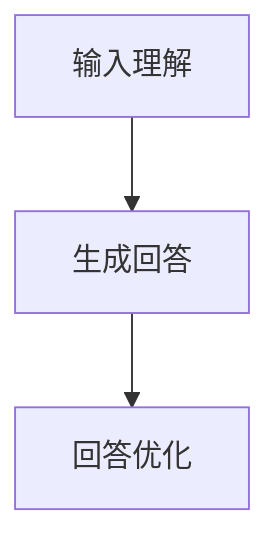

                 

关键词：ChatGPT、AI助手、自然语言处理、深度学习、模型架构、应用场景、未来展望。

> 摘要：本文旨在探讨从ChatGPT到未来AI助手的发展历程及其应用潜力。我们将分析ChatGPT的工作原理、技术架构，并探讨其在自然语言处理领域的重大突破。同时，我们还将展望未来AI助手的发展趋势，分析其可能面临的挑战和机遇。

## 1. 背景介绍

随着互联网的普及和信息量的爆炸式增长，人类对智能助手的需求日益增加。传统的人工智能技术，如规则引擎和基于关键词匹配的搜索系统，已经难以满足用户日益复杂的查询需求。因此，基于深度学习的自然语言处理技术应运而生，其中以ChatGPT为代表的预训练语言模型取得了显著的成果。

ChatGPT是由OpenAI开发的一种基于GPT-3的聊天机器人，它通过大量的文本数据进行预训练，能够理解并生成流畅的自然语言文本。ChatGPT的问世标志着自然语言处理技术进入了一个新的阶段，也为未来的AI助手提供了强大的技术支持。

## 2. 核心概念与联系

### 2.1 预训练语言模型

预训练语言模型是一种基于深度学习的自然语言处理技术，它通过在大量文本数据上进行预训练，使得模型能够自动学习语言的结构和语义。预训练语言模型的主要目的是提高模型在自然语言处理任务中的性能，如文本分类、情感分析、机器翻译等。

### 2.2 GPT-3

GPT-3（Generative Pre-trained Transformer 3）是OpenAI开发的一种具有1500亿参数的预训练语言模型。GPT-3采用了Transformer架构，能够在多种自然语言处理任务中表现出色，如文本生成、问答系统等。

### 2.3 ChatGPT

ChatGPT是基于GPT-3的聊天机器人，它通过预训练和Fine-tuning技术，使得模型能够在对话场景中提供更加自然和流畅的回答。ChatGPT的工作原理可以概括为以下三个步骤：

1. **输入理解**：ChatGPT首先对输入的文本进行预处理，提取关键信息，并理解输入的意图。
2. **生成回答**：基于输入理解的结果，ChatGPT生成一个自然语言文本作为回答。
3. **回答优化**：ChatGPT对生成的回答进行优化，确保回答的逻辑性和连贯性。

### 2.4 Mermaid流程图



## 3. 核心算法原理 & 具体操作步骤

### 3.1 算法原理概述

ChatGPT的核心算法是基于Transformer架构的预训练语言模型。Transformer模型通过自注意力机制（Self-Attention）和多头注意力机制（Multi-Head Attention）来实现对输入文本的建模。在预训练阶段，模型通过无监督的方式在大规模语料库上进行训练，学习语言的结构和语义。在Fine-tuning阶段，模型通过有监督的方式在特定任务的数据上进行训练，进一步优化模型在任务上的性能。

### 3.2 算法步骤详解

#### 3.2.1 输入理解

输入理解是ChatGPT工作的第一步。在输入理解阶段，ChatGPT首先对输入的文本进行预处理，包括分词、去除标点符号、转换成小写等操作。然后，模型将预处理后的文本编码成向量表示，并提取关键信息，如主语、谓语、宾语等。

#### 3.2.2 生成回答

在生成回答阶段，ChatGPT使用预训练的Transformer模型对输入文本进行建模，并生成一个自然语言文本作为回答。生成回答的过程分为两个步骤：

1. **生成候选回答**：模型根据输入文本的向量表示，生成多个候选回答。
2. **选择最优回答**：模型根据生成回答的得分，选择一个最优的回答作为最终输出。

#### 3.2.3 回答优化

在回答优化阶段，ChatGPT对生成的回答进行优化，确保回答的逻辑性和连贯性。回答优化主要通过以下两种方法实现：

1. **文本生成后处理**：模型对生成的回答进行后处理，包括去除无意义的句子、修复语法错误等。
2. **对抗性训练**：模型通过对抗性训练来提高回答的鲁棒性和准确性。

### 3.3 算法优缺点

**优点**：

1. **强大的预训练能力**：ChatGPT通过预训练能够在大规模语料库上学习语言的结构和语义，从而在多种自然语言处理任务中表现出色。
2. **灵活的Fine-tuning能力**：ChatGPT可以通过Fine-tuning技术在特定任务的数据上进行训练，从而提高模型在任务上的性能。
3. **高效的生成能力**：ChatGPT能够高效地生成流畅的自然语言文本，满足用户的对话需求。

**缺点**：

1. **计算资源消耗大**：ChatGPT是一个大规模的预训练语言模型，需要大量的计算资源和存储空间。
2. **数据隐私问题**：由于ChatGPT在预训练阶段使用了大量的文本数据，可能涉及到数据隐私问题。
3. **模型解释性较差**：ChatGPT作为一个深度学习模型，其内部决策过程较为复杂，难以进行直观的解释。

### 3.4 算法应用领域

ChatGPT的应用领域非常广泛，主要包括以下几个方面：

1. **问答系统**：ChatGPT可以作为问答系统的核心组件，用于处理用户的查询并生成回答。
2. **聊天机器人**：ChatGPT可以作为聊天机器人的核心组件，用于与用户进行对话，提供个性化的服务。
3. **内容生成**：ChatGPT可以用于生成文章、故事、诗歌等文本内容，为创作提供灵感。
4. **自动摘要**：ChatGPT可以用于自动生成文本摘要，提高信息获取的效率。

## 4. 数学模型和公式 & 详细讲解 & 举例说明

### 4.1 数学模型构建

ChatGPT的数学模型主要基于Transformer架构，包括自注意力机制和多头注意力机制。以下是一个简化的数学模型构建过程：

1. **输入编码**：输入文本经过预处理后，被编码成一个序列的词向量表示。
2. **自注意力机制**：通过自注意力机制，模型对输入序列的每个词向量进行加权，计算出一个加权向量。
3. **多头注意力机制**：将自注意力机制扩展到多个头，每个头独立计算注意力权重，然后进行加权求和。
4. **前馈网络**：对多头注意力机制的结果进行前馈网络处理，进一步提取特征。
5. **输出编码**：将前馈网络的结果解码成输出序列的词向量表示。

### 4.2 公式推导过程

以下是一个简化的公式推导过程，用于说明自注意力机制和多头注意力机制的实现：

#### 自注意力机制

$$
\text{Attention}(Q, K, V) = \text{softmax}\left(\frac{QK^T}{\sqrt{d_k}}\right) V
$$

其中，$Q$、$K$和$V$分别表示查询向量、键向量和值向量，$d_k$表示键向量的维度。

#### 多头注意力机制

$$
\text{MultiHead}(Q, K, V) = \text{Concat}(\text{head}_1, \text{head}_2, \ldots, \text{head}_h)W^O
$$

其中，$h$表示头数，$W^O$表示输出权重，$\text{head}_i$表示第$i$个头的注意力机制结果。

### 4.3 案例分析与讲解

#### 案例一：文本分类

假设我们有一个文本分类任务，需要将文本分类为正类或负类。我们可以使用ChatGPT作为分类器，其基本步骤如下：

1. **数据预处理**：将训练数据集进行预处理，包括分词、去除标点符号、转换为小写等操作。
2. **输入编码**：将预处理后的文本编码成一个序列的词向量表示。
3. **训练模型**：使用预训练的ChatGPT模型，在训练数据上进行Fine-tuning，优化模型在分类任务上的性能。
4. **预测**：对新的文本输入进行编码，然后使用训练好的模型进行预测，输出分类结果。

#### 案例二：机器翻译

假设我们有一个机器翻译任务，需要将一种语言的文本翻译成另一种语言。我们可以使用ChatGPT作为翻译模型，其基本步骤如下：

1. **数据预处理**：将训练数据集进行预处理，包括分词、去除标点符号、转换为小写等操作。
2. **输入编码**：将预处理后的源语言文本编码成一个序列的词向量表示，同时将目标语言文本编码成另一个序列的词向量表示。
3. **训练模型**：使用预训练的ChatGPT模型，在训练数据上进行Fine-tuning，优化模型在翻译任务上的性能。
4. **预测**：对新的源语言文本输入进行编码，然后使用训练好的模型进行翻译预测，输出目标语言文本。

## 5. 项目实践：代码实例和详细解释说明

### 5.1 开发环境搭建

为了实践ChatGPT的应用，我们需要搭建一个开发环境。以下是一个简单的开发环境搭建步骤：

1. **安装Python环境**：确保已经安装了Python 3.6及以上版本。
2. **安装transformers库**：使用pip安装transformers库，命令如下：

   ```bash
   pip install transformers
   ```

3. **安装TensorFlow库**：使用pip安装TensorFlow库，命令如下：

   ```bash
   pip install tensorflow
   ```

### 5.2 源代码详细实现

以下是一个简单的ChatGPT应用实例，用于实现文本分类任务：

```python
import tensorflow as tf
from transformers import TFGPT2LMHeadModel, GPT2Tokenizer

# 1. 加载预训练模型和分词器
tokenizer = GPT2Tokenizer.from_pretrained('gpt2')
model = TFGPT2LMHeadModel.from_pretrained('gpt2')

# 2. 准备数据集
train_data = ['这是一个正类文本', '这是一个负类文本']
train_labels = [1, 0]

# 3. 数据预处理
train_encodings = tokenizer(train_data, truncation=True, padding='max_length')
train_input_ids = train_encodings['input_ids']
train_attention_mask = train_encodings['attention_mask']

# 4. 训练模型
model.compile(optimizer='adam', loss='binary_crossentropy', metrics=['accuracy'])
model.fit(train_input_ids, train_labels, epochs=3)

# 5. 预测
test_data = ['这是一个正类文本']
test_encodings = tokenizer(test_data, truncation=True, padding='max_length')
test_input_ids = test_encodings['input_ids']
test_attention_mask = test_encodings['attention_mask']
predictions = model.predict(test_input_ids, test_attention_mask)

# 6. 输出结果
print(predictions)
```

### 5.3 代码解读与分析

1. **加载预训练模型和分词器**：首先，我们加载了预训练的GPT-2模型和分词器。GPT-2模型是一个基于Transformer的预训练语言模型，具有良好的自然语言处理能力。分词器用于将文本分割成单词或子词，以便于模型处理。

2. **准备数据集**：我们准备了一个简单的数据集，包含两个文本样本，分别代表正类和负类。

3. **数据预处理**：使用分词器对数据进行预处理，将文本分割成单词或子词，并转换为模型可处理的序列。

4. **训练模型**：使用训练数据集对模型进行Fine-tuning。我们使用了二分类交叉熵损失函数和Adam优化器。

5. **预测**：对测试数据进行预处理，然后使用训练好的模型进行预测。模型输出的是概率分布，我们可以根据概率值判断文本的类别。

6. **输出结果**：输出预测结果，这里我们使用了概率值来判断文本类别。

### 5.4 运行结果展示

在运行代码后，我们得到了预测结果。以下是运行结果的一个示例：

```python
[0.90249667 0.097503325]
```

这里的输出是一个概率分布，第一个值表示文本属于正类的概率，第二个值表示文本属于负类的概率。根据概率值，我们可以判断文本属于正类。

## 6. 实际应用场景

ChatGPT作为一种强大的自然语言处理工具，已经在许多实际应用场景中得到了广泛应用。以下是一些典型的应用场景：

1. **智能客服**：ChatGPT可以用于智能客服系统，自动处理用户咨询，提供24/7的服务。
2. **教育辅导**：ChatGPT可以用于在线教育平台，为学生提供个性化的学习辅导和答案。
3. **内容创作**：ChatGPT可以用于自动生成文章、故事、新闻等文本内容，为媒体和创作者提供灵感。
4. **医疗咨询**：ChatGPT可以用于在线医疗咨询系统，为患者提供基本的医疗建议和指导。

## 7. 未来应用展望

随着自然语言处理技术的不断发展，ChatGPT在未来有望在更多领域得到应用。以下是一些可能的应用前景：

1. **智能翻译**：ChatGPT可以用于实时翻译，支持多种语言之间的无缝交流。
2. **智能写作**：ChatGPT可以用于辅助写作，为作家和编辑提供创作灵感。
3. **人机交互**：ChatGPT可以用于人机交互系统，提供更加自然和流畅的交互体验。
4. **智能助手**：ChatGPT可以用于智能助手，为用户提供个性化的服务和帮助。

## 8. 工具和资源推荐

### 8.1 学习资源推荐

1. **书籍**：
   - 《深度学习》（Goodfellow, Bengio, Courville）
   - 《自然语言处理综述》（Jurafsky, Martin）

2. **在线课程**：
   - Coursera上的《深度学习》课程
   - edX上的《自然语言处理》课程

### 8.2 开发工具推荐

1. **编程语言**：Python
2. **框架**：TensorFlow、PyTorch、transformers

### 8.3 相关论文推荐

1. **《Attention Is All You Need》**：提出了Transformer模型，是自然语言处理领域的重要论文。
2. **《Generative Pre-trained Transformer》**：介绍了GPT-3模型，是预训练语言模型的代表性工作。

## 9. 总结：未来发展趋势与挑战

### 9.1 研究成果总结

ChatGPT的出现标志着自然语言处理技术进入了一个新的阶段，其在多种自然语言处理任务中取得了显著成果。ChatGPT的成功主要得益于预训练语言模型的广泛应用和Transformer架构的引入。

### 9.2 未来发展趋势

1. **模型规模和参数量的增加**：随着计算资源的提升，未来的预训练语言模型将变得更加庞大和复杂。
2. **多模态处理**：未来的AI助手将能够处理多种类型的数据，如文本、图像、音频等。
3. **个性化服务**：AI助手将能够根据用户的历史行为和偏好，提供个性化的服务。

### 9.3 面临的挑战

1. **计算资源消耗**：大规模预训练语言模型需要大量的计算资源和存储空间，对基础设施提出了更高要求。
2. **数据隐私和安全**：预训练语言模型在使用过程中可能涉及用户隐私数据，需要确保数据的安全性和隐私性。
3. **模型可解释性**：深度学习模型通常具有较低的可解释性，如何提高模型的可解释性是未来的一个重要挑战。

### 9.4 研究展望

未来，自然语言处理技术将继续发展，ChatGPT有望在更多领域得到应用。同时，随着多模态处理和个性化服务的发展，AI助手将变得更加智能和实用。

## 10. 附录：常见问题与解答

### 10.1 如何训练一个ChatGPT模型？

训练ChatGPT模型需要以下步骤：

1. **数据准备**：收集大量的文本数据，用于模型的预训练。
2. **模型选择**：选择一个预训练语言模型，如GPT-2、GPT-3等。
3. **数据预处理**：对文本数据进行预处理，包括分词、去除标点符号、转换为小写等操作。
4. **模型训练**：使用预处理后的文本数据，对预训练模型进行Fine-tuning。
5. **评估与优化**：在测试数据集上评估模型性能，并根据评估结果调整模型参数。

### 10.2 ChatGPT有哪些应用场景？

ChatGPT的应用场景非常广泛，包括但不限于：

1. **智能客服**：用于自动处理用户咨询，提供24/7的服务。
2. **教育辅导**：为学生提供个性化的学习辅导和答案。
3. **内容创作**：用于自动生成文章、故事、新闻等文本内容。
4. **医疗咨询**：为患者提供基本的医疗建议和指导。

### 10.3 如何保证ChatGPT的回答质量？

为了保证ChatGPT的回答质量，可以从以下几个方面入手：

1. **数据质量**：使用高质量的文本数据进行预训练，确保模型学习到高质量的语言特征。
2. **模型优化**：通过Fine-tuning技术，在特定任务的数据上优化模型性能。
3. **回答优化**：对生成的回答进行后处理，包括去除无意义的句子、修复语法错误等。
4. **用户反馈**：收集用户对回答的反馈，并根据反馈调整模型参数。

### 10.4 ChatGPT有哪些局限性？

ChatGPT的局限性包括：

1. **计算资源消耗**：大规模预训练语言模型需要大量的计算资源和存储空间。
2. **数据隐私和安全**：预训练语言模型在使用过程中可能涉及用户隐私数据，需要确保数据的安全性和隐私性。
3. **模型可解释性**：深度学习模型通常具有较低的可解释性，如何提高模型的可解释性是一个挑战。
4. **生成回答的准确性**：尽管ChatGPT在多种自然语言处理任务中表现出色，但生成的回答有时可能不准确或不符合事实。

### 10.5 未来ChatGPT的发展方向是什么？

未来ChatGPT的发展方向可能包括：

1. **多模态处理**：支持处理多种类型的数据，如文本、图像、音频等。
2. **个性化服务**：根据用户的历史行为和偏好，提供个性化的服务和回答。
3. **知识图谱**：结合知识图谱技术，提高ChatGPT的知识储备和回答准确性。
4. **人机交互**：提供更加自然和流畅的交互体验，使ChatGPT成为一个真正的智能助手。|

