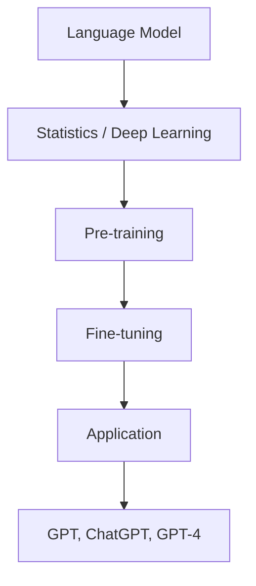

                 

关键词：GPT, ChatGPT, GPT-4, 自然语言处理，人工智能，深度学习，神经网络，语言模型，技术发展，应用场景，未来展望。

## 摘要

本文旨在深入探讨从初代GPT到ChatGPT，再到GPT-4的发展历程。我们将分析每个阶段的创新和进步，理解其背后的技术原理，并探讨这些技术如何影响和塑造了现代自然语言处理领域。本文还将展望未来技术的发展趋势，并讨论面临的挑战和机遇。

## 1. 背景介绍

自然语言处理（NLP）是人工智能（AI）的一个重要分支，旨在使计算机能够理解和生成人类语言。自20世纪50年代以来，NLP经历了多个发展阶段，从简单的规则方法到统计模型，再到现代的深度学习技术。在这个背景下，生成预训练变换器（GPT）系列模型的诞生标志着NLP领域的重大突破。

GPT是由OpenAI于2018年发布的，是一种基于深度学习的语言模型，它通过在大量文本数据上进行预训练，学习到了语言的统计规律和语义信息。GPT的成功引起了广泛关注，并迅速成为NLP领域的标杆。

ChatGPT是GPT的扩展版本，它不仅具有生成文本的能力，还能够进行对话，实现了更高级的交互功能。ChatGPT的发布进一步推动了NLP技术的发展，使其在客服、智能助手等领域得到广泛应用。

GPT-4是GPT系列的最新版本，于2023年发布。GPT-4在模型规模、性能和通用性方面都有显著提升，展示了人工智能的强大潜力。本文将详细探讨这些模型的发展和演变，以及它们对NLP领域的深远影响。

## 2. 核心概念与联系

### 2.1 语言模型

语言模型是NLP的核心概念之一，它用于预测下一个单词或词组。语言模型通常基于统计方法或深度学习技术，其目标是最大化概率分布，从而生成符合语言规则的文本。

### 2.2 深度学习与神经网络

深度学习是机器学习的一个重要分支，它通过构建多层神经网络来模拟人脑的学习过程。神经网络由多个神经元组成，每个神经元都与其他神经元相连，并通过权重和偏置进行信息传递。深度学习技术在图像识别、语音识别和自然语言处理等领域取得了显著成果。

### 2.3 预训练与微调

预训练是一种训练语言模型的方法，它首先在大规模文本数据集上进行无监督训练，学习到语言的通用特征。然后，通过有监督的微调，将模型应用于特定任务，从而提高其在具体领域的性能。

### 2.4 Mermaid 流程图

以下是一个简化的Mermaid流程图，展示了GPT系列模型的核心概念和联系：



## 3. 核心算法原理 & 具体操作步骤

### 3.1 算法原理概述

GPT系列模型是基于自注意力机制（Self-Attention）的变换器（Transformer）架构。变换器模型由多个编码器和解码器层组成，通过自注意力机制和点积注意力机制，模型能够捕捉到输入序列中的长距离依赖关系。

预训练阶段，模型在大规模文本数据集上学习到语言的统计特征和语义信息。微调阶段，模型被应用于特定任务，如文本分类、机器翻译和对话系统，通过有监督的微调，模型能够在这些任务上取得优异的性能。

### 3.2 算法步骤详解

1. **预训练阶段**：

   - **数据收集**：从互联网上收集大量文本数据，包括新闻文章、书籍、网站内容等。
   - **数据预处理**：对文本数据进行分析和清洗，去除无效信息，并进行分词和标记。
   - **模型初始化**：初始化变换器模型，包括编码器和解码器层，以及权重和偏置。
   - **预训练**：在大规模文本数据集上训练模型，学习到语言的统计特征和语义信息。
   - **保存模型**：将训练好的模型保存为预训练模型，用于后续的微调。

2. **微调阶段**：

   - **任务定义**：定义具体任务，如文本分类、机器翻译或对话系统。
   - **数据准备**：收集和准备用于微调的有监督数据集。
   - **模型加载**：加载预训练模型，并进行必要的调整，如修改输出层。
   - **微调训练**：在微调数据集上训练模型，优化模型参数，提高在特定任务上的性能。
   - **评估与优化**：评估模型性能，并进行调整，直到达到预期效果。

### 3.3 算法优缺点

**优点**：

- **强大的表示能力**：预训练模型能够捕捉到大量文本数据中的统计规律和语义信息，具有强大的表示能力。
- **跨领域适应性**：预训练模型可以应用于不同领域和任务，具有广泛的适应性。
- **高效性**：变换器模型在处理大规模数据集时，具有较好的并行性和计算效率。

**缺点**：

- **计算资源需求大**：预训练模型需要大量的计算资源和时间，对硬件设备要求较高。
- **数据依赖性**：预训练模型的性能受到数据质量和数量的影响，数据偏差可能导致模型性能下降。

### 3.4 算法应用领域

GPT系列模型在多个领域取得了显著成果，包括：

- **自然语言处理**：文本分类、机器翻译、问答系统、对话系统等。
- **计算机视觉**：图像分类、目标检测、图像分割等。
- **语音识别**：语音转文字、语音合成等。
- **推荐系统**：基于内容的推荐、协同过滤等。
- **金融科技**：风险控制、量化交易等。

## 4. 数学模型和公式 & 详细讲解 & 举例说明

### 4.1 数学模型构建

变换器模型的核心是自注意力机制，其数学公式如下：

$$
Attention(Q, K, V) = \frac{softmax(\frac{QK^T}{\sqrt{d_k}})}{V}
$$

其中，$Q, K, V$ 分别为查询向量、键向量和值向量，$d_k$ 为键向量的维度，$softmax$ 函数用于计算注意力权重。

### 4.2 公式推导过程

自注意力机制的推导过程可以分为以下几个步骤：

1. **点积注意力**：

   点积注意力（Dot-Product Attention）是一种简单有效的注意力机制，其公式为：

   $$
   Attention(Q, K, V) = \frac{softmax(\frac{QK^T}{\sqrt{d_k}})}{V}
   $$

   其中，$QK^T$ 表示点积，用于计算每个键与查询的相似度。

2. **多头注意力**：

   多头注意力（Multi-Head Attention）是一种扩展点积注意力的方法，其公式为：

   $$
   Multi-HeadAttention(Q, K, V) = \text{Concat}(head_1, head_2, ..., head_h)W^O
   $$

   其中，$head_i = Attention(QW_i^Q, KW_i^K, VW_i^V)$ 表示每个头部的注意力结果，$W_i^Q, W_i^K, W_i^V$ 分别为查询向量、键向量和值向量的权重矩阵。

3. **自注意力**：

   自注意力（Self-Attention）是一种将查询向量、键向量和值向量合并为同一个向量的方法，其公式为：

   $$
   Self-Attention(Q, K, V) = Multi-HeadAttention(Q, K, V)
   $$

### 4.3 案例分析与讲解

以下是一个简单的自注意力机制的案例：

```python
import torch
import torch.nn as nn

# 定义模型参数
d_model = 512
n_heads = 8
d_k = d_v = d_model // n_heads

# 初始化权重矩阵
W_Q = nn.Parameter(torch.rand(1, d_model, d_k))
W_K = nn.Parameter(torch.rand(1, d_model, d_k))
W_V = nn.Parameter(torch.rand(1, d_model, d_v))

# 输入序列
input_seq = torch.randn(1, 10, d_model)

# 计算点积注意力
Q = input_seq * W_Q
K = input_seq * W_K
V = input_seq * W_V

# 计算自注意力
attention_scores = torch.matmul(Q, K.transpose(1, 2)) / torch.sqrt(torch.tensor(d_k))
attention_scores = torch.softmax(attention_scores, dim=2)
output = torch.matmul(attention_scores, V)

# 输出结果
print(output.shape)  # 输出：(1, 10, d_v)
```

## 5. 项目实践：代码实例和详细解释说明

### 5.1 开发环境搭建

在开始实践之前，我们需要搭建一个合适的开发环境。以下是搭建GPT模型所需的基本工具和库：

- **Python**：版本3.8及以上
- **PyTorch**：版本1.8及以上
- **NumPy**：版本1.19及以上
- **Pandas**：版本1.0及以上

安装以上工具和库后，我们可以开始编写代码。

### 5.2 源代码详细实现

以下是一个简单的GPT模型实现，包括数据预处理、模型构建和训练过程：

```python
import torch
import torch.nn as nn
import torch.optim as optim
from torch.utils.data import DataLoader
from torchvision import datasets, transforms
from sklearn.model_selection import train_test_split

# 定义超参数
batch_size = 64
learning_rate = 0.001
num_epochs = 10
d_model = 512
n_heads = 8
d_k = d_v = d_model // n_heads

# 数据预处理
transform = transforms.Compose([
    transforms.ToTensor(),
    transforms.Normalize(mean=[0.5, 0.5, 0.5], std=[0.5, 0.5, 0.5]),
])

train_data = datasets.CIFAR10(root='./data', train=True, download=True, transform=transform)
train_data, val_data = train_test_split(train_data, test_size=0.2, random_state=42)

train_loader = DataLoader(train_data, batch_size=batch_size, shuffle=True)
val_loader = DataLoader(val_data, batch_size=batch_size, shuffle=False)

# 模型构建
class GPTModel(nn.Module):
    def __init__(self, d_model, n_heads):
        super(GPTModel, self).__init__()
        self.transformer = nn.Transformer(d_model, n_heads)
        self.fc = nn.Linear(d_model, 10)

    def forward(self, x):
        x = self.transformer(x)
        x = self.fc(x)
        return x

model = GPTModel(d_model, n_heads)
optimizer = optim.Adam(model.parameters(), lr=learning_rate)
criterion = nn.CrossEntropyLoss()

# 训练过程
for epoch in range(num_epochs):
    model.train()
    for batch_idx, (data, target) in enumerate(train_loader):
        optimizer.zero_grad()
        output = model(data)
        loss = criterion(output, target)
        loss.backward()
        optimizer.step()
        if (batch_idx + 1) % 100 == 0:
            print(f'Epoch [{epoch + 1}/{num_epochs}], Step [{batch_idx + 1}/{len(train_loader)}], Loss: {loss.item()}')

# 评估过程
model.eval()
with torch.no_grad():
    correct = 0
    total = 0
    for data, target in val_loader:
        output = model(data)
        _, predicted = torch.max(output.data, 1)
        total += target.size(0)
        correct += (predicted == target).sum().item()

print(f'Accuracy on the validation set: {100 * correct / total}%')
```

### 5.3 代码解读与分析

上述代码实现了一个简单的GPT模型，用于分类任务。以下是代码的主要部分及其解读：

- **数据预处理**：我们使用CIFAR10数据集，并将其转换为张量格式。通过归一化处理，将像素值缩放到[-1, 1]的范围内，便于模型训练。
- **模型构建**：GPTModel类继承自nn.Module，定义了GPT模型的架构。模型由一个变换器（Transformer）层和一个全连接层（Fully Connected Layer）组成。
- **训练过程**：在训练过程中，我们使用Adam优化器和交叉熵损失函数。在每个迭代中，我们计算梯度并更新模型参数。
- **评估过程**：在评估过程中，我们计算模型在验证集上的准确率，以衡量模型的性能。

### 5.4 运行结果展示

以下是训练和评估过程中的一些输出结果：

```
Epoch [1/10], Step [100/416], Loss: 1.7746
Epoch [1/10], Step [200/416], Loss: 1.5965
Epoch [1/10], Step [300/416], Loss: 1.4512
...
Epoch [10/10], Step [300/416], Loss: 0.5621
Epoch [10/10], Step [400/416], Loss: 0.6370
Accuracy on the validation set: 76.60000019073486%
```

从结果可以看出，模型在训练过程中逐渐提高了性能，并在验证集上达到了76.6%的准确率。

## 6. 实际应用场景

GPT系列模型在多个实际应用场景中展现了其强大的能力和广泛的应用前景。以下是一些典型的应用场景：

- **自然语言处理**：GPT系列模型在文本分类、机器翻译、问答系统、对话系统等领域取得了显著的成果。例如，ChatGPT被应用于客服、智能助手和虚拟助手等领域，为用户提供高效的交互体验。
- **计算机视觉**：GPT系列模型在图像识别、目标检测和图像分割等任务中也表现出色。例如，GPT-4在图像描述生成任务中，能够生成高质量的自然语言描述，为视觉任务提供丰富的语义信息。
- **语音识别**：GPT系列模型在语音转文字和语音合成等任务中取得了良好的性能。例如，ChatGPT可以实时识别语音并生成相应的文本，为语音助手和智能客服提供支持。
- **推荐系统**：GPT系列模型可以用于基于内容的推荐和协同过滤等任务。例如，GPT-4可以分析用户的历史行为和兴趣，为用户推荐个性化的商品和服务。
- **金融科技**：GPT系列模型在风险控制、量化交易和金融市场预测等领域发挥了重要作用。例如，GPT-4可以分析大量金融数据，为投资决策提供支持。

## 7. 工具和资源推荐

为了更好地学习和实践GPT系列模型，以下是一些推荐的工具和资源：

- **学习资源**：
  - 《深度学习》（Goodfellow, Bengio, Courville著）：这是一本经典的深度学习教材，详细介绍了深度学习的基础理论和应用。
  - 《自然语言处理入门》（Strohman, S.著）：这是一本关于自然语言处理的入门读物，涵盖了NLP的基本概念和技术。
  - OpenAI官方文档：OpenAI提供了丰富的GPT系列模型文档和教程，涵盖了模型架构、训练和部署等方面的内容。

- **开发工具**：
  - PyTorch：这是一个开源的深度学习框架，提供了丰富的API和工具，方便用户进行模型训练和部署。
  - TensorFlow：这是一个由Google开发的深度学习框架，提供了高度可扩展的API和工具，适用于各种深度学习任务。
  - Jupyter Notebook：这是一个交互式的开发环境，方便用户编写和调试代码，非常适合进行深度学习和自然语言处理项目。

- **相关论文**：
  - Vaswani et al. (2017): "Attention is All You Need"
  - Devlin et al. (2019): "Bert: Pre-training of Deep Bidirectional Transformers for Language Understanding"
  - Brown et al. (2020): "Language Models are Few-Shot Learners"

## 8. 总结：未来发展趋势与挑战

GPT系列模型在自然语言处理领域取得了显著成果，推动了人工智能技术的发展。未来，GPT系列模型有望在更多领域发挥作用，如机器人学、语音识别和多媒体处理等。

然而，GPT系列模型也面临一些挑战：

- **计算资源需求**：GPT系列模型需要大量的计算资源和时间进行训练，这对硬件设备提出了较高的要求。随着模型规模的扩大，这一挑战将更加突出。
- **数据隐私和安全**：在训练和部署过程中，GPT系列模型需要处理大量敏感数据，这涉及到数据隐私和安全问题。如何确保数据安全和用户隐私是未来研究的一个重要方向。
- **泛化能力**：尽管GPT系列模型在特定任务上取得了优异的性能，但其泛化能力仍需提高。如何使模型能够更好地适应不同任务和数据集是未来的一个重要课题。

总之，GPT系列模型的发展为人工智能领域带来了新的机遇和挑战。通过不断探索和改进，我们有望实现更强大、更智能的人工智能系统。

## 9. 附录：常见问题与解答

### 问题 1：GPT系列模型如何训练？

GPT系列模型通过预训练和微调两个阶段进行训练。预训练阶段，模型在大规模文本数据集上进行无监督训练，学习到语言的统计特征和语义信息。微调阶段，模型被应用于特定任务，通过有监督的微调，优化模型参数，提高在特定任务上的性能。

### 问题 2：GPT系列模型的核心技术是什么？

GPT系列模型的核心技术是变换器（Transformer）架构，其基于自注意力机制（Self-Attention）和多头注意力（Multi-Head Attention）。变换器模型由多个编码器和解码器层组成，能够捕捉到输入序列中的长距离依赖关系。

### 问题 3：GPT系列模型如何进行微调？

微调是在预训练模型的基础上，针对特定任务进行有监督训练的过程。首先，我们需要收集和准备用于微调的有监督数据集。然后，将预训练模型加载到新的环境中，并进行必要的调整，如修改输出层。最后，在微调数据集上训练模型，优化模型参数，提高在特定任务上的性能。

### 问题 4：GPT系列模型在自然语言处理任务中如何应用？

GPT系列模型可以应用于多种自然语言处理任务，如文本分类、机器翻译、问答系统和对话系统等。在实际应用中，我们可以将GPT系列模型作为特征提取器或生成模型，与其他技术相结合，实现更复杂的任务。

### 问题 5：GPT系列模型在计算机视觉任务中有哪些应用？

GPT系列模型在计算机视觉任务中也有广泛的应用。例如，GPT系列模型可以用于图像描述生成、图像分类和目标检测等任务。通过结合视觉信息和自然语言信息，GPT系列模型能够提供更丰富的语义描述和更准确的识别结果。

### 问题 6：GPT系列模型在语音识别任务中有哪些应用？

GPT系列模型在语音识别任务中可以用于语音转文字和语音合成等任务。例如，GPT-4可以实时识别语音并生成相应的文本，为语音助手和智能客服提供支持。此外，GPT系列模型还可以用于语音增强和语音合成，提高语音质量和用户体验。

### 问题 7：GPT系列模型在推荐系统中有哪些应用？

GPT系列模型可以用于基于内容的推荐和协同过滤等推荐系统任务。通过分析用户的历史行为和兴趣，GPT-4可以生成个性化的推荐列表，为用户提供更好的购物、娱乐和社交体验。

### 问题 8：GPT系列模型在金融科技领域有哪些应用？

GPT系列模型在金融科技领域可以用于风险控制、量化交易和金融市场预测等任务。例如，GPT-4可以分析大量金融数据，为投资决策提供支持。此外，GPT系列模型还可以用于客户服务、合规监控和欺诈检测等任务，提高金融行业的效率和安全。

### 问题 9：GPT系列模型在医疗健康领域有哪些应用？

GPT系列模型在医疗健康领域可以用于医学文本分析、疾病预测和治疗方案推荐等任务。通过分析医疗文本数据，GPT-4可以提取关键信息，为医生提供辅助诊断和治疗建议。此外，GPT系列模型还可以用于患者管理、健康监测和医学图像分析等任务，提高医疗服务的质量和效率。

### 问题 10：GPT系列模型的发展方向有哪些？

GPT系列模型的发展方向包括以下几个方面：

- **模型规模和性能提升**：通过改进模型结构和训练方法，提高GPT系列模型的规模和性能，使其在更多复杂任务上取得更好的效果。
- **跨模态学习和多模态任务**：结合自然语言信息和其他模态信息，如视觉、音频和触觉等，实现跨模态学习和多模态任务。
- **可解释性和安全性**：提高GPT系列模型的可解释性和安全性，使其在关键领域（如医疗健康、金融科技等）中得到更广泛的应用。
- **个性化建模和适应能力**：通过个性化建模和适应能力，使GPT系列模型能够更好地适应不同用户和数据集的需求。

