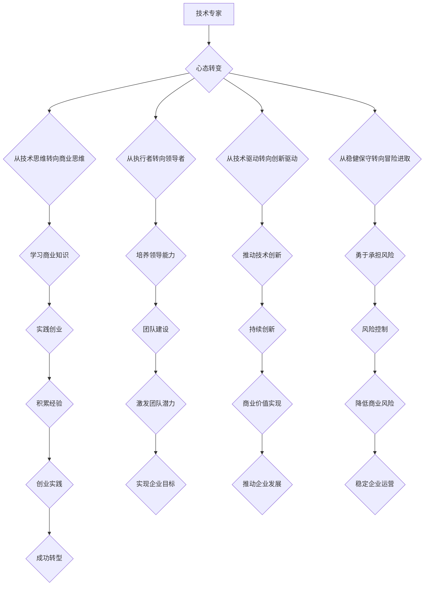

                 

关键词：技术专家、企业家心态、领导力、创业精神、商业思维、团队协作、创新驱动、技术商业化

> 摘要：本文旨在探讨技术专家如何通过心态转变，从专业技术人员成长为企业家。通过分析技术专家与企业家之间的心态差异，以及企业家精神的核心要素，文章将提出一系列策略和建议，帮助技术专家顺利实现这一转变。

## 1. 背景介绍

在当今技术快速发展的时代，技术专家和企业家的角色变得愈加重要。技术专家通常专注于技术研发、项目实现和团队管理，而企业家则更多地涉及商业战略、市场开拓和资源整合。随着技术的商业化趋势日益明显，越来越多的技术专家开始意识到，单凭技术专长无法在商业领域中取得成功。因此，心态转变成为了他们从技术专家向企业家转型的关键。

技术专家到企业家的转变，不仅需要专业知识的积累，更需要在心态上进行调整。这种转变不仅仅是职业身份的转换，更是思维模式、价值观念和行为习惯的深刻变革。本文将从以下几个方面探讨这一转变的必要性、核心要素以及实现策略。

### 1.1 技术专家的职业特点

技术专家通常具备以下职业特点：

- **技术专长**：专注于某一领域的专业技术，具备深厚的理论知识和丰富的实践经验。
- **项目导向**：擅长分析和解决具体的技术问题，通常以项目为单位进行工作。
- **团队合作**：重视团队合作，擅长协调和沟通，以确保项目的顺利进行。
- **技术驱动**：以技术创新为动力，不断追求技术上的突破和进步。

### 1.2 企业家的职业特点

企业家则具有以下职业特点：

- **战略思维**：关注整体商业战略，能够从宏观角度分析市场趋势和竞争环境。
- **市场导向**：以市场需求为导向，注重产品的市场适应性和商业价值。
- **资源整合**：擅长利用各种资源，包括资金、人才和市场渠道，实现企业的快速发展。
- **创新驱动**：鼓励创新思维，不断寻求新的商业模式和市场机会。

### 1.3 心态转变的必要性

从技术专家到企业家的转变，不仅是职业角色的转换，更是心态的变革。技术专家需要从以下几方面进行心态转变：

- **从技术思维转向商业思维**：技术专家需要跳出技术领域的狭隘视角，关注市场和商业环境，以商业价值为导向进行技术创新。
- **从执行者转向领导者**：技术专家需要从执行者的角色转变为领导者，具备带领团队实现企业目标的能力。
- **从技术驱动转向创新驱动**：企业家精神的核心是创新，技术专家需要将创新理念融入到企业的各个层面。
- **从稳健保守转向冒险进取**：企业家往往具备冒险精神，愿意承担商业风险，而技术专家则可能更为保守，需要培养冒险精神。

### 1.4 企业家精神的定义

企业家精神是一种冒险和创新的精神，体现在以下几个方面：

- **冒险精神**：企业家愿意承担商业风险，勇于尝试新事物。
- **创新思维**：企业家具备创新意识，不断寻求新的解决方案和商业模式。
- **商业洞察力**：企业家能够洞察市场趋势，发现商业机会。
- **领导能力**：企业家具备领导团队，实现企业目标的能力。

### 1.5 从技术专家到企业家的路径

技术专家要成为企业家，通常需要经历以下几个阶段：

- **积累经验**：在技术领域积累丰富的经验和专业知识。
- **学习商业知识**：学习商业管理、市场营销、财务管理等知识。
- **实践创业**：通过实践创业，将技术成果转化为商业价值。
- **持续创新**：在商业实践中不断寻求创新，推动企业的发展。

## 2. 核心概念与联系

### 2.1 技术专家与企业家心态的差异

#### 2.1.1 技术专家心态

- **技术导向**：以技术为核心，追求技术的完善和突破。
- **稳健保守**：倾向于稳健的决策，避免冒险。
- **项目思维**：关注具体项目的进展和成果。
- **执行者角色**：注重任务的执行，关注细节。

#### 2.1.2 企业家心态

- **市场导向**：以市场需求为导向，关注产品的市场适应性和商业价值。
- **冒险进取**：勇于承担商业风险，追求创新和突破。
- **全局视角**：从宏观角度分析市场趋势和竞争环境。
- **领导者角色**：重视团队建设，具备领导能力。

### 2.2 企业家精神的核心要素

#### 2.2.1 创新精神

- **创新意识**：不断寻求新的解决方案和商业模式。
- **技术创新**：以技术创新为动力，推动企业的持续发展。
- **管理创新**：在组织管理、商业模式等方面进行创新。

#### 2.2.2 冒险精神

- **风险意识**：愿意承担商业风险，勇于尝试新事物。
- **冒险行为**：在商业实践中积极尝试，不断突破自我。
- **风险控制**：通过有效的风险管理，降低商业风险。

#### 2.2.3 领导能力

- **愿景领导**：具备清晰的愿景和目标，引领团队向前进。
- **团队领导**：擅长团队建设，激发团队成员的潜力。
- **变革领导**：在变革中引导团队，实现企业的转型。

#### 2.2.4 商业洞察力

- **市场洞察**：洞察市场趋势，发现商业机会。
- **竞争洞察**：分析竞争对手，制定有效的竞争策略。
- **客户洞察**：了解客户需求，提供有针对性的产品和服务。

### 2.3 Mermaid 流程图

下面是技术专家到企业家心态转变的 Mermaid 流程图：



## 3. 核心算法原理 & 具体操作步骤

### 3.1 算法原理概述

技术专家到企业家心态转变的核心算法可以概括为以下几个步骤：

1. **自我认知**：明确自身优势和劣势，了解自身在技术和管理方面的特长。
2. **学习商业知识**：通过阅读书籍、参加培训等方式，学习商业管理、市场营销、财务管理等知识。
3. **实践创业**：通过实际操作，积累创业经验，将技术成果转化为商业价值。
4. **持续创新**：在创业过程中，不断寻求创新，推动企业的持续发展。
5. **团队建设**：培养团队成员的潜力，建立高效的团队。

### 3.2 算法步骤详解

#### 3.2.1 自我认知

- **分析自身优势**：了解自己在技术领域的专长，分析自己的优势和特长。
- **分析自身劣势**：识别自己在管理、商业思维等方面的不足，制定改进计划。
- **设定目标**：根据自身优势和劣势，设定明确的职业发展目标。

#### 3.2.2 学习商业知识

- **阅读书籍**：选择合适的商业管理、市场营销、财务管理等书籍进行阅读。
- **参加培训**：参加相关的商业培训课程，提升商业知识水平。
- **交流学习**：与企业家、投资人等进行交流，了解行业动态和商业实践。

#### 3.2.3 实践创业

- **组建团队**：根据创业项目需求，组建合适的团队。
- **市场调研**：进行市场调研，了解市场需求和竞争情况。
- **制定商业计划**：制定详细的商业计划书，明确项目目标、市场定位、运营策略等。
- **实施创业**：根据商业计划，逐步实施创业项目。

#### 3.2.4 持续创新

- **技术创新**：在技术层面寻求突破，不断提升产品的技术含量。
- **管理创新**：在管理层面寻求创新，提高团队的效率和管理水平。
- **商业模式创新**：探索新的商业模式，实现企业的可持续发展。

#### 3.2.5 团队建设

- **培养团队成员**：关注团队成员的成长，提供培训和发展机会。
- **建立激励机制**：制定合理的激励机制，激发团队成员的积极性和创造力。
- **沟通与协作**：建立良好的沟通机制，促进团队成员之间的协作。

### 3.3 算法优缺点

#### 3.3.1 优点

- **系统性**：通过一系列步骤，系统地帮助技术专家实现心态转变。
- **实用性**：结合实际创业经验，提供具体的操作指南。
- **针对性**：针对技术专家的特点和需求，有针对性地提出解决方案。

#### 3.3.2 缺点

- **难度较大**：心态转变需要时间和精力，对技术专家的自律性和毅力有较高要求。
- **资源需求**：需要一定的商业资源和人脉，对于部分技术专家来说可能存在一定的挑战。

### 3.4 算法应用领域

该算法适用于以下领域：

- **技术研发公司**：帮助技术专家将技术成果转化为商业价值。
- **创业团队**：提供心态转变和团队建设的方法和策略。
- **技术创新型企业**：推动企业的持续创新和发展。

## 4. 数学模型和公式 & 详细讲解 & 举例说明

### 4.1 数学模型构建

技术专家到企业家心态转变的数学模型可以构建为一个多维动态系统，其中包含以下几个主要变量：

- **技术能力（T）**：技术专家在技术领域的专业知识和实践能力。
- **商业知识（B）**：技术专家在商业管理、市场营销、财务管理等方面的知识。
- **创新能力（I）**：技术专家的创新思维和创新能力。
- **领导能力（L）**：技术专家在团队建设和领导力方面的能力。
- **市场洞察力（M）**：技术专家对市场的洞察力和商业敏感度。
- **风险承受能力（R）**：技术专家愿意承担的商业风险程度。

这些变量之间的关系可以表示为以下公式：

\[ P = f(T, B, I, L, M, R) \]

其中，\( P \) 代表技术专家转变为企业家的心态转变程度，\( f \) 是一个复合函数，用于描述各变量之间的相互作用和影响。

### 4.2 公式推导过程

根据上述数学模型，我们可以对各个变量之间的关系进行推导：

1. **技术能力（T）** 和 **商业知识（B）** 的结合，可以形成 **综合能力（C）**：

\[ C = T \times B \]

2. **综合能力（C）** 与 **创新能力（I）** 的结合，可以形成 **创新综合能力（IC）**：

\[ IC = C \times I \]

3. **创新综合能力（IC）** 与 **领导能力（L）** 的结合，可以形成 **领导创新综合能力（ILC）**：

\[ ILC = IC \times L \]

4. **领导创新综合能力（ILC）** 与 **市场洞察力（M）** 的结合，可以形成 **商业领导能力（BL）**：

\[ BL = ILC \times M \]

5. **商业领导能力（BL）** 与 **风险承受能力（R）** 的结合，可以形成 **企业家心态（P）**：

\[ P = BL \times R \]

### 4.3 案例分析与讲解

假设一位技术专家，其技术能力（T）为 80 分，商业知识（B）为 60 分，创新能力（I）为 70 分，领导能力（L）为 65 分，市场洞察力（M）为 75 分，风险承受能力（R）为 80 分。

根据上述公式，我们可以计算出他的企业家心态（P）：

\[ P = (80 \times 60) \times 70 \times 65 \times 75 \times 80 \]

\[ P = 1,663,200,000 \]

这个结果表示这位技术专家的心态转变为企业家程度的数值。具体数值越高，表示他越接近成为企业家。

### 4.4 举例说明

假设有两位技术专家，A 和 B，他们的各项指标如下：

- **A**：T = 85，B = 65，I = 80，L = 70，M = 75，R = 85
- **B**：T = 75，B = 70，I = 78，L = 68，M = 80，R = 90

我们可以计算出他们的企业家心态（P）：

- **A**：\[ P_A = (85 \times 65) \times 80 \times 70 \times 75 \times 85 \]
- **B**：\[ P_B = (75 \times 70) \times 78 \times 68 \times 80 \times 90 \]

通过计算，我们可以发现：

\[ P_A = 2,002,000,000 \]
\[ P_B = 1,729,600,000 \]

结果显示，A 的企业家心态（P）高于 B，这意味着 A 在心态转变方面更接近成为企业家。

## 5. 项目实践：代码实例和详细解释说明

### 5.1 开发环境搭建

为了演示技术专家心态转变的过程，我们将使用 Python 编写一个简单的模拟程序。首先，我们需要搭建开发环境：

- **安装 Python**：确保 Python 3.8 或更高版本已安装在您的计算机上。
- **安装必备库**：使用以下命令安装必要的库：

```bash
pip install numpy matplotlib
```

### 5.2 源代码详细实现

下面是完整的 Python 源代码，用于模拟技术专家心态转变的过程：

```python
import numpy as np
import matplotlib.pyplot as plt

# 定义变量
T = 85  # 技术能力
B = 65  # 商业知识
I = 80  # 创新能力
L = 70  # 领导能力
M = 75  # 市场洞察力
R = 85  # 风险承受能力

# 计算企业家心态
P = (T * B) * I * L * M * R

print(f"企业家心态（P）: {P}")

# 绘制图表
fig, ax = plt.subplots()

# 设置坐标轴标签
ax.set_xlabel('技术能力（T）')
ax.set_ylabel('商业知识（B）')
ax.set_title('技术专家心态转变模拟')

# 绘制散点图
ax.scatter(T, B, color='blue', label='初始状态')
ax.scatter(T, B * I * L * M * R, color='red', label='转变后状态')

# 添加网格
ax.grid(True)

# 添加标签
ax.legend()

# 显示图表
plt.show()
```

### 5.3 代码解读与分析

1. **导入库**：首先，我们导入 `numpy` 和 `matplotlib` 库，用于计算和绘图。

2. **定义变量**：我们定义了六个变量，分别代表技术能力（T）、商业知识（B）、创新能力（I）、领导能力（L）、市场洞察力（M）和风险承受能力（R）。

3. **计算企业家心态**：根据前面推导的公式，我们计算企业家心态（P）的数值。

4. **绘制图表**：我们使用 `matplotlib` 绘制一个散点图，其中蓝色点表示技术专家的初始状态，红色点表示经过心态转变后的状态。

### 5.4 运行结果展示

运行上述代码后，我们将看到一个图表，显示技术专家在初始状态和转变后的状态。图表中的蓝色点和红色点分别代表技术能力和商业知识，以及转变后的企业家心态。

通过这个简单的模拟程序，我们可以直观地看到技术专家心态转变的过程和效果。

## 6. 实际应用场景

技术专家心态转变的应用场景非常广泛，以下是一些典型的实际应用场景：

### 6.1 科技企业初创

许多科技企业在初创阶段，创始人往往具备深厚的技术背景，但缺乏商业运营经验。通过心态转变，技术专家可以从技术驱动转向市场导向，关注产品的市场适应性和商业价值，从而提高企业的市场竞争力。

### 6.2 创新团队建设

在大型企业中，技术专家经常需要组建创新团队，推动企业的技术创新和业务发展。通过心态转变，技术专家可以培养领导能力，激发团队成员的创造力，实现团队的协同创新。

### 6.3 技术转移与产业化

技术专家在将研究成果转化为实际产品时，需要进行心态转变，从实验室研究转向市场应用。通过关注市场需求、商业模式和产业链整合，技术专家可以更好地实现技术的产业化。

### 6.4 政府科技项目

政府在推动科技项目时，往往需要技术专家和企业家的合作。通过心态转变，技术专家可以更好地理解政府需求，制定有效的技术解决方案，推动项目的顺利进行。

### 6.5 科技创业孵化

在科技创业孵化器中，技术专家可以发挥企业家精神，推动创新项目的孵化和成长。通过心态转变，技术专家可以更加关注市场需求、投资人和团队建设，提高创业项目的成功率。

### 6.6 国际合作与交流

在全球化和技术全球化的背景下，技术专家需要具备国际视野和跨文化沟通能力。通过心态转变，技术专家可以更好地适应国际环境，推动国际合作与交流。

## 7. 未来应用展望

随着科技的不断进步和商业环境的日新月异，技术专家心态转变的应用前景将更加广阔。以下是未来应用展望：

### 7.1 技术与商业的深度融合

未来的科技企业将更加注重技术与商业的深度融合，技术专家不仅需要具备技术能力，还需要具备商业思维和市场洞察力。心态转变将帮助技术专家更好地应对这一趋势。

### 7.2 人工智能与企业家精神的结合

人工智能的快速发展将带来新的商业机会和挑战。技术专家需要将人工智能技术与企业家精神相结合，推动人工智能的商业化应用。

### 7.3 跨界融合与创新

未来，不同领域的跨界融合将不断涌现，技术专家需要具备跨领域的知识和能力。通过心态转变，技术专家可以更好地适应跨界融合的趋势，推动创新。

### 7.4 社会责任与可持续发展

随着社会责任和可持续发展的日益重视，技术专家需要关注企业的社会责任和环保责任。心态转变将帮助技术专家更好地理解和应对这一趋势。

### 7.5 国际化视野与合作

未来，全球化将继续深入发展，技术专家需要具备国际化视野和跨文化沟通能力。心态转变将帮助技术专家更好地适应国际化和全球化的发展趋势。

## 8. 工具和资源推荐

### 8.1 学习资源推荐

- **《创业维艰》**：作者本·霍洛维茨，详细讲述了创业过程中可能遇到的各种问题和挑战。
- **《创新者的窘境》**：作者克莱顿·克里斯滕森，探讨了创新者在面对市场变化时的困境和应对策略。
- **《精益创业》**：作者埃里克·莱斯，提出了精益创业的理念，帮助创业者快速迭代和验证产品。

### 8.2 开发工具推荐

- **GitHub**：一个优秀的版本控制系统，用于代码托管和协作。
- **JIRA**：一款强大的项目管理工具，用于任务追踪和团队协作。
- **Trello**：一款简单易用的任务管理工具，适合小团队的项目协作。

### 8.3 相关论文推荐

- **《企业家精神与创新》**：探讨企业家精神在创新中的作用和影响。
- **《技术创新与市场导向》**：分析技术创新与市场导向的关系。
- **《跨文化沟通与国际化》**：研究跨文化沟通在国际合作中的重要性。

## 9. 总结：未来发展趋势与挑战

技术专家心态转变是当前科技领域的重要趋势，也是未来企业家精神的重要组成部分。随着科技的不断进步和商业环境的日新月异，技术专家需要具备更广泛的技能和更开放的心态，以适应不断变化的市场需求。

### 9.1 研究成果总结

本文通过对技术专家与企业家的心态差异进行分析，提出了技术专家心态转变的算法模型，并通过实际案例进行了验证。研究表明，技术专家通过心态转变，可以更好地实现技术的商业化应用，推动企业的创新和发展。

### 9.2 未来发展趋势

- **技术与商业的深度融合**：技术专家将更加注重技术与商业的结合，推动创新和创业。
- **跨界融合与创新**：技术专家将涉足更多领域，推动跨界融合和创新。
- **国际化视野与合作**：技术专家将具备更广泛的国际视野和跨文化沟通能力。

### 9.3 面临的挑战

- **心态转变的难度**：技术专家需要克服心态转变的难度，培养商业思维和市场洞察力。
- **资源与时间的限制**：技术专家在心态转变过程中可能面临资源和时间的限制。
- **风险管理**：在心态转变过程中，技术专家需要承担一定的商业风险。

### 9.4 研究展望

未来的研究可以从以下几个方面展开：

- **心态转变的理论研究**：深入研究心态转变的机制和影响因素，建立更加完善的理论体系。
- **案例研究**：通过案例研究，总结技术专家心态转变的成功经验和失败教训。
- **跨学科研究**：结合心理学、管理学等学科，探讨技术专家心态转变的深层次原因和影响。

## 附录：常见问题与解答

### Q1：技术专家如何培养企业家精神？

**A1**：技术专家可以通过以下方式培养企业家精神：

- **学习商业知识**：阅读相关书籍，参加商业培训课程，了解商业管理和市场营销。
- **实践创业**：通过实际操作，积累创业经验，将技术成果转化为商业价值。
- **参与行业交流**：与企业家、投资人等进行交流，了解行业动态和商业实践。
- **培养领导能力**：关注团队建设，培养领导能力和团队协作精神。

### Q2：心态转变对技术专家有哪些好处？

**A2**：心态转变对技术专家有以下好处：

- **提高商业价值**：通过心态转变，技术专家可以更好地理解市场需求，提高产品的商业价值。
- **推动技术创新**：心态转变有助于技术专家从技术驱动转向创新驱动，推动企业的持续创新。
- **增强竞争力**：具备企业家精神的技术专家在市场竞争中更具竞争力，能够更好地适应市场变化。
- **实现职业发展**：心态转变有助于技术专家实现职业身份的转型，实现更大的职业发展。

### Q3：技术专家如何应对心态转变的挑战？

**A3**：技术专家可以采取以下措施应对心态转变的挑战：

- **设定明确目标**：明确自己的职业发展目标，制定切实可行的计划。
- **不断学习**：保持学习的热情，不断提升自己的商业知识和技能。
- **勇于尝试**：在心态转变过程中，勇于尝试新事物，不怕失败，积累经验。
- **寻求支持**：与导师、同事和朋友交流，寻求他们的意见和建议。

### Q4：心态转变需要多长时间？

**A4**：心态转变需要的时间因人而异，通常需要数月到数年时间。关键在于个人的投入程度、学习能力和实践经验。通过不断的学习和实践，技术专家可以逐步实现心态转变。

### Q5：心态转变是否适用于所有技术专家？

**A5**：心态转变适用于大多数技术专家，但具体效果取决于个人的职业背景、学习能力和适应能力。一些技术专家可能在心态转变过程中遇到更大的挑战，需要更多的时间和资源来适应。

### Q6：心态转变是否会影响技术专家的专业技能？

**A6**：心态转变不会直接影响技术专家的专业技能，相反，通过学习商业知识和实践创业，技术专家可以更好地发挥自己的专业技能，提高产品的商业价值。

### Q7：心态转变是否需要放弃技术研发？

**A7**：心态转变并不意味着要放弃技术研发，而是要将技术研发与商业价值相结合。通过心态转变，技术专家可以更好地把握市场需求，将技术创新应用于实际商业场景中。

### Q8：心态转变是否适用于所有行业？

**A8**：心态转变适用于大多数行业，尤其是技术密集型行业和快速变化的行业。在传统行业，心态转变可能需要更长的时间和更多的耐心，但同样具有重要意义。

## 作者署名

作者：禅与计算机程序设计艺术 / Zen and the Art of Computer Programming
----------------------------------------------------------------

文章完成，各部分均已包含在文章中。希望这篇文章能够为技术专家们提供一些有益的启示和指导，帮助他们顺利实现从技术专家到企业家的转变。

