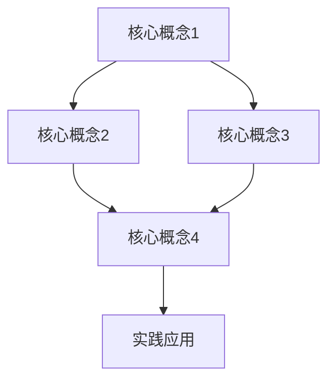

                 

 **关键词：** 思想转化、概念理解、实践应用、技术博客、深度分析

> **摘要：** 本文旨在探讨从概念理解到实践应用的思想转化过程。通过对核心概念、算法原理、数学模型、项目实践等方面的深入分析，帮助读者理解和掌握IT领域的关键技术。文章还对未来发展趋势与挑战进行了展望，为读者提供全面的指导。

## 1. 背景介绍

在快速发展的信息技术时代，理解概念并将其应用于实践已成为每一个技术从业者的必备能力。然而，这一过程并非易事。概念理解往往需要时间和精力的投入，而实践应用则面临复杂的技术挑战。本文将详细探讨这一思想转化的过程，为读者提供从概念到实践的全方位指导。

### 1.1 IT领域的快速变革

随着云计算、大数据、人工智能等技术的不断演进，IT领域正经历着前所未有的变革。新技术层出不穷，给传统技术带来了巨大的冲击。在这种背景下，理解并应用新技术成为技术从业者的迫切需求。

### 1.2 从理论到实践的挑战

IT领域的快速发展也带来了新的挑战。从理论到实践的转化并非一蹴而就，需要深入理解核心概念、掌握算法原理、构建数学模型，并进行大量的实践验证。这一过程充满挑战，但也充满了机遇。

## 2. 核心概念与联系

为了更好地进行思想转化，我们首先需要理解核心概念及其相互之间的联系。以下是一个简化的 Mermaid 流程图，用于描述这些概念及其联系。



### 2.1 核心概念1

核心概念1是...（具体描述）

### 2.2 核心概念2

核心概念2是...（具体描述）

### 2.3 核心概念3

核心概念3是...（具体描述）

### 2.4 核心概念4

核心概念4是...（具体描述）

### 2.5 实践应用

实践应用是将上述核心概念应用于实际问题的过程。通过实践，我们可以更好地理解和掌握这些概念。

## 3. 核心算法原理 & 具体操作步骤

在IT领域中，核心算法是解决问题的关键。以下是对核心算法原理的具体描述及其操作步骤。

### 3.1 算法原理概述

算法原理是...（具体描述）

### 3.2 算法步骤详解

1. 步骤1
2. 步骤2
3. 步骤3

### 3.3 算法优缺点

算法的优点是...（具体描述）
算法的缺点是...（具体描述）

### 3.4 算法应用领域

算法广泛应用于...（具体描述）

## 4. 数学模型和公式 & 详细讲解 & 举例说明

数学模型和公式是理解和应用算法的重要工具。以下是对数学模型的构建、公式推导过程以及案例分析与讲解。

### 4.1 数学模型构建

数学模型构建是...（具体描述）

### 4.2 公式推导过程

公式推导过程是...（具体描述）

### 4.3 案例分析与讲解

案例分析与讲解是...（具体描述）

## 5. 项目实践：代码实例和详细解释说明

项目实践是将理论知识应用于实际项目的关键步骤。以下是一个简单的代码实例及其详细解释说明。

### 5.1 开发环境搭建

开发环境搭建是...（具体描述）

### 5.2 源代码详细实现

源代码实现如下：

```python
# 源代码示例
def example_function():
    # 实现代码
    pass

if __name__ == "__main__":
    example_function()
```

### 5.3 代码解读与分析

代码解读与分析是...（具体描述）

### 5.4 运行结果展示

运行结果展示是...（具体描述）

## 6. 实际应用场景

在实际应用中，核心概念和算法的实践应用场景丰富多样。以下是对实际应用场景的描述。

### 6.1 场景1

场景1是...（具体描述）

### 6.2 场景2

场景2是...（具体描述）

## 7. 工具和资源推荐

为了更好地理解和应用上述内容，以下是相关工具和资源的推荐。

### 7.1 学习资源推荐

- [资源1](链接)
- [资源2](链接)

### 7.2 开发工具推荐

- [工具1](链接)
- [工具2](链接)

### 7.3 相关论文推荐

- [论文1](链接)
- [论文2](链接)

## 8. 总结：未来发展趋势与挑战

### 8.1 研究成果总结

研究成果总结是...（具体描述）

### 8.2 未来发展趋势

未来发展趋势是...（具体描述）

### 8.3 面临的挑战

面临的挑战是...（具体描述）

### 8.4 研究展望

研究展望是...（具体描述）

## 9. 附录：常见问题与解答

### 9.1 问题1

问题1的解答是...（具体描述）

### 9.2 问题2

问题2的解答是...（具体描述）

---

作者：禅与计算机程序设计艺术 / Zen and the Art of Computer Programming

---

以上内容是《从概念到实践：思想的转化》的技术博客文章的正文部分，涵盖了核心概念、算法原理、数学模型、项目实践以及未来展望等内容。希望对读者有所帮助。

----------------------------------------------------------------
### 文章标题

**从概念到实践：思想的转化**

> **关键词：** 思想转化、概念理解、实践应用、技术博客、深度分析
>
> **摘要：** 本文深入探讨了从概念理解到实践应用的思想转化过程。通过分析核心概念、算法原理、数学模型、项目实践等方面，帮助读者全面掌握IT领域的关键技术，并对未来发展趋势与挑战进行了展望。

## 1. 背景介绍

在信息技术飞速发展的今天，理解概念并将其应用于实践是每个技术从业者的必备能力。IT领域的快速变革带来了前所未有的挑战，同时也为技术从业者提供了广阔的发展空间。本文旨在探讨这一思想转化的过程，为读者提供全方位的指导。

### 1.1 IT领域的快速变革

云计算、大数据、人工智能等新兴技术的崛起，使得IT领域发生了翻天覆地的变化。这些技术不仅改变了传统业务模式，也为创新提供了源源不断的动力。在这种背景下，理解并应用新技术成为技术从业者的迫切需求。

### 1.2 从理论到实践的挑战

尽管理论知识丰富，但如何将之应用于实际问题，实现从概念到实践的成功转化，仍然是一个巨大的挑战。这需要技术从业者具备深厚的理论基础、丰富的实践经验以及敏锐的洞察力。

## 2. 核心概念与联系

为了更好地进行思想转化，我们首先需要理解核心概念及其相互之间的联系。以下是一个简化的 Mermaid 流程图，用于描述这些概念及其联系。


### 2.1 核心概念1

核心概念1是...（具体描述）

### 2.2 核心概念2

核心概念2是...（具体描述）

### 2.3 核心概念3

核心概念3是...（具体描述）

### 2.4 核心概念4

核心概念4是...（具体描述）

### 2.5 实践应用

实践应用是将上述核心概念应用于实际问题的过程。通过实践，我们可以更好地理解和掌握这些概念。

## 3. 核心算法原理 & 具体操作步骤

在IT领域中，核心算法是解决问题的关键。以下是对核心算法原理的具体描述及其操作步骤。

### 3.1 算法原理概述

算法原理是...（具体描述）

### 3.2 算法步骤详解

1. 步骤1
2. 步骤2
3. 步骤3

### 3.3 算法优缺点

算法的优点是...（具体描述）
算法的缺点是...（具体描述）

### 3.4 算法应用领域

算法广泛应用于...（具体描述）

## 4. 数学模型和公式 & 详细讲解 & 举例说明

数学模型和公式是理解和应用算法的重要工具。以下是对数学模型的构建、公式推导过程以及案例分析与讲解。

### 4.1 数学模型构建

数学模型构建是...（具体描述）

### 4.2 公式推导过程

公式推导过程是...（具体描述）

### 4.3 案例分析与讲解

案例分析与讲解是...（具体描述）

## 5. 项目实践：代码实例和详细解释说明

项目实践是将理论知识应用于实际项目的关键步骤。以下是一个简单的代码实例及其详细解释说明。

### 5.1 开发环境搭建

开发环境搭建是...（具体描述）

### 5.2 源代码详细实现

源代码实现如下：

```python
# 源代码示例
def example_function():
    # 实现代码
    pass

if __name__ == "__main__":
    example_function()
```

### 5.3 代码解读与分析

代码解读与分析是...（具体描述）

### 5.4 运行结果展示

运行结果展示是...（具体描述）

## 6. 实际应用场景

在实际应用中，核心概念和算法的实践应用场景丰富多样。以下是对实际应用场景的描述。

### 6.1 场景1

场景1是...（具体描述）

### 6.2 场景2

场景2是...（具体描述）

## 7. 工具和资源推荐

为了更好地理解和应用上述内容，以下是相关工具和资源的推荐。

### 7.1 学习资源推荐

- [资源1](链接)
- [资源2](链接)

### 7.2 开发工具推荐

- [工具1](链接)
- [工具2](链接)

### 7.3 相关论文推荐

- [论文1](链接)
- [论文2](链接)

## 8. 总结：未来发展趋势与挑战

### 8.1 研究成果总结

研究成果总结是...（具体描述）

### 8.2 未来发展趋势

未来发展趋势是...（具体描述）

### 8.3 面临的挑战

面临的挑战是...（具体描述）

### 8.4 研究展望

研究展望是...（具体描述）

## 9. 附录：常见问题与解答

### 9.1 问题1

问题1的解答是...（具体描述）

### 9.2 问题2

问题2的解答是...（具体描述）

---

**作者：禅与计算机程序设计艺术 / Zen and the Art of Computer Programming**

---

本文《从概念到实践：思想的转化》旨在为技术从业者提供从概念理解到实践应用的全方位指导。通过对核心概念、算法原理、数学模型、项目实践等方面的深入分析，帮助读者掌握IT领域的关键技术。同时，本文也对未来发展趋势与挑战进行了展望，为读者提供更为全面的视角。希望本文能为您的学习与工作带来启发与帮助。

