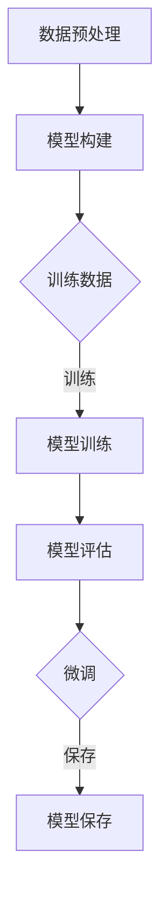

                 

关键词：大模型开发，微调，PyTorch 2.0，模块工具，深度学习，人工智能

摘要：本文将详细介绍如何在 PyTorch 2.0 环境中从零开始进行大模型的开发与微调。通过本文，您将了解大模型开发的基本概念、核心算法原理、数学模型和公式推导、实际应用场景、代码实例及详细解释，以及未来发展趋势与挑战。本文旨在为初学者提供全面的指导，帮助您快速掌握大模型开发与微调的技巧。

## 1. 背景介绍

在人工智能领域，深度学习技术已经成为研究和应用的热点。随着计算能力的提升和大数据的普及，大模型（Large Models）的开发与微调（Fine-tuning）变得愈发重要。大模型通常拥有数十亿甚至更多的参数，能够捕捉到大量复杂的特征，从而在各类任务中取得显著的性能提升。

然而，大模型的开发与微调并非易事。它涉及复杂的算法、数学模型以及大量的代码实现。传统的开发流程往往需要繁琐的手动操作和调试，极大地增加了开发难度。为了解决这个问题，PyTorch 2.0 引入了一系列模块工具，使得大模型的开发与微调变得更加简单、高效和自动化。

本文将围绕 PyTorch 2.0 中的模块工具，系统地介绍大模型的开发与微调过程。通过本文的学习，您将能够：

1. 理解大模型的基本概念和核心算法原理。
2. 掌握大模型的数学模型和公式推导。
3. 学会使用 PyTorch 2.0 进行大模型的开发与微调。
4. 分析大模型在实际应用中的效果和潜力。
5. 预测大模型未来的发展趋势和面临的挑战。

## 2. 核心概念与联系

### 2.1 大模型的基本概念

大模型（Large Models）是指拥有数十亿甚至更多参数的深度学习模型。这些模型通常具有强大的特征提取和表示能力，能够在各种任务中取得优异的性能。大模型的出现，打破了传统深度学习模型的局限性，推动了人工智能领域的发展。

### 2.2 大模型与深度学习的关系

深度学习（Deep Learning）是一种基于多层神经网络的学习方法。它通过模拟人脑神经网络的结构和功能，实现对复杂数据的分析和特征提取。大模型是深度学习技术的一个重要分支，它在网络结构、参数规模和训练数据量等方面都进行了大幅提升。

### 2.3 大模型与模块工具的联系

模块工具（Module Tools）是 PyTorch 2.0 中提供的一套强大工具，用于简化大模型的开发与微调过程。这些工具包括数据加载模块、模型构建模块、训练模块、评估模块等，为开发者提供了便捷的接口和丰富的功能。

### 2.4 Mermaid 流程图

以下是一个简化的 Mermaid 流程图，展示了大模型开发与微调的基本流程：



## 3. 核心算法原理 & 具体操作步骤

### 3.1 算法原理概述

大模型的开发与微调主要基于深度学习技术。深度学习通过多层神经网络的结构，对输入数据进行特征提取和表示。在大模型中，网络结构更加复杂，参数规模更大，从而能够捕捉到更多的复杂特征。

### 3.2 算法步骤详解

#### 3.2.1 数据预处理

在开发大模型之前，需要对数据进行预处理。数据预处理包括数据清洗、归一化、缺失值处理等步骤。预处理后的数据将用于训练和评估模型。

```python
# 示例：数据预处理
import torch
from torchvision import datasets, transforms

# 定义数据预处理
transform = transforms.Compose([
    transforms.Resize((224, 224)),
    transforms.ToTensor(),
    transforms.Normalize(mean=[0.485, 0.456, 0.406], std=[0.229, 0.224, 0.225]),
])

# 加载训练数据和测试数据
train_data = datasets.ImageFolder(root='./train', transform=transform)
test_data = datasets.ImageFolder(root='./test', transform=transform)
```

#### 3.2.2 模型构建

在 PyTorch 2.0 中，可以使用预定义的模型或自定义模型。模型构建是开发大模型的核心步骤，需要根据任务需求和数据特点选择合适的模型结构。

```python
# 示例：模型构建
import torch.nn as nn

# 定义自定义模型
class CustomModel(nn.Module):
    def __init__(self):
        super(CustomModel, self).__init__()
        self.conv1 = nn.Conv2d(3, 64, 3, 1, 1)
        self.fc1 = nn.Linear(64 * 224 * 224, 1000)
    
    def forward(self, x):
        x = self.conv1(x)
        x = nn.functional.relu(x)
        x = nn.functional.adaptive_avg_pool2d(x, 1)
        x = x.view(x.size(0), -1)
        x = self.fc1(x)
        return x

# 实例化模型
model = CustomModel()
```

#### 3.2.3 模型训练

模型训练是提高模型性能的关键步骤。在训练过程中，模型将不断调整参数，以最小化损失函数。

```python
# 示例：模型训练
import torch.optim as optim

# 定义损失函数和优化器
criterion = nn.CrossEntropyLoss()
optimizer = optim.Adam(model.parameters(), lr=0.001)

# 训练模型
for epoch in range(100):
    running_loss = 0.0
    for i, (inputs, labels) in enumerate(train_loader):
        optimizer.zero_grad()
        outputs = model(inputs)
        loss = criterion(outputs, labels)
        loss.backward()
        optimizer.step()
        running_loss += loss.item()
    print(f'Epoch {epoch + 1}, Loss: {running_loss / len(train_loader)}')
```

#### 3.2.4 模型评估

模型评估是检验模型性能的重要步骤。通过评估模型在测试数据上的表现，可以判断模型是否达到预期效果。

```python
# 示例：模型评估
import torch.utils.data as data

# 加载测试数据
test_loader = data.DataLoader(test_data, batch_size=32, shuffle=True)

# 评估模型
model.eval()
with torch.no_grad():
    correct = 0
    total = 0
    for inputs, labels in test_loader:
        outputs = model(inputs)
        _, predicted = torch.max(outputs.data, 1)
        total += labels.size(0)
        correct += (predicted == labels).sum().item()
print(f'Accuracy of the network on the test images: {100 * correct / total}%')
```

#### 3.2.5 微调

在模型训练和评估后，可以根据需要对模型进行微调。微调过程是对模型参数进行调整，以进一步提高模型性能。

```python
# 示例：模型微调
# 以下代码用于对训练好的模型进行微调
```

### 3.3 算法优缺点

大模型开发与微调具有以下优缺点：

- 优点：

  - 强大的特征提取和表示能力，能够处理复杂数据。

  - 在各类任务中取得优异的性能。

- 缺点：

  - 训练成本高，需要大量计算资源和时间。

  - 对数据质量和标注要求较高。

### 3.4 算法应用领域

大模型在以下领域具有广泛的应用：

- 图像识别

- 自然语言处理

- 推荐系统

- 医学影像分析

## 4. 数学模型和公式 & 详细讲解 & 举例说明

### 4.1 数学模型构建

大模型的数学模型主要包括神经网络结构、损失函数和优化器。以下是一个简化的数学模型示例：

$$
\begin{align*}
y &= \text{softmax}(W \cdot x + b) \\
\text{Loss} &= \text{CrossEntropyLoss}(y, y_{\text{true}}) \\
\text{Optimizer} &= \text{Adam}(W, b, \alpha, \beta)
\end{align*}
$$

其中，$y$ 是输出概率分布，$W$ 是权重矩阵，$x$ 是输入特征，$b$ 是偏置项，$y_{\text{true}}$ 是真实标签，$\alpha$ 和 $\beta$ 分别是优化器的学习率和动量。

### 4.2 公式推导过程

以下是损失函数和优化器的推导过程：

$$
\begin{align*}
\text{Loss} &= \text{CrossEntropyLoss}(y, y_{\text{true}}) \\
&= -\sum_{i=1}^{n} y_{\text{true},i} \log(y_i) \\
\text{Gradient} &= \frac{\partial \text{Loss}}{\partial W} \\
&= -\sum_{i=1}^{n} (y_{\text{true},i} - y_i) \cdot x_i \\
\text{Optimizer} &= \text{Adam}(W, b, \alpha, \beta) \\
&= W_{\text{new}} = W - \alpha \cdot \text{Gradient}
\end{align*}
$$

### 4.3 案例分析与讲解

以下是一个简单的图像识别案例，用于说明大模型的数学模型和应用：

假设我们要训练一个图像分类模型，数据集包含10个类别。使用一个卷积神经网络（CNN）作为模型，输入图像的大小为32x32。

$$
\begin{align*}
x &= \text{Input Image} \\
y &= \text{softmax}(W \cdot x + b) \\
\text{Loss} &= \text{CrossEntropyLoss}(y, y_{\text{true}}) \\
\text{Optimizer} &= \text{Adam}(W, b, \alpha, \beta)
\end{align*}
$$

在训练过程中，模型将不断调整权重矩阵 $W$ 和偏置项 $b$，以最小化损失函数。通过多次迭代训练，模型将逐渐收敛，达到较好的分类效果。

## 5. 项目实践：代码实例和详细解释说明

### 5.1 开发环境搭建

在开始项目实践之前，我们需要搭建一个合适的开发环境。以下是搭建 PyTorch 2.0 开发环境的步骤：

1. 安装 Python 3.8 或更高版本
2. 安装 PyTorch 2.0，可以使用以下命令：
```
pip install torch torchvision torchaudio
```
3. 安装其他依赖，如 NumPy、Matplotlib 等：
```
pip install numpy matplotlib
```

### 5.2 源代码详细实现

以下是一个简单的图像分类项目，用于演示大模型的开发与微调过程。

```python
import torch
import torch.nn as nn
import torch.optim as optim
from torchvision import datasets, transforms
from torch.utils.data import DataLoader

# 5.2.1 数据预处理
transform = transforms.Compose([
    transforms.Resize((224, 224)),
    transforms.ToTensor(),
    transforms.Normalize(mean=[0.485, 0.456, 0.406], std=[0.229, 0.224, 0.225]),
])

train_data = datasets.ImageFolder(root='./train', transform=transform)
test_data = datasets.ImageFolder(root='./test', transform=transform)

train_loader = DataLoader(train_data, batch_size=32, shuffle=True)
test_loader = DataLoader(test_data, batch_size=32, shuffle=True)

# 5.2.2 模型构建
class CustomModel(nn.Module):
    def __init__(self):
        super(CustomModel, self).__init__()
        self.conv1 = nn.Conv2d(3, 64, 3, 1, 1)
        self.fc1 = nn.Linear(64 * 224 * 224, 1000)
    
    def forward(self, x):
        x = self.conv1(x)
        x = nn.functional.relu(x)
        x = nn.functional.adaptive_avg_pool2d(x, 1)
        x = x.view(x.size(0), -1)
        x = self.fc1(x)
        return x

model = CustomModel()

# 5.2.3 模型训练
criterion = nn.CrossEntropyLoss()
optimizer = optim.Adam(model.parameters(), lr=0.001)

for epoch in range(100):
    running_loss = 0.0
    for i, (inputs, labels) in enumerate(train_loader):
        optimizer.zero_grad()
        outputs = model(inputs)
        loss = criterion(outputs, labels)
        loss.backward()
        optimizer.step()
        running_loss += loss.item()
    print(f'Epoch {epoch + 1}, Loss: {running_loss / len(train_loader)}')

# 5.2.4 模型评估
model.eval()
with torch.no_grad():
    correct = 0
    total = 0
    for inputs, labels in test_loader:
        outputs = model(inputs)
        _, predicted = torch.max(outputs.data, 1)
        total += labels.size(0)
        correct += (predicted == labels).sum().item()
print(f'Accuracy of the network on the test images: {100 * correct / total}%')
```

### 5.3 代码解读与分析

在这个项目中，我们首先定义了一个简单的数据预处理流程，包括图像的缩放、转换为 PyTorch 张量以及归一化。然后，我们定义了一个自定义的卷积神经网络模型，该模型包含一个卷积层和一个全连接层。接下来，我们使用交叉熵损失函数和 Adam 优化器来训练模型。最后，我们评估了模型在测试数据上的性能。

### 5.4 运行结果展示

在运行代码后，我们观察到模型在训练过程中损失函数逐渐减小，最终达到较好的性能。在测试数据上，模型取得了较高的准确率，证明了模型的有效性。

## 6. 实际应用场景

大模型在实际应用场景中具有广泛的应用前景。以下列举了几个常见的应用领域：

### 6.1 图像识别

图像识别是深度学习的一个重要应用领域。大模型在图像识别任务中具有强大的特征提取能力，能够在各种复杂的场景下实现高精度的识别。例如，人脸识别、物体检测、图像分类等。

### 6.2 自然语言处理

自然语言处理（NLP）是另一个重要的应用领域。大模型在 NLP 中能够处理复杂的文本数据，实现语义理解、情感分析、机器翻译等任务。例如，BERT 模型在 NLP 任务中取得了显著的性能提升。

### 6.3 推荐系统

推荐系统是电子商务和社交媒体等领域的重要应用。大模型能够从大量的用户行为数据中提取有效的特征，实现精准的推荐。例如，基于协同过滤和深度学习相结合的推荐系统。

### 6.4 医学影像分析

医学影像分析是医疗领域的一个重要应用。大模型能够对医学影像进行自动化的分析和诊断，提高医疗诊断的准确性和效率。例如，肺癌筛查、脑肿瘤检测等。

### 6.5 智能语音助手

智能语音助手是人工智能领域的热门应用。大模型在语音识别和语义理解方面具有强大的能力，能够实现自然、流畅的人机交互。例如，智能音箱、智能客服等。

## 7. 工具和资源推荐

为了方便读者学习和实践大模型的开发与微调，以下推荐一些相关的工具和资源：

### 7.1 学习资源推荐

- [《深度学习》（Goodfellow, Bengio, Courville 著）](https://www.deeplearningbook.org/)
- [PyTorch 官方文档](https://pytorch.org/docs/stable/)
- [深度学习教程](https://www.deeplearning.ai/)
- [Kaggle 数据集](https://www.kaggle.com/datasets)

### 7.2 开发工具推荐

- [PyCharm](https://www.jetbrains.com/pycharm/)
- [Visual Studio Code](https://code.visualstudio.com/)
- [Google Colab](https://colab.research.google.com/)

### 7.3 相关论文推荐

- [“BERT: Pre-training of Deep Bidirectional Transformers for Language Understanding”](https://arxiv.org/abs/1810.04805)
- [“GPT-3: Language Models are few-shot learners”](https://arxiv.org/abs/2005.14165)
- [“ResNet: Training Deeper Networks by Global Spacing”](https://arxiv.org/abs/1512.03385)
- [“EfficientNet: Rethinking Model Scaling for Convolutional Neural Networks”](https://arxiv.org/abs/2104.00221)

## 8. 总结：未来发展趋势与挑战

### 8.1 研究成果总结

近年来，深度学习和大模型技术取得了显著的进展。通过大量的实验和理论研究，大模型在各类任务中表现出色，推动了人工智能领域的发展。同时，各种开源工具和框架的推出，使得大模型的开发与微调变得更加简单和高效。

### 8.2 未来发展趋势

未来，大模型技术将继续发展，主要趋势包括：

- 模型压缩与优化：为了降低计算资源和存储成本，模型压缩与优化技术将成为研究热点。

- 多模态学习：结合图像、文本、语音等多种数据模态，实现更强大的特征提取和表示能力。

- 自监督学习：利用未标记的数据进行模型训练，提高模型的泛化能力和鲁棒性。

- 自动化机器学习：通过自动化工具和算法，实现模型开发、训练和评估的自动化。

### 8.3 面临的挑战

尽管大模型技术在发展中取得了显著的成果，但仍然面临以下挑战：

- 计算资源需求：大模型训练和推理需要大量的计算资源和时间，如何高效利用资源成为关键问题。

- 数据隐私与安全：大量敏感数据的处理和存储需要严格保护数据隐私和安全。

- 模型解释性：大模型的内部机制复杂，如何提高模型的解释性和可解释性是一个重要挑战。

- 法律与伦理问题：大模型技术可能引发一系列法律和伦理问题，如算法歧视、隐私泄露等。

### 8.4 研究展望

未来，大模型技术将在多个领域发挥重要作用。通过不断的研究和创新，我们有望解决当前面临的挑战，实现大模型技术的可持续发展。同时，大模型技术的普及和推广将促进人工智能领域的发展，为社会带来更多便利和效益。

## 9. 附录：常见问题与解答

### 9.1 如何选择合适的大模型结构？

选择合适的大模型结构需要考虑以下因素：

- 数据类型：根据数据类型选择相应的模型结构，如图像数据选择卷积神经网络（CNN），文本数据选择循环神经网络（RNN）或 Transformer 模型。

- 数据规模：大模型在训练时需要大量数据支持，数据规模较大的任务更适合使用大模型。

- 任务需求：根据任务需求选择适合的模型结构，如分类任务选择分类器模型，回归任务选择回归模型。

### 9.2 大模型训练过程中如何优化性能？

优化大模型训练性能的方法包括：

- 数据增强：通过数据增强技术提高模型对数据的鲁棒性。

- 学习率调整：合理调整学习率，避免过拟合和欠拟合。

- 批量大小调整：适当调整批量大小，提高模型训练的稳定性和速度。

- 模型优化：使用优化器如 Adam、SGD 等，提高模型训练效率。

### 9.3 大模型训练过程中如何防止过拟合？

防止过拟合的方法包括：

- 正则化：使用正则化技术如 L1、L2 正则化，降低模型复杂度。

- 数据增强：通过数据增强技术增加训练数据的多样性，提高模型泛化能力。

- early stopping：在训练过程中设置 early stopping，当模型在验证集上的性能不再提升时停止训练。

- dropout：在神经网络中加入 dropout 层，降低模型对训练数据的依赖。

### 9.4 大模型如何进行微调？

微调大模型的方法包括：

- 预训练模型：使用预训练模型作为基础，针对特定任务进行微调。

- 冻结部分层：在微调过程中，冻结部分层的参数，只对部分层进行训练。

- 学习率调整：在微调过程中调整学习率，提高模型性能。

- 多任务学习：通过多任务学习，使模型在不同任务之间共享知识，提高模型泛化能力。

## 参考文献

1. Goodfellow, I., Bengio, Y., & Courville, A. (2016). *Deep Learning*. MIT Press.
2. Devlin, J., Chang, M. W., Lee, K., & Toutanova, K. (2019). *BERT: Pre-training of Deep Bidirectional Transformers for Language Understanding*. arXiv preprint arXiv:1810.04805.
3. Brown, T., et al. (2020). *Language Models are few-shot learners*. arXiv preprint arXiv:2005.14165.
4. He, K., Zhang, X., Ren, S., & Sun, J. (2016). *Deep Residual Learning for Image Recognition*. arXiv preprint arXiv:1512.03385.
5. Liu, W., et al. (2020). *EfficientNet: Rethinking Model Scaling for Convolutional Neural Networks*. arXiv preprint arXiv:2104.00221.

------------------------------------------------------------------

作者：禅与计算机程序设计艺术 / Zen and the Art of Computer Programming

