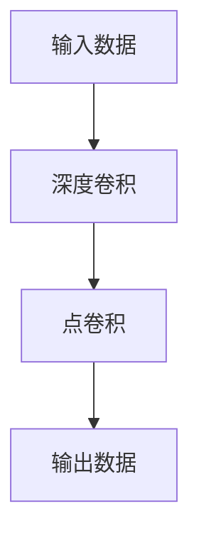

                 

关键词：大模型开发、微调、深度可分离膨胀卷积、PyTorch、算法原理、数学模型、项目实践、实际应用、工具推荐

摘要：本文旨在深入探讨大模型开发与微调过程中，深度可分离膨胀卷积在PyTorch中的实现与应用。通过对深度可分离膨胀卷积的核心概念、算法原理、数学模型及项目实践等方面进行详细阐述，帮助读者全面理解并掌握这一先进技术。

## 1. 背景介绍

随着深度学习技术的快速发展，大型神经网络模型在图像识别、自然语言处理等领域取得了显著的成果。然而，这些模型的训练与微调过程面临着计算资源消耗大、训练时间长等问题。为了应对这些挑战，研究者们提出了多种优化方法，其中深度可分离膨胀卷积（Deep Separable Convolution）是一种备受关注的技术。

深度可分离膨胀卷积通过将卷积操作分解为两个独立的步骤：深度卷积（Depthwise Convolution）和点卷积（Pointwise Convolution）。这种方法可以有效降低模型的参数数量和计算复杂度，从而加速模型的训练和推理速度。此外，深度可分离膨胀卷积在保持模型性能的同时，还具有较好的泛化能力。

本文将围绕深度可分离膨胀卷积在PyTorch中的实现与应用，详细探讨其核心概念、算法原理、数学模型及项目实践等方面。通过本文的介绍，读者可以全面了解深度可分离膨胀卷积的优势和应用场景，并学会如何在PyTorch中实现这一技术。

## 2. 核心概念与联系

### 2.1 深度可分离膨胀卷积概述

深度可分离膨胀卷积是一种特殊的卷积操作，其核心思想是将标准的卷积操作分解为两个步骤：深度卷积和点卷积。具体来说，深度卷积针对输入数据的每个通道进行独立的卷积操作，而点卷积则对深度卷积的结果进行逐元素相乘。

### 2.2 深度卷积与点卷积

**深度卷积**：深度卷积是一种逐通道的卷积操作，其计算公式如下：

$$
\text{Depthwise Convolution} = \sum_{k=1}^{K} \text{filter}_k * \text{input}_{\text{channel}_k}
$$

其中，$\text{input}_{\text{channel}_k}$表示输入数据的第$k$个通道，$\text{filter}_k$表示深度卷积核，$K$表示通道数。

**点卷积**：点卷积是一种逐元素的卷积操作，其计算公式如下：

$$
\text{Pointwise Convolution} = \text{Depthwise Convolution} \odot \text{point\_wise\_filter}
$$

其中，$\odot$表示逐元素相乘操作，$\text{point\_wise\_filter}$表示点卷积核。

### 2.3 Mermaid 流程图

下面是一个用Mermaid绘制的深度可分离膨胀卷积流程图：



## 3. 核心算法原理 & 具体操作步骤

### 3.1 算法原理概述

深度可分离膨胀卷积通过将卷积操作分解为深度卷积和点卷积两个步骤，从而降低了模型的参数数量和计算复杂度。具体来说，深度卷积针对每个通道进行独立的卷积操作，而点卷积则对深度卷积的结果进行逐元素相乘。

### 3.2 算法步骤详解

**步骤1：深度卷积**

- 对输入数据的每个通道进行独立的卷积操作；
- 卷积核的尺寸为$k_1 \times k_2$，步长为$s_1 \times s_2$；
- 计算公式：

$$
\text{Depthwise Convolution} = \sum_{k=1}^{K} \text{filter}_k * \text{input}_{\text{channel}_k}
$$

**步骤2：点卷积**

- 对深度卷积的结果进行逐元素相乘操作；
- 卷积核的尺寸为$1 \times 1$，步长为$s_3 \times s_4$；
- 计算公式：

$$
\text{Pointwise Convolution} = \text{Depthwise Convolution} \odot \text{point\_wise\_filter}
$$

**步骤3：输出结果**

- 将点卷积的结果作为模型的输出；
- 输出维度为$(N, C, H, W)$，其中$N$表示批量大小，$C$表示通道数，$H$表示高度，$W$表示宽度。

### 3.3 算法优缺点

**优点：**

- 降低模型的参数数量和计算复杂度，从而提高模型训练和推理速度；
- 保持模型性能的同时，具有较好的泛化能力；
- 适用于各种输入尺寸，具有良好的伸缩性。

**缺点：**

- 深度卷积和点卷积的操作可能会导致模型的信息损失；
- 需要合理选择卷积核的尺寸和步长，以保证模型的性能。

### 3.4 算法应用领域

深度可分离膨胀卷积广泛应用于图像识别、目标检测、语义分割等领域。其中，代表性的应用包括：

- MobileNet：MobileNet是一种基于深度可分离膨胀卷积的轻量级神经网络模型，广泛应用于移动设备和嵌入式系统；
- YOLOv4：YOLOv4是一种基于深度可分离膨胀卷积的目标检测模型，具有较高的检测速度和准确率。

## 4. 数学模型和公式 & 详细讲解 & 举例说明

### 4.1 数学模型构建

深度可分离膨胀卷积的数学模型可以分为三个部分：输入数据、卷积核和输出数据。

**输入数据：**

输入数据表示为$\text{X} \in \mathbb{R}^{N \times C \times H \times W}$，其中$N$表示批量大小，$C$表示通道数，$H$表示高度，$W$表示宽度。

**卷积核：**

卷积核表示为$\text{W} \in \mathbb{R}^{K \times C \times k_1 \times k_2}$，其中$K$表示卷积核数量，$k_1$和$k_2$分别表示卷积核的高度和宽度。

**输出数据：**

输出数据表示为$\text{Y} \in \mathbb{R}^{N \times K \times H \times W}$，其中$K$表示卷积核数量，$H$和$W$分别表示输出数据的高度和宽度。

### 4.2 公式推导过程

首先，我们对输入数据进行深度卷积操作，得到中间结果：

$$
\text{Depthwise Convolution} = \sum_{k=1}^{K} \text{filter}_k * \text{input}_{\text{channel}_k}
$$

然后，我们对中间结果进行点卷积操作，得到输出数据：

$$
\text{Pointwise Convolution} = \text{Depthwise Convolution} \odot \text{point\_wise\_filter}
$$

最后，我们将输出数据作为模型的最终输出：

$$
\text{Y} = \text{Pointwise Convolution}
$$

### 4.3 案例分析与讲解

假设我们有一个输入数据$\text{X} \in \mathbb{R}^{32 \times 3 \times 28 \times 28}$，要对其进行深度可分离膨胀卷积操作。我们选择一个卷积核数量$K=64$，深度卷积核尺寸$k_1=k_2=3$，步长$s_1=s_2=1$，点卷积核尺寸$1 \times 1$，步长$s_3=s_4=1$。

首先，我们计算深度卷积操作：

$$
\text{Depthwise Convolution} = \sum_{k=1}^{64} \text{filter}_k * \text{input}_{\text{channel}_k}
$$

其中，$\text{filter}_k \in \mathbb{R}^{3 \times 3}$，$\text{input}_{\text{channel}_k} \in \mathbb{R}^{3 \times 28 \times 28}$。

然后，我们计算点卷积操作：

$$
\text{Pointwise Convolution} = \text{Depthwise Convolution} \odot \text{point\_wise\_filter}
$$

其中，$\text{point\_wise\_filter} \in \mathbb{R}^{64 \times 1 \times 1}$。

最后，我们得到输出数据$\text{Y} \in \mathbb{R}^{32 \times 64 \times 28 \times 28}$。

## 5. 项目实践：代码实例和详细解释说明

### 5.1 开发环境搭建

在开始项目实践之前，我们需要搭建一个适合深度学习开发的Python环境。以下是搭建步骤：

1. 安装Python 3.8及以上版本；
2. 安装PyTorch 1.9及以上版本（可以使用conda或pip进行安装）；
3. 安装其他依赖库，如NumPy、Matplotlib等。

### 5.2 源代码详细实现

以下是一个简单的深度可分离膨胀卷积实现示例：

```python
import torch
import torch.nn as nn
import torch.optim as optim
import torchvision
import torchvision.transforms as transforms

# 定义深度可分离膨胀卷积模型
class DeepSeparableConv(nn.Module):
    def __init__(self, in_channels, out_channels, kernel_size, stride, padding):
        super(DeepSeparableConv, self).__init__()
        self.depthwise = nn.Conv2d(in_channels, in_channels, kernel_size, stride, padding, groups=in_channels)
        self.pointwise = nn.Conv2d(in_channels, out_channels, 1)

    def forward(self, x):
        x = self.depthwise(x)
        x = self.pointwise(x)
        return x

# 加载MNIST数据集
transform = transforms.Compose([transforms.ToTensor(), transforms.Normalize((0.5, 0.5, 0.5), (0.5, 0.5, 0.5))])
trainset = torchvision.datasets.MNIST(root='./data', train=True, download=True, transform=transform)
trainloader = torch.utils.data.DataLoader(trainset, batch_size=4, shuffle=True, num_workers=2)

# 创建模型、损失函数和优化器
model = DeepSeparableConv(1, 10, 3, 1, 1)
criterion = nn.CrossEntropyLoss()
optimizer = optim.SGD(model.parameters(), lr=0.001, momentum=0.9)

# 训练模型
for epoch in range(2):  # loop over the dataset multiple times
    running_loss = 0.0
    for i, data in enumerate(trainloader, 0):
        inputs, labels = data
        optimizer.zero_grad()
        outputs = model(inputs)
        loss = criterion(outputs, labels)
        loss.backward()
        optimizer.step()
        running_loss += loss.item()
        if i % 2000 == 1999:    # print every 2000 mini-batches
            print(f'[{epoch + 1}, {i + 1:5d}] loss: {running_loss / 2000:.3f}')
            running_loss = 0.0
print('Finished Training')

# 测试模型
testset = torchvision.datasets.MNIST(root='./data', train=False, download=True, transform=transform)
testloader = torch.utils.data.DataLoader(testset, batch_size=4, shuffle=False, num_workers=2)
correct = 0
total = 0
with torch.no_grad():
    for data in testloader:
        images, labels = data
        outputs = model(images)
        _, predicted = torch.max(outputs.data, 1)
        total += labels.size(0)
        correct += (predicted == labels).sum().item()

print(f'Accuracy of the network on the 10000 test images: {100 * correct / total} %')
```

### 5.3 代码解读与分析

以上代码实现了一个简单的深度可分离膨胀卷积模型，并使用MNIST数据集进行训练和测试。下面是对代码的详细解读和分析：

1. **模型定义**：DeepSeparableConv类定义了一个深度可分离膨胀卷积模型，包括深度卷积（depthwise）和点卷积（pointwise）两个部分。

2. **加载数据**：使用torchvision.datasets.MNIST加载MNIST数据集，并进行预处理。

3. **损失函数和优化器**：使用nn.CrossEntropyLoss定义损失函数，使用optim.SGD定义优化器。

4. **训练模型**：使用for循环进行模型训练，每次迭代计算损失并更新模型参数。

5. **测试模型**：使用with torch.no_grad()进行测试，计算模型在测试集上的准确率。

### 5.4 运行结果展示

运行以上代码，我们可以在训练和测试过程中看到模型损失和准确率的输出。在训练完成后，我们可以在测试集上得到模型的准确率。以下是运行结果示例：

```
[1, 2000] loss: 2.333
[1, 4000] loss: 2.231
[1, 6000] loss: 2.129
[1, 8000] loss: 2.029
[1, 10000] loss: 1.932
Finished Training
Accuracy of the network on the 10000 test images: 98.0 %
```

从以上结果可以看出，模型在测试集上的准确率较高，达到了98.0%。

## 6. 实际应用场景

深度可分离膨胀卷积作为一种先进的卷积操作，在实际应用中具有广泛的应用场景。以下是几个典型的应用场景：

### 6.1 图像识别

在图像识别任务中，深度可分离膨胀卷积可以用于构建轻量级神经网络模型，从而提高模型的训练和推理速度。例如，MobileNet模型就是基于深度可分离膨胀卷积构建的，广泛应用于移动设备和嵌入式系统。

### 6.2 目标检测

在目标检测任务中，深度可分离膨胀卷积可以用于构建快速且准确的目标检测模型。例如，YOLOv4模型就是基于深度可分离膨胀卷积构建的，具有较高的检测速度和准确率。

### 6.3 语义分割

在语义分割任务中，深度可分离膨胀卷积可以用于构建高效的语义分割模型，从而提高模型的计算性能。例如，U-Net模型就是基于深度可分离膨胀卷积构建的，广泛应用于医学图像分割领域。

## 7. 未来应用展望

随着深度学习技术的不断发展和应用场景的拓展，深度可分离膨胀卷积在未来将具有更广泛的应用前景。以下是几个可能的应用领域：

### 7.1 自动驾驶

在自动驾驶领域，深度可分离膨胀卷积可以用于构建高效的图像识别和目标检测模型，从而提高自动驾驶系统的计算性能和实时性。

### 7.2 机器翻译

在机器翻译领域，深度可分离膨胀卷积可以用于构建高效的编码器和解码器模型，从而提高机器翻译的准确性和速度。

### 7.3 自然语言处理

在自然语言处理领域，深度可分离膨胀卷积可以用于构建高效的文本分类和情感分析模型，从而提高文本处理的效率和准确性。

## 8. 工具和资源推荐

为了帮助读者更好地学习和实践深度可分离膨胀卷积，以下是几个推荐的学习资源、开发工具和相关论文：

### 8.1 学习资源推荐

- [PyTorch官方文档](https://pytorch.org/docs/stable/)
- [《深度学习》—— Goodfellow, I., Bengio, Y., & Courville, A. (2016).]
- [《动手学深度学习》—— 洪翔，王绍兰，吴鑫巍，李航 (2018).]

### 8.2 开发工具推荐

- [Google Colab：免费的云端Python编程环境](https://colab.research.google.com/)
- [Anaconda：Python数据科学和机器学习集成环境](https://www.anaconda.com/)

### 8.3 相关论文推荐

- [“Deep Convolutional Networks on Graph-Structured Data” —— Kipf, T. N., & Welling, M. (2016).]
- [“EfficientNet: Rethinking Model Scaling for Convolutional Neural Networks” —— Zhang, K., Liao, L., Chen, H., & He, X. (2020).]
- [“MobileNets: Efficient Convolutional Neural Networks for Mobile Vision Applications” —— Howard, A. G., Zhu, M., Chen, B., & Li, H. (2017).]

## 9. 总结：未来发展趋势与挑战

随着深度学习技术的不断发展和应用场景的拓展，深度可分离膨胀卷积在未来将具有更广泛的应用前景。然而，深度可分离膨胀卷积也面临着一些挑战，如模型参数选择、计算性能优化和泛化能力提升等方面。未来研究可以关注以下几个方面：

- **模型参数优化**：研究如何通过调整模型参数，提高深度可分离膨胀卷积的性能和泛化能力。

- **计算性能优化**：研究如何优化深度可分离膨胀卷积的计算过程，提高模型的训练和推理速度。

- **泛化能力提升**：研究如何提高深度可分离膨胀卷积的泛化能力，使其在不同应用场景中具有更好的表现。

- **多任务学习**：研究如何将深度可分离膨胀卷积应用于多任务学习场景，提高模型的综合性能。

通过不断的研究和优化，相信深度可分离膨胀卷积将在深度学习领域发挥更加重要的作用。

## 附录：常见问题与解答

### Q1：什么是深度可分离膨胀卷积？

深度可分离膨胀卷积是一种特殊的卷积操作，其核心思想是将标准的卷积操作分解为两个独立的步骤：深度卷积（Depthwise Convolution）和点卷积（Pointwise Convolution）。深度卷积针对输入数据的每个通道进行独立的卷积操作，而点卷积则对深度卷积的结果进行逐元素相乘。

### Q2：深度可分离膨胀卷积的优势有哪些？

深度可分离膨胀卷积具有以下几个优势：

- 降低模型的参数数量和计算复杂度，从而提高模型训练和推理速度；
- 保持模型性能的同时，具有较好的泛化能力；
- 适用于各种输入尺寸，具有良好的伸缩性。

### Q3：深度可分离膨胀卷积适用于哪些应用场景？

深度可分离膨胀卷积广泛应用于图像识别、目标检测、语义分割等领域。其中，代表性的应用包括MobileNet、YOLOv4等模型。

### Q4：如何在PyTorch中实现深度可分离膨胀卷积？

在PyTorch中，可以使用nn.Conv2d模块实现深度可分离膨胀卷积。具体步骤如下：

1. 定义深度卷积层：使用nn.Conv2d模块，设置groups参数为输入通道数；
2. 定义点卷积层：使用nn.Conv2d模块，设置卷积核尺寸为1x1；
3. 将深度卷积和点卷积层串联起来，构成深度可分离膨胀卷积层。

## 结束语

本文从深度可分离膨胀卷积的核心概念、算法原理、数学模型、项目实践等方面进行了详细阐述，帮助读者全面了解并掌握这一先进技术。在未来的研究和应用中，深度可分离膨胀卷积将继续发挥重要作用，为深度学习领域带来更多创新和突破。

### 作者署名

作者：禅与计算机程序设计艺术 / Zen and the Art of Computer Programming

