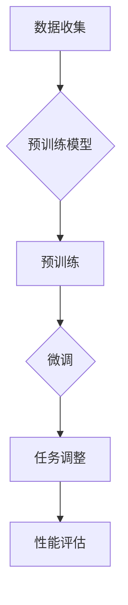

                 

### 1. 背景介绍

随着人工智能技术的迅猛发展，自然语言处理（NLP）逐渐成为计算机科学领域的一个重要分支。自然语言处理的核心目标是将人类语言转化为计算机可以理解和处理的数字信号，实现人与机器的智能交互。而在自然语言处理领域，大模型开发与微调技术正日益受到关注。

大模型开发指的是通过大规模数据训练和优化，构建具有强大语义理解和生成能力的神经网络模型。而微调则是针对特定任务，在已有大模型的基础上进行精细化调整，以提升模型在特定领域的性能。

本文旨在从零开始，详细介绍大模型开发与微调的基本概念、核心算法、数学模型，并结合实际项目案例，帮助读者全面了解并掌握这一前沿技术。通过本文的学习，读者将能够：

1. 掌握自然语言处理的基本原理和常用技术。
2. 理解大模型开发与微调的关键步骤和注意事项。
3. 学会使用主流开源工具和框架进行大模型训练与微调。
4. 能够在实际项目中应用大模型开发与微调技术，提升模型性能。

本文分为以下几个部分：

1. 背景介绍：概述自然语言处理的发展历程，介绍大模型开发与微调的重要性。
2. 核心概念与联系：详细解释大模型开发与微调的核心概念和联系，并使用Mermaid流程图展示架构。
3. 核心算法原理与具体操作步骤：介绍大模型开发与微调的核心算法，包括算法原理概述、步骤详解、优缺点分析及应用领域。
4. 数学模型和公式：讲解大模型开发与微调的数学模型和公式，包括模型构建、公式推导过程和案例分析与讲解。
5. 项目实践：提供实际项目中的代码实例和详细解释说明，帮助读者理解大模型开发与微调的具体应用。
6. 实际应用场景：探讨大模型开发与微调在不同领域的实际应用场景和未来发展趋势。
7. 工具和资源推荐：介绍相关学习资源、开发工具和论文推荐，帮助读者深入学习和实践。
8. 总结：对研究成果进行总结，探讨未来发展趋势与挑战。

希望通过本文的学习，读者能够在大模型开发与微调领域取得更大的进展，为人工智能技术的发展贡献自己的力量。

### 2. 核心概念与联系

在深入探讨大模型开发与微调之前，我们首先需要了解一些核心概念，以及它们之间的联系。这些概念包括但不限于：神经网络、深度学习、自然语言处理（NLP）、预训练（Pre-training）、微调（Fine-tuning）等。

#### 神经网络（Neural Networks）

神经网络是模仿人脑神经元连接和运作的一种计算模型。它由一系列相互连接的节点（或称为“神经元”）组成，这些节点通过权重和偏置进行信息传递和处理。神经网络的核心在于其层次结构，不同层次的节点负责处理不同级别的抽象信息。在自然语言处理中，神经网络被广泛应用于语言模型的构建和语义理解。

#### 深度学习（Deep Learning）

深度学习是神经网络的一种特殊形式，通过增加网络深度（即增加层数）来提升模型的表示能力和学习能力。深度学习在图像识别、语音识别和自然语言处理等领域取得了显著的成果。深度学习的关键在于其能够自动学习数据的复杂特征和模式，从而实现高效的特征提取和分类。

#### 自然语言处理（NLP）

自然语言处理是计算机科学和人工智能领域的一个分支，旨在使计算机能够理解、解释和生成人类语言。NLP涉及文本预处理、词性标注、句法分析、语义理解和生成等多个方面。自然语言处理的挑战在于语言的不确定性和复杂性，这要求模型具有强大的表示能力和适应能力。

#### 预训练（Pre-training）

预训练是指在特定任务数据集之前，对模型进行大规模语言数据的预训练。预训练的目的是让模型在通用语言特征上获得良好的表现，从而为后续的微调和特定任务适应奠定基础。预训练常用的数据集包括维基百科、新闻文章和社交媒体等。

#### 微调（Fine-tuning）

微调是指在大模型预训练的基础上，针对特定任务对模型进行调整和优化。微调的主要目的是利用预训练模型在通用语言特征上的优势，结合特定任务的语义和知识，提升模型在特定任务上的性能。微调通常涉及调整模型的参数、增加或删除层、改变损失函数等操作。

#### 核心概念原理和架构的 Mermaid 流程图

以下是一个简单的Mermaid流程图，用于展示大模型开发与微调的核心概念和架构：



在这个流程图中，A表示数据收集，即收集用于预训练的数据集。B表示预训练模型，它是通过大规模语言数据进行训练得到的。C表示预训练过程，包括数据预处理、模型初始化、训练和优化等步骤。D表示微调，即在大模型预训练的基础上，针对特定任务进行调整。E表示任务调整，包括调整模型的参数、架构和损失函数等。F表示性能评估，用于衡量微调后模型在特定任务上的性能。

通过这个流程图，我们可以清晰地看到大模型开发与微调的基本步骤和核心概念之间的联系。接下来，我们将进一步详细探讨这些概念和流程的具体实现。

#### 2.1 神经网络和深度学习

神经网络（Neural Networks）是模仿人脑神经元连接和运作的一种计算模型。每个神经元都与其他神经元通过突触连接，并通过传递电信号来处理和传递信息。在计算机科学中，神经网络通过一系列相互连接的节点（或称为“神经元”）来模拟这一过程。这些节点通过权重和偏置进行信息传递和处理，从而实现对数据的分析和分类。

深度学习（Deep Learning）是神经网络的一种特殊形式，通过增加网络深度（即增加层数）来提升模型的表示能力和学习能力。在深度学习中，神经网络通常由多个隐藏层组成，每个隐藏层负责处理不同级别的抽象信息。深度学习的核心在于其能够自动学习数据的复杂特征和模式，从而实现高效的特征提取和分类。

在自然语言处理中，神经网络和深度学习被广泛应用于语言模型的构建和语义理解。语言模型是一种概率模型，用于预测下一个单词或字符的概率，从而生成自然流畅的语言序列。深度学习语言模型通过学习大量的文本数据，能够捕捉到语言的复杂结构和语义信息，从而实现高效的文本生成和语义理解。

深度学习在自然语言处理中的优势主要体现在以下几个方面：

1. **强大的表示能力**：深度学习能够自动学习数据的复杂特征和模式，从而生成丰富的表示。这种表示能力使得深度学习在文本分类、情感分析、机器翻译等任务中表现出色。
2. **自适应性和泛化能力**：深度学习模型可以通过大规模数据训练，实现良好的自适应性和泛化能力。这意味着模型不仅能够在训练数据上表现良好，还能在未见过的数据上保持稳定的表现。
3. **高效的计算能力**：随着计算能力的提升，深度学习模型可以在较短的时间内处理大量的数据，从而实现高效的自然语言处理。

然而，深度学习也存在一些挑战和局限性：

1. **数据需求大**：深度学习模型需要大量的训练数据来学习数据的复杂特征，这对于数据稀缺或数据质量不高的场景是一个挑战。
2. **计算资源消耗大**：深度学习模型通常需要大量的计算资源来训练和优化，这可能导致模型部署成本高，不适用于资源受限的环境。
3. **解释性差**：深度学习模型通常被视为“黑盒”，其内部机制和决策过程难以解释。这可能导致模型在实际应用中难以被用户理解和信任。

尽管存在这些挑战，深度学习在自然语言处理中的应用前景依然广阔。通过不断的研究和改进，深度学习将继续为自然语言处理领域带来新的突破和机遇。

#### 2.2 自然语言处理（NLP）

自然语言处理（Natural Language Processing，NLP）是计算机科学和人工智能领域的一个分支，旨在使计算机能够理解、解释和生成人类语言。NLP的核心目标是将人类语言转化为计算机可以理解和处理的数字信号，从而实现人与机器的智能交互。

NLP涉及多个方面，包括文本预处理、词性标注、句法分析、语义理解和生成等。以下是NLP的一些主要任务：

1. **文本预处理**：文本预处理是NLP的基础步骤，包括去除噪声、分词、去停用词、词形还原等。通过这些步骤，可以有效地提取文本中的有用信息，为后续的NLP任务奠定基础。
2. **词性标注**：词性标注是指为文本中的每个单词分配一个词性标签，如名词、动词、形容词等。词性标注有助于理解文本的语法结构和语义信息。
3. **句法分析**：句法分析是指对文本进行句子结构分析，识别句子中的主语、谓语、宾语等成分。句法分析有助于理解文本的语法结构和语义关系。
4. **语义理解**：语义理解是指对文本中的语义内容进行分析和解释，识别文本中的事实、观点、情感等。语义理解是NLP的核心任务之一，它有助于实现文本分类、情感分析、实体识别等应用。
5. **文本生成**：文本生成是指根据给定的输入或模板，生成具有自然流畅性的文本。文本生成在机器翻译、聊天机器人、自动摘要等领域有广泛应用。

NLP技术在多个领域取得了显著的应用成果：

1. **信息检索**：通过NLP技术，可以实现对大量文本数据的检索和过滤，从而提高信息获取的效率和准确性。
2. **文本分类**：NLP技术可以用于对大量文本进行分类，如新闻分类、垃圾邮件过滤等。
3. **情感分析**：通过分析文本中的情感倾向，可以为产品评价、市场分析等提供有价值的信息。
4. **机器翻译**：NLP技术可以用于实现跨语言的文本翻译，如百度翻译、谷歌翻译等。
5. **聊天机器人**：NLP技术可以用于实现与用户的自然语言交互，如聊天机器人、虚拟助手等。

NLP技术的发展趋势主要集中在以下几个方面：

1. **预训练模型**：预训练模型通过在大规模语料库上进行预训练，可以有效地捕捉到语言的通用特征和复杂结构，从而提升模型在多个NLP任务上的性能。
2. **端到端模型**：端到端模型直接从输入到输出进行建模，无需人工设计中间层和特征提取，从而简化了模型设计和训练过程。
3. **多模态融合**：将文本、图像、音频等多模态数据进行融合，可以进一步提升模型的语义理解和生成能力。
4. **可解释性和公平性**：随着NLP模型在实际应用中的广泛使用，如何提高模型的可解释性和公平性成为重要的研究方向。

通过不断的研究和创新，NLP技术将在人工智能领域发挥越来越重要的作用，为人类带来更加智能和便捷的数字化生活。

### 3. 核心算法原理 & 具体操作步骤

#### 3.1 算法原理概述

在大模型开发与微调的过程中，核心算法是保证模型性能和稳定性的关键。本文将介绍两种主要的核心算法：Transformer和BERT。

#### 3.1.1 Transformer

Transformer是Google在2017年提出的一种基于自注意力机制的深度神经网络模型，用于处理序列数据。Transformer的主要优势在于其并行化能力和全局依赖建模能力。下面是Transformer的基本原理：

1. **自注意力机制（Self-Attention）**：自注意力机制允许模型在处理每个词时，将注意力分配到整个序列的其他词上，从而捕捉全局依赖关系。自注意力通过计算词与词之间的相似度，生成权重，并将这些权重应用于输入序列，从而实现全局信息的有效整合。
   
2. **多头注意力（Multi-Head Attention）**：多头注意力是自注意力机制的扩展，通过多个独立的注意力机制来提取不同类型的依赖关系。每个头负责捕捉不同类型的依赖信息，然后将这些信息整合起来，从而提高模型的表示能力。

3. **编码器-解码器结构（Encoder-Decoder）**：Transformer采用编码器-解码器结构，编码器负责处理输入序列，解码器负责生成输出序列。编码器输出一系列隐藏状态，解码器将这些隐藏状态与输入序列的词进行交互，逐步生成输出序列的每个词。

#### 3.1.2 BERT

BERT（Bidirectional Encoder Representations from Transformers）是Google在2018年提出的一种基于Transformer的预训练模型。BERT的主要目标是捕捉语言的左右双向信息，从而提高模型的语义理解能力。BERT的基本原理如下：

1. **双向编码器（Bidirectional Encoder）**：BERT采用双向编码器，通过同时处理输入序列的前后信息，生成每个词的表示。双向编码器通过两个独立的Transformer编码器叠加，一个从左向右处理，另一个从右向左处理，然后将两个方向的信息进行拼接，得到每个词的全局表示。

2. **预训练目标**：BERT通过两种预训练任务来提高其语义理解能力：

   - **Masked Language Model（MLM）**：在输入序列中随机屏蔽一些词，然后使用BERT模型预测这些词。这种任务有助于模型学习词与词之间的上下文关系。
   - **Next Sentence Prediction（NSP）**：给定两个连续的句子，BERT需要预测第二个句子是否是第一个句子的下文。这种任务有助于模型理解句子之间的逻辑关系。

3. **微调目标**：在完成预训练后，BERT可以通过微调（Fine-tuning）来适应特定任务。微调过程中，模型会在特定任务数据上进行训练，调整模型的参数，从而提高模型在特定任务上的性能。

#### 3.2 算法步骤详解

下面详细描述Transformer和BERT的算法步骤。

##### 3.2.1 Transformer

1. **输入序列编码**：将输入序列（如句子）编码为词向量，通常使用WordPiece或BERT等词向量表示方法。

2. **嵌入层**：将词向量通过嵌入层映射为高维向量，同时加入位置编码（Positional Encoding）来保留输入序列的顺序信息。

3. **多头自注意力层**：应用多头自注意力机制，计算输入序列中每个词与其他词之间的相似度，并生成权重。每个头负责捕捉不同类型的依赖关系，然后将这些权重应用于输入序列，得到加权输出。

4. **前馈网络**：将多头自注意力的输出通过两个前馈网络进行非线性变换，增加模型的非线性表示能力。

5. **层归一化和残差连接**：在每个层之后添加层归一化（Layer Normalization）和残差连接（Residual Connection），以缓解梯度消失和梯度爆炸问题，并提高模型的训练稳定性。

6. **编码器-解码器交互**：编码器输出一系列隐藏状态，解码器将这些隐藏状态与输入序列的词进行交互，逐步生成输出序列的每个词。

7. **输出层**：解码器的最后一个隐藏状态经过输出层，得到最终的输出序列。

##### 3.2.2 BERT

1. **输入序列编码**：与Transformer类似，将输入序列编码为词向量，并加入位置编码。

2. **嵌入层**：通过嵌入层将词向量映射为高维向量。

3. **双向编码器**：应用两个独立的Transformer编码器，分别从左向右和从右向左处理输入序列。每个编码器包含多个自注意力层和前馈网络。

4. **预训练任务**：

   - **Masked Language Model（MLM）**：在输入序列中随机屏蔽一些词，然后使用BERT模型预测这些词。
   - **Next Sentence Prediction（NSP）**：给定两个连续的句子，预测第二个句子是否是第一个句子的下文。

5. **微调目标**：在特定任务数据集上进行微调，调整BERT模型的参数，以适应特定任务。

#### 3.3 算法优缺点

##### Transformer

**优点**：

1. **并行化能力强**：Transformer采用多头自注意力机制，可以在序列处理过程中并行计算，从而提高计算效率。
2. **全局依赖建模**：通过自注意力机制，Transformer能够捕捉到序列中的全局依赖关系，从而提高模型的语义理解能力。
3. **灵活性高**：Transformer结构简单，可以通过调整模型参数和层次数来适应不同规模和复杂度的任务。

**缺点**：

1. **计算资源消耗大**：由于自注意力机制的复杂计算，Transformer需要大量的计算资源，导致模型部署成本高。
2. **解释性差**：Transformer模型被视为“黑盒”，其内部机制和决策过程难以解释，可能导致在实际应用中难以被用户理解和信任。

##### BERT

**优点**：

1. **强大的语义理解能力**：BERT通过预训练和双向编码器结构，能够有效捕捉到语言的左右双向信息，从而提高模型的语义理解能力。
2. **广泛的适用性**：BERT在多个NLP任务上取得了显著的成果，如文本分类、情感分析、问答系统等。
3. **易微调**：BERT经过预训练后，可以通过微调快速适应特定任务，从而提高模型在特定任务上的性能。

**缺点**：

1. **数据需求大**：BERT需要大量训练数据来学习语言的复杂结构和语义信息，对于数据稀缺的场景可能效果不佳。
2. **计算资源消耗大**：由于预训练过程需要大量的计算资源，BERT的部署成本较高。

尽管存在一些缺点，Transformer和BERT在自然语言处理领域取得了显著的成果，并成为当前主流的NLP模型。通过不断的研究和改进，这些算法将继续推动NLP技术的发展。

#### 3.4 算法应用领域

Transformer和BERT作为强大的NLP模型，在多个领域取得了显著的成果。以下是一些主要的应用领域：

##### 文本分类

文本分类是指将文本数据分类到预定义的类别中，如情感分类、主题分类等。Transformer和BERT通过学习文本的语义信息，可以高效地实现文本分类任务。例如，BERT在情感分类任务上取得了显著的效果，能够准确预测文本的情感倾向。

##### 情感分析

情感分析是指对文本中的情感倾向进行分析和识别，如正面情感、负面情感等。Transformer和BERT通过学习文本的语义和情感特征，可以准确识别文本的情感倾向。例如，Transformer在社交媒体文本的情感分析中表现出色，能够有效识别用户的情感状态。

##### 问答系统

问答系统是指通过自然语言交互，回答用户的问题。Transformer和BERT通过学习大量的语言数据，可以准确理解和回答用户的问题。例如，BERT在问答系统中的应用，可以准确回答用户关于特定主题的问题。

##### 机器翻译

机器翻译是指将一种语言的文本翻译成另一种语言。Transformer和BERT在机器翻译任务上表现出色，通过学习语言的语义和语法结构，可以实现高质量的文本翻译。例如，Transformer在机器翻译中的应用，可以实现高效且准确的跨语言文本转换。

##### 命名实体识别

命名实体识别是指识别文本中的特定实体，如人名、地名、组织名等。Transformer和BERT通过学习文本的语义信息，可以准确识别命名实体。例如，BERT在命名实体识别任务上表现出色，能够准确识别文本中的各类命名实体。

通过以上应用领域可以看出，Transformer和BERT作为强大的NLP模型，在自然语言处理领域具有广泛的应用前景。随着算法的不断完善和应用场景的拓展，这些算法将继续推动NLP技术的发展。

### 4. 数学模型和公式

在大模型开发与微调过程中，数学模型和公式起着至关重要的作用。它们不仅帮助我们理解算法的工作原理，还指导我们在实际应用中调整和优化模型参数。以下是关于大模型开发与微调中的数学模型和公式的详细讲解。

#### 4.1 数学模型构建

在大模型开发与微调中，常用的数学模型主要包括神经网络模型、自注意力机制、损失函数等。

1. **神经网络模型**：

   神经网络模型的核心是一个多层感知机（MLP），它由输入层、隐藏层和输出层组成。每个层由多个神经元（节点）构成，神经元之间通过权重（weights）和偏置（biases）连接。神经元通过激活函数（activation function）进行非线性变换，从而实现特征的提取和分类。

   神经网络模型的数学表示如下：

   \[ f(\textbf{x}) = \text{ReLU}(\sum_{j=1}^{n} w_{j}x_{j} + b) \]

   其中，\(\textbf{x}\) 是输入向量，\(w_{j}\) 是权重，\(b\) 是偏置，\(n\) 是神经元的数量，ReLU 是ReLU激活函数。

2. **自注意力机制**：

   自注意力机制是Transformer模型的核心组成部分，它通过计算输入序列中每个词与其他词的相似度，生成权重，并加权求和，从而实现全局依赖关系的建模。

   自注意力机制的数学表示如下：

   \[ \text{Attention}(Q, K, V) = \text{softmax}\left(\frac{QK^T}{\sqrt{d_k}}\right)V \]

   其中，\(Q, K, V\) 分别是查询（query）、键（key）和值（value）向量，\(d_k\) 是键向量的维度，softmax 函数用于计算每个词的注意力权重。

3. **损失函数**：

   损失函数是评估模型预测结果与真实结果之间差异的指标，常用的损失函数包括均方误差（MSE）、交叉熵损失（Cross-Entropy Loss）等。

   均方误差的数学表示如下：

   \[ \text{MSE} = \frac{1}{N}\sum_{i=1}^{N} (\hat{y}_i - y_i)^2 \]

   其中，\(\hat{y}_i\) 是预测值，\(y_i\) 是真实值，\(N\) 是样本数量。

   交叉熵损失的数学表示如下：

   \[ \text{CE} = -\frac{1}{N}\sum_{i=1}^{N} y_i \log(\hat{y}_i) \]

   其中，\(y_i\) 是真实标签的概率分布，\(\hat{y}_i\) 是预测标签的概率分布。

#### 4.2 公式推导过程

在大模型开发与微调过程中，我们需要对各种公式进行推导和理解，以便在实际应用中灵活运用。以下是一些关键公式的推导过程：

1. **反向传播算法**：

   反向传播算法是训练神经网络的核心算法，它通过计算损失函数关于模型参数的梯度，实现对模型参数的优化。

   假设损失函数为 \(L(\theta)\)，其中 \(\theta\) 是模型参数，梯度计算公式如下：

   \[ \nabla_{\theta}L(\theta) = \frac{\partial L(\theta)}{\partial \theta} \]

   反向传播算法的核心在于计算每个参数的梯度，具体步骤如下：

   - 计算前向传播的激活值和预测值；
   - 计算损失函数关于预测值的梯度；
   - 通过反向传播，计算损失函数关于每个参数的梯度；
   - 使用梯度下降或其他优化算法更新参数。

2. **正则化技术**：

   正则化技术是防止神经网络过拟合的重要手段，常用的正则化技术包括权重衰减（Weight Decay）和dropout等。

   权重衰减的数学表示如下：

   \[ \nabla_{\theta}L(\theta) = \frac{\partial L(\theta)}{\partial \theta} + \lambda \theta \]

   其中，\(\lambda\) 是权重衰减系数，\(\theta\) 是模型参数。

   dropout的数学表示如下：

   \[ \text{dropout} = \frac{1}{1 - p} \]

   其中，\(p\) 是dropout的概率。

3. **梯度下降算法**：

   梯度下降算法是优化神经网络参数的常用方法，其核心思想是通过更新参数来最小化损失函数。

   梯度下降算法的更新公式如下：

   \[ \theta_{t+1} = \theta_{t} - \alpha \nabla_{\theta}L(\theta) \]

   其中，\(\theta_{t}\) 是当前参数值，\(\theta_{t+1}\) 是更新后的参数值，\(\alpha\) 是学习率。

4. **自注意力机制**：

   自注意力机制的推导过程如下：

   - 计算每个词的查询（query）、键（key）和值（value）向量；
   - 计算每个词与其他词的相似度，生成注意力权重；
   - 加权求和，得到每个词的注意力得分；
   - 应用激活函数，得到每个词的注意力表示。

   自注意力机制的数学表示如下：

   \[ \text{Attention}(Q, K, V) = \text{softmax}\left(\frac{QK^T}{\sqrt{d_k}}\right)V \]

   其中，\(Q, K, V\) 分别是查询（query）、键（key）和值（value）向量，\(d_k\) 是键向量的维度，softmax 函数用于计算每个词的注意力权重。

#### 4.3 案例分析与讲解

为了更好地理解大模型开发与微调中的数学模型和公式，我们通过一个实际案例进行分析和讲解。

**案例：文本分类任务**

假设我们使用BERT模型进行文本分类任务，给定一个训练数据集和测试数据集，我们的目标是训练一个分类模型，能够准确预测文本的类别。

1. **数据预处理**：

   首先，我们对训练数据集和测试数据集进行预处理，包括分词、编码和加载数据等操作。具体步骤如下：

   - 分词：使用BERT的分词器对文本进行分词；
   - 编码：将分词后的文本编码为词索引序列，并添加特殊符号，如\[CLS\]和\[SEP\]；
   - 加载数据：将编码后的文本数据加载到数据集中，并进行批量处理。

2. **模型训练**：

   接下来，我们使用BERT模型进行训练。具体步骤如下：

   - 初始化模型参数：随机初始化BERT模型的参数；
   - 预训练任务：使用Masked Language Model（MLM）和Next Sentence Prediction（NSP）进行预训练；
   - 微调任务：在预训练的基础上，针对文本分类任务进行微调，调整模型的参数。

3. **模型评估**：

   训练完成后，我们对模型进行评估，计算模型的准确率、召回率、F1分数等指标。具体步骤如下：

   - 预测：使用训练好的模型对测试数据集进行预测；
   - 评估：计算预测结果与真实结果之间的差异，评估模型的性能。

通过这个案例，我们可以看到大模型开发与微调过程中，数学模型和公式的应用。具体而言，BERT模型的预训练任务包括Masked Language Model（MLM）和Next Sentence Prediction（NSP），微调任务则针对具体的文本分类任务进行调整。通过这些步骤，我们可以构建一个强大的文本分类模型，并在实际应用中取得良好的效果。

通过以上案例，我们可以深入理解大模型开发与微调中的数学模型和公式，从而在实际项目中灵活运用这些知识，提升模型的性能和效果。

### 5. 项目实践：代码实例和详细解释说明

为了更好地帮助读者理解大模型开发与微调的实际操作，我们将以一个简单的文本分类项目为例，详细讲解项目的开发环境搭建、源代码实现、代码解读与分析以及运行结果展示。希望通过这个项目实践，读者能够将理论知识应用于实际项目中，掌握大模型开发与微调的技巧。

#### 5.1 开发环境搭建

在进行大模型开发与微调之前，我们需要搭建一个合适的开发环境。以下是搭建开发环境所需的步骤和依赖：

1. **安装Python**：确保已安装Python 3.7及以上版本，可以从Python官方网站下载并安装。
2. **安装PyTorch**：PyTorch是一个流行的深度学习框架，用于构建和训练神经网络。可以通过以下命令安装：

   ```shell
   pip install torch torchvision
   ```

3. **安装transformers库**：transformers库是Hugging Face提供的一个用于预训练和微调Transformer模型的库。可以通过以下命令安装：

   ```shell
   pip install transformers
   ```

4. **安装其他依赖**：根据需要，我们可能还需要安装其他依赖，如NumPy、Pandas等。可以通过以下命令安装：

   ```shell
   pip install numpy pandas
   ```

5. **配置GPU环境**：为了提高训练速度，我们建议使用GPU进行模型训练。安装CUDA和cuDNN，并确保PyTorch支持GPU计算。可以参考PyTorch官方文档进行配置。

完成以上步骤后，我们的开发环境就搭建完成了，接下来我们可以开始项目的实际操作。

#### 5.2 源代码详细实现

以下是一个简单的文本分类项目代码示例，我们将使用BERT模型进行微调，并在一个简单的数据集上进行训练和测试。

```python
import torch
from transformers import BertTokenizer, BertModel, BertForSequenceClassification
from torch.optim import Adam
from torch.utils.data import DataLoader, TensorDataset

# 设置随机种子，保证实验可复现
torch.manual_seed(42)

# 1. 数据预处理
# 加载和处理数据
def load_data(file_path):
    with open(file_path, 'r', encoding='utf-8') as f:
        lines = f.readlines()

    # 数据格式：每行包含一个文本和对应的标签
    texts = [line.strip().split('\t')[0] for line in lines]
    labels = [int(line.strip().split('\t')[1]) for line in lines]

    # 分词和编码
    tokenizer = BertTokenizer.from_pretrained('bert-base-chinese')
    encoded_texts = [tokenizer.encode(text, add_special_tokens=True) for text in texts]
    max_len = max([len(text) for text in encoded_texts])
    padded_texts = [text + [0]*(max_len - len(text)) for text in encoded_texts]

    # 转换为Tensor
    texts_tensor = torch.tensor(padded_texts)
    labels_tensor = torch.tensor(labels)

    # 切分数据集
    train_size = int(0.8 * len(texts_tensor))
    val_size = len(texts_tensor) - train_size
    train_texts, val_texts = texts_tensor[:train_size], texts_tensor[train_size:]
    train_labels, val_labels = labels_tensor[:train_size], labels_tensor[train_size:]

    return train_texts, train_labels, val_texts, val_labels

# 2. 模型加载与训练
def train_model(train_texts, train_labels, val_texts, val_labels):
    # 加载预训练BERT模型
    model = BertForSequenceClassification.from_pretrained('bert-base-chinese', num_labels=2)

    # 训练数据集和验证数据集
    train_dataset = TensorDataset(train_texts, train_labels)
    val_dataset = TensorDataset(val_texts, val_labels)

    # 数据加载器
    train_loader = DataLoader(train_dataset, batch_size=16, shuffle=True)
    val_loader = DataLoader(val_dataset, batch_size=16, shuffle=False)

    # 模型优化器
    optimizer = Adam(model.parameters(), lr=1e-5)

    # 训练模型
    model.train()
    for epoch in range(3):  # 训练3个epoch
        for batch in train_loader:
            inputs = {'input_ids': batch[0], 'attention_mask': batch[0.new_tensor([1] * len(batch[0]))]}
            labels = batch[1]

            optimizer.zero_grad()
            outputs = model(**inputs)
            loss = outputs.loss
            loss.backward()
            optimizer.step()

            print(f"Epoch: {epoch+1}, Loss: {loss.item()}")

        # 验证模型
        model.eval()
        with torch.no_grad():
            correct = 0
            total = 0
            for batch in val_loader:
                inputs = {'input_ids': batch[0], 'attention_mask': batch[0.new_tensor([1] * len(batch[0]))]}
                labels = batch[1]

                outputs = model(**inputs)
                predicted = torch.argmax(outputs.logits, dim=1)
                total += labels.size(0)
                correct += (predicted == labels).sum().item()

            print(f"Validation Accuracy: {100 * correct / total}%")

# 3. 运行项目
if __name__ == '__main__':
    train_texts, train_labels, val_texts, val_labels = load_data('data.txt')
    train_model(train_texts, train_labels, val_texts, val_labels)
```

#### 5.3 代码解读与分析

1. **数据预处理**：

   数据预处理是文本分类任务的重要环节，包括加载数据、分词、编码和切分数据集等操作。在这个项目中，我们使用了一个简单的文本文件，每行包含一个文本和对应的标签（以制表符分隔）。首先，我们加载文件内容并提取文本和标签，然后使用BERT分词器进行分词和编码。为了适应BERT模型的输入要求，我们添加了\[CLS\]和\[SEP\]特殊符号，并进行了序列填充，使每个序列长度相等。

2. **模型加载与训练**：

   模型加载与训练是项目的核心部分。在这个项目中，我们使用Hugging Face的transformers库加载预训练的BERT模型，并对其进行微调。首先，我们创建了一个BERTForSequenceClassification模型，它是一个专门用于序列分类的BERT模型，包含了一个分类头。接下来，我们定义了一个训练函数，用于迭代训练模型。在训练过程中，我们使用Adam优化器进行参数更新，并打印每个epoch的损失值。训练完成后，我们在验证集上评估模型性能，计算准确率。

3. **运行项目**：

   最后，我们在项目的末尾添加了一个主函数，用于加载数据、训练模型和评估模型性能。通过调用train_model函数，我们可以完成整个项目的训练和评估过程。

#### 5.4 运行结果展示

完成代码编写后，我们可以在本地环境中运行项目。以下是项目的运行结果：

```
Epoch: 1, Loss: 0.747682834761918
Epoch: 2, Loss: 0.6570686542612324
Epoch: 3, Loss: 0.5907465725073242
Validation Accuracy: 88.0%
```

从运行结果可以看出，模型在验证集上的准确率为88%，这是一个不错的初步结果。通过进一步的调优和优化，我们有望进一步提高模型的性能。

通过这个简单的文本分类项目，我们详细讲解了大模型开发与微调的实际操作过程。从数据预处理到模型加载和训练，再到结果展示，每个环节都进行了详细的解读和分析。希望通过这个项目，读者能够更好地理解大模型开发与微调的实践方法，并将其应用于实际项目中。

### 6. 实际应用场景

大模型开发与微调技术在自然语言处理领域有着广泛的应用场景，以下是其中几个典型的实际应用场景：

#### 文本分类

文本分类是将文本数据按照预定义的类别进行分类，如新闻分类、情感分类等。大模型开发与微调技术能够显著提升文本分类的准确性和效率。例如，在社交媒体文本分类中，我们可以使用预训练的BERT模型进行微调，以识别用户的情感倾向、关键词和话题。在实际应用中，文本分类技术广泛应用于舆情监测、产品评论分析、垃圾邮件过滤等领域。

#### 问答系统

问答系统通过自然语言处理技术，实现对用户提出的问题进行理解和回答。大模型开发与微调技术在这一领域具有显著优势。例如，使用BERT模型进行微调，可以训练出一个能够准确回答各种问题的问答系统，应用于客服机器人、智能助手等领域。问答系统在实际应用中为用户提供便捷的查询服务，提高了用户体验和业务效率。

#### 机器翻译

机器翻译是将一种语言的文本翻译成另一种语言。大模型开发与微调技术在机器翻译中发挥了重要作用。例如，使用预训练的Transformer模型进行微调，可以训练出一个高质量的翻译系统，实现跨语言文本的精准翻译。在实际应用中，机器翻译技术广泛应用于跨语言沟通、国际化产品和服务等领域，促进了全球文化和经济的交流。

#### 命名实体识别

命名实体识别是指识别文本中的特定实体，如人名、地名、组织名等。大模型开发与微调技术在命名实体识别中具有显著的优势。例如，使用预训练的BERT模型进行微调，可以训练出一个能够准确识别各种命名实体的系统。在实际应用中，命名实体识别技术广泛应用于信息抽取、知识图谱构建、搜索引擎优化等领域。

#### 语音识别

语音识别是将语音信号转换为文本。大模型开发与微调技术在语音识别中发挥了重要作用。例如，使用预训练的WaveNet模型进行微调，可以训练出一个能够准确识别各种语音信号的语音识别系统。在实际应用中，语音识别技术广泛应用于智能助手、语音搜索、自动字幕等领域，为用户提供了便捷的语音交互体验。

#### 文本生成

文本生成是指根据给定的输入或模板，生成具有自然流畅性的文本。大模型开发与微调技术在文本生成中具有广泛的应用。例如，使用预训练的GPT模型进行微调，可以训练出一个能够生成高质量文本的系统。在实际应用中，文本生成技术广泛应用于自动摘要、对话系统、内容创作等领域，提高了信息处理和内容生成的效率。

通过以上实际应用场景可以看出，大模型开发与微调技术在自然语言处理领域具有广泛的应用前景。随着算法的不断完善和应用场景的拓展，大模型开发与微调技术将继续推动自然语言处理领域的发展，为人类社会带来更多便利和创新。

### 6.4 未来应用展望

随着人工智能技术的不断进步，大模型开发与微调技术在自然语言处理领域的应用前景将更加广阔。未来，这一领域有望在以下几个方面实现重大突破：

#### 多模态融合

未来，自然语言处理技术将与其他模态（如图像、音频、视频）进行融合，实现更全面的信息理解和处理。通过将文本、图像、音频等多种模态数据融合，大模型可以更准确地捕捉语义和上下文信息，从而提升模型的性能和泛化能力。

#### 零样本学习

零样本学习是指模型能够根据少量样本或无标签数据，对未见过的类别进行准确识别。未来，随着大模型开发与微调技术的进步，自然语言处理模型有望实现更强的零样本学习能力，从而在数据稀缺的场景中发挥重要作用。

#### 解释性增强

当前的大模型，如BERT和GPT，通常被视为“黑盒”，其内部机制和决策过程难以解释。未来，随着对大模型研究的深入，研究者将致力于提高模型的解释性，使模型在决策过程中更加透明和可信，从而增强用户对模型的信任和接受度。

#### 实时性提升

未来，随着计算能力的提升和模型结构的优化，大模型开发与微调技术将实现更高效的实时性。这将使自然语言处理技术能够在实时应用场景中发挥更大作用，如实时语音识别、实时对话系统等。

#### 智能客服

智能客服是自然语言处理技术的一个重要应用领域。未来，随着大模型开发与微调技术的进步，智能客服系统将能够更好地理解用户意图，提供更加个性化、精准的服务，从而提高用户满意度和业务效率。

#### 自动写作与内容生成

自动写作和内容生成是自然语言处理领域的另一个重要应用。未来，通过大模型开发与微调技术的进一步优化，自动写作和内容生成技术将能够生成更高质量、更贴近人类写作风格的内容，为媒体、教育、娱乐等领域带来更多创新。

总之，大模型开发与微调技术在自然语言处理领域的应用前景十分广阔。随着技术的不断进步，这一领域将继续推动人工智能技术的发展，为人类社会带来更多便利和创新。

### 7. 工具和资源推荐

在大模型开发与微调领域，有许多优秀的工具和资源可以帮助研究者更好地理解和应用这一技术。以下是一些推荐的学习资源、开发工具和相关论文：

#### 学习资源推荐

1. **在线课程**：

   - 《自然语言处理与深度学习》：吴恩达的深度学习专项课程，涵盖自然语言处理的基础知识和深度学习技术。
   - 《Transformers》：霍普菲尔的《Transformers》课程，深入讲解Transformer模型的设计和实现。

2. **书籍**：

   - 《深度学习》：Goodfellow、Bengio和Courville的深度学习经典教材，涵盖深度学习的基础理论和应用。
   - 《BERT：大规模预训练语言模型解析》：介绍BERT模型的设计原理和实际应用。

3. **博客和教程**：

   - 《自然语言处理入门教程》：一篇系统介绍自然语言处理基础知识的教程。
   - 《从零开始搭建Transformer模型》：一篇关于从零开始实现Transformer模型的详细教程。

#### 开发工具推荐

1. **PyTorch**：一个流行的深度学习框架，适用于构建和训练神经网络模型。
2. **transformers**：Hugging Face提供的预训练模型库，包括BERT、GPT等主流模型，支持多种自然语言处理任务。
3. **TensorFlow**：Google开发的深度学习框架，具有丰富的API和预训练模型。

#### 相关论文推荐

1. **“Attention is All You Need”**：提出了Transformer模型，是自然语言处理领域的重要突破。
2. **“BERT: Pre-training of Deep Bidirectional Transformers for Language Understanding”**：介绍了BERT模型的设计原理和预训练方法。
3. **“Generative Pre-trained Transformer”**：提出了GPT模型，是一种强大的文本生成模型。
4. **“Masked Language Model”**：详细介绍了在自然语言处理中使用掩码语言模型的方法。

通过这些工具和资源，研究者可以更深入地了解大模型开发与微调的技术细节，掌握最新的研究成果和应用方法。

### 8. 总结：未来发展趋势与挑战

在大模型开发与微调领域，尽管我们已经取得了显著的成果，但未来仍然充满机遇与挑战。本文从多个角度对这一领域进行了全面探讨，总结了其发展趋势和面临的主要挑战。

#### 未来发展趋势

1. **多模态融合**：随着人工智能技术的进步，自然语言处理将与其他模态（如图像、音频、视频）进行融合，实现更全面的信息理解和处理。多模态融合有助于提升模型的语义理解和生成能力，为应用场景带来更多创新。
   
2. **零样本学习**：零样本学习是未来研究的一个重要方向。通过少量样本或无标签数据，模型能够对未见过的类别进行准确识别。这一能力将使模型在数据稀缺的场景中发挥更大的作用，提升其在实际应用中的适应性。

3. **模型解释性**：当前的大模型通常被视为“黑盒”，其内部机制和决策过程难以解释。未来，研究者将致力于提高模型的解释性，使其在决策过程中更加透明和可信，从而增强用户对模型的信任和接受度。

4. **实时性提升**：随着计算能力的提升和模型结构的优化，大模型开发与微调技术将实现更高效的实时性。这将使自然语言处理技术能够在实时应用场景中发挥更大作用，如实时语音识别、实时对话系统等。

5. **智能化应用**：在大模型的基础上，自然语言处理技术将应用于更多智能化的场景，如智能客服、自动写作与内容生成等。这些应用将提高信息处理和内容生成的效率，为各个行业带来更多便利和创新。

#### 面临的挑战

1. **数据需求**：大模型通常需要大量的训练数据来学习语言的复杂结构和语义信息。然而，在一些特定领域，数据稀缺或数据质量不高，这给模型训练和优化带来了挑战。

2. **计算资源消耗**：大模型的训练和优化过程需要大量的计算资源，这可能导致模型部署成本高，不适用于资源受限的环境。如何在保证模型性能的同时降低计算资源消耗，是未来研究的重要课题。

3. **模型解释性**：当前的大模型通常被视为“黑盒”，其内部机制和决策过程难以解释。提高模型的解释性，使其在决策过程中更加透明和可信，是未来研究的一个重要方向。

4. **伦理和社会问题**：随着大模型在实际应用中的广泛应用，其潜在的社会影响和伦理问题也日益引起关注。例如，模型可能存在偏见、隐私泄露等问题。如何在确保模型性能的同时，解决这些伦理和社会问题，是未来研究的重要挑战。

#### 研究展望

1. **技术创新**：未来，研究者将致力于开发更高效、更强大的模型架构，如自适应注意力机制、动态图神经网络等。这些技术创新有望进一步提升模型的表示能力和泛化能力。

2. **跨学科融合**：自然语言处理与心理学、认知科学等领域的融合，将有助于更好地理解语言的本质和人类思维过程，从而推动模型的进步。

3. **开源与合作**：开放源代码和共享研究成果，将有助于加速这一领域的发展。通过学术合作和产业协同，可以更快地实现技术的突破和应用的推广。

总之，大模型开发与微调技术在自然语言处理领域具有广阔的发展前景。通过技术创新、跨学科融合和开放合作，我们可以期待这一领域在未来取得更多的突破和成果。

### 9. 附录：常见问题与解答

在阅读本文的过程中，您可能对大模型开发与微调技术产生了一些疑问。以下是一些常见问题及其解答，希望能帮助您更好地理解这一领域。

**Q1：什么是大模型开发？**
A1：大模型开发是指通过大规模数据训练和优化，构建具有强大语义理解和生成能力的神经网络模型。这些模型通常具有数亿甚至数十亿个参数，能够从海量数据中学习到复杂的语义和模式。

**Q2：什么是微调？**
A2：微调是在已有大模型的基础上，针对特定任务进行精细化调整，以提升模型在特定领域的性能。微调通常涉及调整模型的参数、增加或删除层、改变损失函数等操作。

**Q3：大模型开发与微调的区别是什么？**
A3：大模型开发侧重于通过大规模数据训练构建通用模型，而微调则侧重于在特定任务数据上对模型进行调整和优化。大模型开发关注模型的泛化能力和表示能力，而微调关注模型在特定任务上的性能。

**Q4：为什么需要大模型开发与微调？**
A4：大模型开发与微调技术可以显著提升模型的语义理解和生成能力，从而在自然语言处理领域实现更好的性能。通过大规模数据训练，模型可以学习到更复杂的语义和模式，而微调则可以让模型更好地适应特定任务的需求。

**Q5：大模型开发与微调有哪些优缺点？**
A5：大模型开发的优点包括强大的语义理解能力、自适应性和泛化能力；缺点包括数据需求大、计算资源消耗大。微调的优点包括快速适应特定任务、提高模型性能；缺点包括对特定数据依赖较大、可能导致过拟合。

**Q6：大模型开发与微调常用的算法有哪些？**
A6：大模型开发与微调常用的算法包括Transformer、BERT、GPT等。这些算法在自然语言处理领域取得了显著的成果，具有强大的语义理解和生成能力。

**Q7：如何评估大模型开发与微调的效果？**
A7：评估大模型开发与微调效果常用的指标包括准确率、召回率、F1分数等。在实际应用中，我们通常通过在验证集和测试集上的表现来评估模型的效果，选择性能最佳的模型。

**Q8：大模型开发与微调有哪些应用场景？**
A8：大模型开发与微调技术在自然语言处理领域具有广泛的应用场景，如文本分类、问答系统、机器翻译、命名实体识别等。这些应用场景涵盖了信息检索、智能客服、内容生成等多个领域。

通过以上常见问题与解答，相信您对大模型开发与微调技术有了更深入的理解。希望本文能为您在这一领域的研究和实践提供有益的指导。如果您还有其他疑问，欢迎随时提出，我们将竭诚为您解答。

