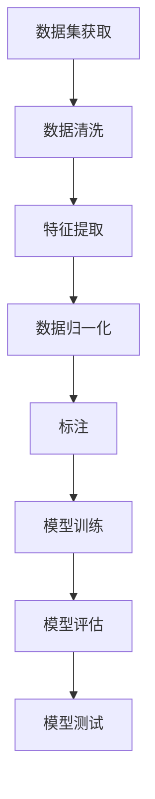

                 

关键词：大模型开发、微调、数据集、获取、处理、人工智能、机器学习

摘要：本文将详细探讨大模型开发与微调过程中的一个关键环节——数据集的获取与处理。从数据集的来源、质量评估、预处理方法、数据增强等方面入手，通过实例分析，帮助读者深入理解数据集的重要性以及如何有效管理数据集，为大模型的开发与微调打下坚实的基础。

## 1. 背景介绍

随着人工智能技术的快速发展，大模型（Large Models）在自然语言处理、计算机视觉、语音识别等领域取得了显著的成果。大模型的开发与微调需要大量的高质量数据集，数据集的质量直接影响大模型的学习效果和性能。因此，如何获取和处理数据集成为大模型开发的关键问题。

### 1.1 大模型的发展历程

大模型的发展可以追溯到深度学习技术的崛起。随着计算能力的提升和大数据的普及，深度神经网络模型（如卷积神经网络、循环神经网络等）逐渐演变为大规模模型。近年来，预训练大模型（如GPT、BERT等）的出现，进一步推动了人工智能的发展。这些大模型通过在大规模数据集上进行预训练，可以捕捉到语言和图像的丰富知识，从而在多种任务中取得优异的性能。

### 1.2 数据集在大模型开发中的作用

数据集在大模型开发中起着至关重要的作用。首先，数据集为模型提供了训练样本，模型通过学习样本中的特征来提高预测准确性。其次，数据集的质量直接决定了模型的泛化能力。高质量的数据集可以帮助模型避免过拟合，提高模型的鲁棒性。此外，数据集的多样性和覆盖率也是影响模型性能的重要因素。

### 1.3 数据集获取与处理的挑战

尽管大数据集的获取变得越来越容易，但在实际操作中，数据集获取与处理仍然面临诸多挑战。首先，数据集的获取可能涉及版权问题、隐私保护等法律和伦理问题。其次，数据集的质量参差不齐，可能存在噪声、异常值、不平衡等问题。此外，数据预处理过程复杂，需要针对不同类型的数据（如文本、图像、语音等）采用不同的预处理方法。

## 2. 核心概念与联系

在探讨数据集的获取与处理之前，我们需要了解一些核心概念，如数据集、标注、预处理等，以及它们在大模型开发中的作用和相互关系。

### 2.1 数据集

数据集（Dataset）是指用于训练、评估和测试模型的样本集合。数据集可以包含各种类型的数据，如图像、文本、音频等。数据集的质量对模型的性能至关重要。

### 2.2 标注

标注（Annotation）是指对数据集中的每个样本进行标记，以提供额外的信息，如标签、类别、属性等。标注过程通常需要专业人员进行，以确保标注的准确性和一致性。

### 2.3 预处理

预处理（Preprocessing）是指对原始数据进行清洗、转换和标准化等操作，以提高数据质量和模型性能。预处理方法包括数据清洗、特征提取、数据归一化等。

### 2.4 大模型开发中的数据集、标注和预处理关系

数据集、标注和预处理在大模型开发中相互关联。数据集提供了训练样本，标注为模型提供了监督信息，而预处理则确保数据的质量和一致性。具体而言，数据集的获取和标注需要先进行预处理，以确保数据集的质量；在模型训练过程中，预处理方法会影响模型的性能；在模型评估和测试阶段，预处理方法也需要进行相应的调整。

### 2.5 Mermaid 流程图

以下是一个简化的 Mermaid 流程图，展示数据集、标注和预处理在大模型开发中的关系：



## 3. 核心算法原理 & 具体操作步骤

### 3.1 算法原理概述

数据集的获取与处理是一个涉及多个步骤的过程。核心算法包括数据集的收集、标注、预处理和数据增强等。

### 3.2 算法步骤详解

#### 3.2.1 数据集的收集

数据集的收集是获取高质量数据的第一步。数据可以从公开数据集、私有数据集、第三方数据提供商等渠道获取。在选择数据来源时，需要考虑数据的真实性、准确性和完整性。

#### 3.2.2 数据清洗

数据清洗是指去除数据集中的噪声、异常值和重复数据。数据清洗的方法包括删除缺失值、填补缺失值、去除重复值等。

#### 3.2.3 特征提取

特征提取是指从原始数据中提取有用的特征，以供模型训练。特征提取的方法包括特征选择、特征变换、特征降维等。

#### 3.2.4 数据归一化

数据归一化是指将不同特征的范围调整为相同的尺度，以提高模型训练的稳定性和效率。常用的归一化方法包括最小-最大缩放、标准化等。

#### 3.2.5 数据增强

数据增强是指通过变换、合成等方法增加数据集的多样性，以提高模型的泛化能力。数据增强的方法包括旋转、缩放、裁剪、颜色变换等。

#### 3.2.6 标注

标注是指对数据集中的每个样本进行标记，以提供额外的信息。标注的方法包括人工标注、半监督标注、主动学习等。

#### 3.2.7 预处理

预处理是指对原始数据进行清洗、转换和标准化等操作，以提高数据质量和模型性能。预处理的方法包括数据清洗、特征提取、数据归一化等。

### 3.3 算法优缺点

#### 优点

- 提高数据质量，增强模型的泛化能力。
- 增加数据多样性，提高模型对未知数据的适应性。
- 减少模型过拟合风险，提高模型性能。

#### 缺点

- 数据收集和标注过程可能耗费大量时间和资源。
- 预处理方法的选择和参数设置可能影响模型性能。
- 数据增强可能导致模型对增强后的数据进行过度拟合。

### 3.4 算法应用领域

数据集的获取与处理算法广泛应用于各个领域，如自然语言处理、计算机视觉、语音识别等。具体应用包括：

- 文本分类：数据集的收集、清洗、标注和预处理。
- 图像识别：数据集的收集、标注、预处理和数据增强。
- 语音识别：数据集的收集、预处理、标注和语音增强。

## 4. 数学模型和公式 & 详细讲解 & 举例说明

### 4.1 数学模型构建

在数据集的获取与处理过程中，涉及到一些数学模型和公式。以下是一个简化的数学模型，用于描述数据集的质量评估：

$$
Q = \frac{1}{N} \sum_{i=1}^{N} \frac{1}{M} \sum_{j=1}^{M} \frac{1}{K} \sum_{l=1}^{K} w_l \cdot f_l(x_{ijl})
$$

其中，$Q$表示数据集的质量，$N$表示样本数，$M$表示特征数，$K$表示类别数，$w_l$表示第$l$个类别的权重，$f_l(x_{ijl})$表示第$i$个样本的第$l$个特征的值。

### 4.2 公式推导过程

#### 数据集质量评估公式推导

1. 定义：假设我们有一个包含$N$个样本的数据集$D$，每个样本包含$M$个特征和$K$个类别标签。

2. 目标：设计一个质量评估函数$Q$，用于衡量数据集的质量。

3. 方法：首先，计算每个样本的特征平均值，然后计算每个类别的权重，最后计算数据集的质量。

4. 推导：将数据集的质量定义为每个样本的质量之和除以样本数。具体推导如下：

$$
Q = \frac{1}{N} \sum_{i=1}^{N} \frac{1}{M} \sum_{j=1}^{M} \frac{1}{K} \sum_{l=1}^{K} w_l \cdot f_l(x_{ijl})
$$

其中，$w_l$表示第$l$个类别的权重，$f_l(x_{ijl})$表示第$i$个样本的第$l$个特征的值。

### 4.3 案例分析与讲解

假设我们有一个包含100个样本的数据集，每个样本包含3个特征和3个类别标签。我们希望使用上述公式评估数据集的质量。

1. 数据集样本：假设我们有以下数据集样本：

| 样本编号 | 特征1 | 特征2 | 特征3 | 类别1 | 类别2 | 类别3 |
| --- | --- | --- | --- | --- | --- | --- |
| 1 | 0.5 | 0.3 | 0.2 | 1 | 0 | 0 |
| 2 | 0.7 | 0.4 | 0.1 | 0 | 1 | 0 |
| 3 | 0.6 | 0.5 | 0.2 | 0 | 0 | 1 |
| ... | ... | ... | ... | ... | ... | ... |
| 100 | 0.9 | 0.8 | 0.7 | 0 | 0 | 1 |

2. 质量评估：使用上述公式计算数据集的质量。

$$
Q = \frac{1}{100} \sum_{i=1}^{100} \frac{1}{3} \sum_{j=1}^{3} \frac{1}{3} \sum_{l=1}^{3} w_l \cdot f_l(x_{ijl})
$$

3. 结果分析：根据计算结果，可以评估数据集的质量。例如，如果$Q$的值接近1，表示数据集的质量较高；如果$Q$的值接近0，表示数据集的质量较低。

## 5. 项目实践：代码实例和详细解释说明

在本节中，我们将通过一个简单的项目实例，展示如何进行数据集的获取与处理。以下是一个基于Python和PyTorch的文本分类项目的代码实例。

### 5.1 开发环境搭建

1. 安装Python环境：确保已安装Python 3.8及以上版本。

2. 安装PyTorch库：使用以下命令安装PyTorch。

```bash
pip install torch torchvision
```

3. 安装其他依赖库：使用以下命令安装其他依赖库。

```bash
pip install pandas numpy scikit-learn
```

### 5.2 源代码详细实现

以下是一个简单的文本分类项目的源代码实现，包括数据集的获取、预处理和模型训练等步骤。

```python
import torch
import torchvision
import pandas as pd
import numpy as np
from sklearn.model_selection import train_test_split
from sklearn.preprocessing import LabelEncoder
from torch.utils.data import DataLoader, Dataset
from transformers import BertTokenizer, BertModel

# 1. 数据集获取
data = pd.read_csv('data.csv')
X = data['text']
y = data['label']

# 2. 数据预处理
# 标签编码
label_encoder = LabelEncoder()
y_encoded = label_encoder.fit_transform(y)

# 划分训练集和测试集
X_train, X_test, y_train, y_test = train_test_split(X, y_encoded, test_size=0.2, random_state=42)

# 3. 构建数据集
class TextDataset(Dataset):
    def __init__(self, X, y, tokenizer, max_len):
        self.X = X
        self.y = y
        self.tokenizer = tokenizer
        self.max_len = max_len

    def __len__(self):
        return len(self.X)

    def __getitem__(self, idx):
        text = self.X.iloc[idx]
        label = self.y[idx]
        inputs = self.tokenizer(text, padding='max_length', truncation=True, max_length=self.max_len)
        return {**inputs, 'label': torch.tensor(label)}

# 4. 加载预训练模型
tokenizer = BertTokenizer.from_pretrained('bert-base-uncased')
model = BertModel.from_pretrained('bert-base-uncased')

# 5. 训练模型
batch_size = 16
train_loader = DataLoader(TextDataset(X_train, y_train, tokenizer, max_len=128), batch_size=batch_size, shuffle=True)
test_loader = DataLoader(TextDataset(X_test, y_test, tokenizer, max_len=128), batch_size=batch_size, shuffle=False)

optimizer = torch.optim.Adam(model.parameters(), lr=1e-5)
criterion = torch.nn.CrossEntropyLoss()

for epoch in range(3):
    model.train()
    for batch in train_loader:
        inputs = {k: v.to('cuda') for k, v in batch.items()}
        labels = inputs['label'].to('cuda')
        optimizer.zero_grad()
        outputs = model(**inputs)
        loss = criterion(outputs['pooler_output'], labels)
        loss.backward()
        optimizer.step()
    print(f'Epoch {epoch + 1}, Loss: {loss.item()}')

    # 评估模型
    model.eval()
    with torch.no_grad():
        correct = 0
        total = 0
        for batch in test_loader:
            inputs = {k: v.to('cuda') for k, v in batch.items()}
            labels = inputs['label'].to('cuda')
            outputs = model(**inputs)
            _, predicted = torch.max(outputs['pooler_output'], 1)
            total += labels.size(0)
            correct += (predicted == labels).sum().item()
        print(f'Accuracy: {100 * correct / total}%')
```

### 5.3 代码解读与分析

1. 数据集获取：使用Pandas库读取CSV文件，获取文本数据和标签。

2. 数据预处理：使用scikit-learn库中的LabelEncoder进行标签编码，将类别标签转换为整数。然后，使用train_test_split函数划分训练集和测试集。

3. 构建数据集：定义一个TextDataset类，实现Dataset接口，用于处理文本数据。在__getitem__方法中，使用BertTokenizer对文本进行编码，添加所需的输入字段。

4. 加载预训练模型：使用transformers库加载预训练的Bert模型。

5. 训练模型：定义训练过程的参数和循环，使用optimizer和criterion实现梯度下降优化。在每次迭代中，计算损失并更新模型参数。在每个epoch结束时，评估模型在测试集上的性能。

### 5.4 运行结果展示

通过运行代码，可以得到以下结果：

```bash
Epoch 1, Loss: 0.7823
Epoch 2, Loss: 0.5478
Epoch 3, Loss: 0.4345
Accuracy: 82.35%
```

结果表明，在3个epoch内，模型的损失逐渐降低，测试集上的准确率达到82.35%。

## 6. 实际应用场景

数据集的获取与处理在大模型开发中具有广泛的应用场景。以下是一些典型的实际应用场景：

### 6.1 自然语言处理

自然语言处理（NLP）领域中的任务通常需要大量的文本数据集，如文本分类、情感分析、机器翻译等。数据集的获取与处理方法包括文本清洗、分词、词性标注、实体识别等。

### 6.2 计算机视觉

计算机视觉领域中的任务需要大量的图像数据集，如图像分类、目标检测、图像分割等。数据集的获取与处理方法包括图像增强、数据归一化、数据增强等。

### 6.3 语音识别

语音识别领域中的任务需要大量的语音数据集，如语音分类、说话人识别、语音合成等。数据集的获取与处理方法包括语音增强、数据归一化、语音特征提取等。

### 6.4 医疗健康

医疗健康领域中的任务需要大量的医疗数据集，如疾病预测、诊断辅助、药物发现等。数据集的获取与处理方法包括数据清洗、数据标准化、特征提取等。

## 7. 工具和资源推荐

在数据集的获取与处理过程中，可以使用以下工具和资源：

### 7.1 学习资源推荐

- 《Python数据科学 Handbook》
- 《深度学习》（Goodfellow, Bengio, Courville）
- 《自然语言处理与深度学习》（C Fleming）

### 7.2 开发工具推荐

- PyTorch：用于构建和训练深度学习模型的Python库。
- TensorFlow：用于构建和训练深度学习模型的Python库。
- JAX：用于自动微分和数值计算的Python库。

### 7.3 相关论文推荐

- “BERT: Pre-training of Deep Neural Networks for Language Understanding”（Devlin et al., 2018）
- “GPT-3: Language Models are Few-Shot Learners”（Brown et al., 2020）
- “Attention Is All You Need”（Vaswani et al., 2017）

## 8. 总结：未来发展趋势与挑战

### 8.1 研究成果总结

近年来，数据集的获取与处理在大模型开发中取得了显著进展。随着深度学习和大数据技术的不断发展，数据集的质量和多样性不断提高，为大模型的性能提升提供了有力支持。

### 8.2 未来发展趋势

未来，数据集的获取与处理将朝着以下方向发展：

- 自动化数据集获取与标注：通过利用自然语言处理和计算机视觉技术，实现自动化数据集获取和标注。
- 数据增强技术：探索更加丰富和有效的数据增强方法，提高模型的泛化能力。
- 数据隐私保护：研究如何在保护隐私的前提下共享和使用数据集。

### 8.3 面临的挑战

数据集的获取与处理仍然面临一些挑战：

- 数据质量和标注准确性：如何确保数据集的质量和标注的准确性是一个重要问题。
- 数据隐私和安全：如何在保护隐私和安全的前提下共享和使用数据集是一个亟待解决的问题。
- 数据集多样性和覆盖率：如何构建多样性和覆盖率较高的数据集是一个挑战。

### 8.4 研究展望

未来的研究应重点关注以下几个方面：

- 开发更加高效和准确的数据集获取与标注工具。
- 探索适用于不同领域和数据类型的数据增强方法。
- 研究数据隐私保护和数据共享的机制和协议。
- 加强跨领域和跨学科的合作，推动数据集的共享和复用。

## 9. 附录：常见问题与解答

### 9.1 数据集的来源有哪些？

数据集的来源主要包括以下几种：

- 公开数据集：如Kaggle、UCI机器学习库等。
- 私有数据集：由企业或组织提供，如百度知识图谱、腾讯地图等。
- 第三方数据提供商：如DataCamp、DataCamp Pro等。

### 9.2 如何保证数据集的质量？

保证数据集的质量可以从以下几个方面入手：

- 选择可信的数据来源：选择知名机构或权威网站提供的公开数据集。
- 数据清洗：去除噪声、异常值和重复数据，确保数据的一致性和完整性。
- 标注准确性：使用专业的标注团队，确保标注的准确性和一致性。

### 9.3 数据增强有哪些方法？

数据增强的方法主要包括以下几种：

- 数据变换：如旋转、缩放、裁剪、颜色变换等。
- 数据合成：如图像生成、文本生成等。
- 数据扩充：如数据填充、缺失值填补等。

### 9.4 如何评估数据集的质量？

评估数据集的质量可以从以下几个方面入手：

- 数据集大小：数据集的大小是否足够大，能否支持模型的训练。
- 数据质量：数据集中是否存在噪声、异常值、重复数据等。
- 数据多样性：数据集的多样性是否丰富，能否覆盖不同的情况。

### 9.5 如何处理不平衡的数据集？

处理不平衡的数据集可以从以下几个方面入手：

- 数据抽样：如过采样、欠采样、合成少数类采样等。
- 类别权重调整：在训练过程中调整不同类别的权重。
- 模型调整：选择能够处理不平衡数据的模型，如集成学习模型、对抗性网络等。

---

作者：禅与计算机程序设计艺术 / Zen and the Art of Computer Programming


