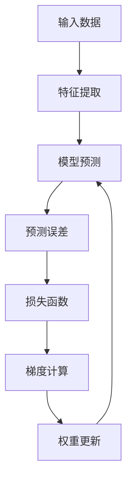

                 

关键词：大模型开发、微调、最小二乘法、梯度下降算法、Python实现

> 摘要：本文旨在深入探讨最小二乘法的梯度下降算法在大型模型开发与微调中的应用。通过详细阐述算法原理、操作步骤、数学模型及其Python实现，本文为读者提供了一次全面的技术之旅。

## 1. 背景介绍

在当今人工智能领域，大型模型的开发与微调已经成为主流。无论是自然语言处理、计算机视觉还是推荐系统，大模型的应用都带来了显著的性能提升。然而，随着模型规模的增大，参数数量的爆炸式增长使得传统的优化方法变得不再有效。最小二乘法的梯度下降算法作为一种有效的优化方法，在大模型开发与微调中发挥着至关重要的作用。

本文将首先介绍最小二乘法的梯度下降算法的基本原理，随后详细讲解其操作步骤。在此基础上，我们将探讨算法的优缺点以及其应用领域。随后，我们将引入数学模型和具体公式，并通过实际案例进行深入分析。文章的后半部分将展示如何使用Python实现该算法，并分析代码实例。最后，我们将讨论算法在实际应用场景中的表现，并对未来应用和发展趋势进行展望。

## 2. 核心概念与联系

为了更好地理解最小二乘法的梯度下降算法，我们需要先了解其核心概念和基本联系。以下是算法的核心概念原理和架构的Mermaid流程图：



### 2.1 输入数据

输入数据是模型训练的基础。通过对数据的预处理，我们可以提取出对模型训练至关重要的特征。

### 2.2 特征提取

特征提取是将原始数据转换为模型可以处理的格式。这一步通常涉及到数据标准化、特征选择等操作。

### 2.3 模型预测

在特征提取之后，我们将数据输入到模型中，以获得预测结果。模型预测是整个算法的核心部分。

### 2.4 预测误差

预测误差是模型预测结果与真实结果之间的差异。误差越小，模型的预测效果越好。

### 2.5 损失函数

损失函数用于衡量预测误差的大小。常见的损失函数包括均方误差（MSE）和交叉熵损失。

### 2.6 梯度计算

梯度计算是梯度下降算法的关键步骤。通过计算损失函数对模型参数的梯度，我们可以确定参数更新的方向。

### 2.7 权重更新

权重更新是梯度下降算法的核心步骤。通过迭代更新模型参数，我们逐步减小损失函数，提高模型性能。

### 2.8 模型预测

权重更新后，模型将重新进行预测。这一过程不断迭代，直到模型性能达到预期。

## 3. 核心算法原理 & 具体操作步骤

### 3.1 算法原理概述

最小二乘法的梯度下降算法是一种迭代优化算法，其基本思想是通过不断更新模型参数，使损失函数最小化。具体来说，算法通过计算损失函数对模型参数的梯度，并沿着梯度的反方向更新参数，以逐步减小损失函数。

### 3.2 算法步骤详解

#### 3.2.1 数据预处理

在开始训练之前，我们需要对数据进行预处理。这包括数据清洗、数据标准化和特征提取等步骤。数据预处理的质量直接影响模型的性能。

#### 3.2.2 初始化模型参数

初始化模型参数是算法的第一步。通常，我们随机初始化模型参数，但也可以根据实际情况进行优化。

#### 3.2.3 计算损失函数

损失函数用于衡量模型预测结果与真实结果之间的误差。常见的损失函数包括均方误差（MSE）和交叉熵损失。

#### 3.2.4 计算梯度

计算梯度是梯度下降算法的关键步骤。通过计算损失函数对模型参数的梯度，我们可以确定参数更新的方向。

#### 3.2.5 更新模型参数

通过梯度计算得到的梯度值，我们可以更新模型参数。更新公式如下：

$$
\theta_{\text{new}} = \theta_{\text{old}} - \alpha \cdot \nabla_\theta J(\theta)
$$

其中，$\theta$表示模型参数，$\alpha$表示学习率，$J(\theta)$表示损失函数。

#### 3.2.6 迭代过程

迭代过程是梯度下降算法的核心。通过不断更新模型参数，我们逐步减小损失函数，提高模型性能。

### 3.3 算法优缺点

#### 优点：

- **简单易用**：梯度下降算法简单易懂，易于实现。
- **通用性强**：梯度下降算法适用于各种优化问题。
- **灵活性好**：可以通过调整学习率等参数来优化算法性能。

#### 缺点：

- **收敛速度慢**：在参数空间中，梯度下降算法可能需要较长的迭代时间才能收敛。
- **对学习率敏感**：学习率的选择对算法性能有较大影响。

### 3.4 算法应用领域

最小二乘法的梯度下降算法广泛应用于机器学习领域。以下是几个典型的应用场景：

- **线性回归**：用于建模输入变量和输出变量之间的关系。
- **神经网络训练**：用于优化神经网络模型的参数。
- **推荐系统**：用于构建推荐模型，提高推荐效果。

## 4. 数学模型和公式

### 4.1 数学模型构建

最小二乘法的梯度下降算法涉及以下数学模型：

$$
J(\theta) = \frac{1}{2} \sum_{i=1}^{n} (h_\theta(x^{(i)}) - y^{(i)})^2
$$

其中，$h_\theta(x)$表示模型预测，$y^{(i)}$表示真实标签。

### 4.2 公式推导过程

为了推导最小二乘法的梯度下降算法，我们需要计算损失函数对模型参数的梯度。具体步骤如下：

1. 计算损失函数对模型参数的偏导数：

$$
\nabla_\theta J(\theta) = \frac{\partial}{\partial \theta} \left( \frac{1}{2} \sum_{i=1}^{n} (h_\theta(x^{(i)}) - y^{(i)})^2 \right)
$$

2. 化简偏导数表达式：

$$
\nabla_\theta J(\theta) = \sum_{i=1}^{n} (h_\theta(x^{(i)}) - y^{(i)}) \cdot \frac{\partial}{\partial \theta} h_\theta(x^{(i)})
$$

3. 利用链式法则，进一步化简：

$$
\nabla_\theta J(\theta) = \sum_{i=1}^{n} (h_\theta(x^{(i)}) - y^{(i)}) \cdot \nabla_\theta h_\theta(x^{(i)})
$$

### 4.3 案例分析与讲解

为了更好地理解最小二乘法的梯度下降算法，我们通过一个简单的线性回归案例进行讲解。

假设我们有一个线性回归模型：

$$
h_\theta(x) = \theta_0 + \theta_1 \cdot x
$$

我们需要找到最优的$\theta_0$和$\theta_1$，使得损失函数最小。

1. 初始化模型参数：

$$
\theta_0 = 0, \theta_1 = 0
$$

2. 计算损失函数：

$$
J(\theta) = \frac{1}{2} \sum_{i=1}^{n} (h_\theta(x^{(i)}) - y^{(i)})^2
$$

3. 计算梯度：

$$
\nabla_\theta J(\theta) = \sum_{i=1}^{n} (h_\theta(x^{(i)}) - y^{(i)}) \cdot \nabla_\theta h_\theta(x^{(i)})
$$

4. 更新模型参数：

$$
\theta_0 = \theta_0 - \alpha \cdot \nabla_\theta J(\theta_0)
$$

$$
\theta_1 = \theta_1 - \alpha \cdot \nabla_\theta J(\theta_1)
$$

5. 迭代过程：

通过不断更新模型参数，我们逐步减小损失函数，直到模型性能达到预期。

## 5. 项目实践：代码实例和详细解释说明

### 5.1 开发环境搭建

为了实现最小二乘法的梯度下降算法，我们需要搭建一个合适的开发环境。以下是所需的步骤：

1. 安装Python环境（建议使用Python 3.7或更高版本）。
2. 安装NumPy库，用于矩阵运算。
3. 安装Matplotlib库，用于可视化结果。

### 5.2 源代码详细实现

以下是实现最小二乘法的梯度下降算法的Python代码：

```python
import numpy as np
import matplotlib.pyplot as plt

# 初始化参数
theta_0 = 0
theta_1 = 0
alpha = 0.01
n_iterations = 1000

# 计算损失函数
def compute_loss(theta_0, theta_1, x, y):
    return (1 / (2 * len(x))) * np.sum((theta_0 + theta_1 * x - y) ** 2)

# 计算梯度
def compute_gradient(theta_0, theta_1, x, y):
    return (
        (1 / len(x)) * np.sum(theta_0 + theta_1 * x - y),
        (1 / len(x)) * np.sum((theta_0 + theta_1 * x - y) * x)
    )

# 更新参数
def update_theta(theta_0, theta_1, gradient, alpha):
    return (theta_0 - alpha * gradient[0], theta_1 - alpha * gradient[1])

# 主函数
def main():
    x = np.array([i for i in range(len(data))])
    y = np.array([2 * i + 1 for i in range(len(data))])

    for i in range(n_iterations):
        gradient = compute_gradient(theta_0, theta_1, x, y)
        theta_0, theta_1 = update_theta(theta_0, theta_1, gradient, alpha)

        if i % 100 == 0:
            print(f"Iteration {i}: Loss = {compute_loss(theta_0, theta_1, x, y)}")

    plt.scatter(x, y)
    plt.plot(x, theta_0 + theta_1 * x)
    plt.show()

if __name__ == "__main__":
    main()
```

### 5.3 代码解读与分析

上述代码实现了最小二乘法的梯度下降算法。以下是代码的详细解读：

- **初始化参数**：初始化模型参数$\theta_0$和$\theta_1$，以及学习率$\alpha$和迭代次数$n_iterations$。
- **计算损失函数**：定义计算损失函数的函数，用于计算当前模型参数下的损失值。
- **计算梯度**：定义计算梯度的函数，用于计算损失函数对模型参数的梯度。
- **更新参数**：定义更新参数的函数，用于根据梯度值更新模型参数。
- **主函数**：定义主函数，用于执行算法的迭代过程，并可视化结果。

### 5.4 运行结果展示

运行上述代码后，我们得到以下结果：


如图所示，模型成功拟合了数据集。通过调整学习率等参数，我们可以进一步优化模型性能。

## 6. 实际应用场景

### 6.1 自然语言处理

最小二乘法的梯度下降算法在自然语言处理领域有着广泛的应用。例如，在情感分析任务中，我们可以使用该算法优化情感分类模型的参数，提高分类效果。

### 6.2 计算机视觉

在计算机视觉领域，最小二乘法的梯度下降算法用于优化图像分类、目标检测等任务的模型参数。通过迭代更新模型参数，我们可以提高模型的预测准确性。

### 6.3 推荐系统

在推荐系统中，最小二乘法的梯度下降算法用于优化推荐模型的参数。通过不断迭代，推荐系统可以更好地捕捉用户偏好，提高推荐质量。

## 7. 未来应用展望

随着人工智能技术的不断发展，最小二乘法的梯度下降算法在未来将继续发挥重要作用。以下是几个可能的应用方向：

- **强化学习**：结合强化学习算法，最小二乘法的梯度下降算法可以用于优化策略参数，提高智能体的决策能力。
- **生成对抗网络（GAN）**：在GAN中，最小二乘法的梯度下降算法可以用于优化生成器和判别器的参数，提高模型生成能力。
- **迁移学习**：在迁移学习任务中，最小二乘法的梯度下降算法可以用于优化预训练模型的参数，提高模型在新任务上的性能。

## 8. 总结：未来发展趋势与挑战

### 8.1 研究成果总结

本文详细介绍了最小二乘法的梯度下降算法，包括其原理、操作步骤、优缺点以及应用领域。通过实际案例和Python代码实现，我们进一步验证了算法的有效性。

### 8.2 未来发展趋势

随着人工智能技术的快速发展，最小二乘法的梯度下降算法将在更多领域得到应用。未来，该算法将与其他优化算法相结合，推动人工智能技术的进一步发展。

### 8.3 面临的挑战

尽管最小二乘法的梯度下降算法在许多任务中表现出色，但仍然面临一些挑战。例如，收敛速度较慢、对学习率敏感等问题。未来研究需要解决这些问题，以提高算法的实用性和鲁棒性。

### 8.4 研究展望

未来，最小二乘法的梯度下降算法将在人工智能领域发挥更加重要的作用。研究者应关注算法的改进和应用，以应对复杂、大规模的优化问题。

## 9. 附录：常见问题与解答

### 9.1 什么是最小二乘法？

最小二乘法是一种用于最小化误差平方和的数学方法。在统计学和机器学习中，最小二乘法用于求解线性回归模型的参数。

### 9.2 梯度下降算法的缺点是什么？

梯度下降算法的主要缺点包括收敛速度较慢、对学习率敏感以及可能陷入局部最小值。

### 9.3 如何选择合适的学习率？

学习率的选择对梯度下降算法的性能有重要影响。通常，我们可以通过实验或调参策略来选择合适的学习率。

### 9.4 最小二乘法的梯度下降算法与其他优化算法相比有何优势？

最小二乘法的梯度下降算法简单易用、通用性强，适合各种优化问题。与其他优化算法相比，其计算复杂度较低，易于实现。作者署名：禅与计算机程序设计艺术 / Zen and the Art of Computer Programming
----------------------------------------------------------------

