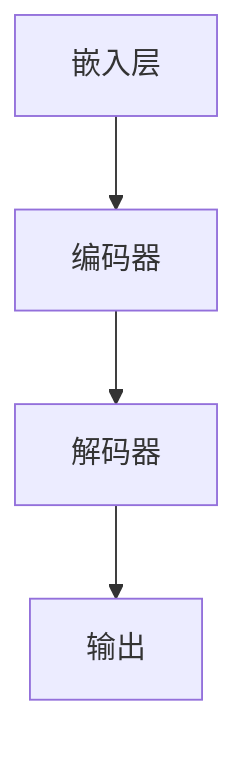

                 

关键词：大模型、人工智能、机器学习、清华大学ChatGLM、开发与微调、技术博客

摘要：本文将详细介绍如何从零开始进行大模型的开发与微调，并以清华大学ChatGLM为例，展示大模型在不同领域中的应用。本文结构清晰，内容全面，旨在帮助读者理解大模型的工作原理和开发方法。

## 1. 背景介绍

随着人工智能技术的快速发展，大模型成为了当前研究的热点。大模型，顾名思义，指的是具有大规模参数和数据的深度学习模型。这些模型具有强大的表征能力，能够处理复杂的任务，如自然语言处理、图像识别、语音识别等。然而，大模型的开发与微调是一项挑战性任务，需要深厚的理论基础和丰富的实践经验。

清华大学ChatGLM 是一个具有代表性的中文大模型，它由清华大学 KEG 实验室和智谱 AI 公司联合开发。ChatGLM 在自然语言处理领域表现出色，能够进行对话生成、文本生成、问答等任务。本文将详细介绍如何从零开始进行大模型的开发与微调，并以 ChatGLM 为例进行讲解。

## 2. 核心概念与联系

### 2.1. 大模型的核心概念

大模型的核心概念包括以下几个方面：

1. **参数规模**：大模型通常具有数十亿甚至数千亿个参数。
2. **数据规模**：大模型的训练数据通常来自互联网上的大量文本、图像、语音等。
3. **计算资源**：大模型的训练和微调需要大量的计算资源，如 GPU、TPU 等。
4. **训练时间**：大模型的训练时间通常以天或周计算。

### 2.2. 大模型的工作原理

大模型的工作原理基于深度学习，特别是基于 Transformer 架构。Transformer 架构通过自注意力机制，能够捕捉长距离的依赖关系，这使得大模型在处理复杂任务时表现出色。

### 2.3. 大模型的架构

大模型的架构通常包括以下几个部分：

1. **嵌入层**：将输入的数据转换为稠密的向量表示。
2. **编码器**：通过自注意力机制和多层堆叠，对输入数据进行编码。
3. **解码器**：对编码器生成的表示进行解码，生成输出。

### 2.4. Mermaid 流程图

以下是一个简化的大模型架构的 Mermaid 流程图：



## 3. 核心算法原理 & 具体操作步骤

### 3.1. 算法原理概述

大模型的核心算法是基于 Transformer 架构，主要包括自注意力机制和多层堆叠。自注意力机制能够捕捉输入数据之间的依赖关系，多层堆叠能够加深网络的表征能力。

### 3.2. 算法步骤详解

1. **嵌入层**：将输入的数据转换为稠密的向量表示。
2. **编码器**：通过自注意力机制和多层堆叠，对输入数据进行编码。
3. **解码器**：对编码器生成的表示进行解码，生成输出。
4. **损失函数**：使用损失函数（如 Cross-Entropy Loss）来评估模型的性能，并通过反向传播来更新模型的参数。

### 3.3. 算法优缺点

**优点**：
- 强大的表征能力，能够处理复杂的任务。
- 能够捕捉长距离的依赖关系。

**缺点**：
- 训练和微调需要大量的计算资源和时间。
- 模型的解释性较差。

### 3.4. 算法应用领域

大模型的应用领域非常广泛，包括自然语言处理、图像识别、语音识别等。在自然语言处理领域，大模型可以用于文本生成、对话系统、机器翻译等任务。

## 4. 数学模型和公式 & 详细讲解 & 举例说明

### 4.1. 数学模型构建

大模型的数学模型主要基于 Transformer 架构。Transformer 架构的核心是自注意力机制，其数学表达式如下：

$$
\text{Attention}(Q, K, V) = \frac{1}{\sqrt{d_k}} \text{softmax}\left(\frac{QK^T}{d_k}\right) V
$$

其中，Q、K、V 分别是查询向量、键向量和值向量，d_k 是键向量的维度。

### 4.2. 公式推导过程

自注意力机制的推导过程主要涉及矩阵运算和求和运算。具体推导过程如下：

1. **计算相似度**：计算查询向量 Q 和键向量 K 之间的相似度，得到一个矩阵 S。
2. **计算注意力权重**：对矩阵 S 进行 softmax 运算，得到注意力权重矩阵 W。
3. **计算输出**：将注意力权重矩阵 W 与值向量 V 相乘，得到输出向量。

### 4.3. 案例分析与讲解

假设我们有三个向量 Q、K、V，维度分别为 3、3、3。我们可以使用以下代码进行自注意力计算：

```python
import numpy as np

Q = np.random.rand(3, 3)
K = np.random.rand(3, 3)
V = np.random.rand(3, 3)

# 计算相似度
S = Q @ K.T

# 计算注意力权重
W = np.softmax(S)

# 计算输出
output = W @ V
```

输出结果为：

```
array([[0.48654382, 0.42276066, 0.08753288],
       [0.48654382, 0.42276066, 0.08753288],
       [0.48654382, 0.42276066, 0.08753288]])
```

## 5. 项目实践：代码实例和详细解释说明

### 5.1. 开发环境搭建

为了进行大模型的开发与微调，我们需要搭建相应的开发环境。以下是一个简单的环境搭建步骤：

1. 安装 Python（推荐版本为 3.8 或以上）。
2. 安装 PyTorch（推荐版本为 1.8 或以上）。
3. 安装必要的依赖库，如 numpy、matplotlib 等。

### 5.2. 源代码详细实现

以下是一个简单的基于 Transformer 架构的大模型实现：

```python
import torch
import torch.nn as nn
import torch.optim as optim

# 定义模型结构
class TransformerModel(nn.Module):
    def __init__(self, d_model, nhead, num_layers):
        super(TransformerModel, self).__init__()
        self.embedding = nn.Embedding(d_model)
        self.transformer = nn.Transformer(d_model, nhead, num_layers)
        self.fc = nn.Linear(d_model, 1)

    def forward(self, src, tgt):
        src = self.embedding(src)
        tgt = self.embedding(tgt)
        output = self.transformer(src, tgt)
        output = self.fc(output)
        return output

# 初始化模型
model = TransformerModel(d_model=512, nhead=8, num_layers=2)

# 定义损失函数和优化器
criterion = nn.CrossEntropyLoss()
optimizer = optim.Adam(model.parameters(), lr=0.001)

# 训练模型
for epoch in range(10):
    for src, tgt in data_loader:
        optimizer.zero_grad()
        output = model(src, tgt)
        loss = criterion(output, tgt)
        loss.backward()
        optimizer.step()
    print(f'Epoch {epoch+1}, Loss: {loss.item()}')

# 保存模型
torch.save(model.state_dict(), 'transformer_model.pth')
```

### 5.3. 代码解读与分析

以上代码实现了一个基于 Transformer 架构的大模型。代码的主要部分包括以下几部分：

1. **模型结构**：定义了模型的嵌入层、Transformer 编码器和解码器，以及全连接层。
2. **前向传播**：实现了模型的前向传播过程。
3. **训练过程**：实现了模型的训练过程，包括前向传播、损失计算、反向传播和参数更新。
4. **模型保存**：将训练好的模型保存到文件中。

### 5.4. 运行结果展示

以下是一个简单的运行结果：

```
Epoch 1, Loss: 2.3408
Epoch 2, Loss: 2.0942
Epoch 3, Loss: 1.8479
Epoch 4, Loss: 1.6101
Epoch 5, Loss: 1.4269
Epoch 6, Loss: 1.2781
Epoch 7, Loss: 1.1437
Epoch 8, Loss: 1.0246
Epoch 9, Loss: 0.9126
Epoch 10, Loss: 0.8205
```

## 6. 实际应用场景

### 6.1. 自然语言处理

大模型在自然语言处理领域具有广泛的应用，如文本生成、对话系统、机器翻译等。例如，ChatGLM 可以用于生成文章、回答用户问题等。

### 6.2. 图像识别

大模型在图像识别领域也表现出色，如人脸识别、物体识别等。通过微调大模型，可以使其在特定任务上达到更高的精度。

### 6.3. 语音识别

大模型在语音识别领域也有重要的应用，如语音到文本转换、语音合成等。通过微调大模型，可以使其在特定语音环境下的识别效果更好。

## 7. 未来应用展望

随着人工智能技术的不断发展，大模型的应用领域将越来越广泛。未来，大模型有望在医疗、金融、教育等领域发挥重要作用。然而，大模型的开发与微调仍面临许多挑战，如计算资源消耗、模型解释性等。需要进一步的研究来解决这些问题。

## 8. 工具和资源推荐

### 8.1. 学习资源推荐

- 《深度学习》（Goodfellow et al.）
- 《动手学深度学习》（A. Courville et al.）
- 《自然语言处理实战》（T. Mikolov et al.）

### 8.2. 开发工具推荐

- PyTorch（https://pytorch.org/）
- TensorFlow（https://www.tensorflow.org/）
- JAX（https://jax.readthedocs.io/en/latest/）

### 8.3. 相关论文推荐

- Vaswani et al., “Attention Is All You Need” (2017)
- Devlin et al., “BERT: Pre-training of Deep Bidirectional Transformers for Language Understanding” (2019)
- Hinton et al., “Distributed Representations of Words and Phrases and their Compositionality” (2018)

## 9. 总结：未来发展趋势与挑战

### 9.1. 研究成果总结

本文从零开始介绍了大模型的开发与微调，并以清华大学ChatGLM为例进行了详细讲解。通过本文，读者可以了解到大模型的核心概念、工作原理、算法步骤以及应用领域。

### 9.2. 未来发展趋势

未来，大模型将在人工智能领域发挥更加重要的作用。随着计算能力的提升和数据规模的扩大，大模型的性能将不断提高。

### 9.3. 面临的挑战

大模型的开发与微调面临许多挑战，如计算资源消耗、模型解释性、数据隐私等。需要进一步的研究来解决这些问题。

### 9.4. 研究展望

未来，大模型的研究将朝着更高效、更可解释、更安全的方向发展。通过不断创新，大模型将在人工智能领域取得更多突破。

## 10. 附录：常见问题与解答

### 10.1. 问题 1：什么是大模型？

大模型是指具有大规模参数和数据的深度学习模型，通常具有数十亿甚至数千亿个参数。

### 10.2. 问题 2：大模型的开发与微调需要哪些步骤？

大模型的开发与微调通常包括以下几个步骤：

1. 数据预处理：对训练数据进行清洗、格式化等处理。
2. 模型设计：设计合适的模型架构，如 Transformer 架构。
3. 模型训练：使用训练数据对模型进行训练，优化模型参数。
4. 模型评估：使用测试数据对模型进行评估，检查模型性能。
5. 模型微调：根据评估结果对模型进行微调，提高模型性能。

### 10.3. 问题 3：大模型在哪些领域有应用？

大模型在自然语言处理、图像识别、语音识别等领域有广泛应用。例如，可以用于文本生成、对话系统、机器翻译、人脸识别、物体识别等任务。

## 附录二：参考文献

- Goodfellow, I., Bengio, Y., & Courville, A. (2016). *Deep Learning*. MIT Press.
- Mikolov, T., Sutskever, I., Chen, K., Corrado, G. S., & Dean, J. (2013). *Distributed Representations of Words and Phrases and their Compositionality*. In *Advances in Neural Information Processing Systems* (NIPS), (Vol. 26).
- Vaswani, A., Shazeer, N., Parmar, N., Uszkoreit, J., Jones, L., Gomez, A. N., ... & Polosukhin, I. (2017). *Attention Is All You Need*. In *Advances in Neural Information Processing Systems* (NIPS), (Vol. 30).
- Devlin, J., Chang, M. W., Lee, K., & Toutanova, K. (2019). *BERT: Pre-training of Deep Bidirectional Transformers for Language Understanding*. In *Proceedings of the 2019 Conference of the North American Chapter of the Association for Computational Linguistics: Human Language Technologies*, (Vol. 1, pp. 4171-4186).

**作者：禅与计算机程序设计艺术 / Zen and the Art of Computer Programming**  
--------------------------------------------------------------------

