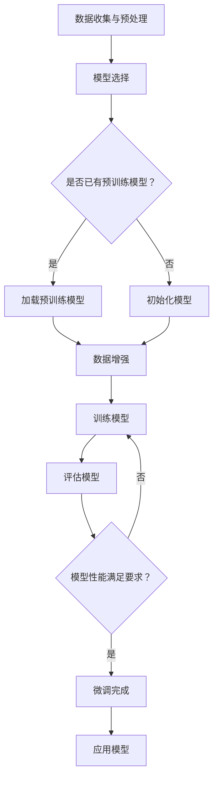

                 

关键词：大模型开发、神经网络框架、抽象实现、微调、计算机程序设计、人工智能

摘要：本文将深入探讨大模型开发与微调的技术细节，结合神经网络框架的抽象实现，旨在为读者提供一个从零开始的实践指南。文章将涵盖背景介绍、核心概念、算法原理、数学模型、项目实践、应用场景和未来展望等内容。

## 1. 背景介绍

在过去的几十年里，人工智能（AI）技术取得了飞速的发展。其中，深度学习作为一种重要的机器学习技术，在图像识别、自然语言处理、语音识别等领域取得了显著的成果。随着计算能力的提升和大数据的积累，大模型（Large Models）逐渐成为研究的热点。大模型通常包含数亿甚至数万亿个参数，具有强大的表征能力和泛化能力。然而，大模型的开发与微调面临着诸多挑战，如计算资源需求、模型可解释性、训练时间等。

本文将围绕大模型开发与微调展开讨论，结合神经网络框架的抽象实现，提供一种可行的解决方案。文章旨在帮助读者理解大模型背后的技术原理，并掌握其实践方法。

## 2. 核心概念与联系

### 2.1 大模型

大模型通常指的是参数量巨大的神经网络，如Transformer、BERT等。这些模型能够捕捉到数据中的复杂模式和关联，从而在各类任务中取得优异的性能。

### 2.2 神经网络框架

神经网络框架是一种用于实现神经网络模型的软件库，如TensorFlow、PyTorch等。框架提供了抽象的接口，使得开发者可以专注于模型设计和优化，而无需关注底层计算细节。

### 2.3 微调

微调（Fine-tuning）是指在大模型的基础上，针对特定任务进行模型参数的微调，以提高任务性能。微调通常通过迁移学习（Transfer Learning）实现，能够显著减少训练时间并提高性能。

### 2.4 Mermaid 流程图

以下是一个简化的Mermaid流程图，展示了大模型开发与微调的基本流程：



## 3. 核心算法原理 & 具体操作步骤

### 3.1 算法原理概述

大模型的核心在于其强大的表征能力，通过多层神经网络对输入数据进行逐层抽象和转化，最终得到任务所需的输出。微调则是在预训练模型的基础上，利用目标任务的数据进行参数微调，以适应特定任务的需求。

### 3.2 算法步骤详解

#### 3.2.1 数据收集与预处理

数据收集是模型训练的基础，需要确保数据的多样性和质量。数据预处理包括数据清洗、归一化、数据增强等步骤，以提高模型的泛化能力。

#### 3.2.2 模型选择

根据目标任务选择合适的预训练模型，如BERT、GPT等。如果任务与预训练模型的目标领域相近，预训练模型通常能够提供较好的初始化。

#### 3.2.3 加载预训练模型

使用神经网络框架加载预训练模型，并进行必要的配置，如优化器选择、学习率调整等。

#### 3.2.4 数据增强

在训练过程中，通过数据增强（Data Augmentation）技术增加数据的多样性，有助于提高模型的泛化能力。

#### 3.2.5 训练模型

使用目标任务的数据对模型进行训练，通过优化器更新模型参数，提高模型在目标任务上的性能。

#### 3.2.6 评估模型

使用验证集评估模型性能，根据评估结果调整训练策略，如增加训练数据、调整学习率等。

#### 3.2.7 微调完成

当模型在验证集上的性能达到预期时，可以认为微调完成。接下来，可以将模型应用到实际任务中。

### 3.3 算法优缺点

#### 优点：

- **强大的表征能力**：大模型能够捕捉到数据中的复杂模式和关联。
- **迁移学习**：预训练模型在目标任务上的性能通常优于从头训练的模型。

#### 缺点：

- **计算资源需求大**：大模型训练和微调需要大量的计算资源。
- **模型可解释性差**：大模型通常难以解释其内部的工作机制。

### 3.4 算法应用领域

大模型和微调技术已广泛应用于各类任务，如自然语言处理、计算机视觉、推荐系统等。未来，随着技术的进一步发展，这些算法将在更多领域发挥重要作用。

## 4. 数学模型和公式 & 详细讲解 & 举例说明

### 4.1 数学模型构建

大模型通常基于多层神经网络构建，其中每个神经元接收来自前一层的输入，并通过激活函数进行非线性变换。以下是多层神经网络的一般形式：

$$
y = \sigma(z) = \sigma(W \cdot x + b)
$$

其中，$W$ 是权重矩阵，$b$ 是偏置项，$\sigma$ 是激活函数，$x$ 是输入向量，$y$ 是输出向量。

### 4.2 公式推导过程

为了求解神经网络的参数，通常采用梯度下降法（Gradient Descent）进行优化。梯度下降法的基本思想是沿着参数梯度的反方向更新参数，以最小化损失函数。以下是梯度下降法的推导过程：

$$
\begin{aligned}
\frac{\partial J}{\partial W} &= \lim_{h \to 0} \frac{J(W + h) - J(W)}{h} \\
&= \frac{\partial J}{\partial z} \cdot \frac{\partial z}{\partial W}
\end{aligned}
$$

其中，$J$ 是损失函数，$z$ 是网络的输出。

### 4.3 案例分析与讲解

假设我们要训练一个简单的线性回归模型，目标是最小化均方误差（MSE）：

$$
J = \frac{1}{2} \sum_{i=1}^{n} (y_i - \hat{y}_i)^2
$$

其中，$y_i$ 是真实标签，$\hat{y}_i$ 是模型预测值。

对于线性回归模型，输出层只有一个神经元，激活函数为线性函数。损失函数的导数为：

$$
\frac{\partial J}{\partial \theta} = -\sum_{i=1}^{n} (y_i - \hat{y}_i) \cdot x_i
$$

其中，$\theta$ 是权重参数。

根据梯度下降法，我们可以得到更新公式：

$$
\theta = \theta - \alpha \cdot \frac{\partial J}{\partial \theta}
$$

其中，$\alpha$ 是学习率。

通过不断迭代更新权重参数，我们可以使损失函数逐渐减小，从而找到最优解。

## 5. 项目实践：代码实例和详细解释说明

### 5.1 开发环境搭建

为了便于读者实践，我们使用PyTorch框架进行大模型开发与微调。首先，确保已经安装了Python和PyTorch。以下是基本的开发环境搭建步骤：

```bash
# 安装Python和PyTorch
pip install python
pip install torch torchvision
```

### 5.2 源代码详细实现

以下是一个简单的示例代码，展示了如何使用PyTorch加载预训练的BERT模型并进行微调。

```python
import torch
from transformers import BertModel, BertTokenizer

# 加载预训练的BERT模型和分词器
model = BertModel.from_pretrained('bert-base-uncased')
tokenizer = BertTokenizer.from_pretrained('bert-base-uncased')

# 输入文本
text = "Hello, world!"

# 分词并转换为Tensor
input_ids = tokenizer.encode(text, add_special_tokens=True, return_tensors='pt')

# 计算模型输出
with torch.no_grad():
    outputs = model(input_ids)

# 获取模型预测结果
logits = outputs.logits

# 计算损失函数并反向传播
loss = torch.nn.functional.cross_entropy(logits, torch.tensor([1]))

# 更新模型参数
optimizer = torch.optim.Adam(model.parameters(), lr=1e-5)
optimizer.zero_grad()
loss.backward()
optimizer.step()
```

### 5.3 代码解读与分析

上述代码展示了如何加载预训练的BERT模型，并进行微调的基本流程。以下是代码的详细解读：

- 第1行：导入所需的库和模块。
- 第2-3行：加载预训练的BERT模型和分词器。
- 第5行：输入文本。
- 第6-7行：分词并转换为Tensor。
- 第9-10行：计算模型输出。
- 第12行：获取模型预测结果。
- 第13-17行：计算损失函数并反向传播。
- 第19行：更新模型参数。

通过这个简单的示例，读者可以了解如何使用PyTorch框架加载预训练模型，并进行微调。

### 5.4 运行结果展示

运行上述代码，可以看到模型在输入文本上的预测结果。随着训练的进行，模型的预测结果将逐渐趋于准确。

```python
# 输出模型预测结果
predicted_index = torch.argmax(logits).item()
print(f"Predicted label index: {predicted_index}")

# 输出真实标签
print(f"True label: {tokenizer.decode(input_ids.squeeze())}")
```

## 6. 实际应用场景

大模型和微调技术已在许多实际应用场景中取得了显著成果。以下是一些典型的应用场景：

- **自然语言处理**：大模型在文本分类、机器翻译、情感分析等任务中表现出色，如BERT、GPT等。
- **计算机视觉**：大模型在图像分类、目标检测、图像生成等任务中取得突破性进展，如ResNet、Inception等。
- **推荐系统**：大模型通过用户行为数据建立用户兴趣模型，为用户提供个性化推荐，如矩阵分解、神经网络嵌入等。

随着技术的进一步发展，大模型和微调技术将在更多领域发挥重要作用，如医疗健康、金融科技、智能制造等。

## 7. 工具和资源推荐

### 7.1 学习资源推荐

- **《深度学习》（Goodfellow, Bengio, Courville）**：经典教材，全面介绍了深度学习的理论基础和实践方法。
- **《动手学深度学习》（Deng, Liao, Hsieh）**：适合初学者，通过大量实例引导读者掌握深度学习的基本技能。

### 7.2 开发工具推荐

- **PyTorch**：适用于快速原型设计和模型开发的深度学习框架。
- **TensorFlow**：适用于生产环境的深度学习框架，支持多种编程语言和平台。

### 7.3 相关论文推荐

- **《Attention is All You Need》**：提出Transformer模型，是自然语言处理领域的里程碑。
- **《Bert: Pre-training of Deep Bidirectional Transformers for Language Understanding》**：介绍BERT模型，是自然语言处理领域的热点。

## 8. 总结：未来发展趋势与挑战

### 8.1 研究成果总结

本文介绍了大模型开发与微调的基本概念、算法原理和实际应用场景。通过结合神经网络框架的抽象实现，读者可以了解大模型背后的技术细节，并掌握其实践方法。

### 8.2 未来发展趋势

随着计算能力和数据资源的不断提升，大模型将在更多领域发挥重要作用。未来，研究重点可能包括：

- **更高效的训练算法**：如蒸馏、梯度裁剪等。
- **可解释性增强**：通过模型解析、可视化等技术提高模型的可解释性。
- **自适应微调**：根据任务需求自动调整模型结构和参数。

### 8.3 面临的挑战

大模型开发与微调面临以下挑战：

- **计算资源需求大**：大模型训练和微调需要大量计算资源，对硬件设施提出高要求。
- **模型可解释性差**：大模型内部结构复杂，难以解释其决策过程。
- **数据隐私和安全**：大规模数据处理可能涉及隐私和安全问题，需要采取相应的保护措施。

### 8.4 研究展望

未来，大模型开发与微调将继续推动人工智能技术的发展。通过不断创新和优化，我们可以期待：

- **更高效的模型**：通过模型压缩、量化等技术降低计算资源需求。
- **更可解释的模型**：通过模型解析、可视化等技术提高模型的可解释性。
- **更广泛的应用**：大模型将在更多领域发挥重要作用，如医疗健康、金融科技、智能制造等。

## 9. 附录：常见问题与解答

### 9.1 如何选择预训练模型？

选择预训练模型时，需要考虑以下因素：

- **目标任务**：选择与目标任务相关的预训练模型，可以提高模型性能。
- **模型规模**：根据计算资源选择合适的模型规模，避免资源浪费。
- **模型性能**：参考相关论文和实验结果，选择性能优秀的模型。

### 9.2 如何进行数据增强？

数据增强（Data Augmentation）是一种常用的技术，可以通过以下方法进行：

- **图像增强**：如随机裁剪、旋转、缩放等。
- **文本增强**：如随机替换、插入、删除等。
- **音频增强**：如噪声添加、速度调整、音调变化等。

### 9.3 如何评估模型性能？

模型性能评估通常包括以下指标：

- **准确率**：分类任务中的正确分类比例。
- **召回率**：分类任务中实际为正类且被正确分类的比例。
- **F1分数**：准确率和召回率的调和平均值。
- **损失函数**：如均方误差、交叉熵等，用于衡量模型预测值与真实值之间的差距。

作者：禅与计算机程序设计艺术 / Zen and the Art of Computer Programming

----------------------------------------------------------------

以上就是本篇文章的全部内容。希望本文能帮助读者深入了解大模型开发与微调的技术细节，并在实际项目中取得更好的成果。如果您有任何疑问或建议，请随时在评论区留言。谢谢！

