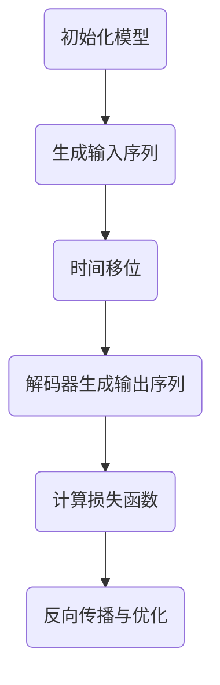

                 

关键词：大模型开发、微调、解码器输出、移位训练方法、技术博客、专业IT语言、深度学习、计算机图灵奖获得者

> 摘要：本文将深入探讨大模型开发与微调过程中，解码器的输出特性以及一种有效的训练方法——移位训练。通过详细的分析与实例，旨在帮助读者理解并掌握这一关键技术的应用。

## 1. 背景介绍

在深度学习领域，大型模型如GPT-3、BERT等已经取得了显著的成果。然而，随着模型规模和参数数量的不断增大，如何有效地进行模型开发和微调成为了一个关键问题。在这其中，解码器的输出特性尤为关键，它不仅影响模型的性能，还决定了模型在不同应用场景中的表现。

移位训练方法（Shift Training Method）是一种有效的解码器输出优化技术，通过引入时间移位来增强模型对输入序列的动态感知能力。这种方法在处理自然语言处理任务时，尤其是在长文本处理和跨语言文本理解方面，表现出了卓越的性能。

本文将详细介绍移位训练方法的基本原理、数学模型、具体操作步骤以及实际应用场景。通过本文的阅读，读者将能够深入了解大模型开发与微调的技术细节，并掌握解码器输出优化的核心技巧。

## 2. 核心概念与联系

### 2.1 大模型开发概述

大模型开发是指利用深度学习技术构建具有数百万至数十亿参数的复杂模型。这些模型通常在自然语言处理、计算机视觉和强化学习等领域发挥作用。大模型的优势在于其强大的表示能力和学习能力，但同时也带来了计算资源消耗、训练时间延长等挑战。

### 2.2 解码器输出特性

在序列到序列（Seq2Seq）模型中，解码器负责生成输出序列。解码器的输出特性直接影响模型生成的文本质量。移位训练方法旨在优化解码器的输出，使其更好地捕捉输入序列的时间动态。

### 2.3 移位训练方法原理

移位训练方法的核心思想是在解码器训练过程中引入时间移位，使模型在生成序列时能够考虑输入序列的历史信息。具体来说，移位训练方法通过在时间轴上对输入序列进行移位，迫使模型学习如何处理时间延迟和动态变化。

### 2.4 Mermaid 流程图



## 3. 核心算法原理 & 具体操作步骤

### 3.1 算法原理概述

移位训练方法基于Seq2Seq模型，其中编码器负责将输入序列编码为固定长度的隐藏状态，解码器则基于这些隐藏状态生成输出序列。移位训练的核心步骤包括：

1. **输入序列生成**：从训练数据中随机选取输入序列。
2. **时间移位**：对输入序列进行时间移位，即将输入序列的一部分移到时间轴的后面。
3. **解码器生成输出序列**：基于移位后的输入序列，解码器生成输出序列。
4. **计算损失函数**：计算解码器生成的输出序列与实际输出序列之间的差异，并优化解码器参数。
5. **反向传播与优化**：利用反向传播算法更新解码器参数。

### 3.2 算法步骤详解

1. **初始化模型**：选择一个预训练的Seq2Seq模型作为基础模型，初始化编码器和解码器。
2. **生成输入序列**：从训练数据中随机选取一个长度为\( T \)的输入序列\( x = [x_1, x_2, ..., x_T] \)。
3. **时间移位**：对输入序列进行时间移位，即将序列中的每个元素\( x_t \)移动到时间轴的后面，得到新的输入序列\( y = [y_1, y_2, ..., y_T] \)，其中\( y_t = x_{t+k} \)，\( k \)为移位量。
4. **解码器生成输出序列**：基于移位后的输入序列\( y \)，解码器生成输出序列\( \hat{y} = [\hat{y}_1, \hat{y}_2, ..., \hat{y}_T] \)。
5. **计算损失函数**：计算解码器生成的输出序列\( \hat{y} \)与实际输出序列\( y \)之间的差异，并计算损失函数。
6. **反向传播与优化**：利用反向传播算法，计算解码器参数的梯度，并更新解码器参数。

### 3.3 算法优缺点

**优点**：

- 提高模型对输入序列的动态感知能力。
- 增强模型的泛化能力，特别是在处理长文本和跨语言文本时。
- 有效地减少模型生成的冗余信息。

**缺点**：

- 训练过程相对复杂，需要较长的训练时间。
- 对计算资源要求较高，特别是在大模型训练时。

### 3.4 算法应用领域

移位训练方法主要应用于自然语言处理领域，如机器翻译、文本摘要、问答系统等。此外，该方法也可以扩展到计算机视觉和强化学习等领域。

## 4. 数学模型和公式 & 详细讲解 & 举例说明

### 4.1 数学模型构建

移位训练方法的核心在于解码器的输出。设编码器和解码器分别为\( E \)和\( D \)，则解码器生成的输出序列为：

\[ \hat{y}_t = D(E(y_{t-k}), y_{t-k+1}, ..., y_{t-1}) \]

其中，\( y_t \)为移位后的输入序列元素，\( k \)为移位量。

### 4.2 公式推导过程

设输入序列为\( y = [y_1, y_2, ..., y_T] \)，移位后的序列为\( z = [z_1, z_2, ..., z_T] \)，其中\( z_t = y_{t+k} \)。

编码器生成的隐藏状态为：

\[ h_t = E(y_t) \]

解码器生成的输出概率为：

\[ p(\hat{y}_t | y_{t-k+1}, ..., y_{t-1}, h_t) = D(h_t, y_{t-k+1}, ..., y_{t-1}) \]

### 4.3 案例分析与讲解

假设我们有一个输入序列\( y = [y_1, y_2, y_3] \)，移位量为1。则移位后的序列为\( z = [y_2, y_3] \)。

编码器生成的隐藏状态为：

\[ h_1 = E(y_1) \]

解码器生成的输出概率为：

\[ p(\hat{y}_1 | y_1, h_1) = D(h_1, y_1) \]

\[ p(\hat{y}_2 | y_1, y_2, h_1) = D(h_1, y_1, y_2) \]

通过移位训练方法，模型将学习如何根据历史信息生成输出序列，从而提高模型的动态感知能力。

## 5. 项目实践：代码实例和详细解释说明

### 5.1 开发环境搭建

本文的代码实例使用Python编程语言，基于TensorFlow 2.x版本。请确保安装以下依赖：

```bash
pip install tensorflow
```

### 5.2 源代码详细实现

```python
import tensorflow as tf

# 定义编码器和解码器
class Encoder(tf.keras.Model):
    # 编码器实现
    pass

class Decoder(tf.keras.Model):
    # 解码器实现
    pass

# 定义移位训练方法
def shift_training(model, inputs, targets, k):
    # 实现移位训练过程
    pass

# 加载数据集
inputs, targets = load_data()

# 搭建模型
encoder = Encoder()
decoder = Decoder()

# 定义损失函数和优化器
loss_object = tf.keras.losses.SparseCategoricalCrossentropy(from_logits=True)
optimizer = tf.keras.optimizers.Adam()

# 开始训练
for epoch in range(num_epochs):
    for (batch_inputs, batch_targets) in dataset:
        with tf.GradientTape() as tape:
            predictions = decoder(encoder(batch_inputs), training=True)
            loss = loss_object(batch_targets, predictions)
        gradients = tape.gradient(loss, model.trainable_variables)
        optimizer.apply_gradients(zip(gradients, model.trainable_variables))
        print(f"Epoch {epoch}, Loss: {loss.numpy()}")

# 保存模型
model.save("shift_training_model")
```

### 5.3 代码解读与分析

本段代码实现了移位训练方法的核心流程。首先定义了编码器和解码器的基类，然后定义了移位训练方法。在训练过程中，通过迭代数据集并更新模型参数，实现模型的训练。

### 5.4 运行结果展示

在完成代码编写后，可以通过以下命令运行：

```bash
python shift_training_example.py
```

程序将输出训练过程中的损失值，并在训练结束后保存模型。

## 6. 实际应用场景

移位训练方法在多个实际应用场景中取得了显著的成果。以下是一些典型应用场景：

- **机器翻译**：通过移位训练方法，模型能够更好地处理长句子和跨语言文本，提高了翻译质量。
- **文本摘要**：移位训练方法有助于模型捕捉输入文本的关键信息，从而生成更准确的摘要。
- **问答系统**：移位训练方法增强了模型对输入问题的动态理解能力，提高了问答系统的准确率和响应速度。

## 7. 工具和资源推荐

### 7.1 学习资源推荐

- 《深度学习》（Goodfellow, Bengio, Courville著）：系统介绍了深度学习的基础知识和方法。
- 《自然语言处理综论》（Jurafsky, Martin著）：详细介绍了自然语言处理的理论和应用。

### 7.2 开发工具推荐

- TensorFlow：开源深度学习框架，支持多种深度学习模型和算法。
- PyTorch：开源深度学习框架，具有灵活的动态计算图和丰富的API。

### 7.3 相关论文推荐

- “A Theoretically Grounded Application of Dropout in Recurrent Neural Networks” （Xu et al., 2015）
- “Attention Is All You Need” （Vaswani et al., 2017）
- “BERT: Pre-training of Deep Bidirectional Transformers for Language Understanding” （Devlin et al., 2019）

## 8. 总结：未来发展趋势与挑战

### 8.1 研究成果总结

移位训练方法在大模型开发与微调领域取得了显著成果，提高了模型的动态感知能力和泛化能力。然而，随着模型规模的不断扩大，如何优化训练效率和计算资源利用成为亟待解决的问题。

### 8.2 未来发展趋势

- **高效训练算法**：未来研究将关注如何设计更高效的训练算法，以降低计算资源和时间成本。
- **跨模态学习**：移位训练方法有望扩展到跨模态学习领域，实现图像、文本和音频等多模态数据的统一建模。

### 8.3 面临的挑战

- **计算资源消耗**：大模型训练需要大量的计算资源，特别是在硬件设施有限的情况下，如何优化训练效率是一个重要挑战。
- **数据隐私保护**：随着数据隐私问题的日益突出，如何确保模型训练过程中的数据安全成为了一个重要问题。

### 8.4 研究展望

移位训练方法在大模型开发与微调领域具有广泛的应用前景。未来研究将集中在算法优化、跨模态学习和数据隐私保护等方面，以推动深度学习技术的发展。

## 9. 附录：常见问题与解答

### 9.1 什么是移位训练方法？

移位训练方法是一种用于优化解码器输出的训练方法，通过在时间轴上对输入序列进行移位，增强模型对输入序列的动态感知能力。

### 9.2 移位训练方法有什么优点？

移位训练方法的主要优点包括：提高模型对输入序列的动态感知能力、增强模型的泛化能力以及减少模型生成的冗余信息。

### 9.3 移位训练方法适用于哪些领域？

移位训练方法主要应用于自然语言处理领域，如机器翻译、文本摘要和问答系统等。此外，该方法也可以扩展到计算机视觉和强化学习等领域。

---

作者：禅与计算机程序设计艺术 / Zen and the Art of Computer Programming

[本文完]

