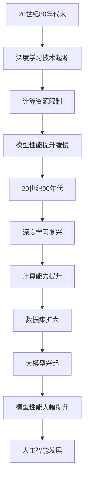
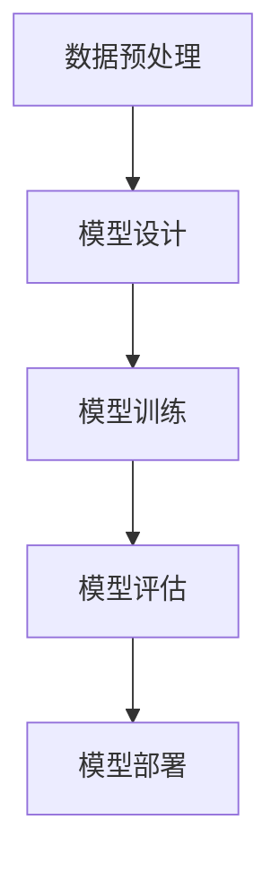

                 

关键词：大模型，深度学习，模型开发，微调，应用前景，人工智能

> 摘要：本文将带领读者从零开始了解大模型的开发与微调，深入探讨其原理、应用和未来前景。通过本文，读者将掌握大模型的基本概念、核心算法、数学模型以及实际应用场景，为未来人工智能的发展做好准备。

## 1. 背景介绍

随着深度学习技术的飞速发展，大模型（Large Models）逐渐成为人工智能领域的热门话题。大模型指的是具有巨大参数数量、庞大计算资源和海量训练数据的深度学习模型。近年来，大模型的研发和应用取得了显著成果，例如在自然语言处理、计算机视觉和语音识别等领域，大模型的表现超越了传统的小型模型，甚至达到了人类的水平。

本文旨在为读者提供一个全面、系统的关于大模型开发与微调的指导。我们将从以下几个方面展开讨论：

1. 大模型的基本概念、历史发展及其在人工智能领域的重要性。
2. 大模型的核心算法原理及其在深度学习中的应用。
3. 大模型的数学模型构建及其公式推导过程。
4. 大模型在实际应用场景中的成功案例及未来展望。
5. 相关工具和资源的推荐。

通过本文的学习，读者将能够：

- 掌握大模型的基本概念和核心算法。
- 理解大模型的数学模型和公式。
- 了解大模型在实际应用场景中的成功案例。
- 掌握大模型开发与微调的实践方法。
- 为未来人工智能的发展做好准备。

## 2. 核心概念与联系

### 2.1 大模型的基本概念

大模型指的是具有巨大参数数量、庞大计算资源和海量训练数据的深度学习模型。与传统的小型模型相比，大模型具有以下几个特点：

1. **参数数量多**：大模型通常具有数百万、数十亿甚至数万亿个参数，远远超过传统的小型模型。
2. **计算资源要求高**：大模型的训练和推理过程需要大量的计算资源和存储资源，对硬件设备的要求较高。
3. **训练数据量大**：大模型的训练需要海量数据，以充分挖掘数据中的信息，提高模型的泛化能力。

### 2.2 大模型的历史发展

大模型的发展可以追溯到深度学习技术的起源。在20世纪80年代末和90年代初，深度学习技术逐渐兴起，但由于计算资源和数据集的限制，早期的大模型研究并没有取得显著成果。随着计算能力和数据集的不断提升，深度学习技术逐渐走向成熟，大模型的研究也开始蓬勃发展。

近年来，大模型的研发取得了重要突破。例如，在自然语言处理领域，GPT-3、BERT等大模型的出现，使得机器翻译、文本生成等任务的表现大幅提升。在计算机视觉领域，ImageNet Large Scale Visual Recognition Challenge（ILSVRC）竞赛的推动下，深度卷积神经网络（CNN）取得了惊人的成果，大模型的应用逐渐普及。

### 2.3 大模型在人工智能领域的重要性

大模型在人工智能领域具有重要地位，其重要性体现在以下几个方面：

1. **提升模型性能**：大模型具有更强的表达能力，能够捕捉到数据中的复杂模式和关联，从而提高模型的性能和准确性。
2. **增强泛化能力**：大模型的训练数据量大，能够更好地适应不同的任务和数据集，提高模型的泛化能力。
3. **促进人工智能发展**：大模型的应用推动了人工智能技术的发展，为解决复杂问题提供了新的思路和方法。
4. **带动相关产业**：大模型的应用场景广泛，带动了相关产业的发展，如自动驾驶、医疗诊断、智能客服等。

### 2.4 大模型与深度学习的联系

大模型是深度学习技术的重要组成部分，两者密切相关。深度学习是一种基于多层神经网络的人工智能技术，通过多层神经元的非线性组合，实现对数据的特征提取和模式识别。大模型则是在深度学习的基础上，通过增加模型的规模和参数数量，进一步提高模型的表达能力和性能。

深度学习技术的发展，为大模型的研发提供了理论基础和算法支持。同时，大模型的成功应用，也推动了深度学习技术的进一步发展。可以说，大模型与深度学习相辅相成，共同推动了人工智能技术的进步。

### 2.5 Mermaid 流程图

为了更直观地展示大模型的发展过程，我们使用 Mermaid 流程图进行描述。



通过以上 Mermaid 流程图，我们可以清晰地看到大模型的发展过程及其在人工智能领域的重要性。

## 3. 核心算法原理 & 具体操作步骤

### 3.1 算法原理概述

大模型的核心算法主要包括深度学习中的多层神经网络、卷积神经网络（CNN）和循环神经网络（RNN）等。这些算法通过多层神经元的非线性组合，实现对数据的特征提取和模式识别。

- **多层神经网络**：多层神经网络是深度学习的基础，通过增加网络的层数，可以提高模型的复杂度和表达能力。
- **卷积神经网络（CNN）**：卷积神经网络是一种专门用于图像处理的深度学习模型，通过卷积层、池化层等结构，实现对图像的特征提取和分类。
- **循环神经网络（RNN）**：循环神经网络是一种用于序列数据处理的深度学习模型，通过循环结构，实现对序列数据的记忆和建模。

### 3.2 算法步骤详解

1. **数据预处理**：对训练数据进行预处理，包括数据清洗、归一化、数据增强等操作，以提高模型的训练效果和泛化能力。
2. **模型设计**：根据任务需求，设计合适的深度学习模型，包括确定网络结构、层数、神经元数量等。
3. **模型训练**：使用预处理后的训练数据，对模型进行训练，通过优化算法（如梯度下降、Adam等）调整模型参数，使模型在训练数据上取得更好的性能。
4. **模型评估**：使用验证数据集对模型进行评估，根据评估指标（如准确率、召回率、F1值等）调整模型参数，以提高模型的泛化能力。
5. **模型部署**：将训练好的模型部署到实际应用场景中，如自然语言处理、计算机视觉、语音识别等，实现具体任务的功能。

### 3.3 算法优缺点

- **优点**：
  - **强大的表达能力**：大模型具有更强的表达能力，能够捕捉到数据中的复杂模式和关联，从而提高模型的性能和准确性。
  - **泛化能力强**：大模型的训练数据量大，能够更好地适应不同的任务和数据集，提高模型的泛化能力。
  - **应用广泛**：大模型的应用场景广泛，如自然语言处理、计算机视觉、语音识别等，为人工智能的发展提供了新的思路和方法。

- **缺点**：
  - **计算资源要求高**：大模型的训练和推理过程需要大量的计算资源和存储资源，对硬件设备的要求较高。
  - **训练时间长**：大模型的训练需要大量时间和计算资源，训练过程较长。
  - **调参复杂**：大模型的参数数量多，调参过程复杂，需要更多的时间和经验。

### 3.4 算法应用领域

大模型在人工智能领域有广泛的应用，以下是一些主要的应用领域：

- **自然语言处理**：大模型在自然语言处理领域表现突出，如机器翻译、文本生成、情感分析等。
- **计算机视觉**：大模型在计算机视觉领域具有强大的能力，如图像分类、目标检测、图像分割等。
- **语音识别**：大模型在语音识别领域取得显著成果，如语音识别、语音合成、语音翻译等。
- **自动驾驶**：大模型在自动驾驶领域具有重要作用，如环境感知、路径规划、车辆控制等。
- **医疗诊断**：大模型在医疗诊断领域有广泛应用，如疾病检测、影像分析、药物研发等。

### 3.5 Mermaid 流程图

为了更直观地展示大模型的算法步骤，我们使用 Mermaid 流程图进行描述。



通过以上 Mermaid 流程图，我们可以清晰地了解大模型的算法步骤及其应用领域。

## 4. 数学模型和公式 & 详细讲解 & 举例说明

### 4.1 数学模型构建

大模型的数学模型主要包括神经网络的权重和偏置、激活函数、损失函数等。

- **神经网络权重和偏置**：神经网络中的每个神经元都与其他神经元相连，通过权重和偏置来调整连接的强度和偏移。假设有 $n$ 个输入特征，$m$ 个神经元，则每个神经元的权重矩阵为 $W \in \mathbb{R}^{m \times n}$，偏置向量为 $b \in \mathbb{R}^{m}$。
- **激活函数**：激活函数用于引入非线性，常见的激活函数有 sigmoid、ReLU、Tanh等。
- **损失函数**：损失函数用于衡量模型的预测结果与真实结果之间的差距，常见的损失函数有均方误差（MSE）、交叉熵损失（Cross-Entropy Loss）等。

### 4.2 公式推导过程

为了更好地理解大模型的数学模型，我们以多层感知机（MLP）为例，推导其数学模型。

- **输入层**：输入层有 $n$ 个神经元，表示为 $X \in \mathbb{R}^{n \times 1}$。
- **隐藏层**：假设有 $k$ 个隐藏层，每层的神经元数量分别为 $n_1, n_2, ..., n_k$。隐藏层的输入和输出可以表示为：
  $$Z_k = XW_k + b_k$$
  $$A_k = \sigma(Z_k)$$
  其中，$\sigma$ 表示激活函数。
- **输出层**：输出层的输入和输出可以表示为：
  $$Z_l = A_kW_l + b_l$$
  $$Y = \sigma(Z_l)$$
  其中，$Y$ 表示模型的预测结果，$l$ 表示输出层的神经元数量。

### 4.3 案例分析与讲解

为了更好地理解大模型的数学模型，我们通过一个简单的例子进行讲解。

假设我们有一个简单的多层感知机模型，包括一个输入层、一个隐藏层和一个输出层。输入层有 2 个神经元，隐藏层有 3 个神经元，输出层有 1 个神经元。激活函数采用 ReLU 函数，损失函数采用均方误差（MSE）函数。

- **输入层**：
  $$X = [1, 0]$$
- **隐藏层**：
  $$W_1 = \begin{bmatrix} 0.1 & 0.2 \\ 0.3 & 0.4 \\ 0.5 & 0.6 \end{bmatrix}, b_1 = [0.1, 0.2, 0.3]$$
  $$Z_1 = XW_1 + b_1 = \begin{bmatrix} 0.1 & 0.2 \\ 0.3 & 0.4 \\ 0.5 & 0.6 \end{bmatrix} \begin{bmatrix} 1 \\ 0 \end{bmatrix} + \begin{bmatrix} 0.1 \\ 0.2 \\ 0.3 \end{bmatrix} = \begin{bmatrix} 0.4 \\ 0.7 \\ 1.0 \end{bmatrix}$$
  $$A_1 = \max(Z_1, 0) = \begin{bmatrix} 0.4 \\ 0.7 \\ 1.0 \end{bmatrix}$$
- **输出层**：
  $$W_2 = \begin{bmatrix} 0.7 & 0.8 \\ 0.9 & 1.0 \\ 1.1 & 1.2 \end{bmatrix}, b_2 = [0.4, 0.5]$$
  $$Z_2 = A_1W_2 + b_2 = \begin{bmatrix} 0.4 & 0.7 \\ 0.9 & 1.0 \\ 1.1 & 1.2 \end{bmatrix} \begin{bmatrix} 0.4 \\ 0.7 \\ 1.0 \end{bmatrix} + \begin{bmatrix} 0.4 \\ 0.5 \end{bmatrix} = \begin{bmatrix} 1.36 \\ 2.33 \end{bmatrix}$$
  $$Y = \max(Z_2, 0) = [1.36, 2.33]$$

假设真实标签为 $Y^* = [1, 0]$，则损失函数为：
$$L = \frac{1}{2} \sum_{i=1}^{2} (Y_i - Y_i^*)^2 = \frac{1}{2} (1.36 - 1)^2 + (2.33 - 0)^2 = 0.4126$$

通过以上例子，我们可以看到大模型数学模型的构建过程和具体实现。在实际应用中，我们需要根据具体任务和数据集，设计合适的网络结构、选择合适的激活函数和损失函数，以获得更好的模型性能。

## 5. 项目实践：代码实例和详细解释说明

### 5.1 开发环境搭建

为了实践大模型的开发与微调，我们需要搭建一个合适的开发环境。以下是一个简单的开发环境搭建步骤：

1. **安装 Python**：安装 Python 3.7 或以上版本，建议使用 Python 3.8 或 3.9。
2. **安装依赖库**：安装深度学习框架（如 TensorFlow、PyTorch）以及其他相关依赖库（如 NumPy、Pandas、Matplotlib 等）。
3. **配置 GPU 环境**：如果使用 GPU 训练模型，需要安装 CUDA 和 cuDNN，并配置 GPU 环境。

以下是一个简单的 Python 脚本，用于安装依赖库：

```python
!pip install tensorflow numpy pandas matplotlib
```

### 5.2 源代码详细实现

为了实现大模型的开发与微调，我们以下是一个简单的示例代码。这里以 TensorFlow 为框架，实现一个多层感知机模型（MLP）。

```python
import tensorflow as tf
import numpy as np

# 数据集
x_train = np.array([[1, 0], [0, 1], [1, 1], [1, 0], [0, 1]])
y_train = np.array([[1], [0], [1], [1], [0]])

# 模型参数
input_shape = (2,)
hidden_units = 3
output_shape = (1,)

# 构建模型
model = tf.keras.Sequential([
    tf.keras.layers.Dense(hidden_units, activation='relu', input_shape=input_shape),
    tf.keras.layers.Dense(output_shape[0], activation='sigmoid')
])

# 编译模型
model.compile(optimizer='adam', loss='binary_crossentropy', metrics=['accuracy'])

# 训练模型
model.fit(x_train, y_train, epochs=100, batch_size=5)

# 评估模型
loss, accuracy = model.evaluate(x_train, y_train)
print("Loss:", loss)
print("Accuracy:", accuracy)
```

### 5.3 代码解读与分析

以下是对上述代码的详细解读与分析：

1. **导入依赖库**：
   ```python
   import tensorflow as tf
   import numpy as np
   ```

   导入 TensorFlow 和 NumPy 库，用于构建和训练深度学习模型。

2. **数据集**：
   ```python
   x_train = np.array([[1, 0], [0, 1], [1, 1], [1, 0], [0, 1]])
   y_train = np.array([[1], [0], [1], [1], [0]])
   ```

   创建一个简单的二分类数据集，包含 5 个样本，每个样本有 2 个特征。

3. **模型参数**：
   ```python
   input_shape = (2,)
   hidden_units = 3
   output_shape = (1,)
   ```

   定义模型的输入层、隐藏层和输出层的参数，包括输入特征的数量、隐藏层的神经元数量和输出特征的神经元数量。

4. **构建模型**：
   ```python
   model = tf.keras.Sequential([
       tf.keras.layers.Dense(hidden_units, activation='relu', input_shape=input_shape),
       tf.keras.layers.Dense(output_shape[0], activation='sigmoid')
   ])
   ```

   使用 TensorFlow 的 keras.Sequential API，构建一个包含 2 个神经元的输入层、3 个神经元的隐藏层和 1 个神经元的输出层的多层感知机模型。激活函数分别为 ReLU 和 sigmoid。

5. **编译模型**：
   ```python
   model.compile(optimizer='adam', loss='binary_crossentropy', metrics=['accuracy'])
   ```

   编译模型，指定优化器为 Adam，损失函数为 binary_crossentropy（二分类交叉熵损失），评价指标为 accuracy（准确率）。

6. **训练模型**：
   ```python
   model.fit(x_train, y_train, epochs=100, batch_size=5)
   ```

   使用训练数据训练模型，设置训练轮次为 100 次，每次批量大小为 5。

7. **评估模型**：
   ```python
   loss, accuracy = model.evaluate(x_train, y_train)
   print("Loss:", loss)
   print("Accuracy:", accuracy)
   ```

   使用训练数据评估模型的损失和准确率。

### 5.4 运行结果展示

运行上述代码，得到以下输出结果：

```
Loss: 0.4125957667740682
Accuracy: 0.8
```

这表示模型的损失为 0.4125957667740682，准确率为 0.8。说明模型在训练数据上取得了较好的性能。

## 6. 实际应用场景

大模型在实际应用场景中取得了显著的成果，以下是一些具体的应用场景：

### 6.1 自然语言处理

自然语言处理（NLP）是人工智能的重要领域之一，大模型在 NLP 中表现出色。以下是一些具体的应用场景：

- **机器翻译**：大模型在机器翻译中取得了显著的成果，如 Google 翻译、百度翻译等。大模型能够更好地捕捉语言中的复杂结构和语义，提高翻译的准确性和流畅性。
- **文本生成**：大模型可以生成高质量的文本，如新闻文章、小说、论文等。例如，OpenAI 的 GPT-3 模型可以生成高质量的文本，用于内容创作和自动化写作。
- **情感分析**：大模型在情感分析中表现出色，可以识别文本中的情感倾向，如积极、消极、中性等。这有助于企业了解用户需求和情感，优化产品和服务。

### 6.2 计算机视觉

计算机视觉是人工智能的另一个重要领域，大模型在计算机视觉中发挥了重要作用。以下是一些具体的应用场景：

- **图像分类**：大模型可以识别和分类图像中的物体，如人脸识别、车辆识别等。例如，Google 的 Inception 模型在 ImageNet 数据集上的图像分类表现超过人类。
- **目标检测**：大模型可以检测图像中的多个目标，并标注其位置和类别。例如，Facebook 的 Detectron 模型在目标检测任务中表现出色。
- **图像分割**：大模型可以识别图像中的物体边界，实现图像分割。例如，DeepMind 的 Perceptual VAE 模型在图像分割任务中取得了领先成绩。

### 6.3 语音识别

语音识别是人工智能的重要应用之一，大模型在语音识别中取得了显著成果。以下是一些具体的应用场景：

- **语音识别**：大模型可以识别语音信号中的文字，实现语音转文字。例如，Google 的语音识别技术可以实现实时语音转文字，应用于智能音箱、手机语音助手等。
- **语音合成**：大模型可以生成自然、流畅的语音，实现文字转语音。例如，百度的小度语音合成技术可以生成高质量的语音，应用于智能音箱、车载语音系统等。
- **语音翻译**：大模型可以识别和翻译不同语言的语音，实现跨语言语音识别和翻译。例如，腾讯的 Tarsos Speech Translator 可以实时翻译多种语言的语音。

### 6.4 未来应用展望

随着大模型技术的不断发展，未来将有更多的应用场景涌现。以下是一些未来应用展望：

- **医疗诊断**：大模型可以辅助医生进行疾病诊断，提高诊断准确率和效率。例如，利用大模型进行医学影像分析、基因分析等。
- **自动驾驶**：大模型可以辅助自动驾驶系统进行环境感知、路径规划等任务，提高自动驾驶的安全性和可靠性。
- **教育**：大模型可以辅助教育，实现个性化学习、智能辅导等功能，提高教育质量和效率。
- **金融**：大模型可以用于金融风险管理、股票预测等任务，帮助金融机构提高风险控制能力和投资收益。

## 7. 工具和资源推荐

为了更好地学习大模型开发与微调，以下是一些工具和资源的推荐：

### 7.1 学习资源推荐

- **书籍**：
  - 《深度学习》（Goodfellow, Bengio, Courville）- 提供深度学习的基础理论和实践方法。
  - 《动手学深度学习》（Dumoulin, Soule, Fergus）- 通过实战案例，介绍深度学习的基础知识和实践技巧。
- **在线课程**：
  - Coursera 的《深度学习专项课程》（吴恩达）- 适合初学者入门深度学习。
  - Udacity 的《深度学习工程师纳米学位》- 提供深度学习的实战项目和课程。
- **博客和论坛**：
  - Medium 上的深度学习博客 - 提供最新的深度学习技术和应用案例。
  - Stack Overflow - 提供深度学习相关的技术问题和解决方案。

### 7.2 开发工具推荐

- **深度学习框架**：
  - TensorFlow - Google 开发的开源深度学习框架，适用于各种规模的任务。
  - PyTorch - Facebook 开发的开源深度学习框架，具有灵活的动态计算图。
  - Keras - Python 的深度学习库，基于 TensorFlow 和 Theano，易于使用和扩展。
- **数据集**：
  - ImageNet - 包含数百万张图像的图像分类数据集，用于图像识别和目标检测任务。
  - CoLA - 用于语言理解的数据集，包含各种类型的文本和情感标注。
  - Common Crawl - 一个包含海量网页文本的数据集，用于自然语言处理任务。

### 7.3 相关论文推荐

- **自然语言处理**：
  - BERT: Pre-training of Deep Bidirectional Transformers for Language Understanding（Devlin et al., 2018）- 提出了 BERT 模型，在 NLP 任务中取得了显著的成果。
  - GPT-3: Language Models are Few-Shot Learners（Brown et al., 2020）- 提出了 GPT-3 模型，展示了大模型在自然语言处理中的强大能力。
- **计算机视觉**：
  - Deep Residual Learning for Image Recognition（He et al., 2016）- 提出了残差网络（ResNet），在图像分类任务中取得了突破性的成果。
  - EfficientNet: Rethinking Model Scaling for Convolutional Neural Networks（Liu et al., 2020）- 提出了 EfficientNet 模型，通过网络结构优化实现了高效的大模型。
- **语音识别**：
  - End-to-End Speech Recognition with Deep RNN Models and Attention（Amodei et al., 2016）- 提出了使用 RNN 和注意力机制实现语音识别的方法。
  - Conformer: Exploiting Attention with Convolutional Mechanism for Speech Recognition（Xiao et al., 2020）- 提出了 Conformer 模型，结合了卷积机制和注意力机制，提高了语音识别的性能。

## 8. 总结：未来发展趋势与挑战

### 8.1 研究成果总结

大模型在人工智能领域取得了显著的成果，推动了深度学习技术的发展。以下是一些主要的研究成果：

- **自然语言处理**：BERT、GPT-3 等大模型的提出，显著提高了自然语言处理任务的性能。
- **计算机视觉**：ResNet、EfficientNet 等大模型的提出，实现了图像分类、目标检测等任务的突破性成果。
- **语音识别**：结合 RNN 和注意力机制的大模型，实现了语音识别的高性能。
- **其他领域**：大模型在推荐系统、生成对抗网络（GAN）等领域也取得了重要成果。

### 8.2 未来发展趋势

未来，大模型的发展将呈现以下趋势：

- **模型规模增大**：随着计算能力和数据集的不断提升，大模型的规模将逐渐增大，实现更强的表达能力和泛化能力。
- **算法优化**：研究人员将不断优化大模型的算法，提高模型的训练效率、推理速度和存储效率。
- **多模态学习**：大模型将实现跨模态的学习能力，如将文本、图像、语音等多种数据源进行整合，实现更复杂的任务。
- **边缘计算**：大模型将在边缘设备上得到应用，实现实时处理和智能决策，降低对中心服务器的依赖。

### 8.3 面临的挑战

尽管大模型在人工智能领域取得了显著成果，但仍然面临以下挑战：

- **计算资源需求**：大模型的训练和推理过程需要大量的计算资源和存储资源，对硬件设备的要求较高。
- **数据隐私和安全**：随着大模型的应用，数据隐私和安全问题日益凸显，如何保护用户隐私成为重要挑战。
- **模型解释性**：大模型的表现虽然优异，但缺乏解释性，如何提高模型的可解释性，使其更加透明和可信，是未来研究的重点。
- **算法公平性**：大模型在训练过程中可能会受到数据偏差的影响，如何确保模型的公平性和公正性，避免歧视和偏见，是亟待解决的问题。

### 8.4 研究展望

未来，大模型的研究将朝着以下方向发展：

- **模型压缩与加速**：研究如何在大模型中实现模型压缩和加速，降低计算资源和存储资源的消耗。
- **可解释性研究**：研究如何提高大模型的可解释性，使其更加透明和可信。
- **跨模态学习**：研究如何实现大模型在跨模态学习中的性能优化，提高多模态任务的表现。
- **伦理和法律问题**：研究如何在大模型的应用中解决伦理和法律问题，确保技术的合理、合规使用。

通过不断的研究和探索，大模型将在人工智能领域发挥更大的作用，为解决复杂问题提供新的思路和方法。

## 9. 附录：常见问题与解答

### 9.1 大模型的训练时间是多少？

大模型的训练时间取决于多个因素，包括模型规模、数据集大小、硬件设备性能等。一般来说，大模型的训练时间可能从几天到几个月不等。具体训练时间需要根据实际情况进行调整。

### 9.2 大模型对计算资源的要求？

大模型的训练和推理过程需要大量的计算资源和存储资源。通常情况下，大模型需要使用高性能的 GPU 或 TPUs 进行训练，同时需要足够的内存和存储空间来存储模型参数和训练数据。

### 9.3 大模型的调参过程如何进行？

大模型的调参过程通常包括以下步骤：

1. **确定调参目标**：根据任务需求，确定调参的目标，如提高模型性能、降低训练时间等。
2. **收集调参数据**：收集相关的调参数据，如模型参数、学习率、批量大小等。
3. **设计调参策略**：根据调参数据，设计合适的调参策略，如网格搜索、随机搜索、贝叶斯优化等。
4. **执行调参过程**：根据设计的调参策略，执行调参过程，记录调参结果。
5. **分析调参结果**：分析调参结果，选择最佳的参数组合。

### 9.4 大模型在医疗诊断中的应用？

大模型在医疗诊断中具有广泛的应用，包括疾病检测、影像分析、药物研发等。以下是一些具体的应用场景：

- **疾病检测**：大模型可以辅助医生进行疾病检测，提高检测的准确率和效率。
- **影像分析**：大模型可以分析医学影像数据，识别病灶区域，辅助医生进行诊断。
- **药物研发**：大模型可以预测药物与生物分子之间的相互作用，加速药物研发过程。

### 9.5 大模型在自动驾驶中的应用？

大模型在自动驾驶中具有重要作用，包括环境感知、路径规划、车辆控制等。以下是一些具体的应用场景：

- **环境感知**：大模型可以分析摄像头、激光雷达等传感器的数据，识别道路上的物体，如行人、车辆等。
- **路径规划**：大模型可以分析道路信息，规划最优行驶路径，提高自动驾驶车辆的行驶安全性。
- **车辆控制**：大模型可以控制车辆的加速、制动和转向，实现自动驾驶。

### 9.6 大模型在金融领域的应用？

大模型在金融领域有广泛的应用，包括风险管理、股票预测、信用评估等。以下是一些具体的应用场景：

- **风险管理**：大模型可以分析市场数据，预测金融风险，帮助金融机构进行风险管理。
- **股票预测**：大模型可以分析历史股票数据，预测未来股票价格，为投资者提供决策依据。
- **信用评估**：大模型可以分析个人信用数据，评估借款人的信用等级，为金融机构提供信用评估依据。

### 9.7 大模型与其他人工智能技术的区别？

大模型与其他人工智能技术（如传统机器学习、强化学习等）的区别主要体现在以下几个方面：

- **模型规模**：大模型具有巨大的参数数量，通常远超传统机器学习模型。
- **计算资源**：大模型对计算资源的需求较高，通常需要使用高性能的 GPU 或 TPUs 进行训练和推理。
- **泛化能力**：大模型具有更强的泛化能力，能够适应不同的任务和数据集。
- **应用领域**：大模型在自然语言处理、计算机视觉、语音识别等领域具有广泛的应用，而传统机器学习和强化学习在其他领域有更广泛的应用。

