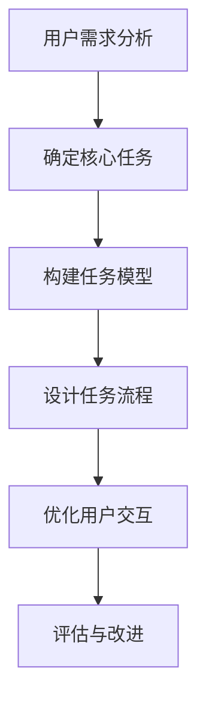
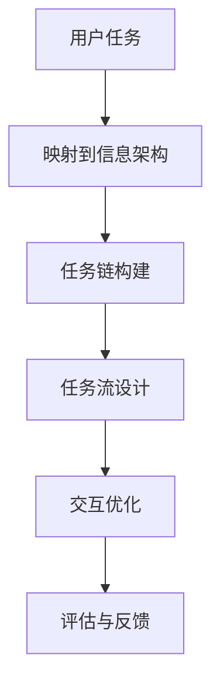
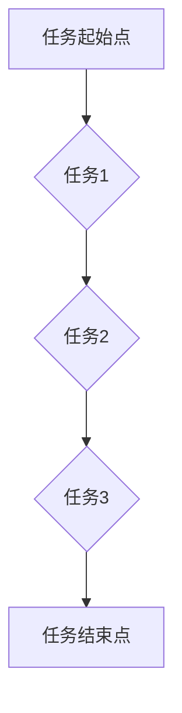

                 

 > 关键词：任务导向设计，信息架构，用户体验，系统优化，软件工程

> 摘要：本文探讨了任务导向设计在信息架构中的作用和影响，分析了任务导向设计的基本原理、应用场景以及其对用户体验、系统优化和软件工程的深远影响，最后展望了任务导向设计在未来信息架构中的发展趋势和挑战。

## 1. 背景介绍

在当今信息爆炸的时代，信息的组织和呈现方式对于用户体验至关重要。信息架构作为信息组织和分类的框架，直接影响到用户能否高效地获取和使用信息。传统的信息架构设计往往注重内容本身，而较少考虑用户的使用情境和需求。随着用户需求的变化和信息技术的进步，任务导向设计逐渐成为信息架构设计的重要理念。

任务导向设计（Task-Oriented Design，简称TOD）强调以用户任务为核心，将用户任务视为信息交互的中心，通过设计来优化用户完成任务的过程。它不仅仅关注信息的组织结构，还关注用户在使用信息时的行为模式、心理状态和需求变化。任务导向设计的出现，标志着信息架构设计从内容导向向用户导向的转型。

## 2. 核心概念与联系

### 2.1 任务导向设计的基本原理

任务导向设计的基本原理是“以任务为中心”，它要求设计者在进行信息架构设计时，首先要明确用户的核心任务，然后围绕这些任务来构建信息结构。

**Mermaid 流程图：**



在这个流程中，用户需求分析和确定核心任务是起点，构建任务模型和设计任务流程是核心步骤，而优化用户交互和评估与改进则是持续的优化过程。

### 2.2 任务导向设计与信息架构的联系

任务导向设计与信息架构之间存在着密切的联系。信息架构不仅需要支持用户完成任务，还需要适应任务的变化和多样性。任务导向设计通过以下方式影响信息架构：

- **任务映射**：将用户任务映射到信息架构中，确保信息结构能够直接支持任务的完成。
- **任务链**：通过分析任务之间的关联，构建任务链，优化信息访问路径。
- **任务流**：设计任务流，确保用户在完成每个任务时能够流畅地过渡到下一个任务。
- **交互设计**：优化用户与信息架构的交互，提高任务完成效率。

**Mermaid 流程图：**



## 3. 核心算法原理 & 具体操作步骤

### 3.1 算法原理概述

任务导向设计的信息架构构建，涉及到多种核心算法原理，包括：

- **用户行为分析**：通过分析用户行为数据，了解用户的使用习惯和需求。
- **任务流程建模**：基于用户行为分析结果，构建任务流程模型。
- **信息布局优化**：根据任务流程模型，优化信息布局，提高任务完成效率。

### 3.2 算法步骤详解

#### 步骤1：用户需求分析

首先，通过用户调研、用户访谈、行为数据分析等方法，收集用户需求信息，明确用户的核心任务。

$$
用户需求 = f(用户调研, 用户访谈, 行为数据分析)
$$

#### 步骤2：确定核心任务

基于用户需求，识别并确定用户的核心任务，这些任务通常具有高频次、高重要性等特点。

$$
核心任务 = f(用户需求, 频次分析, 重要性评估)
$$

#### 步骤3：构建任务模型

将核心任务映射到信息架构中，构建任务模型。任务模型应包括任务起始点、任务流程、任务结束点等信息。

**Mermaid 流程图：**



#### 步骤4：设计任务流程

根据任务模型，设计任务流程，确保用户能够高效地完成每个任务。

$$
任务流程 = f(任务模型, 交互设计, 流程优化)
$$

#### 步骤5：优化用户交互

通过优化信息布局、交互界面设计等手段，提高用户完成任务时的体验和效率。

$$
用户交互 = f(信息布局, 交互界面, 体验优化)
$$

### 3.3 算法优缺点

**优点：**

- 提高任务完成效率
- 优化用户体验
- 更好地适应用户需求变化

**缺点：**

- 需要大量的用户行为数据支持
- 设计过程较为复杂

### 3.4 算法应用领域

任务导向设计在多个领域都有广泛应用，包括电子商务、在线教育、金融服务、医疗保健等。在电子商务领域，任务导向设计可以优化购物流程，提高用户转化率；在在线教育领域，可以设计更符合学习习惯的任务流程，提高学习效果。

## 4. 数学模型和公式 & 详细讲解 & 举例说明

### 4.1 数学模型构建

任务导向设计的信息架构构建，涉及到多个数学模型。以下是其中几个核心模型：

#### 用户行为模型

$$
用户行为 = f(用户需求, 环境因素, 心理因素)
$$

#### 任务流程模型

$$
任务流程 = f(任务起始点, 任务节点, 任务结束点)
$$

#### 信息布局模型

$$
信息布局 = f(任务流程, 用户交互, 界面设计)
$$

### 4.2 公式推导过程

以用户行为模型为例，其推导过程如下：

$$
用户行为 = f(用户需求, 环境因素, 心理因素)
$$

其中，用户需求可以通过以下公式计算：

$$
用户需求 = f(功能需求, 交互需求, 安全需求)
$$

环境因素可以通过以下公式计算：

$$
环境因素 = f(设备环境, 网络环境, 系统环境)
$$

心理因素可以通过以下公式计算：

$$
心理因素 = f(认知因素, 情感因素, 社会因素)
$$

### 4.3 案例分析与讲解

#### 案例背景

某电子商务平台希望通过任务导向设计优化用户购物流程，提高用户转化率。

#### 案例分析

1. **用户需求分析**：通过用户调研，发现用户主要需求包括快速找到商品、了解商品详细信息、方便下单购买等。

2. **确定核心任务**：基于用户需求，确定核心任务为“购物流程”，包括“浏览商品”、“查看商品详情”、“加入购物车”、“下单购买”等步骤。

3. **构建任务模型**：根据核心任务，构建任务模型，包括任务起始点（首页）、任务节点（商品列表、商品详情、购物车、订单确认）、任务结束点（订单完成）。

4. **设计任务流程**：根据任务模型，设计任务流程，确保用户能够高效地完成每个任务。

5. **优化用户交互**：通过优化商品列表布局、商品详情展示方式、购物车交互设计等，提高用户购物体验。

#### 案例讲解

通过上述分析，我们可以看到，任务导向设计在优化用户购物流程方面具有显著效果。通过构建任务模型，设计任务流程，优化用户交互，电商平台能够更好地满足用户需求，提高用户转化率。

## 5. 项目实践：代码实例和详细解释说明

### 5.1 开发环境搭建

为了实践任务导向设计，我们需要搭建一个开发环境。这里以Python为例，搭建一个简单的任务导向设计的开发环境。

1. 安装Python：在官网上下载并安装Python。
2. 安装依赖库：使用pip命令安装相关依赖库，如numpy、matplotlib等。

### 5.2 源代码详细实现

以下是一个简单的Python代码示例，用于实现任务导向设计的基本原理。

```python
import numpy as np
import matplotlib.pyplot as plt

# 用户需求分析
def user_demand_analysis():
    # 假设用户需求是生成一系列随机数
    return np.random.rand(10)

# 确定核心任务
def determine_main_task(demand):
    # 根据需求，确定核心任务为绘制直方图
    return "绘制直方图"

# 构建任务模型
def build_task_model(main_task):
    # 构建任务模型
    return [
        {"task": "生成随机数", "action": user_demand_analysis},
        {"task": "绘制直方图", "action": plt.hist},
        {"task": "展示图形", "action": plt.show}
    ]

# 设计任务流程
def design_task_flow(task_model):
    # 执行任务流程
    for task in task_model:
        task["action"]()

# 优化用户交互
def optimize_user_interaction():
    # 优化用户交互
    plt.figure(figsize=(10, 5))
    plt.title("直方图展示")

# 运行任务流程
def run_task_flow():
    demand = user_demand_analysis()
    main_task = determine_main_task(demand)
    task_model = build_task_model(main_task)
    design_task_flow(task_model)
    optimize_user_interaction()

# 主函数
if __name__ == "__main__":
    run_task_flow()
```

### 5.3 代码解读与分析

上述代码实现了一个简单的任务导向设计示例，主要包括以下几个部分：

1. **用户需求分析**：通过生成随机数来模拟用户需求。
2. **确定核心任务**：根据用户需求，确定核心任务为绘制直方图。
3. **构建任务模型**：构建任务模型，包括生成随机数、绘制直方图、展示图形等任务。
4. **设计任务流程**：执行任务流程，按照任务模型的顺序执行每个任务。
5. **优化用户交互**：通过调整图形大小、标题等，优化用户交互体验。
6. **运行任务流程**：运行整个任务流程，完成用户需求。

### 5.4 运行结果展示

运行上述代码，将生成一个直方图，展示随机数的分布情况。这个简单的示例展示了任务导向设计的基本原理和实现过程。

## 6. 实际应用场景

任务导向设计在实际应用中有着广泛的应用，以下是一些实际应用场景：

- **电商平台**：通过任务导向设计优化购物流程，提高用户转化率。
- **在线教育平台**：设计任务导向的学习路径，提高学习效果。
- **医疗系统**：优化患者就医流程，提高医疗服务效率。
- **企业管理系统**：设计任务导向的办公流程，提高企业运作效率。

在这些应用场景中，任务导向设计通过优化用户任务流程，提高用户满意度，降低用户学习成本，从而提升系统整体效率。

## 7. 工具和资源推荐

### 7.1 学习资源推荐

- 《任务导向设计：原则与实践》（Task-Oriented Design: Principles and Practice）
- 《信息架构：设计信息空间》（Information Architecture: Blueprints for the Web）

### 7.2 开发工具推荐

- Python：用于快速实现任务导向设计的编程语言。
- Sketch：用于设计用户界面的图形工具。

### 7.3 相关论文推荐

- "Task-Oriented User Interface Design: A Survey"（任务导向用户界面设计：调查）
- "Information Architecture and User Experience Design: Theoretical Perspectives"（信息架构与用户体验设计：理论视角）

## 8. 总结：未来发展趋势与挑战

### 8.1 研究成果总结

任务导向设计在信息架构中的应用，取得了显著的效果。通过优化用户任务流程，提高用户满意度，降低用户学习成本，任务导向设计在多个领域取得了成功。

### 8.2 未来发展趋势

随着人工智能和大数据技术的发展，任务导向设计在未来有望进一步优化。通过更加精准的用户行为分析和智能化的任务流程设计，任务导向设计将更好地满足个性化需求。

### 8.3 面临的挑战

任务导向设计面临的主要挑战包括：

- 如何在大量用户行为数据中提取有效信息。
- 如何设计复杂任务流程，确保用户能够轻松完成。
- 如何在保证用户体验的同时，提高系统运行效率。

### 8.4 研究展望

未来，任务导向设计将在以下方面进行深入研究：

- 开发更加智能化的任务导向设计工具。
- 探索任务导向设计在不同领域的应用。
- 研究如何更好地整合用户反馈，持续优化任务导向设计。

## 9. 附录：常见问题与解答

### 9.1 什么是任务导向设计？

任务导向设计是一种以用户任务为核心的设计理念，通过优化用户完成任务的过程，提高用户满意度。

### 9.2 任务导向设计有哪些应用领域？

任务导向设计广泛应用于电子商务、在线教育、医疗系统、企业管理等领域。

### 9.3 如何实现任务导向设计？

实现任务导向设计通常包括用户需求分析、任务模型构建、任务流程设计、用户交互优化等步骤。

### 9.4 任务导向设计与信息架构有何关系？

任务导向设计通过优化用户任务流程，直接影响信息架构的设计和实现。

---

**作者：禅与计算机程序设计艺术 / Zen and the Art of Computer Programming**

