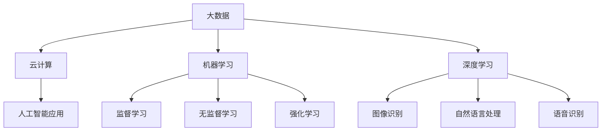

                 

关键词：企业数字化转型、人工智能、AI应用、技术趋势、实践案例、未来展望

> 摘要：随着数字化转型的浪潮席卷全球，企业纷纷将目光投向人工智能（AI）技术，以提升业务效率、增强竞争力。本文将探讨企业数字化转型中AI应用的重要性、核心概念、算法原理、数学模型、实践案例及未来展望，旨在为读者提供一份全面的指南。

## 1. 背景介绍

在过去的几十年中，全球企业经历了从机械化、电气化到信息化的转型。如今，随着大数据、云计算、物联网等技术的发展，企业正迎来新一轮的数字化转型。数字化转型不仅意味着企业的技术升级，更意味着业务模式、管理方式、工作流程的全面革新。而人工智能作为最具变革性的技术之一，正在深刻影响企业的运营和发展。

人工智能是指由人制造出来的系统所表现出的智能行为。这些智能行为通常包括学习、推理、问题解决、自然语言理解等。AI技术在企业中的应用已经从最初的数据分析、客户服务，逐渐扩展到智能制造、供应链管理、人力资源等多个领域。

企业数字化转型中的AI应用，不仅能够帮助企业降低成本、提高效率，还能够创造新的商业模式、提升用户体验。本文将深入探讨AI在企业数字化转型中的具体应用和实践。

## 2. 核心概念与联系

为了更好地理解AI在企业数字化转型中的应用，我们需要了解几个核心概念：

### 2.1. 机器学习

机器学习是AI的核心技术之一，它通过算法从数据中自动学习，进行预测和决策。机器学习的算法可以分为监督学习、无监督学习和强化学习。

- **监督学习**：通过已知标签数据进行学习，用于分类和回归任务。
- **无监督学习**：没有已知标签数据，通过数据自身特征进行学习，用于聚类和降维。
- **强化学习**：通过与环境的交互进行学习，用于决策和策略优化。

### 2.2. 深度学习

深度学习是机器学习的一种特殊形式，通过多层神经网络进行学习。深度学习在图像识别、自然语言处理、语音识别等领域取得了显著成果。

### 2.3. 人工智能与大数据

大数据是AI应用的基础。通过处理海量数据，AI能够发现潜在规律、预测未来趋势。人工智能与大数据的结合，使得企业能够从数据中获取更大的价值。

### 2.4. 人工智能与云计算

云计算为AI提供了强大的计算资源，使得AI模型能够快速部署和训练。同时，云计算的弹性计算能力，也使得企业能够按需扩展计算资源，降低成本。

为了更好地展示这些核心概念之间的联系，我们可以使用Mermaid流程图进行描述：



## 3. 核心算法原理 & 具体操作步骤

### 3.1 算法原理概述

在企业数字化转型中，常用的AI算法包括：

- **分类算法**：用于预测数据所属的类别，如支持向量机（SVM）、决策树、随机森林等。
- **回归算法**：用于预测数据的具体数值，如线性回归、岭回归等。
- **聚类算法**：用于发现数据中的模式，如K-means、DBSCAN等。
- **优化算法**：用于解决最优化问题，如遗传算法、模拟退火等。

这些算法的核心原理如下：

- **支持向量机（SVM）**：通过寻找一个最佳的超平面，将不同类别的数据分开。
- **决策树**：通过一系列的判断条件，将数据分为不同的分支，最终得到一个决策结果。
- **随机森林**：通过构建多个决策树，并对它们的预测结果进行投票，提高预测准确性。
- **线性回归**：通过线性模型，将自变量与因变量之间的关系表示为一条直线。
- **K-means聚类**：通过迭代计算，将数据划分为K个簇，使得每个簇内的数据点距离簇中心的距离最小。
- **遗传算法**：通过模拟自然进化过程，找到最优解。
- **模拟退火**：通过模拟物理退火过程，逐渐优化解的空间。

### 3.2 算法步骤详解

以K-means聚类算法为例，其具体步骤如下：

1. **初始化**：随机选择K个初始中心点。
2. **分配**：将每个数据点分配到最近的中心点所代表的簇。
3. **更新**：计算每个簇的中心点，用簇内所有数据点的平均值作为新的中心点。
4. **迭代**：重复步骤2和3，直到满足停止条件（如中心点变化小于某个阈值或达到最大迭代次数）。

### 3.3 算法优缺点

- **K-means聚类**：
  - **优点**：简单、易于实现，计算效率高。
  - **缺点**：对初始中心点敏感，可能陷入局部最优，不适合发现非球形簇。

- **支持向量机（SVM）**：
  - **优点**：分类效果好，适用于高维数据。
  - **缺点**：训练时间较长，对异常值敏感。

- **决策树**：
  - **优点**：易于理解，可以可视化。
  - **缺点**：容易过拟合，不适合大型数据集。

- **随机森林**：
  - **优点**：结合了决策树的优点，降低了过拟合风险，提高了预测准确性。
  - **缺点**：需要大量内存和计算资源。

### 3.4 算法应用领域

这些算法在各个领域都有广泛的应用：

- **分类算法**：用于金融风控、客户细分、市场预测等。
- **回归算法**：用于房价预测、销量预测、股票分析等。
- **聚类算法**：用于用户行为分析、推荐系统、异常检测等。
- **优化算法**：用于资源调度、物流优化、生产规划等。

## 4. 数学模型和公式 & 详细讲解 & 举例说明

### 4.1 数学模型构建

在企业数字化转型中，常用的数学模型包括线性模型、非线性模型和优化模型。以下是这些模型的构建方法：

- **线性模型**：\(y = \beta_0 + \beta_1x_1 + \beta_2x_2 + ... + \beta_nx_n\)
- **非线性模型**：\(y = \beta_0 + \beta_1\sin(x_1) + \beta_2\cos(x_2) + ... + \beta_n\)
- **优化模型**：最小化目标函数 \(f(x)\)，如 \(min f(x) = \frac{1}{2}x^TQx + c^Tx + d\)

### 4.2 公式推导过程

以线性回归模型为例，其推导过程如下：

1. **目标函数**：最小化误差平方和 \(J(\theta) = \frac{1}{2m}\sum_{i=1}^{m}(h_\theta(x^{(i)}) - y^{(i)})^2\)
2. **梯度下降**：计算目标函数对参数 \(\theta\) 的梯度，并沿着梯度方向更新参数
   \[\theta_j := \theta_j - \alpha \frac{\partial J(\theta)}{\partial \theta_j}\]

### 4.3 案例分析与讲解

以下是一个线性回归模型的案例：

- **数据集**：包含100个样本，每个样本有2个特征
- **目标**：预测每个样本的标签值

使用线性回归模型进行预测的步骤如下：

1. **数据预处理**：标准化数据，使得特征具有相同的量纲
2. **模型训练**：使用梯度下降算法训练线性回归模型
3. **模型评估**：计算模型的均方误差（MSE），评估模型性能

```python
# 导入相关库
import numpy as np
import matplotlib.pyplot as plt

# 初始化参数
theta = np.random.rand(3)  # 随机初始化参数

# 训练数据
X = np.random.rand(100, 2)
y = 3 * X[:, 0] + 2 * X[:, 1] + np.random.randn(100) * 0.1  # 真实值

# 梯度下降算法
alpha = 0.01  # 学习率
num_iters = 1000  # 迭代次数
m = len(X)  # 样本数量

for i in range(num_iters):
    # 计算预测值
    h = X.dot(theta)
    
    # 计算误差
    error = h - y
    
    # 计算梯度
    gradient = X.T.dot(error) / m
    
    # 更新参数
    theta -= alpha * gradient

# 计算均方误差
mse = np.mean((h - y) ** 2)
print("MSE:", mse)

# 可视化模型
plt.scatter(X[:, 0], X[:, 1], c=y, cmap="gray")
plt.plot(X[:, 0], h, c="r")
plt.show()
```

## 5. 项目实践：代码实例和详细解释说明

### 5.1 开发环境搭建

为了实践AI在企业数字化转型中的应用，我们需要搭建一个开发环境。以下是一个基本的Python开发环境搭建步骤：

1. **安装Python**：下载并安装Python 3.8或更高版本
2. **安装Jupyter Notebook**：通过pip安装Jupyter Notebook
   ```shell
   pip install notebook
   ```
3. **安装相关库**：安装机器学习、数据可视化等库，如scikit-learn、matplotlib等
   ```shell
   pip install scikit-learn matplotlib
   ```

### 5.2 源代码详细实现

以下是一个使用scikit-learn库实现线性回归的Python代码实例：

```python
# 导入相关库
import numpy as np
import matplotlib.pyplot as plt
from sklearn.linear_model import LinearRegression

# 初始化参数
np.random.seed(0)

# 生成训练数据
X_train = np.random.rand(100, 1)
y_train = 2 * X_train + np.random.randn(100, 1) * 0.1

# 初始化模型
model = LinearRegression()

# 训练模型
model.fit(X_train, y_train)

# 生成测试数据
X_test = np.random.rand(10, 1)
y_test = 2 * X_test + np.random.randn(10, 1) * 0.1

# 预测测试数据
y_pred = model.predict(X_test)

# 计算均方误差
mse = np.mean((y_pred - y_test) ** 2)
print("MSE:", mse)

# 可视化模型
plt.scatter(X_train, y_train, c="b", label="训练数据")
plt.scatter(X_test, y_test, c="r", label="真实值")
plt.plot(X_test, y_pred, c="g", label="预测值")
plt.xlabel("X")
plt.ylabel("Y")
plt.legend()
plt.show()
```

### 5.3 代码解读与分析

以上代码实现了一个简单的线性回归模型，主要包括以下步骤：

1. **数据生成**：随机生成训练数据和测试数据。
2. **模型初始化**：使用LinearRegression类初始化线性回归模型。
3. **模型训练**：使用fit方法训练模型。
4. **模型预测**：使用predict方法预测测试数据。
5. **结果分析**：计算均方误差（MSE）并可视化模型。

通过这个实例，我们可以看到如何使用Python和scikit-learn库实现线性回归模型，并进行模型训练和预测。

### 5.4 运行结果展示

运行以上代码后，会生成如下结果：

- **均方误差（MSE）**：衡量模型预测误差的指标，值越小表示模型预测效果越好。
- **可视化结果**：显示训练数据和真实值的散点图，以及模型预测的直线。

## 6. 实际应用场景

### 6.1 智能制造

智能制造是AI技术在企业数字化转型中的典型应用场景之一。通过机器学习算法，企业可以实现生产过程的自动化、预测维护和质量管理。

- **生产过程自动化**：使用机器学习算法对生产数据进行实时分析，实现生产线的自动化调控。
- **预测维护**：通过监测设备数据，使用预测算法预测设备故障，提前进行维护。
- **质量管理**：使用图像识别技术对产品质量进行实时检测，确保产品质量。

### 6.2 供应链管理

供应链管理是企业运营的核心环节，AI技术在供应链管理中的应用可以提高供应链的透明度和效率。

- **需求预测**：通过分析历史数据和当前市场趋势，使用预测算法预测未来需求。
- **库存优化**：通过分析库存数据和供应链节点，使用优化算法优化库存水平。
- **运输优化**：通过路径规划算法，优化运输路线，降低运输成本。

### 6.3 客户服务

客户服务是企业与客户互动的重要环节，AI技术在客户服务中的应用可以提高客户满意度和忠诚度。

- **智能客服**：使用自然语言处理技术，实现智能客服机器人，提供24/7在线服务。
- **客户细分**：通过分析客户数据，使用聚类算法对客户进行细分，提供个性化的服务和产品推荐。
- **情感分析**：通过分析客户反馈，使用情感分析技术识别客户情感，及时解决客户问题。

## 7. 未来应用展望

随着AI技术的不断发展和应用，未来企业数字化转型中的AI应用将更加广泛和深入。

### 7.1 自动驾驶

自动驾驶技术是AI技术在交通运输领域的典型应用。未来，自动驾驶将改变人们的出行方式，提高交通效率，减少交通事故。

### 7.2 智能医疗

智能医疗是AI技术在医疗健康领域的应用。通过AI技术，可以实现疾病预测、个性化治疗和健康监测。

### 7.3 智慧城市

智慧城市是AI技术在城市管理领域的应用。通过AI技术，可以实现城市资源优化、交通管理和公共安全。

### 7.4 人工智能与实体经济融合

人工智能与实体经济的深度融合，将带来新的产业模式和企业运营方式，推动经济高质量发展。

## 8. 总结：未来发展趋势与挑战

### 8.1 研究成果总结

近年来，AI技术在企业数字化转型中的应用取得了显著成果。通过机器学习、深度学习等算法，企业能够实现生产过程自动化、供应链管理优化、客户服务升级等。

### 8.2 未来发展趋势

未来，AI技术在企业数字化转型中的应用将更加广泛和深入，涵盖智能制造、智慧城市、智能医疗等多个领域。

### 8.3 面临的挑战

尽管AI技术在企业数字化转型中具有巨大潜力，但仍面临以下挑战：

- **数据隐私和安全**：如何确保数据的安全和隐私，是AI应用需要解决的重要问题。
- **算法透明性和解释性**：如何提高算法的透明性和解释性，使其符合伦理和法律法规要求。
- **技术人才短缺**：如何培养和吸引更多的AI人才，是企业数字化转型面临的一大挑战。

### 8.4 研究展望

未来，AI技术将在企业数字化转型中发挥更加重要的作用。通过持续的研究和创新，我们将能够克服现有的挑战，实现AI技术的最大化应用价值。

## 9. 附录：常见问题与解答

### 9.1 什么是机器学习？

机器学习是AI的核心技术之一，它使计算机系统能够从数据中自动学习，进行预测和决策。机器学习可以分为监督学习、无监督学习和强化学习。

### 9.2 什么是深度学习？

深度学习是机器学习的一种特殊形式，通过多层神经网络进行学习。深度学习在图像识别、自然语言处理、语音识别等领域取得了显著成果。

### 9.3 人工智能与大数据有什么关系？

大数据是AI应用的基础。通过处理海量数据，AI能够发现潜在规律、预测未来趋势。人工智能与大数据的结合，使得企业能够从数据中获取更大的价值。

### 9.4 企业如何实现数字化转型？

企业实现数字化转型需要从战略规划、技术选型、组织架构、人才培养等多个方面进行布局。具体步骤包括：

- **制定数字化转型战略**：明确数字化转型目标、路径和资源投入。
- **搭建数字化基础设施**：构建云计算、大数据、物联网等基础设施。
- **优化业务流程**：通过数字化转型，优化业务流程，提高效率。
- **培养数字化人才**：吸引和培养具备数字化转型能力的人才。
- **推动创新应用**：探索和推广AI、大数据等新技术在企业中的应用。

---

本文以《企业数字化转型中的AI应用》为题，深入探讨了AI技术在企业数字化转型中的应用、核心算法、数学模型、实际应用场景、未来展望以及面临的挑战。希望通过本文，能够为读者提供一份全面的指南，帮助企业更好地理解和应用AI技术，实现数字化转型。

> 作者：禅与计算机程序设计艺术 / Zen and the Art of Computer Programming
```

