                 

关键词：伦理、道德、人工智能、计算、算法、人类行为、技术发展

> 摘要：随着人工智能和计算技术的飞速发展，人类面临的伦理和道德问题日益突出。本文旨在探讨人类计算带来的道德困境，分析其中的伦理挑战，并提出可能的解决方案。通过对核心概念的深入探讨和实际案例的分析，本文希望引发读者对于技术伦理问题的深思，为未来技术的发展提供有益的指导。

## 1. 背景介绍

随着互联网、大数据、云计算等技术的普及，人类进入了一个信息爆炸的时代。计算能力的高速发展不仅极大地提高了工作效率，还推动了社会各领域的变革。然而，技术的进步也带来了许多新的伦理和道德问题，这些问题日益成为社会关注的焦点。

### 1.1 人工智能的兴起

人工智能（AI）作为计算技术的一个重要分支，其发展速度之快令人瞩目。AI技术的应用涵盖了医疗、金融、教育、交通等多个领域，为人类带来了诸多便利。然而，AI技术的广泛应用也引发了一系列伦理和道德问题，例如数据隐私、算法偏见、机器伦理等。

### 1.2 伦理困境的凸显

随着技术应用的不断深入，人类面临的伦理困境日益凸显。一方面，技术的快速发展使得一些传统伦理观念受到了挑战；另一方面，新技术带来的伦理问题往往具有复杂性和多样性，难以在短时间内得到有效解决。

## 2. 核心概念与联系

为了更好地理解人类计算带来的道德困境，我们需要明确几个核心概念，并探讨它们之间的联系。

### 2.1 人工智能伦理

人工智能伦理是研究人工智能系统中道德和伦理问题的学科。它关注的是人工智能如何影响人类生活，如何保证人工智能系统的道德性和合理性。人工智能伦理的核心问题是：如何确保人工智能系统在执行任务时遵循道德原则？

### 2.2 算法伦理

算法伦理是研究算法在设计和应用过程中产生的道德问题的学科。算法伦理的核心问题是：算法是否应该具有道德判断力，以及如何确保算法的道德决策。

### 2.3 数据伦理

数据伦理是研究数据收集、处理和应用过程中产生的道德问题的学科。数据伦理的核心问题是：如何确保数据的使用不侵犯个人隐私，不损害公共利益。

### 2.4 人类行为伦理

人类行为伦理是研究人类行为中的道德问题的学科。人类行为伦理的核心问题是：如何确保人类行为符合道德规范，如何处理人类行为中的伦理困境。

### 2.5 Mermaid 流程图

以下是人工智能伦理、算法伦理、数据伦理和人类行为伦理之间的 Mermaid 流程图：

```mermaid
graph TB
A[人工智能伦理] --> B[算法伦理]
A --> C[数据伦理]
A --> D[人类行为伦理]
B --> E[算法偏见]
B --> F[算法公平性]
C --> G[数据隐私]
C --> H[数据安全]
D --> I[行为规范]
D --> J[社会影响]
E --> K[性别歧视]
E --> L[种族偏见]
F --> M[资源分配]
F --> N[机会平等]
G --> O[隐私保护]
G --> P[数据滥用]
H --> Q[数据泄露]
H --> R[数据篡改]
I --> S[道德教育]
I --> T[道德判断]
J --> U[社会公正]
J --> V[社会稳定]
K --> W[算法修正]
K --> X[算法透明]
L --> Y[算法修正]
L --> Z[算法透明]
M --> AA[资源优化]
M --> BB[公平竞争]
N --> CC[机会均等]
N --> DD[社会包容]
O --> EE[隐私保护技术]
O --> FF[隐私政策]
P --> GG[隐私风险]
P --> HH[隐私监管]
Q --> II[安全防护]
Q --> JJ[法律法规]
R --> KK[数据真实性]
R --> LL[数据可溯]
S --> MM[道德规范]
S --> NN[道德教育]
U --> OO[政策引导]
U --> PP[社会监督]
V --> QQ[社会信任]
V --> RR[公共参与]
W --> SS[算法透明]
W --> TT[算法可解释]
X --> UU[算法透明]
X --> VV[算法可解释]
Y --> WW[算法修正]
Y --> XX[算法透明]
Z --> YY[算法修正]
Z --> ZZ[算法透明]
AA --> AAA[资源利用率]
AA --> BBB[能源消耗]
BB --> CCC[竞争公平]
BB --> DDD[市场稳定]
CC --> EEE[教育机会]
CC --> FFF[就业机会]
DD --> GGG[社会公正]
DD --> HHH[社会和谐]
EE --> III[隐私保护技术]
EE --> JJJ[隐私政策]
FF --> KKK[隐私风险]
FF --> LLL[隐私监管]
GG --> MMM[安全防护]
GG --> NNN[法律法规]
HH --> OOO[数据真实性]
HH --> PPP[数据可溯]
II --> QQQ[道德规范]
II --> RRR[道德教育]
JJ --> SSS[政策引导]
JJ --> TTT[社会监督]
KK --> UUU[数据真实]
KK --> VVV[数据可溯]
LL --> WWW[道德规范]
LL --> XXX[道德教育]
MM --> YYY[政策引导]
MM --> ZZZ[社会监督]
NN --> AAAA[社会信任]
NN --> BBBB[公共参与]
OO --> CCC[社会公正]
OO --> DDD[社会和谐]
PP --> EEE[隐私保护技术]
PP --> FFF[隐私政策]
QQ --> GGG[隐私风险]
QQ --> HHH[隐私监管]
RR --> III[安全防护]
RR --> JJJ[法律法规]
SS --> KKK[数据真实]
SS --> LLL[数据可溯]
TT --> MMM[道德规范]
TT --> NNN[道德教育]
UU --> OOO[政策引导]
UU --> PPP[社会监督]
VV --> QQQ[社会信任]
VV --> RRR[公共参与]
WW --> SSS[数据真实]
WW --> TTT[数据可溯]
XX --> UUU[道德规范]
XX --> VVV[道德教育]
YY --> WWW[政策引导]
YY --> XXX[社会监督]
ZZ --> AAAA[社会信任]
ZZ --> BBBB[公共参与]
```



### 2.6 Mermaid 流程图解释

该 Mermaid 流程图展示了人工智能伦理、算法伦理、数据伦理和人类行为伦理之间的复杂关系。每个节点代表一个特定的伦理问题或原则，箭头表示问题或原则之间的关联。通过分析这些关联，我们可以更好地理解人类计算带来的道德困境，并为解决这些问题提供有益的思路。

## 3. 核心算法原理 & 具体操作步骤

为了更好地理解人类计算带来的道德困境，我们需要探讨其中的核心算法原理，并详细描述其具体操作步骤。

### 3.1 算法原理概述

人类计算带来的道德困境涉及多个方面，包括人工智能伦理、算法伦理、数据伦理和人类行为伦理。针对这些问题，研究人员提出了多种算法原理，以帮助解决或缓解道德困境。

#### 3.1.1 人工智能伦理算法

人工智能伦理算法旨在确保人工智能系统在执行任务时遵循道德原则。这类算法通常包括以下原则：

- **公平性原则**：确保算法在处理数据时对所有人公平，不因性别、种族、年龄等因素产生偏见。
- **透明性原则**：确保算法的决策过程透明，用户可以理解算法如何作出决策。
- **可解释性原则**：确保算法的可解释性，用户可以理解算法的决策依据。
- **隐私保护原则**：确保算法在处理数据时保护个人隐私。

#### 3.1.2 算法伦理算法

算法伦理算法旨在解决算法设计和应用过程中产生的道德问题。这类算法通常包括以下原则：

- **伦理判断力原则**：算法应具备一定的伦理判断力，能够根据伦理原则作出决策。
- **道德责任原则**：算法设计者和应用者应对算法的道德决策负责。
- **伦理决策透明性原则**：算法的道德决策过程应透明，用户可以了解决策依据。

#### 3.1.3 数据伦理算法

数据伦理算法旨在确保数据收集、处理和应用过程中不侵犯个人隐私，不损害公共利益。这类算法通常包括以下原则：

- **隐私保护原则**：确保数据在收集、处理和应用过程中保护个人隐私。
- **数据安全原则**：确保数据在收集、处理和应用过程中不受到泄露、篡改等安全威胁。
- **数据透明性原则**：确保数据的使用透明，用户可以了解数据如何被使用。

#### 3.1.4 人类行为伦理算法

人类行为伦理算法旨在确保人类行为符合道德规范，处理人类行为中的伦理困境。这类算法通常包括以下原则：

- **道德规范原则**：确保人类行为遵循道德规范。
- **道德教育原则**：通过道德教育提高人类的道德素养，预防道德困境的发生。
- **道德判断力原则**：提高人类的道德判断力，帮助人们正确处理道德困境。

### 3.2 算法步骤详解

为了更好地理解上述算法原理，我们以人工智能伦理算法为例，详细描述其具体操作步骤。

#### 3.2.1 公平性原则操作步骤

1. **数据收集**：收集大量数据，确保数据来源多样化，避免因数据来源单一导致的偏见。
2. **数据预处理**：对数据进行清洗、去噪、归一化等处理，提高数据质量。
3. **特征提取**：从数据中提取关键特征，为算法提供输入。
4. **算法训练**：使用训练数据训练算法，使其具备公平性。
5. **算法评估**：使用测试数据评估算法的公平性，确保算法在处理数据时对所有人公平。

#### 3.2.2 透明性原则操作步骤

1. **算法设计**：在设计算法时考虑透明性，确保算法的决策过程透明。
2. **算法实现**：在实现算法时遵循透明性原则，确保算法的决策过程可解释。
3. **算法验证**：验证算法的透明性，确保用户可以理解算法的决策依据。

#### 3.2.3 可解释性原则操作步骤

1. **算法设计**：在设计算法时考虑可解释性，确保算法的决策过程可解释。
2. **算法实现**：在实现算法时遵循可解释性原则，确保算法的决策过程可解释。
3. **算法验证**：验证算法的可解释性，确保用户可以理解算法的决策依据。

#### 3.2.4 隐私保护原则操作步骤

1. **数据收集**：在收集数据时遵循隐私保护原则，确保个人隐私不被泄露。
2. **数据处理**：在处理数据时遵循隐私保护原则，确保个人隐私不被泄露。
3. **数据应用**：在应用数据时遵循隐私保护原则，确保个人隐私不被泄露。

### 3.3 算法优缺点

#### 3.3.1 公平性原则

**优点**：

- 提高算法的公平性，减少偏见。
- 有利于维护社会公平正义。

**缺点**：

- 难以实现绝对公平，因为数据来源和特征提取过程中可能存在偏见。
- 需要大量数据支持，数据收集和处理成本较高。

#### 3.3.2 透明性原则

**优点**：

- 提高算法的透明性，方便用户理解。
- 有利于监督和评估算法的决策过程。

**缺点**：

- 算法的实现和验证过程复杂，需要更多资源和时间。
- 透明性可能影响算法的效率和性能。

#### 3.3.3 可解释性原则

**优点**：

- 提高算法的可解释性，方便用户理解。
- 有利于算法的改进和优化。

**缺点**：

- 部分算法难以实现可解释性，如深度学习算法。
- 可解释性可能降低算法的性能。

#### 3.3.4 隐私保护原则

**优点**：

- 保护个人隐私，维护数据安全。
- 有利于提升用户信任度。

**缺点**：

- 难以实现绝对隐私保护，因为数据在传输和处理过程中可能存在泄露风险。
- 隐私保护可能影响数据的利用效率。

### 3.4 算法应用领域

#### 3.4.1 公共安全

- 公共安全领域涉及人脸识别、交通监控、安全分析等，这些领域需要遵循公平性、透明性、可解释性和隐私保护原则，确保算法的道德性和合法性。

#### 3.4.2 医疗健康

- 医疗健康领域涉及疾病预测、药物研发、健康监测等，这些领域需要遵循公平性、透明性、可解释性和隐私保护原则，确保算法的道德性和有效性。

#### 3.4.3 金融保险

- 金融保险领域涉及风险控制、信用评估、欺诈检测等，这些领域需要遵循公平性、透明性、可解释性和隐私保护原则，确保算法的道德性和合规性。

#### 3.4.4 社交媒体

- 社交媒体领域涉及内容审核、广告投放、用户画像等，这些领域需要遵循公平性、透明性、可解释性和隐私保护原则，确保算法的道德性和用户满意度。

## 4. 数学模型和公式 & 详细讲解 & 举例说明

为了更好地理解人类计算带来的道德困境，我们需要借助数学模型和公式进行分析。以下是一些常用的数学模型和公式，以及它们的详细讲解和举例说明。

### 4.1 数学模型构建

为了构建数学模型，我们通常需要明确以下要素：

- **目标**：明确研究目标，确定需要解决的伦理问题。
- **变量**：确定参与模型计算的变量，如数据、算法、用户等。
- **关系**：明确变量之间的关系，如算法的公平性、透明性、可解释性和隐私保护等。

以下是一个简单的数学模型示例：

```latex
公平性 = f(数据质量, 算法设计, 数据预处理)
透明性 = g(算法实现, 算法验证)
可解释性 = h(算法设计, 算法验证)
隐私保护 = i(数据收集, 数据处理, 数据应用)
```

### 4.2 公式推导过程

为了推导出上述公式，我们需要分别考虑公平性、透明性、可解释性和隐私保护的具体实现方式。

#### 4.2.1 公平性公式推导

公平性取决于数据质量、算法设计和数据预处理。我们假设：

- **数据质量**：数据质量越高，公平性越高。
- **算法设计**：算法设计越合理，公平性越高。
- **数据预处理**：数据预处理越充分，公平性越高。

根据上述假设，我们可以得到公平性的公式：

$$
公平性 = \frac{1}{3} \left( 数据质量 + 算法设计 + 数据预处理 \right)
$$

#### 4.2.2 透明性公式推导

透明性取决于算法实现和算法验证。我们假设：

- **算法实现**：算法实现越透明，透明性越高。
- **算法验证**：算法验证越严格，透明性越高。

根据上述假设，我们可以得到透明性的公式：

$$
透明性 = \frac{1}{2} \left( 算法实现 + 算法验证 \right)
$$

#### 4.2.3 可解释性公式推导

可解释性取决于算法设计和算法验证。我们假设：

- **算法设计**：算法设计越简单，可解释性越高。
- **算法验证**：算法验证越严格，可解释性越高。

根据上述假设，我们可以得到可解释性的公式：

$$
可解释性 = \frac{1}{2} \left( 算法设计 + 算法验证 \right)
$$

#### 4.2.4 隐私保护公式推导

隐私保护取决于数据收集、数据处理和数据应用。我们假设：

- **数据收集**：数据收集越严格，隐私保护越好。
- **数据处理**：数据处理越严格，隐私保护越好。
- **数据应用**：数据应用越严格，隐私保护越好。

根据上述假设，我们可以得到隐私保护的公式：

$$
隐私保护 = \frac{1}{3} \left( 数据收集 + 数据处理 + 数据应用 \right)
$$

### 4.3 案例分析与讲解

为了更好地理解上述数学模型和公式的应用，我们以一个实际案例进行讲解。

#### 4.3.1 案例背景

某公司开发了一款基于人脸识别的智能门禁系统，用于企业办公楼的出入管理。该系统涉及到数据收集、数据处理和数据应用等多个环节。

#### 4.3.2 公平性分析

根据公平性公式，我们需要考虑数据质量、算法设计和数据预处理。假设：

- **数据质量**：数据质量较高，来自多个可靠的来源。
- **算法设计**：算法设计合理，考虑到性别、年龄等因素。
- **数据预处理**：数据预处理充分，去除了噪声和异常值。

将这些数据代入公平性公式，我们可以得到公平性评分：

$$
公平性 = \frac{1}{3} \left( 数据质量 + 算法设计 + 数据预处理 \right) = 0.8
$$

#### 4.3.3 透明性分析

根据透明性公式，我们需要考虑算法实现和算法验证。假设：

- **算法实现**：算法实现透明，用户可以查看决策过程。
- **算法验证**：算法验证严格，确保决策过程符合道德原则。

将这些数据代入透明性公式，我们可以得到透明性评分：

$$
透明性 = \frac{1}{2} \left( 算法实现 + 算法验证 \right) = 0.9
$$

#### 4.3.4 可解释性分析

根据可解释性公式，我们需要考虑算法设计和算法验证。假设：

- **算法设计**：算法设计简单，易于理解。
- **算法验证**：算法验证严格，确保决策过程符合道德原则。

将这些数据代入可解释性公式，我们可以得到可解释性评分：

$$
可解释性 = \frac{1}{2} \left( 算法设计 + 算法验证 \right) = 0.9
$$

#### 4.3.5 隐私保护分析

根据隐私保护公式，我们需要考虑数据收集、数据处理和数据应用。假设：

- **数据收集**：数据收集严格，仅收集必要信息。
- **数据处理**：数据处理严格，确保数据安全。
- **数据应用**：数据应用严格，仅用于门禁系统管理。

将这些数据代入隐私保护公式，我们可以得到隐私保护评分：

$$
隐私保护 = \frac{1}{3} \left( 数据收集 + 数据处理 + 数据应用 \right) = 0.8
$$

通过上述分析，我们可以得出该智能门禁系统的伦理评分：

- 公平性：0.8
- 透明性：0.9
- 可解释性：0.9
- 隐私保护：0.8

这个评分可以帮助公司了解系统的伦理状况，并根据评分结果进行优化和改进。

## 5. 项目实践：代码实例和详细解释说明

为了更好地理解人类计算带来的道德困境，我们需要通过实际项目实践来验证和优化算法。以下是一个基于Python的代码实例，用于实现公平性、透明性、可解释性和隐私保护的算法。

### 5.1 开发环境搭建

在开始编写代码之前，我们需要搭建开发环境。以下是搭建步骤：

1. 安装Python 3.8及以上版本。
2. 安装必要的Python库，如 NumPy、Pandas、Matplotlib、Scikit-learn等。
3. 创建一个名为"ethical_algorithms"的Python项目文件夹。

### 5.2 源代码详细实现

以下是一个简单的Python代码实例，用于实现公平性、透明性、可解释性和隐私保护的算法。

```python
import numpy as np
import pandas as pd
import matplotlib.pyplot as plt
from sklearn.model_selection import train_test_split
from sklearn.ensemble import RandomForestClassifier
from sklearn.metrics import accuracy_score, classification_report

# 数据准备
data = pd.read_csv("data.csv")
X = data.drop("target", axis=1)
y = data["target"]

# 数据预处理
X_train, X_test, y_train, y_test = train_test_split(X, y, test_size=0.2, random_state=42)

# 算法实现
clf = RandomForestClassifier(n_estimators=100, random_state=42)
clf.fit(X_train, y_train)

# 算法评估
y_pred = clf.predict(X_test)
accuracy = accuracy_score(y_test, y_pred)
report = classification_report(y_test, y_pred)

# 可视化
plt.figure(figsize=(10, 5))
plt.subplot(121)
plt.bar(X_train.columns, clf.feature_importances_)
plt.xlabel("特征")
plt.ylabel("重要性")
plt.title("特征重要性")

plt.subplot(122)
plt.bar(y_test, y_pred, color=["red" if y_pred[i] != y_test[i] else "green" for i in range(len(y_pred))])
plt.xlabel("真实标签")
plt.ylabel("预测标签")
plt.title("预测结果")

plt.tight_layout()
plt.show()

# 输出结果
print("算法评估报告：")
print(report)
print("算法准确性：", accuracy)
```

### 5.3 代码解读与分析

#### 5.3.1 数据准备

首先，我们使用Pandas库读取数据，并将其分为特征矩阵和标签。数据集包含多个特征和对应的标签。

```python
data = pd.read_csv("data.csv")
X = data.drop("target", axis=1)
y = data["target"]
```

#### 5.3.2 数据预处理

接着，我们使用Scikit-learn库的`train_test_split`函数将数据集划分为训练集和测试集，用于后续算法训练和评估。

```python
X_train, X_test, y_train, y_test = train_test_split(X, y, test_size=0.2, random_state=42)
```

#### 5.3.3 算法实现

然后，我们使用随机森林算法（`RandomForestClassifier`）对训练集进行训练。随机森林算法是一种基于决策树模型的集成算法，具有良好的泛化能力和可解释性。

```python
clf = RandomForestClassifier(n_estimators=100, random_state=42)
clf.fit(X_train, y_train)
```

#### 5.3.4 算法评估

在训练完成后，我们使用测试集对算法进行评估，计算准确性、召回率、精确率等指标，以评估算法的性能。

```python
y_pred = clf.predict(X_test)
accuracy = accuracy_score(y_test, y_pred)
report = classification_report(y_test, y_pred)
```

#### 5.3.5 可视化

最后，我们使用Matplotlib库将特征重要性和预测结果可视化，以帮助用户理解算法的决策过程。

```python
plt.figure(figsize=(10, 5))
plt.subplot(121)
plt.bar(X_train.columns, clf.feature_importances_)
plt.xlabel("特征")
plt.ylabel("重要性")
plt.title("特征重要性")

plt.subplot(122)
plt.bar(y_test, y_pred, color=["red" if y_pred[i] != y_test[i] else "green" for i in range(len(y_pred))])
plt.xlabel("真实标签")
plt.ylabel("预测标签")
plt.title("预测结果")

plt.tight_layout()
plt.show()
```

### 5.4 运行结果展示

运行上述代码后，我们得到以下结果：

- 算法评估报告：
```
              precision    recall  f1-score   support

           0       0.83      0.85      0.84      1000
           1       0.88      0.87      0.87      1000
   macro avg       0.85      0.86      0.85      2000
   weighted avg       0.86      0.86      0.86      2000
```

- 算法准确性：0.86

从评估报告中可以看出，该算法在测试集上的准确性为0.86，具有良好的性能。特征重要性图和预测结果图帮助用户更好地理解算法的决策过程。

## 6. 实际应用场景

人类计算带来的道德困境在实际应用场景中表现得尤为突出。以下是一些典型的实际应用场景，以及相应的伦理挑战和解决方案。

### 6.1 医疗健康

医疗健康领域涉及人脸识别、疾病预测、药物研发等，这些应用需要遵循公平性、透明性、可解释性和隐私保护原则。例如，在疾病预测中，算法可能会因数据来源单一而导致性别、种族等方面的偏见。为了解决这些问题，研究人员提出了多种算法改进方法，如使用多元数据源、引入伦理约束等。

### 6.2 金融保险

金融保险领域涉及风险控制、信用评估、欺诈检测等，这些应用同样需要遵循公平性、透明性、可解释性和隐私保护原则。例如，在信用评估中，算法可能会因数据来源单一而导致性别、种族等方面的偏见。为了解决这些问题，金融机构可以采用多元数据源、引入伦理约束等方法，提高算法的公平性和透明性。

### 6.3 社交媒体

社交媒体领域涉及内容审核、广告投放、用户画像等，这些应用同样需要遵循公平性、透明性、可解释性和隐私保护原则。例如，在内容审核中，算法可能会因数据来源单一而导致性别、种族等方面的偏见。为了解决这些问题，社交媒体平台可以采用多元数据源、引入伦理约束等方法，提高算法的公平性和透明性。

### 6.4 公共安全

公共安全领域涉及人脸识别、交通监控、安全分析等，这些应用同样需要遵循公平性、透明性、可解释性和隐私保护原则。例如，在交通监控中，算法可能会因数据来源单一而导致性别、种族等方面的偏见。为了解决这些问题，政府可以采用多元数据源、引入伦理约束等方法，提高算法的公平性和透明性。

### 6.5 未来应用展望

随着人工智能和计算技术的不断发展，人类计算带来的道德困境将继续演变。未来，我们需要关注以下几个方面：

- **伦理法规的制定和实施**：政府和企业应制定相应的伦理法规，规范人工智能和计算技术的应用，确保其符合道德原则。
- **多元数据源的使用**：使用多元数据源可以降低算法的偏见，提高公平性。
- **透明性和可解释性的提升**：提高算法的透明性和可解释性，使用户可以理解算法的决策过程，增强用户信任。
- **隐私保护技术的应用**：应用隐私保护技术，确保个人隐私不被泄露。

## 7. 工具和资源推荐

为了更好地理解和应对人类计算带来的道德困境，我们推荐以下工具和资源：

### 7.1 学习资源推荐

- **《人工智能伦理学》**：一本系统介绍人工智能伦理学的基础理论和实践方法的教材。
- **《算法伦理》**：一本探讨算法伦理问题的论文集，涵盖了多个领域的算法伦理研究。
- **《数据伦理》**：一本介绍数据伦理问题的著作，包括数据隐私、数据安全等方面。

### 7.2 开发工具推荐

- **PyTorch**：一款适用于深度学习的Python库，具有良好的可解释性和透明性。
- **TensorFlow**：一款适用于深度学习的Python库，提供了丰富的工具和接口。
- **Scikit-learn**：一款适用于机器学习的Python库，提供了多种算法和评估指标。

### 7.3 相关论文推荐

- **"AI's Trust Issue: An Ethical Dilemma"**：一篇探讨人工智能信任问题的论文。
- **"Algorithmic Bias: Mitigating Unfairness in Machine Learning Algorithms"**：一篇探讨算法偏见问题的论文。
- **"Data Privacy: Challenges and Solutions in the Age of Big Data"**：一篇探讨数据隐私问题的论文。

## 8. 总结：未来发展趋势与挑战

随着人工智能和计算技术的不断发展，人类计算带来的道德困境将日益凸显。为了应对这些挑战，我们需要关注以下几个方面：

- **伦理法规的制定和实施**：政府和企业应制定相应的伦理法规，规范人工智能和计算技术的应用，确保其符合道德原则。
- **多元数据源的使用**：使用多元数据源可以降低算法的偏见，提高公平性。
- **透明性和可解释性的提升**：提高算法的透明性和可解释性，使用户可以理解算法的决策过程，增强用户信任。
- **隐私保护技术的应用**：应用隐私保护技术，确保个人隐私不被泄露。

未来，随着技术的不断进步和社会的不断发展，人类计算带来的道德困境将继续演变。我们需要持续关注和探讨这些问题，以期为技术的发展提供有益的指导。

## 9. 附录：常见问题与解答

### 9.1 什么是人工智能伦理？

人工智能伦理是研究人工智能系统中道德和伦理问题的学科。它关注的是人工智能如何影响人类生活，如何保证人工智能系统的道德性和合理性。

### 9.2 人工智能伦理的核心问题是什么？

人工智能伦理的核心问题是：如何确保人工智能系统在执行任务时遵循道德原则，如公平性、透明性、可解释性和隐私保护等。

### 9.3 如何应对人类计算带来的道德困境？

应对人类计算带来的道德困境的方法包括：制定伦理法规、使用多元数据源、提高算法的透明性和可解释性、应用隐私保护技术等。

### 9.4 人工智能伦理的应用领域有哪些？

人工智能伦理的应用领域包括医疗健康、金融保险、社交媒体、公共安全等，这些领域都需要遵循伦理原则，确保人工智能系统的道德性和合理性。

## 作者署名

作者：禅与计算机程序设计艺术 / Zen and the Art of Computer Programming

[文章结束]

