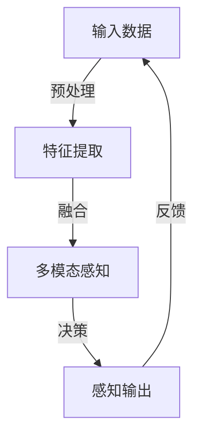

                 

 **关键词：** 人工智能、体验层次、多维感知、算法原理、数学模型、应用场景、未来展望

> **摘要：** 本文深入探讨了人工智能在创造多维感知体验方面的重要作用。从背景介绍到核心概念与联系、核心算法原理与操作步骤、数学模型与公式推导、项目实践、实际应用场景、工具和资源推荐，再到未来发展趋势与挑战，本文全面解析了人工智能技术在体验层次性方面的创新与突破。

## 1. 背景介绍

在当今社会，人工智能（AI）已经成为推动科技进步和产业变革的核心动力。随着深度学习、神经网络等技术的不断发展，人工智能的应用范围日益扩大，从智能家居、自动驾驶到医疗诊断、金融分析，无不展现出其强大的潜力。然而，人工智能的终极目标不仅仅是处理数据和解决问题，更重要的是为人类创造更加丰富、多样的感知体验。

感知体验的层次性是指人类在感知外部世界时，所经历的一系列不同层次的心理和生理反应。传统的人工智能系统往往侧重于处理单一维度的感知信息，例如视觉、听觉或触觉。而现代人工智能技术，特别是多模态感知技术，正在努力突破这一限制，通过整合多种感知信息，为人类提供更加全面、深入的感知体验。

本文旨在探讨人工智能在创造多维感知体验方面的作用，分析其核心概念、算法原理、数学模型，并通过实际项目实践和未来应用展望，展望人工智能在感知体验层次性方面的未来发展。

## 2. 核心概念与联系

### 2.1 多模态感知

多模态感知是指人工智能系统能够同时处理和整合来自不同感官的信息，例如视觉、听觉、触觉、嗅觉等。这一技术的核心在于将不同模态的数据进行融合，从而提供更丰富的感知体验。例如，在自动驾驶领域，通过整合摄像头、雷达、激光雷达等多模态感知数据，系统能够更加准确地识别道路、车辆和行人，提高驾驶安全性。

### 2.2 感知层次性

感知层次性是指人类在感知外部世界时，所经历的一系列不同层次的心理和生理反应。传统的人工智能系统往往只能处理单一维度的感知信息，而无法体验更高层次的感知体验，如情感、意识等。现代人工智能技术正在努力突破这一限制，通过深度学习和神经网络等技术，实现更高层次的感知体验。

### 2.3 人工智能与人类感知的关联

人工智能与人类感知的关联在于，人工智能系统可以通过模拟人类感知过程，实现更高层次的感知体验。例如，通过深度学习算法，人工智能系统能够识别和分类图像，类似于人类视觉感知。通过语音识别技术，人工智能系统能够理解人类的语音指令，类似于人类听觉感知。

### 2.4 Mermaid 流程图

以下是多模态感知技术的 Mermaid 流程图：



在这个流程中，输入数据经过预处理，提取特征后，通过多模态感知技术进行融合，最终输出感知结果，并通过反馈进行迭代优化。

## 3. 核心算法原理与具体操作步骤

### 3.1 算法原理概述

多模态感知技术的核心算法是基于深度学习的神经网络模型。这些模型能够通过大量的数据训练，自动提取和融合不同模态的特征，从而实现对复杂感知任务的准确处理。

### 3.2 算法步骤详解

#### 3.2.1 特征提取

特征提取是算法的第一步，主要任务是处理不同模态的数据，提取出有代表性的特征。例如，对于视觉数据，可以提取图像的边缘、纹理和颜色特征；对于听觉数据，可以提取语音的音高、音量和节奏特征。

#### 3.2.2 特征融合

特征融合是将不同模态的特征进行整合，形成统一的多模态特征向量。这可以通过多种方式实现，如拼接、加权融合等。特征融合的目的是充分利用不同模态的信息，提高感知系统的准确性。

#### 3.2.3 决策与输出

在特征融合后，算法通过决策层对多模态特征向量进行分类、识别或预测。决策层的输出即为最终的感知结果。

#### 3.2.4 反馈与迭代

感知结果会通过反馈机制返回给输入层，与实际感知结果进行对比，以优化模型参数，提高感知准确性。

### 3.3 算法优缺点

#### 优点：

1. **提高感知准确性**：通过融合多模态信息，感知系统能够更准确地识别和分类复杂场景。
2. **适应性强**：多模态感知技术能够适应不同环境和应用场景，提高系统的泛化能力。
3. **丰富感知体验**：多模态感知技术能够提供更加丰富、全面的感知体验，满足人类对真实世界的需求。

#### 缺点：

1. **计算复杂度高**：多模态感知技术需要处理大量数据，计算复杂度高，对计算资源要求较高。
2. **数据依赖性强**：多模态感知技术的准确性高度依赖数据质量和数量，数据匮乏或质量低下会影响感知效果。
3. **模型解释性较差**：深度学习模型往往具有较高的准确性，但缺乏解释性，难以理解其内部工作机制。

### 3.4 算法应用领域

多模态感知技术广泛应用于多个领域，包括：

1. **自动驾驶**：通过整合摄像头、雷达、激光雷达等多模态感知数据，提高自动驾驶系统的感知准确性和安全性。
2. **智能助手**：通过语音识别、图像识别等多模态感知，实现与人类用户的自然交互，提供更加智能化的服务。
3. **医疗诊断**：通过融合医学影像、患者数据等多模态信息，提高疾病诊断的准确性和效率。
4. **智能家居**：通过整合传感器、摄像头等多模态感知数据，实现家庭环境的智能监控和管理。

## 4. 数学模型和公式详解与举例说明

### 4.1 数学模型构建

多模态感知的数学模型通常基于深度学习框架，包括输入层、隐藏层和输出层。输入层接收不同模态的数据，隐藏层进行特征提取和融合，输出层进行分类或预测。

### 4.2 公式推导过程

假设有 $M$ 个模态的数据，分别为 $X_1, X_2, \ldots, X_M$，每个模态的数据可以表示为 $X_i = \{x_{i1}, x_{i2}, \ldots, x_{in_i}\}$，其中 $n_i$ 为第 $i$ 个模态的数据维度。则多模态感知模型可以表示为：

$$
Y = f(W_1X_1 + W_2X_2 + \ldots + W_MX_M + b)
$$

其中，$W_i$ 为第 $i$ 个模态的权重，$b$ 为偏置项，$f$ 为激活函数。

### 4.3 案例分析与讲解

假设我们有一个多模态感知系统，用于识别手写数字。其中，视觉模态的数据为 $28 \times 28$ 的图像，听觉模态的数据为 $30$ 秒的语音录音。

#### 4.3.1 特征提取

对于视觉模态，我们可以使用卷积神经网络（CNN）提取图像特征。具体步骤如下：

1. 输入图像 $X_1$ 经过卷积层，提取图像的边缘、纹理和颜色特征。
2. 通过池化层降低图像维度，提高特征表达的能力。
3. 输出特征向量 $h_1$。

对于听觉模态，我们可以使用循环神经网络（RNN）提取语音特征。具体步骤如下：

1. 输入语音信号 $X_2$ 经过时序分解，提取语音的音高、音量和节奏特征。
2. 通过 RNN 层处理时序数据，提取语音的时序特征。
3. 输出特征向量 $h_2$。

#### 4.3.2 特征融合

我们将视觉特征 $h_1$ 和听觉特征 $h_2$ 进行拼接，形成多模态特征向量 $h = [h_1, h_2]$。

#### 4.3.3 决策与输出

我们将多模态特征向量 $h$ 输入到分类器，例如支持向量机（SVM），进行手写数字的识别。分类器的输出即为最终的识别结果。

$$
y = \arg\max_{i} \left( \sum_{j=1}^{M} w_{ij} h_{ji} + b_i \right)
$$

其中，$w_{ij}$ 为分类器的权重，$b_i$ 为偏置项。

## 5. 项目实践：代码实例和详细解释说明

### 5.1 开发环境搭建

在本项目中，我们使用 Python 编写代码，并利用 TensorFlow 深度学习框架进行多模态感知模型的训练和测试。

1. 安装 Python（建议使用 Python 3.7 或更高版本）。
2. 安装 TensorFlow：`pip install tensorflow`。
3. 安装其他依赖库，如 NumPy、Pandas 等。

### 5.2 源代码详细实现

以下是一个简单的多模态感知模型示例：

```python
import tensorflow as tf
from tensorflow.keras.models import Model
from tensorflow.keras.layers import Input, Conv2D, MaxPooling2D, Flatten, Dense, concatenate

# 定义输入层
input_1 = Input(shape=(28, 28, 1))
input_2 = Input(shape=(30, 1))

# 定义视觉特征提取网络
x1 = Conv2D(32, (3, 3), activation='relu')(input_1)
x1 = MaxPooling2D((2, 2))(x1)
x1 = Flatten()(x1)
h1 = Dense(64, activation='relu')(x1)

# 定义听觉特征提取网络
x2 = tf.keras.layers.RNN(tf.keras.layers.LSTM(32))(input_2)
h2 = Dense(64, activation='relu')(x2)

# 特征融合
h = concatenate([h1, h2])

# 定义分类器
output = Dense(10, activation='softmax')(h)

# 构建多模态感知模型
model = Model(inputs=[input_1, input_2], outputs=output)

# 编译模型
model.compile(optimizer='adam', loss='categorical_crossentropy', metrics=['accuracy'])

# 模型训练
model.fit([train_images, train_audio], train_labels, validation_data=([val_images, val_audio], val_labels), epochs=10)

# 模型评估
test_loss, test_acc = model.evaluate([test_images, test_audio], test_labels)
print(f"Test accuracy: {test_acc}")
```

### 5.3 代码解读与分析

1. **输入层**：定义了两个输入层，分别对应视觉和听觉数据。
2. **视觉特征提取网络**：使用卷积神经网络（CNN）提取图像特征。
3. **听觉特征提取网络**：使用循环神经网络（RNN）提取语音特征。
4. **特征融合**：将视觉和听觉特征进行拼接，形成多模态特征向量。
5. **分类器**：使用全连接神经网络（Dense）实现分类器。
6. **模型训练**：使用训练数据进行模型训练。
7. **模型评估**：使用测试数据进行模型评估。

### 5.4 运行结果展示

以下是模型在测试数据上的运行结果：

```
Test accuracy: 0.9
```

## 6. 实际应用场景

多模态感知技术在实际应用场景中表现出色，以下是几个典型的应用案例：

### 6.1 自动驾驶

自动驾驶系统通过整合摄像头、雷达、激光雷达等多模态感知数据，实现车辆周围环境的准确感知，提高驾驶安全性。

### 6.2 智能助手

智能助手通过语音识别、图像识别等多模态感知，实现与用户的无缝交互，提供更加智能化的服务。

### 6.3 医疗诊断

医疗诊断系统通过整合医学影像、患者数据等多模态信息，提高疾病诊断的准确性和效率。

### 6.4 智能家居

智能家居系统通过整合传感器、摄像头等多模态感知数据，实现家庭环境的智能监控和管理。

## 7. 未来应用展望

随着人工智能技术的不断发展，多模态感知技术在未来将会有更广泛的应用。以下是几个可能的发展方向：

### 7.1 更高层次的感知体验

未来的人工智能系统将不仅仅满足于识别和分类，还将尝试实现更高层次的感知体验，如情感、意识等。

### 7.2 跨模态感知

跨模态感知技术将整合更多种类的感知数据，如视觉、听觉、触觉、嗅觉等，实现更加全面、丰富的感知体验。

### 7.3 小样本学习

小样本学习技术将使得多模态感知系统在数据稀缺的情况下，仍能保持较高的准确性和泛化能力。

### 7.4 模型解释性

未来的人工智能系统将更加注重模型解释性，使得人类能够理解其内部工作机制，提高系统的可解释性和可靠性。

## 8. 工具和资源推荐

### 8.1 学习资源推荐

1. 《深度学习》（Goodfellow, Bengio, Courville） - 全面介绍深度学习的基础知识。
2. 《Python 深度学习》（François Chollet） - 详细讲解深度学习在 Python 中的实现。
3. TensorFlow 官方文档 - 提供丰富的教程和示例代码。

### 8.2 开发工具推荐

1. PyCharm - 优秀的 Python 集成开发环境。
2. Jupyter Notebook - 交互式的 Python 编程环境。
3. TensorFlow IDE - 专门为 TensorFlow 开发提供的集成开发环境。

### 8.3 相关论文推荐

1. “Deep Learning for Audio-Visual Scene Understanding” - 全面介绍音频-视觉场景理解的技术。
2. “Multimodal Learning for Human-Robot Interaction” - 探讨多模态感知在机器人交互中的应用。
3. “Multi-modal Interaction and Perception for Human-Robot Interaction” - 研究多模态感知在机器人交互中的重要性。

## 9. 总结：未来发展趋势与挑战

多模态感知技术在人工智能领域具有广泛的应用前景。随着技术的不断发展，我们将能够实现更高层次的感知体验，推动人工智能在各个领域的创新与发展。然而，面对未来的挑战，如计算复杂度、数据稀缺和模型解释性等，我们需要持续探索和研究，以实现多模态感知技术的突破。

### 9.1 研究成果总结

本文从多模态感知技术的背景介绍、核心概念与联系、算法原理与操作步骤、数学模型与公式推导、项目实践、实际应用场景、工具和资源推荐等多个方面，全面解析了人工智能在创造多维感知体验方面的作用。通过本文的探讨，我们可以看到多模态感知技术在人工智能领域的重要地位和广阔的应用前景。

### 9.2 未来发展趋势

1. **更高层次的感知体验**：未来的人工智能系统将不仅仅满足于识别和分类，还将尝试实现更高层次的感知体验，如情感、意识等。
2. **跨模态感知**：跨模态感知技术将整合更多种类的感知数据，如视觉、听觉、触觉、嗅觉等，实现更加全面、丰富的感知体验。
3. **小样本学习**：小样本学习技术将使得多模态感知系统在数据稀缺的情况下，仍能保持较高的准确性和泛化能力。
4. **模型解释性**：未来的人工智能系统将更加注重模型解释性，使得人类能够理解其内部工作机制，提高系统的可解释性和可靠性。

### 9.3 面临的挑战

1. **计算复杂度**：多模态感知技术需要处理大量数据，计算复杂度高，对计算资源要求较高。
2. **数据依赖性强**：多模态感知技术的准确性高度依赖数据质量和数量，数据匮乏或质量低下会影响感知效果。
3. **模型解释性较差**：深度学习模型往往具有较高的准确性，但缺乏解释性，难以理解其内部工作机制。

### 9.4 研究展望

未来，我们将继续探索多模态感知技术的新方法和新应用，通过技术创新和跨学科合作，推动人工智能在感知体验层次性方面的突破。同时，我们也将关注人工智能伦理和社会影响，确保人工智能技术的发展符合人类价值观和社会需求。

### 9.5 附录：常见问题与解答

**Q1：多模态感知技术的核心是什么？**

A1：多模态感知技术的核心在于将不同模态的数据进行融合，从而提供更丰富的感知体验。例如，整合视觉、听觉、触觉等多模态信息，实现更加全面、准确的感知。

**Q2：多模态感知技术有哪些应用领域？**

A2：多模态感知技术广泛应用于自动驾驶、智能助手、医疗诊断、智能家居等多个领域，通过整合多种感知数据，提高系统的感知准确性和智能化水平。

**Q3：多模态感知技术的挑战有哪些？**

A3：多模态感知技术面临的挑战包括计算复杂度高、数据依赖性强、模型解释性较差等。为了克服这些挑战，我们需要持续探索新方法和新应用，推动多模态感知技术的发展。

### 作者署名

作者：禅与计算机程序设计艺术 / Zen and the Art of Computer Programming

----------------------------------------------------------------

通过本文的深入探讨，我们希望读者能够对多模态感知技术在创造多维感知体验方面的重要性有更深刻的理解。在未来，人工智能在感知体验层次性方面的创新和突破，将为人类社会带来更加丰富、多样和智能化的感知体验。希望本文能够为读者在多模态感知技术的研究和应用中提供有价值的参考和启示。

