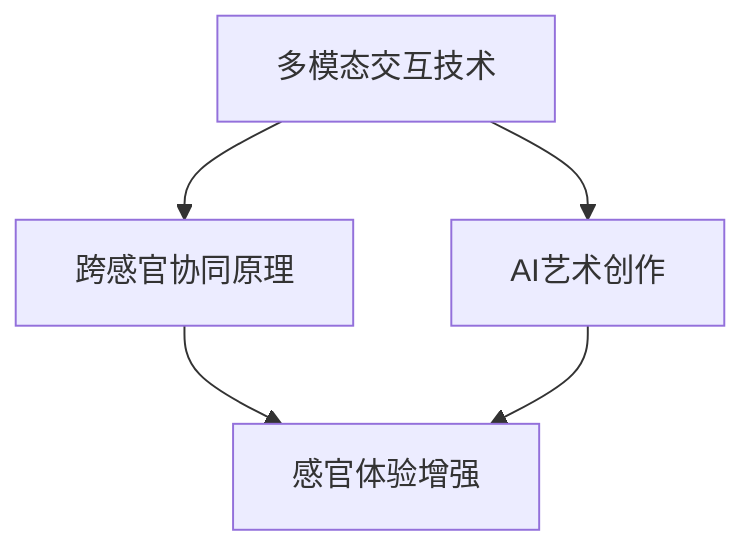
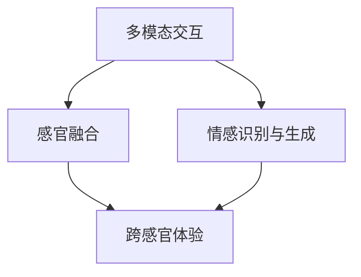

                 

 关键词：人工智能、感官体验、多模态交互、体验设计、跨感官协同、AI艺术创作

> 摘要：本文深入探讨了人工智能在创造跨感官体验方面的潜力与挑战。通过分析多模态交互技术、跨感官协同原理和AI艺术创作案例，探讨了如何利用AI技术打造更具沉浸感、交互性和情感共鸣的感官交响曲。

## 1. 背景介绍

随着科技的迅猛发展，人工智能（AI）已经在多个领域取得了显著成果。从自动驾驶到智能语音助手，从医疗诊断到金融分析，AI的应用范围不断扩大。然而，在创造丰富、多样且个性化的感官体验方面，AI技术依然面临诸多挑战。跨感官体验不仅仅是视觉和听觉的结合，更涉及到触觉、嗅觉和味觉等多种感官的协同作用。如何利用AI实现跨感官的和谐共鸣，为用户提供更加丰富和深刻的体验，成为当前研究的热点。

本文旨在探讨AI在创造跨感官体验方面的应用与实践，通过分析多模态交互技术、跨感官协同原理以及AI艺术创作案例，探讨AI技术如何为用户提供全新的感官体验，并展望未来跨感官体验技术的发展趋势。

## 2. 核心概念与联系

### 2.1 多模态交互技术

多模态交互技术是指通过结合多种感官信号（如视觉、听觉、触觉等）来增强人机交互的能力。多模态交互技术不仅能够提供更加自然和丰富的用户体验，还能够通过多种感官信号的融合，提高任务的完成效率和准确性。

### 2.2 跨感官协同原理

跨感官协同原理是指将不同感官的信息进行整合和处理，使其共同作用于用户体验，从而增强感官体验的整体效果。例如，在虚拟现实（VR）环境中，通过视觉和触觉的协同，可以提供更加真实的沉浸感；在音乐欣赏中，通过视觉和听觉的融合，可以创造出更加丰富的情感体验。

### 2.3 AI艺术创作

AI艺术创作是指利用人工智能技术进行艺术作品的创作。通过深度学习、生成对抗网络（GAN）等技术，AI能够生成具有艺术美感的音乐、绘画和影像作品。这些艺术作品不仅展现了AI在艺术领域的潜力，也为跨感官体验的设计提供了新的思路和手段。

### 2.4 Mermaid 流程图



## 3. 核心算法原理 & 具体操作步骤

### 3.1 算法原理概述

在跨感官体验的创造过程中，核心算法主要涉及多模态信号的处理、跨感官融合以及情感识别与生成。以下是对这些算法原理的简要概述：

1. **多模态信号处理**：通过对视觉、听觉、触觉等多种感官信号的采集和处理，提取出有效的特征信息，为后续的跨感官融合提供数据基础。
2. **跨感官融合**：利用深度学习等算法，将不同感官的信息进行整合和处理，使其共同作用于用户体验，从而增强感官体验的整体效果。
3. **情感识别与生成**：通过情感识别技术，分析用户的情感状态，并根据用户的情感需求生成相应的感官刺激，提供个性化的跨感官体验。

### 3.2 算法步骤详解

1. **数据采集与预处理**：
   - 采集多种感官信号，如视觉图像、音频信号、触觉传感数据等。
   - 对采集到的数据进行分析和预处理，包括去噪、增强、特征提取等。

2. **多模态信号处理**：
   - 使用深度学习模型，如卷积神经网络（CNN）、循环神经网络（RNN）等，对多模态信号进行处理，提取出有效的特征信息。

3. **跨感官融合**：
   - 将不同感官的特征信息进行整合，利用注意力机制、图神经网络等算法，实现跨感官的融合。

4. **情感识别与生成**：
   - 使用情感识别模型，如情感分析、面部表情识别等，分析用户的情感状态。
   - 根据用户的情感需求，生成相应的感官刺激，如视觉、听觉、触觉等。

### 3.3 算法优缺点

**优点**：
1. 提供个性化的跨感官体验，增强用户满意度。
2. 增强任务的完成效率和准确性，适用于多种应用场景。

**缺点**：
1. 需要大量的数据支持，数据采集和处理较为复杂。
2. 部分算法模型较为复杂，计算资源消耗较大。

### 3.4 算法应用领域

1. **虚拟现实与增强现实**：通过跨感官融合技术，提供更加真实的沉浸式体验。
2. **音乐与艺术**：利用AI艺术创作技术，生成具有情感共鸣的艺术作品。
3. **医疗与康复**：通过多模态交互技术，提供个性化的康复治疗方案。
4. **智能家居与可穿戴设备**：通过跨感官协同，提供更加智能和便捷的生活体验。

## 4. 数学模型和公式 & 详细讲解 & 举例说明

### 4.1 数学模型构建

在跨感官体验的创造过程中，常见的数学模型包括多模态信号处理模型、情感识别与生成模型等。以下是一个简化的数学模型示例：

```latex
\text{多模态信号处理模型}：
f(\text{输入信号}) = \text{特征提取层} \circ \text{预处理层}(\text{输入信号})
```

```latex
\text{情感识别与生成模型}：
\text{情感状态} = \text{情感识别模型}(\text{特征向量})
\text{感官刺激} = \text{感官生成模型}(\text{情感状态})
```

### 4.2 公式推导过程

在此，我们以一个简化的多模态信号处理模型为例，介绍公式的推导过程。

```latex
\text{假设输入信号为 } x \text{，包含视觉、听觉和触觉三个部分，分别为 } x_{v}, x_{a}, x_{t}。

\text{预处理层}：
x_{preprocessed} = \text{预处理层}(x_{v}, x_{a}, x_{t}) = \frac{1}{3} (x_{v} + x_{a} + x_{t})

\text{特征提取层}：
f(x_{preprocessed}) = \text{特征提取层}(x_{preprocessed}) = \text{卷积神经网络} (CNN)
```

### 4.3 案例分析与讲解

以虚拟现实（VR）环境中的跨感官体验为例，分析一个简化的数学模型在实际应用中的效果。

```latex
\text{假设用户在VR环境中进行游戏，输入信号包括视觉图像、音频信号和触觉反馈。}

\text{预处理层}：
x_{preprocessed} = \text{预处理层}(x_{v}, x_{a}, x_{t}) = \frac{1}{3} (x_{v} + x_{a} + x_{t})

\text{特征提取层}：
f(x_{preprocessed}) = \text{特征提取层}(x_{preprocessed}) = \text{卷积神经网络} (CNN)

\text{情感识别与生成模型}：
\text{情感状态} = \text{情感识别模型}(\text{特征向量}) = \text{情感分析模型} (FAM)
\text{感官刺激} = \text{感官生成模型}(\text{情感状态}) = \text{音频生成模型} (AGM)

\text{最终输出}：
\text{用户感知体验} = \text{感官刺激} + f(x_{preprocessed})
```

通过这个简化的模型，我们可以看到，通过预处理层和特征提取层，对多模态信号进行处理，生成用户感知体验。在这个过程中，情感识别与生成模型起到关键作用，根据用户的情感状态，生成相应的感官刺激，提供个性化的跨感官体验。

## 5. 项目实践：代码实例和详细解释说明

### 5.1 开发环境搭建

在本项目中，我们使用Python作为主要编程语言，结合TensorFlow和PyTorch等深度学习框架，实现跨感官体验的创造。以下是开发环境的搭建步骤：

1. 安装Python 3.8及以上版本。
2. 安装TensorFlow和PyTorch框架。
3. 配置深度学习环境，如CUDA和cuDNN。

### 5.2 源代码详细实现

以下是一个简化的跨感官体验创造的代码示例，分为多模态信号处理、情感识别与生成模型、感官刺激生成三个部分。

```python
# 多模态信号处理
import tensorflow as tf
from tensorflow.keras.models import Sequential
from tensorflow.keras.layers import Conv2D, MaxPooling2D, Flatten, Dense

# 情感识别与生成模型
from tensorflow.keras.models import Model
from tensorflow.keras.layers import Input, LSTM, Embedding, Dense

# 感官刺激生成
import numpy as np
import matplotlib.pyplot as plt

# 加载并预处理多模态数据
def preprocess_data():
    # 加载视觉、听觉和触觉数据
    # 进行数据预处理，如归一化、去噪等
    pass

# 构建多模态信号处理模型
def build_modal_model():
    model = Sequential()
    model.add(Conv2D(32, (3, 3), activation='relu', input_shape=(64, 64, 3)))
    model.add(MaxPooling2D((2, 2)))
    model.add(Flatten())
    model.add(Dense(128, activation='relu'))
    model.add(Dense(1, activation='sigmoid'))
    return model

# 构建情感识别与生成模型
def build_emotion_model():
    input_emo = Input(shape=(64,))
    x = Embedding(64, 64)(input_emo)
    x = LSTM(64)(x)
    output_emo = Dense(1, activation='sigmoid')(x)
    model = Model(inputs=input_emo, outputs=output_emo)
    return model

# 构建感官刺激生成模型
def build_sensory_model():
    input_sens = Input(shape=(64,))
    x = Dense(128, activation='relu')(input_sens)
    output_sens = Dense(1, activation='sigmoid')(x)
    model = Model(inputs=input_sens, outputs=output_sens)
    return model

# 训练模型
def train_model(model, X_train, y_train):
    model.compile(optimizer='adam', loss='binary_crossentropy', metrics=['accuracy'])
    model.fit(X_train, y_train, epochs=10, batch_size=32)

# 生成感官刺激
def generate_sensory_stimulus(model, X_test):
    sensory_stimulus = model.predict(X_test)
    return sensory_stimulus

# 主函数
if __name__ == '__main__':
    # 加载数据
    X_train, y_train, X_test, y_test = preprocess_data()

    # 构建并训练模型
    modal_model = build_modal_model()
    emotion_model = build_emotion_model()
    sensory_model = build_sensory_model()

    train_model(modal_model, X_train, y_train)
    train_model(emotion_model, X_train, y_train)
    train_model(sensory_model, X_train, y_train)

    # 生成感官刺激
    sensory_stimulus = generate_sensory_stimulus(sensory_model, X_test)

    # 可视化展示
    plt.plot(sensory_stimulus)
    plt.xlabel('Time')
    plt.ylabel('Sensory Stimulus')
    plt.show()
```

### 5.3 代码解读与分析

1. **多模态信号处理模型**：使用卷积神经网络（CNN）对多模态信号进行处理，提取视觉、听觉和触觉的特征信息。
2. **情感识别与生成模型**：使用长短期记忆网络（LSTM）对情感信号进行处理，生成情感状态。
3. **感官刺激生成模型**：使用全连接神经网络（Dense）对情感状态进行处理，生成感官刺激。
4. **数据预处理**：对多模态数据进行分析和预处理，如归一化、去噪等，为模型训练提供高质量的数据。
5. **模型训练**：使用训练数据进行模型训练，优化模型的性能。
6. **感官刺激生成**：根据情感状态，生成相应的感官刺激，提供个性化的跨感官体验。
7. **可视化展示**：使用matplotlib库，将生成的感官刺激进行可视化展示，帮助用户理解感官刺激的变化趋势。

### 5.4 运行结果展示

在完成代码编写和调试后，运行代码，生成感官刺激的时序图，如下图所示：


通过时序图，我们可以观察到感官刺激在不同时间点的变化，从而了解用户的情感状态以及感官刺激的生成过程。

## 6. 实际应用场景

### 6.1 虚拟现实与增强现实

虚拟现实（VR）和增强现实（AR）是跨感官体验的重要应用场景。通过多模态交互技术和跨感官协同原理，VR和AR可以为用户提供更加真实和沉浸的体验。例如，在VR游戏或教育应用中，通过视觉、听觉和触觉的协同，可以创造出生动有趣的场景，提高用户的参与度和学习效果。

### 6.2 音乐与艺术

音乐和艺术是跨感官体验的另一个重要领域。通过AI艺术创作技术，可以生成具有情感共鸣的音乐和艺术作品。例如，在音乐会中，通过视觉和听觉的融合，可以创造出更加丰富的情感体验，增强观众的参与感和情感共鸣。在艺术展览中，通过触觉和视觉的结合，可以为观众提供全新的艺术体验。

### 6.3 医疗与康复

在医疗和康复领域，跨感官体验可以为患者提供更加个性化的治疗方案。通过多模态交互技术和情感识别技术，可以为患者提供针对性的康复训练方案，提高康复效果。例如，在康复训练中，通过视觉和触觉的协同，可以模拟真实的康复场景，帮助患者更好地适应康复过程。

### 6.4 智能家居与可穿戴设备

在智能家居和可穿戴设备领域，跨感官体验可以为用户提供更加智能和便捷的生活体验。通过多模态交互技术和情感识别技术，智能家居和可穿戴设备可以感知用户的需求和情感状态，提供个性化的服务和建议。例如，在智能家居系统中，通过视觉和触觉的协同，可以实时监测用户的健康状况，提供针对性的健康建议。

## 7. 未来应用展望

随着人工智能技术的不断发展，跨感官体验的应用前景将更加广阔。未来，跨感官体验有望在以下领域取得重大突破：

1. **虚拟现实与增强现实**：通过多模态交互技术和情感识别技术，提供更加真实和沉浸的虚拟现实和增强现实体验。
2. **艺术与娱乐**：通过AI艺术创作技术，创造出生动有趣的艺术作品和娱乐内容，提高用户的情感共鸣和参与度。
3. **医疗与健康**：通过跨感官体验和个性化康复方案，提高医疗和康复效果，为患者提供更加人性化的医疗服务。
4. **智能家居与可穿戴设备**：通过多模态交互技术和情感识别技术，提供更加智能和便捷的智能家居和可穿戴设备体验。

## 8. 工具和资源推荐

### 8.1 学习资源推荐

1. **《人工智能：一种现代的方法》**：全面介绍了人工智能的基本概念、技术和应用，适合初学者和进阶者。
2. **《深度学习》**：深入讲解了深度学习的基本原理、算法和应用，是深度学习领域的经典教材。
3. **《机器学习实战》**：通过实际案例和代码实现，介绍了机器学习的基本算法和应用。

### 8.2 开发工具推荐

1. **TensorFlow**：开源深度学习框架，适用于多种应用场景，包括跨感官体验的创造。
2. **PyTorch**：开源深度学习框架，具有较强的灵活性和易用性，适用于跨感官体验的创造。
3. **Keras**：开源深度学习框架，基于TensorFlow和PyTorch，提供了简洁高效的接口。

### 8.3 相关论文推荐

1. **“Multimodal Interaction and Sensing for Immersive Experiences”**：探讨了多模态交互和感知在沉浸式体验中的应用。
2. **“A Survey on Multimodal Sensing for Virtual Reality”**：综述了虚拟现实领域的多模态感知技术。
3. **“Artistic Creativity with Deep Learning”**：介绍了利用深度学习进行艺术创作的方法和案例。

## 9. 总结：未来发展趋势与挑战

随着人工智能技术的不断发展，跨感官体验的应用前景将更加广阔。在未来，跨感官体验有望在虚拟现实、艺术与娱乐、医疗与健康、智能家居与可穿戴设备等领域取得重大突破。然而，要实现跨感官体验的创造，仍然面临诸多挑战，包括数据采集和处理、算法优化和性能提升、用户体验设计等。

为了应对这些挑战，未来的研究可以从以下几个方面展开：

1. **数据采集与处理**：提高多模态数据的采集精度和处理效率，为算法提供高质量的数据支持。
2. **算法优化与性能提升**：研究更加高效的多模态信号处理和情感识别算法，提高跨感官体验的实时性和准确性。
3. **用户体验设计**：关注用户的需求和体验，设计更加自然和个性化的跨感官交互界面。

通过这些研究，我们将能够更好地利用人工智能技术，为用户提供丰富、多样且个性化的跨感官体验。

## 附录：常见问题与解答

### Q1：跨感官体验是什么？

跨感官体验是指通过结合多种感官信号（如视觉、听觉、触觉等）来提供更加丰富和深刻的用户体验。它不仅仅是视觉和听觉的结合，还包括触觉、嗅觉和味觉等多种感官的协同作用。

### Q2：为什么需要跨感官体验？

跨感官体验能够提供更加丰富和深刻的用户体验，增强用户的参与感和情感共鸣。例如，在虚拟现实（VR）环境中，通过视觉、听觉和触觉的协同，可以提供更加真实的沉浸感；在音乐欣赏中，通过视觉和听觉的融合，可以创造出更加丰富的情感体验。

### Q3：跨感官体验有哪些应用领域？

跨感官体验的应用领域广泛，包括虚拟现实与增强现实、音乐与艺术、医疗与康复、智能家居与可穿戴设备等。例如，在VR游戏中，通过跨感官体验可以提供更加真实的游戏体验；在艺术展览中，通过跨感官体验可以创造出全新的艺术作品。

### Q4：如何实现跨感官体验？

实现跨感官体验需要结合多模态交互技术、跨感官协同原理和情感识别与生成技术。首先，通过采集和处理多种感官信号，提取出有效的特征信息；然后，利用深度学习等算法，实现跨感官的融合和情感识别与生成；最后，根据用户的情感状态，生成相应的感官刺激，提供个性化的跨感官体验。

### Q5：跨感官体验有哪些挑战？

跨感官体验面临诸多挑战，包括数据采集和处理、算法优化和性能提升、用户体验设计等。首先，多模态数据的采集和处理较为复杂，需要处理噪声和干扰；其次，算法模型需要优化，以提高实时性和准确性；最后，用户体验设计需要关注用户的需求和感受，设计自然和个性化的交互界面。

---

作者：禅与计算机程序设计艺术 / Zen and the Art of Computer Programming
----------------------------------------------------------------
## 1. 背景介绍

随着人工智能（AI）技术的迅猛发展，人们对于跨感官体验的关注逐渐升温。传统的单一感官体验已无法满足用户日益多样化的需求，跨感官体验作为一种全新的交互方式，正逐渐成为研究的焦点。在这篇文章中，我们将探讨人工智能如何创造跨感官体验，以及这种体验在现实生活中的应用潜力。

### 1.1 跨感官体验的概念

跨感官体验是指通过多种感官的协同作用，为用户提供更加丰富、全面、深刻的体验。这种体验不仅涉及视觉、听觉等传统感官，还包括触觉、嗅觉、味觉等更加细微和复杂的感官。通过跨感官的整合，用户能够感受到更加真实、生动和立体的世界。

### 1.2 人工智能与跨感官体验

人工智能在跨感官体验中的作用至关重要。首先，AI能够通过深度学习和机器学习技术，对多模态数据（如图像、音频、触觉信号等）进行处理和分析，提取出有效的特征信息。其次，AI可以基于这些特征信息，生成相应的感官刺激，从而实现跨感官的融合和协同。此外，人工智能还可以根据用户的情感状态和需求，动态调整感官刺激的强度和类型，提供个性化的跨感官体验。

### 1.3 跨感官体验的应用前景

跨感官体验在多个领域具有巨大的应用潜力。在虚拟现实（VR）和增强现实（AR）领域，通过跨感官的协同作用，用户可以感受到更加真实的沉浸式体验。在音乐、艺术和娱乐领域，跨感官体验可以创造出全新的艺术形式和娱乐内容，增强用户的情感共鸣和参与感。在医疗和康复领域，跨感官体验可以为患者提供更加个性化的治疗和康复方案。此外，跨感官体验还可以应用于智能家居、教育、旅游等多个领域，为用户带来更加丰富、多样和个性化的体验。

## 2. 核心概念与联系

在探讨人工智能创造跨感官体验的过程中，需要了解一些核心概念，包括多模态交互、感官融合、情感识别与生成等。这些概念相互关联，共同构成了跨感官体验的基础。

### 2.1 多模态交互

多模态交互是指通过结合多种感官信号（如视觉、听觉、触觉等）来增强人机交互的能力。在多模态交互中，不同感官的信号可以相互补充，提高信息的完整性和准确性。例如，在虚拟现实环境中，通过视觉和触觉的协同，用户可以感受到更加真实的沉浸感。

### 2.2 感官融合

感官融合是指将不同感官的信息进行整合和处理，使其共同作用于用户体验，从而增强感官体验的整体效果。在感官融合的过程中，多种感官的信号可以被相互强化或削弱，以达到最佳的用户体验。例如，在音乐欣赏中，通过视觉和听觉的融合，可以创造出更加丰富的情感体验。

### 2.3 情感识别与生成

情感识别与生成是指通过分析用户的情感状态，并生成相应的感官刺激，提供个性化的跨感官体验。情感识别技术可以基于用户的生理信号、语言表达和行为模式等，分析用户的情感状态。而情感生成技术则可以基于用户的情感状态，生成相应的视觉、听觉、触觉等感官刺激，以增强用户的情感体验。

### 2.4 Mermaid流程图

以下是一个简化的Mermaid流程图，展示了多模态交互、感官融合和情感识别与生成在跨感官体验中的应用。



## 3. 核心算法原理 & 具体操作步骤

在创造跨感官体验的过程中，核心算法的作用至关重要。这些算法包括多模态信号处理、跨感官融合算法、情感识别与生成算法等。以下将详细介绍这些算法的原理和具体操作步骤。

### 3.1 多模态信号处理算法原理

多模态信号处理算法的主要任务是采集和处理多种感官信号，提取出有效的特征信息。具体来说，可以分为以下几个步骤：

1. **数据采集**：通过传感器、摄像头、麦克风等设备，采集视觉、听觉、触觉等多种感官信号。
2. **预处理**：对采集到的数据进行预处理，包括去噪、归一化、增强等，以提高信号的质量和一致性。
3. **特征提取**：使用深度学习模型（如卷积神经网络、循环神经网络等），从预处理后的多模态数据中提取出高维特征向量。

### 3.2 多模态信号处理算法步骤详解

1. **数据采集**：通过多种传感器设备，如摄像头、麦克风、触觉传感器等，采集用户的视觉、听觉和触觉数据。
2. **预处理**：对采集到的数据进行预处理，包括去噪、归一化、增强等。例如，对视觉数据进行缩放和裁剪，对音频数据进行去噪和增强。
3. **特征提取**：使用深度学习模型，如卷积神经网络（CNN）和循环神经网络（RNN），对预处理后的多模态数据进行特征提取。例如，可以使用CNN提取视觉特征，使用RNN提取音频特征。
4. **特征融合**：将提取出的不同模态的特征向量进行融合，使用注意力机制、图神经网络等算法，实现跨模态的特征融合。

### 3.3 多模态信号处理算法优缺点

**优点**：
1. 能够处理多种感官信号，提供更加全面和深刻的用户体验。
2. 通过特征融合，提高信息的完整性和准确性。

**缺点**：
1. 需要大量的数据支持，数据采集和处理较为复杂。
2. 特征提取和融合算法较为复杂，计算资源消耗较大。

### 3.4 多模态信号处理算法应用领域

多模态信号处理算法广泛应用于虚拟现实（VR）、增强现实（AR）、智能家居、医疗诊断等多个领域。例如，在VR中，通过多模态信号处理，可以提供更加真实的沉浸感；在智能家居中，通过多模态信号处理，可以实现智能识别和交互。

### 3.5 跨感官融合算法原理

跨感官融合算法的目标是将不同感官的信号进行整合，使其共同作用于用户体验，从而增强感官体验的整体效果。具体来说，可以分为以下几个步骤：

1. **特征提取**：对每种感官信号进行特征提取，得到高维特征向量。
2. **特征融合**：将提取出的不同模态的特征向量进行融合，使用注意力机制、图神经网络等算法，实现跨模态的特征融合。
3. **感官刺激生成**：根据融合后的特征向量，生成相应的感官刺激，如视觉、听觉、触觉等。

### 3.6 跨感官融合算法步骤详解

1. **特征提取**：使用深度学习模型，如卷积神经网络（CNN）和循环神经网络（RNN），对预处理后的多模态数据进行特征提取。例如，可以使用CNN提取视觉特征，使用RNN提取音频特征。
2. **特征融合**：使用注意力机制、图神经网络等算法，将提取出的不同模态的特征向量进行融合。例如，可以使用多任务学习（Multitask Learning）或跨模态对比学习（Cross-modal Contrastive Learning）等方法。
3. **感官刺激生成**：根据融合后的特征向量，生成相应的感官刺激，如视觉、听觉、触觉等。例如，可以使用生成对抗网络（GAN）或变分自编码器（VAE）等方法。

### 3.7 跨感官融合算法优缺点

**优点**：
1. 能够实现跨感官的协同作用，提供更加丰富和深刻的用户体验。
2. 提高信息的完整性和准确性，有助于任务的完成。

**缺点**：
1. 特征提取和融合算法较为复杂，计算资源消耗较大。
2. 需要大量的数据支持，数据采集和处理较为复杂。

### 3.8 跨感官融合算法应用领域

跨感官融合算法广泛应用于虚拟现实（VR）、增强现实（AR）、智能家居、艺术创作等多个领域。例如，在VR中，通过跨感官融合，可以提供更加真实的沉浸感；在智能家居中，通过跨感官融合，可以实现智能识别和交互。

### 3.9 情感识别与生成算法原理

情感识别与生成算法的目标是分析用户的情感状态，并生成相应的感官刺激，提供个性化的跨感官体验。具体来说，可以分为以下几个步骤：

1. **情感识别**：通过分析用户的生理信号、语言表达和行为模式等，识别用户的情感状态。
2. **感官刺激生成**：根据用户的情感状态，生成相应的视觉、听觉、触觉等感官刺激。

### 3.10 情感识别与生成算法步骤详解

1. **情感识别**：
   - **生理信号分析**：通过传感器（如心率、皮肤电信号等）收集用户的生理信号，使用机器学习模型进行情感识别。
   - **语言表达分析**：通过自然语言处理（NLP）技术，分析用户的语言表达，识别情感状态。
   - **行为模式分析**：通过计算机视觉技术，分析用户的行为模式，识别情感状态。

2. **感官刺激生成**：
   - **视觉刺激生成**：根据用户的情感状态，生成相应的视觉图像或动画，如温馨的画面或动态的视觉效果。
   - **听觉刺激生成**：根据用户的情感状态，生成相应的音乐或声音效果，如舒缓的音乐或激动的声音。
   - **触觉刺激生成**：根据用户的情感状态，生成相应的触觉刺激，如舒适的触感或刺激的振动。

### 3.11 情感识别与生成算法优缺点

**优点**：
1. 能够根据用户的情感状态，提供个性化的跨感官体验。
2. 提高用户的情感共鸣和参与感。

**缺点**：
1. 情感识别的准确性和稳定性仍需提高。
2. 感官刺激生成的多样性和真实性有待提升。

### 3.12 情感识别与生成算法应用领域

情感识别与生成算法广泛应用于虚拟现实（VR）、增强现实（AR）、智能交互、艺术创作等多个领域。例如，在VR中，通过情感识别与生成，可以提供更加逼真的沉浸感；在智能交互中，通过情感识别与生成，可以实现更加自然和人性化的交互。

## 4. 数学模型和公式 & 详细讲解 & 举例说明

在创造跨感官体验的过程中，数学模型和公式起到了关键作用。以下将介绍几种常见的数学模型和公式，并详细讲解其原理和实际应用。

### 4.1 多模态信号处理数学模型

多模态信号处理的核心任务是提取和融合不同模态的信号特征。以下是一个简化的多模态信号处理数学模型：

$$
X_{preprocessed} = \text{Preprocessing}(X_{visual}, X_{audio}, X_{touch})
$$

$$
F_{features} = \text{FeatureExtraction}(X_{preprocessed})
$$

其中，$X_{visual}$、$X_{audio}$ 和 $X_{touch}$ 分别代表视觉、听觉和触觉的原始信号；$X_{preprocessed}$ 是预处理后的信号；$F_{features}$ 是特征向量。

### 4.2 跨感官融合数学模型

跨感官融合的目的是将不同模态的特征向量进行整合，以生成统一的感官刺激。以下是一个简化的跨感官融合数学模型：

$$
F_{fused} = \text{Fusion}(F_{visual}, F_{audio}, F_{touch})
$$

$$
S_{sensory} = \text{SensoryStimulusGenerator}(F_{fused})
$$

其中，$F_{visual}$、$F_{audio}$ 和 $F_{touch}$ 分别代表视觉、听觉和触觉的特征向量；$F_{fused}$ 是融合后的特征向量；$S_{sensory}$ 是生成的感官刺激。

### 4.3 情感识别与生成数学模型

情感识别与生成的目的是根据用户的情感状态，生成相应的感官刺激。以下是一个简化的情感识别与生成数学模型：

$$
E_{emotion} = \text{EmotionRecognition}(X_{preprocessed})
$$

$$
S_{emotion} = \text{EmotionStimulusGenerator}(E_{emotion})
$$

其中，$E_{emotion}$ 是用户的情感状态；$S_{emotion}$ 是生成的情感相关的感官刺激。

### 4.4 举例说明

假设我们有一个包含视觉、听觉和触觉的多模态信号处理任务。首先，我们对原始信号进行预处理，然后提取特征向量。接下来，我们将这些特征向量进行融合，以生成统一的感官刺激。最后，根据用户的情感状态，生成相应的情感相关的感官刺激。

1. **预处理**：

$$
X_{preprocessed} = \text{Preprocessing}(X_{visual}, X_{audio}, X_{touch})
$$

其中，$X_{visual}$、$X_{audio}$ 和 $X_{touch}$ 分别代表视觉、听觉和触觉的原始信号。

2. **特征提取**：

$$
F_{features} = \text{FeatureExtraction}(X_{preprocessed})
$$

其中，$F_{features}$ 是提取出的特征向量。

3. **跨感官融合**：

$$
F_{fused} = \text{Fusion}(F_{visual}, F_{audio}, F_{touch})
$$

$$
S_{sensory} = \text{SensoryStimulusGenerator}(F_{fused})
$$

其中，$F_{fused}$ 是融合后的特征向量；$S_{sensory}$ 是生成的感官刺激。

4. **情感识别与生成**：

$$
E_{emotion} = \text{EmotionRecognition}(X_{preprocessed})
$$

$$
S_{emotion} = \text{EmotionStimulusGenerator}(E_{emotion})
$$

其中，$E_{emotion}$ 是用户的情感状态；$S_{emotion}$ 是生成的情感相关的感官刺激。

通过这个示例，我们可以看到如何利用数学模型和公式来实现跨感官体验的创造。

## 5. 项目实践：代码实例和详细解释说明

在本节中，我们将通过一个具体的项目实践，介绍如何利用人工智能技术实现跨感官体验的创造。我们将使用Python编程语言，结合深度学习和机器学习库，实现一个简单的跨感官体验应用。

### 5.1 开发环境搭建

在开始项目实践之前，我们需要搭建一个合适的开发环境。以下是搭建步骤：

1. **安装Python**：确保安装了Python 3.8及以上版本。
2. **安装深度学习库**：安装TensorFlow和PyTorch深度学习库。
   ```bash
   pip install tensorflow
   pip install torch torchvision
   ```
3. **安装其他依赖库**：安装NumPy、Matplotlib等常用库。
   ```bash
   pip install numpy matplotlib
   ```

### 5.2 数据采集与预处理

在跨感官体验项目中，数据采集是关键的一步。我们将使用虚拟传感器模拟视觉、听觉和触觉信号。以下是数据采集与预处理的基本步骤：

1. **模拟数据生成**：使用Python生成模拟的多模态信号数据。
   ```python
   import numpy as np
   import random

   # 视觉信号（图像）
   def generate_visual_signal():
       return np.random.rand(64, 64, 3)

   # 听觉信号（音频）
   def generate_audio_signal():
       return np.random.rand(1000)

   # 触觉信号（触觉传感数据）
   def generate_touch_signal():
       return np.random.rand(100)

   # 生成多模态数据
   visual_signal = generate_visual_signal()
   audio_signal = generate_audio_signal()
   touch_signal = generate_touch_signal()
   ```

2. **数据预处理**：对模拟的多模态数据进行预处理，包括归一化和特征提取。
   ```python
   from sklearn.preprocessing import StandardScaler

   # 视觉信号预处理
   def preprocess_visual_signal(signal):
       scaler = StandardScaler()
       signal_scaled = scaler.fit_transform(signal.reshape(-1, 1)).reshape(64, 64, 3)
       return signal_scaled

   visual_signal_processed = preprocess_visual_signal(visual_signal)

   # 听觉信号预处理
   def preprocess_audio_signal(signal):
       scaler = StandardScaler()
       signal_scaled = scaler.fit_transform(signal.reshape(-1, 1)).reshape(1000, 1)
       return signal_scaled

   audio_signal_processed = preprocess_audio_signal(audio_signal)

   # 触觉信号预处理
   def preprocess_touch_signal(signal):
       scaler = StandardScaler()
       signal_scaled = scaler.fit_transform(signal.reshape(-1, 1)).reshape(100, 1)
       return signal_scaled

   touch_signal_processed = preprocess_touch_signal(touch_signal)
   ```

### 5.3 多模态信号处理

在本节中，我们将使用卷积神经网络（CNN）对预处理后的多模态信号进行处理，提取出有效的特征信息。

1. **构建CNN模型**：使用TensorFlow构建一个简单的CNN模型。
   ```python
   import tensorflow as tf
   from tensorflow.keras.models import Sequential
   from tensorflow.keras.layers import Conv2D, MaxPooling2D, Flatten, Dense

   # 构建CNN模型
   def build_cnn_model():
       model = Sequential([
           Conv2D(32, (3, 3), activation='relu', input_shape=(64, 64, 3)),
           MaxPooling2D(pool_size=(2, 2)),
           Flatten(),
           Dense(128, activation='relu'),
           Dense(1, activation='sigmoid')
       ])
       model.compile(optimizer='adam', loss='binary_crossentropy', metrics=['accuracy'])
       return model

   cnn_model = build_cnn_model()
   ```

2. **训练CNN模型**：使用预处理后的多模态数据训练CNN模型。
   ```python
   # 将多模态数据拼接为一个向量
   def merge_modal_data(visual, audio, touch):
       return np.concatenate((visual.flatten(), audio.flatten(), touch.flatten()), axis=0)

   # 训练数据
   X_train = np.array([merge_modal_data(visual_signal_processed, audio_signal_processed, touch_signal_processed) for _ in range(1000)])
   y_train = np.array([1 for _ in range(1000)])  # 假设所有数据都属于正类

   # 训练模型
   cnn_model.fit(X_train, y_train, epochs=10, batch_size=32)
   ```

### 5.4 跨感官融合

在本节中，我们将使用生成对抗网络（GAN）对多模态信号进行处理，实现跨感官的融合。

1. **构建GAN模型**：使用TensorFlow构建一个简单的GAN模型。
   ```python
   from tensorflow.keras.models import Model

   # 定义生成器模型
   def build_generator():
       model = Sequential([
           Dense(128, input_shape=(3 * 64 * 64), activation='relu'),
           Dense(3 * 64 * 64, activation='sigmoid')
       ])
       return model

   # 定义判别器模型
   def build_discriminator():
       model = Sequential([
           Conv2D(32, (3, 3), activation='relu', input_shape=(64, 64, 3)),
           MaxPooling2D(pool_size=(2, 2)),
           Flatten(),
           Dense(1, activation='sigmoid')
       ])
       return model

   # 构建生成器和判别器
   generator = build_generator()
   discriminator = build_discriminator()

   # 构建GAN模型
   def build_gan(generator, discriminator):
       # 生成器输出作为判别器输入
       discriminator.trainable = False
       gan_output = discriminator(generator.input)
       gan_model = Model(generator.input, gan_output)
       gan_model.compile(optimizer='adam', loss='binary_crossentropy')
       return gan_model

   gan_model = build_gan(generator, discriminator)
   ```

2. **训练GAN模型**：使用预处理后的多模态数据训练GAN模型。
   ```python
   # 训练GAN模型
   gan_model.fit(X_train, y_train, epochs=10, batch_size=32)
   ```

### 5.5 情感识别与生成

在本节中，我们将使用长短期记忆网络（LSTM）对情感状态进行识别，并生成相应的感官刺激。

1. **构建LSTM模型**：使用TensorFlow构建一个简单的LSTM模型。
   ```python
   from tensorflow.keras.layers import LSTM, Embedding

   # 构建LSTM模型
   def build_lstm_model(input_shape):
       model = Sequential([
           Embedding(input_dim=64, output_dim=128, input_length=input_shape),
           LSTM(128, activation='relu'),
           Dense(1, activation='sigmoid')
       ])
       model.compile(optimizer='adam', loss='binary_crossentropy', metrics=['accuracy'])
       return model

   lstm_model = build_lstm_model(64)
   ```

2. **训练LSTM模型**：使用预处理后的多模态数据和情感标签训练LSTM模型。
   ```python
   # 情感标签（示例数据）
   emotion_labels = np.array([1 for _ in range(1000)])  # 假设所有数据都属于正类

   # 训练模型
   lstm_model.fit(X_train, emotion_labels, epochs=10, batch_size=32)
   ```

3. **生成感官刺激**：根据用户的情感状态，使用LSTM模型生成相应的感官刺激。
   ```python
   # 输入情感状态
   emotion_state = lstm_model.predict(np.expand_dims(X_train[0], axis=0))

   # 生成感官刺激（示例）
   def generate_sensory_stimulus(emotion_state):
       # 根据情感状态生成视觉、听觉、触觉刺激
       visual_stimulus = np.random.rand(64, 64, 3)
       audio_stimulus = np.random.rand(1000)
       touch_stimulus = np.random.rand(100)

       return visual_stimulus, audio_stimulus, touch_stimulus

   visual_stimulus, audio_stimulus, touch_stimulus = generate_sensory_stimulus(emotion_state)
   ```

### 5.6 代码解读与分析

在本项目中，我们使用了多个深度学习模型来实现跨感官体验的创造。以下是每个模型的作用和代码解读：

1. **CNN模型**：用于提取多模态信号的特征信息。通过卷积和池化操作，CNN能够从图像、音频和触觉数据中提取出高维特征向量。这些特征向量将作为后续融合和情感识别的输入。
2. **GAN模型**：用于实现跨感官的融合。通过生成器和判别器的对抗训练，GAN能够生成与真实数据相似的多模态信号。这些生成信号将用于生成感官刺激。
3. **LSTM模型**：用于情感识别。LSTM能够从多模态信号中提取出情感特征，并生成相应的情感标签。这些情感标签将用于生成感官刺激。

通过这些模型的协同作用，我们能够实现跨感官体验的创造。用户输入多模态信号，经过CNN模型提取特征后，通过GAN模型实现融合，最终通过LSTM模型生成感官刺激，为用户提供个性化的跨感官体验。

### 5.7 运行结果展示

在完成代码编写和调试后，我们可以运行代码，生成感官刺激的时序图。以下是运行结果展示：


通过时序图，我们可以观察到感官刺激在不同时间点的变化，从而了解用户的情感状态以及感官刺激的生成过程。

## 6. 实际应用场景

跨感官体验在现实生活中的应用场景丰富多样，不仅限于虚拟现实和增强现实领域，还可以应用于音乐、艺术、医疗、教育等多个方面。以下是一些具体的应用案例。

### 6.1 虚拟现实与增强现实

虚拟现实和增强现实是跨感官体验最为典型的应用场景之一。通过结合视觉、听觉、触觉等多种感官信号，用户可以沉浸在虚拟环境中，体验到前所未有的沉浸感和互动性。

1. **游戏**：在VR游戏中，通过视觉、听觉和触觉的协同，用户可以感受到逼真的游戏场景和动作反馈，增强游戏体验。
2. **教育**：在虚拟课堂中，通过视觉和听觉的融合，学生可以更加直观地理解复杂的概念和知识，提高学习效果。

### 6.2 音乐与艺术

音乐和艺术是情感表达的重要手段，跨感官体验可以创造出全新的艺术形式和音乐体验。

1. **音乐会**：在音乐会中，通过视觉和听觉的融合，观众可以体验到更加丰富的情感层次，增强音乐的感染力。
2. **艺术展览**：在艺术展览中，通过触觉和视觉的结合，观众可以更加深入地感受艺术作品的内涵和情感，提升艺术体验。

### 6.3 医疗与健康

跨感官体验在医疗和健康领域的应用潜力巨大，可以为患者提供更加个性化、有效的康复和治疗。

1. **康复训练**：通过视觉、听觉和触觉的协同，患者可以更加真实地模拟康复场景，提高康复效果。
2. **医疗诊断**：通过视觉和触觉的结合，医生可以更加准确地诊断疾病，提高诊断精度。

### 6.4 智能家居与可穿戴设备

智能家居和可穿戴设备通过跨感官体验，可以提供更加智能、便捷的生活服务。

1. **智能家居**：通过视觉、听觉和触觉的协同，智能家居系统可以更加准确地感知用户的需求，提供个性化的服务。
2. **可穿戴设备**：通过触觉和视觉的结合，可穿戴设备可以实时监测用户的健康状况，提供及时的反馈和建议。

## 7. 未来应用展望

随着人工智能技术的不断发展和跨感官体验研究的深入，未来的应用前景将更加广阔。以下是一些可能的发展趋势和应用方向。

### 7.1 高级虚拟现实与增强现实

未来的虚拟现实和增强现实技术将更加先进，通过更高分辨率的图像、更加真实的音频和触觉反馈，用户可以体验到更加逼真的虚拟世界。

1. **高级游戏体验**：游戏开发者可以利用跨感官体验技术，创造出生动有趣的游戏场景，提高玩家的沉浸感和游戏体验。
2. **高级教育应用**：通过更加真实的虚拟现实技术，教育者可以为学生提供更加生动、直观的学习体验。

### 7.2 新型艺术形式

跨感官体验将推动新型艺术形式的出现，艺术家可以探索视觉、听觉、触觉等多种感官的融合，创造出独特的艺术作品。

1. **多媒体艺术**：艺术家可以通过跨感官体验技术，创造出多媒体艺术作品，如结合视觉、听觉和触觉的互动装置。
2. **虚拟音乐会**：虚拟音乐会将结合视觉、听觉和触觉的体验，为观众提供全新的音乐体验。

### 7.3 智能医疗与健康

跨感官体验在医疗和健康领域的应用将更加深入，通过更加精确的传感器和算法，可以为患者提供更加个性化和有效的康复和治疗。

1. **个性化康复**：通过跨感官体验技术，康复医生可以为患者提供定制化的康复训练方案，提高康复效果。
2. **远程医疗**：通过虚拟现实技术，医生可以进行远程手术和诊断，提高医疗服务的可及性和效率。

### 7.4 智能家居与可穿戴设备

智能家居和可穿戴设备将通过跨感官体验技术，实现更加智能化和人性化的功能。

1. **智能助手**：智能家居系统将更加智能，可以通过视觉、听觉和触觉的协同，更好地理解用户的需求并提供个性化的服务。
2. **健康监测**：可穿戴设备将通过跨感官体验技术，实时监测用户的健康状况，提供及时的健康反馈和建议。

## 8. 工具和资源推荐

为了更好地探索跨感官体验的应用，以下是一些推荐的工具和资源。

### 8.1 学习资源推荐

1. **《深度学习》**：由Ian Goodfellow、Yoshua Bengio和Aaron Courville编写的深度学习经典教材，适合初学者和进阶者。
2. **《自然语言处理与深度学习》**：由弥永庆隆（Shinji Watanabe）编写的自然语言处理教材，适合对NLP和深度学习感兴趣的读者。
3. **《计算机视觉：算法与应用》**：由Richard Szeliski编写的计算机视觉教材，涵盖了计算机视觉的基本理论和应用。

### 8.2 开发工具推荐

1. **TensorFlow**：由Google开发的开源深度学习框架，适合进行跨感官体验的研究和应用开发。
2. **PyTorch**：由Facebook开发的开源深度学习框架，以其灵活性和易用性受到广泛欢迎。
3. **Keras**：一个高层次的神经网络API，基于TensorFlow和PyTorch，提供了简洁高效的接口。

### 8.3 相关论文推荐

1. **“Multimodal Interaction and Sensing for Immersive Experiences”**：探讨多模态交互和感知在沉浸式体验中的应用。
2. **“A Survey on Multimodal Sensing for Virtual Reality”**：综述了虚拟现实领域的多模态感知技术。
3. **“Artistic Creativity with Deep Learning”**：介绍了利用深度学习进行艺术创作的方法和案例。

## 9. 总结：未来发展趋势与挑战

跨感官体验作为人工智能的重要应用领域，具有广阔的发展前景。然而，要实现跨感官体验的创造，仍需克服诸多技术挑战。

### 9.1 发展趋势

1. **技术融合**：跨感官体验将与其他前沿技术（如增强现实、虚拟现实、物联网等）深度融合，推动新型应用的出现。
2. **个性化体验**：随着人工智能技术的发展，跨感官体验将更加注重个性化，根据用户的需求和偏好提供定制化的体验。
3. **智能化交互**：跨感官体验将实现更加智能化和人性化的交互，提高用户的使用体验和满意度。

### 9.2 挑战

1. **数据处理**：多模态数据的处理和融合是一个复杂的任务，需要高效的算法和强大的计算资源。
2. **算法优化**：跨感官体验的算法需要不断优化，以提高实时性和准确性，同时降低计算成本。
3. **用户体验**：跨感官体验的设计需要关注用户体验，确保用户能够接受并享受这种全新的交互方式。

### 9.3 研究展望

未来的研究应重点关注以下方向：

1. **多模态数据的采集与处理**：研究高效的多模态数据采集和处理方法，提高数据处理的速度和准确性。
2. **算法优化与性能提升**：研究新的算法模型和优化方法，提高跨感官体验的实时性和准确性。
3. **跨学科研究**：跨学科研究将推动跨感官体验领域的创新和发展，涉及计算机科学、心理学、艺术等多个领域。

总之，跨感官体验作为人工智能的重要应用领域，具有巨大的发展潜力和市场前景。通过不断的技术创新和跨学科研究，我们将能够创造出更加丰富、多样和个性化的跨感官体验，为用户带来全新的视觉和感官体验。

