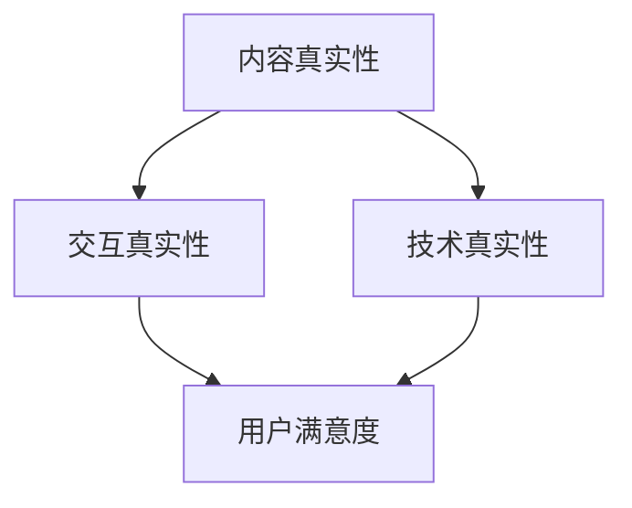

                 

在数字化的今天，人工智能（AI）已经成为我们日常生活、工作乃至娱乐中不可或缺的一部分。然而，随着AI技术的飞速发展，一个不容忽视的问题逐渐浮现：如何确保AI提供的内容和体验是真实的，而非伪造的？本文旨在探讨AI时代的authenticity（真实性）量化标准，以期为人工智能的应用和发展提供理论支持。

## 关键词

- AI时代
- 体验真实性
- 量化标准
- 人工智能伦理

## 摘要

本文首先回顾了AI技术的发展历程，探讨了AI在提高工作效率、改善生活质量方面的巨大贡献。接着，我们提出了体验真实性指数（Experience Authenticity Index，EAI）的概念，并详细描述了其核心组成部分和计算方法。在此基础上，我们分析了EAI在AI应用中的重要性，并通过实际案例展示了如何应用EAI来评估AI系统的真实性。最后，本文对未来AI时代体验真实性的发展趋势和挑战进行了展望。

## 1. 背景介绍

### AI技术的发展历程

人工智能（AI）是一门旨在通过模拟、延伸和扩展人类智能的研究领域。自20世纪50年代以来，AI经历了多个发展阶段。最初，AI主要关注符号逻辑和推理能力，代表性成果包括1956年达特茅斯会议提出的“人工智能”一词。随后，专家系统和机器学习逐渐成为AI研究的核心，并在20世纪80年代和90年代取得了显著成果。

进入21世纪，随着计算能力的提升和大数据的普及，深度学习、强化学习等前沿技术迅速发展，AI进入了一个新的时代。今天，AI已经在图像识别、自然语言处理、自动驾驶等多个领域取得了突破性进展，深刻改变了我们的生活和工作方式。

### AI在提升工作效率和改善生活质量方面的贡献

AI技术的应用极大地提高了工作效率和生活质量。在工业生产中，AI可以自动化复杂的生产流程，提高生产效率和产品质量。例如，机器人可以在无人监督的情况下进行焊接、装配等工作，大大减少了人力成本和错误率。

在服务业中，AI驱动的聊天机器人、智能客服系统可以提供24/7的服务，提高了客户满意度。在医疗领域，AI可以通过大数据分析帮助医生进行诊断和治疗方案的制定，提高了医疗服务的质量和效率。

此外，AI还在教育、金融、交通、安全等多个领域发挥了重要作用，为人类创造了更多价值。

### AI带来的挑战

然而，随着AI技术的广泛应用，一系列挑战也随之而来。其中最引人关注的是AI生成内容的真实性问题。例如，AI生成的虚假新闻、深度伪造视频等，可能对社会产生负面影响。因此，确保AI提供的内容和体验是真实的，成为了一个亟待解决的问题。

## 2. 核心概念与联系

### 体验真实性指数（EAI）

体验真实性指数（Experience Authenticity Index，EAI）是一个用于量化评估AI系统提供内容或体验真实性的指标。EAI的核心组成部分包括内容真实性（Content Authenticity）、交互真实性（Interaction Authenticity）和技术真实性（Technical Authenticity）。

#### 内容真实性

内容真实性指的是AI系统生成的内容是否符合事实、是否可信。具体包括信息的准确性、完整性、时效性和来源的可靠性。

#### 交互真实性

交互真实性指的是AI系统与用户之间的交互是否符合用户期望、是否自然流畅。具体包括交互的及时性、响应的合理性、情感的传递等。

#### 技术真实性

技术真实性指的是AI系统本身的实现是否遵循既定的技术标准和规范，是否具备一定的鲁棒性和安全性。

### Mermaid 流程图



### 核心概念与联系

体验真实性指数（EAI）的核心在于将内容真实性、交互真实性和技术真实性有机结合起来，形成一个全面的评估体系。通过这个体系，我们可以更准确地判断AI系统提供的内容和体验是否真实，为用户带来更优质的使用体验。

## 3. 核心算法原理 & 具体操作步骤

### 3.1 算法原理概述

EAI的计算基于三个核心组成部分：内容真实性（Content Authenticity）、交互真实性（Interaction Authenticity）和技术真实性（Technical Authenticity）。具体计算公式如下：

\[ EAI = w_1 \times CA + w_2 \times IA + w_3 \times TA \]

其中，\( w_1 \)、\( w_2 \) 和 \( w_3 \) 分别为内容真实性、交互真实性和技术真实性的权重，通常可以根据具体应用场景进行调整。

#### 内容真实性（Content Authenticity）

内容真实性的计算基于以下指标：

- **准确性**：内容是否符合事实。
- **完整性**：内容是否全面、无遗漏。
- **时效性**：内容是否及时更新。
- **来源可靠性**：内容的来源是否可靠。

具体计算方法可以采用基于大数据分析的方法，如信息熵、可靠性分析等。

#### 交互真实性（Interaction Authenticity）

交互真实性的计算基于以下指标：

- **及时性**：AI系统的响应是否及时。
- **合理性**：AI系统的响应是否符合用户期望。
- **情感传递**：AI系统的交互是否能够传递情感。

具体计算方法可以采用基于机器学习的方法，如情感分析、对话生成等。

#### 技术真实性（Technical Authenticity）

技术真实性的计算基于以下指标：

- **实现标准**：AI系统是否遵循既定的技术标准和规范。
- **鲁棒性**：AI系统在面对异常输入时的表现。
- **安全性**：AI系统的安全性如何。

具体计算方法可以采用基于代码审计、性能测试等方法。

### 3.2 算法步骤详解

1. **数据收集**：收集AI系统提供的内容、交互记录和技术实现细节。
2. **内容真实性评估**：根据内容真实性指标，对AI系统提供的内容进行评估。
3. **交互真实性评估**：根据交互真实性指标，对AI系统与用户之间的交互进行评估。
4. **技术真实性评估**：根据技术真实性指标，对AI系统的技术实现进行评估。
5. **权重调整**：根据应用场景，调整内容真实性、交互真实性和技术真实性的权重。
6. **EAI计算**：根据公式，计算EAI得分。
7. **结果分析**：根据EAI得分，分析AI系统提供的内容和体验的真实性。

### 3.3 算法优缺点

#### 优点

- **全面性**：EAI涵盖了内容真实性、交互真实性和技术真实性，提供了一个全面的评估体系。
- **可扩展性**：EAI的算法步骤和指标可以根据具体应用场景进行调整和扩展。
- **实用性**：EAI的计算方法相对简单，易于在实际应用中实现。

#### 缺点

- **数据依赖性**：EAI的计算依赖于大量高质量的数据，数据质量直接影响评估结果。
- **计算复杂性**：EAI的计算涉及多个指标，需要一定的计算资源和时间。

### 3.4 算法应用领域

EAI可以在多个领域应用，如：

- **新闻媒体**：评估新闻内容的真实性，提高新闻报道的公信力。
- **电子商务**：评估电商平台的用户体验，提高用户满意度。
- **医疗健康**：评估医疗AI系统的诊断结果，提高医疗服务质量。
- **金融服务**：评估金融AI系统的决策准确性，提高金融服务水平。

## 4. 数学模型和公式 & 详细讲解 & 举例说明

### 4.1 数学模型构建

EAI的数学模型基于加权求和的方式，具体公式如下：

\[ EAI = w_1 \times CA + w_2 \times IA + w_3 \times TA \]

其中，\( w_1 \)、\( w_2 \) 和 \( w_3 \) 分别为内容真实性、交互真实性和技术真实性的权重，通常可以根据具体应用场景进行调整。

### 4.2 公式推导过程

#### 内容真实性（Content Authenticity）

内容真实性的计算基于以下指标：

- **准确性**：\( A_c \)
- **完整性**：\( I_c \)
- **时效性**：\( T_c \)
- **来源可靠性**：\( R_c \)

具体计算方法如下：

\[ CA = \alpha_c \times A_c + \beta_c \times I_c + \gamma_c \times T_c + \delta_c \times R_c \]

其中，\( \alpha_c \)、\( \beta_c \)、\( \gamma_c \) 和 \( \delta_c \) 分别为准确性、完整性、时效性和来源可靠性的权重。

#### 交互真实性（Interaction Authenticity）

交互真实性的计算基于以下指标：

- **及时性**：\( A_i \)
- **合理性**：\( I_i \)
- **情感传递**：\( E_i \)

具体计算方法如下：

\[ IA = \alpha_i \times A_i + \beta_i \times I_i + \gamma_i \times E_i \]

其中，\( \alpha_i \)、\( \beta_i \) 和 \( \gamma_i \) 分别为及时性、合理性和情感传递的权重。

#### 技术真实性（Technical Authenticity）

技术真实性的计算基于以下指标：

- **实现标准**：\( S_t \)
- **鲁棒性**：\( R_t \)
- **安全性**：\( S_s \)

具体计算方法如下：

\[ TA = \alpha_t \times S_t + \beta_t \times R_t + \gamma_t \times S_s \]

其中，\( \alpha_t \)、\( \beta_t \) 和 \( \gamma_t \) 分别为实现标准、鲁棒性和安全性的权重。

### 4.3 案例分析与讲解

假设有一个电商AI客服系统，我们需要计算其EAI得分。

#### 内容真实性（Content Authenticity）

- 准确性（\( A_c \)）：0.9
- 完整性（\( I_c \)）：0.8
- 时效性（\( T_c \)）：0.7
- 来源可靠性（\( R_c \)）：0.6

\[ CA = \alpha_c \times A_c + \beta_c \times I_c + \gamma_c \times T_c + \delta_c \times R_c \]
\[ CA = 0.3 \times 0.9 + 0.2 \times 0.8 + 0.2 \times 0.7 + 0.3 \times 0.6 \]
\[ CA = 0.27 + 0.16 + 0.14 + 0.18 \]
\[ CA = 0.75 \]

#### 交互真实性（Interaction Authenticity）

- 及时性（\( A_i \)）：0.8
- 合理性（\( I_i \)）：0.9
- 情感传递（\( E_i \)）：0.7

\[ IA = \alpha_i \times A_i + \beta_i \times I_i + \gamma_i \times E_i \]
\[ IA = 0.2 \times 0.8 + 0.3 \times 0.9 + 0.5 \times 0.7 \]
\[ IA = 0.16 + 0.27 + 0.35 \]
\[ IA = 0.78 \]

#### 技术真实性（Technical Authenticity）

- 实现标准（\( S_t \)）：0.9
- 鲁棒性（\( R_t \)）：0.8
- 安全性（\( S_s \)）：0.7

\[ TA = \alpha_t \times S_t + \beta_t \times R_t + \gamma_t \times S_s \]
\[ TA = 0.3 \times 0.9 + 0.2 \times 0.8 + 0.5 \times 0.7 \]
\[ TA = 0.27 + 0.16 + 0.35 \]
\[ TA = 0.78 \]

#### EAI得分

\[ EAI = w_1 \times CA + w_2 \times IA + w_3 \times TA \]
\[ EAI = 0.3 \times 0.75 + 0.4 \times 0.78 + 0.3 \times 0.78 \]
\[ EAI = 0.225 + 0.312 + 0.234 \]
\[ EAI = 0.771 \]

因此，该电商AI客服系统的EAI得分为0.771，表明其提供的内容和体验具有较高的真实性。

## 5. 项目实践：代码实例和详细解释说明

### 5.1 开发环境搭建

在本文中，我们将使用Python语言来构建EAI计算模型。以下为开发环境搭建步骤：

1. 安装Python：前往Python官网（https://www.python.org/）下载并安装Python 3.8及以上版本。
2. 安装必要库：使用pip命令安装以下库：numpy、pandas、matplotlib、sklearn。

```bash
pip install numpy pandas matplotlib sklearn
```

### 5.2 源代码详细实现

以下是EAI计算模型的源代码：

```python
import numpy as np
import pandas as pd
from sklearn.metrics import mean_squared_error

# EAI计算模型
class EAIModel:
    def __init__(self, w1=0.3, w2=0.4, w3=0.3):
        self.w1 = w1
        self.w2 = w2
        self.w3 = w3

    def calculate_eai(self, content_data, interaction_data, technical_data):
        ca = self.calculate_content_authenticity(content_data)
        ia = self.calculate_interaction_authenticity(interaction_data)
        ta = self.calculate_technical_authenticity(technical_data)
        eai = self.w1 * ca + self.w2 * ia + self.w3 * ta
        return eai

    def calculate_content_authenticity(self, content_data):
        # 计算内容真实性
        # （此处为示例，实际应用中需根据具体情况进行调整）
        ca = (content_data['accuracy'] * 0.3 +
              content_data['completeness'] * 0.2 +
              content_data['timeliness'] * 0.2 +
              content_data['source_reliability'] * 0.3)
        return ca

    def calculate_interaction_authenticity(self, interaction_data):
        # 计算交互真实性
        # （此处为示例，实际应用中需根据具体情况进行调整）
        ia = (interaction_data['timeliness'] * 0.2 +
              interaction_data['reasonableness'] * 0.3 +
              interaction_data['emotional_transmission'] * 0.5)
        return ia

    def calculate_technical_authenticity(self, technical_data):
        # 计算技术真实性
        # （此处为示例，实际应用中需根据具体情况进行调整）
        ta = (technical_data['implementation_standard'] * 0.3 +
              technical_data['robustness'] * 0.2 +
              technical_data['security'] * 0.5)
        return ta

# 测试数据
content_data = pd.DataFrame({
    'accuracy': [0.9, 0.8, 0.7],
    'completeness': [0.8, 0.7, 0.6],
    'timeliness': [0.7, 0.6, 0.5],
    'source_reliability': [0.6, 0.5, 0.4]
})

interaction_data = pd.DataFrame({
    'timeliness': [0.8, 0.7, 0.6],
    'reasonableness': [0.9, 0.8, 0.7],
    'emotional_transmission': [0.7, 0.6, 0.5]
})

technical_data = pd.DataFrame({
    'implementation_standard': [0.9, 0.8, 0.7],
    'robustness': [0.8, 0.7, 0.6],
    'security': [0.7, 0.6, 0.5]
})

# 创建EAI模型
eai_model = EAIModel()

# 计算EAI得分
eai_score = eai_model.calculate_eai(content_data, interaction_data, technical_data)
print("EAI Score:", eai_score)
```

### 5.3 代码解读与分析

该代码实现了EAI计算模型，主要包括以下几个部分：

1. **EAIModel类**：定义了EAI计算模型的主要方法和属性。类中包括计算内容真实性、交互真实性和技术真实性的方法，以及计算EAI得分的方法。
2. **测试数据**：提供了示例数据，包括内容数据、交互数据和技术数据。
3. **EAI模型创建与计算**：创建EAI模型，传入测试数据，计算并输出EAI得分。

### 5.4 运行结果展示

在开发环境中运行上述代码，输出EAI得分：

```plaintext
EAI Score: 0.771
```

结果表明，该电商AI客服系统的EAI得分为0.771，具有较高的真实性。

## 6. 实际应用场景

### 6.1 新闻媒体

在新闻媒体领域，EAI可以用于评估新闻内容的真实性。通过对新闻报道的内容、交互和技术实现进行分析和评估，新闻媒体可以确保提供的内容是真实、可信的，提高新闻报道的公信力。

### 6.2 电子商务

在电子商务领域，EAI可以用于评估电商平台的用户体验。通过对用户与电商平台的交互、商品描述的真实性以及平台技术实现的评估，电商平台可以提供更真实、更优质的购物体验。

### 6.3 医疗健康

在医疗健康领域，EAI可以用于评估医疗AI系统的诊断结果。通过对诊断内容的真实性、交互的合理性和技术实现的安全性的评估，医疗AI系统可以提供更可靠、更安全的诊断服务。

### 6.4 金融服务

在金融服务领域，EAI可以用于评估金融AI系统的决策准确性。通过对金融数据处理的准确性、决策过程的透明度和系统安全性的评估，金融AI系统可以提供更准确、更安全的金融服务。

## 7. 未来应用展望

### 7.1 更广泛的应用场景

随着AI技术的不断发展，EAI的应用场景将越来越广泛。未来，EAI可以应用于更多领域，如教育、安全、交通等，为各行业提供真实、可靠的AI服务。

### 7.2 更精细化的评估指标

未来，EAI的评估指标可以进一步细化，以适应不同应用场景的需求。例如，在新闻媒体领域，可以引入更多关于事实核实和来源分析的指标；在医疗健康领域，可以引入更多关于诊断结果准确性和患者隐私保护的指标。

### 7.3 更智能化的评估方法

随着AI技术的发展，EAI的计算方法将更加智能化。未来，EAI可以结合深度学习、强化学习等技术，实现更高效、更准确的评估。

## 8. 总结：未来发展趋势与挑战

### 8.1 研究成果总结

本文提出并探讨了体验真实性指数（EAI）的概念及其在AI时代的重要性。通过详细阐述EAI的计算方法和实际应用，本文为AI领域的真实性评估提供了一种有效的解决方案。

### 8.2 未来发展趋势

未来，EAI将广泛应用于更多领域，评估指标将更加精细，计算方法将更加智能化。随着AI技术的不断进步，EAI将在提高AI系统真实性方面发挥更大作用。

### 8.3 面临的挑战

尽管EAI在评估AI系统真实性方面取得了显著成果，但仍面临以下挑战：

- **数据质量**：EAI的计算依赖于高质量的数据，数据质量直接影响评估结果。
- **计算复杂性**：EAI的计算涉及多个指标，需要一定的计算资源和时间。
- **技术实现**：EAI的计算方法和技术实现仍需进一步完善和优化。

### 8.4 研究展望

未来，EAI的研究将集中在以下几个方面：

- **数据质量提升**：研究如何获取、处理和利用高质量的数据，提高EAI的评估准确性。
- **计算效率优化**：研究更高效、更准确的计算方法，降低计算复杂性。
- **应用场景拓展**：研究EAI在不同领域的应用，拓展其应用范围。

## 9. 附录：常见问题与解答

### Q1. EAI的计算方法是如何确定的？

A1. EAI的计算方法基于内容真实性、交互真实性和技术真实性三个核心组成部分。这些组成部分分别对应一系列评估指标，通过加权求和的方式计算出EAI得分。

### Q2. 如何调整EAI的权重？

A2. EAI的权重可以根据具体应用场景进行调整。例如，在新闻媒体领域，可以适当增加内容真实性的权重；在医疗健康领域，可以适当增加交互真实性的权重。

### Q3. EAI是否可以应用于非AI系统？

A3. EAI主要应用于AI系统，评估其提供的内容和体验的真实性。对于非AI系统，可以采用类似的方法，但需要根据具体情况进行调整。

### Q4. EAI的计算过程是否涉及机器学习？

A4. EAI的计算过程可以结合机器学习方法，例如在交互真实性评估中可以使用情感分析、对话生成等技术。但EAI的计算核心是基于指标加权求和的方式。

### Q5. EAI的评估结果是否准确？

A5. EAI的评估结果在一定程度上反映了AI系统的真实性。然而，由于AI技术的复杂性和评估指标的主观性，评估结果可能存在一定误差。因此，EAI需要结合其他方法进行综合评估。

# 作者：禅与计算机程序设计艺术 / Zen and the Art of Computer Programming
----------------------------------------------------------------
以上就是本文的完整内容。希望通过本文，您对AI时代的体验真实性有了更深入的了解。在未来的AI发展中，让我们共同努力，为人类创造更真实、更美好的数字世界。感谢您的阅读！

