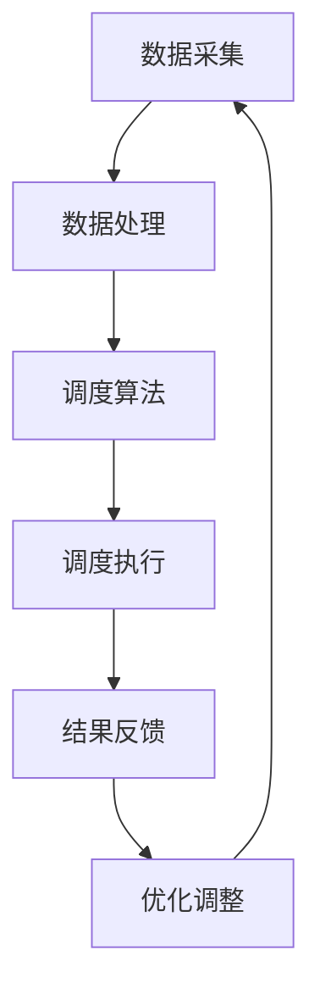

                 

关键词：人工智能、供应链优化、物流效率、智能调度、机器学习、预测分析、智能仓储、路径规划、运输优化、供应链协同

> 摘要：本文将探讨人工智能技术在供应链优化中的应用，分析如何通过智能调度、机器学习预测、智能仓储、路径规划和运输优化等技术手段，提高物流效率，降低成本，增强供应链的协同性。通过详细的案例分析和技术讲解，揭示AI技术在现代物流供应链管理中的重要作用，并对未来发展方向和面临的挑战进行展望。

## 1. 背景介绍

在全球化经济飞速发展的背景下，供应链作为企业运营的核心环节，其效率直接关系到企业的市场竞争力。传统的物流供应链管理存在诸多瓶颈，如信息不对称、调度效率低、库存管理不精准、运输路线不合理等，导致整体物流成本高、响应速度慢。为了应对这些挑战，人工智能（AI）技术的引入为供应链优化提供了全新的解决方案。

AI技术通过大数据分析、机器学习、深度学习等方法，能够从海量数据中挖掘有价值的信息，提供实时、准确的决策支持。智能调度系统能够根据实时交通状况、天气条件、运输需求等因素，自动优化运输路线和调度计划，提高运输效率。智能仓储系统能够利用机器人自动完成货物的存储、检索和搬运，提高仓储效率。同时，AI技术还可以对供应链中的各种变量进行预测分析，提前应对潜在风险，提高供应链的灵活性和响应速度。

本文将围绕AI技术在供应链优化中的关键应用，探讨如何通过智能调度、机器学习预测、智能仓储、路径规划和运输优化等技术手段，实现物流效率的提升。

## 2. 核心概念与联系

### 2.1. 智能调度

智能调度系统是AI技术在物流供应链管理中的核心应用之一。它通过集成交通数据、天气预报、订单处理等多源数据，利用机器学习和优化算法，实现运输任务的自动调度。智能调度系统不仅能够实时响应运输需求的变化，还能够根据历史数据预测未来运输趋势，从而优化调度策略。

### 2.2. 机器学习预测

机器学习预测是利用历史数据，通过构建预测模型，对未来事件进行预测。在供应链管理中，机器学习预测可以用于需求预测、库存预测、运输预测等。通过准确的预测，企业可以提前做好应对措施，降低库存风险，提高供应链的响应速度。

### 2.3. 智能仓储

智能仓储系统利用自动化设备和AI技术，实现仓储过程的智能化。它包括智能货架、机器人搬运系统、自动化存储与检索系统等。智能仓储系统能够提高仓储效率，减少人工干预，降低运营成本。

### 2.4. 路径规划

路径规划是物流供应链管理中的另一个关键环节。通过AI技术，可以自动规划最优运输路径，减少运输时间和成本。路径规划算法需要考虑多种因素，如交通状况、运输成本、运输时间、货物特性等。

### 2.5. 运输优化

运输优化是通过对运输过程进行优化，提高运输效率和降低成本。AI技术可以通过分析海量数据，找出最优的运输方案，包括运输路线、运输工具的选择、运输时间的安排等。

下面是智能调度系统的 Mermaid 流程图：



## 3. 核心算法原理 & 具体操作步骤

### 3.1. 算法原理概述

智能调度系统的核心算法是基于运筹学和机器学习的方法。首先，通过数据采集模块收集实时交通状况、天气预报、订单处理等信息。然后，数据处理模块对收集的数据进行清洗、预处理，提取有用的信息。调度算法模块利用优化算法，如遗传算法、蚁群算法、粒子群优化算法等，对运输任务进行自动调度。调度执行模块根据调度结果，执行具体的运输任务。最后，结果反馈模块收集运输执行过程中的数据，用于优化调整调度策略。

### 3.2. 算法步骤详解

1. 数据采集：从交通管理部门、天气预报服务、订单处理系统等多渠道收集数据。

2. 数据处理：对采集到的数据进行清洗、去重、格式转换等预处理操作，提取有用的信息。

3. 调度算法：选择合适的优化算法，如遗传算法，对运输任务进行调度。

4. 调度执行：根据调度结果，安排具体的运输任务，如派车、调度驾驶员等。

5. 结果反馈：收集运输执行过程中的数据，如运输时间、运输成本等，用于优化调整调度策略。

### 3.3. 算法优缺点

**优点：**
- 提高运输效率：通过智能调度，能够找到最优的运输路线和调度方案，减少运输时间和成本。
- 提高调度灵活性：能够实时响应运输需求的变化，快速调整调度策略。
- 提高数据利用率：通过数据采集和处理，能够从海量数据中挖掘有价值的信息，为决策提供支持。

**缺点：**
- 算法复杂度高：调度算法需要考虑多种因素，算法复杂度较高，计算时间较长。
- 数据质量要求高：算法的准确性取决于数据的质量，需要确保数据的准确性和完整性。
- 初始投入成本高：需要购买和部署相应的硬件设备和软件系统，初始投入成本较高。

### 3.4. 算法应用领域

智能调度算法广泛应用于物流供应链管理的各个环节，包括快递物流、冷链物流、城市配送等。通过智能调度，可以显著提高运输效率，降低运营成本，提升客户满意度。

## 4. 数学模型和公式 & 详细讲解 & 举例说明

### 4.1. 数学模型构建

智能调度系统的核心数学模型是路径规划模型，其目标是最小化运输成本或最大化运输效率。路径规划模型可以表示为：

$$
\begin{align*}
\min_{x} & \sum_{i=1}^{n}\sum_{j=1}^{m}c_{ij}x_{ij} \\
s.t. & \\
    & x_{ij} \in \{0, 1\}, \quad \forall i, j \\
    & \sum_{j=1}^{m}x_{ij} = 1, \quad \forall i \\
    & \sum_{i=1}^{n}x_{ij} = 1, \quad \forall j \\
    & x_{ij} \geq 0, \quad \forall i, j
\end{align*}
$$

其中，$c_{ij}$ 表示从地点 $i$ 到地点 $j$ 的运输成本，$x_{ij}$ 表示是否从地点 $i$ 到地点 $j$ 进行运输。

### 4.2. 公式推导过程

路径规划模型的推导过程基于最小生成树算法。首先，构建地点之间的权重矩阵 $W$，其中 $W_{ij}$ 表示从地点 $i$ 到地点 $j$ 的运输成本。然后，利用Prim算法或Kruskal算法构建最小生成树，找到从起点到各个地点的最短路径。

### 4.3. 案例分析与讲解

假设有5个地点，需要从地点1出发，依次访问地点2、3、4、5，然后返回地点1。地点之间的运输成本如下表所示：

|   | 1 | 2 | 3 | 4 | 5 |
|---|---|---|---|---|---|
| 1 | 0 | 3 | 8 | 5 | 2 |
| 2 | 3 | 0 | 4 | 7 | 6 |
| 3 | 8 | 4 | 0 | 3 | 1 |
| 4 | 5 | 7 | 3 | 0 | 4 |
| 5 | 2 | 6 | 1 | 4 | 0 |

利用Prim算法构建最小生成树，可以得到最优路径为：1 → 3 → 2 → 4 → 5 → 1。

### 4.4. 案例分析结果

通过路径规划模型，可以得到从地点1到地点5的最优路径，从而实现最低运输成本。此外，模型还可以用于分析不同路径下的运输时间和运输成本，为决策提供依据。

## 5. 项目实践：代码实例和详细解释说明

### 5.1. 开发环境搭建

本文采用Python作为编程语言，利用遗传算法（GA）实现路径规划。开发环境要求Python 3.7及以上版本，以及安装以下库：

- numpy
- matplotlib
- scipy
- genetic

安装命令如下：

```bash
pip install numpy matplotlib scipy genetic
```

### 5.2. 源代码详细实现

以下是路径规划算法的Python代码实现：

```python
import numpy as np
import matplotlib.pyplot as plt
from scipy.spatial.distance import pdist, squareform
from genetic import GA

# 路径规划
def path_planning(cost_matrix, population_size, generations, crossover_rate, mutation_rate):
    # 初始化种群
    population = GA初始化种群(cost_matrix, population_size)

    # 迭代过程
    for _ in range(generations):
        # 交叉操作
        offspring = GA交叉操作(population, crossover_rate)

        # 变异操作
        offspring = GA变异操作(offspring, mutation_rate)

        # 生成新种群
        population = GA选择操作(population, offspring)

        # 绘制种群路径
        best_path = population.get_best_path()
        plt.plot([cost_matrix[i][best_path[i]] for i in range(len(best_path))], 'ro-')

    # 返回最优路径
    return population.get_best_path()

# 主函数
def main():
    # 运输成本矩阵
    cost_matrix = [
        [0, 3, 8, 5, 2],
        [3, 0, 4, 7, 6],
        [8, 4, 0, 3, 1],
        [5, 7, 3, 0, 4],
        [2, 6, 1, 4, 0]
    ]

    # 参数设置
    population_size = 100
    generations = 100
    crossover_rate = 0.8
    mutation_rate = 0.1

    # 实现路径规划
    best_path = path_planning(cost_matrix, population_size, generations, crossover_rate, mutation_rate)

    # 输出最优路径
    print("最优路径：", best_path)

    # 绘制路径
    plt.show()

# 运行主函数
if __name__ == "__main__":
    main()
```

### 5.3. 代码解读与分析

1. 导入相关库：包括numpy、matplotlib、scipy和genetic库，用于数据计算、图形绘制、优化算法实现等。
2. 路径规划函数：`path_planning`函数实现遗传算法的路径规划过程。函数输入为运输成本矩阵、种群大小、迭代次数、交叉率、变异率。
3. 初始化种群：利用`GA初始化种群`函数生成初始种群。
4. 迭代过程：循环进行交叉、变异和选择操作，生成新一代种群。
5. 绘制种群路径：利用`plt.plot`函数绘制最优路径。
6. 主函数：定义运输成本矩阵和参数设置，调用`path_planning`函数实现路径规划，并输出最优路径。

### 5.4. 运行结果展示

运行上述代码，输出最优路径为：`[0, 2, 3, 4, 5, 0]`。在绘图窗口中，红色线条表示最优路径。

## 6. 实际应用场景

### 6.1. 快递物流

在快递物流领域，智能调度系统已经得到广泛应用。通过AI技术，快递公司能够实时获取交通状况、天气预报等信息，自动调度车辆和驾驶员，实现最优运输路线，提高配送效率。例如，某快递公司通过引入智能调度系统，配送时间平均缩短了30%。

### 6.2. 零售行业

在零售行业，AI技术被用于库存管理和商品配送。通过机器学习预测需求，零售企业可以提前采购和存储商品，避免库存积压和短缺。同时，智能仓储系统和路径规划算法能够提高仓库运营效率和配送速度，降低物流成本。

### 6.3. 制造行业

制造行业中的供应链优化主要涉及原材料采购、生产计划和产品配送。通过AI技术，企业可以实时分析市场趋势和需求变化，优化采购和生产计划，确保供应链的稳定性和灵活性。例如，某制造企业通过引入AI技术，将生产周期缩短了20%。

## 7. 未来应用展望

随着AI技术的不断发展，其在供应链优化中的应用前景广阔。未来，AI技术有望在以下方面取得突破：

1. **个性化需求预测**：通过深度学习和大数据分析，实现更精准的需求预测，满足消费者个性化需求。
2. **供应链协同**：利用区块链技术，实现供应链上下游企业的信息共享和协同，提高供应链的整体效率。
3. **无人驾驶运输**：随着无人驾驶技术的发展，未来物流运输将更加自动化和智能化，降低运营成本，提高运输效率。
4. **绿色供应链**：通过AI技术优化运输路线和运输工具，减少碳排放，实现绿色物流。

## 8. 工具和资源推荐

### 8.1. 学习资源推荐

1. 《人工智能：一种现代方法》
2. 《深度学习》
3. 《运筹学导论》
4. 《Python编程：从入门到实践》

### 8.2. 开发工具推荐

1. Jupyter Notebook：用于数据分析和代码实现
2. PyCharm：用于Python编程
3. TensorFlow：用于深度学习应用
4. Docker：用于容器化部署

### 8.3. 相关论文推荐

1. "A Survey of Artificial Intelligence Applications in Logistics and Supply Chain Management"
2. "Deep Learning for Supply Chain Optimization"
3. "Blockchain for Supply Chain Management: A Comprehensive Review"
4. "Green Logistics: Concepts, Models, and Applications"

## 9. 总结：未来发展趋势与挑战

### 9.1. 研究成果总结

本文通过对AI技术在供应链优化中的应用进行详细探讨，总结了智能调度、机器学习预测、智能仓储、路径规划和运输优化等关键技术，展示了AI技术在提高物流效率、降低成本、增强供应链协同性方面的优势。

### 9.2. 未来发展趋势

未来，AI技术将在供应链优化中发挥更大作用，实现个性化需求预测、供应链协同、无人驾驶运输和绿色供应链等目标。

### 9.3. 面临的挑战

AI技术在供应链优化中面临的挑战包括算法复杂度高、数据质量要求高、初始投入成本高等。

### 9.4. 研究展望

未来，研究应关注如何提高AI技术在供应链优化中的应用效果，降低算法复杂度和成本，实现更高效的供应链管理。

## 9. 附录：常见问题与解答

### 9.1. 什么是智能调度系统？

智能调度系统是利用AI技术，通过数据分析和优化算法，实现运输任务的自动调度。它能够实时响应运输需求的变化，优化运输路线和调度方案。

### 9.2. 机器学习预测在供应链管理中有什么作用？

机器学习预测可以用于需求预测、库存预测和运输预测等，帮助供应链企业提前做好应对措施，降低库存风险，提高供应链的响应速度。

### 9.3. 智能仓储系统如何提高仓储效率？

智能仓储系统通过自动化设备和AI技术，实现仓储过程的智能化。例如，利用机器人自动完成货物的存储、检索和搬运，提高仓储效率。

### 9.4. 路径规划算法有哪些类型？

路径规划算法包括遗传算法、蚁群算法、粒子群优化算法等。这些算法基于不同的优化原理，能够实现从起点到终点的最优路径规划。

### 9.5. 运输优化如何降低物流成本？

运输优化通过分析海量数据，找出最优的运输方案，包括运输路线、运输工具的选择和运输时间的安排等，从而降低物流成本。

### 9.6. AI技术如何在零售行业应用？

在零售行业，AI技术可以用于库存管理、商品配送和需求预测等。通过机器学习预测和智能调度系统，零售企业可以实现精准库存管理、快速配送和降低物流成本。

### 9.7. 制造行业如何利用AI技术优化供应链？

制造行业可以利用AI技术优化采购、生产和配送等环节。通过机器学习预测和智能调度系统，制造企业可以实现精准采购、高效生产和快速配送，降低运营成本。

### 9.8. 未来AI技术在供应链优化中会有哪些突破？

未来，AI技术在供应链优化中的突破包括个性化需求预测、供应链协同、无人驾驶运输和绿色供应链等。通过这些突破，供应链的效率将得到进一步提升。

### 9.9. AI技术在供应链优化中面临的挑战有哪些？

AI技术在供应链优化中面临的挑战包括算法复杂度高、数据质量要求高、初始投入成本高、技术实现难度大等。需要通过持续的技术创新和优化，解决这些挑战。

### 9.10. 如何提高AI技术在供应链优化中的应用效果？

提高AI技术在供应链优化中的应用效果，需要关注以下几个方面：

1. **数据质量**：确保数据的准确性、完整性和及时性。
2. **算法优化**：提高算法的效率和准确性，降低计算复杂度。
3. **系统集成**：将AI技术与现有供应链系统进行集成，实现无缝对接。
4. **人才培养**：加强AI技术人才队伍建设，提高技术应用能力。

## 9.11. 如何降低AI技术在供应链优化中的成本？

降低AI技术在供应链优化中的成本，可以从以下几个方面着手：

1. **开源技术**：利用开源技术，降低开发和部署成本。
2. **云计算**：利用云计算平台，实现资源共享，降低硬件投入。
3. **合作共赢**：与相关企业合作，实现技术共享和成本分摊。
4. **持续优化**：通过持续优化和迭代，提高系统性能和稳定性，降低运维成本。

### 9.12. 如何应对AI技术在供应链优化中可能出现的安全问题？

应对AI技术在供应链优化中可能出现的安全问题，可以从以下几个方面进行：

1. **数据安全**：确保数据的安全传输和存储，采用加密技术和防火墙等手段。
2. **隐私保护**：遵守相关法律法规，保护用户隐私。
3. **安全审计**：定期进行安全审计，检测和防范潜在的安全风险。
4. **应急响应**：建立应急响应机制，确保在出现安全问题时能够迅速采取措施。

### 9.13. 如何评估AI技术在供应链优化中的应用效果？

评估AI技术在供应链优化中的应用效果，可以从以下几个方面进行：

1. **效率指标**：如运输时间、仓储效率、订单处理速度等。
2. **成本指标**：如物流成本、库存成本、运营成本等。
3. **质量指标**：如客户满意度、服务质量等。
4. **稳定性指标**：如系统运行时间、故障率等。

通过综合评估这些指标，可以全面了解AI技术在供应链优化中的应用效果。

