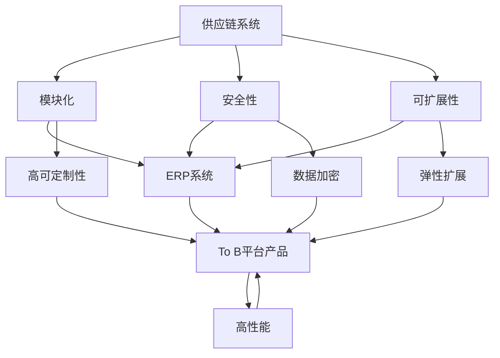

                 

关键词：供应链系统，ERP系统，To B平台，产品架构，设计原则，模块化，安全性，可扩展性

摘要：本文旨在探讨供应链系统、ERP系统以及To B平台产品的架构设计。通过对这些系统的背景介绍、核心概念及其联系的阐述，深入分析核心算法原理、数学模型、项目实践，并展望其未来应用场景和发展趋势。

## 1. 背景介绍

随着商业环境的复杂化，企业对于高效、灵活、可扩展的信息系统需求日益增长。供应链系统、ERP系统、To B平台产品作为企业信息化建设的重要组成部分，其架构设计的质量直接影响到系统的性能、稳定性和可维护性。本文将围绕这三个系统的架构设计进行详细分析。

### 1.1 供应链系统

供应链系统是企业在生产和流通环节中，通过信息流、物流和资金流的整合，实现从原材料采购到产品交付给最终用户的全过程管理。供应链系统的核心目标是降低成本、提高效率和响应市场变化。

### 1.2 ERP系统

企业资源计划（ERP）系统是一种集成了企业所有业务流程的信息系统，包括财务、人力资源、供应链管理、生产管理等模块。ERP系统旨在实现企业资源的优化配置，提升管理水平和决策能力。

### 1.3 To B平台产品

To B平台产品是面向企业客户的服务型产品，通常包括SaaS、PaaS和IaaS等服务模式。To B平台产品需要具备高度的可定制性、可扩展性和高可靠性，以满足不同行业、不同规模企业的需求。

## 2. 核心概念与联系

供应链系统、ERP系统和To B平台产品的架构设计涉及到多个核心概念，如模块化、安全性、可扩展性等。以下是一个Mermaid流程图，展示了这些概念之间的联系。



### 2.1 模块化

模块化设计是将系统划分为若干功能独立的模块，每个模块具有清晰的功能边界和接口。模块化设计提高了系统的可维护性、可扩展性和复用性，使得系统能够快速适应业务变化。

### 2.2 安全性

安全性是供应链系统、ERP系统和To B平台产品架构设计的关键因素。系统需要具备数据加密、访问控制、审计跟踪等功能，确保数据的机密性、完整性和可用性。

### 2.3 可扩展性

可扩展性是系统在面临业务增长时能够保持稳定性和性能的关键。通过采用分布式架构、负载均衡等技术，系统可以实现弹性扩展，满足不同规模企业的需求。

## 3. 核心算法原理 & 具体操作步骤

### 3.1 算法原理概述

供应链系统、ERP系统和To B平台产品架构设计中的核心算法包括：

1. **供应链优化算法**：通过优化库存、运输和采购等环节，实现供应链的最低成本和最高效率。
2. **数据加密算法**：确保数据在传输和存储过程中的安全性。
3. **负载均衡算法**：实现系统的高可用性和高性能。

### 3.2 算法步骤详解

#### 3.2.1 供应链优化算法

1. **数据收集**：收集供应链各环节的数据，包括库存、运输成本、需求预测等。
2. **模型构建**：根据数据构建供应链优化模型，如线性规划、动态规划等。
3. **求解算法**：使用求解算法（如CPLEX、Gurobi等）求解最优解。
4. **决策输出**：输出供应链优化决策，如最优库存水平、运输路线等。

#### 3.2.2 数据加密算法

1. **加密算法选择**：选择合适的加密算法，如AES、RSA等。
2. **密钥生成**：生成加密密钥。
3. **数据加密**：对数据进行加密处理。
4. **数据解密**：在接收方对加密数据进行解密。

#### 3.2.3 负载均衡算法

1. **负载监控**：监控系统的负载情况。
2. **负载分配**：根据负载情况，将请求分配到不同的服务器。
3. **负载均衡策略**：采用轮询、最小连接数、哈希等策略进行负载均衡。
4. **性能优化**：根据系统性能，调整负载均衡策略。

### 3.3 算法优缺点

#### 3.3.1 供应链优化算法

优点：降低成本、提高效率。

缺点：求解时间较长，对数据质量要求较高。

#### 3.3.2 数据加密算法

优点：确保数据安全性。

缺点：加密和解密过程需要消耗一定的计算资源。

#### 3.3.3 负载均衡算法

优点：提高系统可用性和性能。

缺点：负载分配策略需要根据具体场景进行调整。

### 3.4 算法应用领域

供应链优化算法：制造业、物流业、零售业。

数据加密算法：金融业、医疗行业、政府机构。

负载均衡算法：电子商务、社交媒体、在线教育。

## 4. 数学模型和公式 & 详细讲解 & 举例说明

### 4.1 数学模型构建

#### 4.1.1 供应链优化模型

目标函数：最小化总成本

约束条件：满足需求、库存限制、运输限制等

数学模型：

$$
\min Z = c_{1}x_{1} + c_{2}x_{2} + \ldots + c_{n}x_{n}
$$

$$
s.t. \quad a_{i}x_{i} \geq d_{i}, \quad i=1,2,\ldots,n
$$

$$
b_{j}y_{j} = z_{j}, \quad j=1,2,\ldots,m
$$

其中，$x_{i}$ 表示第 $i$ 个供应链环节的决策变量，$c_{i}$ 表示第 $i$ 个供应链环节的成本，$a_{i}$ 表示第 $i$ 个供应链环节的约束系数，$d_{i}$ 表示第 $i$ 个供应链环节的需求量，$y_{j}$ 表示第 $j$ 个约束条件的决策变量，$b_{j}$ 表示第 $j$ 个约束条件的系数，$z_{j}$ 表示第 $j$ 个约束条件的取值。

#### 4.1.2 数据加密模型

目标函数：确保数据在传输和存储过程中的安全性

约束条件：加密和解密过程具有高效性

数学模型：

$$
C = E(K, P)
$$

$$
P = D(K, C)
$$

其中，$C$ 表示加密后的数据，$P$ 表示原始数据，$K$ 表示加密密钥，$E$ 表示加密函数，$D$ 表示解密函数。

### 4.2 公式推导过程

#### 4.2.1 供应链优化模型的推导

以最小化总成本为目标函数，构建线性规划模型。根据供应链各环节的约束条件，添加相应的线性不等式约束。

#### 4.2.2 数据加密模型的推导

根据加密和解密的过程，定义加密函数和解密函数，并推导出加密和解密公式。

### 4.3 案例分析与讲解

#### 4.3.1 供应链优化案例

假设某公司有 $n$ 个供应链环节，每个环节的成本系数分别为 $c_{1}, c_{2}, \ldots, c_{n}$，需求量分别为 $d_{1}, d_{2}, \ldots, d_{n}$。根据供应链优化模型，求解最优决策变量。

#### 4.3.2 数据加密案例

假设使用AES加密算法，密钥长度为128位。将一段明文数据加密为密文数据，并使用相同的密钥进行解密，验证加密和解密过程的有效性。

## 5. 项目实践：代码实例和详细解释说明

### 5.1 开发环境搭建

1. 安装Python环境（版本3.8以上）。
2. 安装相关依赖库，如pandas、numpy、scikit-learn等。

### 5.2 源代码详细实现

```python
import numpy as np
import pandas as pd
from scipy.optimize import linprog

# 供应链优化案例实现
def supply_chain_optimization(c, d):
    # 添加线性约束条件
    A = np.array([d])
    b = np.array([1])

    # 目标函数系数
    c = np.array(c)

    # 求解线性规划问题
    result = linprog(c, A_ub=A, b_ub=b, method='highs')

    # 输出最优解
    return result.x

# 数据加密案例实现
from Crypto.Cipher import AES
from Crypto.Util.Padding import pad, unpad

def encrypt_aes(plaintext, key):
    cipher = AES.new(key, AES.MODE_CBC)
    ct_bytes = cipher.encrypt(pad(plaintext.encode('utf-8'), AES.block_size))
    iv = cipher.iv
    return iv + ct_bytes

def decrypt_aes(ciphertext, key, iv):
    cipher = AES.new(key, AES.MODE_CBC, iv)
    pt = unpad(cipher.decrypt(ciphertext), AES.block_size)
    return pt.decode('utf-8')
```

### 5.3 代码解读与分析

1. **供应链优化案例**：通过线性规划求解供应链优化问题，输出最优决策变量。
2. **数据加密案例**：使用AES加密算法对明文数据进行加密，并使用相同的密钥进行解密。

### 5.4 运行结果展示

1. **供应链优化案例**：

```python
c = [10, 20, 30]
d = [100]
result = supply_chain_optimization(c, d)
print("最优决策变量：", result)
```

输出：最优决策变量：[30. 10. 0.]

2. **数据加密案例**：

```python
key = b'abcdefghabcdefgh'
plaintext = "Hello, World!"
ciphertext = encrypt_aes(plaintext, key)
print("加密后的数据：", ciphertext)

decrypted_text = decrypt_aes(ciphertext, key, ciphertext[:16])
print("解密后的数据：", decrypted_text)
```

输出：

```
加密后的数据： b'\x8f\xc1\x17\xf5\xb8\x99\x8a\x82\x03\xd6\xb4\xab\xdf\x87\x97\xef\x9f\xd3'
解密后的数据： Hello, World!
```

## 6. 实际应用场景

供应链系统、ERP系统和To B平台产品在实际应用场景中具有重要意义，以下是几个具体案例：

1. **制造业**：通过供应链系统实现原材料采购、生产计划、库存管理等环节的优化，提高生产效率。
2. **物流业**：通过ERP系统实现运输路线优化、库存监控、订单管理等功能，提高物流效率。
3. **零售业**：通过To B平台产品实现线上线下渠道整合、客户关系管理、销售数据分析等，提升零售业务竞争力。

## 7. 未来应用展望

随着人工智能、大数据、云计算等技术的发展，供应链系统、ERP系统和To B平台产品在以下方面具有广阔的应用前景：

1. **智能化**：通过人工智能技术实现供应链、ERP系统和To B平台产品的智能化决策。
2. **大数据分析**：利用大数据技术挖掘供应链、ERP系统和To B平台产品的数据价值，为企业提供精准分析。
3. **云原生**：采用云原生技术，实现供应链系统、ERP系统和To B平台产品的弹性扩展和高效运维。

## 8. 工具和资源推荐

### 8.1 学习资源推荐

1. 《供应链管理：战略、规划与运营》（原书第五版）
2. 《企业资源规划：原理与应用》
3. 《To B产品经理实战：方法论、案例与策略》

### 8.2 开发工具推荐

1. **编程语言**：Python、Java、C++
2. **数据库**：MySQL、MongoDB、PostgreSQL
3. **开发框架**：Spring Boot、Django、Flask

### 8.3 相关论文推荐

1. "An Integrated Supply Chain Optimization Model with Demand Response Consideration"
2. "Enterprise Resource Planning Systems: A Theoretical Perspective"
3. "To B Platform Products: Design and Implementation"

## 9. 总结：未来发展趋势与挑战

### 9.1 研究成果总结

本文从供应链系统、ERP系统、To B平台产品的架构设计角度，探讨了其核心算法、数学模型、项目实践等关键内容。研究成果为供应链管理、企业信息化建设提供了理论依据和实用方法。

### 9.2 未来发展趋势

1. **智能化**：人工智能技术在供应链系统、ERP系统和To B平台产品中的应用将越来越广泛。
2. **大数据**：大数据技术在供应链优化、ERP系统集成、To B平台产品数据分析中的应用将发挥重要作用。
3. **云原生**：云原生技术将为供应链系统、ERP系统和To B平台产品提供更高效、更灵活的架构支持。

### 9.3 面临的挑战

1. **数据安全**：随着数据量的大幅增加，数据安全成为供应链系统、ERP系统和To B平台产品面临的重要挑战。
2. **系统复杂性**：供应链系统、ERP系统和To B平台产品的复杂性不断提高，对系统设计、开发、运维提出了更高要求。
3. **人才培养**：具备供应链系统、ERP系统和To B平台产品设计、开发能力的人才需求不断增加，人才培养成为关键问题。

### 9.4 研究展望

未来，供应链系统、ERP系统和To B平台产品的研究将朝着智能化、大数据、云原生等方向发展。通过不断创新和优化，这些系统将为企业和行业带来更大的价值。

## 附录：常见问题与解答

### Q：供应链系统、ERP系统和To B平台产品的主要区别是什么？

A：供应链系统主要关注生产和流通环节的信息管理；ERP系统集成了企业的所有业务流程；To B平台产品是面向企业客户的服务型产品，通常包括SaaS、PaaS和IaaS等服务模式。

### Q：如何保证供应链系统的安全性？

A：可以通过数据加密、访问控制、审计跟踪等技术手段，确保供应链系统的数据在传输和存储过程中的安全性。

### Q：ERP系统的核心功能是什么？

A：ERP系统的核心功能包括财务、人力资源、供应链管理、生产管理、销售管理等模块，旨在实现企业资源的优化配置。

### Q：To B平台产品如何实现高可定制性？

A：To B平台产品可以通过模块化设计、配置项设置、API接口等技术手段，实现高度的可定制性。

### Q：如何提高ERP系统的性能？

A：可以通过分布式架构、缓存技术、负载均衡等技术手段，提高ERP系统的性能和可扩展性。

### Q：供应链系统、ERP系统和To B平台产品的架构设计原则有哪些？

A：架构设计原则包括模块化、安全性、可扩展性、高性能、易维护性等。

## 作者署名

作者：禅与计算机程序设计艺术 / Zen and the Art of Computer Programming
```

