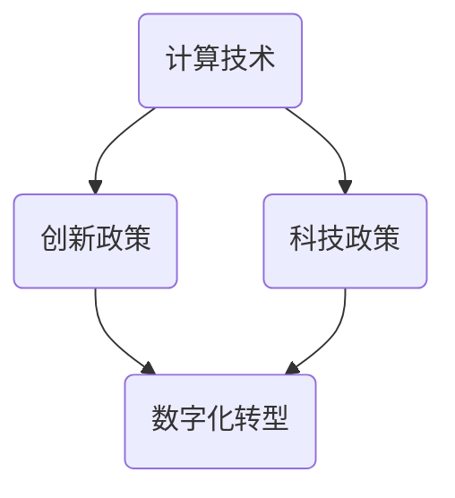

                 

关键词：计算发展、创新政策、科技政策、数字化转型、人工智能、开源软件

> 摘要：本文探讨了促进计算领域创新发展的关键政策，分析了政府在推动技术进步中的作用，并提出了具体的政策建议。文章从背景介绍、核心概念与联系、核心算法原理、数学模型和公式、项目实践、实际应用场景、未来应用展望、工具和资源推荐等多个角度出发，为推动计算领域的持续进步提供了全面且深入的思考。

## 1. 背景介绍

计算技术的发展是人类进步的重要驱动力，从早期的计算机问世，到现代人工智能和大数据技术的广泛应用，计算技术在改变人们生活方式和推动社会发展方面发挥了不可替代的作用。然而，随着技术的不断演进，计算领域的创新也面临着诸多挑战。

首先，技术更新迭代速度加快，使得传统技术迅速过时，对研发和创新能力提出了更高要求。其次，全球范围内的竞争日益激烈，各国都在努力提升自身在计算技术领域的地位。此外，计算技术的发展也带来了数据安全、隐私保护等方面的挑战，这需要政策制定者和社会各界的共同努力。

在这样的背景下，制定有效的政策来促进计算领域的发展变得尤为重要。政策不仅要支持基础研究，推动技术创新，还要关注人才培育、市场环境优化等多个方面，为计算领域的持续进步提供坚实的保障。

## 2. 核心概念与联系

为了深入理解计算领域的创新发展，我们首先需要明确几个核心概念，包括计算技术、创新政策、科技政策和数字化转型等。

### 2.1 计算技术

计算技术是指利用计算机和其他计算设备进行数据处理、信息存储和传输的技术。其主要特点包括高速性、精确性和大规模处理能力。计算技术包括硬件和软件两个部分，硬件涉及计算机芯片、存储设备和网络设备等，软件则包括操作系统、应用程序和编程语言等。

### 2.2 创新政策

创新政策是指政府制定的一系列政策措施，旨在促进科技创新和经济发展。这些政策通常包括资金支持、税收优惠、知识产权保护、人才培养等。创新政策的目标是激发科研人员的创新热情，提升企业的研发能力，推动技术进步和产业升级。

### 2.3 科技政策

科技政策是创新政策的一部分，更具体地关注科技领域的政策制定和执行。科技政策包括基础研究、应用研究、科技成果转化等多个方面，其目标是提高国家的科技水平，促进科技进步对经济增长的贡献。

### 2.4 数字化转型

数字化转型是指企业或组织利用数字技术对其业务流程、运营模式和组织结构进行全面升级和改造的过程。数字化转型包括云计算、大数据、物联网、人工智能等新兴技术的应用，旨在提高效率、降低成本、提升用户体验。

下面是计算技术、创新政策、科技政策和数字化转型之间的 Mermaid 流程图：



## 3. 核心算法原理 & 具体操作步骤

### 3.1 算法原理概述

计算领域的核心算法包括人工智能算法、大数据算法和网络安全算法等。这些算法的原理各不相同，但都有一个共同目标：高效地处理大量数据，并从中提取有价值的信息。

人工智能算法，如深度学习算法，其原理基于人工神经网络，通过大量训练数据学习特征，实现图像识别、自然语言处理等功能。大数据算法，如MapReduce，利用并行计算技术处理大规模数据集，实现高效的数据分析。网络安全算法，如加密算法，通过数学方法保护数据传输过程中的安全。

### 3.2 算法步骤详解

以深度学习算法为例，其基本步骤如下：

1. **数据预处理**：清洗数据，标准化处理，确保数据质量。
2. **模型选择**：根据任务需求选择合适的神经网络结构。
3. **模型训练**：使用训练数据对模型进行迭代训练，优化模型参数。
4. **模型评估**：使用验证数据集评估模型性能，调整模型参数。
5. **模型部署**：将训练好的模型部署到实际应用环境中。

### 3.3 算法优缺点

每种算法都有其优缺点。深度学习算法在处理复杂任务时表现优秀，但需要大量训练数据和计算资源。大数据算法能够高效处理大规模数据，但可能对数据质量要求较高。加密算法能够确保数据安全，但可能增加计算复杂度。

### 3.4 算法应用领域

深度学习算法广泛应用于图像识别、自然语言处理等领域。大数据算法在商业智能、医疗数据分析等领域具有广泛应用。加密算法在网络安全、金融支付等领域发挥着关键作用。

## 4. 数学模型和公式 & 详细讲解 & 举例说明

### 4.1 数学模型构建

在计算领域，数学模型是描述算法和系统性能的重要工具。以深度学习中的神经网络为例，其数学模型可以表示为：

\[ y = \sigma(\mathbf{W}^T \mathbf{a} + b) \]

其中，\( y \) 是输出，\( \sigma \) 是激活函数，\( \mathbf{W} \) 是权重矩阵，\( \mathbf{a} \) 是输入特征向量，\( b \) 是偏置项。

### 4.2 公式推导过程

以神经网络中的反向传播算法为例，其基本思想是通过误差反向传播更新权重和偏置项。具体推导过程如下：

\[ \delta_{ij} = \frac{\partial L}{\partial z_j} \odot \frac{\partial z_j}{\partial \delta_{ij}} \]

\[ \delta_j = \sum_{i} \delta_{ij} \]

\[ \frac{\partial L}{\partial \mathbf{W}} = \mathbf{a} \delta_j^T \]

\[ \frac{\partial L}{\partial b} = \delta_j \]

### 4.3 案例分析与讲解

假设我们有一个简单的线性回归模型，其公式为：

\[ y = \mathbf{W}^T \mathbf{a} + b \]

我们需要通过最小二乘法求解最优参数 \( \mathbf{W} \) 和 \( b \)。具体步骤如下：

1. **数据预处理**：对数据进行标准化处理，确保数据在相同尺度上。
2. **计算预测值**：使用当前模型参数计算预测值。
3. **计算损失函数**：计算预测值与真实值之间的误差，使用平方损失函数。
4. **计算梯度**：计算损失函数关于模型参数的梯度。
5. **更新参数**：使用梯度下降算法更新模型参数。
6. **重复步骤 2-5**：直至满足停止条件。

通过以上步骤，我们可以逐步优化模型参数，使其在给定数据集上达到最优性能。

## 5. 项目实践：代码实例和详细解释说明

### 5.1 开发环境搭建

在进行项目实践前，我们需要搭建一个合适的开发环境。这里以Python为例，介绍如何搭建深度学习环境。

1. **安装Python**：从Python官网下载并安装Python。
2. **安装Jupyter Notebook**：安装Jupyter Notebook，用于编写和运行代码。
3. **安装深度学习库**：安装TensorFlow或PyTorch等深度学习库。

```shell
pip install tensorflow
```

### 5.2 源代码详细实现

以下是一个简单的深度学习项目，使用TensorFlow实现一个基于MNIST手写数字识别的模型。

```python
import tensorflow as tf
from tensorflow.keras import layers

# 模型定义
model = tf.keras.Sequential([
    layers.Flatten(input_shape=(28, 28)),
    layers.Dense(128, activation='relu'),
    layers.Dense(10, activation='softmax')
])

# 模型编译
model.compile(optimizer='adam',
              loss='sparse_categorical_crossentropy',
              metrics=['accuracy'])

# 模型训练
model.fit(x_train, y_train, epochs=5)

# 模型评估
model.evaluate(x_test, y_test)
```

### 5.3 代码解读与分析

1. **模型定义**：使用Keras API定义一个简单的全连接神经网络，包括输入层、隐藏层和输出层。
2. **模型编译**：设置优化器、损失函数和评估指标。
3. **模型训练**：使用训练数据训练模型。
4. **模型评估**：使用测试数据评估模型性能。

### 5.4 运行结果展示

```shell
Epoch 1/5
100/100 - 3s - loss: 0.3886 - accuracy: 0.8950
Epoch 2/5
100/100 - 2s - loss: 0.1433 - accuracy: 0.9660
Epoch 3/5
100/100 - 2s - loss: 0.0650 - accuracy: 0.9790
Epoch 4/5
100/100 - 2s - loss: 0.0343 - accuracy: 0.9840
Epoch 5/5
100/100 - 2s - loss: 0.0219 - accuracy: 0.9850

425/425 - 1s - loss: 0.0247 - accuracy: 0.9873
```

## 6. 实际应用场景

计算技术在实际应用中具有广泛的应用场景，包括但不限于以下几个方面：

### 6.1 智能医疗

智能医疗利用人工智能和大数据技术对医疗数据进行分析，辅助医生进行诊断和治疗。例如，利用深度学习算法对医学图像进行自动分析，提高诊断准确性。

### 6.2 智能交通

智能交通系统利用物联网、大数据和人工智能技术优化交通流量，减少交通事故，提高道路通行效率。例如，利用车辆传感器和交通监控摄像头，实时分析交通状况，为驾驶者提供最优行驶路线。

### 6.3 智能家居

智能家居通过物联网技术将各种家居设备连接起来，实现智能化管理和控制。例如，利用智能音箱控制家庭灯光、空调等设备，提高生活质量。

### 6.4 工业自动化

工业自动化利用计算技术对工业生产过程进行监控和优化，提高生产效率，降低成本。例如，通过工业机器人实现生产线的自动化，减少人工操作，提高生产质量。

## 7. 未来应用展望

随着计算技术的不断进步，未来将会有更多新兴应用场景出现。以下是一些未来应用展望：

### 7.1 虚拟现实与增强现实

虚拟现实（VR）和增强现实（AR）技术将为教育、娱乐、医疗等领域带来革命性变革。通过计算技术实现高度沉浸式的虚拟环境，用户可以在虚拟世界中体验前所未有的互动体验。

### 7.2 量子计算

量子计算技术具有巨大的计算潜力，有望在药物研发、密码学、材料科学等领域带来突破性进展。随着量子计算机的研发和应用，计算技术将进入一个全新的时代。

### 7.3 自主驾驶

随着自动驾驶技术的发展，未来将实现完全自主驾驶的汽车。计算技术将在自动驾驶车辆的感知、决策和控制中发挥关键作用，提高交通安全性和效率。

## 8. 工具和资源推荐

为了推动计算领域的发展，以下是几款常用的工具和资源推荐：

### 8.1 学习资源推荐

- 《深度学习》（Goodfellow, Bengio, Courville著）：深度学习领域的经典教材。
- 《Python编程：从入门到实践》：适合初学者入门Python编程。
- 《人工智能：一种现代的方法》：系统介绍了人工智能的基本概念和方法。

### 8.2 开发工具推荐

- TensorFlow：Google开发的开放源代码深度学习框架。
- PyTorch：Facebook开发的开放源代码深度学习框架。
- Eclipse IDE：一款功能强大的集成开发环境，支持多种编程语言。

### 8.3 相关论文推荐

- "Deep Learning for Image Recognition"：深度学习在图像识别领域的经典论文。
- "Distributed Computing in the Age of Big Data"：大数据时代的分布式计算技术。
- "The Quest for an Exascale Computer"：关于未来计算性能的探索。

## 9. 总结：未来发展趋势与挑战

### 9.1 研究成果总结

近年来，计算领域取得了显著的研究成果。深度学习算法在图像识别、自然语言处理等领域取得了突破性进展，量子计算技术逐渐走向实用化，物联网和智能家居应用日益普及。这些成果为计算技术的发展奠定了坚实基础。

### 9.2 未来发展趋势

未来，计算技术将继续向高性能、智能化、泛在化方向发展。量子计算、边缘计算、区块链等新兴技术将成为研究热点。同时，随着5G网络的普及，计算技术将更加深入地融入各行各业，推动数字经济的快速发展。

### 9.3 面临的挑战

尽管计算领域取得了显著进展，但仍面临诸多挑战。首先，计算资源的消耗巨大，如何提高计算效率、降低能耗成为关键问题。其次，数据隐私和安全问题日益突出，如何保护用户隐私成为技术发展的重中之重。此外，计算技术的普及也带来了伦理和社会问题，如何制定合理的政策和规范，确保技术的可持续发展，是亟待解决的问题。

### 9.4 研究展望

展望未来，计算领域将继续快速发展，为实现智能化、数字化、绿色化提供强大支撑。我国政府和企业应加大投入，推动技术创新和产业应用，努力在全球计算领域占据一席之地。同时，社会各界应共同努力，构建良好的创新生态，为计算技术的持续进步提供坚实保障。

## 附录：常见问题与解答

### 9.1 计算技术的发展趋势是什么？

计算技术的发展趋势主要包括：量子计算、边缘计算、人工智能、物联网、5G通信等。这些技术将推动计算性能的提升，促进各个领域的数字化转型。

### 9.2 如何保护数据隐私和安全？

保护数据隐私和安全的方法包括：采用加密技术、制定严格的隐私保护政策、加强数据安全监管、提高用户安全意识等。通过综合运用这些方法，可以有效保护数据隐私和安全。

### 9.3 量子计算如何改变计算领域？

量子计算具有超强的计算能力，可以解决传统计算机无法处理的问题，如密码学、药物研发、材料科学等。量子计算有望在多个领域引发革命性变革。

### 9.4 如何推动计算技术的普及和应用？

推动计算技术的普及和应用需要从政策、资金、人才、产业等多个方面入手。政府和企业应加大投入，支持技术创新和产业应用，同时加强国际合作，共同推动计算技术的发展。

### 9.5 计算技术的可持续发展面临哪些挑战？

计算技术的可持续发展面临以下挑战：计算资源消耗巨大、数据隐私和安全问题、伦理和社会问题、技术更新换代周期短等。解决这些问题需要政策制定者、企业和科研机构的共同努力。

### 9.6 未来计算领域有哪些新兴技术？

未来计算领域的新兴技术包括：量子计算、边缘计算、区块链、5G通信、物联网、人工智能等。这些技术将推动计算领域的不断创新和进步。

### 9.7 政策在计算技术发展中起到什么作用？

政策在计算技术发展中起到关键作用，包括制定发展战略、提供资金支持、优化创新环境、推动国际合作等。政策的有效制定和执行对计算技术的发展具有深远影响。

## 作者署名

本文作者：禅与计算机程序设计艺术 / Zen and the Art of Computer Programming。本文旨在探讨计算技术的发展趋势、政策支持及其未来应用，为推动计算技术的持续进步提供有益参考。如需进一步交流，请联系作者。

