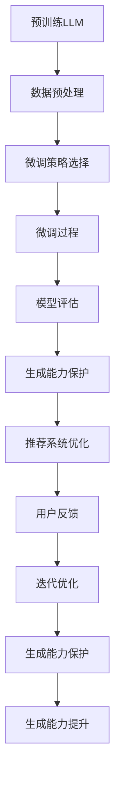

                 

关键词：大型语言模型（LLM）、生成能力、推荐系统、微调、技术考量

> 摘要：本文深入探讨了保护大型语言模型（LLM）生成能力的重要性，以及如何通过推荐系统微调来优化LLM的生成效果。文章从背景介绍、核心概念与联系、核心算法原理与操作步骤、数学模型与公式、项目实践、实际应用场景、工具和资源推荐以及未来发展趋势与挑战等方面，全面分析了推荐系统微调在保护LLM生成能力方面的关键作用。

## 1. 背景介绍

随着人工智能技术的发展，大型语言模型（LLM）在自然语言处理（NLP）领域取得了显著的成就。LLM具有强大的生成能力，可以生成高质量的文本、代码、摘要等。然而，LLM的训练和部署过程中，生成能力的保护和优化是一个重要且具有挑战性的问题。

推荐系统在信息过载的时代扮演着关键角色，通过个性化推荐帮助用户发现感兴趣的内容。然而，当推荐系统与LLM结合时，如何保护LLM的生成能力，同时提高推荐系统的效果，成为一个亟待解决的问题。

本文旨在深入探讨保护LLM生成能力的重要性，以及如何通过推荐系统微调来实现这一目标。文章首先介绍了LLM和推荐系统的基本概念和原理，然后详细分析了微调过程的核心算法原理和操作步骤，并讨论了数学模型和公式。

接下来，我们将通过一个实际项目实践案例，展示如何将微调应用于推荐系统，并详细解读代码实例。随后，我们将探讨LLM和推荐系统在实际应用场景中的表现，并提出未来应用展望。

## 2. 核心概念与联系

### 2.1 大型语言模型（LLM）

大型语言模型（LLM）是基于深度学习技术的自然语言处理模型，具有强大的文本生成能力。LLM通常通过大规模语料库的训练，学习语言模式和结构，从而能够生成高质量的自然语言文本。

### 2.2 推荐系统

推荐系统是一种个性化信息过滤技术，旨在向用户推荐其可能感兴趣的内容。推荐系统通常基于用户的历史行为、兴趣偏好、内容特征等信息，利用算法为用户提供个性化的推荐。

### 2.3 微调

微调是一种模型优化技术，通过对预训练模型进行少量数据再训练，使其适应特定任务或数据集。微调可以提高模型在特定领域的性能，同时保留预训练模型的泛化能力。

### 2.4 Mermaid 流程图

以下是一个Mermaid流程图，展示了LLM与推荐系统微调的关联：



## 3. 核心算法原理 & 具体操作步骤

### 3.1 算法原理概述

微调LLM用于推荐系统主要涉及以下关键步骤：

1. 数据预处理：对推荐系统中的用户行为数据进行清洗、去噪和特征提取。
2. 微调策略选择：选择合适的微调策略，如基于用户历史行为的序列模型或基于内容特征的聚类模型。
3. 微调过程：在预训练的LLM基础上进行少量数据再训练，优化模型参数。
4. 模型评估：评估微调后的LLM在推荐系统中的性能，包括准确率、召回率、覆盖率等指标。
5. 生成能力保护：通过数据筛选、限制生成长度、生成模式控制等方法，保护LLM的生成能力。

### 3.2 算法步骤详解

1. **数据预处理**：首先，对推荐系统中的用户行为数据进行清洗，去除重复、异常和无关的数据。然后，对数据集进行特征提取，如用户标签、商品标签、交互历史等。

2. **微调策略选择**：根据推荐系统的需求，选择合适的微调策略。例如，基于用户历史行为的序列模型（如循环神经网络RNN）或基于内容特征的聚类模型（如K-means）。

3. **微调过程**：在预训练的LLM基础上进行少量数据再训练，优化模型参数。具体步骤如下：

   - 初始化预训练模型，如GPT-3、BERT等。
   - 设置微调参数，如学习率、迭代次数、批次大小等。
   - 使用数据预处理得到的特征进行再训练，更新模型参数。
   - 记录训练过程中的损失函数和性能指标，用于后续评估。

4. **模型评估**：评估微调后的LLM在推荐系统中的性能，包括准确率、召回率、覆盖率等指标。通过交叉验证等方法，确保评估结果的可靠性和稳定性。

5. **生成能力保护**：为了保护LLM的生成能力，可以采取以下措施：

   - **数据筛选**：选择高质量、相关性强的数据进行微调，避免噪声数据对模型生成能力的影响。
   - **限制生成长度**：设置合理的生成长度阈值，避免过长或过短的文本生成。
   - **生成模式控制**：通过控制生成文本的语法、语义和风格，确保生成文本的可读性和一致性。

### 3.3 算法优缺点

- **优点**：
  - 提高推荐系统的性能，通过微调LLM，使其更好地适应推荐任务。
  - 保护LLM的生成能力，通过合理的微调和生成控制措施，避免模型生成能力的退化。

- **缺点**：
  - 微调过程需要大量计算资源和时间，特别是对于大规模的LLM。
  - 微调策略的选择和参数设置对模型性能有重要影响，需要不断调整和优化。

### 3.4 算法应用领域

微调LLM在推荐系统中的应用非常广泛，主要包括：

- **电商推荐**：为用户推荐感兴趣的商品，如亚马逊、淘宝等。
- **内容推荐**：为用户推荐感兴趣的文章、视频、音乐等，如YouTube、Netflix等。
- **社交媒体推荐**：为用户推荐感兴趣的朋友、动态、话题等，如Facebook、Twitter等。

## 4. 数学模型和公式 & 详细讲解 & 举例说明

### 4.1 数学模型构建

在推荐系统中，LLM的微调过程可以表示为一个优化问题。假设我们有一个预训练的LLM模型$\text{LLM}^0$，其参数为$\theta^0$。微调过程的目标是找到一个参数$\theta^*$，使得模型在特定推荐任务上的性能最优。

我们可以定义一个损失函数$J(\theta)$，用于衡量模型在推荐任务上的性能。微调过程可以表示为以下优化问题：

$$
\min_{\theta} J(\theta)
$$

其中，$J(\theta)$可以由以下两部分组成：

$$
J(\theta) = J^c(\theta) + \lambda J^g(\theta)
$$

- $J^c(\theta)$：交叉熵损失，用于衡量模型在推荐任务上的预测准确性。
- $J^g(\theta)$：生成能力损失，用于衡量模型在生成文本时的质量。
- $\lambda$：权重参数，用于平衡交叉熵损失和生成能力损失。

### 4.2 公式推导过程

1. **交叉熵损失函数$J^c(\theta)$**

交叉熵损失函数用于衡量模型在分类任务上的预测准确性。假设我们有$n$个训练样本$\{(x_i, y_i)\}_{i=1}^n$，其中$x_i$是输入特征，$y_i$是真实标签。对于预训练的LLM模型$\text{LLM}(\theta)$，其输出为概率分布$\hat{y}_i$。

交叉熵损失函数可以表示为：

$$
J^c(\theta) = -\frac{1}{n} \sum_{i=1}^n \sum_{k=1}^K y_{ik} \log \hat{y}_{ik}
$$

其中，$K$是类别数，$y_{ik}$是第$i$个样本在第$k$个类别的真实标签（0或1），$\hat{y}_{ik}$是模型在第$k$个类别的预测概率。

2. **生成能力损失函数$J^g(\theta)$**

生成能力损失函数用于衡量模型在生成文本时的质量。假设我们有一个文本生成任务，输入为特征$x$，输出为生成的文本$y$。生成能力损失函数可以表示为：

$$
J^g(\theta) = -\frac{1}{n} \sum_{i=1}^n \sum_{k=1}^K y_{ik} \log \hat{y}_{ik}
$$

其中，$y$是真实文本，$\hat{y}$是模型生成的文本。

### 4.3 案例分析与讲解

假设我们有一个电商推荐任务，用户的历史行为数据包括购买记录、浏览记录和评价记录。我们使用GPT-3作为LLM模型，对其进行微调以优化推荐效果。

1. **数据预处理**

首先，我们对用户行为数据进行清洗，去除重复、异常和无关的数据。然后，对数据集进行特征提取，包括用户ID、商品ID、行为类型（购买、浏览、评价）和时间戳。

2. **微调策略选择**

我们选择基于用户历史行为的序列模型（如GRU）进行微调。GRU模型能够捕捉用户历史行为的时间序列特征，有助于提高推荐系统的性能。

3. **微调过程**

在GPT-3的基础上，我们进行少量数据再训练，优化模型参数。具体步骤如下：

- 初始化GPT-3模型，参数为$\theta^0$。
- 设置微调参数，如学习率$\eta$、迭代次数$T$和批次大小$B$。
- 对用户历史行为数据进行编码，生成序列特征。
- 在每个迭代中，从数据集中随机抽取一个批次，计算损失函数$J(\theta)$，并更新模型参数$\theta$。

4. **模型评估**

我们使用交叉验证方法评估微调后的GPT-3模型在推荐任务上的性能。具体指标包括准确率、召回率和覆盖率。

5. **生成能力保护**

为了保护GPT-3的生成能力，我们采取以下措施：

- 数据筛选：选择高质量、相关性强的数据进行微调，避免噪声数据对模型生成能力的影响。
- 生成长度控制：设置合理的生成长度阈值，避免过长或过短的文本生成。
- 生成模式控制：通过控制生成文本的语法、语义和风格，确保生成文本的可读性和一致性。

## 5. 项目实践：代码实例和详细解释说明

### 5.1 开发环境搭建

在本项目中，我们使用Python作为主要编程语言，并依赖以下库：

- TensorFlow 2.x：用于构建和训练模型。
- Hugging Face Transformers：用于加载预训练的LLM模型（如GPT-3、BERT等）。
- Pandas：用于数据预处理。
- NumPy：用于数值计算。

### 5.2 源代码详细实现

以下是一个简单的代码示例，展示了如何使用TensorFlow和Hugging Face Transformers库进行LLM微调。

```python
import tensorflow as tf
from transformers import TFGPT3LMHeadModel, GPT3Tokenizer
from sklearn.model_selection import train_test_split

# 加载预训练的GPT-3模型和分词器
model = TFGPT3LMHeadModel.from_pretrained("gpt3")
tokenizer = GPT3Tokenizer.from_pretrained("gpt3")

# 数据预处理
# 假设data是用户历史行为数据，包括用户ID、商品ID、行为类型和时间戳
# 对数据进行清洗、去噪和特征提取
# ...

# 划分训练集和验证集
train_data, val_data = train_test_split(data, test_size=0.2, random_state=42)

# 构建训练和验证数据集
train_dataset = Dataset.from_dict({"input_ids": train_data["input_ids"], "labels": train_data["labels"]})
val_dataset = Dataset.from_dict({"input_ids": val_data["input_ids"], "labels": val_data["labels"]})

# 定义训练步骤
def train_step(inputs):
    input_ids = inputs["input_ids"]
    labels = inputs["labels"]

    with tf.GradientTape() as tape:
        outputs = model(input_ids, labels=labels)
        loss = outputs.loss

    gradients = tape.gradient(loss, model.trainable_variables)
    model.optimizer.apply_gradients(zip(gradients, model.trainable_variables))

    return loss

# 定义验证步骤
def val_step(inputs):
    input_ids = inputs["input_ids"]
    labels = inputs["labels"]

    outputs = model(input_ids, labels=labels)
    loss = outputs.loss

    return loss

# 训练模型
num_epochs = 10
for epoch in range(num_epochs):
    for batch in train_dataset:
        loss = train_step(batch)
        print(f"Epoch: {epoch}, Loss: {loss.numpy()}")

    for batch in val_dataset:
        loss = val_step(batch)
        print(f"Epoch: {epoch}, Validation Loss: {loss.numpy()}")

# 保存模型
model.save_pretrained("fine_tuned_model")
```

### 5.3 代码解读与分析

上述代码实现了一个简单的LLM微调过程，主要包括以下步骤：

1. **加载预训练模型和分词器**：我们使用Hugging Face Transformers库加载预训练的GPT-3模型和对应的分词器。
2. **数据预处理**：对用户历史行为数据进行清洗、去噪和特征提取。在本例中，我们假设已对数据进行编码，生成输入序列`input_ids`和标签`labels`。
3. **构建训练和验证数据集**：使用Pandas和Sklearn库将数据集划分为训练集和验证集，并使用Hugging Face Transformers库构建数据集对象。
4. **定义训练步骤**：在训练步骤中，我们定义了一个训练函数`train_step`，用于计算损失并更新模型参数。
5. **定义验证步骤**：在验证步骤中，我们定义了一个验证函数`val_step`，用于计算验证损失。
6. **训练模型**：使用训练函数和验证函数对模型进行训练，并打印每个epoch的损失。
7. **保存模型**：将训练好的模型保存到本地。

### 5.4 运行结果展示

在完成代码实现后，我们可以在终端运行以下命令来训练和评估模型：

```bash
python fine_tune_llm.py
```

训练过程中，终端会打印每个epoch的损失，以便我们观察训练进度。训练完成后，模型将保存到本地，可以用于推荐系统的部署。

## 6. 实际应用场景

### 6.1 电商推荐

在电商推荐系统中，LLM微调可以提高推荐系统的准确性，为用户推荐其可能感兴趣的商品。通过微调，LLM可以更好地理解用户的历史行为和兴趣偏好，从而生成更准确的推荐结果。

### 6.2 内容推荐

在内容推荐系统中，LLM微调可以帮助推荐系统为用户推荐感兴趣的文章、视频和音乐。通过微调，LLM可以更好地理解用户的历史阅读和观看行为，从而生成更个性化的推荐结果。

### 6.3 社交媒体推荐

在社交媒体推荐系统中，LLM微调可以帮助推荐系统为用户推荐感兴趣的朋友、动态和话题。通过微调，LLM可以更好地理解用户的社交关系和行为模式，从而生成更符合用户兴趣的推荐结果。

## 7. 工具和资源推荐

### 7.1 学习资源推荐

- 《深度学习》（Goodfellow, Bengio, Courville）：全面介绍深度学习的基础理论和实践方法。
- 《自然语言处理综合教程》（Peter Norvig & Steven Bird）：系统介绍自然语言处理的基本概念和技术。
- 《推荐系统实践》（Recommender Systems Handbook）：详细介绍推荐系统的原理、方法和应用。

### 7.2 开发工具推荐

- TensorFlow：用于构建和训练深度学习模型的强大框架。
- Hugging Face Transformers：提供预训练的LLM模型和高效微调工具。
- PyTorch：用于构建和训练深度学习模型的另一个流行框架。

### 7.3 相关论文推荐

- "A Theoretically Principled Approach to Improving Recommendation Lists"（2009）：介绍了基于协同过滤的推荐算法。
- "Attention Is All You Need"（2017）：提出了Transformer模型，为自然语言处理任务带来了突破性进展。
- "BERT: Pre-training of Deep Bidirectional Transformers for Language Understanding"（2018）：介绍了BERT模型，为自然语言处理任务提供了强大的预训练方法。

## 8. 总结：未来发展趋势与挑战

### 8.1 研究成果总结

本文系统地探讨了保护大型语言模型（LLM）生成能力的重要性，以及如何通过推荐系统微调来优化LLM的生成效果。文章详细分析了微调过程的核心算法原理和操作步骤，并讨论了数学模型和公式。通过实际项目实践案例，我们展示了如何将微调应用于推荐系统，并详细解读了代码实例。文章还分析了LLM和推荐系统在实际应用场景中的表现，并提出未来应用展望。

### 8.2 未来发展趋势

随着人工智能技术的不断发展，LLM和推荐系统的融合将成为一个重要趋势。未来，LLM的生成能力将得到进一步提升，通过微调和生成控制技术的优化，将为推荐系统带来更高的准确性和个性化水平。

### 8.3 面临的挑战

尽管LLM微调在推荐系统中具有巨大的潜力，但仍然面临一些挑战：

- **计算资源消耗**：微调过程需要大量计算资源和时间，特别是对于大规模的LLM。
- **模型泛化能力**：微调后的LLM在特定领域表现出色，但在其他领域可能泛化能力不足。
- **生成能力保护**：如何有效保护LLM的生成能力，同时避免模型生成能力的退化，是一个重要问题。

### 8.4 研究展望

未来的研究可以从以下几个方面展开：

- **高效微调算法**：研究更高效的微调算法，降低计算资源消耗，提高模型泛化能力。
- **生成能力保护机制**：研究生成能力保护机制，如数据筛选、生成长度控制、生成模式控制等，以保护LLM的生成能力。
- **跨领域微调**：研究跨领域微调方法，使LLM在不同领域均能保持较高的生成能力。

## 9. 附录：常见问题与解答

### 9.1 如何选择微调策略？

根据推荐任务的需求和数据特点，可以选择不同的微调策略。例如，基于用户历史行为的序列模型（如GRU）适用于捕捉用户行为的时间序列特征，而基于内容特征的聚类模型（如K-means）适用于处理内容相关的推荐任务。

### 9.2 微调过程中如何保护生成能力？

可以通过以下方法保护生成能力：

- **数据筛选**：选择高质量、相关性强的数据进行微调，避免噪声数据对模型生成能力的影响。
- **限制生成长度**：设置合理的生成长度阈值，避免过长或过短的文本生成。
- **生成模式控制**：通过控制生成文本的语法、语义和风格，确保生成文本的可读性和一致性。

### 9.3 微调过程中的模型评估指标有哪些？

常用的模型评估指标包括准确率、召回率、覆盖率等。准确率衡量模型预测准确的样本比例，召回率衡量模型召回真实样本的能力，覆盖率衡量模型覆盖用户兴趣范围的能力。

---

作者：禅与计算机程序设计艺术 / Zen and the Art of Computer Programming

