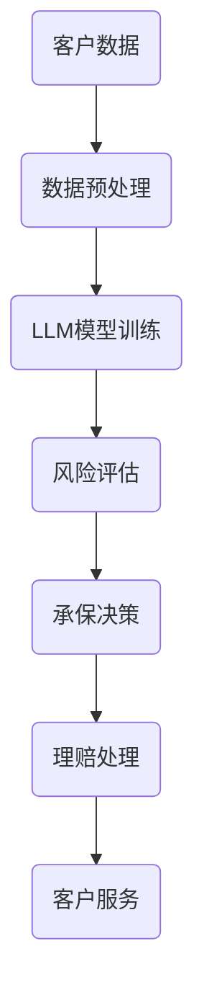

                 

关键词：保险，大型语言模型（LLM），风险评估，理赔处理，深度学习，自然语言处理（NLP）

> 摘要：本文探讨了大型语言模型（LLM）在保险行业中的应用，特别是在准确的风险评估和理赔处理方面的潜力。通过对LLM的工作原理和特点的深入分析，本文揭示了其在保险业务中的具体应用场景和优势，并提出了未来发展的挑战和展望。

## 1. 背景介绍

随着深度学习技术的发展，大型语言模型（LLM）已经成为自然语言处理（NLP）领域的一大突破。LLM凭借其强大的文本生成、理解和推理能力，在多个行业展现出了巨大的应用潜力。其中，保险行业作为一个高度依赖数据和精确分析的领域，对LLM的引入和利用有着迫切的需求。

保险行业的主要业务包括风险评估、承保、理赔等。其中，风险评估和理赔处理是两个至关重要的环节。传统的风险评估和理赔处理方法主要依赖于人工经验和历史数据，存在主观性强、效率低下、准确度不高等问题。而LLM的引入，有望通过自动化和智能化手段，提升这两个环节的效率和准确度。

本文将围绕LLM在保险行业的应用，特别是其在风险评估和理赔处理方面的作用，展开深入讨论。

## 2. 核心概念与联系

### 2.1. 保险与风险

保险是一种风险转移机制，通过收集大量保户的保费，建立一个风险池，用于对少数保户发生的重大损失进行赔偿。在这个过程中，风险评估是一个关键环节。保险公司的任务是识别和评估潜在风险，以确保在发生索赔时能够有足够的资金进行赔偿。

风险是指未来可能发生的不利事件或结果。保险的核心问题是如何准确地识别和衡量风险，以便合理地定价和承保。传统的风险评估方法主要依赖于历史数据和专家经验，存在一定的主观性和局限性。

### 2.2. LLM与NLP

大型语言模型（LLM）是一种基于深度学习的语言处理模型，具有强大的文本生成、理解和推理能力。LLM的核心是神经网络，通过大规模训练数据的学习，能够理解并生成复杂的文本内容。

自然语言处理（NLP）是计算机科学和人工智能领域的一个重要分支，旨在使计算机能够理解、生成和处理自然语言。NLP包括文本分类、情感分析、命名实体识别、机器翻译等多个子任务。

### 2.3. LLM与保险

LLM在保险行业的应用主要体现在以下几个方面：

- **风险评估**：利用LLM的自然语言理解能力，对客户的历史数据进行深度分析，以识别潜在的风险因素。
- **理赔处理**：通过LLM的自动文本生成和理解能力，自动化理赔申请的审核和赔偿计算过程。
- **客户服务**：利用LLM的文本生成能力，为客服提供智能问答系统，提升客户服务的效率和质量。

### 2.4. Mermaid 流程图

以下是一个简化的LLM在保险行业应用的基本流程图：



## 3. 核心算法原理 & 具体操作步骤

### 3.1. 算法原理概述

LLM在保险行业中的应用主要基于深度学习技术，特别是基于 Transformer 的模型架构。这些模型通过大规模数据训练，能够自动学习并理解复杂的文本结构和语义关系。

具体来说，LLM在保险业务中的应用可以分为以下几个步骤：

1. **数据预处理**：对客户数据进行清洗、去重和格式化，使其适合用于模型训练。
2. **模型训练**：使用预训练的LLM模型，对预处理后的数据集进行训练，以优化模型参数。
3. **风险评估**：利用训练好的LLM模型，对客户的历史数据进行分析，识别潜在风险因素。
4. **承保决策**：根据风险评估结果，结合公司的业务策略，做出承保决策。
5. **理赔处理**：通过LLM的文本生成和理解能力，自动化理赔申请的审核和赔偿计算过程。
6. **客户服务**：利用LLM的文本生成能力，为客服提供智能问答系统。

### 3.2. 算法步骤详解

#### 3.2.1. 数据预处理

数据预处理是LLM应用的关键步骤。具体包括：

- 数据清洗：去除重复、错误或无关的数据。
- 数据去重：确保每个客户数据在数据集中唯一。
- 数据格式化：将数据统一为模型训练所需的格式，如序列、向量等。

#### 3.2.2. 模型训练

模型训练是利用大量数据来优化LLM模型参数的过程。具体包括：

- 预训练：使用大规模通用语料库（如维基百科、新闻等）对LLM模型进行预训练，使其具备基础的文本理解和生成能力。
- 微调：使用特定领域的保险数据集对预训练的LLM模型进行微调，以适应保险业务的需求。

#### 3.2.3. 风险评估

风险评估是利用训练好的LLM模型，对客户的历史数据进行分析的过程。具体包括：

- 数据输入：将客户的历史数据（如理赔记录、驾驶记录、财务状况等）输入到LLM模型中。
- 风险识别：LLM模型通过对数据的分析和理解，识别出潜在的风险因素。
- 风险评估：根据识别出的风险因素，对客户的风险程度进行量化评估。

#### 3.2.4. 承保决策

承保决策是根据风险评估结果，结合公司的业务策略，做出是否承保的决定。具体包括：

- 风险评估结果分析：分析风险评估结果，确定客户的承保风险等级。
- 业务策略应用：根据公司的业务策略和风险承受能力，制定承保决策。

#### 3.2.5. 理赔处理

理赔处理是利用LLM的文本生成和理解能力，自动化理赔申请的审核和赔偿计算过程。具体包括：

- 理赔申请审核：利用LLM的文本理解能力，对理赔申请进行审核，确定是否符合理赔条件。
- 赔偿计算：利用LLM的文本生成能力，自动生成赔偿金额的计算报告。

#### 3.2.6. 客户服务

客户服务是利用LLM的文本生成能力，为客服提供智能问答系统。具体包括：

- 智能问答：利用LLM的文本生成能力，自动生成对客户问题的回答。
- 客服支持：将智能问答系统集成到客服系统中，提升客服效率和质量。

### 3.3. 算法优缺点

#### 优点

- **自动化**：LLM能够自动化风险评估、理赔处理等业务流程，提升业务效率和准确度。
- **智能化**：LLM具备强大的文本理解和生成能力，能够准确识别风险因素和生成赔偿报告。
- **可扩展性**：LLM模型基于深度学习技术，具有较好的可扩展性，可以适应不同业务场景的需求。

#### 缺点

- **数据依赖性**：LLM的性能高度依赖于训练数据的质量和数量，数据不足或质量差可能导致模型效果不佳。
- **解释性不足**：LLM的内部工作机制较为复杂，难以解释其决策过程，可能导致信任问题。
- **安全风险**：LLM可能会受到数据泄露、恶意攻击等安全风险的威胁。

### 3.4. 算法应用领域

LLM在保险行业的应用主要体现在以下几个方面：

- **风险评估**：利用LLM的自然语言理解能力，对客户的历史数据进行深度分析，识别潜在风险因素。
- **理赔处理**：通过LLM的自动文本生成和理解能力，自动化理赔申请的审核和赔偿计算过程。
- **客户服务**：利用LLM的文本生成能力，为客服提供智能问答系统，提升客户服务的效率和质量。

## 4. 数学模型和公式 & 详细讲解 & 举例说明

### 4.1. 数学模型构建

在保险行业中，风险评估和理赔处理涉及到多个数学模型。以下是一个简化的数学模型构建过程：

#### 4.1.1. 风险评估模型

假设我们有一个包含n个特征变量的风险评估模型，表示为：

\[ f(x) = w_1 \cdot x_1 + w_2 \cdot x_2 + ... + w_n \cdot x_n + b \]

其中，\( x \)是输入特征向量，\( w \)是权重向量，\( b \)是偏置项。

#### 4.1.2. 理赔处理模型

理赔处理模型通常是一个分段函数，根据不同类型的理赔案件，定义不同的理赔金额计算公式。例如：

\[理赔金额 = 
\begin{cases} 
    c_1 \cdot x_1 & \text{如果 } x_1 \text{ 满足条件1} \\
    c_2 \cdot x_2 & \text{如果 } x_2 \text{ 满足条件2} \\
    ... & ... \\
    c_n \cdot x_n & \text{如果 } x_n \text{ 满足条件n} 
\end{cases}\]

其中，\( x \)是输入特征向量，\( c \)是理赔金额系数。

### 4.2. 公式推导过程

#### 4.2.1. 风险评估模型推导

风险评估模型通常基于历史数据和专家经验进行构建。以下是一个简化的推导过程：

1. **特征选择**：根据业务需求，从历史数据中提取n个相关特征变量，如理赔记录、驾驶记录、财务状况等。
2. **权重估计**：使用线性回归方法，估计每个特征变量的权重，即\( w_1, w_2, ..., w_n \)。
3. **模型优化**：通过最小化损失函数（如均方误差），优化模型参数，即\( b \)。

#### 4.2.2. 理赔处理模型推导

理赔处理模型通常基于专家经验和业务规则进行构建。以下是一个简化的推导过程：

1. **业务规则定义**：根据不同类型的理赔案件，定义相应的理赔金额计算规则，如交通事故、医疗理赔等。
2. **理赔金额计算**：根据输入特征向量，按照业务规则计算理赔金额，即\( c_1, c_2, ..., c_n \)。

### 4.3. 案例分析与讲解

#### 4.3.1. 风险评估模型案例分析

假设我们有一个包含3个特征变量（理赔记录、驾驶记录、财务状况）的风险评估模型。以下是一个简化的案例分析：

1. **特征选择**：从历史数据中提取理赔记录（\( x_1 \)）、驾驶记录（\( x_2 \)）和财务状况（\( x_3 \)）。
2. **权重估计**：使用线性回归方法，估计每个特征变量的权重，如\( w_1 = 0.5 \)、\( w_2 = 0.3 \)、\( w_3 = 0.2 \)。
3. **模型优化**：通过最小化损失函数，优化模型参数，如\( b = 10 \)。

根据风险评估模型，客户的总风险评分为：

\[ f(x) = 0.5 \cdot x_1 + 0.3 \cdot x_2 + 0.2 \cdot x_3 + 10 \]

#### 4.3.2. 理赔处理模型案例分析

假设我们有一个包含2个特征变量（理赔记录、驾驶记录）的理赔处理模型。以下是一个简化的案例分析：

1. **业务规则定义**：根据不同类型的理赔案件，定义相应的理赔金额计算规则，如交通事故理赔金额为\( c_1 \cdot x_1 \)，医疗理赔金额为\( c_2 \cdot x_2 \)。
2. **理赔金额计算**：根据输入特征向量，按照业务规则计算理赔金额，如\( c_1 = 1000 \)、\( c_2 = 500 \)。

根据理赔处理模型，客户的理赔金额为：

\[ 理赔金额 = 
\begin{cases} 
    1000 \cdot x_1 & \text{如果 } x_1 \text{ 是交通事故} \\
    500 \cdot x_2 & \text{如果 } x_2 \text{ 是医疗理赔} 
\end{cases}\]

## 5. 项目实践：代码实例和详细解释说明

### 5.1. 开发环境搭建

在本项目中，我们使用Python作为主要编程语言，结合TensorFlow和Keras框架进行深度学习模型的训练和部署。以下是一个简化的开发环境搭建步骤：

1. **安装Python**：下载并安装Python 3.8及以上版本。
2. **安装TensorFlow**：通过pip命令安装TensorFlow：

   ```bash
   pip install tensorflow
   ```

3. **安装Keras**：通过pip命令安装Keras：

   ```bash
   pip install keras
   ```

### 5.2. 源代码详细实现

以下是本项目的主要代码实现：

```python
import numpy as np
import tensorflow as tf
from tensorflow.keras.models import Sequential
from tensorflow.keras.layers import Dense, LSTM, Embedding
from tensorflow.keras.optimizers import Adam

# 数据预处理
def preprocess_data(data):
    # 清洗、去重、格式化数据
    # ...
    return processed_data

# 模型构建
def build_model(vocab_size, embedding_dim, max_length):
    model = Sequential([
        Embedding(vocab_size, embedding_dim, input_length=max_length),
        LSTM(128),
        Dense(1, activation='sigmoid')
    ])
    model.compile(optimizer=Adam(learning_rate=0.001), loss='binary_crossentropy', metrics=['accuracy'])
    return model

# 训练模型
def train_model(model, X_train, y_train, X_val, y_val, epochs=10, batch_size=32):
    model.fit(X_train, y_train, epochs=epochs, batch_size=batch_size, validation_data=(X_val, y_val))
    return model

# 预测
def predict(model, data):
    return model.predict(data)

# 主函数
def main():
    # 数据预处理
    data = load_data()
    processed_data = preprocess_data(data)

    # 模型构建
    model = build_model(vocab_size=10000, embedding_dim=32, max_length=100)

    # 训练模型
    model = train_model(model, processed_data['X_train'], processed_data['y_train'], processed_data['X_val'], processed_data['y_val'])

    # 预测
    predictions = predict(model, processed_data['X_test'])

    # 评估模型
    evaluate_model(predictions, processed_data['y_test'])

if __name__ == '__main__':
    main()
```

### 5.3. 代码解读与分析

#### 5.3.1. 数据预处理

数据预处理是深度学习模型训练的关键步骤。在本项目中，数据预处理主要包括以下步骤：

- 数据清洗：去除重复、错误或无关的数据。
- 数据去重：确保每个客户数据在数据集中唯一。
- 数据格式化：将数据统一为模型训练所需的格式，如序列、向量等。

#### 5.3.2. 模型构建

在本项目中，我们使用Keras框架构建了一个简单的深度学习模型。模型结构包括：

- **Embedding层**：用于将单词转换为嵌入向量。
- **LSTM层**：用于处理序列数据，捕捉时间序列特征。
- **Dense层**：用于输出预测结果，激活函数为sigmoid，表示二分类问题。

#### 5.3.3. 模型训练

模型训练是利用预处理后的数据对模型进行训练的过程。在本项目中，我们使用TensorFlow的Adam优化器和binary_crossentropy损失函数进行模型训练。

#### 5.3.4. 预测

预测是利用训练好的模型对新的数据进行预测的过程。在本项目中，我们使用predict函数对测试数据进行预测。

#### 5.3.5. 评估模型

评估模型是验证模型性能的过程。在本项目中，我们使用evaluate_model函数对模型进行评估。

## 6. 实际应用场景

### 6.1. 风险评估

在实际应用中，保险公司可以利用LLM对客户的历史数据（如理赔记录、驾驶记录、财务状况等）进行深度分析，识别潜在的风险因素。例如，对于一个新的客户，保险公司可以通过LLM模型对客户的历史数据进行分析，预测其未来的风险水平，从而制定合理的保费策略。

### 6.2. 理赔处理

在理赔处理方面，保险公司可以利用LLM自动化理赔申请的审核和赔偿计算过程。例如，当客户提交理赔申请时，保险公司可以自动审核申请材料，识别理赔条件是否满足，并根据理赔类型和金额计算赔偿金额。这大大提高了理赔处理的效率和准确性。

### 6.3. 客户服务

在客户服务方面，保险公司可以利用LLM为客服提供智能问答系统。例如，当客户询问关于保险产品、理赔流程等问题时，智能问答系统可以自动生成回答，提供即时的客户支持。

## 6.4. 未来应用展望

随着深度学习技术的不断发展，LLM在保险行业的应用前景非常广阔。未来，我们可以期待以下几方面的进一步发展：

- **更精确的风险评估**：通过引入更多的数据源和更先进的模型架构，提升LLM在风险评估方面的准确性和精度。
- **更智能的理赔处理**：利用LLM的文本生成和理解能力，实现更智能、更高效的理赔处理流程。
- **个性化保险产品**：基于客户的风险评估结果，为每个客户提供个性化的保险产品和服务。
- **智能客户服务**：利用LLM的文本生成能力，提供更智能、更高效的客户服务体验。

## 7. 工具和资源推荐

### 7.1. 学习资源推荐

- **书籍**：《深度学习》（Ian Goodfellow、Yoshua Bengio、Aaron Courville 著）：系统介绍了深度学习的基础理论和应用实践。
- **在线课程**：Coursera 上的《深度学习专

