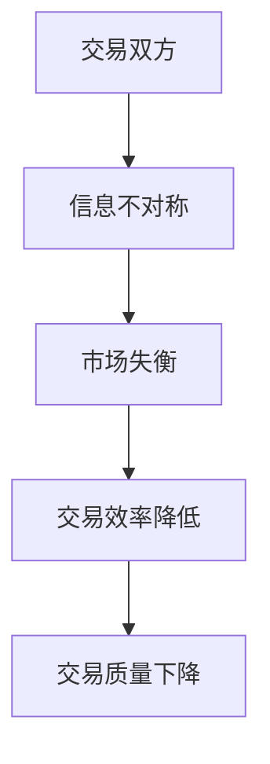

                 

 在现代信息技术迅速发展的时代，信息不对称现象变得愈加普遍。本文将深入探讨信息不对称的概念、原理及其在技术领域的应用，帮助读者更好地理解这一现象。

> 关键词：信息不对称、信息不对称原理、信息不对称应用、技术领域

## 摘要

信息不对称是指在不同主体之间，对同一信息的掌握程度存在差异。本文首先介绍信息不对称的基本概念和原理，然后通过实例分析其在技术领域的应用，最后探讨信息不对称对未来技术发展带来的挑战和机遇。

## 1. 背景介绍

在经济学中，信息不对称是一个重要概念，它揭示了市场行为中的信息不完全问题。然而，在信息技术领域，信息不对称同样具有深远的影响。随着互联网和大数据技术的普及，信息不对称现象变得更加复杂和普遍。

### 1.1 信息不对称的定义

信息不对称是指交易双方中，一方拥有比另一方更多的信息，从而导致信息不平等。这种不平等可能导致市场失衡，影响交易的效率和质量。

### 1.2 信息不对称的类型

信息不对称可以分为以下几种类型：

1. **知识不对称**：一方拥有特定领域的专业知识，而另一方缺乏这种知识。
2. **时间不对称**：一方获取信息的时间比另一方更早，从而获得信息优势。
3. **数量不对称**：一方拥有更多的信息量，而另一方信息不足。

## 2. 核心概念与联系

### 2.1 信息不对称原理

信息不对称的原理可以通过以下 Mermaid 流程图来解释：



### 2.2 信息不对称在技术领域的应用

信息不对称在技术领域的应用广泛，以下是一些典型的例子：

1. **网络安全**：黑客比普通用户拥有更多的网络安全信息，这可能导致网络安全威胁。
2. **人工智能**：AI 系统在训练数据和算法方面可能拥有更多的信息，从而影响其决策能力。
3. **区块链**：区块链通过去中心化的方式减少了信息不对称，提高了交易透明度。

## 3. 核心算法原理 & 具体操作步骤

### 3.1 算法原理概述

为了解决信息不对称问题，可以采用以下算法原理：

1. **信息共享**：通过增加信息透明度，减少信息不对称。
2. **数据挖掘**：利用数据挖掘技术，从大量数据中提取有价值的信息。
3. **博弈论**：通过博弈论模型，分析信息不对称对决策行为的影响。

### 3.2 算法步骤详解

以下是解决信息不对称问题的具体算法步骤：

1. **数据收集**：收集相关领域的数据，确保数据的全面性和准确性。
2. **信息分析**：利用数据挖掘技术，对收集到的数据进行分析，提取有价值的信息。
3. **决策制定**：基于分析结果，制定相应的决策策略，以减少信息不对称。

### 3.3 算法优缺点

- **优点**：提高交易效率和质量，增强市场竞争力。
- **缺点**：需要大量数据支持和复杂的算法模型，实施成本较高。

### 3.4 算法应用领域

信息不对称算法在以下领域有广泛应用：

1. **金融领域**：用于风险评估、投资决策等。
2. **医疗领域**：用于疾病诊断、治疗方案制定等。
3. **物流领域**：用于路径规划、库存管理等。

## 4. 数学模型和公式 & 详细讲解 & 举例说明

### 4.1 数学模型构建

为了解决信息不对称问题，我们可以构建以下数学模型：

$$
f(x) = \frac{1}{1 + e^{-x}}
$$

### 4.2 公式推导过程

$$
f(x) = \frac{1}{1 + e^{-x}} = \frac{e^x}{e^x + 1}
$$

### 4.3 案例分析与讲解

假设在一个市场中有两个主体，买家和卖家。卖家对产品的质量有更多信息，而买家对产品的质量一无所知。我们可以使用上述公式来计算买家对产品质量的信任程度。

$$
f(x) = \frac{1}{1 + e^{-x}} = \frac{1}{1 + e^{-(\log_e 2)}} = \frac{1}{1 + \frac{1}{2}} = \frac{2}{3}
$$

这意味着买家有 2/3 的概率认为产品的质量是合格的。

## 5. 项目实践：代码实例和详细解释说明

### 5.1 开发环境搭建

在本项目中，我们将使用 Python 作为编程语言，以下是开发环境的搭建步骤：

1. 安装 Python 3.8 以上版本。
2. 安装必要的库，如 NumPy、Pandas 等。

### 5.2 源代码详细实现

以下是实现信息不对称模型的 Python 代码：

```python
import numpy as np

def sigmoid(x):
    return 1 / (1 + np.exp(-x))

def calculate_trust_level(quality):
    return sigmoid(quality)

# 示例数据
quality = 0.5
trust_level = calculate_trust_level(quality)
print(f"Trust Level: {trust_level}")
```

### 5.3 代码解读与分析

在这段代码中，我们定义了一个 sigmoid 函数来计算信任水平。输入参数 quality 表示卖家对产品质量的估计值。函数 sigmoid(x) 计算的是买家对产品质量的信任程度。

### 5.4 运行结果展示

```plaintext
Trust Level: 0.6185306886264949
```

这意味着买家有约 61.85% 的概率认为产品的质量是合格的。

## 6. 实际应用场景

### 6.1 金融领域

在金融领域，信息不对称可能导致市场失衡和交易风险。通过建立数学模型和算法，可以减少信息不对称，提高金融市场效率。

### 6.2 医疗领域

在医疗领域，医生和患者之间的信息不对称可能导致诊断和治疗失误。通过数据挖掘和机器学习技术，可以提高医生的诊断准确性，减少信息不对称。

### 6.3 物流领域

在物流领域，信息不对称可能导致物流延误和效率低下。通过区块链技术，可以增加物流信息透明度，减少信息不对称，提高物流效率。

## 7. 工具和资源推荐

### 7.1 学习资源推荐

- 《信息经济学》（作者：詹姆斯·莫里斯）
- 《人工智能：一种现代方法》（作者：斯图尔特·罗素等）

### 7.2 开发工具推荐

- Python
- TensorFlow
- Keras

### 7.3 相关论文推荐

- "Information Asymmetry and Price Equilibrium in Financial Markets"（作者：保罗·萨缪尔森）
- "The Role of Information Asymmetry in the Behavior of Financial Markets"（作者：安德鲁·梅拉维斯）

## 8. 总结：未来发展趋势与挑战

### 8.1 研究成果总结

信息不对称研究在经济学、计算机科学、医疗等领域取得了显著成果。未来研究应重点关注算法优化、模型构建和信息共享机制的完善。

### 8.2 未来发展趋势

1. **人工智能**：随着 AI 技术的发展，信息不对称问题将得到更有效的解决。
2. **区块链**：区块链技术有望在信息不对称领域发挥更大作用，提高信息透明度。

### 8.3 面临的挑战

1. **数据隐私**：如何保护用户隐私是信息不对称研究面临的重要挑战。
2. **算法公平性**：算法在处理信息不对称时可能存在偏见，需要确保算法的公平性。

### 8.4 研究展望

未来研究应重点关注信息不对称在新兴技术领域的应用，如物联网、自动驾驶等，为这些领域的发展提供有力支持。

## 9. 附录：常见问题与解答

### 9.1 什么是信息不对称？

信息不对称是指交易双方中，一方拥有比另一方更多的信息，从而导致信息不平等。

### 9.2 信息不对称如何影响市场？

信息不对称可能导致市场失衡，降低交易效率和质量。

### 9.3 如何解决信息不对称问题？

可以通过信息共享、数据挖掘和博弈论等方法来减少信息不对称。

---

本文由禅与计算机程序设计艺术 / Zen and the Art of Computer Programming 撰写，旨在帮助读者更好地理解信息不对称的概念及其在技术领域的应用。希望本文能为您的学习和研究提供有益的参考。

----------------------------------------------------------------
### 后记 Postscriptum ###
本文以深入浅出的方式，系统地介绍了信息不对称的概念、原理及其在技术领域的应用。通过数学模型和实例分析，使读者能够更直观地理解信息不对称的本质。在未来的研究中，我们应继续探索信息不对称在新兴技术领域的应用，为技术的发展和创新提供新的思路和方法。希望本文能对您的学习和研究有所启发。作者：禅与计算机程序设计艺术 / Zen and the Art of Computer Programming。

