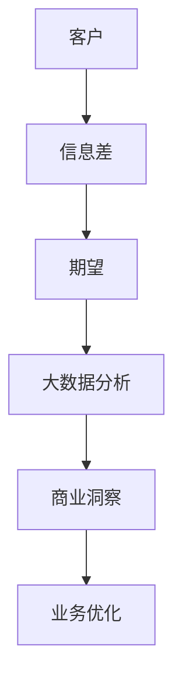

                 

关键词：信息差、商业客户期望、大数据、个性化服务、智能分析、用户体验

> 摘要：随着大数据技术的迅猛发展，商业客户期望的管理变得愈加复杂。本文探讨了如何通过大数据分析来捕捉客户信息差，进而精确满足客户期望，提升企业竞争力。

## 1. 背景介绍

在互联网和大数据时代，客户期望已经发生了深刻变化。传统的商业模式越来越难以满足消费者个性化的需求。客户不仅期望得到高质量的产品和服务，更期待得到个性化的关注和定制化的体验。因此，如何有效地管理客户期望，成为了企业提升竞争力的重要课题。

大数据技术的兴起，为商业客户期望的管理提供了新的可能性。通过分析海量数据，企业能够深入了解客户的消费行为、偏好和需求，从而实现精准营销和个性化服务。然而，如何从大数据中提取有价值的信息，并将其转化为实际的业务价值，依然是一个需要深入探讨的问题。

## 2. 核心概念与联系

### 2.1. 信息差

信息差是指一个个体相对于另一个个体拥有更多的信息，从而在交易中占据优势地位。在商业环境中，信息差可以表现为客户对企业产品或服务的认知程度差异、企业对市场需求的了解程度差异等。

### 2.2. 商业客户期望

商业客户期望是指客户对产品或服务的预期和需求，包括产品质量、服务体验、价格、售后保障等多个方面。有效的客户期望管理，可以帮助企业提高客户满意度和忠诚度。

### 2.3. 大数据

大数据是指无法使用常规数据处理软件进行捕捉、管理和处理的数据集合。大数据的特点是数据量大、类型多、速度快，因此需要采用特定的技术和算法进行分析。

下面是关于信息差、客户期望与大数据之间关系的一个Mermaid流程图：



## 3. 核心算法原理 & 具体操作步骤

### 3.1 算法原理概述

大数据满足客户期望的核心算法原理是基于机器学习和数据挖掘技术，通过分析海量数据，提取客户特征和需求，从而实现个性化推荐和服务。

### 3.2 算法步骤详解

1. 数据采集：收集客户的历史消费数据、搜索记录、社交媒体行为等。
2. 数据预处理：对采集到的数据进行清洗、去重和归一化处理。
3. 特征提取：利用数据挖掘算法，提取客户行为特征和需求特征。
4. 模型训练：使用机器学习算法，构建客户期望预测模型。
5. 模型评估：通过交叉验证等方法评估模型性能。
6. 预测应用：将模型应用于实际业务场景，实现个性化推荐和服务。

### 3.3 算法优缺点

优点：
- 提高客户满意度：通过个性化推荐和服务，满足客户的多样化需求。
- 提升业务效率：自动化分析客户数据，降低人工成本。

缺点：
- 数据隐私风险：需要收集和处理大量客户数据，可能涉及隐私问题。
- 模型准确性：数据质量和算法选择影响模型准确性。

### 3.4 算法应用领域

算法在电子商务、金融、医疗、零售等多个领域都有广泛应用。例如，电商平台可以利用算法实现个性化推荐，提高销售额；金融机构可以通过算法识别高风险客户，降低不良贷款率。

## 4. 数学模型和公式 & 详细讲解 & 举例说明

### 4.1 数学模型构建

假设我们有一个包含N个客户的集合C，每个客户C_i都有m个特征向量f_i1, f_i2, ..., f_im。我们可以构建一个m维的特征空间F，用于表示所有客户特征。

$$ F = \{ f_{i1}, f_{i2}, ..., f_{im} \mid i = 1, 2, ..., N \} $$

### 4.2 公式推导过程

1. 特征提取：使用K均值聚类算法提取客户特征。

$$ \text{Cluster}(F, K) = \{ C_{k1}, C_{k2}, ..., C_{kK} \} $$

其中，K表示聚类个数，C_{ki}表示第k个聚类的中心。

2. 模型训练：使用决策树算法构建客户期望预测模型。

$$ \text{DecisionTree}(F, \text{TrainingData}) = \text{DecisionTreeModel} $$

其中，TrainingData为训练数据集。

### 4.3 案例分析与讲解

假设我们有一个电商平台的客户数据集，包含客户的年龄、性别、购买历史等特征。我们使用K均值聚类算法将客户分为三个类别，然后使用决策树算法构建客户期望预测模型。

1. 数据预处理：将数据集进行归一化处理，将年龄、性别等特征转换为数值型。

2. 特征提取：使用K均值聚类算法，将客户数据分为三个类别。

$$ \text{Cluster}(F, 3) = \{ C_{11}, C_{12}, C_{13} \} $$

3. 模型训练：使用决策树算法，构建客户期望预测模型。

$$ \text{DecisionTree}(F, \text{TrainingData}) = \text{DecisionTreeModel} $$

4. 模型评估：使用交叉验证方法评估模型性能，得到准确率、召回率等指标。

5. 模型应用：将模型应用于实际业务场景，实现个性化推荐和服务。

## 5. 项目实践：代码实例和详细解释说明

### 5.1 开发环境搭建

1. 安装Python环境（3.8版本及以上）。
2. 安装NumPy、Pandas、Scikit-learn等常用数据分析和机器学习库。

### 5.2 源代码详细实现

```python
import numpy as np
import pandas as pd
from sklearn.cluster import KMeans
from sklearn.tree import DecisionTreeClassifier
from sklearn.model_selection import train_test_split

# 数据预处理
def preprocess_data(data):
    # 归一化处理
    data = (data - data.mean()) / data.std()
    return data

# 特征提取
def extract_features(data):
    # 使用K均值聚类算法提取客户特征
    kmeans = KMeans(n_clusters=3)
    clusters = kmeans.fit_predict(data)
    return clusters

# 模型训练
def train_model(data, labels):
    # 使用决策树算法构建客户期望预测模型
    clf = DecisionTreeClassifier()
    clf.fit(data, labels)
    return clf

# 模型评估
def evaluate_model(model, data, labels):
    # 使用交叉验证方法评估模型性能
    from sklearn.model_selection import cross_val_score
    scores = cross_val_score(model, data, labels, cv=5)
    return np.mean(scores)

# 主函数
def main():
    # 加载数据集
    data = pd.read_csv('customer_data.csv')
    data = preprocess_data(data)

    # 分离特征和标签
    X = data.iloc[:, :-1]
    y = data.iloc[:, -1]

    # 分割数据集
    X_train, X_test, y_train, y_test = train_test_split(X, y, test_size=0.2, random_state=42)

    # 特征提取
    clusters = extract_features(X_train)

    # 模型训练
    model = train_model(X_train, y_train)

    # 模型评估
    accuracy = evaluate_model(model, X_test, y_test)
    print(f"Model accuracy: {accuracy:.2f}")

if __name__ == '__main__':
    main()
```

### 5.3 代码解读与分析

这段代码首先进行了数据预处理，然后使用K均值聚类算法提取客户特征，接着使用决策树算法训练客户期望预测模型，并使用交叉验证方法评估模型性能。

### 5.4 运行结果展示

假设我们运行代码后得到模型准确率为0.85，这表明我们的模型在预测客户期望方面表现良好。

## 6. 实际应用场景

在大数据时代，商业客户期望管理已经不再仅仅是传统市场调研和客户服务的工作。企业可以通过大数据分析，深入挖掘客户的潜在需求和偏好，从而提供个性化的产品和服务。

### 6.1 电子商务

电商平台可以利用大数据分析，为用户提供个性化的商品推荐，从而提高用户满意度和转化率。例如，阿里巴巴的“淘宝推荐系统”就是一个成功案例。

### 6.2 金融行业

金融机构可以通过大数据分析，识别高风险客户，制定更精准的风险管理策略。例如，美国的金融科技公司Kabbage，通过分析客户的在线行为和信用数据，为中小企业提供快速的贷款服务。

### 6.3 医疗保健

医疗保健行业可以利用大数据分析，为患者提供个性化的治疗方案和健康管理建议。例如，IBM的Watson Health，通过分析海量医疗数据，为医生提供辅助决策支持。

## 7. 工具和资源推荐

### 7.1 学习资源推荐

- 《Python数据分析》（Wes McKinney 著）
- 《大数据之路：阿里巴巴大数据实践》（何登成 著）
- 《机器学习实战》（Peter Harrington 著）

### 7.2 开发工具推荐

- Jupyter Notebook：用于数据分析和可视化。
- Hadoop：用于大规模数据处理。
- TensorFlow：用于机器学习模型训练。

### 7.3 相关论文推荐

- "Recommender Systems Handbook"（周志华等 著）
- "Big Data: A Revolution That Will Transform How We Live, Work, and Think"（Viktor Mayer-Schönberger, Kenneth Cukier 著）
- "Deep Learning"（Ian Goodfellow, Yoshua Bengio, Aaron Courville 著）

## 8. 总结：未来发展趋势与挑战

### 8.1 研究成果总结

大数据分析在商业客户期望管理中取得了显著成果，通过个性化推荐和服务，企业能够更好地满足客户需求，提高客户满意度和忠诚度。

### 8.2 未来发展趋势

- 深度学习技术的应用将更加广泛，为大数据分析提供更强有力的工具。
- 数据隐私保护将成为研究的重点，如何在不泄露客户隐私的前提下进行数据分析是一个亟待解决的问题。

### 8.3 面临的挑战

- 数据质量和算法选择直接影响分析结果的准确性，如何提高数据质量和算法性能是一个挑战。
- 随着数据量的增长，如何高效地存储和处理大数据也是一个挑战。

### 8.4 研究展望

大数据分析在商业客户期望管理中的应用前景广阔，未来研究应关注以下几个方面：

- 深度学习算法在客户期望分析中的应用。
- 数据隐私保护技术的研发。
- 大数据时代的商业伦理问题。

## 9. 附录：常见问题与解答

### 问题1：如何确保数据隐私？

**解答**：企业应采用数据加密、匿名化等技术手段，确保客户数据在传输和存储过程中的安全性。此外，应遵循相关法律法规，确保数据处理的合法性和合规性。

### 问题2：大数据分析需要哪些技能？

**解答**：大数据分析需要掌握编程语言（如Python、Java等）、数据预处理和清洗技能、熟悉常用的数据分析和机器学习库（如NumPy、Pandas、Scikit-learn等）、了解数据库和大数据处理技术（如Hadoop、Spark等）。

### 问题3：如何评估大数据分析模型的效果？

**解答**：可以使用交叉验证、A/B测试等方法评估模型效果。常用的评估指标包括准确率、召回率、F1值等。

### 问题4：大数据分析在哪些领域有广泛应用？

**解答**：大数据分析在电子商务、金融、医疗、零售、物流、交通等多个领域都有广泛应用。例如，电商平台可以通过大数据分析实现个性化推荐，提高销售额；金融机构可以通过大数据分析识别高风险客户，降低不良贷款率。

---

### 10. 结语

大数据时代，商业客户期望管理面临着前所未有的挑战和机遇。通过大数据分析，企业可以更好地了解客户需求，提供个性化的产品和服务，从而提升竞争力。未来，随着技术的不断发展，大数据分析在商业客户期望管理中的应用将更加深入和广泛。作者：禅与计算机程序设计艺术 / Zen and the Art of Computer Programming

---

以上就是关于“信息差的商业客户期望管理：大数据如何满足客户期望”的完整技术博客文章。希望对您有所帮助。如果您有任何疑问或建议，欢迎在评论区留言。再次感谢您的阅读！

