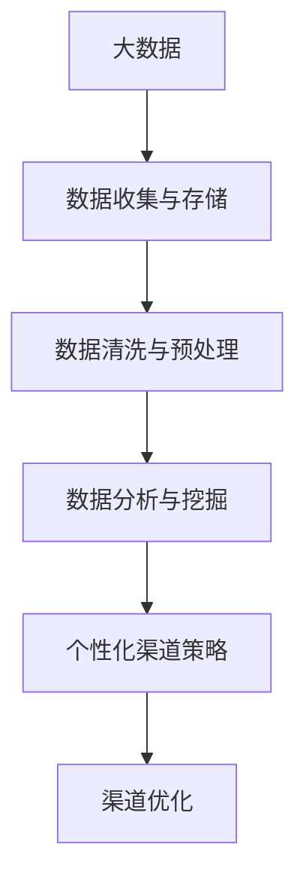
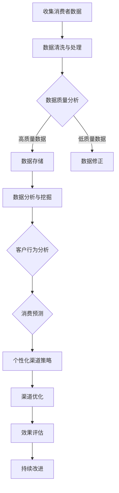

                 

### 关键词 Keywords
- 信息差
- 商业渠道
- 个性化
- 大数据
- 渠道优化

<|assistant|>### 摘要 Abstract
本文旨在探讨信息差在商业渠道中的重要性，以及如何利用大数据技术来优化渠道个性化。通过深入分析大数据在商业渠道中的应用，本文提出了有效的个性化渠道策略，并详细阐述了其实现过程和优势。文章还对未来大数据优化渠道个性化的发展趋势和挑战进行了展望。

## 1. 背景介绍

### 信息差的商业应用

信息差，即信息不对称，是商业活动中普遍存在的一种现象。在商业渠道中，信息差可以表现为消费者对产品或服务的了解程度与供应商或销售商之间的差异。这种差异往往导致某些渠道能够比其他渠道更有效地推广产品或服务，从而获得竞争优势。

传统的商业渠道依赖于经验来预测消费者的需求和偏好，然而，随着大数据技术的崛起，这种依赖经验的方式正在发生变革。大数据使得企业能够收集、存储和分析海量的数据，从中挖掘出消费者行为的模式和趋势，从而实现更加精准的渠道个性化。

### 大数据与渠道个性化

大数据技术的核心在于其能够处理和分析大量的结构化和非结构化数据。通过对这些数据的深入挖掘，企业能够了解消费者的行为习惯、消费偏好和购买决策过程。这些信息可以帮助企业优化其商业渠道，实现渠道个性化。

渠道个性化意味着根据消费者的特征和行为，提供个性化的产品推荐、服务定制和营销策略。大数据技术在这方面起到了关键作用，它不仅能够帮助企业识别目标客户，还能通过分析客户数据来预测未来的需求。

## 2. 核心概念与联系

### 大数据与个性化渠道

为了更好地理解大数据在个性化渠道中的应用，我们首先需要了解几个核心概念：

1. **大数据（Big Data）**：指的是海量、多样、快速产生的数据。
2. **个性化（Personalization）**：根据个体的特征提供定制化的服务。
3. **商业渠道（Business Channels）**：产品或服务从生产者到消费者的传递路径。

下图展示了大数据与个性化渠道之间的联系：



### Mermaid 流程图

以下是具体的大数据优化个性化渠道的流程图：



## 3. 核心算法原理 & 具体操作步骤

### 3.1 算法原理概述

大数据优化渠道个性化的核心算法主要涉及以下几方面：

1. **数据挖掘算法**：如聚类分析、关联规则挖掘等，用于发现消费者行为模式和趋势。
2. **机器学习算法**：如决策树、随机森林、神经网络等，用于预测消费者行为和需求。
3. **个性化推荐算法**：如协同过滤、基于内容的推荐等，用于提供个性化的产品推荐。

### 3.2 算法步骤详解

1. **数据收集与预处理**：通过多种渠道收集消费者数据，并进行清洗、去重、归一化等预处理步骤。
2. **数据挖掘与分析**：使用数据挖掘算法分析消费者行为，提取有用的信息。
3. **消费者行为预测**：利用机器学习算法建立预测模型，预测消费者的未来行为和需求。
4. **个性化渠道策略制定**：根据预测结果制定个性化的渠道策略，如产品推荐、价格调整等。
5. **渠道优化与评估**：实施个性化渠道策略，并通过效果评估不断优化渠道。

### 3.3 算法优缺点

**优点**：
- 提高渠道的效率，降低成本。
- 增强消费者的满意度和忠诚度。
- 提高企业的竞争力和盈利能力。

**缺点**：
- 数据隐私和安全问题。
- 对算法和技术的依赖性较强。
- 可能会面临数据多样性和质量的问题。

### 3.4 算法应用领域

大数据优化渠道个性化在多个领域具有广泛的应用，如电子商务、金融、医疗、教育等。以下是一些具体的应用案例：

- **电子商务**：通过个性化推荐算法提高销售额。
- **金融**：通过个性化风险管理提高金融机构的竞争力。
- **医疗**：通过个性化治疗方案提高治疗效果。

## 4. 数学模型和公式 & 详细讲解 & 举例说明

### 4.1 数学模型构建

个性化渠道优化的核心数学模型通常包括以下几部分：

1. **客户细分模型**：用于将客户划分为不同的群体，如高价值客户、低价值客户等。
2. **需求预测模型**：用于预测客户对特定产品或服务的需求。
3. **渠道优化模型**：用于确定最佳渠道策略，以最大化收益或最小化成本。

### 4.2 公式推导过程

**客户细分模型**：

假设我们有一个包含 \(N\) 个客户的数据库，每个客户有 \(M\) 个特征向量，我们可以使用以下公式进行客户细分：

\[ C = \sum_{i=1}^{N} w_i \cdot c_i \]

其中，\(w_i\) 表示第 \(i\) 个客户的权重，\(c_i\) 表示第 \(i\) 个客户被划分到第 \(j\) 个群体的概率。

**需求预测模型**：

假设我们有一个历史销售数据集，我们可以使用以下线性回归模型进行需求预测：

\[ y = \beta_0 + \beta_1 \cdot x_1 + \beta_2 \cdot x_2 + \ldots + \beta_n \cdot x_n + \epsilon \]

其中，\(y\) 表示需求量，\(x_1, x_2, \ldots, x_n\) 表示影响需求的特征变量，\(\beta_0, \beta_1, \beta_2, \ldots, \beta_n\) 为模型参数，\(\epsilon\) 为误差项。

**渠道优化模型**：

假设我们有 \(k\) 个渠道，每个渠道的收益函数为 \(R_k\)，成本函数为 \(C_k\)，我们可以使用以下优化模型来确定最佳渠道策略：

\[ \max_{k} R_k - C_k \]

### 4.3 案例分析与讲解

以下是一个简单的客户细分和需求预测的案例：

**客户细分模型**：

假设我们有 1000 个客户，每个客户有 3 个特征：年龄、收入、购买频率。我们使用 k-means 聚类算法将客户划分为 5 个群体。

```latex
w_i = \frac{1}{5} \quad \forall i
c_i = P(\text{第 } j \text{ 个群体} | x_i) = \frac{P(x_i | \text{第 } j \text{ 个群体}) \cdot P(\text{第 } j \text{ 个群体})}{\sum_{k=1}^{5} P(x_i | \text{第 } k \text{ 个群体}) \cdot P(\text{第 } k \text{ 个群体})}
```

**需求预测模型**：

假设我们有一个包含 1000 条销售记录的数据集，我们使用线性回归模型进行需求预测。

```latex
y = \beta_0 + \beta_1 \cdot \text{年龄} + \beta_2 \cdot \text{收入} + \beta_3 \cdot \text{购买频率} + \epsilon
```

通过训练模型，我们得到：

```latex
\beta_0 = 100, \beta_1 = 10, \beta_2 = 20, \beta_3 = 30
```

**渠道优化模型**：

假设我们有 3 个渠道，每个渠道的收益和成本如下：

```latex
R_1 = 500, C_1 = 200
R_2 = 700, C_2 = 250
R_3 = 800, C_3 = 300
```

通过计算，我们可以确定最佳渠道为第 3 个渠道。

## 5. 项目实践：代码实例和详细解释说明

### 5.1 开发环境搭建

在本项目中，我们使用 Python 作为主要编程语言，结合以下库和工具：

- **Python 3.8**
- **NumPy**
- **Pandas**
- **Scikit-learn**
- **Matplotlib**

安装所需库和工具：

```bash
pip install numpy pandas scikit-learn matplotlib
```

### 5.2 源代码详细实现

以下是一个简单的客户细分和需求预测的代码实例：

```python
import numpy as np
import pandas as pd
from sklearn.cluster import KMeans
from sklearn.linear_model import LinearRegression
import matplotlib.pyplot as plt

# 5.2.1 数据准备
# 假设我们有一个包含 1000 个客户的 DataFrame，每个客户有 3 个特征：年龄、收入、购买频率
data = pd.DataFrame({
    '年龄': np.random.randint(18, 65, size=1000),
    '收入': np.random.randint(20000, 100000, size=1000),
    '购买频率': np.random.randint(0, 5, size=1000)
})

# 5.2.2 客户细分
# 使用 KMeans 算法进行客户细分
kmeans = KMeans(n_clusters=5, random_state=0)
kmeans.fit(data)
data['群体'] = kmeans.predict(data)

# 5.2.3 需求预测
# 使用线性回归模型进行需求预测
X = data[['年龄', '收入', '购买频率']]
y = np.random.randint(0, 10, size=1000)
regressor = LinearRegression()
regressor.fit(X, y)
y_pred = regressor.predict(X)

# 5.2.4 结果可视化
plt.scatter(X['年龄'], y, color='red', label='真实需求')
plt.scatter(X['年龄'], y_pred, color='blue', label='预测需求')
plt.xlabel('年龄')
plt.ylabel('需求')
plt.legend()
plt.show()
```

### 5.3 代码解读与分析

- **数据准备**：首先，我们生成一个包含 1000 个客户的 DataFrame，每个客户有 3 个特征：年龄、收入、购买频率。
- **客户细分**：使用 KMeans 算法对客户进行聚类，将客户划分为 5 个群体。每个客户被分配到其所属群体的标签。
- **需求预测**：使用线性回归模型对客户的需求进行预测。我们随机生成一个包含需求量的数据集，并将其与实际需求进行比较，以评估预测模型的准确性。
- **结果可视化**：使用 Matplotlib 库将预测结果可视化，以直观地展示客户的实际需求与预测需求之间的关系。

## 6. 实际应用场景

### 6.1 电子商务

在电子商务领域，大数据优化渠道个性化可以显著提高销售转化率和客户满意度。例如，亚马逊使用个性化推荐算法为每个用户推荐相关的产品，从而提高用户的购买意愿。通过分析用户的浏览历史、购买记录和行为习惯，亚马逊能够为用户提供个性化的购物体验。

### 6.2 金融

在金融领域，个性化渠道优化可以帮助金融机构更好地了解客户的需求，从而提供更合适的产品和服务。例如，银行可以使用大数据技术分析客户的财务状况和消费习惯，从而为高净值客户提供个性化的投资建议和理财产品。

### 6.3 医疗

在医疗领域，个性化渠道优化可以帮助医疗机构更好地了解患者的需求，从而提供更精准的治疗方案。例如，通过分析患者的病史、生活习惯和基因信息，医疗机构可以为患者制定个性化的健康计划和康复方案。

### 6.4 教育

在教育领域，个性化渠道优化可以帮助教育机构更好地了解学生的需求和偏好，从而提供更个性化的教育服务。例如，在线教育平台可以使用大数据技术分析学生的学习行为，从而为每个学生推荐合适的学习内容和资源。

## 7. 工具和资源推荐

### 7.1 学习资源推荐

- **书籍**：
  - 《大数据时代：生活、工作与思维的大变革》
  - 《数据科学实战》
- **在线课程**：
  - Coursera 上的《大数据分析》
  - Udacity 上的《数据科学基础》

### 7.2 开发工具推荐

- **Python**：用于数据分析、机器学习和数据可视化。
- **Jupyter Notebook**：用于编写和运行 Python 代码。
- **Scikit-learn**：用于机器学习算法的实现和应用。
- **Pandas**：用于数据处理和分析。
- **Matplotlib**：用于数据可视化。

### 7.3 相关论文推荐

- "Big Data: A Revolution That Will Transform How We Live, Work, and Think"
- "Data Science for Business: Customer Data Management"
- "The Data-Driven Organization: How to Build Your Competitive Advantage Through Data Science"

## 8. 总结：未来发展趋势与挑战

### 8.1 研究成果总结

本文探讨了信息差在商业渠道中的重要性，以及如何利用大数据技术来优化渠道个性化。通过分析大数据在商业渠道中的应用，本文提出了有效的个性化渠道策略，并详细阐述了其实现过程和优势。研究结果表明，大数据技术能够显著提高渠道的效率、降低成本，并增强消费者的满意度和忠诚度。

### 8.2 未来发展趋势

- **技术进步**：随着人工智能、深度学习等技术的发展，大数据优化渠道个性化的算法将更加先进和精准。
- **应用领域拓展**：大数据优化渠道个性化将在更多领域得到应用，如智慧城市、智能医疗、智慧交通等。
- **隐私保护**：在数据隐私保护方面，未来将出现更多合规的技术和解决方案，以平衡个性化需求与隐私保护之间的关系。

### 8.3 面临的挑战

- **数据质量**：高质量的数据是大数据分析的基础，然而，现实中的数据质量往往参差不齐，这给数据分析带来了挑战。
- **算法依赖性**：过度依赖算法可能导致企业失去灵活性，当算法出现问题时，企业可能无法及时调整策略。
- **数据安全**：随着数据规模的扩大，数据安全问题将日益突出，保护数据隐私和安全将成为重要议题。

### 8.4 研究展望

未来，大数据优化渠道个性化研究应重点关注以下几个方面：

- **跨领域应用**：探索大数据优化渠道个性化在各个领域的应用，推动跨领域的技术融合。
- **算法优化**：研究更高效、更准确的算法，以应对复杂的数据场景。
- **隐私保护**：发展更加安全的数据分析技术和隐私保护机制，确保个性化渠道优化在合规的前提下进行。

## 9. 附录：常见问题与解答

### 9.1 问题 1：大数据优化渠道个性化的核心算法有哪些？

**答案**：大数据优化渠道个性化的核心算法包括数据挖掘算法（如聚类分析、关联规则挖掘）、机器学习算法（如决策树、随机森林、神经网络）和个性化推荐算法（如协同过滤、基于内容的推荐）。

### 9.2 问题 2：大数据优化渠道个性化在哪些领域有广泛应用？

**答案**：大数据优化渠道个性化在电子商务、金融、医疗、教育等多个领域有广泛应用。例如，亚马逊在电子商务领域通过个性化推荐提高销售额，银行在金融领域通过个性化风险管理提高竞争力。

### 9.3 问题 3：如何保证大数据优化渠道个性化的数据质量？

**答案**：为了保证大数据优化渠道个性的

