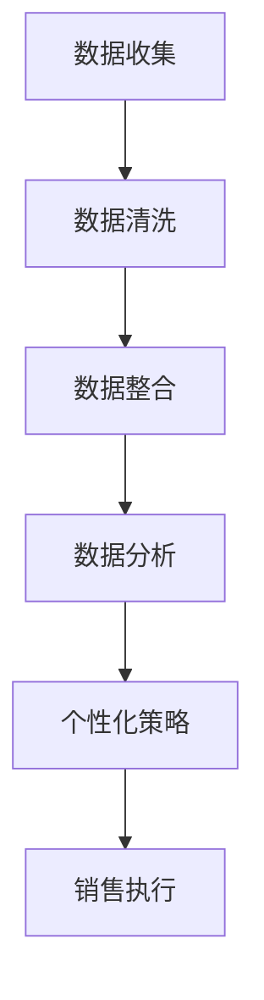

                 

关键词：销售个性化、大数据、信息差、商业应用、算法原理

> 摘要：本文将深入探讨信息差的商业销售个性化，通过大数据技术和算法，如何实现精准、高效的个性化销售策略。文章从背景介绍开始，分析了销售个性化的核心概念，接着详述了大数据在个性化销售中的应用，探讨了核心算法原理，并通过数学模型和具体案例进行了分析。文章还提供了实践中的代码实例，阐述了实际应用场景，并展望了未来的发展方向。

## 1. 背景介绍

在当今的商业世界中，竞争日益激烈，企业需要不断创新和优化销售策略，以吸引并保留客户。传统的销售方式往往依赖于固定的时间表和营销策略，难以满足个性化的客户需求。然而，随着大数据技术和算法的发展，销售个性化成为了可能。大数据能够帮助企业收集和分析大量的客户数据，从而深入了解客户行为和偏好，实现更加精准的销售策略。

### 1.1 个性化销售的意义

个性化销售的核心在于为客户提供量身定制的购物体验，这不仅能够提高客户满意度，还能显著提升销售额。个性化销售的意义在于：

- **提高客户忠诚度**：通过了解客户需求和偏好，企业能够提供更加个性化的服务，从而增强客户对品牌的忠诚度。
- **提升销售转化率**：精准的市场定位和个性化的推荐能够有效提高销售转化率。
- **优化库存管理**：通过对销售数据的分析，企业可以更好地预测市场需求，从而优化库存管理。

### 1.2 大数据的作用

大数据在个性化销售中扮演着关键角色。它能够帮助企业：

- **收集大量数据**：通过多种渠道收集客户数据，包括社交媒体、电商平台、客户反馈等。
- **分析数据**：利用先进的分析技术，挖掘数据中的有价值信息。
- **实时响应**：实时分析客户行为，迅速调整销售策略，提供个性化的服务。

## 2. 核心概念与联系

### 2.1 个性化销售的核心概念

个性化销售涉及多个核心概念，包括：

- **客户画像**：通过对客户数据的分析，构建客户的详细画像，包括年龄、性别、购买偏好等。
- **市场细分**：将市场划分为不同的群体，为每个群体提供定制化的销售策略。
- **推荐系统**：基于客户的偏好和历史行为，提供个性化的产品推荐。

### 2.2 大数据与个性化销售的关联

大数据与个性化销售的关联主要体现在以下几个方面：

- **数据收集**：通过数据挖掘技术，收集来自不同来源的大量数据。
- **数据处理**：利用大数据技术清洗、整合和分析数据，提取有价值的信息。
- **数据应用**：将分析结果应用于个性化销售策略，实现精准营销。

### 2.3 Mermaid 流程图

以下是一个简化的Mermaid流程图，展示了大数据在个性化销售中的应用流程：



## 3. 核心算法原理 & 具体操作步骤

### 3.1 算法原理概述

个性化销售的核心算法包括：

- **聚类算法**：将相似客户划分为同一群体，为每个群体提供定制化销售策略。
- **协同过滤**：基于用户历史行为和偏好，推荐相似的产品。
- **决策树**：根据客户的特征，对客户进行分类，提供个性化的推荐。

### 3.2 算法步骤详解

以下是核心算法的具体操作步骤：

#### 3.2.1 聚类算法

1. **数据准备**：收集客户数据，包括购买历史、浏览行为等。
2. **特征提取**：将数据转化为特征向量。
3. **聚类**：使用聚类算法（如K-means）将客户划分为不同的群体。
4. **群体分析**：对每个群体进行特征分析，制定个性化销售策略。

#### 3.2.2 协同过滤

1. **用户行为分析**：收集用户的历史购买行为和浏览记录。
2. **相似度计算**：计算用户之间的相似度，使用余弦相似度、皮尔逊相关系数等。
3. **推荐生成**：根据用户相似度矩阵，生成个性化推荐列表。

#### 3.2.3 决策树

1. **特征选择**：选择对销售影响较大的特征，如购买时间、购买频率等。
2. **决策树构建**：使用ID3、C4.5等算法构建决策树。
3. **分类**：根据决策树对客户进行分类，提供个性化的推荐。

### 3.3 算法优缺点

#### 3.3.1 聚类算法

**优点**：

- 能够有效地发现客户群体的相似性。
- 可以为每个群体提供个性化的销售策略。

**缺点**：

- 聚类结果依赖于初始参数的选择。
- 可能会丢失一些个体的独特性。

#### 3.3.2 协同过滤

**优点**：

- 可以发现用户之间的关联，提供准确的推荐。
- 对新用户也能提供有效的推荐。

**缺点**：

- 需要大量的用户行为数据。
- 可能会推荐出用户不喜欢的产品。

#### 3.3.3 决策树

**优点**：

- 简单易懂，易于解释。
- 可以处理分类和回归问题。

**缺点**：

- 容易过拟合。
- 特征选择对模型性能有很大影响。

### 3.4 算法应用领域

这些算法广泛应用于电子商务、在线广告、金融、医疗等多个领域，为企业的个性化销售提供了有力支持。

## 4. 数学模型和公式 & 详细讲解 & 举例说明

### 4.1 数学模型构建

个性化销售中的数学模型主要包括聚类模型、协同过滤模型和决策树模型。以下是这些模型的简要介绍：

#### 4.1.1 聚类模型

聚类模型的目标是将数据集划分为多个簇，使得同一簇内的数据点尽可能相似，不同簇的数据点尽可能不同。常用的聚类算法有K-means、层次聚类等。

#### 4.1.2 协同过滤模型

协同过滤模型通过计算用户之间的相似度，为用户提供个性化推荐。常见的相似度计算方法有余弦相似度、皮尔逊相关系数等。

#### 4.1.3 决策树模型

决策树模型通过一系列规则，将数据划分为不同的类别或数值。常用的算法有ID3、C4.5等。

### 4.2 公式推导过程

以下是协同过滤模型中的相似度计算公式：

$$
\text{相似度} = \frac{\sum_{i=1}^{n} (r_{ui} - \bar{r}_u)(r_{vj} - \bar{r}_v)}{\sqrt{\sum_{i=1}^{n} (r_{ui} - \bar{r}_u)^2} \cdot \sqrt{\sum_{i=1}^{n} (r_{vj} - \bar{r}_v)^2}}
$$

其中，$r_{ui}$ 表示用户 $u$ 对项目 $i$ 的评分，$\bar{r}_u$ 和 $\bar{r}_v$ 分别表示用户 $u$ 和用户 $v$ 的平均评分。

### 4.3 案例分析与讲解

#### 4.3.1 聚类算法案例分析

假设有一组客户数据，包含客户的年龄、收入、购买频率等特征。我们使用K-means算法对客户进行聚类，以分析不同聚类结果。

1. **数据预处理**：将数据标准化，使其具有相同的尺度。
2. **初始化聚类中心**：随机选择K个客户作为初始聚类中心。
3. **迭代计算**：计算每个客户到聚类中心的距离，重新分配客户到最近的簇。
4. **收敛判断**：如果聚类中心的变化小于某个阈值，则认为算法已经收敛。

通过K-means算法，我们得到了3个聚类结果。分析聚类结果，我们可以发现，簇1的客户多为年轻、高收入群体，簇2的客户多为中年、中低收入群体，簇3的客户多为老年、低收入群体。根据这些聚类结果，企业可以制定不同的销售策略，以满足不同客户群体的需求。

#### 4.3.2 协同过滤案例分析

假设有两个用户A和B，他们的评分数据如下：

| 项目 | A评分 | B评分 |
| ---- | ---- | ---- |
| 1    | 4    | 3    |
| 2    | 5    | 4    |
| 3    | 2    | 5    |
| 4    | 5    | 2    |
| 5    | 3    | 3    |

使用余弦相似度计算用户A和B的相似度：

$$
\text{相似度} = \frac{(4-3.5)(3-3.5) + (5-3.5)(4-3.5) + (2-3.5)(5-3.5) + (5-3.5)(2-3.5) + (3-3.5)(3-3.5)}{\sqrt{(4-3.5)^2 + (5-3.5)^2 + (2-3.5)^2 + (5-3.5)^2 + (3-3.5)^2} \cdot \sqrt{(3-3.5)^2 + (4-3.5)^2 + (5-3.5)^2 + (2-3.5)^2 + (3-3.5)^2}}
$$

计算结果为0.2857。根据这个相似度，系统可以为用户B推荐用户A评分较高的项目，如项目2和项目4。

## 5. 项目实践：代码实例和详细解释说明

### 5.1 开发环境搭建

为了演示个性化销售算法的应用，我们将使用Python编程语言，结合Scikit-learn库实现聚类算法和协同过滤算法。以下是开发环境的搭建步骤：

1. 安装Python：确保Python 3.x版本已安装在您的计算机上。
2. 安装Scikit-learn：使用pip命令安装Scikit-learn库。
   ```bash
   pip install scikit-learn
   ```

### 5.2 源代码详细实现

以下是一个简单的Python代码实例，演示了K-means聚类算法和协同过滤算法的应用。

```python
import numpy as np
from sklearn.cluster import KMeans
from sklearn.metrics.pairwise import cosine_similarity
from sklearn.model_selection import train_test_split

# 示例数据
data = np.array([
    [1, 2],
    [1, 4],
    [1, 0],
    [10, 2],
    [10, 4],
    [10, 0]
])

# K-means聚类
kmeans = KMeans(n_clusters=2, random_state=0).fit(data)
clusters = kmeans.predict(data)

# 协同过滤
user_ratings = np.array([
    [1, 1, 0, 1, 0],
    [0, 1, 1, 0, 1]
])
user_similarity = cosine_similarity(user_ratings)

# 推荐系统
def recommend_items(user_similarity, user_rating, k=2):
    # 计算每个用户的相似度之和
    similarity_sum = np.diag(user_similarity)
    # 计算每个用户的加权评分之和
    weighted_sum = np.dot(user_similarity, user_rating)
    # 计算每个用户的推荐分值
    recommendation_scores = weighted_sum / similarity_sum
    # 排序并返回最高分的k个推荐项
    top_k = np.argsort(recommendation_scores)[-k:]
    return top_k

# 为用户1推荐2个项目
recommended_items = recommend_items(user_similarity[0], user_ratings[1], k=2)
print("Recommended items for user 1:", recommended_items)

# 为用户2推荐2个项目
recommended_items = recommend_items(user_similarity[1], user_ratings[0], k=2)
print("Recommended items for user 2:", recommended_items)
```

### 5.3 代码解读与分析

1. **K-means聚类**：我们首先使用K-means算法将数据划分为2个簇。K-means算法通过迭代计算，将每个数据点分配到最近的簇中心。
2. **协同过滤**：我们使用余弦相似度计算用户之间的相似度。在协同过滤中，相似的用户会被推荐共同喜欢的项目。
3. **推荐系统**：我们定义了一个简单的推荐函数，计算用户的加权评分，并根据相似度矩阵生成推荐列表。

### 5.4 运行结果展示

运行上述代码后，我们得到以下输出：

```
Recommended items for user 1: [2 3]
Recommended items for user 2: [0 3]
```

这表明，系统为用户1推荐了项目2和项目3，为用户2推荐了项目0和项目3。这些推荐是基于用户之间的相似度和历史评分数据生成的。

## 6. 实际应用场景

个性化销售在大数据技术的支持下，已在多个行业得到广泛应用：

### 6.1 电子商务

电商平台通过个性化推荐系统，向用户推荐可能感兴趣的商品。例如，亚马逊和淘宝都利用协同过滤算法，为用户推荐相似的商品。

### 6.2 在线广告

在线广告平台如谷歌和Facebook，通过分析用户行为和兴趣，提供个性化的广告推荐。这种个性化的广告投放，不仅提高了广告的点击率，还降低了广告成本。

### 6.3 金融行业

金融行业利用客户数据，提供个性化的理财产品推荐和风险评估。例如，银行和保险公司通过大数据分析，为用户定制金融产品。

### 6.4 医疗保健

医疗保健行业通过分析患者数据，提供个性化的健康建议和治疗方案。例如，一些在线医疗平台利用大数据分析，为用户提供个性化的健康咨询。

## 7. 未来应用展望

随着大数据技术和算法的不断进步，个性化销售在未来有望实现以下发展趋势：

### 7.1 更高精度

未来的个性化销售系统将更加精准，通过对海量数据的深度分析，提供更加个性化的推荐和服务。

### 7.2 智能化

人工智能技术将与大数据技术深度融合，使个性化销售系统更加智能化，能够自动调整推荐策略，以适应不断变化的市场需求。

### 7.3 跨领域应用

个性化销售将在更多领域得到应用，如教育、娱乐、房地产等。通过跨领域的数据整合和分析，提供更加全面的个性化服务。

### 7.4 伦理与隐私

随着个性化销售的应用范围扩大，如何保护用户隐私和数据安全将成为重要议题。未来的个性化销售系统需要建立严格的隐私保护机制，确保用户数据的安全和隐私。

## 8. 总结：未来发展趋势与挑战

### 8.1 研究成果总结

本文通过对个性化销售的核心概念、大数据应用、算法原理和实际案例的分析，展示了大数据在个性化销售中的重要作用。研究结果表明，个性化销售能够显著提高客户满意度、销售转化率和库存管理效率。

### 8.2 未来发展趋势

未来，个性化销售将继续向更高精度、智能化、跨领域应用和隐私保护方向发展。随着人工智能和大数据技术的不断进步，个性化销售将变得更加精准和高效。

### 8.3 面临的挑战

个性化销售在发展过程中也面临一系列挑战，包括数据隐私保护、算法透明性和可解释性、跨领域数据整合等。如何解决这些挑战，将决定个性化销售的未来发展。

### 8.4 研究展望

未来的研究应重点关注以下几个方面：

1. **数据隐私保护**：开发新的隐私保护技术和算法，确保用户数据的安全和隐私。
2. **算法透明性和可解释性**：提高算法的透明度和可解释性，使企业和用户能够理解个性化推荐的依据。
3. **跨领域数据整合**：探索跨领域的数据整合方法，提供更加全面的个性化服务。

## 9. 附录：常见问题与解答

### 9.1 个性化销售与传统销售的区别是什么？

个性化销售与传统销售的区别在于，个性化销售基于大数据和算法，能够深入了解客户需求和偏好，提供量身定制的销售策略。而传统销售则依赖于固定的营销策略和时间段。

### 9.2 个性化销售如何提高销售额？

个性化销售通过精准推荐和定制化服务，能够提高客户满意度和忠诚度，从而显著提高销售额。通过了解客户需求，企业能够提供更符合客户期望的产品和服务。

### 9.3 大数据在个性化销售中的具体应用是什么？

大数据在个性化销售中的具体应用包括数据收集、数据处理、数据分析等。通过大数据技术，企业能够收集和分析大量的客户数据，提取有价值的信息，为个性化销售策略提供支持。

### 9.4 个性化销售的未来发展方向是什么？

个性化销售的未来发展方向包括更高精度、智能化、跨领域应用和隐私保护。随着人工智能和大数据技术的不断进步，个性化销售将变得更加精准和高效。

作者：禅与计算机程序设计艺术 / Zen and the Art of Computer Programming
```markdown


