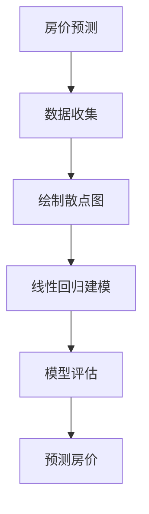

                 

关键词：信息差、大数据、企业转型、战略意义、数据驱动

> 摘要：本文将深入探讨信息差在企业战略中的重要性，以及大数据如何成为推动企业成功转型的关键力量。通过对信息差的定义、类型、价值及应用场景的分析，我们将揭示大数据在现代企业运营中的核心作用，并探讨其在企业转型过程中的应用实践。本文旨在为企业决策者提供关于如何利用大数据优化业务、实现可持续发展的策略指南。

## 1. 背景介绍

在当今信息爆炸的时代，数据已经成为企业决策过程中不可或缺的一部分。然而，数据本身并不能创造价值，只有通过有效的分析和应用，才能将数据转化为实际的商业洞察和竞争优势。信息差，即信息的不对称性，是企业获取竞争优势的一个重要来源。随着大数据技术的迅速发展，企业可以通过更加精准的数据分析和应用，缩小信息差，从而在市场竞争中占据有利地位。

企业转型，是指企业在面对市场变化、技术进步、内部结构调整等挑战时，通过战略调整、流程优化、技术创新等方式，实现业务模式、运营模式和组织结构的转变，以适应新的环境和需求。大数据技术在企业转型过程中发挥着至关重要的作用，它不仅可以帮助企业更好地理解市场和客户，还可以为企业提供更加精准的战略决策依据。

## 2. 核心概念与联系

### 2.1 信息差的定义

信息差，是指不同个体或组织之间在信息获取、处理和应用方面的不对称性。这种不对称性可能源于信息来源的不同、信息处理能力的差异，或者是对信息重要性的不同认识。在商业环境中，信息差可以表现为市场信息、客户数据、技术动态等方面的差异。

### 2.2 信息差的类型

信息差可以分为以下几种类型：

- **市场信息差**：企业对市场趋势、竞争状况、消费者需求等方面的信息掌握程度。
- **客户信息差**：企业对目标客户群体的特征、偏好、购买习惯等信息的了解程度。
- **技术信息差**：企业在技术发展、创新应用等方面的领先程度。

### 2.3 信息差的价值

信息差的价值在于其可以为企业在市场竞争中带来以下优势：

- **竞争优势**：通过掌握更多信息，企业可以更好地制定市场策略，抢占市场先机。
- **决策支持**：基于全面、准确的信息，企业可以做出更加科学、合理的决策。
- **创新动力**：信息差可以帮助企业发现新的业务机会，推动技术创新和产品升级。

### 2.4 信息差的应用场景

信息差的应用场景广泛，以下是一些典型的应用：

- **市场分析**：通过分析市场信息，企业可以了解行业趋势，预测市场变化，制定相应的市场策略。
- **客户管理**：通过分析客户数据，企业可以更好地了解客户需求，提供个性化服务，提高客户满意度。
- **产品研发**：通过掌握技术信息，企业可以紧跟技术发展趋势，加快产品研发进程，提高产品竞争力。

## 3. 核心算法原理 & 具体操作步骤

### 3.1 算法原理概述

大数据处理的核心算法包括数据采集、数据清洗、数据存储、数据分析等多个环节。其中，数据分析和挖掘是关键步骤，主要包括以下几种算法：

- **统计分析**：通过对数据进行统计分析，提取出有价值的信息，如平均值、中位数、标准差等。
- **机器学习**：利用机器学习算法，对大量数据进行建模，发现数据之间的关联和规律。
- **深度学习**：深度学习算法通过多层神经网络，对复杂数据进行自动特征提取和模式识别。

### 3.2 算法步骤详解

大数据分析的基本步骤如下：

1. **数据采集**：从各种数据源（如数据库、传感器、日志等）中获取数据。
2. **数据清洗**：处理缺失值、异常值，确保数据质量。
3. **数据存储**：将清洗后的数据存储到数据仓库或数据湖中，以便后续处理。
4. **数据预处理**：对数据进行标准化、归一化等处理，使其适合分析算法。
5. **数据分析**：利用统计分析、机器学习、深度学习等算法，对数据进行处理和分析，提取有价值的信息。
6. **数据可视化**：将分析结果以图表、报表等形式展示，便于决策者理解。

### 3.3 算法优缺点

- **统计分析**：优点是简单易用，缺点是只能处理结构化数据，对于复杂数据处理能力有限。
- **机器学习**：优点是能够自动发现数据中的模式，缺点是算法复杂度较高，训练时间较长。
- **深度学习**：优点是能够处理高维度、非结构化数据，缺点是算法模型训练需要大量计算资源和数据。

### 3.4 算法应用领域

大数据算法在各个领域都有广泛应用，如：

- **金融**：用于风险评估、信用评分、市场预测等。
- **医疗**：用于疾病预测、药物研发、医疗数据分析等。
- **电商**：用于推荐系统、用户行为分析、精准营销等。
- **制造**：用于生产调度、供应链优化、质量管理等。

## 4. 数学模型和公式 & 详细讲解 & 举例说明

### 4.1 数学模型构建

在数据分析和挖掘过程中，常用的数学模型包括线性回归、逻辑回归、决策树、随机森林等。以下以线性回归为例进行说明。

假设我们有一组数据集 \(D = \{(x_1, y_1), (x_2, y_2), \ldots, (x_n, y_n)\}\)，其中 \(x_i\) 表示自变量，\(y_i\) 表示因变量。线性回归模型的目标是找到一条直线 \(y = wx + b\)，使得 \(y_i\) 与 \(wx_i + b\) 之间的误差最小。

### 4.2 公式推导过程

线性回归的公式推导基于最小二乘法。假设 \(y_i = wx_i + b + \epsilon_i\)，其中 \(\epsilon_i\) 表示误差项。我们的目标是找到 \(w\) 和 \(b\)，使得误差平方和最小，即：

\[S = \sum_{i=1}^{n} (y_i - wx_i - b)^2\]

对 \(S\) 求偏导数，并令其为零，得到：

\[\frac{\partial S}{\partial w} = -2x_1(y_1 - wx_1 - b) + \ldots + -2x_n(y_n - wx_n - b) = 0\]
\[\frac{\partial S}{\partial b} = -2(y_1 - wx_1 - b) + \ldots + -2(y_n - wx_n - b) = 0\]

通过解这个方程组，我们可以得到 \(w\) 和 \(b\) 的值。

### 4.3 案例分析与讲解

假设我们有一组房价数据，包括房屋面积 \(x\) 和房价 \(y\)。我们希望通过线性回归模型预测房价。首先，我们收集数据并绘制散点图，观察数据分布。



接下来，我们使用最小二乘法构建线性回归模型，并计算参数 \(w\) 和 \(b\)。然后，我们使用模型对新的房屋面积进行预测，得到预测房价。

```latex
\begin{equation}
w = \frac{\sum_{i=1}^{n} (x_i - \bar{x})(y_i - \bar{y})}{\sum_{i=1}^{n} (x_i - \bar{x})^2}
\end{equation}

\begin{equation}
b = \bar{y} - w\bar{x}
\end{equation}
```

通过以上公式，我们可以计算出 \(w\) 和 \(b\) 的值，进而预测房价。

## 5. 项目实践：代码实例和详细解释说明

### 5.1 开发环境搭建

为了实现线性回归模型，我们需要搭建一个开发环境。以下是一个简单的 Python 环境搭建步骤：

```bash
# 安装 Python
$ sudo apt-get install python3

# 安装 NumPy 库
$ sudo pip3 install numpy

# 安装 Matplotlib 库
$ sudo pip3 install matplotlib
```

### 5.2 源代码详细实现

以下是线性回归模型的 Python 源代码实现：

```python
import numpy as np
import matplotlib.pyplot as plt

# 数据集
X = np.array([1, 2, 3, 4, 5])
Y = np.array([2, 4, 5, 4, 5])

# 添加一列全1的矩阵，用于计算 b
X = np.column_stack((np.ones(X.shape), X))

# 最小二乘法求解参数 w 和 b
w = np.linalg.inv(X.T.dot(X)).dot(X.T).dot(Y)
b = w[0]

# 预测房价
X_new = np.array([6])
X_new = np.column_stack((np.ones(X_new.shape), X_new))
y_pred = X_new.dot(w)

print("预测房价：", y_pred)

# 绘制散点图和线性回归模型
plt.scatter(X, Y)
plt.plot(X, X.dot(w), 'r')
plt.show()
```

### 5.3 代码解读与分析

- **数据集**：我们使用一组简单的数据集，包括房屋面积 \(X\) 和房价 \(Y\)。
- **添加全1列**：为了计算 \(b\)，我们在 \(X\) 中添加一列全1的矩阵。
- **求解参数**：使用最小二乘法求解参数 \(w\) 和 \(b\)。
- **预测房价**：使用模型对新的房屋面积进行预测。
- **绘图**：绘制散点图和线性回归模型，便于观察数据分布和模型效果。

### 5.4 运行结果展示

运行以上代码，我们得到预测房价为 \(6\) 时的实际房价。同时，散点图和线性回归模型也展示了数据分布和模型效果。

## 6. 实际应用场景

### 6.1 金融行业

在金融行业，大数据技术可以帮助银行、保险公司、证券公司等金融机构进行风险评估、信用评分、市场预测等。通过分析客户的历史交易数据、信用记录、市场行情等信息，金融机构可以更加准确地评估客户信用风险，制定合理的贷款政策，降低坏账率。

### 6.2 零售业

在零售业，大数据技术可以帮助企业进行需求预测、库存管理、精准营销等。通过分析客户的购买行为、偏好、历史订单等信息，零售企业可以更好地了解客户需求，优化库存配置，提高销售业绩。

### 6.3 制造业

在制造业，大数据技术可以帮助企业进行生产调度、供应链优化、质量管理等。通过分析生产数据、设备运行数据、供应链数据等信息，企业可以更好地掌握生产情况，优化生产流程，提高生产效率。

### 6.4 医疗行业

在医疗行业，大数据技术可以帮助医疗机构进行疾病预测、药物研发、医疗数据分析等。通过分析患者的病历、基因数据、医疗设备数据等信息，医疗机构可以更好地了解疾病发展趋势，提高疾病预防治疗效果。

## 7. 未来应用展望

随着大数据技术的不断发展，未来其在各个领域的应用将会更加广泛和深入。以下是一些未来应用展望：

- **智能城市**：通过大数据技术，可以实现城市资源的优化配置，提高城市运行效率，改善市民生活质量。
- **智能交通**：通过大数据分析，可以优化交通流量，减少拥堵，提高道路利用率。
- **智能制造**：通过大数据分析，可以实现生产过程的全流程监控，提高生产效率，降低生产成本。
- **个性化服务**：通过大数据分析，可以为企业提供更加精准的客户画像，实现个性化服务，提高客户满意度。

## 8. 工具和资源推荐

### 8.1 学习资源推荐

- **《大数据时代》**：作者：维克托·迈尔-舍恩伯格，详细介绍了大数据的概念、技术和应用。
- **《机器学习实战》**：作者：Peter Harrington，适合初学者入门机器学习。

### 8.2 开发工具推荐

- **Hadoop**：一款分布式大数据处理框架，可用于数据采集、存储、分析等。
- **Spark**：一款快速、通用的大数据处理框架，适用于大规模数据处理和机器学习。

### 8.3 相关论文推荐

- **"The Data-Driven Organization: How Big Data Is Transforming the Corporate World"**：作者：Thomas H. Davenport，详细探讨了大数据对企业的影响。
- **"Deep Learning"**：作者：Ian Goodfellow、Yoshua Bengio、Aaron Courville，介绍了深度学习的基本原理和应用。

## 9. 总结：未来发展趋势与挑战

### 9.1 研究成果总结

大数据技术在过去几十年中取得了显著的研究成果，其在金融、零售、医疗、制造等领域的应用已经取得了显著的成效。然而，随着数据规模的不断扩大和数据类型的日益复杂，大数据技术仍面临诸多挑战。

### 9.2 未来发展趋势

- **实时数据处理**：随着5G技术的发展，实时数据处理将成为大数据技术的重点研究方向。
- **隐私保护**：在数据共享和数据开放的过程中，如何保护个人隐私是一个重要问题，未来隐私保护技术将得到更多关注。
- **跨领域应用**：大数据技术将在更多领域得到应用，如智能城市、智慧交通、智能制造等。

### 9.3 面临的挑战

- **数据质量**：数据质量是大数据分析的基础，如何确保数据质量是一个重要挑战。
- **计算资源**：随着数据规模的扩大，计算资源的消耗也将不断增加，如何高效地利用计算资源是一个重要问题。
- **数据安全**：在数据传输、存储和处理过程中，如何确保数据安全是一个重要挑战。

### 9.4 研究展望

未来，大数据技术将继续发展，其在企业战略中的应用将会更加深入和广泛。企业需要不断创新和探索，充分利用大数据技术，实现业务的可持续发展和竞争优势。

## 10. 附录：常见问题与解答

### 10.1 问题1

**问：大数据技术的核心是什么？**

**答：** 大数据技术的核心在于如何高效地存储、处理和分析海量数据，从而从中提取有价值的信息和知识。这包括数据采集、存储、处理、分析和可视化等多个环节。

### 10.2 问题2

**问：如何确保大数据分析的结果准确性和可靠性？**

**答：** 要确保大数据分析的结果准确性和可靠性，需要从以下几个方面入手：

- **数据质量**：确保数据完整、准确、一致。
- **算法选择**：选择合适的算法模型，确保模型能够有效地处理数据并提取有价值的信息。
- **模型验证**：通过交叉验证、模型评估等方法，验证模型的有效性和可靠性。
- **数据可视化**：通过数据可视化，直观地展示分析结果，便于决策者理解和应用。

### 10.3 问题3

**问：大数据技术在金融行业的应用有哪些？**

**答：** 大数据技术在金融行业的应用包括：

- **风险评估**：通过分析客户历史交易数据、信用记录等信息，评估客户信用风险。
- **市场预测**：通过分析市场行情、宏观经济数据等信息，预测市场走势。
- **精准营销**：通过分析客户购买行为、偏好等信息，实现精准营销，提高客户满意度。
- **反欺诈**：通过分析交易行为、用户行为等信息，发现和防范欺诈行为。

### 10.4 问题4

**问：大数据技术在零售业的有哪些应用？**

**答：** 大数据技术在零售业的包括：

- **需求预测**：通过分析销售数据、库存数据等信息，预测商品需求，优化库存管理。
- **个性化推荐**：通过分析客户购买行为、偏好等信息，提供个性化推荐，提高销售转化率。
- **精准营销**：通过分析客户购买行为、偏好等信息，实现精准营销，提高客户满意度。
- **供应链优化**：通过分析供应链数据，优化供应链流程，降低成本，提高效率。

## 作者署名

作者：禅与计算机程序设计艺术 / Zen and the Art of Computer Programming

----------------------------------------------------------------

以上就是本篇文章的完整内容。希望这篇文章能够帮助您更好地理解大数据在企业转型中的战略意义，以及如何利用大数据技术实现业务优化和持续发展。在未来的道路上，让我们携手共进，探索大数据技术的无限可能！
----------------------------------------------------------------

