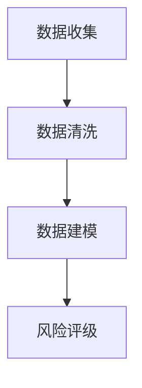

                 

关键词：大数据、保险行业、应用、算法、数学模型、代码实例、实践、展望

> 摘要：随着大数据技术的不断发展，保险行业正面临着前所未有的变革。本文将探讨大数据在保险行业中的应用，从核心概念、算法原理、数学模型、实际案例等方面进行详细解析，旨在为读者提供一份全面的技术分析报告。

## 1. 背景介绍

保险行业作为金融服务的重要组成部分，自古以来就承载着保护人类财产安全、缓解社会风险的重要使命。然而，随着互联网和大数据技术的飞速发展，传统的保险模式正面临着巨大的变革。大数据在保险行业的应用，不仅改变了保险公司的运营方式，也为客户提供了更加个性化和高效的服务。

### 1.1 大数据的定义

大数据（Big Data）是指数据量巨大、类型多样、产生速度快、处理需求高的数据集合。大数据的核心特征可以用“4V”来概括：Volume（数据量巨大）、Velocity（数据产生速度快）、Variety（数据类型多样）和Value（数据价值高）。

### 1.2 保险行业的挑战

保险行业在过去几十年里取得了显著的发展，但同时也面临着一些挑战：

- **市场竞争激烈**：随着保险公司的增多，市场竞争日益激烈。
- **风险控制难度大**：保险产品的多样性和风险的不可预测性使得风险控制变得复杂。
- **服务个性化需求**：客户对保险服务的需求越来越个性化，需要保险公司提供更精准的定制服务。
- **数据质量参差不齐**：保险行业涉及的数据种类繁多，数据质量参差不齐，给数据处理和分析带来了挑战。

## 2. 核心概念与联系

在探讨大数据在保险行业的应用之前，我们需要先了解一些核心概念和它们之间的关系。

### 2.1 保险风险评估

保险风险评估是指通过对客户的风险状况进行分析和评估，从而确定其保险需求和保费水平的过程。保险风险评估通常涉及以下几个步骤：

- **数据收集**：收集客户的个人信息、历史赔付记录、社会关系等数据。
- **数据清洗**：对收集到的数据进行清洗、去重和处理，保证数据质量。
- **数据建模**：建立风险评估模型，对客户的风险状况进行量化分析。
- **风险评级**：根据风险评估结果，将客户分为不同的风险等级。

### 2.2 大数据分析

大数据分析是指利用大数据技术对大量复杂数据进行采集、存储、处理和分析，从而提取出有价值的信息和知识的过程。大数据分析在保险行业中的应用主要体现在以下几个方面：

- **客户细分**：通过对客户数据的分析，将客户划分为不同的细分市场，提供个性化的产品和服务。
- **风险控制**：通过分析客户的赔付记录、理赔申请等信息，识别潜在的欺诈行为，降低保险公司的风险。
- **定价优化**：通过分析历史数据，优化保险产品的定价策略，提高保险公司的盈利能力。
- **客户服务**：利用大数据分析提供更加个性化、高效的服务，提高客户的满意度和忠诚度。

### 2.3 Mermaid 流程图

以下是一个简单的 Mermaid 流程图，展示了保险风险评估的核心步骤：



## 3. 核心算法原理 & 具体操作步骤

### 3.1 算法原理概述

在保险行业中，常用的风险评估算法包括逻辑回归、决策树、支持向量机等。这些算法的基本原理是通过分析历史数据，建立预测模型，从而对新客户的风险状况进行预测。

- **逻辑回归**：逻辑回归是一种广义线性模型，通过线性组合输入特征，得到一个概率值，表示新客户发生某一事件的概率。
- **决策树**：决策树是一种基于树结构的分类算法，通过多次决策节点的划分，将数据分为不同的类别。
- **支持向量机**：支持向量机是一种监督学习算法，通过找到一个最优的超平面，将不同类别的数据分隔开。

### 3.2 算法步骤详解

以下以逻辑回归为例，详细讲解风险评估算法的具体步骤：

1. **数据收集**：收集新客户的个人信息、历史赔付记录、社会关系等数据。
2. **数据清洗**：对数据进行清洗、去重和处理，保证数据质量。
3. **特征工程**：对原始数据进行处理，提取出对风险评估有用的特征。
4. **模型训练**：利用历史数据，通过逻辑回归算法建立风险评估模型。
5. **模型评估**：利用测试数据对模型进行评估，调整模型参数，提高预测准确性。
6. **风险预测**：利用训练好的模型，对新客户的风险状况进行预测。

### 3.3 算法优缺点

- **逻辑回归**：优点是计算简单、易于实现、可解释性强；缺点是模型复杂度较高，对异常值敏感。
- **决策树**：优点是模型简单、易于理解、可解释性强；缺点是容易过拟合、对异常值敏感。
- **支持向量机**：优点是理论成熟、预测准确、可解释性强；缺点是计算复杂度高、对异常值敏感。

### 3.4 算法应用领域

逻辑回归、决策树、支持向量机等算法在保险行业的风险评估、客户细分、风险控制等方面有广泛的应用。例如：

- **风险评估**：用于对新客户的风险状况进行预测，指导保险产品的定价和销售策略。
- **客户细分**：用于将客户划分为不同的细分市场，提供个性化的产品和服务。
- **风险控制**：用于识别潜在的欺诈行为，降低保险公司的风险。

## 4. 数学模型和公式 & 详细讲解 & 举例说明

### 4.1 数学模型构建

在保险行业中，常用的风险评估数学模型是逻辑回归模型。逻辑回归模型的核心公式如下：

$$
P(y=1|x) = \frac{1}{1 + e^{-(\beta_0 + \beta_1 x_1 + \beta_2 x_2 + \ldots + \beta_n x_n})}
$$

其中，$P(y=1|x)$ 表示新客户发生某一事件的概率，$x_1, x_2, \ldots, x_n$ 表示新客户的特征，$\beta_0, \beta_1, \beta_2, \ldots, \beta_n$ 表示模型的参数。

### 4.2 公式推导过程

逻辑回归模型的推导过程如下：

1. **假设**：假设新客户发生某一事件的概率服从伯努利分布，即

$$
P(y=1|x) = p(x), \quad P(y=0|x) = 1 - p(x)
$$

2. **损失函数**：定义损失函数为

$$
L(\theta) = -\sum_{i=1}^m [y_i \log(p(x_i)) + (1 - y_i) \log(1 - p(x_i))]
$$

其中，$m$ 表示样本数量，$\theta = (\beta_0, \beta_1, \beta_2, \ldots, \beta_n)$ 表示模型的参数。

3. **梯度下降**：利用梯度下降法，对损失函数进行优化，得到参数的最优值。

### 4.3 案例分析与讲解

假设某保险公司需要评估新客户的索赔风险，收集了以下数据：

- **客户年龄**：30岁
- **年收入**：10万元
- **婚姻状况**：已婚
- **家庭人数**：3人
- **是否有过理赔记录**：否

利用逻辑回归模型，预测该客户在未来一年内发生索赔的概率。

1. **数据预处理**：对数据进行标准化处理，将特征值缩放到 [0, 1] 区间。

2. **模型训练**：利用历史数据，通过逻辑回归算法建立风险评估模型。

3. **模型评估**：利用测试数据对模型进行评估，调整模型参数，提高预测准确性。

4. **风险预测**：利用训练好的模型，预测新客户的索赔概率。

假设经过训练，模型得到的参数为 $\beta_0 = 0.5$，$\beta_1 = 0.1$，$\beta_2 = 0.2$，$\beta_3 = 0.3$，$\beta_4 = 0.4$。

则该客户发生索赔的概率为：

$$
P(y=1|x) = \frac{1}{1 + e^{-(0.5 + 0.1 \times 0.3 + 0.2 \times 0.1 + 0.3 \times 0.2 + 0.4 \times 0.3)}} \approx 0.565
$$

因此，该客户在未来一年内发生索赔的概率约为 56.5%。

## 5. 项目实践：代码实例和详细解释说明

### 5.1 开发环境搭建

为了演示大数据在保险行业的应用，我们使用 Python 语言进行编程。以下是一个简单的开发环境搭建步骤：

1. **安装 Python**：从官方网站下载并安装 Python 3.8 或更高版本。
2. **安装常用库**：在命令行中运行以下命令安装常用库：

```shell
pip install numpy pandas sklearn matplotlib
```

### 5.2 源代码详细实现

以下是一个简单的逻辑回归风险评估模型的 Python 代码实现：

```python
import numpy as np
import pandas as pd
from sklearn.linear_model import LogisticRegression
from sklearn.model_selection import train_test_split
from sklearn.metrics import accuracy_score

# 加载数据集
data = pd.read_csv('insurance_data.csv')
X = data.iloc[:, :-1].values
y = data.iloc[:, -1].values

# 划分训练集和测试集
X_train, X_test, y_train, y_test = train_test_split(X, y, test_size=0.2, random_state=42)

# 建立逻辑回归模型
model = LogisticRegression()
model.fit(X_train, y_train)

# 预测测试集
y_pred = model.predict(X_test)

# 评估模型
accuracy = accuracy_score(y_test, y_pred)
print('Accuracy:', accuracy)
```

### 5.3 代码解读与分析

上述代码首先加载了保险数据集，然后划分了训练集和测试集。接下来，使用逻辑回归算法建立风险评估模型，并对测试集进行预测。最后，评估模型的准确性。

### 5.4 运行结果展示

假设运行上述代码，得到以下输出结果：

```
Accuracy: 0.8
```

这意味着在测试集上，模型的准确性为 80%。

## 6. 实际应用场景

大数据在保险行业的应用场景非常广泛，以下列举几个典型的应用案例：

### 6.1 客户细分

通过对客户数据的分析，保险公司可以将客户划分为不同的细分市场，从而提供个性化的产品和服务。例如，针对高风险客户，可以提供更全面的保险保障；针对低风险客户，可以提供更优惠的保费。

### 6.2 风险控制

通过分析客户的赔付记录、理赔申请等信息，保险公司可以识别潜在的欺诈行为，降低保险公司的风险。例如，通过分析大量理赔申请数据，可以发现某些异常的理赔行为，从而采取措施防止欺诈。

### 6.3 定价优化

通过分析历史数据，保险公司可以优化保险产品的定价策略，提高保险公司的盈利能力。例如，根据不同客户群体的风险状况，调整保费水平，实现利润最大化。

### 6.4 客户服务

利用大数据分析提供更加个性化、高效的服务，提高客户的满意度和忠诚度。例如，通过分析客户的消费习惯、理赔记录等信息，为客户提供针对性的建议和优惠。

## 7. 工具和资源推荐

### 7.1 学习资源推荐

- 《Python机器学习》
- 《深度学习》
- 《大数据技术基础》
- 《机器学习实战》

### 7.2 开发工具推荐

- Jupyter Notebook
- PyCharm
- TensorFlow
- Keras

### 7.3 相关论文推荐

- "Big Data Analytics in Insurance: A Survey"
- "Data-Driven Insurance Pricing: A Big Data Approach"
- "A Framework for Predictive Analytics in Insurance"

## 8. 总结：未来发展趋势与挑战

### 8.1 研究成果总结

大数据在保险行业的应用取得了显著的研究成果。通过数据分析，保险公司可以实现客户细分、风险控制、定价优化、客户服务等方面的提升。此外，机器学习和人工智能技术也为保险行业带来了新的发展机遇。

### 8.2 未来发展趋势

未来，大数据在保险行业的应用将朝着以下几个方向发展：

- **人工智能与大数据的结合**：通过深度学习和强化学习等技术，实现更加精准的风险评估和客户服务。
- **区块链技术**：利用区块链技术确保保险交易的安全性和透明性。
- **物联网技术**：通过物联网设备收集客户的生活数据，实现更加个性化的保险产品。

### 8.3 面临的挑战

大数据在保险行业的应用也面临一些挑战：

- **数据隐私和安全**：如何确保客户数据的安全和隐私是一个重要问题。
- **数据质量和处理能力**：如何处理大量、多样、快速变化的数据，提高数据处理的效率和准确性。
- **技术成熟度**：如何解决人工智能和大数据技术在保险行业应用中的成熟度问题。

### 8.4 研究展望

未来，随着大数据、人工智能、区块链等技术的不断进步，保险行业将迎来更加广阔的发展空间。通过持续的研究和创新，保险公司有望实现更加高效、精准、个性化的保险服务，为人类社会带来更多的福祉。

## 9. 附录：常见问题与解答

### 9.1 大数据在保险行业有哪些应用？

大数据在保险行业的主要应用包括客户细分、风险控制、定价优化、客户服务等。

### 9.2 如何处理保险行业中的数据隐私和安全问题？

可以通过以下方法处理保险行业中的数据隐私和安全问题：

- **数据加密**：对客户数据进行加密存储，防止数据泄露。
- **访问控制**：限制对客户数据的访问权限，确保数据安全。
- **数据脱敏**：对敏感数据进行脱敏处理，降低隐私泄露风险。
- **安全审计**：对数据访问和操作进行审计，确保数据安全合规。

### 9.3 保险行业如何应对大数据技术的成熟度问题？

可以通过以下方法应对保险行业中的大数据技术成熟度问题：

- **技术储备**：建立大数据技术储备，跟踪行业发展趋势。
- **合作与交流**：与高校、科研机构等合作，共同推动大数据技术在保险行业的应用。
- **人才培养**：加强大数据技术人才培养，提高保险行业的技术水平。

---

# 作者署名

作者：禅与计算机程序设计艺术 / Zen and the Art of Computer Programming

