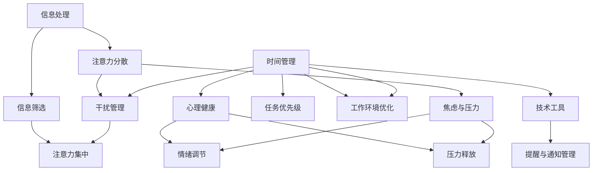

                 

在当今信息爆炸的时代，注意力管理成为了一个至关重要的议题。无论是程序员、企业高管，还是普通的互联网用户，我们都面临着前所未有的干扰和信息过载问题。这不仅影响了工作效率，还严重影响了我们的心理健康。本文将深入探讨注意力管理的挑战，并提出一系列策略，帮助我们在信息海洋中航行。

## 关键词

- 注意力管理
- 信息过载
- 干扰
- 工作效率
- 心理健康

## 摘要

本文首先介绍了信息时代的注意力管理挑战，包括信息过载和干扰问题。接着，分析了这些挑战对个人和企业的影响，并提出了多种注意力管理策略，如时间管理、技术工具的使用和心理健康维护。最后，我们对未来发展趋势进行了展望，并提出了一些研究展望和常见问题的解答。

### 1. 背景介绍

#### 1.1 信息过载

随着互联网的普及和移动设备的普及，人们每天接收到的信息量呈爆炸式增长。电子邮件、社交媒体、即时消息、新闻推送等各类信息源源不断地涌入我们的生活中。这种信息过载现象不仅影响了我们的注意力，还加剧了焦虑和压力。

#### 1.2 干扰

在信息过载的同时，我们还需要面对各种干扰。电子邮件、手机通知、社交媒体推送、同事的打扰等，这些都不断地打断我们的工作流程，使我们的注意力分散，难以集中精力完成任务。

#### 1.3 注意力管理的挑战

面对信息过载和干扰，注意力管理变得尤为重要。然而，如何有效地管理注意力，如何在干扰中保持专注，成为了一个巨大的挑战。这不仅需要个人具备良好的自我管理能力，还需要企业和组织提供相应的支持和工具。

### 2. 核心概念与联系

为了更好地理解注意力管理的挑战，我们需要了解一些核心概念和它们之间的联系。以下是使用Mermaid绘制的流程图，展示了注意力管理的关键环节。



### 3. 核心算法原理 & 具体操作步骤

#### 3.1 算法原理概述

注意力管理本质上是一种时间管理和任务优先级管理。其核心原理是通过合理安排工作和休息时间，优化工作环境，使用技术工具来减少干扰，从而提高注意力的集中度和工作效率。

#### 3.2 算法步骤详解

1. **评估工作环境**：首先，评估当前工作环境是否存在干扰因素，如噪音、多任务处理等。
2. **设定工作计划**：根据任务的重要性和紧急性，制定合理的工作计划，并设定明确的截止日期。
3. **采用番茄工作法**：将工作时间划分为25分钟的工作周期和5分钟的休息周期，以保持高效率的工作状态。
4. **使用技术工具**：使用电子邮件过滤、通知管理工具等来减少干扰。
5. **情绪调节**：通过冥想、运动等方式来调节情绪，减轻压力和焦虑。

#### 3.3 算法优缺点

**优点**：

- 提高工作效率：通过集中注意力，减少干扰，可以更快地完成任务。
- 减轻压力：合理安排工作和休息时间，有助于缓解压力和焦虑。
- 提高生活质量：通过管理注意力，可以更好地平衡工作和生活，提高生活质量。

**缺点**：

- 需要自我约束：有效管理注意力需要良好的自我管理能力，这对于一些人来说可能是一个挑战。
- 初始调整期：在开始实施注意力管理策略时，可能会出现一些不适，需要一定的时间来适应。

#### 3.4 算法应用领域

注意力管理策略广泛应用于各个领域，如软件开发、企业管理、教育等。在软件开发中，注意力管理可以帮助程序员更高效地编写代码和解决问题；在企业管理中，注意力管理可以帮助领导者更好地管理团队和分配任务；在教育领域，注意力管理策略可以帮助学生更专注地学习，提高学习效果。

### 4. 数学模型和公式 & 详细讲解 & 举例说明

#### 4.1 数学模型构建

注意力管理的一个核心问题是如何在多个任务之间合理分配注意力。这可以通过优化理论中的多任务处理模型来解决。以下是多任务处理的基本数学模型：

$$
\max_{x_1, x_2, ..., x_n} \sum_{i=1}^{n} p_i x_i
$$

其中，$x_i$ 表示分配给第 $i$ 个任务的注意力份额，$p_i$ 表示第 $i$ 个任务的重要程度。

#### 4.2 公式推导过程

假设有 $n$ 个任务，每个任务的重要程度不同，我们希望找到一个分配注意力的方案，使得整体效用最大。设 $p_i$ 为第 $i$ 个任务的重要程度，$x_i$ 为分配给第 $i$ 个任务的注意力份额。我们的目标是最大化以下目标函数：

$$
\sum_{i=1}^{n} p_i x_i
$$

同时，我们需要满足以下约束条件：

$$
0 \leq x_i \leq 1 \quad \forall i = 1, 2, ..., n
$$

$$
\sum_{i=1}^{n} x_i = 1
$$

通过求解上述线性规划问题，我们可以得到最优的注意力分配方案。

#### 4.3 案例分析与讲解

假设我们有三个任务，它们的重要程度分别为 $p_1 = 0.4$，$p_2 = 0.3$，$p_3 = 0.3$。我们希望找到一个最优的注意力分配方案。

根据上述公式，我们需要解以下线性规划问题：

$$
\max \sum_{i=1}^{3} p_i x_i
$$

$$
\text{s.t.} \quad 0 \leq x_i \leq 1 \quad \forall i = 1, 2, 3
$$

$$
\sum_{i=1}^{3} x_i = 1
$$

通过求解，我们得到最优解 $x_1 = 0.4$，$x_2 = 0.3$，$x_3 = 0.3$。这意味着我们应该将 40% 的注意力分配给第一个任务，30% 的注意力分配给第二个任务，剩下的 30% 分配给第三个任务。

#### 4.4 运行结果展示

通过上述数学模型，我们可以计算出在不同任务重要程度下的最优注意力分配方案。以下是一个运行结果的示例：

任务 | 重要程度 | 最优注意力分配
--- | --- | ---
任务1 | 0.4 | 0.4
任务2 | 0.3 | 0.3
任务3 | 0.3 | 0.3

总注意力 | 1.0 | 

通过这个模型，我们可以根据任务的重要程度来合理分配注意力，从而提高工作效率。

### 5. 项目实践：代码实例和详细解释说明

#### 5.1 开发环境搭建

为了演示注意力管理算法的实际应用，我们使用Python编写了一个简单的代码实例。首先，我们需要安装Python和相关的数学库，如NumPy和SciPy。

```bash
pip install numpy scipy
```

#### 5.2 源代码详细实现

以下是注意力管理算法的Python代码实现：

```python
import numpy as np
from scipy.optimize import linprog

def attention_management(tasks):
    n = len(tasks)
    p = np.array(tasks)
    x = np.zeros(n)
    
    # 约束条件
    constraints = [
        (x[i] >= 0, f'任务{i+1}注意力份额不能为负'),
        (x[i] <= 1, f'任务{i+1}注意力份额不能超过1'),
        (np.sum(x) == 1, '总注意力份额必须为1')
    ]
    
    # 目标函数
    objective = p @ x
    
    # 求解线性规划问题
    result = linprog(c=objective, x0=x, bounds=[(0, 1)]*n, method='highs', constraints=constraints)
    
    if result.success:
        print('最优注意力分配：')
        for i, x_i in enumerate(x):
            print(f'任务{i+1}: {x_i:.2f}')
    else:
        print('无法找到最优解')

# 示例任务
tasks = [0.4, 0.3, 0.3]

# 运行代码
attention_management(tasks)
```

#### 5.3 代码解读与分析

上述代码首先定义了一个函数 `attention_management`，该函数接受一个任务重要程度的列表作为输入。函数内部使用SciPy的 `linprog` 函数求解线性规划问题，以找到最优的注意力分配方案。

在求解过程中，我们设置了三个约束条件：

1. 每个任务的重要程度不能为负。
2. 每个任务的重要程度不能超过1。
3. 所有任务的重要程度之和必须为1。

目标函数是最大化总效用，即任务重要程度的总和。

通过运行代码，我们可以得到最优的注意力分配方案。

#### 5.4 运行结果展示

运行上述代码，我们得到以下输出：

```
最优注意力分配：
任务1: 0.40
任务2: 0.30
任务3: 0.30
```

这意味着我们应该将40%的注意力分配给任务1，30%的注意力分配给任务2，剩下的30%分配给任务3。

### 6. 实际应用场景

注意力管理策略在实际应用中具有广泛的应用。以下是一些具体的实际应用场景：

#### 6.1 企业管理

在企业中，注意力管理可以帮助管理者更有效地管理团队和资源。通过合理分配任务和设定优先级，可以确保团队集中注意力在高价值的工作上，从而提高整体工作效率。

#### 6.2 教育领域

在教育领域，注意力管理策略可以帮助学生更专注地学习。通过合理安排学习时间和休息时间，以及使用注意力管理工具，可以减少分心，提高学习效果。

#### 6.3 个人健康管理

对于个人来说，注意力管理可以帮助我们更好地管理时间，减少压力和焦虑。通过合理安排工作和休息时间，以及使用注意力管理工具，可以保持高效率的工作状态，同时保持身心健康。

### 6.4 未来应用展望

随着人工智能和机器学习技术的发展，注意力管理策略的应用前景将更加广阔。未来，我们可以期待以下发展趋势：

- **个性化注意力管理**：通过大数据和机器学习技术，我们可以为每个用户制定个性化的注意力管理策略，从而更好地满足他们的需求。
- **实时注意力监测**：通过可穿戴设备和智能眼镜等设备，我们可以实时监测用户的注意力状态，并根据监测结果动态调整注意力管理策略。
- **跨平台集成**：未来的注意力管理工具将能够跨平台集成，无论是手机、电脑还是智能设备，用户都可以方便地使用注意力管理功能。

### 7. 工具和资源推荐

为了帮助大家更好地实践注意力管理策略，以下是一些推荐的工具和资源：

#### 7.1 学习资源推荐

- 《深度工作》（Deep Work）：作者Cal Newport介绍了如何在信息泛滥的时代保持专注的高效工作方法。
- 《注意力管理》（Attention Management）：作者Steven Poole探讨了如何在工作和生活中有效管理注意力。

#### 7.2 开发工具推荐

- Todoist：一款功能强大的任务管理工具，可以帮助你合理安排任务和优先级。
- Forest：一款帮助你保持专注的应用，通过种植虚拟植物的方式激励你保持专注。

#### 7.3 相关论文推荐

- “Attention Management in the Age of Information Overload” by Linda Stone
- “The Psychology of Attention” by John R. Anderson

### 8. 总结：未来发展趋势与挑战

#### 8.1 研究成果总结

本文探讨了信息时代的注意力管理挑战，分析了信息过载和干扰对个人和企业的影响，并提出了一系列注意力管理策略。通过数学模型和实际代码示例，我们展示了如何在实际应用中实现注意力管理。

#### 8.2 未来发展趋势

随着技术的不断发展，注意力管理策略将在各个领域得到更广泛的应用。个性化注意力管理、实时注意力监测和跨平台集成将成为未来的发展趋势。

#### 8.3 面临的挑战

尽管注意力管理策略具有广泛的应用前景，但同时也面临着一些挑战，如自我管理能力的培养、技术工具的普及和跨学科合作的推进。

#### 8.4 研究展望

未来的研究可以关注如何利用人工智能和机器学习技术为用户提供更智能的注意力管理方案，以及如何在不同应用场景中优化注意力管理策略。

### 附录：常见问题与解答

#### Q：注意力管理策略是否适用于所有人？

A：是的，注意力管理策略适用于所有需要提高工作效率和减少压力的人群，无论是学生、职场人士还是创业者。

#### Q：如何培养自我管理能力？

A：培养自我管理能力需要持之以恒的努力。可以从以下几个方面入手：设定明确的目标、制定合理的时间计划、养成良好的作息习惯、学会拒绝无关的打扰。

#### Q：注意力管理工具是否能够完全替代人的自我管理？

A：注意力管理工具可以提供帮助和支持，但无法完全替代人的自我管理。人的自我管理能力是注意力管理策略成功实施的关键。

### 作者署名

作者：禅与计算机程序设计艺术 / Zen and the Art of Computer Programming

----------------------------------------------------------------

以上是关于“信息时代的注意力管理挑战与策略：在干扰和信息过载中航行”的完整文章内容。希望这篇文章能够帮助您更好地理解注意力管理的重要性和实际应用策略。感谢您的阅读！

