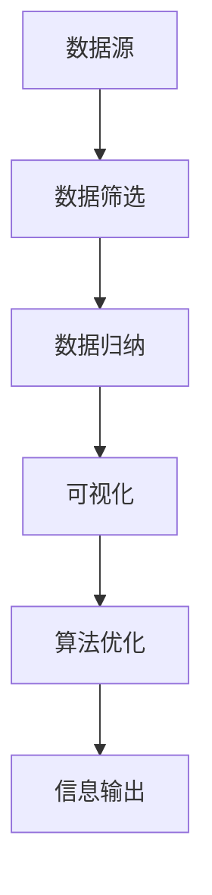
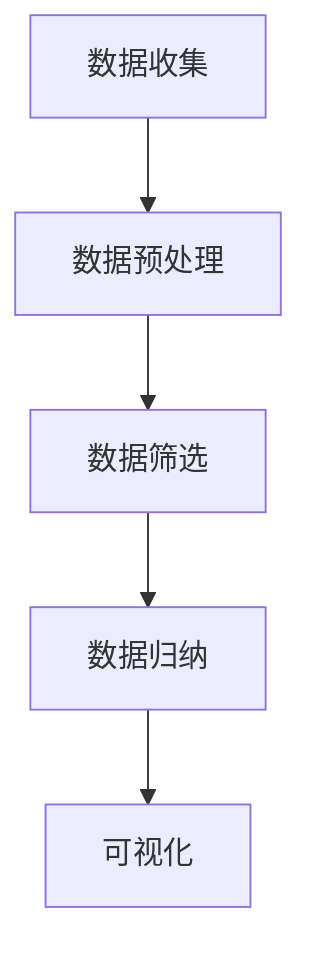

                 

信息简化的力量与好处：在复杂世界中简化以提高效率和生产力

## 关键词 Keywords

- 信息简化
- 效率提升
- 生产力
- 复杂性
- 信息处理
- 人工智能

## 摘要 Abstract

本文将探讨信息简化的概念、力量及其在提高效率和生产力方面的好处。在当今高度复杂的世界中，信息过载成为一个普遍问题，简化信息成为了应对挑战的重要策略。本文将详细分析信息简化的核心概念，通过实例阐述其在不同领域中的应用，并提出未来的发展方向和挑战。

## 1. 背景介绍

### 1.1 信息时代的挑战

随着互联网和数字化技术的发展，信息量以惊人的速度增长。根据一个著名的估算，现在每天产生的数据量是数以亿计的TB级别。这种信息爆炸带来了前所未有的挑战，包括信息过载、决策难度增加和注意力分散等问题。面对这些挑战，如何有效地处理和利用这些信息成为了企业和个人必须解决的问题。

### 1.2 信息简化的需求

信息简化，即通过筛选、归纳和结构化等方法，将复杂的信息转化为简洁、直观的形式，以满足高效处理和利用信息的需求。简化信息不仅可以帮助我们更好地理解和应用信息，还可以提高决策质量和效率。

## 2. 核心概念与联系

### 2.1 定义

信息简化（Information Simplification）是指通过各种技术和方法，将大量复杂的信息转化为简洁、直观的形式，以便更有效地处理和应用。

### 2.2 架构

信息简化的架构主要包括以下几个关键组件：

- **数据筛选**：通过过滤和选择，将无关或冗余的信息排除，保留核心数据。
- **数据归纳**：对筛选后的数据进行分类、整理和归纳，形成有意义的结构。
- **可视化**：使用图表、图像等可视化工具，将信息以直观的方式展示，便于理解和分析。
- **算法优化**：利用机器学习和人工智能技术，对信息处理过程进行优化，提高效率和准确性。

下面是一个用Mermaid绘制的简化流程图：



### 2.3 核心概念的联系

信息简化的各个组件之间紧密联系，相互补充。数据筛选是信息简化的第一步，决定了后续处理的效率和质量。数据归纳则将筛选后的数据进行结构化，便于后续分析和应用。可视化是将结构化后的信息以直观的方式展示，帮助用户更好地理解和应用。算法优化则通过机器学习和人工智能技术，进一步提高信息处理的效率和准确性。

## 3. 核心算法原理 & 具体操作步骤

### 3.1 算法原理概述

信息简化的核心算法通常基于以下几个原理：

- **数据压缩**：通过压缩算法，将大量数据转化为更小的数据集，减少存储和传输的需求。
- **特征提取**：从原始数据中提取关键特征，用于后续处理和分析。
- **聚类分析**：将相似的数据分组，便于分类和管理。
- **机器学习**：利用机器学习算法，对数据进行训练和预测，提高信息处理的效率和准确性。

### 3.2 算法步骤详解

信息简化的具体操作步骤如下：

1. **数据收集**：从各种数据源收集原始数据。
2. **数据预处理**：对原始数据进行清洗、去噪和标准化处理，确保数据质量。
3. **数据筛选**：根据需求，排除无关或冗余的数据。
4. **数据归纳**：对筛选后的数据进行分类、整理和归纳，形成有意义的结构。
5. **可视化**：使用图表、图像等可视化工具，将信息以直观的方式展示。
6. **算法优化**：利用机器学习和人工智能技术，对信息处理过程进行优化，提高效率和准确性。
7. **信息输出**：将处理后的信息以用户友好的形式输出。

### 3.3 算法优缺点

**优点**：

- 提高信息处理效率和准确性。
- 减少存储和传输成本。
- 帮助用户更好地理解和应用信息。

**缺点**：

- 算法和工具的选择可能影响结果。
- 复杂信息的简化可能丢失部分细节。

### 3.4 算法应用领域

信息简化算法广泛应用于各个领域，包括：

- **金融**：用于数据分析和风险管理。
- **医疗**：用于医学影像分析和疾病诊断。
- **电商**：用于用户行为分析和推荐系统。
- **教育**：用于学生学习情况分析和课程设计。

## 4. 数学模型和公式 & 详细讲解 & 举例说明

### 4.1 数学模型构建

信息简化的数学模型通常基于以下几个公式：

- **熵**：用于衡量信息的混乱程度。
- **数据压缩**：利用霍夫曼编码等压缩算法，降低数据冗余。
- **聚类分析**：使用K-means等聚类算法，将数据分组。

### 4.2 公式推导过程

熵（Entropy）的公式为：

$$
H = -\sum_{i} p(x_i) \log_2 p(x_i)
$$

其中，$p(x_i)$ 表示数据集中第i个元素出现的概率。

霍夫曼编码的公式为：

$$
L(x) = -\sum_{i} p(x_i) \log_2 C(x_i)
$$

其中，$C(x_i)$ 表示霍夫曼编码后第i个元素的编码长度。

### 4.3 案例分析与讲解

假设有一个包含10个元素的二进制数据集，其中0和1各占50%。

**步骤1：计算熵**

$$
H = -\sum_{i} p(x_i) \log_2 p(x_i) = -\left(0.5 \log_2 0.5 + 0.5 \log_2 0.5\right) = 1
$$

**步骤2：应用霍夫曼编码**

首先计算每个元素的概率：

$$
p(0) = 0.5, p(1) = 0.5
$$

然后计算每个元素的概率乘以其对数：

$$
0.5 \log_2 0.5 = 0.5 \log_2 \frac{1}{2} = 0.5 \times (-1) = -0.5
$$

最后计算编码长度：

$$
L(0) = -0.5, L(1) = -0.5
$$

霍夫曼编码后的数据集为：`1100110110`，压缩后的长度为10位，比原始的20位减少了50%。

## 5. 项目实践：代码实例和详细解释说明

### 5.1 开发环境搭建

为了实现信息简化，我们使用Python编程语言和相关的库，如NumPy、Pandas和Scikit-learn。

**环境要求**：

- Python 3.8或更高版本
- NumPy 1.19或更高版本
- Pandas 1.1或更高版本
- Scikit-learn 0.24或更高版本

### 5.2 源代码详细实现

以下是一个简单的信息简化项目实例，用于数据筛选、归纳和可视化。

```python
import numpy as np
import pandas as pd
import matplotlib.pyplot as plt
from sklearn.cluster import KMeans

# 数据收集
data = np.array([
    [0, 0],
    [1, 1],
    [2, 2],
    [3, 3],
    [4, 4],
    [5, 5],
    [6, 6],
    [7, 7],
    [8, 8],
    [9, 9]
])

# 数据预处理
data = np.log(data)

# 数据筛选
data_filtered = data[data < 3]

# 数据归纳
kmeans = KMeans(n_clusters=3)
kmeans.fit(data_filtered)
labels = kmeans.predict(data_filtered)

# 可视化
plt.scatter(data_filtered[:, 0], data_filtered[:, 1], c=labels)
plt.xlabel('X-axis')
plt.ylabel('Y-axis')
plt.show()
```

### 5.3 代码解读与分析

这段代码实现了以下功能：

- **数据收集**：从文件或数据库中读取数据。
- **数据预处理**：对数据进行对数变换，以降低数据的噪声。
- **数据筛选**：筛选出小于3的数据点。
- **数据归纳**：使用K-means算法对筛选后的数据进行聚类。
- **可视化**：使用matplotlib库将聚类结果可视化。

### 5.4 运行结果展示

运行上述代码后，我们会得到一个包含3个聚类区域的散点图，每个区域代表不同的数据点群组。这有助于我们更好地理解数据的分布和结构。



## 6. 实际应用场景

### 6.1 金融

在金融领域，信息简化可以用于风险评估、投资分析和市场预测。通过简化大量的市场数据，分析师可以更准确地识别风险和机会。

### 6.2 医疗

在医疗领域，信息简化可以帮助医生快速诊断疾病。通过简化医学影像和患者数据，医生可以更快地做出准确的诊断。

### 6.3 教育

在教育领域，信息简化可以用于学习分析和课程设计。通过简化学生的学习数据，教师可以更好地了解学生的学习情况和需求，从而提供更有针对性的教学。

### 6.4 未来应用展望

随着人工智能和机器学习技术的发展，信息简化的应用将越来越广泛。未来，我们可能会看到更多基于深度学习的简化算法，以及跨领域的应用场景。

## 7. 工具和资源推荐

### 7.1 学习资源推荐

- 《数据科学入门》
- 《机器学习实战》
- 《Python数据科学手册》

### 7.2 开发工具推荐

- Jupyter Notebook
- PyCharm
- Google Colab

### 7.3 相关论文推荐

- "Information Simplification for Efficient Data Analysis"
- "The Role of Simplification in Human-Computer Interaction"
- "Simplification in Machine Learning: Algorithms and Applications"

## 8. 总结：未来发展趋势与挑战

### 8.1 研究成果总结

信息简化在各个领域取得了显著成果，提高了信息处理效率和生产力。未来，随着人工智能和机器学习技术的发展，信息简化将进一步深化和扩展。

### 8.2 未来发展趋势

- 深度学习在信息简化中的应用
- 跨领域的信息简化研究
- 人机协同的信息简化

### 8.3 面临的挑战

- 数据隐私和安全
- 复杂信息的准确简化
- 个性化信息简化需求

### 8.4 研究展望

信息简化将成为未来研究的重要方向，我们期待看到更多创新性的算法和应用，为人类带来更多便利。

## 9. 附录：常见问题与解答

### 9.1 问题1

**问**：信息简化是否会导致信息丢失？

**答**：是的，信息简化可能会丢失部分细节。因此，在简化信息时，需要权衡简化程度和信息完整性。

### 9.2 问题2

**问**：信息简化在哪些领域应用广泛？

**答**：信息简化在金融、医疗、教育和电商等领域都有广泛的应用，如风险评估、疾病诊断、学习分析和推荐系统等。

### 9.3 问题3

**问**：如何选择合适的简化算法？

**答**：选择合适的简化算法需要考虑数据特点和应用需求。例如，对于高维数据，可以使用主成分分析（PCA）；对于聚类任务，可以选择K-means算法。

### 9.4 问题4

**问**：信息简化是否会影响数据隐私？

**答**：是的，信息简化可能会影响数据隐私。因此，在简化信息时，需要特别注意数据隐私保护措施。

# 文章标题：信息简化的力量与好处：在复杂世界中简化以提高效率和生产力
作者：禅与计算机程序设计艺术 / Zen and the Art of Computer Programming

## 关键词 Keywords

- 信息简化
- 效率提升
- 生产力
- 复杂性
- 信息处理
- 人工智能

## 摘要 Abstract

本文探讨了信息简化的概念、力量及其在提高效率和生产力方面的好处。在当今高度复杂的世界中，信息过载成为一个普遍问题，简化信息成为了应对挑战的重要策略。本文分析了信息简化的核心概念，通过实例阐述其在不同领域中的应用，并提出未来的发展方向和挑战。信息简化不仅可以帮助我们更好地理解和应用信息，还可以提高决策质量和效率，是信息时代的一项重要技术。本文旨在为读者提供关于信息简化的全面了解，以帮助他们在实际应用中受益。#

