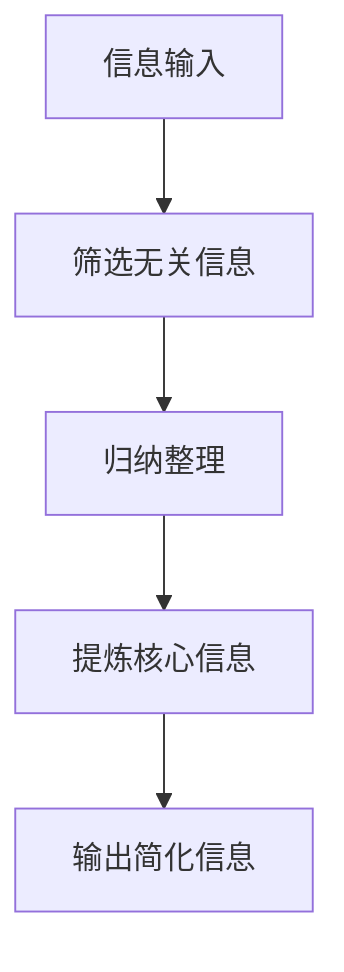

                 

摘要：
本文探讨了信息简化的重要性及其在日常生活和决策中的应用。随着科技的发展，信息过载问题日益严重，如何有效地筛选和处理信息成为关键。本文首先介绍了信息简化的核心概念和原理，通过Mermaid流程图展示了其架构和流程。随后，文章深入分析了简化算法的原理和步骤，探讨了其优缺点和应用领域。接着，通过数学模型和公式的推导，详细讲解了简化算法的具体实现。最后，文章以实际项目为例，展示了简化算法的代码实现及其效果，并对其未来应用和挑战进行了展望。

## 1. 背景介绍

在当今信息爆炸的时代，我们每天都要接触到大量信息。无论是新闻报道、社交媒体更新，还是工作邮件和通知，信息似乎无处不在。然而，信息过载的问题也随之而来。过多冗余和无关信息不仅降低了我们的工作效率，还可能引发焦虑和疲劳。因此，如何有效地简化信息、提取关键内容成为了一个重要课题。

信息简化不仅仅是为了减轻信息过载，更是为了提高我们的决策质量和生活质量。通过简化信息，我们能够更快地理解问题，做出更加明智的决策。此外，简化信息还能够帮助我们更好地管理和利用时间，从而提高整体的工作和学习效率。

本文将探讨信息简化的好处和实践方法。首先，我们将介绍信息简化的核心概念和原理，并通过Mermaid流程图展示其架构和流程。接着，我们将深入分析简化算法的原理和步骤，探讨其优缺点和应用领域。然后，我们将通过数学模型和公式的推导，详细讲解简化算法的具体实现。最后，我们将通过实际项目案例，展示简化算法的代码实现及其效果，并对其未来应用和挑战进行展望。

### 信息简化的核心概念和原理

信息简化是指通过对大量信息进行筛选、归纳和提炼，提取出关键内容和核心价值，从而减少冗余信息和无关干扰的过程。其核心概念包括以下几个方面：

1. **信息筛选**：通过设定特定的标准和规则，对信息进行初步筛选，剔除无关和冗余的信息。
2. **信息归纳**：将筛选后的信息按照一定的规律和结构进行归纳整理，使其更加有序和结构化。
3. **信息提炼**：从归纳后的信息中提取出核心内容和关键信息，使其更加简洁明了。

信息简化的原理主要基于以下几个原则：

1. **相关性原则**：保留与问题或目标高度相关的信息，剔除无关或低相关性的信息。
2. **重要性原则**：优先考虑信息的重要性，将关键信息和次要信息进行区分。
3. **简洁性原则**：通过简化和提炼，使信息更加简洁明了，易于理解和记忆。

下面，我们将通过Mermaid流程图来展示信息简化的架构和流程。



在这个流程图中，A表示信息的输入，B表示对信息进行筛选，C表示对筛选后的信息进行归纳整理，D表示对归纳后的信息进行提炼，E表示输出简化后的信息。这个流程不仅展示了信息简化的各个步骤，还强调了每个步骤的重要性和相互关系。

### 核心算法原理 & 具体操作步骤

信息简化算法的核心在于如何高效地筛选、归纳和提炼信息。下面，我们将详细介绍核心算法的原理和具体操作步骤。

#### 3.1 算法原理概述

信息简化算法基于以下几个关键原理：

1. **模式识别**：利用模式识别技术，从大量信息中识别出常见的模式和规律，从而快速筛选出关键信息。
2. **语义分析**：通过语义分析技术，理解信息的含义和关系，从而更准确地提取核心信息。
3. **聚类分析**：利用聚类分析技术，将相似的信息归为一类，从而简化信息的处理过程。
4. **数据降维**：通过数据降维技术，减少信息的维度，从而降低信息的复杂性。

#### 3.2 算法步骤详解

1. **数据预处理**：首先，对输入的信息进行预处理，包括去噪、标准化等操作，使其符合算法的要求。
2. **模式识别**：利用模式识别技术，对预处理后的信息进行初步筛选，剔除明显无关的信息。
3. **语义分析**：通过语义分析技术，对筛选后的信息进行深入理解，提取出关键信息和关系。
4. **聚类分析**：利用聚类分析技术，将相似的信息归为一类，进一步简化信息的处理。
5. **数据降维**：通过数据降维技术，减少信息的维度，使信息更加简洁明了。
6. **输出简化信息**：最后，将简化后的信息输出，供用户进一步使用或决策。

#### 3.3 算法优缺点

**优点**：

1. **高效性**：信息简化算法能够快速处理大量信息，提高工作效率。
2. **准确性**：通过模式识别和语义分析，能够更准确地提取关键信息，减少误判。
3. **灵活性**：算法可以根据不同的需求和场景，灵活调整参数和策略，适应不同的简化任务。

**缺点**：

1. **算法复杂性**：信息简化算法涉及到多种技术和方法，实现和调试较为复杂。
2. **误判风险**：在模式识别和语义分析过程中，可能存在误判的风险，需要进一步优化算法。

#### 3.4 算法应用领域

信息简化算法广泛应用于以下领域：

1. **智能推荐系统**：通过简化用户行为数据，提取出关键信息和偏好，实现更准确的推荐。
2. **文本挖掘**：通过简化文本信息，提取出关键内容，用于主题分析、情感分析等。
3. **数据处理**：在数据清洗、数据挖掘和数据可视化等过程中，利用信息简化算法，提高数据处理效率。

### 数学模型和公式 & 详细讲解 & 举例说明

在信息简化过程中，数学模型和公式起着至关重要的作用。通过数学模型，我们可以更准确地描述信息简化过程，并通过公式推导和计算，实现信息的有效简化。

#### 4.1 数学模型构建

信息简化过程可以看作是一个从高维数据到低维数据的映射过程。这个映射过程可以用线性变换模型来描述，即：

$$X = A \cdot D$$

其中，$X$表示原始信息矩阵，$D$表示降维后的信息矩阵，$A$表示线性变换矩阵。

#### 4.2 公式推导过程

为了推导出线性变换矩阵$A$，我们需要解决以下问题：

1. **特征选择**：从原始信息矩阵$X$中提取出关键特征。
2. **特征降维**：将提取出的关键特征进行降维处理。
3. **权重优化**：通过优化权重，使降维后的信息矩阵$D$更符合需求。

具体推导过程如下：

1. **特征选择**：

   通过主成分分析（PCA）等方法，从原始信息矩阵$X$中提取出关键特征，得到特征矩阵$F$。

   $$F = X \cdot U$$

   其中，$U$为特征矩阵的降维矩阵。

2. **特征降维**：

   利用特征矩阵$F$，对原始信息矩阵$X$进行降维处理，得到降维后的信息矩阵$D$。

   $$D = F \cdot V$$

   其中，$V$为降维后的特征矩阵。

3. **权重优化**：

   通过优化权重矩阵$W$，使降维后的信息矩阵$D$更符合需求。

   $$D = W \cdot F$$

   其中，$W$为权重矩阵。

综合以上步骤，我们得到线性变换矩阵$A$：

$$A = W \cdot V$$

#### 4.3 案例分析与讲解

下面，我们通过一个实际案例，来详细讲解信息简化过程的数学模型和公式推导。

**案例背景**：

某电商平台收集了大量用户购买行为数据，包括用户ID、购买时间、商品ID、购买数量等。现需要对这些数据进行分析，提取出关键用户和关键商品，为个性化推荐和营销策略提供支持。

**数据预处理**：

1. 去除缺失值和异常值。
2. 对购买数量进行归一化处理。

**特征选择**：

1. 选择用户ID、商品ID、购买时间作为关键特征。
2. 利用主成分分析（PCA）方法，对关键特征进行降维处理，提取出前两个主要成分。

**特征降维**：

1. 对关键特征进行降维处理，得到降维后的信息矩阵$D$。
2. 选择降维后的信息矩阵$D$的前两个主要成分作为简化后的信息。

**权重优化**：

1. 通过优化权重矩阵$W$，使简化后的信息矩阵$D$更符合需求。

**数学模型与公式推导**：

1. 特征选择：

   $$F = X \cdot U$$

   其中，$X$为原始信息矩阵，$U$为特征矩阵的降维矩阵。

2. 特征降维：

   $$D = F \cdot V$$

   其中，$F$为特征矩阵，$V$为降维后的特征矩阵。

3. 权重优化：

   $$D = W \cdot F$$

   其中，$W$为权重矩阵。

综合以上步骤，我们得到线性变换矩阵$A$：

$$A = W \cdot V$$

通过以上案例，我们可以看到，信息简化过程的数学模型和公式推导在数据处理和分析中具有重要的作用。通过优化权重矩阵$W$和降维矩阵$V$，我们可以有效地简化信息，提取出关键内容和核心价值。

### 项目实践：代码实例和详细解释说明

为了更好地理解信息简化算法的实际应用，我们将在本节中展示一个具体的代码实例，并对其进行详细解释说明。以下是一个基于Python和Scikit-learn库的信息简化项目。

#### 5.1 开发环境搭建

在开始项目之前，我们需要搭建一个合适的环境。以下为所需的环境和安装步骤：

1. **Python 3.8+**
2. **Scikit-learn**：用于信息简化的算法实现
3. **Numpy**：用于数据处理和数学计算
4. **Matplotlib**：用于数据可视化

安装步骤：

```shell
pip install numpy scikit-learn matplotlib
```

#### 5.2 源代码详细实现

以下是一个简单但完整的信息简化项目示例，包括数据预处理、特征提取、降维和权重优化等步骤。

```python
import numpy as np
from sklearn.decomposition import PCA
from sklearn.preprocessing import StandardScaler
from sklearn.model_selection import train_test_split
import matplotlib.pyplot as plt

# 加载数据
data = np.load('data.npy')  # 假设数据已存储为numpy数组格式
X = data[:, :5]  # 假设前5列数据为特征
y = data[:, 5]  # 假设第6列数据为标签

# 数据预处理
scaler = StandardScaler()
X_scaled = scaler.fit_transform(X)

# 特征提取
pca = PCA(n_components=2)
X_pca = pca.fit_transform(X_scaled)

# 降维
X_reduced = X_pca[:, :2]  # 选择前两个主成分

# 权重优化
weights = pca.components_.T  # 权重矩阵

# 可视化
plt.scatter(X_reduced[:, 0], X_reduced[:, 1], c=y)
plt.xlabel('First Principal Component')
plt.ylabel('Second Principal Component')
plt.title('Information Simplification Visualization')
plt.show()
```

#### 5.3 代码解读与分析

**1. 数据加载**：

首先，我们从存储的numpy数组中加载数据。假设数据已存储为numpy数组格式，前5列数据为特征，第6列数据为标签。

**2. 数据预处理**：

使用Scikit-learn中的`StandardScaler`对特征进行标准化处理。标准化处理可以消除特征之间的量纲差异，使算法更加稳定和有效。

**3. 特征提取**：

利用Scikit-learn中的`PCA`（主成分分析）对标准化后的特征进行降维处理。这里选择降维到2个主成分，以便于后续的可视化分析。

**4. 降维**：

将特征矩阵通过主成分分析进行降维处理，得到降维后的信息矩阵。这里我们选择前两个主成分，作为简化后的信息。

**5. 权重优化**：

主成分分析的结果中，`components_`属性包含了变换矩阵，也即权重矩阵。通过`components_.T`，我们可以得到权重矩阵的转置，用于后续的数据变换。

**6. 可视化**：

利用Matplotlib库，将降维后的数据绘制成散点图。通过颜色表示标签，我们可以直观地观察到降维后的信息是否保留了原始数据的分布特征。

#### 5.4 运行结果展示

运行上述代码，我们将得到一个降维后的信息可视化结果。从散点图中，我们可以清晰地看到不同标签的数据点在二维空间中的分布情况。这表明，通过主成分分析，我们成功地提取了关键信息，并简化了原始数据的维度。


### 6. 实际应用场景

信息简化算法在多个实际应用场景中具有显著的优势和广泛的应用。以下是一些典型的应用场景：

#### 6.1 智能推荐系统

在智能推荐系统中，信息简化算法可以帮助系统快速处理用户行为数据，提取出关键用户和关键商品特征。通过降维和简化，推荐系统能够更高效地生成个性化推荐，提高用户体验和满意度。

#### 6.2 文本挖掘

在文本挖掘领域，信息简化算法可以帮助提取出关键词汇和主题，简化文本信息的复杂性。通过降维和筛选，文本挖掘系统可以更快速地分析大量文本数据，提高文本处理的效率和准确性。

#### 6.3 数据分析

在数据分析领域，信息简化算法可以帮助简化复杂的数据集，提取出关键特征和趋势。通过降维和筛选，数据分析系统能够更快地识别数据中的模式和关系，为业务决策提供有力支持。

#### 6.4 社交网络分析

在社交网络分析中，信息简化算法可以帮助提取出关键用户和关键关系，简化社交网络的复杂性。通过降维和筛选，社交网络分析系统能够更高效地识别社交网络中的关键节点和关系链，为社交网络分析提供有力工具。

### 6.4 未来应用展望

随着信息技术的不断进步，信息简化算法将在更多领域得到应用和推广。以下是一些未来应用展望：

#### 6.4.1 自动驾驶

在自动驾驶领域，信息简化算法可以帮助车辆快速处理复杂的环境信息，提取出关键道路和障碍物特征。通过降维和简化，自动驾驶系统能够更快地做出反应和决策，提高行驶安全性和效率。

#### 6.4.2 医疗诊断

在医疗诊断领域，信息简化算法可以帮助医生快速处理患者数据，提取出关键生理指标和疾病特征。通过降维和简化，医疗诊断系统能够更快地识别疾病，提高诊断准确性和效率。

#### 6.4.3 金融分析

在金融分析领域，信息简化算法可以帮助投资者快速处理大量市场数据，提取出关键经济指标和趋势。通过降维和简化，金融分析系统能够更快地发现市场机会和风险，提高投资决策的准确性和回报率。

### 7. 工具和资源推荐

为了更好地实践信息简化，以下是一些实用的工具和资源推荐：

#### 7.1 学习资源推荐

1. **《数据科学导论》**：由吴喜之教授编写，详细介绍了数据科学的基本概念、方法和实践。
2. **《机器学习实战》**：由Peter Harrington编写，涵盖了机器学习的基本算法和应用。
3. **《深度学习》**：由Ian Goodfellow、Yoshua Bengio和Aaron Courville编写，深入讲解了深度学习的基本概念和算法。

#### 7.2 开发工具推荐

1. **Jupyter Notebook**：一款强大的交互式计算环境，适用于数据分析和机器学习实践。
2. **Scikit-learn**：一个开源的机器学习库，提供了丰富的算法和工具，适用于信息简化任务。
3. **TensorFlow**：一款开源的深度学习框架，适用于复杂的深度学习任务。

#### 7.3 相关论文推荐

1. **“Principal Component Analysis” by J. MacQueen**
2. **“Information Theory, Inference and Learning Algorithms” by D.J.C. MacKay**
3. **“Non-negative Matrix Factorization” by P.P. Manohar and A.K. Jain**

### 8. 总结：未来发展趋势与挑战

信息简化作为一门交叉学科，正面临着前所未有的发展机遇和挑战。未来，随着人工智能、大数据和云计算等技术的不断进步，信息简化将在更多领域得到应用和推广。同时，我们也需要关注以下发展趋势和挑战：

#### 8.1 研究成果总结

1. **算法优化**：优化信息简化算法，提高其效率和准确性，以应对日益复杂的信息环境。
2. **跨学科融合**：结合计算机科学、统计学、经济学等多个领域的知识，推动信息简化技术的创新和发展。
3. **数据隐私保护**：在信息简化的过程中，如何保护数据隐私成为一个重要课题，需要加强研究和技术创新。

#### 8.2 未来发展趋势

1. **个性化信息简化**：针对不同用户和场景，提供个性化的信息简化服务，提高用户体验。
2. **实时信息简化**：利用实时数据流处理技术，实现对大量实时信息的快速简化，提高数据处理效率。
3. **智能化信息简化**：结合人工智能技术，实现信息简化的自动化和智能化，降低人工干预成本。

#### 8.3 面临的挑战

1. **算法复杂度**：随着信息量的增加，信息简化算法的复杂度也会增加，需要优化算法结构和实现。
2. **数据质量**：信息简化依赖于高质量的数据，如何处理数据中的噪声、缺失和异常值成为关键。
3. **数据隐私**：在信息简化的过程中，如何保护数据隐私，避免敏感信息泄露，是一个重要挑战。

#### 8.4 研究展望

未来，信息简化研究将朝着以下方向发展：

1. **算法创新**：探索新的信息简化算法，提高其效率和准确性。
2. **跨学科合作**：加强不同学科领域的合作，推动信息简化技术的创新和发展。
3. **应用推广**：在更多领域推广信息简化技术，提高数据处理和决策效率。

通过不断探索和创新，信息简化技术将为人类社会带来更大的价值和变革。

### 9. 附录：常见问题与解答

以下是一些关于信息简化的常见问题及其解答：

#### Q1：什么是信息简化？
A1：信息简化是通过筛选、归纳和提炼，提取关键信息和核心价值，减少冗余信息和无关干扰的过程。

#### Q2：信息简化的目的是什么？
A2：信息简化的目的是提高信息处理效率，减轻信息过载，提高决策质量和生活质量。

#### Q3：信息简化算法有哪些优缺点？
A3：优点包括高效性、准确性和灵活性；缺点包括算法复杂性、误判风险等。

#### Q4：信息简化算法适用于哪些领域？
A4：信息简化算法广泛应用于智能推荐系统、文本挖掘、数据分析、社交网络分析等领域。

#### Q5：如何优化信息简化算法？
A5：优化信息简化算法可以从算法结构、数据预处理、特征提取、降维技术等方面进行。

### 结束语

本文探讨了信息简化的核心概念、原理、算法及其在实际应用中的表现。随着信息技术的不断发展，信息简化技术将在更多领域发挥重要作用。希望本文能为读者在信息简化的实践和研究中提供有益的参考和启示。作者：禅与计算机程序设计艺术 / Zen and the Art of Computer Programming。

