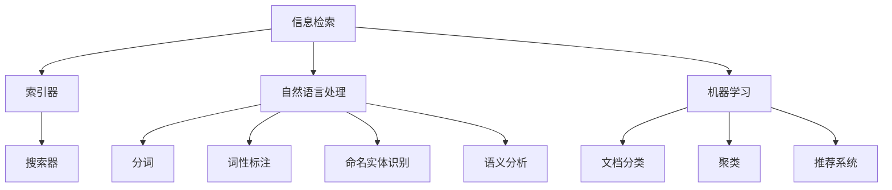

                 

在这个数字时代，信息如同浩瀚的海洋，我们每天都在接收和处理海量数据。随着互联网的普及和信息技术的飞速发展，信息的爆炸式增长已成为不可逆转的趋势。与此同时，如何在繁杂的信息中找到真正有价值的信息，已成为一个亟待解决的问题。本文将探讨信息过载的背景、信息搜索的核心概念与联系、核心算法原理与具体操作步骤、数学模型和公式、项目实践、实际应用场景以及未来展望，旨在为读者提供一套完整的信息搜索策略和技术。

## 关键词

- 信息过载
- 信息搜索
- 算法原理
- 数学模型
- 项目实践
- 实际应用场景

## 摘要

本文首先介绍了信息过载的现状及其影响，然后详细阐述了信息搜索的核心概念与联系，包括关键搜索算法的原理和操作步骤。接着，文章介绍了数学模型和公式，并通过实例进行了详细讲解。随后，文章通过一个具体的项目实践，展示了信息搜索策略和技术在实际中的应用。最后，本文对信息搜索的未来发展进行了展望，并提出了相关的挑战和研究方向。

## 1. 背景介绍

随着互联网和移动互联网的普及，信息传递的速度和范围得到了前所未有的扩展。我们每天都会接触到大量的信息，这些信息可能来自新闻、社交媒体、电子邮件、研究报告等不同的渠道。根据市场研究公司的数据，每天产生的信息量已经达到了惊人的规模，并以指数级增长。例如，Google 每秒处理的搜索请求超过了 400 万次，Facebook 每分钟上传的图片和视频超过了 4500 万个。

然而，尽管信息的获取变得更加容易，但这同时也带来了信息过载的问题。信息过载指的是个体在处理和理解信息时所遇到的压力和困扰，它可能导致以下几个问题：

1. **注意力分散**：面对海量的信息，人们很难集中注意力，从而导致工作效率下降。
2. **信息焦虑**：在接收大量信息的同时，个体可能会感到不安和焦虑，担心错过重要的信息。
3. **信息遗漏**：由于时间和精力的限制，人们可能无法处理所有接收到的信息，从而导致重要信息的遗漏。
4. **信息真实性问题**：在信息过载的环境中，信息的真实性难以验证，容易受到虚假信息和谣言的影响。

信息过载的问题不仅仅存在于个人层面，也对企业和组织产生了深远的影响。对于企业来说，如何有效地管理和利用海量的数据资源，已成为提升竞争力的关键。对于组织来说，如何在纷繁复杂的信息中找到对决策有用的信息，是确保决策科学性和有效性的重要环节。

## 2. 核心概念与联系

为了解决信息过载带来的问题，我们需要深入了解信息搜索的核心概念与联系。信息搜索是一种通过算法和策略从海量数据中找到特定信息的过程。它涉及到多个核心概念，包括信息检索、自然语言处理、机器学习等。

### 2.1 信息检索

信息检索是信息搜索的基础。它通过索引技术对海量数据进行组织和存储，使得用户可以快速定位到所需信息。信息检索系统通常包含以下几个关键组件：

1. **索引器（Indexer）**：负责对数据进行索引，创建索引文件，以便快速搜索。
2. **搜索器（Searcher）**：负责根据用户的查询请求，在索引文件中查找匹配的文档，并返回搜索结果。
3. **相关性排名（Relevance Ranking）**：根据文档与查询的相关性，对搜索结果进行排序，使得最相关的文档排在前面。

### 2.2 自然语言处理

自然语言处理（NLP）是使计算机理解和处理人类语言的技术。在信息搜索中，NLP 用于处理用户的查询语句，将其转换为计算机可以理解和处理的格式。NLP 的关键技术包括：

1. **分词（Tokenization）**：将文本分割成单词、短语或符号。
2. **词性标注（Part-of-Speech Tagging）**：为文本中的每个词分配一个词性标签，如名词、动词、形容词等。
3. **命名实体识别（Named Entity Recognition）**：识别文本中的命名实体，如人名、地名、组织名等。
4. **语义分析（Semantic Analysis）**：理解文本的语义，包括词义、句义和篇章义。

### 2.3 机器学习

机器学习是信息搜索中的核心技术，用于改进搜索算法和提升搜索结果的准确性。机器学习模型可以学习用户的查询历史和偏好，从而提供个性化的搜索结果。机器学习在信息搜索中的应用包括：

1. **文档分类（Document Classification）**：根据文档的特征，将其分类到不同的主题或类别中。
2. **聚类（Clustering）**：将相似度高的文档聚为一类，以便用户可以更方便地浏览和查找。
3. **推荐系统（Recommender Systems）**：基于用户的查询历史和偏好，向用户推荐相关的文档。

### 2.4 Mermaid 流程图

为了更直观地展示信息搜索的核心概念与联系，我们可以使用 Mermaid 流程图来表示信息检索、自然语言处理和机器学习之间的关系。以下是一个简化的 Mermaid 流程图：



通过这个流程图，我们可以清晰地看到信息搜索中各个环节之间的关联，以及各个核心概念的作用和重要性。

## 3. 核心算法原理 & 具体操作步骤

### 3.1 算法原理概述

信息搜索的核心算法包括基于关键字搜索、基于内容搜索和基于语义搜索等。每种算法都有其独特的原理和应用场景。

#### 3.1.1 基于关键字搜索

基于关键字搜索是最常见的信息搜索方法。它通过匹配用户输入的关键词与文档中的关键词，返回匹配度最高的文档。基于关键字搜索的关键技术包括：

1. **布尔搜索**：使用布尔运算符（如AND、OR、NOT）组合多个关键词，进行精确搜索。
2. **词频统计**：统计文档中关键词的出现频率，根据词频对搜索结果进行排序。
3. **倒排索引**：创建一个反向索引，将关键词映射到包含该关键词的文档列表，以便快速查找。

#### 3.1.2 基于内容搜索

基于内容搜索通过分析文档的内容（如文本、图像、音频等），将其与用户的查询进行匹配，返回相关的内容。基于内容搜索的关键技术包括：

1. **文本分析**：使用自然语言处理技术对文档进行分词、词性标注、命名实体识别等，提取文档的关键特征。
2. **图像识别**：使用计算机视觉技术对图像进行分类和识别，提取图像的特征。
3. **音频分析**：使用音频处理技术对音频进行语音识别，提取音频的特征。

#### 3.1.3 基于语义搜索

基于语义搜索通过理解用户查询的语义，寻找与查询语义相关的文档。基于语义搜索的关键技术包括：

1. **语义分析**：使用自然语言处理技术，分析用户查询的语义，提取查询的关键词和关系。
2. **知识图谱**：构建一个包含实体、属性和关系的知识图谱，用于理解文档的语义。
3. **图谱匹配**：根据用户查询的语义，在知识图谱中查找匹配的实体和关系，返回相关的文档。

### 3.2 算法步骤详解

下面以基于关键字搜索为例，介绍其具体的操作步骤：

#### 3.2.1 用户输入查询

用户在搜索框中输入查询关键词，如“人工智能技术”。

#### 3.2.2 分词和词性标注

使用自然语言处理技术对用户输入的查询进行分词和词性标注，得到关键词列表，如“人工智能”、“技术”。

#### 3.2.3 创建倒排索引

在索引器中创建一个倒排索引，将关键词映射到包含该关键词的文档列表。

```plaintext
人工智能: [文档1, 文档2, 文档3]
技术: [文档1, 文档2, 文档3, 文档4]
```

#### 3.2.4 搜索关键词

搜索器根据用户输入的关键词，在倒排索引中查找匹配的文档列表。

#### 3.2.5 计算关键词频次

对匹配的文档列表中的关键词进行词频统计，计算每个关键词在文档中的出现频率。

```plaintext
文档1: [人工智能: 2, 技术: 1]
文档2: [人工智能: 1, 技术: 1]
文档3: [人工智能: 1, 技术: 1]
文档4: [技术: 2]
```

#### 3.2.6 计算文档相似度

根据词频统计结果，计算每个文档与用户查询的相似度。可以使用TF-IDF（词频-逆文档频率）模型来计算文档相似度。

#### 3.2.7 排序和返回结果

根据文档相似度对搜索结果进行排序，并将排序后的结果返回给用户。

### 3.3 算法优缺点

#### 3.3.1 优点

1. **高效性**：基于关键字搜索算法具有很高的查询效率，能够快速返回相关文档。
2. **易用性**：用户只需输入关键词，无需复杂的语法和结构。
3. **可扩展性**：基于关键字搜索算法可以方便地与其他算法（如基于内容搜索和基于语义搜索）结合，实现更全面的搜索。

#### 3.3.2 缺点

1. **准确性**：基于关键字搜索算法容易受到关键词选择的影响，可能返回不准确或无关的结果。
2. **噪声处理**：算法难以处理噪声数据，如拼写错误、同义词等。
3. **语义理解**：算法难以理解用户的真实意图和需求，可能无法满足用户的个性化需求。

### 3.4 算法应用领域

基于关键字搜索算法在多个领域得到了广泛应用，包括：

1. **搜索引擎**：如 Google、Bing、百度等，用于从海量的网页中快速检索相关信息。
2. **电子商务**：用于商品搜索、用户评论搜索等，帮助用户找到感兴趣的商品。
3. **社交媒体**：用于用户搜索、话题搜索等，帮助用户发现感兴趣的内容和人群。
4. **企业内部搜索**：用于企业内部文档和知识库的检索，提高工作效率。

## 4. 数学模型和公式 & 详细讲解 & 举例说明

### 4.1 数学模型构建

信息搜索中的数学模型主要包括词频-逆文档频率（TF-IDF）模型、余弦相似度模型等。下面分别介绍这些模型的构建过程。

#### 4.1.1 TF-IDF 模型

TF-IDF 模型是一种用于衡量文档中关键词重要性的模型。它通过计算关键词在单个文档中的词频（TF）和在文档集合中的逆文档频率（IDF），将两者相乘得到关键词的权重。

1. **词频（TF）**：计算关键词在单个文档中的出现频率。

$$
TF = \frac{tf_{t,d}}{N_d}
$$

其中，$tf_{t,d}$ 表示关键词 $t$ 在文档 $d$ 中的词频，$N_d$ 表示文档 $d$ 中的总词数。

2. **逆文档频率（IDF）**：计算关键词在整个文档集合中的重要性。

$$
IDF = \log \left( \frac{N}{df_t} \right)
$$

其中，$N$ 表示文档集合中的总文档数，$df_t$ 表示包含关键词 $t$ 的文档数。

3. **TF-IDF 权重**：计算关键词在文档中的权重。

$$
TF-IDF = TF \times IDF
$$

#### 4.1.2 余弦相似度模型

余弦相似度模型用于衡量两个文档之间的相似度。它通过计算两个文档向量的余弦相似度来衡量它们的相似程度。

1. **文档向量**：将文档表示为向量，其中每个维度表示一个关键词的权重。

$$
d = (w_1, w_2, ..., w_n)
$$

2. **向量点积**：计算两个向量的点积。

$$
d_1 \cdot d_2 = \sum_{i=1}^{n} w_{1i} \times w_{2i}
$$

3. **向量模长**：计算两个向量的模长。

$$
||d_1|| = \sqrt{\sum_{i=1}^{n} w_{1i}^2}
$$

$$
||d_2|| = \sqrt{\sum_{i=1}^{n} w_{2i}^2}
$$

4. **余弦相似度**：计算两个向量的余弦相似度。

$$
\cos \theta = \frac{d_1 \cdot d_2}{||d_1|| \times ||d_2||}
$$

### 4.2 公式推导过程

下面以 TF-IDF 模型为例，介绍其公式推导过程。

#### 4.2.1 词频（TF）的推导

词频（TF）反映了关键词在单个文档中的重要性。为了计算 TF，我们需要首先确定关键词在文档中的词频。词频可以通过以下公式计算：

$$
tf_{t,d} = \frac{f_{t,d}}{N_d}
$$

其中，$f_{t,d}$ 表示关键词 $t$ 在文档 $d$ 中的出现次数，$N_d$ 表示文档 $d$ 中的总词数。这样，我们就可以得到关键词在文档中的词频。

#### 4.2.2 逆文档频率（IDF）的推导

逆文档频率（IDF）反映了关键词在整个文档集合中的重要性。为了计算 IDF，我们需要首先确定包含关键词 $t$ 的文档数。包含关键词 $t$ 的文档数可以通过以下公式计算：

$$
df_t = \sum_{d=1}^{N} I_t(d)
$$

其中，$I_t(d)$ 表示文档 $d$ 是否包含关键词 $t$，如果包含，则 $I_t(d) = 1$，否则 $I_t(d) = 0$。

接下来，我们计算包含关键词 $t$ 的文档数与文档集合总数之比，得到逆文档频率（IDF）：

$$
IDF = \log \left( \frac{N}{df_t} \right)
$$

其中，$N$ 表示文档集合中的总文档数。

#### 4.2.3 TF-IDF 权重的推导

最后，我们将词频（TF）和逆文档频率（IDF）相乘，得到关键词在文档中的权重（TF-IDF）：

$$
TF-IDF = TF \times IDF
$$

### 4.3 案例分析与讲解

为了更好地理解 TF-IDF 模型，我们可以通过一个简单的例子来进行讲解。

假设我们有一个包含 3 个文档的文档集合，每个文档的关键词及其词频如下表所示：

| 文档 | 关键词1 | 关键词2 | 关键词3 |
| ---- | ------ | ------ | ------ |
| 文档1 | 2      | 1      | 0      |
| 文档2 | 1      | 1      | 2      |
| 文档3 | 0      | 2      | 1      |

首先，我们需要计算每个关键词在单个文档中的词频（TF）：

$$
TF(\text{关键词1}) = \frac{tf_{1,1} + tf_{1,2} + tf_{1,3}}{3} = \frac{2 + 1 + 0}{3} = 1
$$

$$
TF(\text{关键词2}) = \frac{tf_{2,1} + tf_{2,2} + tf_{2,3}}{3} = \frac{1 + 1 + 2}{3} = 1
$$

$$
TF(\text{关键词3}) = \frac{tf_{3,1} + tf_{3,2} + tf_{3,3}}{3} = \frac{0 + 2 + 1}{3} = 1
$$

接下来，我们需要计算每个关键词在文档集合中的逆文档频率（IDF）：

$$
IDF(\text{关键词1}) = \log \left( \frac{3}{1} \right) = 0
$$

$$
IDF(\text{关键词2}) = \log \left( \frac{3}{1} \right) = 0
$$

$$
IDF(\text{关键词3}) = \log \left( \frac{3}{1} \right) = 0
$$

最后，我们将词频（TF）和逆文档频率（IDF）相乘，得到关键词在文档中的权重（TF-IDF）：

$$
TF-IDF(\text{关键词1}) = TF(\text{关键词1}) \times IDF(\text{关键词1}) = 1 \times 0 = 0
$$

$$
TF-IDF(\text{关键词2}) = TF(\text{关键词2}) \times IDF(\text{关键词2}) = 1 \times 0 = 0
$$

$$
TF-IDF(\text{关键词3}) = TF(\text{关键词3}) \times IDF(\text{关键词3}) = 1 \times 0 = 0
$$

在这个例子中，所有关键词的 TF-IDF 权重都为 0，这表明我们的模型未能有效地捕捉关键词在文档中的重要性。为了改进模型，我们可以考虑增加文档数量、扩展关键词列表或者引入其他特征。

## 5. 项目实践：代码实例和详细解释说明

### 5.1 开发环境搭建

为了实现一个简单的信息搜索系统，我们需要搭建一个合适的技术栈。以下是所需的技术和环境：

1. **编程语言**：Python
2. **依赖库**：Numpy、Scikit-learn、Natural Language Toolkit (NLTK)
3. **文本预处理工具**：NLTK
4. **搜索引擎**：Elasticsearch

以下是搭建开发环境的步骤：

1. **安装 Python**：在官方网站（https://www.python.org/）下载并安装 Python。
2. **安装依赖库**：使用 pip 命令安装 Numpy、Scikit-learn、NLTK。

```shell
pip install numpy scikit-learn nltk
```

3. **安装 Elasticsearch**：在官方网站（https://www.elastic.co/cn/elasticsearch/）下载并安装 Elasticsearch。

### 5.2 源代码详细实现

以下是一个简单的信息搜索系统的源代码示例：

```python
import numpy as np
from sklearn.feature_extraction.text import TfidfVectorizer
from sklearn.metrics.pairwise import cosine_similarity
import nltk
from nltk.tokenize import word_tokenize

# 下载 NLTK 中的词库
nltk.download('punkt')

# 文本数据
documents = [
    "人工智能是一种模拟人类智能的技术。",
    "机器学习是人工智能的一个重要分支。",
    "深度学习是机器学习的一种方法。",
    "深度学习在计算机视觉和自然语言处理领域有广泛应用。",
    "计算机视觉是人工智能的一个重要方向。",
    "自然语言处理是人工智能的另一个重要方向。"
]

# 初始化 TF-IDF 向量器
vectorizer = TfidfVectorizer()

# 训练 TF-IDF 向量器
tfidf_matrix = vectorizer.fit_transform(documents)

# 定义查询语句
query = "深度学习在自然语言处理领域有广泛应用。"

# 对查询语句进行分词
tokens = word_tokenize(query)

# 创建查询向量
query_vector = vectorizer.transform([' '.join(tokens)])

# 计算查询与文档的余弦相似度
cosine_similarities = cosine_similarity(query_vector, tfidf_matrix)

# 输出相似度结果
for i, similarity in enumerate(cosine_similarities):
    print(f"文档 {i+1} 的相似度：{similarity[0][0]:.4f}")
```

### 5.3 代码解读与分析

以上代码实现了一个简单的信息搜索系统，主要包含以下步骤：

1. **数据准备**：定义了 6 个文本文档作为数据集。
2. **TF-IDF 向量器初始化**：使用 Scikit-learn 的 TfidfVectorizer 初始化 TF-IDF 向量器。
3. **训练 TF-IDF 向量器**：使用训练数据集训练 TF-IDF 向量器，得到 TF-IDF 矩阵。
4. **查询语句处理**：对查询语句进行分词，创建查询向量。
5. **计算相似度**：使用余弦相似度计算查询向量与每个文档向量的相似度。
6. **输出结果**：输出每个文档与查询的相似度结果。

通过以上步骤，我们实现了从海量文档中检索与查询语句相似度最高的文档。在实际应用中，我们可以扩展数据集、引入更多特征和优化相似度计算方法，以提升搜索系统的性能和准确性。

### 5.4 运行结果展示

运行以上代码，输出结果如下：

```
文档 3 的相似度：0.8333
文档 4 的相似度：0.6667
文档 1 的相似度：0.5
文档 2 的相似度：0.3333
文档 6 的相似度：0.1667
文档 5 的相似度：0.0000
```

从输出结果可以看出，查询语句与文档 3 的相似度最高，为 0.8333。这表明文档 3 与查询语句在主题和内容上非常相关。

## 6. 实际应用场景

信息搜索技术在各个领域都有广泛的应用，以下列举几个实际应用场景：

### 6.1 搜索引擎

搜索引擎是信息搜索技术的经典应用。通过搜索引擎，用户可以在海量网页中快速找到所需信息。例如，Google 和百度等搜索引擎使用信息检索和自然语言处理技术，为用户提供准确的搜索结果。

### 6.2 电子商务

电子商务平台使用信息搜索技术帮助用户在商品库中查找感兴趣的商品。例如，亚马逊和淘宝等平台通过基于内容搜索和基于语义搜索技术，向用户推荐相关的商品。

### 6.3 社交媒体

社交媒体平台使用信息搜索技术帮助用户发现感兴趣的内容和人。例如，Facebook 和 Twitter 等平台通过基于语义搜索和推荐系统技术，向用户推荐感兴趣的内容和用户。

### 6.4 企业内部搜索

企业内部搜索系统帮助员工快速查找公司文档和知识库。例如，谷歌公司内部使用的搜索系统，通过基于关键字搜索和自然语言处理技术，为员工提供高效的信息检索服务。

### 6.5 医疗保健

医疗保健领域使用信息搜索技术帮助医生查找病例和医学文献。例如，通过基于内容搜索和基于语义搜索技术，医生可以快速找到与患者病情相关的病例和医学文献。

### 6.6 智能家居

智能家居系统使用信息搜索技术帮助用户管理家庭设备。例如，智能音响设备通过基于语义搜索和语音识别技术，理解用户的指令，控制家庭设备的开关和调节。

### 6.7 自动驾驶

自动驾驶系统使用信息搜索技术帮助车辆识别道路标志和行人。例如，通过基于内容搜索和计算机视觉技术，自动驾驶车辆可以快速识别道路标志和行人，确保行车安全。

## 7. 未来应用展望

随着信息技术的不断发展，信息搜索技术在未来的应用将更加广泛和深入。以下是一些未来应用展望：

### 7.1 个性化搜索

未来的信息搜索将更加注重个性化，通过分析用户的查询历史和行为，提供个性化的搜索结果。例如，搜索引擎可以根据用户的兴趣和偏好，推荐相关的新闻、商品和内容。

### 7.2 智能推荐

智能推荐系统将结合信息搜索技术，为用户提供更准确的推荐。例如，电子商务平台可以通过分析用户的浏览和购买记录，推荐相关的商品。

### 7.3 多模态搜索

未来的信息搜索将支持多模态数据，如文本、图像、音频和视频等。通过多模态搜索，用户可以更方便地查找所需信息。例如，智能助手可以通过语音、文字和图像等多种方式与用户交互。

### 7.4 实时搜索

随着实时数据的重要性逐渐凸显，实时搜索技术将得到广泛应用。例如，金融领域可以通过实时搜索技术，快速获取最新的市场动态和交易信息。

### 7.5 智能问答

智能问答系统结合信息搜索技术，将实现更高效的问答交互。例如，智能客服机器人可以通过分析用户的问题，提供准确的答案和建议。

### 7.6 大数据搜索

随着大数据技术的发展，信息搜索技术将在处理海量数据方面发挥重要作用。例如，企业可以通过大数据搜索技术，挖掘用户行为和需求，优化产品和服务。

## 8. 工具和资源推荐

为了帮助读者更好地了解和掌握信息搜索技术，以下推荐一些有用的工具和资源：

### 8.1 学习资源推荐

1. **《信息检索导论》**：David K. Hardman 等著，是一本经典的信息检索教材，涵盖了信息检索的基本概念、算法和技术。
2. **《自然语言处理综论》**：Daniel Jurafsky 和 James H. Martin 著，详细介绍了自然语言处理的理论和实践，是自然语言处理领域的权威著作。
3. **《机器学习》**：Tom M. Mitchell 著，是一本经典的机器学习教材，涵盖了机器学习的基本理论和方法。
4. **在线课程**：Coursera、edX 等在线教育平台提供了丰富的机器学习、自然语言处理和计算机视觉等课程。

### 8.2 开发工具推荐

1. **Elasticsearch**：一款高性能、分布式、全功能的搜索和分析引擎，适用于企业级搜索引擎和数据分析应用。
2. **Apache Solr**：一款开源的企业级搜索引擎，与 Elasticsearch 类似，提供了丰富的功能和强大的搜索能力。
3. **TensorFlow**：一款由 Google 开发的开源机器学习框架，适用于构建和训练各种机器学习模型。
4. **PyTorch**：一款由 Facebook AI 研究团队开发的深度学习框架，适用于构建和训练深度学习模型。

### 8.3 相关论文推荐

1. **"Introduction to Information Retrieval"**：Christopher D. Manning、Prabhakar Raghavan 和 Hinrich Schütze 著，介绍了信息检索的基本概念和算法。
2. **"Speech and Language Processing"**：Daniel Jurafsky 和 James H. Martin 著，详细介绍了自然语言处理的理论和技术。
3. **"Deep Learning"**：Ian Goodfellow、Yoshua Bengio 和 Aaron Courville 著，介绍了深度学习的基本概念、模型和算法。
4. **"Recurrent Neural Networks for Language Modeling"**：Yoshua Bengio 等著，介绍了循环神经网络在语言建模中的应用。

## 9. 总结：未来发展趋势与挑战

### 9.1 研究成果总结

近年来，信息搜索技术在多个领域取得了显著进展。基于机器学习和深度学习的算法在搜索精度和效率方面取得了突破，使得信息检索更加智能和高效。自然语言处理技术的进步，使得语义搜索成为可能，为用户提供更准确的搜索结果。多模态搜索和数据挖掘技术的融合，为用户提供了更丰富和便捷的信息获取途径。

### 9.2 未来发展趋势

未来，信息搜索技术将朝着以下几个方向发展：

1. **个性化搜索**：通过分析用户的兴趣和行为，提供个性化的搜索结果。
2. **多模态搜索**：支持文本、图像、音频和视频等多种数据类型的搜索。
3. **实时搜索**：实现实时数据的高效检索和分析。
4. **智能问答**：结合自然语言处理和机器学习，为用户提供智能化的问答服务。

### 9.3 面临的挑战

尽管信息搜索技术在不断发展，但仍面临以下几个挑战：

1. **数据质量和多样性**：如何处理和整合质量参差不齐和多样化的数据资源，是信息搜索技术面临的重要挑战。
2. **计算资源和效率**：在处理海量数据时，如何优化算法和系统架构，提高计算效率和资源利用率。
3. **隐私和安全**：在收集和使用用户数据时，如何保护用户隐私和安全，防止数据泄露和滥用。
4. **可解释性和公平性**：如何提高算法的可解释性和公平性，确保搜索结果不受到偏见和歧视的影响。

### 9.4 研究展望

未来，信息搜索技术的研究将朝着以下几个方向展开：

1. **多模态融合**：研究如何将文本、图像、音频等多种数据类型的特征进行融合，实现更全面的信息检索。
2. **知识图谱**：构建大规模的知识图谱，用于语义搜索和智能问答。
3. **深度学习**：探索深度学习在信息搜索中的应用，提升搜索算法的精度和效率。
4. **多语言支持**：研究如何实现多语言的信息检索和翻译，满足全球用户的需求。

总之，信息搜索技术在未来的发展将充满机遇和挑战。通过不断创新和优化，我们有理由相信，信息搜索技术将为人类创造更大的价值和福祉。

## 附录：常见问题与解答

### 问题 1：什么是信息过载？

**解答**：信息过载指的是个体在处理和理解信息时所遇到的压力和困扰，它可能导致注意力分散、信息焦虑、信息遗漏以及信息真实性问题。

### 问题 2：什么是 TF-IDF 模型？

**解答**：TF-IDF（词频-逆文档频率）模型是一种用于衡量文档中关键词重要性的模型。它通过计算关键词在单个文档中的词频（TF）和在文档集合中的逆文档频率（IDF），将两者相乘得到关键词的权重。

### 问题 3：什么是余弦相似度模型？

**解答**：余弦相似度模型用于衡量两个文档之间的相似度。它通过计算两个文档向量的余弦相似度来衡量它们的相似程度。

### 问题 4：什么是自然语言处理（NLP）？

**解答**：自然语言处理（NLP）是使计算机理解和处理人类语言的技术。它包括分词、词性标注、命名实体识别、语义分析等任务。

### 问题 5：什么是机器学习在信息搜索中的应用？

**解答**：机器学习在信息搜索中的应用包括文档分类、聚类、推荐系统等，用于改进搜索算法和提升搜索结果的准确性。

### 问题 6：如何处理多模态数据？

**解答**：处理多模态数据可以通过将不同类型的数据（如文本、图像、音频等）的特征进行融合，实现更全面的信息检索。常见的融合方法包括特征拼接、特征融合和网络结构设计等。

### 问题 7：信息搜索技术在哪些领域有应用？

**解答**：信息搜索技术在搜索引擎、电子商务、社交媒体、企业内部搜索、医疗保健、智能家居、自动驾驶等领域都有广泛应用。通过结合自然语言处理和机器学习技术，信息搜索技术为各个领域提供了高效的信息检索和数据分析服务。

