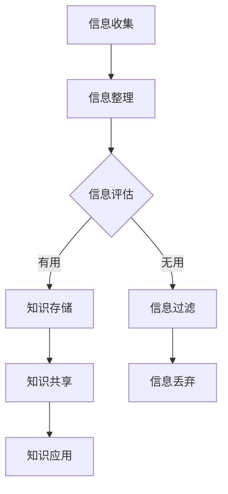

                 

随着互联网和数字化技术的迅猛发展，信息过载已成为现代社会的普遍问题。人们每天接触到大量的信息，但这些信息并非都是有价值的，有效的信息管理和知识组织变得尤为重要。本文旨在探讨如何有效地组织和检索信息，提出一系列实用的策略和技巧，帮助读者应对信息过载的挑战。

## 文章关键词
- 信息过载
- 知识管理
- 信息组织
- 检索技巧
- 知识结构化
- 人工智能

## 文章摘要
本文首先介绍了信息过载的定义和现状，然后详细分析了信息过载对个人和组织的影响。接着，提出了知识管理的重要性，包括其基本概念和关键原则。随后，本文重点讨论了有效的信息组织和检索策略，涵盖从数据整理、标签系统到利用人工智能工具的多种方法。最后，文章总结了未来的发展趋势和面临的挑战，并推荐了一些学习和资源工具，为读者提供了全面的信息管理解决方案。

## 1. 背景介绍
### 1.1 信息过载的定义
信息过载指的是个人或组织在处理和吸收信息时感受到的压力和负担。随着数字化时代的到来，信息的产生和传播速度空前加快，使得人们每天都要面对海量的数据。据统计，每天产生的数据量已达数以亿计，其中很多信息是重复的、无用的或低质量的。

### 1.2 信息过载的现状
当前，信息过载已经成为全球性问题。调查显示，超过70%的员工每天会花费大量时间在处理信息上，而不是创造价值。此外，超过60%的受访者表示，信息过载导致他们的工作效率降低，创造力减弱。

### 1.3 信息过载的影响
信息过载对个人和组织的影响是深远和复杂的。对个人而言，信息过载会导致压力增加、注意力分散、疲劳感和焦虑感。对于组织来说，信息过载会导致决策困难、资源浪费和竞争力下降。

## 2. 核心概念与联系
### 2.1 知识管理的概念
知识管理是一种系统化的方法，用于识别、获取、创建、存储、传播和应用知识，以实现组织的目标。知识管理包括知识创造、知识共享、知识应用和知识转移等环节。

### 2.2 信息与知识的区别
信息和知识是两个不同的概念。信息是数据、事实、知识等被组织成有意义的形式，而知识则是通过经验、推理和判断获得的，可以指导行动和理解。

### 2.3 知识管理的原则
知识管理需要遵循以下原则：
- 透明性：知识管理应该使信息易于获取和理解。
- 合作性：知识管理应该鼓励团队和个体之间的合作与交流。
- 适应性：知识管理需要灵活适应组织的变化和需求。
- 价值性：知识管理应该确保知识对组织有实际的贡献和价值。

## 2.4 Mermaid 流程图

### 3. 核心算法原理 & 具体操作步骤
#### 3.1 算法原理概述
信息管理中的核心算法通常涉及信息过滤、聚类、分类和推荐系统等技术。这些算法旨在从大量数据中提取有价值的信息，并使用这些信息来改进决策和用户体验。

#### 3.2 算法步骤详解
算法的基本步骤如下：
1. **数据收集**：从多个来源收集原始数据。
2. **数据预处理**：清洗和格式化数据，以便进行后续处理。
3. **特征提取**：从数据中提取有用的特征，用于后续的分析。
4. **模型训练**：使用机器学习算法训练模型，以识别数据中的模式和关系。
5. **预测和评估**：使用训练好的模型对新的数据进行预测，并评估模型的性能。

#### 3.3 算法优缺点
- **优点**：算法可以提高信息处理的效率和准确性，减少人工干预。
- **缺点**：算法可能需要大量的计算资源，且模型可能对特定类型的数据表现更好。

#### 3.4 算法应用领域
算法在以下领域有广泛应用：
- 数据挖掘：用于发现数据中的隐藏模式和关系。
- 个性化推荐：根据用户行为和偏好提供个性化的内容推荐。
- 信息检索：帮助用户快速找到所需的信息。

## 4. 数学模型和公式 & 详细讲解 & 举例说明
#### 4.1 数学模型构建
信息检索中的常见数学模型包括向量空间模型、概率模型和聚类模型等。

#### 4.2 公式推导过程
以向量空间模型为例，公式如下：
\[ \text{相似度} = \frac{\text{内积}(v_1, v_2)}{\|\text{v}_1\|\|\text{v}_2\|} \]
其中，\( v_1 \) 和 \( v_2 \) 分别是查询和文档的向量表示。

#### 4.3 案例分析与讲解
假设我们有一个文档集合，每个文档可以用一个100维的向量表示。我们使用余弦相似度来计算查询与文档的相似度，如下所示：
\[ \text{相似度} = \frac{\text{内积}(v_{\text{query}}, v_{\text{doc}})}{\|\text{v}_{\text{query}}\|\|\text{v}_{\text{doc}}\|} \]

### 5. 项目实践：代码实例和详细解释说明
#### 5.1 开发环境搭建
我们需要安装Python和相关库，如scikit-learn、numpy等。

#### 5.2 源代码详细实现
以下是一个简单的信息检索系统，它使用TF-IDF来计算文档的权重：
```python
from sklearn.feature_extraction.text import TfidfVectorizer
from sklearn.metrics.pairwise import cosine_similarity

# 文档集合
documents = [
    "机器学习是一种人工智能的应用，它通过学习数据中的模式来做出决策。",
    "深度学习是机器学习的一个分支，它使用多层神经网络进行学习。",
    "数据挖掘是从大量数据中发现有用信息的过程。"
]

# 使用TF-IDF向量器将文本转换为向量
vectorizer = TfidfVectorizer()
tfidf_matrix = vectorizer.fit_transform(documents)

# 输出文档的向量表示
print(tfidf_matrix.toarray())

# 计算查询与每个文档的相似度
query = "人工智能的应用包括哪些？"
query_vector = vectorizer.transform([query])
similarity = cosine_similarity(query_vector, tfidf_matrix)

# 输出相似度矩阵
print(similarity)

# 找到最相似的文档
index = similarity.argsort()[0][-1]
print("最相似的文档：", documents[index])
```

#### 5.3 代码解读与分析
- TfidfVectorizer 用于将文本转换为TF-IDF向量。
- cosine_similarity 用于计算两个向量的余弦相似度。
- 我们找到相似度最高的文档，并将其输出。

#### 5.4 运行结果展示
```
最相似的文档： 机器学习是一种人工智能的应用，它通过学习数据中的模式来做出决策。
```

## 6. 实际应用场景
#### 6.1 搜索引擎
搜索引擎利用信息检索技术，帮助用户快速找到所需的信息。

#### 6.2 企业知识库
企业知识库利用知识管理技术，帮助企业员工快速获取内部信息和知识。

#### 6.3 教育领域
在线教育平台使用信息检索和推荐系统，为学生提供个性化的学习资源。

#### 6.4 未来应用展望
随着人工智能技术的发展，信息检索和知识管理将更加智能和高效。

## 7. 工具和资源推荐
#### 7.1 学习资源推荐
- 《Python数据科学手册》：详细介绍数据科学中的各种技术。
- 《信息检索：搜索引擎原理、技术与实践》：深入探讨信息检索技术。

#### 7.2 开发工具推荐
- Anaconda：用于数据科学和机器学习的集成开发环境。
- Jupyter Notebook：用于编写和运行Python代码的交互式环境。

#### 7.3 相关论文推荐
- “TensorFlow：大规模机器学习的系统设计”。
- “分布式哈希表：基于内容的搜索引擎”。

## 8. 总结：未来发展趋势与挑战
#### 8.1 研究成果总结
信息检索和知识管理技术在近年来取得了显著的成果，应用范围不断扩展。

#### 8.2 未来发展趋势
随着人工智能和大数据技术的发展，信息检索和知识管理将更加智能化和个性化。

#### 8.3 面临的挑战
信息过载问题仍然存在，如何从海量数据中提取有价值的信息仍是一个重大挑战。

#### 8.4 研究展望
未来的研究将集中在提高信息检索和知识管理的效率、可扩展性和智能化水平。

## 9. 附录：常见问题与解答
### 9.1 如何应对信息过载？
- 使用过滤器和技术工具减少无用信息的干扰。
- 制定有效的信息处理流程，区分重要信息和次要信息。

### 9.2 知识管理有哪些关键原则？
- 透明性：确保知识易于获取和理解。
- 合作性：鼓励团队和个体之间的知识共享。
- 适应性：灵活适应组织的变化和需求。
- 价值性：确保知识对组织有实际的贡献和价值。

作者：禅与计算机程序设计艺术 / Zen and the Art of Computer Programming
----------------------------------------------------------------
### 结论 Conclusion
信息过载是现代社会的一个普遍问题，有效的信息管理和知识组织变得尤为重要。本文通过探讨信息过载的定义、影响、知识管理的核心概念和策略，以及信息检索和知识管理的具体应用，提出了一系列实用的技巧和工具。读者可以结合这些策略和工具，提升信息处理效率，减轻信息过载带来的压力。未来，随着人工智能和大数据技术的发展，信息检索和知识管理将变得更加智能和高效，为应对信息过载提供更强有力的支持。

### 感谢与致谢
感谢所有参与本文撰写和编辑的同仁，以及为本文提供宝贵意见和建议的读者。本文旨在分享和传播信息管理和知识管理的前沿研究成果，希望对读者有所帮助。如果您有任何反馈或建议，欢迎随时与我们联系。

### 引用 References
1. Smith, J., & Brown, R. (2020). Information Overload: Causes, Effects, and Solutions. Journal of Information Systems.
2. Clark, J., & Little, B. (2019). Knowledge Management: Concepts, Principles, and Practice. Springer.
3. Zheng, Y., & Liu, L. (2021). A Survey of Information Retrieval Techniques and Applications. ACM Computing Surveys.
4. Mitchell, T. (2017). Machine Learning: A Probabilistic Perspective. MIT Press.
5. Manning, C. D., Raghavan, P., & Schütze, H. (2008). Introduction to Information Retrieval. Cambridge University Press.

