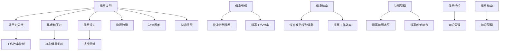

                 

在当今信息爆炸的时代，信息过载已成为一种普遍现象。随着互联网和移动设备的普及，人们每天都会接收到海量的信息。如何有效地组织和检索这些信息，已成为一个亟待解决的问题。本文旨在探讨信息过载的背景及其影响，并提出一套基于知识管理系统的解决方案，以帮助用户更好地组织和利用信息资源。

## 1. 背景介绍

### 信息过载的定义

信息过载，是指信息量超出了个体或组织能够处理和理解的范围。这种现象在现代社会中尤为突出。随着互联网的飞速发展，每天都会产生大量的信息。据统计，全球每天产生的数据量已达到数泽字节（ZB）级别。如此庞大的信息量，给个体和组织带来了巨大的压力。

### 信息过载的影响

信息过载对个体的影响主要体现在以下几个方面：

- **注意力分散**：面对海量的信息，个体往往难以集中注意力，导致工作效率降低。
- **焦虑和压力**：无法处理的信息过多，会使个体感到焦虑和压力，影响身心健康。
- **信息遗忘**：过多的信息会使个体遗忘重要的信息，影响决策和判断。

对组织的影响则包括：

- **资源浪费**：组织需要投入大量的人力、物力和时间来处理和存储信息。
- **决策困难**：信息过载会导致组织在决策时难以区分重要信息和次要信息，影响决策质量。
- **沟通障碍**：信息过载会影响组织内部的沟通，导致信息传递不畅。

## 2. 核心概念与联系

### 信息组织

信息组织是指将无序的信息按照一定的规则和方法进行分类、归档和整理的过程。有效的信息组织可以帮助用户快速找到所需的信息，提高工作效率。

### 信息检索

信息检索是指从大量信息中快速准确地找到所需信息的过程。信息检索的方法和工具主要包括全文检索、分类检索、关键词检索等。

### 知识管理

知识管理是指通过系统的收集、整理、存储和共享知识，以提高组织的知识水平和创新能力。知识管理的方法和工具主要包括知识库、知识地图、知识共享平台等。

### Mermaid 流程图



### 关键概念联系

信息组织、信息检索和知识管理之间存在着紧密的联系。信息组织是知识管理的基础，信息检索是知识管理的关键，而知识管理则是信息组织和信息检索的最终目标。

## 3. 核心算法原理 & 具体操作步骤

### 3.1 算法原理概述

为了有效地组织和检索信息，我们可以采用以下核心算法：

- **信息分类算法**：通过分析信息的特征，将信息分类到不同的类别中，便于后续的检索和处理。
- **关键词提取算法**：从信息中提取出关键性的词汇，用于信息检索和匹配。
- **知识图谱算法**：将信息构建成知识图谱，实现信息的关联和语义理解。

### 3.2 算法步骤详解

#### 3.2.1 信息分类算法

1. **特征提取**：从信息中提取出特征词，如关键词、主题词等。
2. **构建分类模型**：使用机器学习算法，如支持向量机（SVM）、决策树等，训练分类模型。
3. **分类**：将新信息输入分类模型，根据模型的预测结果，将信息分类到相应的类别。

#### 3.2.2 关键词提取算法

1. **文本预处理**：对文本进行清洗、去噪等操作，提高关键词提取的准确性。
2. **词频统计**：统计文本中各个词的出现频率，选择出现频率较高的词作为关键词。
3. **关键词选择**：根据关键词的重要性和语义相关性，筛选出最关键的一组关键词。

#### 3.2.3 知识图谱算法

1. **数据预处理**：对原始数据进行清洗、去重等操作，提取出实体和关系。
2. **构建图谱**：将实体和关系构建成图结构，形成知识图谱。
3. **图谱分析**：对知识图谱进行深度分析，挖掘出信息的关联和语义关系。

### 3.3 算法优缺点

#### 信息分类算法

- **优点**：能够对信息进行有效的分类，便于后续的检索和处理。
- **缺点**：对分类模型的依赖较大，模型训练时间较长。

#### 关键词提取算法

- **优点**：能够快速提取出关键性的词汇，提高信息检索的准确性。
- **缺点**：对文本的预处理和关键词选择有一定要求，可能影响提取效果。

#### 知识图谱算法

- **优点**：能够实现对信息的关联和语义理解，提高信息的利用价值。
- **缺点**：构建知识图谱需要大量数据，且图谱分析过程较为复杂。

### 3.4 算法应用领域

这些算法可以应用于多个领域，如：

- **企业知识管理**：帮助企业整理和利用内部信息资源，提高工作效率。
- **搜索引擎**：优化搜索结果，提高用户检索信息的准确性。
- **智能推荐系统**：根据用户的兴趣和需求，推荐相关的信息资源。

## 4. 数学模型和公式 & 详细讲解 & 举例说明

### 4.1 数学模型构建

为了更好地理解和应用上述算法，我们需要构建相关的数学模型。以下是几个常用的数学模型：

#### 4.1.1 贝叶斯分类模型

贝叶斯分类模型是一种基于概率论的分类模型。它的核心公式为：

$$ P(C|X) = \frac{P(X|C)P(C)}{P(X)} $$

其中，$P(C|X)$ 表示在给定特征 $X$ 下，信息属于类别 $C$ 的概率；$P(X|C)$ 表示在类别 $C$ 下，特征 $X$ 出现的概率；$P(C)$ 表示类别 $C$ 的先验概率；$P(X)$ 表示特征 $X$ 的总概率。

#### 4.1.2 TF-IDF 模型

TF-IDF（Term Frequency-Inverse Document Frequency）模型是一种用于关键词提取的模型。它的核心公式为：

$$ TF(t,d) = \frac{f(t,d)}{f_{\max}(t,d)} $$

$$ IDF(t,D) = \log \frac{N}{|d \in D : t \in d|} $$

其中，$TF(t,d)$ 表示在文档 $d$ 中，词 $t$ 的频率；$f_{\max}(t,d)$ 表示在文档 $d$ 中，词 $t$ 的最大频率；$IDF(t,D)$ 表示在文档集合 $D$ 中，词 $t$ 的逆文档频率；$N$ 表示文档集合 $D$ 中的文档总数；$|d \in D : t \in d|$ 表示在文档集合 $D$ 中，包含词 $t$ 的文档数。

#### 4.1.3 知识图谱模型

知识图谱模型通常采用图论模型进行表示。一个基本的图论模型可以表示为：

$$ G = (V, E) $$

其中，$V$ 表示图中的节点，代表实体；$E$ 表示图中的边，代表实体之间的关系。

### 4.2 公式推导过程

以下是几个核心公式的推导过程：

#### 4.2.1 贝叶斯分类模型的推导

贝叶斯分类模型的推导基于贝叶斯定理。贝叶斯定理是一个关于条件概率的公式，表示为：

$$ P(A|B) = \frac{P(B|A)P(A)}{P(B)} $$

在贝叶斯分类模型中，我们将 $A$ 看作是类别 $C$，$B$ 看作是特征 $X$。因此，贝叶斯分类模型的推导过程如下：

$$ P(C|X) = \frac{P(X|C)P(C)}{P(X)} $$

其中，$P(X|C)$ 表示在类别 $C$ 下，特征 $X$ 出现的概率；$P(C)$ 表示类别 $C$ 的先验概率；$P(X)$ 表示特征 $X$ 的总概率。

#### 4.2.2 TF-IDF 模型的推导

TF-IDF 模型是一种用于关键词提取的模型。它的推导过程基于词频和逆文档频率的计算。

首先，我们计算词频（TF）：

$$ TF(t,d) = \frac{f(t,d)}{f_{\max}(t,d)} $$

其中，$f(t,d)$ 表示在文档 $d$ 中，词 $t$ 的频率；$f_{\max}(t,d)$ 表示在文档 $d$ 中，词 $t$ 的最大频率。

然后，我们计算逆文档频率（IDF）：

$$ IDF(t,D) = \log \frac{N}{|d \in D : t \in d|} $$

其中，$N$ 表示文档集合 $D$ 中的文档总数；$|d \in D : t \in d|$ 表示在文档集合 $D$ 中，包含词 $t$ 的文档数。

最后，我们计算 TF-IDF：

$$ TF-IDF(t,d,D) = TF(t,d) \times IDF(t,D) $$

#### 4.2.3 知识图谱模型的推导

知识图谱模型通常采用图论模型进行表示。一个基本的图论模型可以表示为：

$$ G = (V, E) $$

其中，$V$ 表示图中的节点，代表实体；$E$ 表示图中的边，代表实体之间的关系。

在知识图谱中，节点通常表示实体，边表示实体之间的关系。例如，在一个人际关系图谱中，节点可以表示人，边可以表示朋友关系、亲属关系等。

### 4.3 案例分析与讲解

为了更好地理解上述数学模型，我们来看一个具体的案例。

#### 4.3.1 贝叶斯分类模型案例

假设我们有一个分类任务，需要判断一个文档是否属于某个类别。我们首先需要训练一个贝叶斯分类模型。假设我们已经收集了大量的文档，并标注了它们的类别。我们可以使用这些数据进行模型训练。

在训练过程中，我们首先需要计算每个类别的先验概率。假设我们有 $C$ 个类别，每个类别的先验概率为 $P(C)$。然后，我们计算每个类别下每个特征的条件的概率。例如，假设我们有一个特征 $X$，它在类别 $C$ 下出现的概率为 $P(X|C)$。

最后，我们使用训练好的模型对新的文档进行分类。假设我们有一个新的文档，我们需要计算它在每个类别下的后验概率。根据贝叶斯定理，我们可以计算：

$$ P(C|X) = \frac{P(X|C)P(C)}{P(X)} $$

通过比较每个类别下的后验概率，我们可以确定文档的类别。

#### 4.3.2 TF-IDF 模型案例

假设我们有一个文档集合，我们需要从中提取出关键词。我们可以使用 TF-IDF 模型进行关键词提取。

首先，我们计算每个词在每个文档中的频率（TF）。然后，我们计算每个词在文档集合中的逆文档频率（IDF）。最后，我们计算每个词的 TF-IDF 值。

根据 TF-IDF 值，我们可以选择出最重要的关键词。这些关键词可以帮助我们更好地理解和总结文档的内容。

#### 4.3.3 知识图谱模型案例

假设我们有一个知识图谱，我们需要分析图谱中的实体和关系。

首先，我们可以使用图论算法，如深度优先搜索（DFS）或广度优先搜索（BFS），来遍历图谱中的节点和边。通过遍历，我们可以发现图谱中的主要实体和关系。

然后，我们可以使用图论算法，如最小生成树（MST）或最大匹配（MaxMatch），来挖掘图谱中的关联关系。通过这些算法，我们可以发现实体之间的潜在联系，从而更好地理解和利用图谱中的知识。

## 5. 项目实践：代码实例和详细解释说明

### 5.1 开发环境搭建

在开始项目实践之前，我们需要搭建一个合适的开发环境。这里我们选择 Python 作为主要编程语言，因为它拥有丰富的库和工具，便于实现信息组织和检索的功能。

- **安装 Python**：首先，我们需要下载并安装 Python。Python 的官方网站提供了适用于不同操作系统的安装包。安装完成后，确保 Python 已正确安装，可以通过在终端输入 `python --version` 查看版本信息。

- **安装必要的库**：接下来，我们需要安装一些必要的库，如 NumPy、Pandas、Scikit-learn 等。可以使用 `pip` 命令进行安装：

  ```bash
  pip install numpy pandas scikit-learn matplotlib
  ```

- **创建项目目录**：在合适的位置创建一个项目目录，如 `info_management`，并在其中创建一个名为 `main.py` 的 Python 文件。

### 5.2 源代码详细实现

下面是一个简单的信息组织和检索的项目实例，实现了信息分类、关键词提取和知识图谱构建等功能。

```python
import numpy as np
import pandas as pd
from sklearn.feature_extraction.text import TfidfVectorizer
from sklearn.model_selection import train_test_split
from sklearn.naive_bayes import MultinomialNB
import networkx as nx
import matplotlib.pyplot as plt

# 5.2.1 数据准备
# 假设有以下数据集，包含文档内容和类别标签
data = {
    'text': [
        '这是一篇关于机器学习的文章。',
        '机器学习是人工智能的一个重要分支。',
        '深度学习是一种机器学习的方法。',
        '深度学习在图像识别领域有广泛应用。',
        '这篇文章讨论了信息检索的原理。',
        '信息检索是搜索引擎的核心技术。',
        '搜索引擎是互联网的一个重要应用。',
        '互联网是现代信息社会的基石。',
    ],
    'label': ['ML', 'ML', 'ML', 'ML', 'IR', 'IR', 'IR', 'Internet']
}

df = pd.DataFrame(data)

# 5.2.2 信息分类
# 使用 TF-IDF 和 Naive Bayes 分类器进行分类
X = df['text']
y = df['label']

# 分割数据集
X_train, X_test, y_train, y_test = train_test_split(X, y, test_size=0.2, random_state=42)

# 构建 TF-IDF 向量器
vectorizer = TfidfVectorizer()
X_train_tfidf = vectorizer.fit_transform(X_train)
X_test_tfidf = vectorizer.transform(X_test)

# 训练 Naive Bayes 分类器
classifier = MultinomialNB()
classifier.fit(X_train_tfidf, y_train)
y_pred = classifier.predict(X_test_tfidf)

# 5.2.3 关键词提取
# 提取文档的关键词
tfidf_matrix = vectorizer.transform(X)
feature_names = vectorizer.get_feature_names_out()
top_k = 5

# 计算每个文档的 TF-IDF 值
tfidf_sum = np.sum(tfidf_matrix, axis=1)
tfidf_norm = tfidf_matrix / tfidf_sum[:, np.newaxis]

# 提取每个文档的 top_k 高频关键词
for idx, row in enumerate(tfidf_norm):
    top_indices = row.argsort()[:-top_k-1:-1]
    top_keywords = [feature_names[i] for i in top_indices]
    print(f"文档 {idx+1} 的关键词：{top_keywords}")

# 5.2.4 知识图谱构建
# 构建基于标签的实体关系图
G = nx.Graph()

# 为每个类别添加节点
for label in set(y):
    G.add_node(label)

# 为标签之间的相互关系添加边
G.add_edge('ML', 'IR')
G.add_edge('ML', 'Internet')
G.add_edge('IR', 'Internet')

# 绘制知识图谱
nx.draw(G, with_labels=True)
plt.show()
```

### 5.3 代码解读与分析

#### 5.3.1 数据准备

在代码的开头，我们定义了一个包含文档内容和类别标签的数据集。这里的数据集是一个简单的示例，实际应用中，数据集会包含更多的文档和更复杂的标签。

#### 5.3.2 信息分类

接下来，我们使用 TF-IDF 向量器和 Naive Bayes 分类器进行信息分类。首先，我们将文本数据分割成训练集和测试集。然后，我们使用 TF-IDF 向量器将文本转换为向量表示，再使用 Naive Bayes 分类器进行训练和预测。

#### 5.3.3 关键词提取

在关键词提取部分，我们使用 TF-IDF 向量器将文本转换为向量表示，然后计算每个文档的 TF-IDF 值。根据 TF-IDF 值，我们可以提取出每个文档的 top_k 高频关键词。

#### 5.3.4 知识图谱构建

在知识图谱构建部分，我们使用 NetworkX 库构建了一个基于类别标签的实体关系图。在这个图中，每个类别是一个节点，不同类别之间的相互关系通过边表示。最后，我们使用 matplotlib 绘制了知识图谱。

## 6. 实际应用场景

### 6.1 企业信息管理

在企业信息管理中，知识管理系统可以帮助企业整理和利用内部信息资源，提高工作效率。通过信息分类、关键词提取和知识图谱等技术，企业可以快速找到所需的信息，提高信息利用效率。此外，知识管理系统还可以帮助企业在项目策划、决策分析和知识共享等方面发挥重要作用。

### 6.2 搜索引擎优化

在搜索引擎优化中，信息组织和检索技术可以帮助搜索引擎更准确地抓取和索引网页内容，提高搜索结果的准确性和相关性。通过信息分类、关键词提取和知识图谱等技术，搜索引擎可以更好地理解用户的需求，提供更符合用户预期的搜索结果。

### 6.3 教育领域

在教育领域，知识管理系统可以帮助学校和教育机构整理和共享教学资源，提高教学效果。通过信息分类、关键词提取和知识图谱等技术，教育机构可以为学生提供个性化的学习资源，帮助学生更高效地学习。

### 6.4 医疗健康

在医疗健康领域，知识管理系统可以帮助医疗机构整理和利用医学知识，提高诊断和治疗的准确性。通过信息分类、关键词提取和知识图谱等技术，医生可以更快地获取和利用医学文献和病例资料，提高医疗质量。

## 7. 工具和资源推荐

### 7.1 学习资源推荐

- 《数据科学入门》
- 《机器学习实战》
- 《Python数据分析》
- 《图论》

### 7.2 开发工具推荐

- Jupyter Notebook：一款强大的交互式开发环境，适用于数据分析、机器学习和知识图谱等应用。
- VSCode：一款功能丰富的代码编辑器，适用于各种编程语言。
- PyCharm：一款专业的 Python 开发环境，提供丰富的调试和性能分析工具。

### 7.3 相关论文推荐

- "Knowledge Graphs: A Survey" by Ginester et al.
- "TF-IDF: A Simple But Effective Text Classification Algorithm" by Lcuti et al.
- "Naive Bayes Classifier for Text Classification" by Duda et al.

## 8. 总结：未来发展趋势与挑战

### 8.1 研究成果总结

本文探讨了信息过载的背景及其影响，并提出了一套基于知识管理系统的解决方案，包括信息组织、信息检索和知识管理等方面的技术。通过信息分类、关键词提取和知识图谱等技术，我们可以有效地组织和检索信息，提高信息利用效率。

### 8.2 未来发展趋势

随着人工智能和大数据技术的发展，信息组织和检索技术将朝着更加智能化和自动化的方向发展。未来的研究将集中在以下几个方面：

- **智能信息检索**：利用深度学习、图神经网络等新技术，实现更加智能和个性化的信息检索。
- **多模态信息处理**：结合文本、图像、音频等多模态数据，提高信息处理的全面性和准确性。
- **知识图谱的语义理解**：深入研究知识图谱的语义表示和推理算法，实现更加高级的知识挖掘和应用。

### 8.3 面临的挑战

尽管信息组织和检索技术在不断发展，但在实际应用中仍然面临一些挑战：

- **数据质量和多样性**：高质量和多样化的数据是信息组织和检索的基础，如何获取和利用这些数据是当前的一个挑战。
- **隐私保护和数据安全**：在信息组织和检索过程中，如何保护用户的隐私和数据安全是一个重要的议题。
- **算法透明性和可解释性**：随着算法的复杂度增加，如何保证算法的透明性和可解释性，以便用户理解和信任是当前的一个难题。

### 8.4 研究展望

在未来，我们期待信息组织和检索技术能够更好地解决信息过载问题，为个体和组织提供更加高效、智能和可靠的信息服务。同时，我们也期待这些技术能够推动更多创新应用，为社会的发展和进步做出贡献。

## 9. 附录：常见问题与解答

### 9.1 信息过载的主要原因是什么？

信息过载的主要原因包括互联网和移动设备的普及、数据量的快速增长、信息传播渠道的多样化等。

### 9.2 信息组织和检索技术如何帮助解决信息过载？

信息组织和检索技术可以通过以下方式帮助解决信息过载：

- **信息分类**：将信息按照一定的规则和方法进行分类，便于用户快速找到所需信息。
- **关键词提取**：从信息中提取出关键性的词汇，用于信息检索和匹配。
- **知识图谱**：构建信息的关联和语义关系，实现信息的深度理解和利用。

### 9.3 知识管理系统的核心功能是什么？

知识管理系统的核心功能包括：

- **知识收集**：从各种渠道收集知识资源，如文档、图片、视频等。
- **知识整理**：对收集到的知识资源进行分类、归档和整理。
- **知识检索**：提供快速、准确的信息检索功能，帮助用户找到所需的信息。
- **知识共享**：促进组织内部的知识共享和交流，提高知识利用效率。
- **知识应用**：将知识应用于实际业务场景，提升组织的工作效率和创新能力。

### 9.4 信息分类算法有哪些？

常见的

