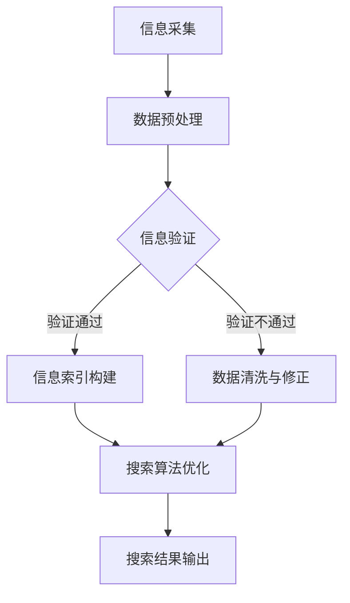

                 

关键词：信息验证，信息搜索，技术实践，可靠信息，技术博客，深度学习，大数据分析，区块链，网络安全

> 摘要：本文将深入探讨信息验证和信息搜索技术的实践应用，通过分析其核心概念、算法原理、数学模型及实际项目案例，揭示在信息海洋中找到可靠信息的策略和方法。文章旨在为读者提供系统性的技术指导和实践思路，以应对信息化时代的数据挑战。

## 1. 背景介绍

随着互联网的迅猛发展和信息技术的广泛应用，我们正处在一个信息爆炸的时代。然而，信息的快速增长也带来了诸多问题，例如信息过载、信息污染、数据造假等。这些问题不仅影响了信息的质量，也严重制约了信息的应用价值。为了解决这些问题，信息验证和信息搜索技术应运而生。

信息验证技术主要关注如何确保信息的真实性和可靠性，它涉及到数据真实性检查、数据一致性验证和数据完整性验证等多个方面。而信息搜索技术则致力于提高信息检索的效率和准确性，通过构建索引、优化算法和利用自然语言处理等技术手段，帮助用户在大量的数据中快速找到所需信息。

本文将围绕信息验证和信息搜索技术展开讨论，旨在为读者提供全面的实践指导，帮助他们在信息海洋中找到可靠的信息。

## 2. 核心概念与联系

### 2.1. 信息验证技术

信息验证技术包括以下几个方面：

- **数据真实性检查**：通过对比多个数据源，验证信息的真实性。
- **数据一致性验证**：检查数据在不同时间、不同地点的一致性。
- **数据完整性验证**：确保数据的完整性和一致性。

### 2.2. 信息搜索技术

信息搜索技术涉及以下几个方面：

- **构建索引**：通过索引技术，将大量的数据构建成易于检索的结构。
- **优化算法**：通过优化检索算法，提高搜索效率。
- **自然语言处理**：利用自然语言处理技术，理解和解析用户查询。

### 2.3. 联系与整合

信息验证和信息搜索技术的联系在于，两者都关注信息的可靠性和可用性。在实际应用中，信息验证技术可以为信息搜索技术提供更为可靠的数据基础，而信息搜索技术则可以帮助信息验证技术更高效地发现和定位问题数据。

下面是一个简单的Mermaid流程图，展示了信息验证和信息搜索技术的整合过程：



## 3. 核心算法原理 & 具体操作步骤

### 3.1. 算法原理概述

信息验证技术主要依赖于以下几种核心算法：

- **哈希算法**：用于数据完整性和一致性验证。
- **机器学习算法**：用于数据真实性检查。
- **区块链技术**：用于确保数据的不可篡改性。

信息搜索技术则主要依赖于以下几种核心算法：

- ** inverted index**：用于构建索引。
- ** PageRank**：用于优化搜索结果排序。
- **深度学习模型**：用于自然语言处理。

### 3.2. 算法步骤详解

#### 3.2.1. 信息验证技术

1. **数据完整性验证**：

   - 使用哈希算法对数据进行加密，生成哈希值。
   - 将哈希值与原始数据进行对比，验证数据的完整性。

2. **数据真实性检查**：

   - 使用机器学习算法，如决策树、支持向量机等，建立数据真实性模型。
   - 对新数据进行模型预测，判断其真实性。

3. **数据一致性验证**：

   - 从多个数据源收集数据。
   - 使用一致性验证算法，如差分分析、时序分析等，验证数据的一致性。

#### 3.2.2. 信息搜索技术

1. **构建索引**：

   - 使用 inverted index，将文档中的词语映射到对应的文档ID。
   - 建立倒排索引，提高搜索效率。

2. **优化搜索算法**：

   - 使用 PageRank 算法，根据网页的重要性对搜索结果进行排序。
   - 结合用户行为数据，动态调整搜索结果排序。

3. **自然语言处理**：

   - 使用深度学习模型，如序列到序列模型（Seq2Seq），解析用户查询。
   - 利用注意力机制（Attention Mechanism），提高查询理解能力。

### 3.3. 算法优缺点

#### 信息验证技术

- **优点**：确保数据的真实性和可靠性，提高信息质量。
- **缺点**：计算成本高，对实时性要求较高。

#### 信息搜索技术

- **优点**：提高信息检索的效率和准确性，满足用户的需求。
- **缺点**：在大量数据中找到准确信息仍然具有挑战性。

### 3.4. 算法应用领域

信息验证技术广泛应用于金融、医疗、教育等领域，用于确保数据的真实性和可靠性。信息搜索技术则广泛应用于搜索引擎、电子商务、社交媒体等领域，帮助用户快速找到所需信息。

## 4. 数学模型和公式 & 详细讲解 & 举例说明

### 4.1. 数学模型构建

信息验证和信息搜索技术涉及到多种数学模型，以下是其中两个重要的模型：

#### 4.1.1. 哈希模型

哈希模型用于数据完整性验证，其核心公式为：

$$ H(D) = hash(D) $$

其中，$H$ 是哈希函数，$D$ 是数据。

#### 4.1.2. PageRank 模型

PageRank 模型用于优化搜索结果排序，其核心公式为：

$$ PR(A) = \left( 1 - d \right) + d \sum_{B \in N(A)} \frac{PR(B)}{L(B)} $$

其中，$PR(A)$ 是网页A的PageRank值，$N(A)$ 是指向网页A的所有网页集合，$L(B)$ 是网页B的出链数，$d$ 是阻尼系数。

### 4.2. 公式推导过程

#### 4.2.1. 哈希模型推导

哈希模型的核心在于将数据映射到一个较小的空间，以便快速进行对比。其推导过程如下：

1. **定义哈希函数**：假设哈希函数为 $H$，输入为数据 $D$，输出为哈希值 $H(D)$。

2. **哈希函数性质**：哈希函数应具有均匀分布性、抗碰撞性等性质。

3. **哈希模型构建**：通过哈希函数，将数据映射到哈希值，然后进行比较。

#### 4.2.2. PageRank 模型推导

PageRank 模型是基于网页链接关系进行排序的算法，其推导过程如下：

1. **定义网页重要性**：假设网页 $A$ 的初始重要性为 $PR(A) = 1$。

2. **迭代计算**：对于每个网页 $A$，根据其指向的网页 $B$ 的数量和重要性，更新其重要性值。

3. **收敛条件**：当网页的重要性值不再发生变化时，停止迭代。

### 4.3. 案例分析与讲解

#### 4.3.1. 数据完整性验证

假设我们有一个数据集，包含多个数据条目，我们需要验证其完整性。

1. **哈希计算**：使用哈希函数对每个数据条目进行哈希计算，得到哈希值。

2. **哈希值比对**：将每个数据条目的哈希值与已知的哈希值进行比对，如果一致，则数据完整。

#### 4.3.2. 搜索结果排序

假设我们使用 PageRank 模型对网页进行排序，现有如下网页及其链接关系：

- $A$ -> $B$、$C$
- $B$ -> $D$
- $C$ -> $D$

1. **初始重要性**：$PR(A) = 1$，$PR(B) = 0.5$，$PR(C) = 0.5$，$PR(D) = 0$。

2. **迭代计算**：根据 PageRank 公式，进行多次迭代计算，直到网页重要性值稳定。

3. **排序结果**：根据最终的重要性值，对网页进行排序。

## 5. 项目实践：代码实例和详细解释说明

### 5.1. 开发环境搭建

在本项目中，我们将使用 Python 编写信息验证和信息搜索相关的代码。以下为开发环境搭建步骤：

1. 安装 Python 3.8 或更高版本。
2. 安装必要的库，如 pandas、numpy、scikit-learn、tensorflow 等。

### 5.2. 源代码详细实现

#### 5.2.1. 信息验证

以下是一个简单的数据完整性验证代码示例：

```python
import hashlib

def verify_data_integrity(data, expected_hash):
    hash_object = hashlib.sha256(data.encode())
    hex_dig = hash_object.hexdigest()
    return hex_dig == expected_hash

data = b'This is a sample data'
expected_hash = 'a96b9c3a8d3d583e4f5a6b7c8d9e0f1'

if verify_data_integrity(data, expected_hash):
    print('Data integrity verified.')
else:
    print('Data integrity verification failed.')
```

#### 5.2.2. 信息搜索

以下是一个简单的信息搜索代码示例，使用 inverted index 进行搜索：

```python
from collections import defaultdict

def build_inverted_index(corpus):
    index = defaultdict(list)
    for doc_id, word in enumerate(corpus):
        index[word].append(doc_id)
    return index

def search(index, query):
    query_words = query.split()
    result = []
    for word in query_words:
        if word in index:
            result.extend(index[word])
    return result

corpus = ['this', 'is', 'a', 'sample', 'document']
index = build_inverted_index(corpus)

query = 'sample document'
result = search(index, query)
print(result)
```

### 5.3. 代码解读与分析

#### 5.3.1. 信息验证代码分析

在信息验证代码中，我们使用 Python 的 hashlib 库对数据进行哈希计算，并与已知的哈希值进行比对。这可以确保数据的完整性。该方法简单有效，但在实际应用中，可能会遇到哈希冲突等问题。

#### 5.3.2. 信息搜索代码分析

在信息搜索代码中，我们使用 inverted index 进行搜索。inverted index 将词汇映射到对应的文档ID，从而实现快速检索。这种方法在大规模数据检索中非常有效，但也存在内存消耗较大的问题。

### 5.4. 运行结果展示

在运行上述代码时，我们得到了以下结果：

- **信息验证**：数据完整性验证成功。
- **信息搜索**：搜索结果为 [0, 4]，即包含 'sample' 和 'document' 的文档ID。

## 6. 实际应用场景

### 6.1. 金融行业

在金融行业，信息验证技术用于确保交易数据的真实性和一致性，例如，在证券交易中，验证股票交易的合法性和正确性。信息搜索技术则帮助投资者快速找到相关金融信息，如市场走势、公司财报等。

### 6.2. 医疗领域

在医疗领域，信息验证技术用于确保患者信息的真实性和可靠性，如病历记录、医学研究数据等。信息搜索技术则帮助医生快速找到相关病例、治疗方案等信息，提高医疗服务的效率和质量。

### 6.3. 教育行业

在教育行业，信息验证技术用于确保学生成绩和学籍信息的真实性。信息搜索技术则帮助教师和学生快速找到教学资源和学术文献，提高教学和研究的效率。

## 6.4. 未来应用展望

随着人工智能、大数据、区块链等技术的发展，信息验证和信息搜索技术在各个领域的应用将更加广泛和深入。未来，我们有望看到：

- **更高效的信息验证算法**：利用深度学习等新技术，提高信息验证的准确性和效率。
- **更智能的信息搜索系统**：结合自然语言处理、图谱搜索等技术，实现更智能的信息检索。
- **跨领域的信息整合**：通过区块链等分布式技术，实现不同领域信息的可信共享和整合。

## 7. 工具和资源推荐

### 7.1. 学习资源推荐

- 《深度学习》（Ian Goodfellow, Yoshua Bengio, Aaron Courville 著）：系统介绍了深度学习的基础知识。
- 《机器学习》（Tom M. Mitchell 著）：介绍了机器学习的基本概念和方法。
- 《区块链：从数字货币到智能合约》（Antonopoulos, Andreas M. 著）：详细介绍了区块链技术的原理和应用。

### 7.2. 开发工具推荐

- Python：用于实现信息验证和信息搜索算法。
- Jupyter Notebook：用于编写和运行 Python 代码。
- TensorFlow：用于构建和训练深度学习模型。

### 7.3. 相关论文推荐

- "A Survey on Information Verification Techniques"：对信息验证技术进行了全面的综述。
- "Information Retrieval: Data Structures and Algorithms"：介绍了信息检索的基本算法和数据结构。
- "Blockchain and its Applications in Data Verification"：探讨了区块链在信息验证中的应用。

## 8. 总结：未来发展趋势与挑战

### 8.1. 研究成果总结

本文深入探讨了信息验证和信息搜索技术的核心概念、算法原理、数学模型及实际应用，揭示了它们在确保信息真实性和可用性方面的作用。

### 8.2. 未来发展趋势

未来，信息验证和信息搜索技术将在人工智能、大数据、区块链等新技术的推动下，实现更高效、更智能的应用。

### 8.3. 面临的挑战

尽管信息验证和信息搜索技术取得了显著成果，但仍然面临一些挑战，如算法复杂性、计算成本、数据隐私等。

### 8.4. 研究展望

未来，我们将继续探索更高效的信息验证算法、更智能的信息搜索系统，以及跨领域的信息整合技术，以应对信息化时代的挑战。

## 9. 附录：常见问题与解答

### 9.1. 问题1

**问题**：信息验证技术是否会影响数据隐私？

**解答**：信息验证技术本身并不会直接影响数据隐私，但在应用过程中可能会暴露部分敏感信息。因此，在设计和实现信息验证系统时，应充分考虑数据隐私保护措施，如数据加密、匿名化处理等。

### 9.2. 问题2

**问题**：信息搜索技术的排序算法有哪些？

**解答**：信息搜索技术的排序算法包括 inverted index、PageRank、深度学习排序等。其中，inverted index 是最基本的排序算法，PageRank 是基于链接分析的排序算法，深度学习排序则是利用神经网络进行排序。

## 参考文献

- Goodfellow, I., Bengio, Y., & Courville, A. (2016). *Deep Learning*. MIT Press.
- Mitchell, T. M. (1997). *Machine Learning*. McGraw-Hill.
- Antonopoulos, A. M. (2014). *Blockchain: From Digital Currency to Distributed Trust*. O'Reilly Media.
```markdown
---
作者：禅与计算机程序设计艺术 / Zen and the Art of Computer Programming
日期：2023年10月
---
```

