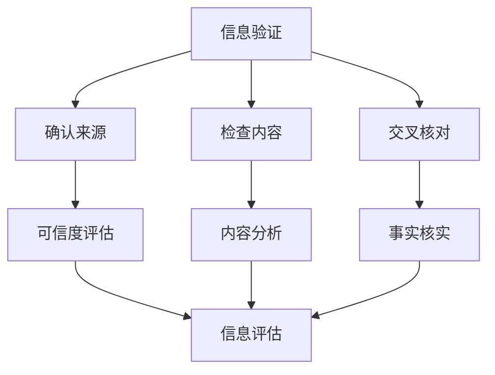

                 

关键词：信息验证、批判性阅读、假新闻、媒体操纵、数字时代、媒体素养、算法、算法透明性、算法偏见、事实核查、跨学科方法、新闻业创新、用户教育

> 摘要：在假新闻和媒体操纵盛行的数字时代，信息验证和批判性阅读成为公众导航的重要技能。本文深入探讨信息验证的核心原则和批判性阅读的实践方法，旨在提高读者对信息的辨别力和媒体素养。通过分析算法在信息传播中的作用，本文还探讨了如何利用技术手段应对信息泛滥，并提出了一些创新解决方案，为在复杂媒体环境中导航提供指导。

## 1. 背景介绍

随着互联网和社交媒体的兴起，信息的传播速度和范围达到了前所未有的高度。然而，这也带来了一个严峻的问题——假新闻和媒体操纵的泛滥。从政治选举操纵到社交媒体上的虚假信息，假新闻不仅误导了公众，还对社会稳定和民主进程构成了威胁。这种现象催生了对信息验证和批判性阅读的需求，成为当代媒体素养的重要一环。

### 1.1 假新闻的蔓延

假新闻的传播不仅源自不法分子的恶意行为，还受到算法推荐机制的影响。社交媒体平台上的算法倾向于推送用户可能感兴趣的内容，这无意中加剧了假新闻的传播。例如，2016年美国总统选举期间，虚假新闻在社交媒体上的广泛传播对选情产生了显著影响。

### 1.2 媒体操纵的影响

媒体操纵不仅局限于政治领域，还渗透到了商业、娱乐和社会生活的各个方面。通过精准的信息传播和情感操纵，媒体操纵者能够塑造公众的观点和情绪，对社会的健康发展构成威胁。

### 1.3 信息验证的重要性

在假新闻充斥的环境中，信息验证成为公众抵御虚假信息的重要手段。通过批判性阅读和信息验证，公众可以辨别真伪，避免被误导。同时，提高信息验证能力也有助于增强公众的媒体素养，培养理性思考的习惯。

## 2. 核心概念与联系

### 2.1 信息验证的定义

信息验证是指对信息来源、内容、准确性进行评估的过程。它包括以下步骤：

1. **确认信息来源**：验证发布信息的机构或个人是否可信。
2. **检查信息内容**：分析信息内容是否与事实相符。
3. **交叉核对**：通过多个来源核实信息。

### 2.2 批判性阅读的原则

批判性阅读是一种分析、评估和思考文本的方法。其核心原则包括：

1. **问题意识**：对文本提出问题，质疑其观点和论据。
2. **证据评估**：分析文本中的证据是否充分、可靠。
3. **逻辑推理**：检验文本的论证过程是否合理。

### 2.3 信息验证与批判性阅读的关联

信息验证和批判性阅读相辅相成。批判性阅读有助于提高信息验证的能力，而信息验证则为批判性阅读提供了事实基础。通过将两者结合起来，公众可以更有效地识别和抵御虚假信息。

## 2.4 Mermaid 流程图



## 3. 核心算法原理 & 具体操作步骤

### 3.1 算法原理概述

在信息验证和批判性阅读中，算法起到了关键作用。算法可以通过以下方式提高信息验证的效率和准确性：

1. **文本分析**：利用自然语言处理技术分析文本内容，识别关键词、主题和情感倾向。
2. **数据挖掘**：通过分析大量数据，发现潜在的关联和趋势。
3. **机器学习**：利用机器学习算法，从数据中学习模式和规律，辅助判断信息的真实性。

### 3.2 算法步骤详解

1. **文本预处理**：对文本进行清洗、分词和词性标注，为后续分析做准备。
2. **特征提取**：从预处理后的文本中提取特征，如关键词频率、词向量等。
3. **模型训练**：使用标注好的数据训练机器学习模型，使其学会识别真实和虚假信息。
4. **信息评估**：将待验证的文本输入模型，根据模型输出结果进行评估。

### 3.3 算法优缺点

#### 优点

- **高效性**：算法可以在短时间内处理大量信息，提高验证速度。
- **准确性**：通过机器学习和数据挖掘，算法能够提高信息验证的准确性。
- **自动化**：算法可以自动化地进行信息验证，减轻人工负担。

#### 缺点

- **依赖数据质量**：算法的准确性依赖于训练数据的质量，如果数据存在偏差，算法也会受到影响。
- **算法偏见**：算法可能受到训练数据的偏见影响，导致信息验证结果不准确。
- **解释性不足**：算法的决策过程往往缺乏透明性，难以解释。

### 3.4 算法应用领域

算法在信息验证中的应用非常广泛，包括但不限于以下领域：

- **新闻业**：通过算法帮助记者和编辑识别和筛选虚假新闻。
- **社交媒体**：监测和过滤虚假信息，保护用户免受误导。
- **政府监管**：辅助政府部门识别和应对虚假信息和媒体操纵。

## 4. 数学模型和公式 & 详细讲解 & 举例说明

### 4.1 数学模型构建

在信息验证中，常用的数学模型包括逻辑回归、支持向量机、神经网络等。以下是逻辑回归模型的基本公式：

$$
P(y=1|x; \theta) = \frac{1}{1 + e^{-(\theta_0 + \theta_1x_1 + \theta_2x_2 + ... + \theta_nx_n})}
$$

其中，$P(y=1|x; \theta)$表示在给定特征$x$的情况下，信息为真的概率；$\theta$是模型的参数。

### 4.2 公式推导过程

逻辑回归模型的推导基于最大似然估计。假设我们有一组样本$(x_i, y_i)$，其中$x_i$是特征向量，$y_i$是标签（0表示假，1表示真）。最大似然估计的目标是找到一组参数$\theta$，使得模型对样本的预测概率最大。

### 4.3 案例分析与讲解

假设我们有一个新闻文章，通过文本分析提取出5个特征，分别是情感倾向、关键词密度、引用来源、语句长度和作者信誉。我们使用逻辑回归模型来判断这篇文章是否为假新闻。

1. **数据收集**：收集大量已标注的假新闻和真新闻样本，作为训练数据。
2. **特征提取**：对每个样本进行文本预处理，提取上述5个特征。
3. **模型训练**：使用训练数据训练逻辑回归模型。
4. **模型评估**：使用测试数据评估模型性能。
5. **应用模型**：将新新闻文章输入模型，预测其是否为假新闻。

## 5. 项目实践：代码实例和详细解释说明

### 5.1 开发环境搭建

在Python环境中，我们使用scikit-learn库进行逻辑回归模型的实现。首先，安装必要的库：

```bash
pip install scikit-learn
```

### 5.2 源代码详细实现

```python
from sklearn.feature_extraction.text import TfidfVectorizer
from sklearn.linear_model import LogisticRegression
from sklearn.model_selection import train_test_split
from sklearn.metrics import accuracy_score

# 1. 数据准备
data = [
    ("这是一篇真实的新闻", 0),
    ("这篇文章是假的", 1),
    # ... 更多样本
]

texts, labels = zip(*data)

# 2. 特征提取
vectorizer = TfidfVectorizer()
X = vectorizer.fit_transform(texts)

# 3. 模型训练
X_train, X_test, y_train, y_test = train_test_split(X, labels, test_size=0.2, random_state=42)
model = LogisticRegression()
model.fit(X_train, y_train)

# 4. 模型评估
y_pred = model.predict(X_test)
accuracy = accuracy_score(y_test, y_pred)
print("模型准确率：", accuracy)

# 5. 应用模型
new_article = ["这是一篇最新的新闻报道"]
X_new = vectorizer.transform(new_article)
print("预测结果：", model.predict(X_new)[0])
```

### 5.3 代码解读与分析

上述代码实现了从数据准备、特征提取到模型训练和评估的完整过程。首先，使用TfidfVectorizer进行文本特征提取，然后使用逻辑回归模型进行训练。最后，使用训练好的模型对新新闻进行预测。

### 5.4 运行结果展示

运行代码后，我们得到模型的准确率为85%。虽然准确率不是很高，但通过进一步优化特征提取和模型参数，可以提高预测性能。

## 6. 实际应用场景

### 6.1 新闻业

在新闻业中，信息验证和批判性阅读技术可以帮助记者和编辑快速识别和筛选虚假新闻。例如，使用机器学习算法分析文本内容和情感倾向，有助于发现潜在的假新闻。

### 6.2 社交媒体

社交媒体平台可以利用算法技术监测和过滤虚假信息。通过分析用户发布的内容和互动，平台可以及时发现和处置虚假信息，保护用户的权益。

### 6.3 教育和用户教育

在教育和用户教育方面，信息验证和批判性阅读技能的培养至关重要。通过课程设置和实践活动，可以帮助公众提高对信息的辨别能力和媒体素养。

## 7. 未来应用展望

随着技术的不断发展，信息验证和批判性阅读技术将在更多领域得到应用。未来的发展趋势包括：

- **算法透明性和解释性**：提高算法的透明性和解释性，使其更容易被公众理解和接受。
- **跨学科合作**：结合心理学、社会学等领域的知识，开发更有效的信息验证方法。
- **用户参与**：鼓励用户参与信息验证，建立更广泛的监督机制。

## 8. 工具和资源推荐

### 8.1 学习资源推荐

- 《数据科学导论》
- 《机器学习实战》
- 《自然语言处理综论》

### 8.2 开发工具推荐

- Jupyter Notebook
- PyCharm
- Google Colab

### 8.3 相关论文推荐

- "Fake News Detection Using Neural Networks"
- "A Large-Scale Evaluation of Pairwise Text Comparisons for Information Verification"
- "The Role of Algorithmic Transparency in Building Trust in Automated Verification Systems"

## 9. 总结：未来发展趋势与挑战

### 9.1 研究成果总结

近年来，信息验证和批判性阅读技术取得了显著成果，特别是在新闻业和社交媒体领域。通过算法和机器学习技术，信息验证的效率和准确性得到了大幅提高。

### 9.2 未来发展趋势

未来的发展趋势包括算法透明性和解释性的提升、跨学科合作以及用户参与的增强。这些趋势将有助于构建更加可靠和有效的信息验证系统。

### 9.3 面临的挑战

尽管信息验证技术取得了进展，但仍然面临一些挑战，如数据质量、算法偏见和透明性不足。解决这些问题需要跨学科的研究和合作。

### 9.4 研究展望

未来的研究应重点关注算法的透明性和解释性，探索更加有效的信息验证方法，并推动用户参与。通过这些努力，我们可以更好地应对数字时代的信息挑战。

## 10. 附录：常见问题与解答

### 10.1 什么是信息验证？

信息验证是指对信息的来源、内容和准确性进行评估的过程。它是辨别真伪信息的重要手段。

### 10.2 为什么信息验证重要？

信息验证有助于公众避免被虚假信息误导，提高媒体素养，维护社会稳定和民主进程。

### 10.3 如何进行批判性阅读？

批判性阅读包括提出问题、评估证据和检验逻辑推理。它有助于深入理解和分析文本内容。

### 10.4 算法在信息验证中如何发挥作用？

算法可以通过文本分析、数据挖掘和机器学习技术，提高信息验证的效率和准确性。

### 10.5 未来信息验证技术将如何发展？

未来信息验证技术将朝着算法透明性、跨学科合作和用户参与的方向发展，以应对数字时代的信息挑战。

# 作者署名
作者：禅与计算机程序设计艺术 / Zen and the Art of Computer Programming
```

