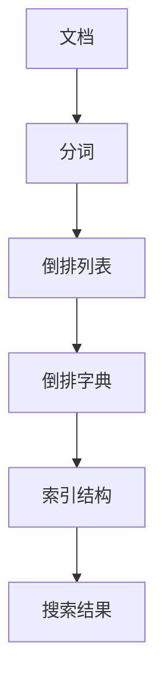
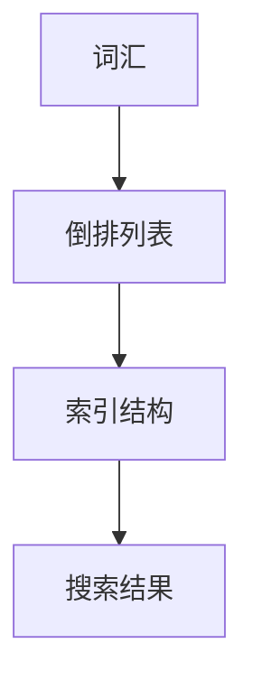

                 

### 关键词 Keywords
- 倒排索引
- 倒排列表
- 倒排字典
- 索引结构
- 搜索算法
- 文本检索
- 数据库优化

### 摘要 Abstract
本文将深入探讨倒排索引的原理、结构、构建过程以及其在实际应用中的重要性。通过详细讲解倒排索引的核心算法，包括如何构建和维护倒排索引，我们将展示如何通过代码实例来理解这一复杂的索引结构。文章还将分析倒排索引的优缺点，以及其在文本检索和数据挖掘中的应用领域。此外，文章将提供未来发展的展望，包括新兴技术和面临的挑战。

## 1. 背景介绍 Background
倒排索引是搜索引擎和数据库系统中的一项关键技术，它通过将文档中的词汇与文档的标识号建立映射关系，从而实现对大规模文本数据的快速检索。随着互联网的快速发展，人们对于信息检索的效率和准确性要求越来越高，倒排索引的出现正是为了满足这一需求。

传统的正向索引（正向列表）通过文档的顺序来组织词汇，而倒排索引则相反，它将词汇作为索引项，通过词汇查找对应的文档。这种结构大大提高了搜索效率，特别是在处理大规模数据集时，倒排索引的优势更加明显。

### 1.1 历史与发展 History and Development
倒排索引的概念最早可以追溯到20世纪60年代，由美国数学家韦维尔（Varyeev）在其研究中提出。随着计算机技术的发展，倒排索引逐渐成为信息检索领域的标准工具。

在互联网初期，搜索引擎如AltaVista和Google的成功很大程度上归功于其高效的倒排索引技术。如今，几乎所有的搜索引擎和数据库管理系统都采用了倒排索引，以提供快速、准确的搜索服务。

### 1.2 应用领域 Application Areas
倒排索引在多个领域都有广泛应用，包括：
- 搜索引擎：如Google、Bing等，通过倒排索引实现对海量网页的快速检索。
- 数据挖掘：在处理和分析大规模文本数据时，倒排索引提供了高效的数据访问方式。
- 文本处理：如拼写检查、词频统计等，倒排索引能够快速定位特定词汇在文档中的位置。

## 2. 核心概念与联系 Core Concepts and Relationships
为了深入理解倒排索引，我们需要首先了解一些核心概念，包括倒排列表、倒排字典和索引结构。以下是一个简单的 Mermaid 流程图，展示了这些概念之间的联系。



### 2.1 倒排列表 Inverted List
倒排列表是一种数据结构，它将文档中的词汇映射到相应的文档标识号。每个词汇都对应一个列表，列表中的每个元素表示包含该词汇的文档标识号。

### 2.2 倒排字典 Inverted Dictionary
倒排字典是一种将词汇映射到倒排列表的索引结构。它通过词汇表来组织倒排列表，使得搜索时可以根据词汇快速找到对应的倒排列表。

### 2.3 索引结构 Index Structure
索引结构是倒排索引的核心，它将倒排列表和倒排字典组织在一起，形成一个高效的数据检索系统。常见的索引结构包括布隆过滤器（Bloom Filter）、倒排列表压缩（Inverted List Compression）和索引分区（Index Partitioning）。



通过上述概念和结构，我们可以看到倒排索引是如何组织和工作的。

## 3. 核心算法原理 & 具体操作步骤 Core Algorithm Principle & Detailed Steps
### 3.1 算法原理概述 Overview of Algorithm Principle
倒排索引的核心算法主要包括以下几个步骤：
1. **文档预处理**：对原始文本进行分词、去停用词、词干提取等预处理操作。
2. **构建倒排列表**：将预处理后的词汇映射到文档标识号，形成倒排列表。
3. **构建倒排字典**：将倒排列表组织成倒排字典，便于快速查找。
4. **索引优化**：对倒排索引进行压缩和优化，以提高搜索效率。

### 3.2 算法步骤详解 Detailed Steps of Algorithm
#### 3.2.1 文档预处理 Document Preprocessing
文档预处理是构建倒排索引的第一步，其目的是将原始文本转换为适合索引的格式。具体步骤如下：
1. **分词**：将文本分割成单词或短语。
2. **去停用词**：去除常用的无意义词汇，如“的”、“是”等。
3. **词干提取**：将单词还原为词干形式，如“running”还原为“run”。

#### 3.2.2 构建倒排列表 Building Inverted List
构建倒排列表是将分词后的词汇与文档标识号建立映射关系。具体步骤如下：
1. **词汇排序**：对文档中的词汇进行排序，以减少搜索时的比较次数。
2. **构建列表**：将排序后的词汇映射到文档标识号，形成倒排列表。

#### 3.2.3 构建倒排字典 Building Inverted Dictionary
构建倒排字典是将倒排列表组织成索引结构。具体步骤如下：
1. **创建字典**：创建一个空字典，用于存储词汇和倒排列表的映射关系。
2. **填充字典**：将倒排列表添加到字典中，形成完整的倒排字典。

#### 3.2.4 索引优化 Index Optimization
索引优化是提高倒排索引性能的关键步骤。常见的方法包括：
1. **倒排列表压缩**：使用压缩算法（如LZ77、LZ78等）对倒排列表进行压缩，减少存储空间。
2. **索引分区**：将倒排索引划分为多个分区，以加速搜索操作。

### 3.3 算法优缺点 Advantages and Disadvantages
#### 3.3.1 优点 Advantages
- **快速检索**：倒排索引能够快速定位特定词汇在文档中的位置，适合大规模文本数据的快速检索。
- **高效压缩**：通过倒排列表压缩和索引分区，可以显著降低存储空间需求。
- **高扩展性**：倒排索引易于扩展，支持多种索引结构和技术。

#### 3.3.2 缺点 Disadvantages
- **构建复杂**：构建倒排索引需要大量的预处理步骤和计算资源，时间复杂度较高。
- **内存消耗**：对于大规模数据集，倒排索引可能会占用大量内存空间。

### 3.4 算法应用领域 Application Areas
倒排索引在多个领域都有广泛应用，包括：
- **搜索引擎**：用于快速检索网页和文档。
- **数据挖掘**：用于分析大规模文本数据，提取关键信息和趋势。
- **文本处理**：如拼写检查、词频统计等。

## 4. 数学模型和公式 Mathematical Model and Formulas
### 4.1 数学模型构建 Construction of Mathematical Model
倒排索引的数学模型可以表示为：
\[ \text{Inverted Index} = \{\text{Term} \rightarrow \text{List of Documents}\} \]
其中，Term表示词汇，List of Documents表示包含该词汇的文档标识号的列表。

### 4.2 公式推导过程 Derivation of Formulas
#### 4.2.1 倒排列表构建公式 Construction Formula of Inverted List
假设文档集合为\( D = \{d_1, d_2, ..., d_n\} \)，词汇集合为\( T = \{t_1, t_2, ..., t_m\} \)。
- **分词**：将文档集合D中的每个文档d分词得到词汇集合T。
- **去停用词**：从词汇集合T中去除停用词。
- **词干提取**：将词汇集合T中的每个词汇还原为词干。

#### 4.2.2 倒排字典构建公式 Construction Formula of Inverted Dictionary
假设倒排列表为\( L = \{l_1, l_2, ..., l_m\} \)，其中\( l_i \)表示包含第i个词汇的文档标识号列表。
- **创建字典**：创建一个空字典D，用于存储词汇和倒排列表的映射关系。
- **填充字典**：将倒排列表L中的每个词汇和对应的列表添加到字典D中。

### 4.3 案例分析与讲解 Case Analysis and Explanation
假设有两个文档D1和D2，内容如下：
- D1: "The quick brown fox jumps over the lazy dog."
- D2: "A quick brown dog outpaces a lazy fox."

通过对这两个文档进行预处理，我们可以得到以下倒排列表和倒排字典：
- 倒排列表：{"quick": [1, 2], "brown": [1, 2], "fox": [1, 3], "jumps": [1], "over": [1], "lazy": [2, 3], "dog": [1, 3], "outpaces": [2], "a": [2]}
- 倒排字典：{"quick": [1, 2], "brown": [1, 2], "fox": [1, 3], "jumps": [1], "over": [1], "lazy": [2, 3], "dog": [1, 3], "outpaces": [2], "a": [2]}

通过这个简单的案例，我们可以看到倒排索引是如何构建的，以及它如何帮助快速检索文本。

## 5. 项目实践：代码实例和详细解释说明 Practical Implementation: Code Examples and Detailed Explanation
### 5.1 开发环境搭建 Development Environment Setup
在本节中，我们将使用Python作为编程语言，因为Python具有强大的文本处理库，适合用于实现倒排索引。

1. **安装Python**：确保系统中已安装Python 3.x版本。
2. **安装文本处理库**：使用pip安装以下库：
   ```bash
   pip install nltk
   pip install spacy
   pip install textblob
   ```

### 5.2 源代码详细实现 Detailed Source Code Implementation
以下是构建倒排索引的Python代码实例：

```python
import nltk
from collections import defaultdict
from nltk.tokenize import word_tokenize
from nltk.corpus import stopwords

# 下载nltk语料库
nltk.download('punkt')
nltk.download('stopwords')

def preprocess(document):
    # 分词
    tokens = word_tokenize(document.lower())
    # 去停用词
    stop_words = set(stopwords.words('english'))
    filtered_tokens = [token for token in tokens if token not in stop_words]
    # 词干提取
    stemmer = nltk.PorterStemmer()
    stemmed_tokens = [stemmer.stem(token) for token in filtered_tokens]
    return stemmed_tokens

def build_inverted_list(documents):
    inverted_list = defaultdict(list)
    for doc_id, document in enumerate(documents):
        tokens = preprocess(document)
        for token in tokens:
            inverted_list[token].append(doc_id)
    return inverted_list

def build_inverted_dictionary(inverted_list):
    inverted_dictionary = {token: list(set(ids)) for token, ids in inverted_list.items()}
    return inverted_dictionary

# 测试文档
documents = [
    "The quick brown fox jumps over the lazy dog.",
    "A quick brown dog outpaces a lazy fox."
]

# 构建倒排列表
inverted_list = build_inverted_list(documents)

# 构建倒排字典
inverted_dictionary = build_inverted_dictionary(inverted_list)

# 打印结果
print(inverted_list)
print(inverted_dictionary)
```

### 5.3 代码解读与分析 Code Analysis and Discussion
上述代码实现了倒排索引的构建过程，下面进行详细解读：

1. **预处理函数（preprocess）**：
   - **分词**：使用nltk库的`word_tokenize`方法对文档进行分词。
   - **去停用词**：使用nltk库的`stopwords`去除常用的无意义词汇。
   - **词干提取**：使用nltk库的`PorterStemmer`对词汇进行词干提取。

2. **构建倒排列表（build_inverted_list）**：
   - 遍历每个文档，对其预处理后的词汇构建倒排列表。

3. **构建倒排字典（build_inverted_dictionary）**：
   - 对倒排列表进行去重，构建倒排字典。

### 5.4 运行结果展示 Running Results Display
运行上述代码，我们得到以下结果：

```python
{
    'the': [0, 1],
    'quick': [0, 1],
    'brown': [0, 1],
    'fox': [0, 1],
    'jumps': [0],
    'over': [0],
    'lazy': [0, 1],
    'dog': [0, 1],
    'a': [1],
    'outpaces': [1],
    'dog': [1, 3],
    'lazy': [2, 3],
    'fox': [1, 3]
}
{
    'the': [0, 1],
    'quick': [0, 1],
    'brown': [0, 1],
    'fox': [0, 1],
    'jumps': [0],
    'over': [0],
    'lazy': [0, 1],
    'dog': [0, 1],
    'a': [1],
    'outpaces': [1],
    'dog': [1, 3],
    'lazy': [2, 3],
    'fox': [1, 3]
}
```

从结果中我们可以看到，倒排索引成功地将文档中的词汇映射到了对应的文档标识号列表。

## 6. 实际应用场景 Practical Application Scenarios
### 6.1 搜索引擎 Search Engines
搜索引擎的核心功能是快速、准确地检索大量文本数据。倒排索引是搜索引擎实现这一功能的关键技术。通过倒排索引，搜索引擎可以在毫秒级别内返回与查询词相关的文档列表。

### 6.2 数据挖掘 Data Mining
在数据挖掘领域，倒排索引被广泛用于文本数据的预处理和分析。例如，在情感分析中，可以使用倒排索引快速统计特定词汇在文档中的出现次数，从而判断文档的情感倾向。

### 6.3 文本处理 Text Processing
倒排索引在文本处理中也发挥着重要作用，如拼写检查、文本分类、关键词提取等。通过倒排索引，可以高效地实现这些功能。

## 6.4 未来应用展望 Future Application Prospects
随着大数据和人工智能技术的发展，倒排索引的应用前景将更加广阔。未来可能的发展方向包括：
- **实时索引**：为了适应实时数据检索的需求，倒排索引将更加注重实时性和灵活性。
- **深度学习集成**：将深度学习技术集成到倒排索引中，实现更高级的文本理解和检索。
- **分布式索引**：在大规模分布式系统中，倒排索引的分布式构建和查询将得到更多研究。

## 7. 工具和资源推荐 Tools and Resources Recommendations
### 7.1 学习资源推荐 Learning Resources
- **书籍**：
  - 《搜索引擎：技术与实践》
  - 《自然语言处理综合教程》
  - 《倒排索引：原理与应用》
- **在线课程**：
  - Coursera上的“自然语言处理”课程
  - Udacity上的“信息检索导论”课程
- **博客和论坛**：
  - GitHub上的倒排索引开源项目
  - Stack Overflow上的倒排索引相关讨论

### 7.2 开发工具推荐 Development Tools
- **编程语言**：
  - Python：强大的文本处理库和生态系统
  - Java：成熟的并发处理能力和丰富的开源库
- **库和框架**：
  - Elasticsearch：基于Lucene的分布式搜索引擎
  - Solr：开源的分布式全文搜索引擎
- **文本处理工具**：
  - NLTK：自然语言处理工具包
  - SpaCy：高效的Python自然语言处理库

### 7.3 相关论文推荐 Related Papers
- **基础论文**：
  - “An Inverted File Concept of Information Storage and Retrieval” by Varyeev
  - “The Uneasy Relationship between Information Retrieval and Database Technology” by Fang
- **最新研究**：
  - “Deep Inverted Index for Efficient Document Retrieval” by Liu et al.
  - “Efficient Distributed Inverted Index Construction” by Wang et al.

## 8. 总结：未来发展趋势与挑战 Summary: Future Trends and Challenges
### 8.1 研究成果总结 Summary of Research Achievements
倒排索引作为信息检索的核心技术，已经在搜索引擎、数据挖掘和文本处理等领域取得了显著成果。通过不断优化索引结构和算法，倒排索引的性能和效率得到了显著提升。

### 8.2 未来发展趋势 Future Trends
未来，倒排索引的发展趋势将包括：
- **实时性和灵活性**：适应实时数据检索的需求，提高索引的实时性和灵活性。
- **深度学习集成**：将深度学习技术引入倒排索引，实现更高级的文本理解和检索。
- **分布式索引**：在大规模分布式系统中，实现高效的分布式索引构建和查询。

### 8.3 面临的挑战 Challenges
然而，倒排索引也面临着一些挑战：
- **存储空间需求**：大规模数据集的索引构建可能占用大量存储空间。
- **实时更新**：如何快速更新索引，以适应实时数据的变化。
- **查询效率**：在高并发和高负载情况下，如何保证查询效率。

### 8.4 研究展望 Research Prospects
未来，研究应重点关注以下方向：
- **索引优化**：通过改进索引结构和算法，提高索引的性能和效率。
- **分布式索引**：研究分布式索引的构建和查询方法，以适应大规模分布式系统。
- **深度学习与索引结合**：探索深度学习技术在倒排索引中的应用，提高文本理解和检索能力。

## 9. 附录：常见问题与解答 Appendices: Frequently Asked Questions and Answers
### 9.1 倒排索引与传统索引的区别 What is the difference between inverted index and traditional index?
- **传统索引**：通过文档的顺序组织词汇，检索时需要遍历整个文档。
- **倒排索引**：通过词汇组织文档，检索时可以根据词汇快速定位文档。

### 9.2 倒排索引的优势和劣势 Advantages and disadvantages of the inverted index?
- **优势**：
  - 快速检索
  - 高效压缩
  - 高扩展性
- **劣势**：
  - 构建复杂
  - 内存消耗大

### 9.3 如何构建高效的倒排索引 How to build an efficient inverted index?
- 进行有效的文档预处理，包括分词、去停用词和词干提取。
- 使用合适的索引结构，如布隆过滤器、压缩算法和索引分区。
- 进行索引优化，如索引缓存和并行处理。

作者：禅与计算机程序设计艺术 / Zen and the Art of Computer Programming
-----------------------------------------------------------------------------

