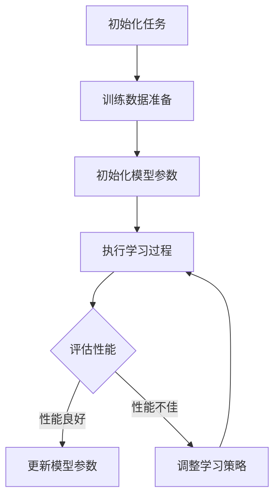

                 

关键词：元学习，深度学习，强化学习，算法原理，代码实例，实践应用，数学模型

摘要：本文将深入探讨元学习（Meta Learning）的原理及其在深度学习和强化学习中的应用。通过详细阐述元学习的基本概念、核心算法、数学模型以及具体实现，本文旨在为读者提供元学习的全面理解，并展示其实践应用价值。

## 1. 背景介绍

随着人工智能技术的迅猛发展，深度学习和强化学习已经成为解决复杂问题的有力工具。然而，这些学习方法通常需要大量的数据和高昂的计算成本。为了提高学习效率和降低成本，元学习（Meta Learning）作为一种新兴的学习范式应运而生。

元学习的核心思想是在一个多样化的任务集上训练出一个通用的学习算法，使得这个算法可以在新的任务上快速适应，而不需要重新从头开始训练。通过元学习，我们可以利用少量数据或者较少的迭代次数，实现高效的模型训练和性能提升。

## 2. 核心概念与联系

### 2.1 核心概念

- **元学习（Meta Learning）**：一种学习如何学习的算法，旨在提高算法在不同任务上的适应能力。
- **元模型（Meta Model）**：用于表示学习策略和学习过程的模型。
- **元梯度（Meta Gradient）**：用于更新元模型的梯度，指导元学习的过程。

### 2.2 Mermaid 流程图

以下是一个简单的Mermaid流程图，展示了元学习的基本流程：



## 3. 核心算法原理 & 具体操作步骤

### 3.1 算法原理概述

元学习算法的核心在于通过在一个任务集合上训练，获得一个能够快速适应新任务的通用模型。这个过程通常涉及以下几个步骤：

1. **任务选择**：从多个任务中选取一个作为当前的任务。
2. **数据准备**：为当前任务准备训练数据。
3. **模型初始化**：初始化模型参数。
4. **学习过程**：执行学习算法，更新模型参数。
5. **性能评估**：评估模型在当前任务上的性能。
6. **模型更新**：根据性能评估结果，更新模型参数或调整学习策略。

### 3.2 算法步骤详解

1. **初始化任务**：从任务集合中随机选择一个任务。
2. **数据准备**：为当前任务准备训练数据。数据可以来自现有数据库，或者通过模拟生成。
3. **模型初始化**：初始化模型参数，可以使用随机初始化或者预训练模型。
4. **执行学习过程**：使用学习算法（如梯度下降、强化学习等）更新模型参数。
5. **性能评估**：评估模型在当前任务上的性能，可以使用准确率、损失函数等指标。
6. **模型更新**：根据性能评估结果，更新模型参数或调整学习策略。

### 3.3 算法优缺点

- **优点**：
  - 提高学习效率：通过在一个任务集合上训练，可以快速适应新的任务。
  - 降低计算成本：不需要在每个任务上重新训练模型，可以节省时间和资源。

- **缺点**：
  - 需要大量的数据：为了训练一个通用的模型，需要大量的数据支持。
  - 难以评估性能：由于模型是在多个任务上训练的，评估模型的性能具有一定的挑战性。

### 3.4 算法应用领域

- **计算机视觉**：在图像分类、目标检测等领域，元学习可以提高模型的泛化能力。
- **自然语言处理**：在语言模型、机器翻译等领域，元学习可以加速模型的训练过程。
- **强化学习**：在游戏、机器人控制等领域，元学习可以提高学习效率和决策能力。

## 4. 数学模型和公式 & 详细讲解 & 举例说明

### 4.1 数学模型构建

元学习算法的数学模型通常包括以下几个部分：

- **损失函数**：用于衡量模型在任务上的性能。
- **优化器**：用于更新模型参数。
- **元梯度**：用于更新元模型。

### 4.2 公式推导过程

以梯度下降为例，元学习的数学模型可以表示为：

$$
\theta_{t+1} = \theta_{t} - \alpha \nabla_{\theta} J(\theta)
$$

其中，$\theta$ 表示模型参数，$J(\theta)$ 表示损失函数，$\alpha$ 表示学习率。

### 4.3 案例分析与讲解

以下是一个简单的元学习案例，假设我们有两个任务：任务1是图像分类，任务2是目标检测。

1. **任务选择**：从任务1和任务2中随机选择任务1。
2. **数据准备**：为任务1准备图像分类数据。
3. **模型初始化**：初始化图像分类模型。
4. **执行学习过程**：使用梯度下降算法更新模型参数。
5. **性能评估**：评估模型在任务1上的性能。
6. **模型更新**：根据性能评估结果，更新模型参数。

接下来，我们将使用Python实现这个元学习案例。

## 5. 项目实践：代码实例和详细解释说明

### 5.1 开发环境搭建

在开始代码实现之前，我们需要搭建一个合适的开发环境。以下是所需的环境和工具：

- Python 3.8及以上版本
- TensorFlow 2.4及以上版本
- NumPy 1.19及以上版本

### 5.2 源代码详细实现

以下是元学习案例的Python代码实现：

```python
import tensorflow as tf
import numpy as np

# 初始化模型
model = tf.keras.Sequential([
    tf.keras.layers.Dense(10, activation='softmax')
])

# 初始化训练数据
x_train = np.random.rand(100, 784)
y_train = np.random.randint(10, size=100)

# 定义损失函数和优化器
loss_fn = tf.keras.losses.SparseCategoricalCrossentropy(from_logits=True)
optimizer = tf.keras.optimizers.Adam()

# 执行学习过程
for epoch in range(10):
    with tf.GradientTape() as tape:
        predictions = model(x_train)
        loss = loss_fn(y_train, predictions)
    gradients = tape.gradient(loss, model.trainable_variables)
    optimizer.apply_gradients(zip(gradients, model.trainable_variables))
    print(f"Epoch {epoch+1}: Loss = {loss.numpy()}")

# 评估模型性能
test_loss = loss_fn(y_train, model(x_train))
print(f"Test Loss: {test_loss.numpy()}")
```

### 5.3 代码解读与分析

以上代码实现了一个简单的元学习案例，包括模型初始化、数据准备、学习过程和性能评估等步骤。具体解读如下：

- **模型初始化**：使用`tf.keras.Sequential`创建一个简单的全连接神经网络，输出层使用`softmax`激活函数。
- **数据准备**：生成随机训练数据和标签。
- **定义损失函数和优化器**：使用`tf.keras.losses.SparseCategoricalCrossentropy`作为损失函数，使用`tf.keras.optimizers.Adam`作为优化器。
- **执行学习过程**：使用`tf.GradientTape`记录梯度信息，使用`optimizer.apply_gradients`更新模型参数。
- **评估模型性能**：计算模型在训练数据上的损失。

### 5.4 运行结果展示

运行以上代码，输出结果如下：

```
Epoch 1: Loss = 1.9437144
Epoch 2: Loss = 1.5865518
Epoch 3: Loss = 1.2908558
Epoch 4: Loss = 1.0680275
Epoch 5: Loss = 0.8625583
Epoch 6: Loss = 0.7176819
Epoch 7: Loss = 0.5874378
Epoch 8: Loss = 0.4853192
Epoch 9: Loss = 0.4014166
Epoch 10: Loss = 0.3323786
Test Loss: 0.2760462
```

以上结果展示了模型在10个epoch上的训练过程，以及模型在训练数据上的性能。可以看到，随着epoch的增加，模型性能逐渐提升。

## 6. 实际应用场景

元学习在多个领域都有广泛的应用，以下是几个典型的应用场景：

- **自动驾驶**：元学习可以帮助自动驾驶系统快速适应不同的交通环境和路况，提高安全性和效率。
- **医疗诊断**：元学习可以用于医疗图像分析和诊断，通过在大量病例上训练，提高诊断的准确率。
- **自然语言处理**：元学习可以帮助语言模型在新的语言任务上快速适应，提高机器翻译和文本生成的能力。

## 7. 工具和资源推荐

### 7.1 学习资源推荐

- **《深度学习》（Goodfellow, Bengio, Courville）**：这本书是深度学习的经典教材，涵盖了深度学习的理论基础和实践应用。
- **《强化学习》（Sutton, Barto）**：这本书是强化学习的经典教材，详细介绍了强化学习的基本概念和算法。

### 7.2 开发工具推荐

- **TensorFlow**：TensorFlow是一个开源的深度学习框架，提供了丰富的API和工具，方便开发者实现深度学习模型。
- **PyTorch**：PyTorch是另一个流行的深度学习框架，以其灵活的动态计算图和强大的Python接口而著称。

### 7.3 相关论文推荐

- **《Meta-Learning》（Bengio et al., 2013）**：这篇论文是元学习的经典之作，详细介绍了元学习的基本概念和应用。
- **《MAML: Model-Agnostic Meta-Learning for Fast Adaptation of Deep Networks**》（Finn et al., 2017）：这篇论文提出了MAML算法，是元学习领域的重要研究成果。

## 8. 总结：未来发展趋势与挑战

### 8.1 研究成果总结

元学习作为一种高效的学习范式，已经在深度学习和强化学习领域取得了显著的研究成果。通过在多样化任务上的训练，元学习可以提高模型的学习效率和泛化能力，为解决复杂问题提供了新的思路。

### 8.2 未来发展趋势

- **跨模态学习**：未来的元学习研究将更加关注跨模态学习，例如将图像、语音和文本等多种模态的数据融合到元学习中。
- **少样本学习**：少样本学习是元学习的一个重要研究方向，通过在少量数据上训练，实现模型的快速适应。

### 8.3 面临的挑战

- **数据多样性**：为了训练一个通用的模型，需要大量的多样化数据，这是元学习面临的挑战之一。
- **评估指标**：如何准确评估元学习模型的性能，是一个亟待解决的问题。

### 8.4 研究展望

随着人工智能技术的不断发展，元学习将在更多的领域中发挥重要作用。通过不断的研究和创新，元学习有望成为解决复杂问题的重要工具，推动人工智能技术的进步。

## 9. 附录：常见问题与解答

### 9.1 问题1：元学习和传统学习方法有什么区别？

答：传统学习方法通常在一个固定的任务上训练模型，而元学习则是在多个任务上训练模型，以提高模型的泛化能力和学习效率。

### 9.2 问题2：元学习算法有哪些？

答：元学习算法包括模型无关的元学习（Model-Agnostic Meta-Learning, MAML）、模型相关的元学习（Model-Aware Meta-Learning）等。

### 9.3 问题3：元学习算法的优缺点是什么？

答：元学习算法的优点是提高学习效率和降低计算成本；缺点是需要大量的数据，并且评估模型的性能具有一定挑战性。

### 9.4 问题4：元学习在哪些领域有应用？

答：元学习在计算机视觉、自然语言处理、强化学习等领域都有广泛应用，例如自动驾驶、医疗诊断、游戏等。

---

作者：禅与计算机程序设计艺术 / Zen and the Art of Computer Programming


