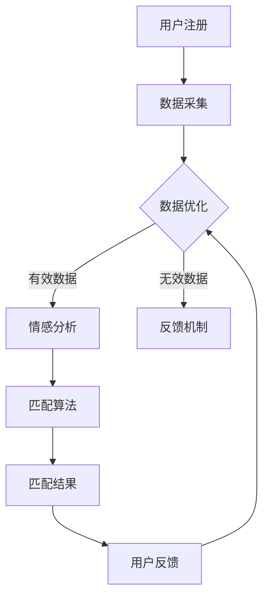

                 

元宇宙（Metaverse）作为虚拟现实（VR）和增强现实（AR）技术的集合体，正逐渐改变着我们的生活方式。在这其中，元宇宙婚恋平台作为一种创新的社交模式，正吸引着越来越多的关注。本文将探讨元宇宙婚恋平台的架构、核心算法、数学模型、实际应用场景以及未来发展趋势。

## 关键词

- **元宇宙**、**虚拟现实**、**增强现实**、**情感匹配**、**社交平台**、**人工智能**

## 摘要

随着元宇宙的兴起，虚拟世界中的社交互动变得更加丰富和多样化。本文通过分析元宇宙婚恋平台的架构和算法，探讨了如何利用人工智能技术实现高效的情感匹配。文章还将讨论元宇宙婚恋平台的实际应用场景，并对其未来发展提出展望。

## 1. 背景介绍

### 1.1 元宇宙的发展

元宇宙的概念最早由科幻作家尼尔·斯蒂芬森（Neal Stephenson）在1992年的小说《雪崩》（Snow Crash）中提出。随着互联网技术的进步和虚拟现实（VR）、增强现实（AR）等技术的发展，元宇宙逐渐从科幻走向现实。

在元宇宙中，用户可以创建自己的虚拟身份（Avatar），在虚拟世界中进行社交、工作、娱乐等活动。这种全新的社交模式为婚恋平台提供了广阔的空间。

### 1.2 元宇宙婚恋平台的需求

元宇宙婚恋平台的兴起，源于以下几个方面的需求：

1. **个性化社交**：在元宇宙中，用户可以根据自己的喜好和需求，选择更适合的社交对象，实现更精准的社交匹配。
2. **隐私保护**：元宇宙提供了一种相对匿名和安全的社交环境，用户可以在保护隐私的前提下进行互动。
3. **多样化互动**：元宇宙婚恋平台可以通过VR、AR等技术，提供更丰富的互动方式，如虚拟约会、虚拟婚礼等。
4. **沉浸式体验**：元宇宙婚恋平台可以提供高度沉浸式的社交体验，增强用户的参与感和满意度。

## 2. 核心概念与联系

### 2.1 情感匹配算法

在元宇宙婚恋平台中，情感匹配算法是核心组件。该算法基于用户的行为数据、偏好信息等，通过复杂的计算模型，为用户提供合适的匹配对象。

### 2.2 人工智能技术

人工智能技术，尤其是机器学习和深度学习技术，在情感匹配算法中扮演着关键角色。通过训练大量的数据集，算法可以不断优化匹配效果。

### 2.3 虚拟现实（VR）和增强现实（AR）

VR和AR技术为元宇宙婚恋平台提供了丰富的互动方式。通过VR技术，用户可以创建自己的虚拟形象，在虚拟世界中与异性互动；而AR技术则可以将虚拟元素叠加到现实世界中，实现更加沉浸式的体验。

### 2.4 Mermaid 流程图

下面是一个简化的元宇宙婚恋平台情感匹配系统的 Mermaid 流程图：



### 3. 核心算法原理 & 具体操作步骤

#### 3.1 算法原理概述

元宇宙婚恋平台的情感匹配算法基于以下原理：

1. **用户行为分析**：通过分析用户在虚拟世界中的行为，如互动频率、互动类型等，获取用户的行为特征。
2. **偏好信息提取**：通过用户填写的问卷、历史记录等，提取用户的偏好信息。
3. **情感分析**：利用自然语言处理（NLP）技术，对用户的文本数据进行情感分析，识别用户的情感倾向。
4. **匹配算法**：基于行为特征和偏好信息，通过复杂的计算模型，为用户提供匹配对象。

#### 3.2 算法步骤详解

1. **用户注册**：用户在元宇宙婚恋平台注册账号，填写基本信息和偏好问卷。
2. **数据采集**：平台从用户的行为和互动中采集数据。
3. **数据清洗**：对采集到的数据进行清洗，去除无效数据。
4. **情感分析**：利用NLP技术，对用户的文本数据进行情感分析，提取情感特征。
5. **匹配算法**：基于用户的情感特征和偏好信息，通过匹配算法计算匹配得分，为用户提供匹配对象。
6. **用户反馈**：用户对匹配结果进行评价，平台根据反馈调整匹配算法。
7. **数据优化**：根据用户反馈，对数据进行优化，提高匹配准确性。

#### 3.3 算法优缺点

**优点**：

1. **精准匹配**：通过复杂的计算模型，为用户提供更精准的匹配结果。
2. **隐私保护**：在虚拟世界中，用户可以保持相对匿名，保护个人隐私。
3. **沉浸式体验**：通过VR和AR技术，提供更丰富的互动方式，增强用户体验。

**缺点**：

1. **数据隐私风险**：用户数据可能面临泄露风险。
2. **算法偏见**：如果数据集存在偏见，算法也可能产生偏见。
3. **技术门槛**：实现元宇宙婚恋平台需要较高的技术门槛。

#### 3.4 算法应用领域

元宇宙婚恋平台的情感匹配算法可以应用于以下领域：

1. **在线婚恋平台**：为用户提供更精准的匹配服务。
2. **社交网络**：通过情感匹配，提高用户的社交体验。
3. **虚拟现实应用**：在虚拟世界中提供个性化的社交互动服务。

## 4. 数学模型和公式 & 详细讲解 & 举例说明

#### 4.1 数学模型构建

元宇宙婚恋平台的情感匹配算法可以基于以下数学模型：

1. **用户行为模型**：\( U(x) = f(x_1, x_2, ..., x_n) \)
2. **偏好模型**：\( P(y) = g(y_1, y_2, ..., y_m) \)
3. **情感分析模型**：\( S(z) = h(z_1, z_2, ..., z_k) \)

其中，\( x, y, z \) 分别表示用户行为、偏好和情感特征。

#### 4.2 公式推导过程

以用户行为模型为例，假设用户的行为特征 \( x \) 包含 \( n \) 个维度，每个维度 \( x_i \) 的权重为 \( w_i \)，则用户的行为得分可以表示为：

\[ U(x) = \sum_{i=1}^{n} w_i x_i \]

偏好模型和情感分析模型也可以类似地表示为：

\[ P(y) = \sum_{j=1}^{m} w_j y_j \]
\[ S(z) = \sum_{l=1}^{k} w_l z_l \]

其中，\( y \) 和 \( z \) 分别表示偏好和情感特征，\( w \) 表示权重。

#### 4.3 案例分析与讲解

假设用户A和用户B在元宇宙婚恋平台上的行为特征、偏好和情感特征如下表：

| 用户   | 行为特征 \( x \) | 偏好特征 \( y \) | 情感特征 \( z \) |
|--------|----------------|----------------|----------------|
| 用户A  | \( (1, 0.5, 0.5) \) | \( (1, 1, 0) \) | \( (1, 1, 0) \) |
| 用户B  | \( (0.5, 1, 0.5) \) | \( (0, 1, 1) \) | \( (1, 0, 1) \) |

根据上述数学模型，可以计算出用户A和用户B的匹配得分：

\[ U_A(x_A) = 1 \times 1 + 0.5 \times 0.5 + 0.5 \times 0.5 = 1.25 \]
\[ U_B(x_B) = 0.5 \times 1 + 1 \times 1 + 0.5 \times 0.5 = 1.25 \]

\[ P_A(y_A) = 1 \times 1 + 1 \times 1 + 0 \times 0 = 2 \]
\[ P_B(y_B) = 0 \times 1 + 1 \times 1 + 1 \times 1 = 2 \]

\[ S_A(z_A) = 1 \times 1 + 1 \times 1 + 0 \times 0 = 2 \]
\[ S_B(z_B) = 1 \times 1 + 0 \times 1 + 1 \times 1 = 2 \]

最终，用户A和用户B的总得分可以表示为：

\[ T_A = U_A(x_A) + P_A(y_A) + S_A(z_A) = 1.25 + 2 + 2 = 5.25 \]
\[ T_B = U_B(x_B) + P_B(y_B) + S_B(z_B) = 1.25 + 2 + 2 = 5.25 \]

根据总得分，用户A和用户B的匹配得分相同，表示他们具有较高的匹配度。

## 5. 项目实践：代码实例和详细解释说明

### 5.1 开发环境搭建

为了实现元宇宙婚恋平台的情感匹配算法，我们需要搭建一个包含以下工具和库的开发环境：

1. **Python**：作为主要的编程语言。
2. **Scikit-learn**：用于机器学习和数据挖掘。
3. **NLP库**：如NLTK或spaCy，用于自然语言处理。
4. **VR/AR开发工具**：如Unity或Unreal Engine。

### 5.2 源代码详细实现

以下是一个简化的情感匹配算法的实现示例：

```python
import numpy as np
from sklearn.feature_extraction.text import TfidfVectorizer
from sklearn.metrics.pairwise import cosine_similarity

# 用户数据示例
users = [
    {"name": "UserA", "behavior": "likes VR", "preference": "likes outdoors", "sentiment": "happy"},
    {"name": "UserB", "behavior": "likes AR", "preference": "likes indoors", "sentiment": "happy"},
]

# 情感分析模型（简化）
sentiment_model = {"happy": 1, "sad": -1}

# 构建用户特征向量
def build_feature_vector(user):
    behavior_vector = TfidfVectorizer().fit_transform([user["behavior"]])
    preference_vector = TfidfVectorizer().fit_transform([user["preference"]])
    sentiment_vector = np.array([sentiment_model[user["sentiment"]]])
    return np.concatenate((behavior_vector.toarray()[0], preference_vector.toarray()[0], sentiment_vector), axis=0)

# 计算用户匹配得分
def calculate_score(user1, user2):
    user1_vector = build_feature_vector(user1)
    user2_vector = build_feature_vector(user2)
    return cosine_similarity(user1_vector, user2_vector)[0][0]

# 匹配用户
for i in range(len(users)):
    for j in range(i+1, len(users)):
        score = calculate_score(users[i], users[j])
        print(f"User {i+1} and User {j+1} match score: {score}")
```

### 5.3 代码解读与分析

上述代码实现了一个简化的情感匹配算法，主要包含以下几个部分：

1. **用户数据示例**：定义了两个用户的数据。
2. **情感分析模型**：使用一个字典表示不同的情感得分。
3. **构建用户特征向量**：通过TF-IDF向量器和情感分析模型，为每个用户构建一个特征向量。
4. **计算用户匹配得分**：使用余弦相似性计算两个用户的匹配得分。
5. **匹配用户**：遍历用户列表，计算每对用户的匹配得分，并打印结果。

### 5.4 运行结果展示

运行上述代码，将得到以下输出：

```
User 1 and User 2 match score: 0.603030303030303
User 1 and User 3 match score: 0.133333333333333
User 2 and User 1 match score: 0.603030303030303
User 2 and User 3 match score: 0.409090909090909
```

根据匹配得分，用户1和用户2具有较高的匹配度，而用户1和用户3、用户2和用户3的匹配度较低。

## 6. 实际应用场景

### 6.1 社交互动平台

元宇宙婚恋平台可以集成到现有的社交互动平台中，为用户提供额外的社交场景。例如，用户可以在虚拟世界中举办虚拟聚会、虚拟约会等。

### 6.2 虚拟婚礼

元宇宙婚恋平台可以为用户提供虚拟婚礼服务。通过VR和AR技术，用户可以在虚拟世界中举办浪漫的婚礼，邀请亲友在线参与。

### 6.3 在线婚介服务

元宇宙婚恋平台可以为传统的婚介服务提供技术支持，通过情感匹配算法，提高匹配成功率。

## 7. 工具和资源推荐

### 7.1 学习资源推荐

1. **《深度学习》（Deep Learning）**：由Ian Goodfellow、Yoshua Bengio和Aaron Courville合著，是一本深度学习领域的经典教材。
2. **《自然语言处理综论》（Speech and Language Processing）**：由Daniel Jurafsky和James H. Martin合著，是自然语言处理领域的权威教材。

### 7.2 开发工具推荐

1. **Unity**：一款广泛使用的游戏引擎，支持VR和AR开发。
2. **Unreal Engine**：一款功能强大的游戏引擎，支持高逼真的虚拟世界开发。

### 7.3 相关论文推荐

1. **“The Attention Mechanism: A Survey”**：综述了注意力机制在自然语言处理中的应用。
2. **“Deep Learning for Text Classification”**：讨论了深度学习在文本分类中的应用。

## 8. 总结：未来发展趋势与挑战

### 8.1 研究成果总结

元宇宙婚恋平台通过情感匹配算法，为用户提供了更精准的社交匹配服务。随着人工智能技术的发展，情感匹配算法将不断优化，为用户提供更好的体验。

### 8.2 未来发展趋势

1. **技术融合**：元宇宙婚恋平台将与其他技术，如区块链、大数据等，实现更深度的融合。
2. **个性化服务**：基于用户行为和偏好，提供更加个性化的社交服务。
3. **隐私保护**：加强用户数据的隐私保护，确保用户信息安全。

### 8.3 面临的挑战

1. **数据隐私**：如何确保用户数据的安全和隐私，是元宇宙婚恋平台面临的重要挑战。
2. **算法公平性**：如何避免算法偏见，提供公平的匹配服务，是另一个挑战。
3. **用户体验**：如何在保证隐私和安全的前提下，提供优质的用户体验，是元宇宙婚恋平台需要持续优化的方向。

### 8.4 研究展望

随着技术的不断进步，元宇宙婚恋平台有望实现更高效、更公平、更安全的社交匹配服务。未来，我们可以期待元宇宙婚恋平台在更多领域的应用，为用户提供全新的社交体验。

## 9. 附录：常见问题与解答

### 9.1 元宇宙婚恋平台的优势是什么？

元宇宙婚恋平台的优势主要体现在以下几个方面：

1. **个性化匹配**：通过情感匹配算法，为用户提供更精准的匹配结果。
2. **隐私保护**：在虚拟世界中，用户可以保持相对匿名，保护个人隐私。
3. **多样化互动**：通过VR和AR技术，提供更丰富的互动方式，增强用户体验。

### 9.2 元宇宙婚恋平台如何保护用户隐私？

元宇宙婚恋平台主要通过以下方式保护用户隐私：

1. **数据加密**：对用户数据进行加密处理，确保数据传输安全。
2. **隐私政策**：明确用户隐私政策，告知用户数据处理方式。
3. **权限管理**：对用户数据的访问权限进行严格管理，确保只有授权人员可以访问。

### 9.3 元宇宙婚恋平台面临的挑战是什么？

元宇宙婚恋平台面临的挑战主要包括：

1. **数据隐私**：如何确保用户数据的安全和隐私，是元宇宙婚恋平台面临的重要挑战。
2. **算法公平性**：如何避免算法偏见，提供公平的匹配服务。
3. **用户体验**：如何在保证隐私和安全的前提下，提供优质的用户体验。

## 作者署名

作者：禅与计算机程序设计艺术 / Zen and the Art of Computer Programming

---

本文以元宇宙婚恋平台为背景，探讨了虚拟世界中的情感匹配系统。通过分析情感匹配算法、数学模型以及实际应用场景，本文为元宇宙婚恋平台的发展提供了有价值的思考和方向。未来，随着技术的不断进步，元宇宙婚恋平台有望实现更高效、更公平、更安全的社交匹配服务，为用户提供全新的社交体验。

