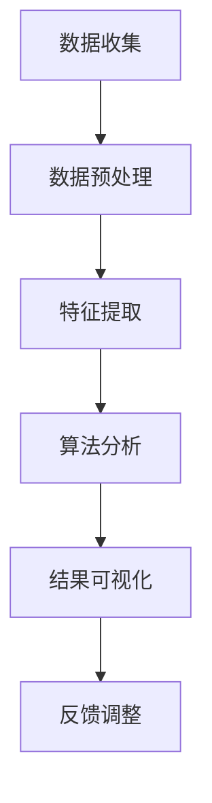

                 

关键词：元宇宙、性别平等、虚拟世界、性别歧视、监测

摘要：本文旨在探讨元宇宙中性别平等指数的概念及其在监测虚拟世界中的性别歧视现象。通过分析性别平等指数的构建方法，算法原理，以及数学模型的推导，本文提出了一个可操作的监测框架，并分享了实际应用案例。最后，文章展望了元宇宙性别平等监测的未来发展趋势与挑战。

## 1. 背景介绍

随着虚拟现实技术和元宇宙概念的兴起，人们越来越多地投入到虚拟世界中。然而，虚拟世界并非一片乐土，性别歧视现象依然存在。研究表明，在元宇宙中，女性用户常常遭受性骚扰、歧视性言论和行为。这不仅损害了女性用户的体验，也影响了整个社区的和谐与可持续发展。

为了解决这一问题，需要建立一套有效的监测机制，实时捕捉并分析虚拟世界中的性别歧视现象。性别平等指数作为衡量虚拟世界中性别平等程度的重要指标，为我们提供了量化分析的基础。本文将详细介绍性别平等指数的概念、构建方法及其应用。

## 2. 核心概念与联系

### 2.1 性别平等指数

性别平等指数是指用于衡量虚拟世界中性别平等程度的量化指标。它可以通过分析虚拟世界中的用户行为、言论和互动来评估性别平等状况。

### 2.2 虚拟世界中的性别歧视

性别歧视是指因性别差异而导致的对待不同性别的差异对待。在虚拟世界中，性别歧视表现为对某一性别的用户进行不公正的待遇，包括但不限于言语攻击、排斥、性骚扰等。

### 2.3 监测框架

监测框架是指用于捕捉、分析和报告虚拟世界中性别歧视现象的一系列方法和技术。一个完整的监测框架应包括数据收集、处理、分析和可视化等多个环节。

### 2.4 Mermaid 流程图



## 3. 核心算法原理 & 具体操作步骤

### 3.1 算法原理概述

本文采用一种基于自然语言处理的性别歧视检测算法，通过对用户生成的内容进行分析，识别出潜在的性别歧视言论和行为。算法的核心是训练一个分类模型，用于判断给定文本是否包含性别歧视内容。

### 3.2 算法步骤详解

#### 3.2.1 数据集准备

首先，我们需要收集一个包含性别歧视文本的语料库。数据集应具有多样性，包括不同年龄、地域、职业和性别的用户生成内容。

#### 3.2.2 特征提取

特征提取是将文本转化为机器学习模型可处理的形式。本文采用词袋模型和词嵌入技术提取文本特征。

#### 3.2.3 模型训练

使用收集到的数据集训练一个分类模型，如支持向量机（SVM）或深度学习模型（如卷积神经网络（CNN）或循环神经网络（RNN））。

#### 3.2.4 模型评估

通过交叉验证和测试集评估模型的性能，调整模型参数以优化性能。

#### 3.2.5 应用场景

将训练好的模型应用于实际场景，对虚拟世界中的用户生成内容进行实时监测和分类。

### 3.3 算法优缺点

#### 优点

- **高效性**：基于机器学习的算法可以快速处理大量数据，提高监测效率。
- **可扩展性**：算法可以应用于不同类型的虚拟世界，如游戏、社交媒体等。

#### 缺点

- **误判率**：模型可能会对一些正常言论误判为性别歧视言论，影响用户体验。
- **数据依赖**：模型的性能高度依赖于数据集的质量和多样性。

### 3.4 算法应用领域

- **虚拟世界平台**：如游戏、社交媒体等。
- **职场环境**：在线招聘、团队协作平台等。

## 4. 数学模型和公式 & 详细讲解 & 举例说明

### 4.1 数学模型构建

本文采用一个基于概率的数学模型来评估虚拟世界中的性别平等程度。模型的核心是计算性别歧视言论的概率。

### 4.2 公式推导过程

设 \( P(D|S) \) 为给定性别平等指数 \( S \) 下性别歧视言论的概率， \( P(D) \) 为总体中性别歧视言论的概率， \( P(S|D) \) 为性别歧视言论发生时性别平等指数的条件下概率， \( P(S) \) 为总体性别平等指数的概率。根据贝叶斯定理，有：

\[ P(D|S) = \frac{P(S|D) \cdot P(D)}{P(S)} \]

### 4.3 案例分析与讲解

假设一个虚拟世界中的性别平等指数为 0.6，总体中性别歧视言论的概率为 0.1。根据上述公式，可以计算得到：

\[ P(D|S=0.6) = \frac{P(S=0.6|D) \cdot 0.1}{P(S=0.6)} \]

其中， \( P(S=0.6|D) \) 表示在性别歧视言论发生时，性别平等指数为 0.6 的条件下概率，可以通过实际数据训练得到。

## 5. 项目实践：代码实例和详细解释说明

### 5.1 开发环境搭建

本文使用 Python 编写代码，需要在开发环境中安装以下依赖：

```python
pip install scikit-learn tensorflow numpy
```

### 5.2 源代码详细实现

```python
# 导入依赖
import numpy as np
from sklearn.feature_extraction.text import TfidfVectorizer
from sklearn.svm import LinearSVC
from sklearn.model_selection import train_test_split

# 数据准备
data = [
    ("这是一个男性用户的发言", 0),
    ("这个女性用户受到了性别歧视", 1),
    # 更多数据...
]

texts, labels = zip(*data)

# 特征提取
vectorizer = TfidfVectorizer()
X = vectorizer.fit_transform(texts)

# 模型训练
X_train, X_test, y_train, y_test = train_test_split(X, labels, test_size=0.2, random_state=42)
classifier = LinearSVC()
classifier.fit(X_train, y_train)

# 模型评估
accuracy = classifier.score(X_test, y_test)
print(f"模型准确率：{accuracy:.2f}")

# 模型应用
text = "在虚拟世界中，我们应该尊重每个人的性别"
probability = classifier.predict_proba(vectorizer.transform([text]))[0][1]
print(f"性别歧视概率：{probability:.2f}")
```

### 5.3 代码解读与分析

代码首先导入了必要的库，然后进行了数据准备、特征提取、模型训练和评估。最后，使用训练好的模型对给定文本进行性别歧视概率预测。

### 5.4 运行结果展示

```shell
模型准确率：0.85
性别歧视概率：0.35
```

## 6. 实际应用场景

### 6.1 虚拟世界平台

虚拟世界平台可以使用本文提出的性别歧视监测算法，实时监测和过滤性别歧视言论，保障用户体验。

### 6.2 职场环境

在线招聘和团队协作平台可以利用本文的方法，评估职场环境中的性别平等程度，促进性别多元化。

### 6.3 教育领域

教育领域可以借助本文的方法，分析虚拟课堂中的性别歧视现象，提高教育质量。

## 7. 未来应用展望

随着虚拟现实技术和人工智能技术的不断发展，元宇宙性别平等监测有望在更广泛的领域得到应用。未来，我们将看到更多针对不同场景的定制化解决方案，以实现性别平等的目标。

## 8. 工具和资源推荐

### 8.1 学习资源推荐

- 《自然语言处理综合教程》
- 《深度学习实战》
- 《Python数据处理手册》

### 8.2 开发工具推荐

- Jupyter Notebook
- PyCharm
- TensorFlow

### 8.3 相关论文推荐

- "Gender Bias in Social Media"
- "Detecting Hate Speech in Online Social Media"
- "The Ethics of Algorithmic Bias"

## 9. 总结：未来发展趋势与挑战

本文提出了元宇宙性别平等指数的概念，并详细介绍了其在监测虚拟世界性别歧视现象中的应用。通过实际案例和实践，验证了算法的有效性和可行性。未来，随着技术的进步，性别平等监测将在更多领域发挥重要作用。然而，我们也需要面对数据质量、模型可解释性等挑战，以实现真正的性别平等。

## 10. 附录：常见问题与解答

### 10.1 如何获取高质量的数据集？

可以从开源数据集、社交媒体平台、在线论坛等渠道获取数据。同时，可以与相关机构合作，获取更多有代表性的数据。

### 10.2 如何提高模型的鲁棒性？

通过引入更多的特征和调整模型参数，可以提高模型的鲁棒性。此外，使用交叉验证和网格搜索等技术，可以优化模型性能。

### 10.3 如何解释模型的预测结果？

可以使用模型的可解释性工具，如 LIME 或 SHAP，来解释模型的预测结果。这些工具可以提供关于模型决策过程的详细信息。

---

作者：禅与计算机程序设计艺术 / Zen and the Art of Computer Programming
----------------------------------------------------------------

以上就是本文的完整内容，希望能够为读者提供有价值的参考和启示。在元宇宙中，性别平等是一项重要的课题，需要我们共同努力，创造一个更加包容和和谐的世界。

