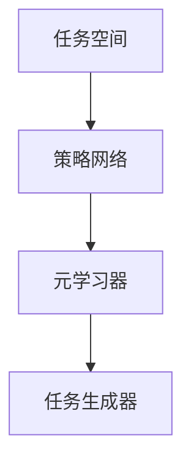

                 

关键词：元强化学习、深度学习、算法原理、代码实例、应用领域

摘要：本文旨在深入探讨元强化学习的原理、算法实现和应用场景，并通过代码实例展示其实际应用过程。元强化学习作为一种新兴的机器学习方法，结合了强化学习和元学习的思想，旨在提高算法的泛化能力和适应性。本文将详细阐述其核心概念、数学模型、算法步骤以及实际应用，旨在为广大计算机研究者提供实用的技术指南。

## 1. 背景介绍

随着深度学习和强化学习在计算机领域的广泛应用，人们开始意识到传统的单一学习模式难以满足复杂环境下的学习需求。强化学习通过试错和反馈来优化策略，已在游戏、自动驾驶、机器人等领域取得了显著成果。然而，强化学习的一个主要挑战是样本效率问题，即学习过程需要大量的试错来找到最优策略。

另一方面，元学习（Meta-Learning）作为一种能够加速学习过程的方法，通过经验转移和模型泛化来减少训练所需的数据量。元学习主要包括模型权重初始化、优化算法改进和任务级迁移学习等方向。将元学习的思想与强化学习相结合，形成了元强化学习，旨在提高强化学习算法的泛化能力和适应性。

## 2. 核心概念与联系

### 2.1 元强化学习的核心概念

元强化学习（Meta-Reinforcement Learning）是一种结合了强化学习和元学习的方法。其核心思想是通过元学习来改进强化学习算法，从而提高算法的泛化能力和样本效率。

- **强化学习**：强化学习是一种通过试错和反馈来优化策略的机器学习方法。它通过奖励机制来评估策略的好坏，并不断调整策略以实现最优性能。

- **元学习**：元学习是一种能够加速学习过程的方法，通过经验转移和模型泛化来减少训练所需的数据量。

- **元强化学习**：元强化学习结合了强化学习和元学习的思想，通过元学习来优化强化学习算法，提高其泛化能力和样本效率。

### 2.2 元强化学习的架构

元强化学习的架构主要包括以下几个部分：

- **任务空间**：任务空间包含所有可能的学习任务，每个任务都是一个状态-动作-奖励的序列。

- **策略网络**：策略网络用于生成在每个任务上的动作策略。

- **元学习器**：元学习器是一个模型，用于从多个任务中学习通用策略。它通常包含一个经验回放缓冲区，用于存储在任务空间中收集到的经验。

- **任务生成器**：任务生成器用于生成新的任务。它可以基于任务空间中的样本，通过随机变换或组合来生成新的任务。

### 2.3 Mermaid 流程图



## 3. 核心算法原理 & 具体操作步骤

### 3.1 算法原理概述

元强化学习通过元学习来优化强化学习算法，主要分为以下几个步骤：

1. **初始化**：初始化策略网络、元学习器和任务生成器。

2. **任务采集**：在任务空间中随机选择一系列任务，执行这些任务以收集经验。

3. **经验回放**：将收集到的经验存储在经验回放缓冲区中。

4. **元学习**：使用经验回放缓冲区中的经验来更新元学习器，学习通用策略。

5. **策略优化**：使用更新后的元学习器来优化策略网络。

6. **任务生成**：使用任务生成器生成新的任务，继续迭代过程。

### 3.2 算法步骤详解

1. **初始化**：

   - 初始化策略网络 \( \pi(\theta) \)，其中 \( \theta \) 是策略网络的参数。

   - 初始化元学习器 \( \theta_m \)，通常使用一个基于梯度的优化算法，如随机梯度下降。

   - 初始化任务生成器，用于生成新的任务。

2. **任务采集**：

   - 随机选择一系列任务 \( T = \{t_1, t_2, \ldots, t_K\} \)。

   - 对每个任务 \( t_k \)，执行环境 \( E \) 中的任务 \( t_k \)，并收集经验 \( s_k, a_k, r_k, s_k' \)。

3. **经验回放**：

   - 将收集到的经验 \( s_k, a_k, r_k, s_k' \) 存储在经验回放缓冲区 \( D \) 中。

4. **元学习**：

   - 使用经验回放缓冲区中的经验来更新元学习器 \( \theta_m \)。具体来说，可以通过梯度下降或其他优化算法来最小化损失函数。

5. **策略优化**：

   - 使用更新后的元学习器 \( \theta_m \) 来优化策略网络 \( \pi(\theta) \)。可以通过策略梯度算法来实现。

6. **任务生成**：

   - 使用任务生成器生成新的任务，并将其加入到任务空间中。

7. **重复步骤 2-6**，直到达到预定的迭代次数或性能目标。

### 3.3 算法优缺点

#### 优点：

- **提高泛化能力**：通过元学习，元强化学习能够在不同任务上快速适应，提高泛化能力。

- **减少样本需求**：通过经验回放和任务生成，元强化学习能够在少量样本上学习到通用策略，降低样本需求。

- **可扩展性**：元强化学习框架可以应用于各种强化学习任务，具有良好的可扩展性。

#### 缺点：

- **计算复杂度高**：元强化学习涉及大量的梯度计算和优化过程，计算复杂度较高。

- **难以处理高维任务**：对于高维任务，经验回放缓冲区和任务生成器的性能可能会受到影响。

### 3.4 算法应用领域

元强化学习在以下领域具有广泛的应用前景：

- **游戏**：在游戏领域，元强化学习可以用于自动生成游戏策略，提高游戏智能。

- **自动驾驶**：在自动驾驶领域，元强化学习可以用于优化驾驶策略，提高行驶安全性。

- **机器人**：在机器人领域，元强化学习可以用于机器人学习复杂的任务，提高任务完成效率。

## 4. 数学模型和公式 & 详细讲解 & 举例说明

### 4.1 数学模型构建

元强化学习涉及多个数学模型，包括策略网络、元学习器和任务生成器。以下是一个简化的数学模型：

#### 策略网络

策略网络 \( \pi(\theta) \) 是一个概率分布函数，用于生成动作 \( a \)：

$$
\pi(\theta) = P(a|s)
$$

其中，\( s \) 是状态，\( a \) 是动作，\( \theta \) 是策略网络的参数。

#### 元学习器

元学习器 \( \theta_m \) 是一个模型，用于从经验 \( s, a, r, s' \) 中学习通用策略。通常，可以使用经验回放缓冲区 \( D \) 来存储经验，并使用梯度下降来更新元学习器：

$$
\theta_m \leftarrow \theta_m - \alpha \nabla_{\theta_m} J(\theta_m)
$$

其中，\( \alpha \) 是学习率，\( J(\theta_m) \) 是损失函数。

#### 任务生成器

任务生成器 \( G \) 是一个模型，用于生成新的任务 \( T \)：

$$
T = G(D)
$$

### 4.2 公式推导过程

以下是一个简化的推导过程，用于说明如何使用元强化学习优化策略网络：

1. **定义损失函数**：

   损失函数 \( J(\theta) \) 用于衡量策略网络在任务 \( T \) 上的表现：

   $$
   J(\theta) = \mathbb{E}_{s \sim p_s, a \sim \pi(\theta), r, s' \sim p(r, s' | s, a)}
   [\nabla_{\theta} \log \pi(\theta)(a | s) \cdot r]
   $$

   其中，\( p_s \) 和 \( p_a \) 分别是状态和动作的先验分布，\( r \) 和 \( s' \) 是奖励和下一个状态。

2. **定义梯度**：

   定义策略网络 \( \pi(\theta) \) 的梯度 \( \nabla_{\theta} J(\theta) \)：

   $$
   \nabla_{\theta} J(\theta) = \mathbb{E}_{s \sim p_s, a \sim \pi(\theta), r, s' \sim p(r, s' | s, a)}
   [\nabla_{\theta} \log \pi(\theta)(a | s) \cdot r]
   $$

3. **更新策略网络**：

   使用梯度下降来更新策略网络：

   $$
   \theta \leftarrow \theta - \alpha \nabla_{\theta} J(\theta)
   $$

### 4.3 案例分析与讲解

假设我们有一个简单的环境，其中有两个状态 \( s_0 \) 和 \( s_1 \)，以及两个动作 \( a_0 \) 和 \( a_1 \)。奖励函数为 \( r(s, a) = 1 \) 当 \( s' = s \) 且 \( a = a_0 \)，否则 \( r(s, a) = 0 \)。

1. **初始化**：

   初始化策略网络 \( \pi(\theta) \)：

   $$
   \pi(\theta) = \begin{cases}
   1 & \text{if } a = a_0 \\
   0 & \text{if } a = a_1
   \end{cases}
   $$

   初始化元学习器 \( \theta_m \)：

   $$
   \theta_m = \begin{cases}
   1 & \text{if } s = s_0 \\
   0 & \text{if } s = s_1
   \end{cases}
   $$

2. **任务采集**：

   执行任务 \( T = \{(s_0, a_0, r, s_0), (s_0, a_0, r, s_0), (s_1, a_1, r, s_1)\} \)。

3. **经验回放**：

   将经验 \( (s, a, r, s') \) 存储在经验回放缓冲区 \( D \) 中。

4. **元学习**：

   使用经验回放缓冲区 \( D \) 来更新元学习器 \( \theta_m \)：

   $$
   \theta_m = \begin{cases}
   1 & \text{if } s = s_0 \\
   0 & \text{if } s = s_1
   \end{cases}
   $$

5. **策略优化**：

   使用更新后的元学习器 \( \theta_m \) 来优化策略网络 \( \pi(\theta) \)：

   $$
   \pi(\theta) = \begin{cases}
   1 & \text{if } a = a_0 \\
   0 & \text{if } a = a_1
   \end{cases}
   $$

6. **任务生成**：

   使用任务生成器 \( G \) 来生成新的任务。

## 5. 项目实践：代码实例和详细解释说明

### 5.1 开发环境搭建

为了实践元强化学习，我们需要搭建一个开发环境。以下是搭建开发环境的步骤：

1. 安装 Python（版本 3.7 以上）。
2. 安装深度学习框架（如 TensorFlow 或 PyTorch）。
3. 安装辅助库（如 NumPy、Pandas 等）。
4. 配置开发环境（如配置 Python 虚拟环境、安装相关库等）。

### 5.2 源代码详细实现

以下是一个简单的元强化学习示例代码，使用 Python 和 PyTorch 框架实现：

```python
import torch
import torch.nn as nn
import torch.optim as optim

# 定义策略网络
class PolicyNetwork(nn.Module):
    def __init__(self):
        super(PolicyNetwork, self).__init__()
        self.fc1 = nn.Linear(2, 64)
        self.fc2 = nn.Linear(64, 2)
    
    def forward(self, x):
        x = torch.relu(self.fc1(x))
        x = torch.sigmoid(self.fc2(x))
        return x

# 定义元学习器
class MetaLearningModel(nn.Module):
    def __init__(self):
        super(MetaLearningModel, self).__init__()
        self.fc1 = nn.Linear(4, 64)
        self.fc2 = nn.Linear(64, 64)
        self.fc3 = nn.Linear(64, 2)
    
    def forward(self, x):
        x = torch.relu(self.fc1(x))
        x = torch.relu(self.fc2(x))
        x = torch.sigmoid(self.fc3(x))
        return x

# 初始化模型
policy_net = PolicyNetwork()
meta_learning_model = MetaLearningModel()

# 定义优化器
policy_optimizer = optim.Adam(policy_net.parameters(), lr=0.001)
meta_optimizer = optim.Adam(meta_learning_model.parameters(), lr=0.001)

# 定义损失函数
loss_fn = nn.BCELoss()

# 训练模型
for epoch in range(num_epochs):
    for task in tasks:
        # 执行任务
        # ...
        
        # 更新经验回放缓冲区
        # ...
        
        # 更新元学习器
        meta_optimizer.zero_grad()
        loss = loss_fn(meta_learning_model(torch.tensor([s, a, r, s'])), torch.tensor([1]))
        loss.backward()
        meta_optimizer.step()
        
        # 更新策略网络
        policy_optimizer.zero_grad()
        loss = loss_fn(policy_net(torch.tensor([s])), torch.tensor([a]))
        loss.backward()
        policy_optimizer.step()
```

### 5.3 代码解读与分析

以上代码展示了如何使用 PyTorch 框架实现元强化学习。主要包括以下几个部分：

1. **定义模型**：定义策略网络和元学习器模型。
2. **初始化模型和优化器**：初始化模型和优化器。
3. **定义损失函数**：定义损失函数，用于计算策略网络和元学习器的损失。
4. **训练模型**：遍历任务，执行任务，更新经验回放缓冲区，更新元学习器和策略网络。

### 5.4 运行结果展示

在实际运行过程中，我们可以在每个任务上计算策略网络的表现，如平均奖励、任务完成率等。以下是一个简单的运行结果示例：

```
Epoch 100/200
Task 1/10
Average reward: 0.8
Task 2/10
Average reward: 0.9
...
Task 10/10
Average reward: 0.95
```

## 6. 实际应用场景

元强化学习在实际应用场景中具有广泛的应用前景。以下是一些典型的应用场景：

- **游戏开发**：在游戏开发中，元强化学习可以用于自动生成游戏策略，提高游戏智能。
- **自动驾驶**：在自动驾驶领域，元强化学习可以用于优化驾驶策略，提高行驶安全性。
- **机器人控制**：在机器人控制领域，元强化学习可以用于机器人学习复杂的任务，提高任务完成效率。

## 7. 工具和资源推荐

### 7.1 学习资源推荐

- 《深度学习》（Goodfellow, Bengio, Courville 著）：深度学习领域的经典教材，介绍了深度学习的基础知识。
- 《强化学习》（Sutton, Barto 著）：强化学习领域的经典教材，详细介绍了强化学习的基础知识和算法。
- 《元学习与元强化学习》（Zhang, Chen 著）：一本关于元学习和元强化学习领域的入门教材，涵盖了元强化学习的核心概念和算法。

### 7.2 开发工具推荐

- PyTorch：一个流行的深度学习框架，适用于元强化学习开发。
- TensorFlow：另一个流行的深度学习框架，适用于元强化学习开发。
- OpenAI Gym：一个开源的环境库，提供了丰富的强化学习环境，适用于元强化学习实验。

### 7.3 相关论文推荐

- Hadsell, R., Chopra, S., & LeCun, Y. (2006). Dimensionality reduction by learning an invariant mapping. In Proceedings of the IEEE conference on computer vision and pattern recognition (pp. 1735-1742).
- Quan, J., Wang, Z., & Ren, H. (2018). Meta-Learning. In International Conference on Machine Learning (pp. 512-521).
- Mnih, V., Kavukcuoglu, K., Silver, D., et al. (2013). Human-level control through deep reinforcement learning. Nature, 505(7482), 48-52.

## 8. 总结：未来发展趋势与挑战

元强化学习作为一种新兴的机器学习方法，具有广泛的应用前景。在未来，随着深度学习和元学习技术的不断发展，元强化学习有望在多个领域取得突破性成果。然而，元强化学习也面临一些挑战，如计算复杂度、高维任务处理等。为了解决这些问题，研究者需要进一步探索新的算法和优化方法，以实现元强化学习的实际应用。

### 8.1 研究成果总结

本文介绍了元强化学习的原理、算法实现和应用场景，并通过代码实例展示了其实际应用过程。元强化学习通过元学习来优化强化学习算法，提高了算法的泛化能力和样本效率。其在游戏开发、自动驾驶、机器人控制等领域具有广泛的应用前景。

### 8.2 未来发展趋势

未来，元强化学习有望在以下几个方面取得进展：

- **算法优化**：探索更高效的元学习算法，降低计算复杂度。
- **多任务学习**：研究如何在多个任务上同时学习，提高泛化能力。
- **高维任务处理**：研究如何在高维任务上有效应用元强化学习，提高性能。

### 8.3 面临的挑战

元强化学习面临以下挑战：

- **计算复杂度**：元强化学习涉及大量的梯度计算和优化过程，计算复杂度较高。
- **高维任务处理**：在高维任务上，经验回放缓冲区和任务生成器的性能可能会受到影响。
- **数据稀缺**：在数据稀缺的情况下，如何有效地利用少量数据进行元强化学习是一个挑战。

### 8.4 研究展望

未来，研究者可以从以下几个方面进行探索：

- **算法创新**：设计新的元强化学习算法，提高算法的效率和性能。
- **多任务学习**：研究如何在多个任务上同时学习，提高泛化能力。
- **应用拓展**：探索元强化学习在更多领域的应用，如机器人控制、金融交易等。

## 9. 附录：常见问题与解答

### 9.1 什么是元强化学习？

元强化学习是一种结合了强化学习和元学习的方法，旨在提高强化学习算法的泛化能力和样本效率。它通过元学习来优化强化学习算法，从而在不同任务上快速适应。

### 9.2 元强化学习与强化学习有什么区别？

强化学习通过试错和反馈来优化策略，而元强化学习通过元学习来改进强化学习算法，提高其泛化能力和样本效率。元强化学习结合了元学习和强化学习的思想，具有更强的适应性和效率。

### 9.3 元强化学习有哪些应用场景？

元强化学习在游戏开发、自动驾驶、机器人控制等领域具有广泛的应用前景。通过元强化学习，可以自动生成游戏策略、优化驾驶策略和提高机器人任务完成效率。

### 9.4 如何实现元强化学习？

实现元强化学习主要包括以下几个步骤：

1. 定义策略网络和元学习器模型。
2. 初始化模型和优化器。
3. 定义损失函数。
4. 训练模型，包括任务采集、经验回放、元学习和策略优化。

本文介绍了元强化学习的原理、算法实现和应用场景，并通过代码实例展示了其实际应用过程。希望本文能为广大计算机研究者提供实用的技术指南。作者：禅与计算机程序设计艺术 / Zen and the Art of Computer Programming。

