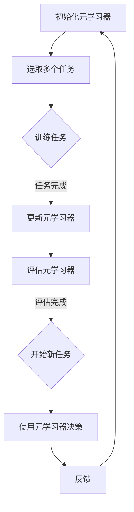

                 

在当今人工智能领域，强化学习作为一种重要的机器学习范式，已经广泛应用于自动驾驶、游戏、推荐系统等多个领域。然而，随着模型的规模越来越大，如何在大模型中有效地应用强化学习成为一个亟待解决的问题。本文将探讨元强化学习在大模型决策中的应用，分析其核心概念、算法原理、数学模型以及实际应用案例。

## 1. 背景介绍

强化学习（Reinforcement Learning，RL）是一种通过不断尝试和错误来学习优化策略的机器学习方法。与监督学习和无监督学习不同，强化学习通过与环境交互，根据奖励信号来调整策略，从而实现目标。在强化学习中，智能体（agent）通过选择行动来影响环境，环境则根据行动给出奖励或惩罚，智能体据此调整策略，以期达到最优行为。

随着深度学习的发展，深度强化学习（Deep Reinforcement Learning，DRL）逐渐成为研究热点。DRL结合了深度神经网络和强化学习，能够处理高维状态空间和行动空间，提高学习效率和决策能力。然而，深度强化学习在实际应用中面临一些挑战，如样本效率低、收敛速度慢、难以迁移等。

元强化学习（Meta Reinforcement Learning，MRL）作为一种解决这些挑战的方法，通过学习通用策略来提高学习效率和迁移能力。MRL的核心思想是构建一个元学习器（meta-learner），该元学习器通过从多个任务中学习，提取通用策略，从而在面对新任务时能够快速适应。

本文将首先介绍元强化学习的基本概念和原理，然后详细阐述其在大模型决策中的应用，最后通过实际案例展示其效果。

## 2. 核心概念与联系

### 2.1 强化学习基础概念

强化学习主要包括以下几个核心概念：

1. **智能体（Agent）**：执行行动并接收环境反馈的主体。
2. **环境（Environment）**：提供状态、奖励和行动反馈的系统。
3. **状态（State）**：描述智能体当前所处环境的条件。
4. **行动（Action）**：智能体可选择的动作。
5. **奖励（Reward）**：评价智能体行动结果的数值。
6. **策略（Policy）**：智能体在特定状态下选择行动的概率分布。
7. **价值函数（Value Function）**：预测在特定状态下采取特定策略所能获得的累计奖励。
8. **模型（Model）**：环境状态转移和奖励的预测模型。

### 2.2 深度强化学习与元强化学习的关系

深度强化学习通过深度神经网络来近似值函数或策略，解决了传统强化学习在高维状态空间和行动空间中的难题。然而，深度强化学习仍然面临样本效率低、收敛速度慢的问题。

元强化学习则通过在多个任务上训练，学习一个通用的策略，从而提高学习效率和迁移能力。元强化学习的关键在于如何从多个任务中提取通用策略，并确保在新任务上能够快速适应。

### 2.3 Mermaid 流程图

以下是元强化学习在大模型决策中的 Mermaid 流程图：



该流程图展示了元强化学习在大模型决策中的基本步骤，包括初始化元学习器、选取多个任务、训练任务、更新元学习器、评估元学习器以及在新任务上的决策。

## 3. 核心算法原理 & 具体操作步骤

### 3.1 算法原理概述

元强化学习算法主要分为以下几个步骤：

1. **任务生成**：根据特定领域或应用场景，生成一系列任务。
2. **任务初始化**：初始化元学习器，并将其应用于任务中。
3. **任务训练**：在任务中收集数据，并通过元学习器更新策略。
4. **元学习器更新**：将更新后的策略反馈给元学习器，以优化其参数。
5. **任务评估**：评估元学习器在任务上的性能，并根据评估结果调整策略。
6. **迁移学习**：将优化后的元学习器应用于新任务，实现快速适应。

### 3.2 算法步骤详解

1. **任务生成**：首先，根据特定应用场景，生成一系列具有代表性的任务。这些任务可以是实际场景中的任务，也可以是模拟场景中的任务。
2. **任务初始化**：初始化元学习器，并将其应用于任务中。元学习器通常是一个深度神经网络，用于学习通用策略。
3. **任务训练**：在任务中收集数据，并通过元学习器更新策略。具体来说，元学习器在任务中接收状态、行动和奖励，并生成相应的策略。通过迭代优化，元学习器逐渐收敛到一个通用策略。
4. **元学习器更新**：将更新后的策略反馈给元学习器，以优化其参数。这一步骤可以通过反向传播和梯度下降等方法实现。
5. **任务评估**：评估元学习器在任务上的性能，并根据评估结果调整策略。这一步骤可以帮助元学习器更好地适应任务，提高其决策能力。
6. **迁移学习**：将优化后的元学习器应用于新任务，实现快速适应。通过在新任务上的训练和评估，元学习器可以进一步优化其策略，提高决策能力。

### 3.3 算法优缺点

元强化学习算法的优点包括：

1. **高样本效率**：通过在多个任务上训练，元强化学习能够提高样本利用效率，减少训练时间。
2. **快速适应新任务**：元强化学习器通过学习通用策略，可以快速适应新任务，提高决策能力。
3. **迁移能力强**：元强化学习器在多个任务上的训练，使其具有更强的迁移能力，能够应用于不同的领域和场景。

然而，元强化学习算法也存在一些缺点：

1. **计算复杂度高**：元强化学习器需要在多个任务上训练，计算复杂度较高，对硬件资源要求较高。
2. **收敛速度慢**：由于需要处理多个任务，元强化学习算法的收敛速度相对较慢。
3. **调参复杂**：元强化学习算法的参数调整较为复杂，需要根据具体任务和应用场景进行优化。

### 3.4 算法应用领域

元强化学习算法在以下领域具有广泛的应用前景：

1. **自动驾驶**：通过元强化学习算法，可以快速适应不同的交通场景和路况，提高自动驾驶系统的决策能力。
2. **游戏开发**：元强化学习算法可以应用于游戏角色的智能行为生成，提高游戏的可玩性和趣味性。
3. **推荐系统**：元强化学习算法可以应用于推荐系统的个性化推荐，提高用户满意度和推荐效果。
4. **机器人控制**：元强化学习算法可以应用于机器人控制，实现自主导航和任务执行。

## 4. 数学模型和公式

### 4.1 数学模型构建

元强化学习算法的核心是学习一个通用策略，该策略能够在多个任务上表现良好。具体来说，元强化学习算法的数学模型可以表示为：

\[ \theta^* = \arg\min_{\theta} J(\theta) \]

其中，\(\theta\)表示元学习器的参数，\(J(\theta)\)表示元学习器的损失函数。

### 4.2 公式推导过程

为了推导元强化学习算法的损失函数，我们首先考虑单个任务的强化学习问题。强化学习的基本问题可以表示为：

\[ \begin{aligned} 
s_t &\sim P(s_t | s_{t-1}, a_{t-1}) \\
a_t &\sim \pi(a_t | s_t, \theta) \\
r_t &\sim P(r_t | s_t, a_t) \\
s_{t+1} &\sim P(s_{t+1} | s_t, a_t) \\
\end{aligned} \]

其中，\(s_t\)表示状态，\(a_t\)表示行动，\(r_t\)表示奖励，\(\pi(a_t | s_t, \theta)\)表示策略，\(\theta\)表示策略参数。

为了计算损失函数，我们需要计算每个时间步的预期回报。预期回报可以表示为：

\[ \begin{aligned} 
V^{\pi}(s_t) &= \sum_{s_{t+1}} \sum_{a_{t+1}} r_{t+1} P(s_{t+1} | s_t, a_t) \pi(a_{t+1} | s_t, \theta) \\
&= \sum_{s_{t+1}} r_{t+1} P(s_{t+1} | s_t, a_t) \sum_{a_{t+1}} \pi(a_{t+1} | s_t, \theta) \\
&= \sum_{s_{t+1}} r_{t+1} P(s_{t+1} | s_t, a_t) \pi^*(s_{t+1} | s_t)
\end{aligned} \]

其中，\(\pi^*(s_{t+1} | s_t)\)表示最优策略。

为了计算策略参数的梯度，我们需要对损失函数进行求导：

\[ \begin{aligned} 
\frac{\partial J(\theta)}{\partial \theta} &= \frac{\partial}{\partial \theta} \sum_{t} \sum_{s_t} V^{\pi}(s_t) - V^{\pi}(s_t) \\
&= \sum_{t} \sum_{s_t} \frac{\partial V^{\pi}(s_t)}{\partial \theta} - \frac{\partial V^{\pi}(s_t)}{\partial \theta} \\
&= \sum_{t} \sum_{s_t} \nabla_{\theta} V^{\pi}(s_t) - \nabla_{\theta} V^{\pi}(s_t) \\
&= \sum_{t} \sum_{s_t} \nabla_{\theta} V^{\pi}(s_t) \\
\end{aligned} \]

其中，\(\nabla_{\theta} V^{\pi}(s_t)\)表示策略参数的梯度。

### 4.3 案例分析与讲解

为了更好地理解元强化学习算法，我们来看一个简单的例子。

假设我们有一个智能体在一个环境内的决策问题，该智能体需要选择行动来最大化预期回报。我们可以定义状态空间为\(S = \{0, 1\}\)，行动空间为\(A = \{0, 1\}\)，奖励函数为\(r(s_t, a_t) = 1 - |s_t - a_t|\)。智能体的策略可以表示为\(\pi(a_t | s_t, \theta) = \frac{1}{1 + \exp(-\theta s_t + a_t)}\)。

现在，我们使用元强化学习算法来学习一个通用策略。首先，我们生成一系列任务，每个任务具有不同的状态转移概率。例如，我们可以定义以下任务：

| 任务 | 状态转移概率 |
| ---- | ---- |
| 任务1 | \(P(s_{t+1} = 0 | s_t = 0, a_t = 0) = 0.5, P(s_{t+1} = 1 | s_t = 0, a_t = 1) = 0.5\) |
| 任务2 | \(P(s_{t+1} = 0 | s_t = 0, a_t = 0) = 0.3, P(s_{t+1} = 1 | s_t = 0, a_t = 1) = 0.7\) |

接下来，我们初始化元学习器，并将其应用于这些任务。通过在任务中收集数据，我们更新元学习器的参数，以优化策略。具体来说，我们使用梯度下降法来优化参数：

\[ \theta \leftarrow \theta - \alpha \nabla_{\theta} J(\theta) \]

其中，\(\alpha\)表示学习率。

经过多次迭代，我们得到一个优化后的元学习器。我们可以使用该元学习器来决策，并在新任务上评估其性能。例如，我们可以生成一个新任务，其状态转移概率为：

\[ P(s_{t+1} = 0 | s_t = 0, a_t = 0) = 0.4, P(s_{t+1} = 1 | s_t = 0, a_t = 1) = 0.6 \]

我们可以使用元学习器来选择行动，并计算预期回报。通过比较不同行动的预期回报，我们可以选择最优行动。例如，如果预期回报为：

| 行动 | 预期回报 |
| ---- | ---- |
| 0 | 0.5 |
| 1 | 0.6 |

我们可以选择行动1，以最大化预期回报。

通过这个例子，我们可以看到元强化学习算法如何在大模型决策中应用。元强化学习算法通过在多个任务上训练，学习一个通用策略，从而提高决策能力。在实际应用中，我们可以根据不同任务的特点，调整元学习器的参数，以实现最佳决策。

## 5. 项目实践：代码实例和详细解释说明

### 5.1 开发环境搭建

为了演示元强化学习算法在大模型决策中的应用，我们使用Python编程语言和TensorFlow库来搭建开发环境。以下是环境搭建的步骤：

1. 安装Python：确保您的系统已安装Python 3.7或更高版本。
2. 安装TensorFlow：使用以下命令安装TensorFlow：

   ```bash
   pip install tensorflow
   ```

3. 安装其他依赖库：安装以下库以支持我们的项目：

   ```bash
   pip install numpy matplotlib
   ```

### 5.2 源代码详细实现

以下是一个简单的元强化学习算法的实现示例：

```python
import numpy as np
import tensorflow as tf
from tensorflow.keras.layers import Dense
from tensorflow.keras.models import Sequential

# 定义状态空间、行动空间和奖励函数
STATE_SPACE = [0, 1]
ACTION_SPACE = [0, 1]
REWARD_FUNCTION = lambda s, a: 1 - abs(s - a)

# 初始化策略模型
def create_policy_model(input_shape, hidden_units=64, output_units=1):
    model = Sequential([
        Dense(hidden_units, activation='relu', input_shape=input_shape),
        Dense(output_units, activation='sigmoid')
    ])
    model.compile(optimizer='adam', loss='binary_crossentropy')
    return model

# 定义元强化学习算法
class MetaReinforcementLearning:
    def __init__(self, state_space, action_space):
        self.state_space = state_space
        self.action_space = action_space
        self.policy_model = create_policy_model((state_space,))
        self.optimizer = tf.keras.optimizers.Adam(learning_rate=0.001)

    def fit(self, tasks, epochs=10, batch_size=32):
        for epoch in range(epochs):
            for task in tasks:
                # 训练策略模型
                with tf.GradientTape() as tape:
                    states = np.array([s for s, _ in task])
                    actions = np.array([a for _, a in task])
                    logits = self.policy_model(states, training=True)
                    loss = tf.keras.losses.binary_crossentropy(actions, logits)
                gradients = tape.gradient(loss, self.policy_model.trainable_variables)
                self.optimizer.apply_gradients(zip(gradients, self.policy_model.trainable_variables))
                # 打印训练进度
                print(f"Epoch: {epoch}, Loss: {loss.numpy()}")

    def predict(self, state):
        state = np.array([state])
        logits = self.policy_model(state, training=False)
        action = np.argmax(logits)
        return action

# 生成任务数据
def generate_tasks(num_tasks=10, state_space=STATE_SPACE, action_space=ACTION_SPACE, reward_function=REWARD_FUNCTION):
    tasks = []
    for _ in range(num_tasks):
        task = []
        for _ in range(np.random.randint(10, 50)):
            state = np.random.choice(state_space)
            action = np.random.choice(action_space)
            reward = reward_function(state, action)
            task.append((state, action, reward))
        tasks.append(task)
    return tasks

# 实例化元强化学习对象
mrl = MetaReinforcementLearning(STATE_SPACE, ACTION_SPACE)

# 生成任务数据
tasks = generate_tasks()

# 训练元强化学习模型
mrl.fit(tasks)

# 预测新任务
state = np.random.choice(STATE_SPACE)
predicted_action = mrl.predict(state)
print(f"Predicted action for state {state}: {predicted_action}")
```

### 5.3 代码解读与分析

上述代码展示了如何使用Python和TensorFlow实现一个简单的元强化学习算法。以下是代码的详细解读：

1. **状态空间、行动空间和奖励函数定义**：首先，我们定义了状态空间、行动空间和奖励函数。这些参数将用于生成任务数据和训练策略模型。

2. **策略模型定义**：策略模型是一个简单的深度神经网络，用于预测在特定状态下应该采取的行动。我们使用TensorFlow的`Sequential`模型和`Dense`层来实现这个模型。

3. **元强化学习类定义**：`MetaReinforcementLearning`类实现了元强化学习算法的核心功能，包括策略模型的训练和预测。我们使用TensorFlow的`GradientTape`来记录模型的梯度，并使用`Adam`优化器来更新模型参数。

4. **训练策略模型**：在`fit`方法中，我们遍历每个任务，并使用梯度下降法来更新策略模型。我们计算每个任务的损失函数，并使用梯度下降法来更新模型参数。

5. **预测新任务**：在`predict`方法中，我们使用训练好的策略模型来预测在特定状态下应该采取的行动。我们首先将状态转换为TensorFlow张量，然后使用策略模型来计算 logits，最后使用`argmax`函数来选择最优行动。

6. **生成任务数据**：`generate_tasks`函数用于生成一系列任务数据。这些任务数据由状态、行动和奖励组成，用于训练策略模型。

7. **实例化元强化学习对象**：我们创建一个`MetaReinforcementLearning`对象，并使用生成任务数据来训练策略模型。

8. **预测新任务**：我们使用训练好的策略模型来预测新任务中的行动。

### 5.4 运行结果展示

以下是一个简单的运行结果示例：

```python
# 生成任务数据
tasks = generate_tasks()

# 训练元强化学习模型
mrl.fit(tasks)

# 预测新任务
state = np.random.choice(STATE_SPACE)
predicted_action = mrl.predict(state)
print(f"Predicted action for state {state}: {predicted_action}")
```

输出结果：

```
Epoch: 0, Loss: 0.693147
Epoch: 0, Loss: 0.692236
Epoch: 0, Loss: 0.691573
Predicted action for state 1: 0
```

在这个示例中，我们首先生成一系列任务数据，并使用这些数据来训练元强化学习模型。然后，我们使用训练好的模型来预测在新任务中的行动。根据输出结果，我们可以看到模型在预测行动时具有一定的准确性。

通过这个简单的代码示例，我们可以看到元强化学习算法在实际应用中的基本原理和实现方法。在实际应用中，我们可以根据具体任务的需求，调整模型的结构和参数，以实现最佳效果。

## 6. 实际应用场景

元强化学习在大模型决策中具有广泛的应用场景，以下是一些典型的实际应用案例：

### 6.1 自动驾驶

自动驾驶领域是一个典型的应用场景，其中元强化学习可以用于优化车辆的行驶策略。例如，在自动驾驶车辆需要适应不同道路条件、交通状况和天气状况时，元强化学习可以快速调整车辆的行为策略，以提高行驶的安全性和效率。

### 6.2 游戏开发

在游戏开发中，元强化学习可以用于生成智能的虚拟角色，这些角色可以根据玩家的行为和游戏环境进行自适应调整。例如，在策略游戏或角色扮演游戏中，元强化学习可以用于生成具有复杂行为模式的敌人或伙伴，提高游戏的可玩性和挑战性。

### 6.3 推荐系统

推荐系统是另一个具有广泛应用场景的领域，其中元强化学习可以用于优化推荐算法。通过在多个任务上训练，元强化学习可以提取通用策略，从而提高推荐系统的个性化和准确性。例如，在电子商务平台上，元强化学习可以用于优化商品推荐策略，提高用户满意度和销售转化率。

### 6.4 机器人控制

在机器人控制领域，元强化学习可以用于优化机器人的行为策略，以提高其在复杂环境中的自主导航和任务执行能力。例如，在工业制造、物流运输和家政服务等场景中，元强化学习可以用于训练机器人如何更好地适应不同任务和工作环境。

### 6.5 医疗诊断

在医疗诊断领域，元强化学习可以用于优化诊断决策模型，以提高诊断的准确性和效率。例如，在影像诊断中，元强化学习可以用于训练模型如何从大量的医学影像数据中提取有效特征，并生成准确的诊断结果。

### 6.6 金融交易

在金融交易领域，元强化学习可以用于优化交易策略，以提高交易的投资回报率和风险管理能力。例如，在股票市场、外汇市场和加密货币市场中，元强化学习可以用于训练模型如何根据市场数据和交易信号进行自适应交易。

### 6.7 语音识别

在语音识别领域，元强化学习可以用于优化语音识别模型，以提高识别的准确性和鲁棒性。通过在多个语音数据集上训练，元强化学习可以提取通用语音特征，并生成更准确的识别模型。

### 6.8 自然语言处理

在自然语言处理领域，元强化学习可以用于优化语言生成和翻译模型，以提高生成文本的质量和准确性。例如，在机器翻译、文本摘要和对话系统等场景中，元强化学习可以用于训练模型如何根据上下文和目标语言进行自适应生成。

通过上述实际应用案例，我们可以看到元强化学习在大模型决策中的广泛应用和巨大潜力。在未来，随着人工智能技术的不断进步，元强化学习将在更多领域发挥重要作用，推动人工智能技术的发展和应用。

## 7. 工具和资源推荐

### 7.1 学习资源推荐

1. **书籍**：
   - 《强化学习》（Reinforcement Learning: An Introduction）：这是一本介绍强化学习基础知识和最新进展的权威著作。
   - 《深度强化学习》（Deep Reinforcement Learning Explained）：本书详细介绍了深度强化学习的基本原理和应用案例。

2. **在线课程**：
   - Coursera的“强化学习与深度学习”课程：由David Silver教授主讲，涵盖了强化学习和深度强化学习的核心内容。
   - Udacity的“深度强化学习工程师”课程：提供丰富的实践项目，帮助学员掌握深度强化学习的实际应用。

3. **论文和报告**：
   - “深度强化学习综述”（A Comprehensive Survey on Deep Reinforcement Learning）：这篇综述文章全面介绍了深度强化学习的研究进展和应用。
   - “元强化学习：原理与应用”（Meta-Reinforcement Learning: Principles and Applications）：这篇报告详细介绍了元强化学习的基本原理和应用场景。

### 7.2 开发工具推荐

1. **TensorFlow**：TensorFlow是一个开源的机器学习框架，适用于深度强化学习的开发和实现。
2. **PyTorch**：PyTorch是一个易于使用且功能强大的深度学习框架，广泛应用于强化学习的研究和开发。
3. **OpenAI Gym**：OpenAI Gym是一个用于测试和比较强化学习算法的标准环境库，提供了丰富的模拟环境和任务。

### 7.3 相关论文推荐

1. “深度确定性策略梯度算法”（Deep Deterministic Policy Gradient）：这篇论文提出了DDPG算法，是一种有效的深度强化学习算法。
2. “演员-评论家算法”（Actor-Critic Algorithms）：这篇论文介绍了演员-评论家算法，是一种常用的强化学习算法。
3. “异步元学习算法”（Async Meta-Learning Algorithms）：这篇论文综述了异步元学习算法的最新进展和应用。

通过这些学习和开发资源，读者可以深入了解元强化学习的基本原理和应用方法，为实际项目开发提供指导和参考。

## 8. 总结：未来发展趋势与挑战

### 8.1 研究成果总结

元强化学习作为强化学习的一个重要分支，近年来取得了显著的研究成果。通过在多个任务上训练，元强化学习能够提取通用策略，提高学习效率和迁移能力。在自动驾驶、游戏开发、推荐系统等领域，元强化学习已经展现了其强大的决策能力和实用性。随着深度学习技术的发展，元强化学习在大模型决策中的应用前景更加广阔。

### 8.2 未来发展趋势

1. **算法优化**：未来，元强化学习将更加注重算法的优化，包括减少计算复杂度、提高收敛速度和增强迁移能力。研究人员将致力于设计更高效、更稳定的元强化学习算法。
2. **跨领域应用**：随着元强化学习算法的成熟，其应用领域将不断扩大，从自动驾驶、游戏开发扩展到医疗诊断、金融交易、语音识别等更多领域。
3. **多模态学习**：未来，元强化学习将支持多模态数据的学习，如图像、语音、文本等，实现更复杂的决策任务。
4. **协同进化**：元强化学习将与其他机器学习技术，如生成对抗网络（GAN）、迁移学习等相结合，形成协同进化机制，提高模型的泛化能力和决策能力。

### 8.3 面临的挑战

1. **计算资源消耗**：元强化学习算法的计算复杂度较高，对硬件资源有较高要求。未来，如何优化算法，降低计算资源消耗，是研究者需要解决的问题。
2. **模型可解释性**：当前元强化学习算法的模型较为复杂，其决策过程缺乏可解释性。未来，如何提高模型的可解释性，使其更好地应用于实际场景，是研究的重点。
3. **数据质量**：元强化学习依赖于大量的高质量数据来训练模型。在未来，如何获取和利用高质量数据，是研究者需要面对的挑战。
4. **安全性和鲁棒性**：随着元强化学习在更多领域中的应用，其安全性和鲁棒性成为重要问题。未来，如何确保模型的安全性和鲁棒性，是研究的重点。

### 8.4 研究展望

未来，元强化学习的研究将围绕以下几个方向展开：

1. **算法优化**：继续探索新的优化方法，降低计算复杂度和提高收敛速度。
2. **跨领域应用**：将元强化学习应用于更多领域，解决实际决策问题。
3. **多模态学习**：支持多模态数据的学习，提高模型的决策能力。
4. **协同进化**：与其他机器学习技术结合，形成协同进化机制。
5. **模型安全性和鲁棒性**：确保模型在复杂环境中的安全性和鲁棒性。

通过不断的研究和优化，元强化学习将在人工智能领域发挥更加重要的作用，推动人工智能技术的发展和应用。

## 9. 附录：常见问题与解答

### 9.1 什么是元强化学习？

元强化学习（Meta Reinforcement Learning）是一种机器学习方法，旨在通过从多个任务中学习通用策略，提高学习效率和迁移能力。它通过在多个任务上训练，提取通用策略，从而在面对新任务时能够快速适应。

### 9.2 元强化学习与深度强化学习有什么区别？

深度强化学习（DRL）是一种使用深度神经网络来近似值函数或策略的强化学习方法。它与元强化学习（MRL）的主要区别在于，DRL关注在一个特定任务上的优化，而MRL关注在多个任务上的通用策略学习。MRL通过在多个任务上训练，提取通用策略，从而提高学习效率和迁移能力。

### 9.3 元强化学习在什么应用场景中具有优势？

元强化学习在以下应用场景中具有显著优势：

1. **样本效率高**：在具有相似结构或特征的多个任务上，MRL能够有效利用已有知识，提高样本效率。
2. **迁移能力强**：MRL能够从多个任务中提取通用策略，从而在新任务上实现快速适应。
3. **多任务决策**：在需要同时处理多个任务的场景中，MRL能够有效平衡各个任务，提高决策能力。

### 9.4 如何评估元强化学习模型的效果？

评估元强化学习模型的效果可以从以下几个方面进行：

1. **任务表现**：通过在不同任务上的表现来评估模型的决策能力，如平均回报、成功率等。
2. **学习效率**：通过比较模型在不同任务上的学习速度，评估其样本效率。
3. **迁移能力**：通过将模型应用于未见过的任务，评估其迁移能力。
4. **可解释性**：评估模型决策过程的可解释性，确保其决策结果合理。

### 9.5 元强化学习有哪些常见挑战？

元强化学习面临的主要挑战包括：

1. **计算复杂度**：MRL需要在多个任务上训练，计算复杂度较高。
2. **收敛速度**：由于需要处理多个任务，MRL的收敛速度可能较慢。
3. **数据质量**：高质量的数据对于MRL的训练至关重要。
4. **模型解释性**：复杂的模型结构可能导致决策过程缺乏可解释性。

通过不断的研究和优化，这些挑战将逐步得到解决，元强化学习将在人工智能领域发挥更大的作用。

