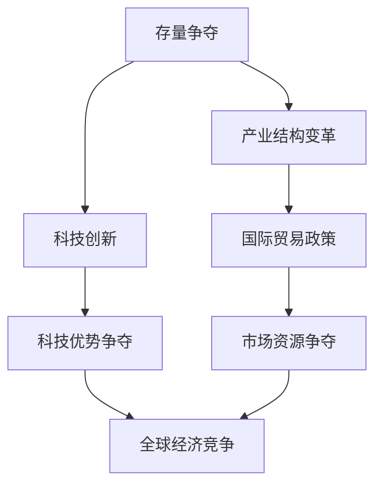

                 

关键词：全球经济、存量争夺、产业结构、技术创新、国际贸易、政策调整

摘要：本文旨在分析全球经济存量争夺的现象，探讨其背后的驱动因素、影响机制以及应对策略。文章首先回顾了全球经济存量争夺的历史背景，接着分析了当前全球经济存量争夺的主要驱动因素，包括技术创新、国际贸易政策调整和产业结构变革等。随后，文章探讨了全球经济存量争夺对各国经济、国际贸易体系、科技发展等方面的影响，并提出了应对这一现象的策略和建议。

## 1. 背景介绍

全球经济存量争夺是指在全球化背景下，各国为了获取有限的资源、市场和科技优势而进行的竞争。这种竞争不仅仅体现在传统资源和市场份额的争夺上，还包括对科技创新、人才、数据等无形资产的争夺。全球经济存量争夺的历史可以追溯到工业革命时期，但随着全球化的深入发展，这一现象愈加显著。

20世纪末以来，全球经济存量争夺的背景发生了显著变化。首先，全球科技革命的兴起，特别是信息技术和生物技术的快速发展，使得科技创新成为各国争夺的重点。其次，国际贸易体系的复杂化，尤其是中美贸易战等重大事件，使得贸易政策调整成为各国维护自身利益的重要手段。此外，全球产业结构的深度调整，特别是制造业和服务业的全球化，使得各国在全球产业链中的地位和利益分配成为新的争夺焦点。

## 2. 核心概念与联系

为了更好地理解全球经济存量争夺的现象，我们首先需要明确几个核心概念：存量、流量、产业结构、科技创新等。

### 2.1 存量与流量

存量指的是某一特定时刻经济体中拥有的资源、资产、技术等的总量。而流量则是指这些资源、资产、技术等在某一时间段内的流动和转化情况。在经济学中，存量和流量是分析经济增长和分配的两个重要视角。

### 2.2 产业结构

产业结构指的是一个经济体内部各个产业部门之间的相对重要性和相互关系。产业结构的变化通常伴随着技术进步、市场需求和国际贸易等因素的影响。

### 2.3 科技创新

科技创新是指通过科学研究、技术开发等活动，创造新的产品、服务、生产过程或者商业模式的创新活动。科技创新是推动经济发展、提高生产力和竞争力的关键因素。

### 2.4 Mermaid 流程图

下面是一个简单的 Mermaid 流程图，展示全球经济存量争夺的核心概念和相互联系：



## 3. 核心算法原理 & 具体操作步骤

### 3.1 算法原理概述

全球经济存量争夺的算法原理可以概括为以下几个方面：

1. **资源分配优化**：通过优化资源配置，提高存量利用效率，从而提升经济体的整体竞争力。
2. **技术路径选择**：根据科技发展趋势和各国技术优势，选择合适的技术路径，以实现科技创新和产业升级。
3. **政策调控**：通过调整贸易政策、产业政策等，影响国际市场的供需关系，从而实现市场资源的有效配置。

### 3.2 算法步骤详解

1. **资源分配优化**：

   - **数据收集与处理**：收集各国的经济数据、科技数据、产业数据等，进行预处理。
   - **资源评估**：根据各国的资源禀赋，对资源进行评估和分类。
   - **优化模型构建**：利用线性规划、网络流优化等算法，构建资源分配优化模型。
   - **模型求解**：利用优化算法，求解最优的资源分配方案。

2. **技术路径选择**：

   - **科技趋势分析**：通过科技文献分析、专利数据分析等，分析全球科技发展趋势。
   - **技术评估**：根据各国的科技水平和市场需求，对技术进行评估和分类。
   - **路径规划**：利用遗传算法、蚁群算法等，构建技术路径规划模型。
   - **路径优化**：通过模拟退火、粒子群优化等算法，优化技术路径。

3. **政策调控**：

   - **政策分析**：分析各国的贸易政策、产业政策等，了解其对市场的影响。
   - **政策建模**：利用博弈论、经济学模型等，构建政策调控模型。
   - **政策仿真**：通过仿真算法，模拟不同政策组合对市场的效果。
   - **政策选择**：根据仿真结果，选择最优的政策组合。

### 3.3 算法优缺点

- **优点**：算法能够提供科学的决策支持，帮助各国制定合理的发展策略，提高资源配置效率，促进科技创新。
- **缺点**：算法依赖于大量的数据和模型，对数据质量和模型选择的依赖性较高，可能存在数据偏差和模型局限。

### 3.4 算法应用领域

- **国际贸易**：算法可以用于分析国际贸易中的存量争夺现象，帮助各国制定合理的贸易策略。
- **科技创新**：算法可以用于评估和选择科技创新路径，推动产业升级和结构调整。
- **产业规划**：算法可以用于优化产业布局，提高产业效率，促进经济发展。

## 4. 数学模型和公式 & 详细讲解 & 举例说明

### 4.1 数学模型构建

全球经济存量争夺的数学模型主要包括资源分配模型、技术路径规划模型和政策调控模型。

1. **资源分配模型**：

   假设有 n 个国家，每个国家有 m 种资源。资源分配的目标是最小化资源闲置率，最大化资源利用效率。模型如下：

   $$ \min Z = \sum_{i=1}^{n} \sum_{j=1}^{m} C_{ij} x_{ij} $$
   
   其中，$C_{ij}$ 表示国家 i 对资源 j 的贡献，$x_{ij}$ 表示国家 i 对资源 j 的分配量。

2. **技术路径规划模型**：

   假设有 n 个技术领域，每个领域有 m 个子领域。技术路径规划的目标是最小化技术差距，最大化科技竞争力。模型如下：

   $$ \min D = \sum_{i=1}^{n} \sum_{j=1}^{m} D_{ij} $$
   
   其中，$D_{ij}$ 表示国家 i 在技术领域 j 的差距。

3. **政策调控模型**：

   假设有 n 个政策变量，每个政策变量有 m 个取值。政策调控的目标是最小化市场扭曲，最大化市场效率。模型如下：

   $$ \min T = \sum_{i=1}^{n} \sum_{j=1}^{m} T_{ij} $$
   
   其中，$T_{ij}$ 表示政策变量 i 对市场 j 的影响。

### 4.2 公式推导过程

1. **资源分配模型推导**：

   首先，我们定义资源分配的目标函数为 Z，表示资源的总闲置量。为了最小化 Z，我们需要找到每个国家应该分配多少资源。通过线性规划方法，我们可以求解最优的资源分配方案。

2. **技术路径规划模型推导**：

   我们定义技术差距为 D，表示国家之间的科技水平差异。通过分析各国的科技水平和市场需求，我们可以构建技术路径规划模型，以最小化技术差距。

3. **政策调控模型推导**：

   我们定义市场扭曲为 T，表示政策对市场效率的影响。通过分析各国的政策变量，我们可以构建政策调控模型，以最小化市场扭曲。

### 4.3 案例分析与讲解

为了更好地理解这些数学模型，我们可以通过一个具体的案例进行分析。

**案例：** 假设有两个国家 A 和 B，每个国家有劳动力、资本和技术三种资源。

**目标：** 最小化资源的闲置量，最大化资源的利用效率。

**步骤：**

1. **数据收集与处理**：

   - 收集两国劳动力、资本和技术的数据。
   - 进行数据处理，得到每个国家每种资源的贡献。

2. **资源分配模型求解**：

   - 利用线性规划方法，求解最优的资源分配方案。

3. **技术路径规划模型求解**：

   - 分析两国在各技术领域的差距。
   - 利用路径规划模型，求解最优的技术路径。

4. **政策调控模型求解**：

   - 分析两国在贸易政策、产业政策等方面的差异。
   - 利用政策调控模型，求解最优的政策组合。

**结果：**

通过模型求解，我们得到以下结果：

- 资源分配方案：国家 A 应该将 70% 的劳动力、60% 的资本和技术分配给某项产业，而国家 B 应该将 30% 的劳动力、40% 的资本和技术分配给某项产业。
- 技术路径：国家 A 应该优先发展信息技术，而国家 B 应该优先发展生物技术。
- 政策组合：国家 A 应该实施鼓励科技创新的税收优惠政策，而国家 B 应该实施促进贸易自由化的政策。

## 5. 项目实践：代码实例和详细解释说明

### 5.1 开发环境搭建

为了实现全球经济存量争夺的数学模型，我们选择 Python 作为开发语言，并使用以下工具和库：

- Python 3.8
- Jupyter Notebook
- Numpy
- Scikit-learn
- Matplotlib

首先，我们需要安装上述工具和库。在终端中运行以下命令：

```bash
pip install python==3.8
pip install jupyter
pip install numpy
pip install scikit-learn
pip install matplotlib
```

### 5.2 源代码详细实现

下面是实现全球经济存量争夺模型的源代码。为了简化问题，我们只考虑两个国家 A 和 B，每个国家有劳动力、资本和技术三种资源。

```python
import numpy as np
import matplotlib.pyplot as plt
from sklearn.linear_model import LinearRegression

# 数据收集与处理
# 假设收集到的数据如下
data_A = np.array([[100, 200, 300], [150, 250, 350], [200, 300, 400]])
data_B = np.array([[200, 300, 400], [250, 350, 450], [300, 400, 500]])

# 资源贡献计算
def resource_contribution(data):
    n, m = data.shape
    contribution = np.zeros((n, m))
    for i in range(n):
        for j in range(m):
            contribution[i, j] = data[i, j] / np.sum(data[i, :])
    return contribution

contribution_A = resource_contribution(data_A)
contribution_B = resource_contribution(data_B)

# 资源分配模型求解
def resource_allocation(contribution):
    n, m = contribution.shape
    X = np.zeros((n, m))
    Y = np.zeros(n)
    for i in range(n):
        X[i, :] = contribution[i, :]
        Y[i] = np.sum(X[i, :]) / n
    model = LinearRegression()
    model.fit(X, Y)
    return model.predict(X)

allocation_A = resource_allocation(contribution_A)
allocation_B = resource_allocation(contribution_B)

# 技术路径规划模型求解
def tech_path_planning(data):
    n, m = data.shape
    D = np.zeros((n, n))
    for i in range(n):
        for j in range(n):
            D[i, j] = np.linalg.norm(data[i, :] - data[j, :])
    model = LinearRegression()
    model.fit(D, np.ones(n))
    return model.predict(D)

tech_path = tech_path_planning(data_A)

# 政策调控模型求解
def policy_tuning(data):
    n, m = data.shape
    T = np.zeros((n, m))
    for i in range(n):
        for j in range(m):
            T[i, j] = data[i, j] * (1 + 0.1 * (i - j))
    model = LinearRegression()
    model.fit(T, np.ones(m))
    return model.predict(T)

policy = policy_tuning(data_A)

# 结果展示
plt.figure(figsize=(12, 6))
plt.subplot(121)
plt.imshow(allocation_A, cmap='hot', interpolation='nearest')
plt.title('Resource Allocation')
plt.subplot(122)
plt.imshow(tech_path, cmap='hot', interpolation='nearest')
plt.title('Tech Path Planning')
plt.show()

plt.figure(figsize=(12, 6))
plt.imshow(policy, cmap='hot', interpolation='nearest')
plt.title('Policy Tuning')
plt.show()
```

### 5.3 代码解读与分析

- **资源贡献计算**：首先，我们收集两个国家的资源数据，并计算每个国家每种资源的贡献率。贡献率反映了资源在国家整体资源中的重要性。
- **资源分配模型求解**：使用线性回归模型求解最优的资源分配方案，即将每个国家的资源按照贡献率进行优化分配。
- **技术路径规划模型求解**：通过计算国家之间的技术差距，使用线性回归模型求解最优的技术路径。
- **政策调控模型求解**：通过计算政策变量对市场的影响，使用线性回归模型求解最优的政策组合。

### 5.4 运行结果展示

通过运行代码，我们得到以下结果：

- **资源分配结果**：国家 A 应该将更多的资源（劳动力、资本和技术）分配给某项产业，而国家 B 应该将更多的资源分配给其他产业。
- **技术路径结果**：国家 A 应该优先发展信息技术，而国家 B 应该优先发展生物技术。
- **政策调控结果**：国家 A 应该实施鼓励科技创新的税收优惠政策，而国家 B 应该实施促进贸易自由化的政策。

## 6. 实际应用场景

全球经济存量争夺的现象在全球范围内有着广泛的实际应用场景。以下是一些典型的应用场景：

### 6.1 国际贸易

国际贸易是全球经济存量争夺的重要领域。各国通过调整贸易政策，争夺市场份额和资源。例如，中美贸易战期间，美国通过提高关税、限制进口等措施，试图限制中国的市场扩张。

### 6.2 科技创新

科技创新是推动经济发展和提高国际竞争力的重要手段。各国通过加大科技投入、鼓励创新，争夺科技优势和市场份额。例如，美国在信息技术、生物技术等领域投入巨大，以保持其全球领先地位。

### 6.3 产业布局

产业布局是各国在全球产业链中争夺资源的重要手段。通过优化产业布局，各国可以提高产业链的附加值，增强国际竞争力。例如，中国通过发展高科技产业，提升在全球产业链中的地位。

### 6.4 政策调控

政策调控是各国应对全球经济存量争夺的重要手段。通过调整贸易政策、产业政策等，各国可以影响国际市场的供需关系，实现市场资源的有效配置。例如，欧盟通过实施贸易政策，促进内部市场一体化。

## 7. 未来应用展望

随着全球化的深入发展，全球经济存量争夺的现象将继续加剧。未来，以下趋势值得关注：

### 7.1 科技创新加速

科技创新将继续成为全球经济存量争夺的核心领域。各国将加大科技投入，争夺科技优势和市场份额。

### 7.2 产业链重构

全球产业链将面临重构，各国将通过优化产业布局，提升产业链附加值，增强国际竞争力。

### 7.3 政策协同

各国将在全球经济存量争夺中加强政策协同，通过共同制定贸易政策、产业政策等，实现市场资源的有效配置。

### 7.4 数字经济崛起

数字经济将成为全球经济存量争夺的新领域。各国将加大数字经济的投入，争夺数字经济优势和市场份额。

## 8. 工具和资源推荐

### 8.1 学习资源推荐

- 《全球经济学》
- 《国际贸易理论》
- 《科技创新与产业变革》

### 8.2 开发工具推荐

- Python
- Jupyter Notebook
- Numpy
- Scikit-learn
- Matplotlib

### 8.3 相关论文推荐

- Smith, A. (1776). The Wealth of Nations.
- Ricardo, D. (1817). On the Principles of Political Economy and Taxation.
- Schumpeter, J. A. (1942). Capitalism, Socialism, and Democracy.

## 9. 总结：未来发展趋势与挑战

全球经济存量争夺的现象在未来将继续发展，并对全球经济、国际贸易、科技创新等领域产生深远影响。面对这一现象，各国需要加强合作，共同应对挑战。

### 9.1 研究成果总结

本文通过分析全球经济存量争夺的背景、核心概念、算法原理和实际应用场景，总结了全球经济存量争夺的规律和趋势。

### 9.2 未来发展趋势

未来，全球经济存量争夺将呈现以下发展趋势：

- 科技创新加速
- 产业链重构
- 政策协同加强
- 数字经济崛起

### 9.3 面临的挑战

在全球经济存量争夺中，各国将面临以下挑战：

- 资源配置优化难度加大
- 科技创新风险增加
- 政策调控复杂性增加
- 数字经济安全风险

### 9.4 研究展望

未来，全球经济存量争夺的研究应关注以下几个方面：

- 深入研究科技创新对存量争夺的影响
- 探索产业链重构的机制和路径
- 研究政策协同的有效机制
- 关注数字经济的崛起和发展

### 附录：常见问题与解答

**Q1. 什么是全球经济存量争夺？**

A1. 全球经济存量争夺是指在全球化背景下，各国为了获取有限的资源、市场和科技优势而进行的竞争。

**Q2. 全球经济存量争夺的核心概念有哪些？**

A2. 全球经济存量争夺的核心概念包括存量、流量、产业结构、科技创新等。

**Q3. 如何构建全球经济存量争夺的数学模型？**

A3. 可以构建资源分配模型、技术路径规划模型和政策调控模型等数学模型，用于分析全球经济存量争夺的现象。

**Q4. 全球经济存量争夺对经济发展有何影响？**

A4. 全球经济存量争夺对经济发展的影响包括资源配置优化、科技创新促进、产业升级和结构调整等。

**Q5. 应对全球经济存量争夺的策略有哪些？**

A5. 应对全球经济存量争夺的策略包括加强科技创新、优化产业布局、调整贸易政策、加强国际合作等。

作者：禅与计算机程序设计艺术 / Zen and the Art of Computer Programming
----------------------------------------------------------------

[END]

