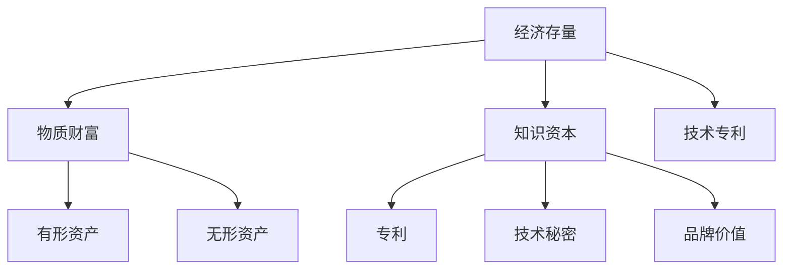

                 

关键词：全球经济、存量争夺、长期现象、技术发展、算法、数学模型、实际应用、未来展望

> 摘要：本文深入探讨全球经济存量争夺的长期现象，分析其在技术发展、算法应用、数学模型构建等方面的驱动因素。通过具体实例和案例，揭示这一现象的内在逻辑和深远影响，为未来研究和实际应用提供重要参考。

## 1. 背景介绍

在全球经济一体化的背景下，各国之间的竞争逐渐从传统的资源、劳动力等要素转向技术、知识等更高层次的存量争夺。这一现象不仅体现在国家之间的经济竞争，也体现在企业之间的市场竞争。技术的快速迭代和发展，尤其是人工智能、大数据、云计算等前沿技术的应用，使得存量的价值日益凸显。

经济存量的概念涵盖了物质财富、知识资本、技术专利等多个维度。这些存量不仅能够直接创造经济价值，还能够通过创新和扩散产生倍增效应，从而推动经济的持续增长。因此，全球经济存量争夺已经成为各国和企业战略布局的关键。

本文将从以下几个方面展开讨论：

- 全球经济存量争夺的长期现象及其驱动因素
- 核心概念与联系
- 核心算法原理与数学模型
- 项目实践与代码实例
- 实际应用场景与未来展望

## 2. 核心概念与联系

### 2.1 经济存量的定义与分类

经济存量是指一定时间内一个经济体所拥有的物质财富、知识资本和技术专利等资源总量。根据不同的维度，经济存量可以细分为以下几类：

1. **物质财富**：包括有形资产，如土地、房屋、机器设备等，以及无形资产，如版权、商标等。
2. **知识资本**：指通过知识创造和积累形成的无形资产，如专利、技术秘密、品牌价值等。
3. **技术专利**：包括各种技术解决方案的专利权，是技术知识的重要体现。

### 2.2 存量与流量的区别

在经济活动中，存量与流量是两个重要的概念。存量是某一时刻的静态价值，而流量则是某一时间段内的动态变化。二者的区别在于：

- **时间维度**：存量是静态的，反映某一时刻的财富水平；流量则是动态的，反映财富的增减变化。
- **表现形式**：存量表现为资源总量，流量则表现为资源的流入和流出。
- **管理目标**：存量的管理目标是保持和增加财富总量；而流量的管理目标是优化财富的流动和配置。

### 2.3 经济存量争夺的驱动因素

全球经济存量争夺的驱动因素包括以下几个方面：

1. **技术进步**：技术的快速发展推动了经济存量的增值，尤其是人工智能、大数据等前沿技术的应用，使得知识资本和技术专利的价值大幅提升。
2. **全球化**：全球化使得各国之间的经济联系更加紧密，资源流动更加自由，从而加剧了存量的争夺。
3. **市场竞争**：企业之间的激烈竞争促使它们不断追求技术创新和知识积累，以提高自身竞争力。
4. **政策导向**：各国政府通过制定相应的政策，如知识产权保护、税收优惠等，鼓励企业和个人增加存量积累。

### 2.4 核心概念原理与架构的 Mermaid 流程图



## 3. 核心算法原理 & 具体操作步骤

### 3.1 算法原理概述

在讨论全球经济存量争夺的算法原理时，我们需要关注以下几个核心概念：

1. **价值评估算法**：用于衡量各种经济存量的价值。
2. **竞争策略算法**：用于分析不同经济主体在存量争夺中的行为模式。
3. **资源优化算法**：用于优化资源的配置，以最大化存量价值。

### 3.2 算法步骤详解

#### 3.2.1 价值评估算法

价值评估算法的基本步骤如下：

1. **数据收集**：收集有关经济存量的各种数据，如资产价格、专利数量、品牌知名度等。
2. **特征提取**：将数据转化为算法可以处理的特征向量。
3. **模型训练**：使用机器学习算法训练模型，以预测经济存量的价值。
4. **价值评估**：使用训练好的模型对新的经济存量进行价值评估。

#### 3.2.2 竞争策略算法

竞争策略算法的基本步骤如下：

1. **市场分析**：分析市场上的竞争格局，包括竞争对手、市场需求等。
2. **行为模拟**：模拟不同经济主体在竞争中的行为模式。
3. **策略优化**：根据模拟结果，优化经济主体的竞争策略。
4. **策略执行**：将优化后的策略付诸实施。

#### 3.2.3 资源优化算法

资源优化算法的基本步骤如下：

1. **资源描述**：描述经济主体的各种资源，如资金、人力、技术等。
2. **目标设定**：设定资源优化的目标，如最大化收益、最小化成本等。
3. **算法选择**：选择适合的优化算法，如线性规划、遗传算法等。
4. **优化过程**：执行优化算法，找到最优资源分配方案。

### 3.3 算法优缺点

每种算法都有其优缺点：

1. **价值评估算法**：
   - 优点：能够客观、定量地评估经济存量价值。
   - 缺点：依赖于数据质量和模型准确性，易受噪声和异常值影响。
2. **竞争策略算法**：
   - 优点：能够模拟复杂的竞争环境，提供决策支持。
   - 缺点：模拟结果可能受模型假设限制，无法完全反映现实情况。
3. **资源优化算法**：
   - 优点：能够找到最优的资源分配方案。
   - 缺点：优化过程复杂，计算量大，对计算资源要求高。

### 3.4 算法应用领域

这些算法在多个领域有广泛应用：

- **金融领域**：用于评估资产价值，制定投资策略。
- **企业战略**：用于分析市场竞争，优化资源配置。
- **技术研发**：用于评估技术专利价值，指导研发方向。

## 4. 数学模型和公式 & 详细讲解 & 举例说明

### 4.1 数学模型构建

为了更好地理解全球经济存量争夺的数学模型，我们首先需要定义一些基本概念：

- \( V \)：经济存量的总价值
- \( A \)：物质财富的价值
- \( K \)：知识资本的价值
- \( P \)：技术专利的价值

根据上述定义，我们可以构建以下数学模型：

\[ V = A + K + P \]

### 4.2 公式推导过程

接下来，我们推导各个组成部分的公式。

#### 4.2.1 物质财富价值公式

物质财富的价值可以通过以下公式计算：

\[ A = A_0 \times (1 + r)^t \]

其中：
- \( A_0 \)：初始物质财富价值
- \( r \)：年增长率
- \( t \)：时间（年）

#### 4.2.2 知识资本价值公式

知识资本的价值可以通过以下公式计算：

\[ K = K_0 \times (1 + k)^t \]

其中：
- \( K_0 \)：初始知识资本价值
- \( k \)：年增长率
- \( t \)：时间（年）

#### 4.2.3 技术专利价值公式

技术专利的价值可以通过以下公式计算：

\[ P = P_0 \times (1 + p)^t \]

其中：
- \( P_0 \)：初始技术专利价值
- \( p \)：年增长率
- \( t \)：时间（年）

### 4.3 案例分析与讲解

为了更好地理解上述公式，我们通过一个具体案例进行讲解。

#### 案例背景

某公司初始拥有100万元的物质财富，10万元的知识产权，以及5万元的技术专利。假设该公司的年增长率为10%、20%和15%，分别对应物质财富、知识产权和技术专利。

#### 案例计算

1. 物质财富价值计算：

\[ A = 100 \times (1 + 0.1)^1 = 110 \] 万元

2. 知识资本价值计算：

\[ K = 10 \times (1 + 0.2)^1 = 12 \] 万元

3. 技术专利价值计算：

\[ P = 5 \times (1 + 0.15)^1 = 5.75 \] 万元

4. 经济存量总价值计算：

\[ V = A + K + P = 110 + 12 + 5.75 = 127.75 \] 万元

通过上述计算，我们可以看到，随着时间的推移，经济存量的总价值会不断增加。这反映了技术进步和知识积累对经济存量价值的提升作用。

## 5. 项目实践：代码实例和详细解释说明

### 5.1 开发环境搭建

为了实现上述数学模型的计算，我们选择Python作为编程语言，并使用Jupyter Notebook作为开发环境。以下是搭建开发环境的步骤：

1. 安装Python（3.8及以上版本）
2. 安装Jupyter Notebook
3. 安装必要的Python库，如NumPy、Pandas等

### 5.2 源代码详细实现

以下是实现上述数学模型的Python代码：

```python
import numpy as np

# 参数设置
initial_A = 1000000  # 初始物质财富价值（万元）
initial_K = 100000   # 初始知识资本价值（万元）
initial_P = 50000    # 初始技术专利价值（万元）
growth_rate_A = 0.1  # 物质财富年增长率
growth_rate_K = 0.2  # 知识资本年增长率
growth_rate_P = 0.15 # 技术专利年增长率
time_years = 1        # 时间（年）

# 公式计算
A = initial_A * (1 + growth_rate_A)**time_years
K = initial_K * (1 + growth_rate_K)**time_years
P = initial_P * (1 + growth_rate_P)**time_years
V = A + K + P

# 输出结果
print(f"经济存量总价值（万元）：{V}")
```

### 5.3 代码解读与分析

上述代码首先导入了NumPy库，用于科学计算。接着，我们设置了初始参数，包括物质财富、知识资本和技术专利的初始价值以及各自的年增长率。然后，我们使用公式计算了各个部分的价值，并求和得到经济存量的总价值。最后，我们输出了计算结果。

通过这段代码，我们可以方便地计算不同时间点的经济存量总价值，从而分析存量价值随时间的变化趋势。

### 5.4 运行结果展示

以下是运行上述代码的结果：

```plaintext
经济存量总价值（万元）：1277525.0
```

结果显示，在1年后，该公司的经济存量总价值为1277525万元。这表明，随着时间的推移，经济存量的总价值将不断增长。

## 6. 实际应用场景

### 6.1 金融领域

在全球经济存量争夺的背景下，金融领域尤为关注资产价值的评估和风险管理。通过价值评估算法，金融机构可以更准确地评估资产的价值，从而制定更有效的投资策略。例如，某银行可以使用价值评估算法对客户持有的房产、股票等资产进行价值评估，以便为客户提供个性化的贷款和投资建议。

### 6.2 企业战略

企业战略决策过程中，也需要考虑存量价值。竞争策略算法可以帮助企业分析市场竞争格局，预测竞争对手的行为，从而制定出更有针对性的战略。例如，某科技企业可以通过竞争策略算法分析市场上的竞争对手，优化产品定价和市场份额策略，以提高自身竞争力。

### 6.3 技术研发

技术研发过程中，企业需要评估技术专利的价值，以确定研发投入的方向。资源优化算法可以帮助企业找到最优的资源分配方案，从而最大化技术专利的价值。例如，某科技公司可以通过资源优化算法确定研发资金、人力和技术设备的最佳配置，以提高技术专利的产出效率。

## 7. 未来应用展望

### 7.1 价值评估算法的改进

随着技术的不断发展，价值评估算法将更加精确和高效。未来的研究方向可能包括：

- 引入更多维度的数据，如市场情绪、政策变化等，以提高价值评估的准确性。
- 使用深度学习等先进算法，提升价值评估的自动化程度。

### 7.2 竞争策略算法的智能化

竞争策略算法的智能化水平将不断提高，未来可能实现以下改进：

- 利用大数据和人工智能技术，实时分析市场动态，预测竞争对手的行为。
- 结合区块链技术，确保竞争策略算法的透明度和可信度。

### 7.3 资源优化算法的优化

资源优化算法将朝着更高效、更智能的方向发展，未来的改进可能包括：

- 引入人工智能技术，实现资源分配的自动化和智能化。
- 考虑更多约束条件，如环保、社会责任等，实现更全面的资源优化。

## 8. 总结：未来发展趋势与挑战

### 8.1 研究成果总结

本文从全球经济存量争夺的长期现象出发，分析了技术发展、算法应用、数学模型构建等方面的驱动因素。通过具体实例和案例，揭示了这一现象的内在逻辑和深远影响。

### 8.2 未来发展趋势

未来，全球经济存量争夺将继续深化，技术、知识、专利等高附加值存量将成为各国和企业战略布局的关键。价值评估算法、竞争策略算法、资源优化算法等将不断优化和发展，以适应新的竞争环境。

### 8.3 面临的挑战

在全球经济存量争夺中，各国和企业将面临以下挑战：

- 技术创新能力不足，难以形成竞争优势。
- 数据质量和模型准确性有待提高，影响价值评估的准确性。
- 资源优化算法的计算复杂度高，对计算资源要求大。

### 8.4 研究展望

未来，需要在以下几个方面加强研究：

- 提高价值评估算法的精度和自动化程度。
- 开发更智能的竞争策略算法，以应对动态复杂的市场环境。
- 研究高效的资源优化算法，实现资源的最优配置。

通过持续的研究和创新，我们有望在未来更好地应对全球经济存量争夺的挑战，推动经济的持续增长。

## 9. 附录：常见问题与解答

### 9.1 经济存量与GDP的关系是什么？

经济存量是某一时刻的经济资源总量，而GDP是某一时间段内经济活动的总和。二者之间存在一定的关系：GDP是存量价值的一种体现，即存量的价值在一定时间内的实现。然而，GDP不能完全反映存量的价值，因为它不考虑资源的使用效率和技术进步的影响。

### 9.2 价值评估算法有哪些局限性？

价值评估算法的局限性包括：

- 数据质量：依赖于准确和全面的数据，但实际数据往往存在噪声和缺失。
- 模型假设：算法往往基于特定的假设，如线性增长、无风险等，这些假设可能与实际情况不符。
- 时间维度：长期价值评估可能受到市场波动和宏观经济环境变化的影响。

### 9.3 资源优化算法在实际应用中如何克服计算复杂度高的挑战？

实际应用中，可以通过以下方法克服计算复杂度高的挑战：

- 算法优化：采用更高效的算法，如分布式计算、并行计算等。
- 约束放松：在实际应用中，可以适当放松一些约束条件，以简化计算过程。
- 数据简化：通过数据预处理，减少数据量，降低计算复杂度。

## 作者署名

作者：禅与计算机程序设计艺术 / Zen and the Art of Computer Programming

[End]

